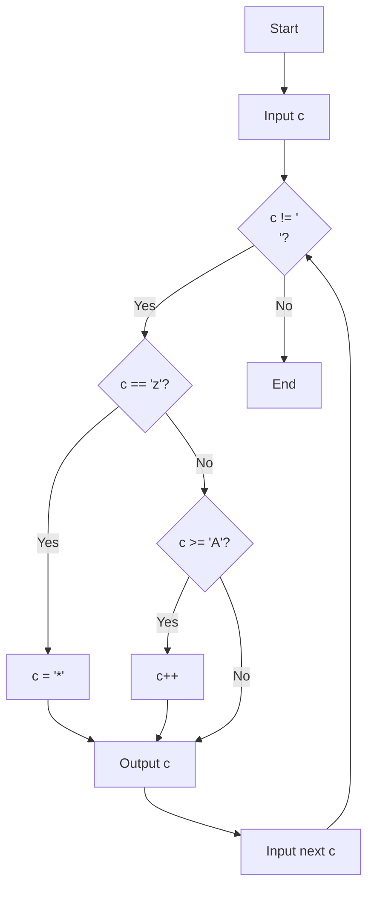
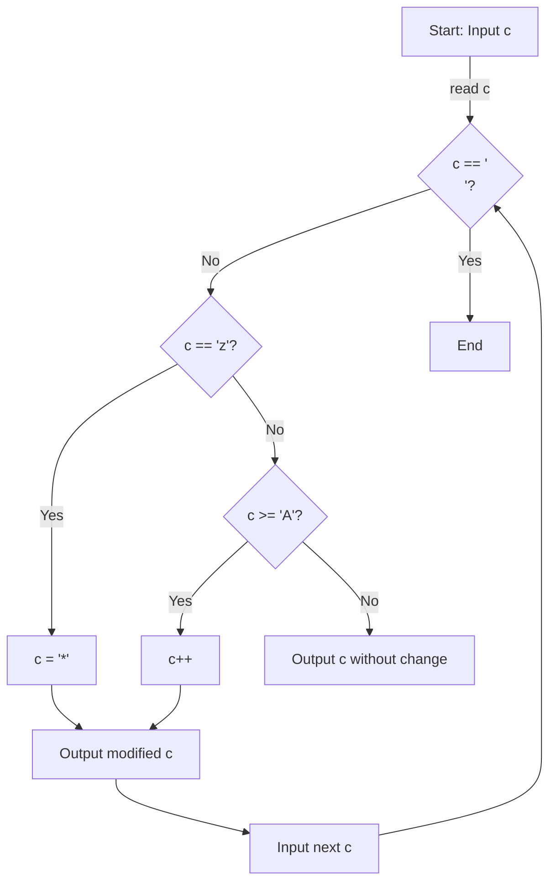
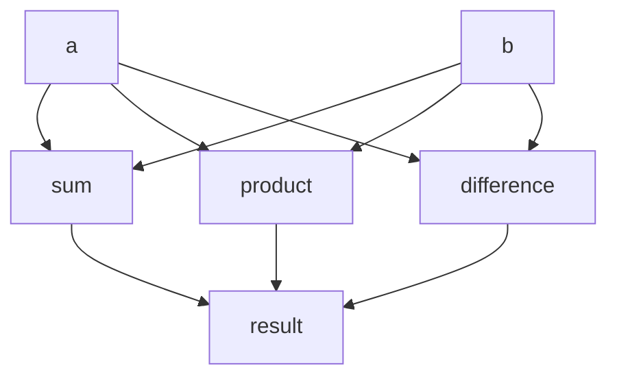
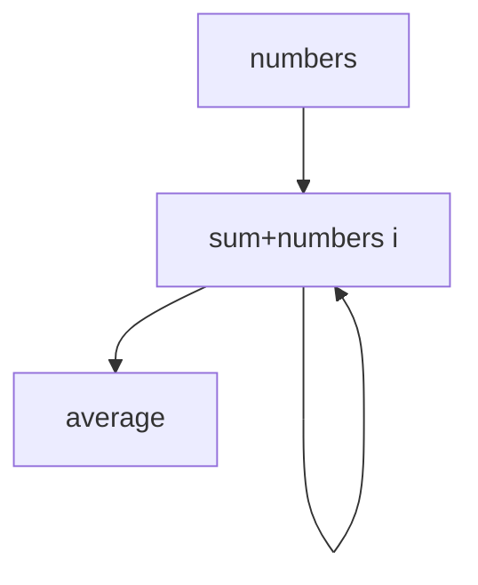
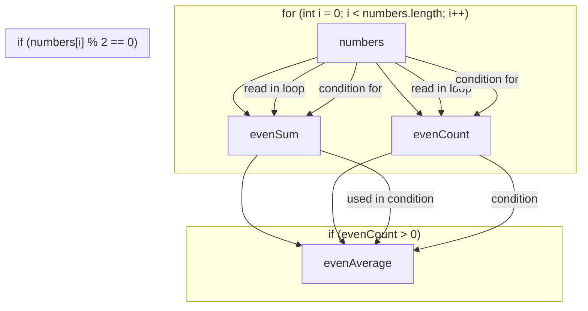

```c
cin.get(c);
while (C != '\n')     // 从标准输入读取第一个字符并将其存储在变量c中。
{
  if (c == 'z')
  {
    c = '*';
  }
  else if (c >= 'A')
  {
    c++;
  }
  cout << c; // 将变换后的字符c打印到标准输出
  cin.get(c); // 从标准输入读取下一个字符，存储在c中，循环继续，直到遇到换行符
}
```








```java
public class ArraySumAndAverage {
    public static void main(String[] args) {
        int[] numbers = {1, 2, 3, 4, 5};
        int sum = 0;
        double average = 0.0;
        
        for(int i = 0; i < numbers.length; i++) {
            sum += numbers[i];
        }
        
        average = sum / numbers.length;
        
        System.out.println("Sum = " + sum);
        System.out.println("Average = " + average);
    }
}

```








