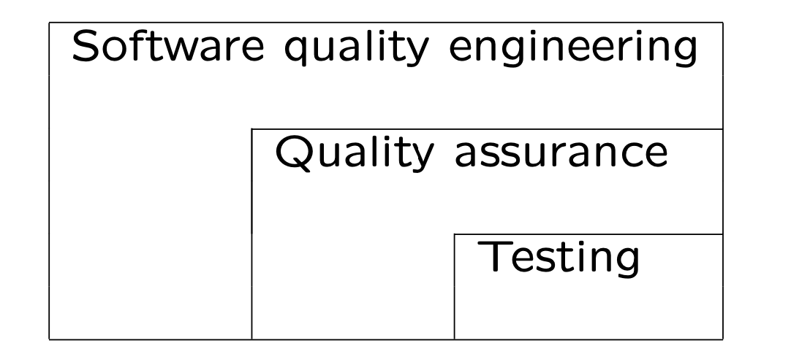
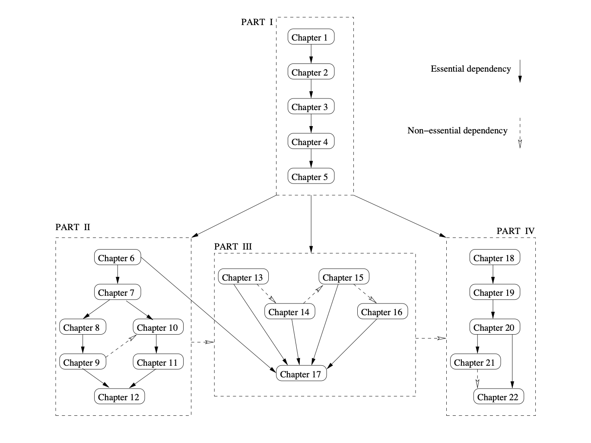

# Chapter 1 Overview

01.23.2024

* Meeting People’s Quality Expectations
* Book Organization/Overview/Usage
* Pre-requisite Knowledge

## 1.1 General Expectations

* General expectation: “good” software quality

* Objects of our study: software

  * software products, systems, and services 
  *  stand-alone to embedded

  * software-intensive systems
  * wide variety, but focus on software

* Quality (and how “good”) formally defined in Ch.2

* People: Consumers vs producers
  - quality expectations by consumers
  - to be satisfied by producers through software quality engineering (SQE)

* Deliver software system that...
  * does what it is supposed to do
    * needs to be “validated”
  * does the things correctly
    * needs to be “verified”
  * show/demonstrate/prove it (“does”)
    * modeling/analysis needed

## 1.2 Meeting Quality Expectations

* Difficulties in achieving good quality:
  * size: MLOC products common 
  * complexity
  * environmental stress/constraints 
  * flexibility/adaptability expected

* Other difficulties/factors:
  * product type
  * cost and market conditions
  * addressed later (especially Part III)

* “no silver bullet”, but...
   SQE (software quality engineering) helps

## 1.3 SQE as an Answer

* Major SQE activities:
  * Testing: remove defect & ensure quality 
  * Other QA alternatives to testing
  * How do you know: analysis & modeling

* Scope and content hierarchy: Fig.1.1 (p.6).

  

> Quality assurance 质量保证

## 1.4 Book Contents

* QA alternatives/SQE activities: 

  (and mapping to our Parts/Chapters)

* Overview and Basics (Part I)

* QA alternatives:

  * Testing (Part II)
  * Other alternatives (Part III) 
  * Overall comparison (Ch.17)

* Analysis and improvement (Part IV)
  * overall mechanism (Ch.18)
  * measurements/models (Ch.19)
  * specific analyses/models (Ch.20∼22)

* Testing (Part II):
  - all topics, but focus on techniques
  - overview and general questions (Ch.6)
  - important common issues (Ch.7)
    * activities/management/automation
  - testing techniques (Ch.8∼11)
  - specialization and integration (Ch.12)

* Testing techniques (Ch.8∼11):
  * organized by underlying models:
    * lists and partitions (Ch.8&9)
    * finite-state machines (Ch.10&11)
  * both black-box and white-box views 
    * all chapters
  * both coverage goals (all chapters) and usage/reliability goals (Ch.8&10)

* Other alternatives (Part III):
  * defect prevention (Ch.13)
  * inspection, review, analysis (Ch.14)
  * formal verification (Ch.15)
  * defect containment (Ch.16)
  * comparison, including testing, (Ch.17)

* Comparing different QA alternative
  - applicability and effectiveness
  - dealing with quality problems/defects:
    * prevention/removal/tolerance
  - cost
  - overall comparison (Ch.17)

## 1.4 Content Dependency

* Dependency: Fig 1.2 (p.10) above

  * Essential (solid-lines): prior knowledge 

  * Part I precedes other (parallel?) parts. 

  * Non-essential (dashed-lines) sequence,

    e.g., simple→complex/top-down/etc.

> 依赖性:图1.2 (p.10)
>
> 必要的(实线):先前的知识
>
> 第一部分先于其他部分(平行的?)
>
> * 非必要(虚线)序列;
>
> 例如,简单→复杂/自上而下/等。

## 1.5 Usage and Readership

* Math/statistics pre-requisite:
  * discrete math, logic, graph, etc. 
  * probability and statistics
  * used in modeling/analysis.

* Background knowledge in CS/SE:
  * computer systems and programming 
  * fundamentals of computing
  * general SE knowledge and experience

* Detailed lists: Section 1.4
  * review/self-study for specific topic