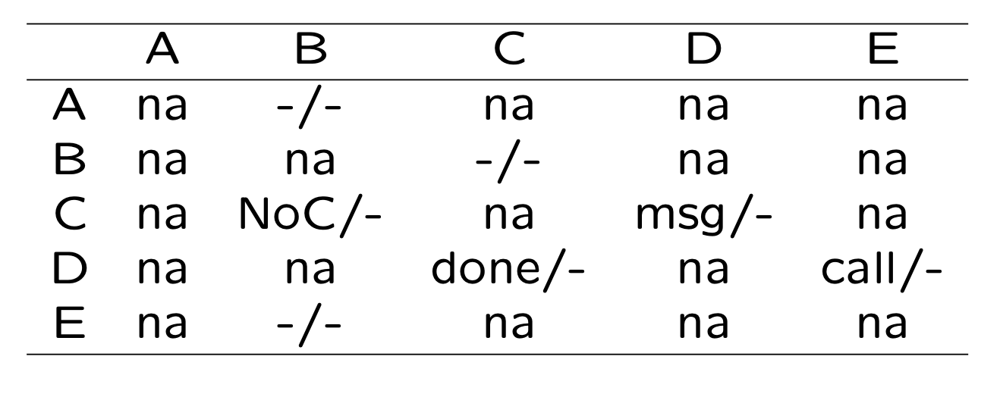
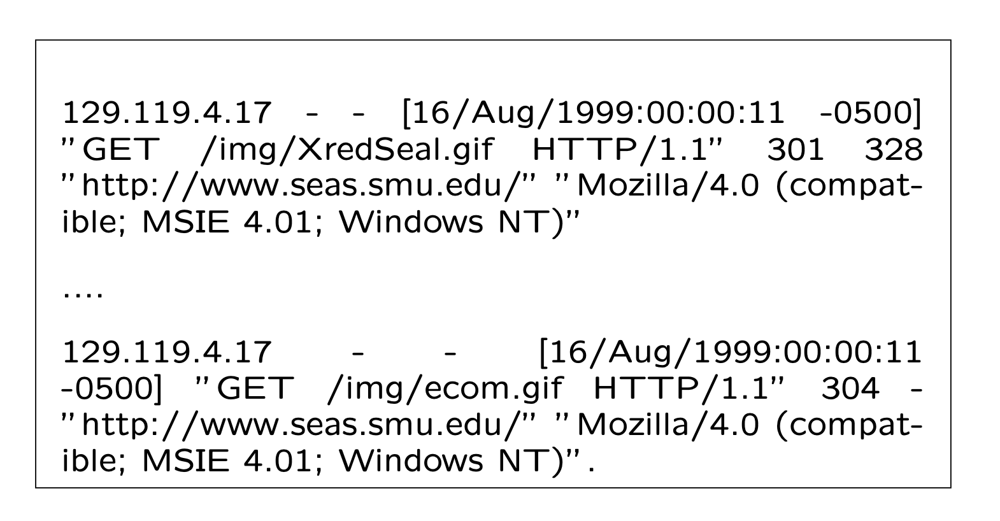
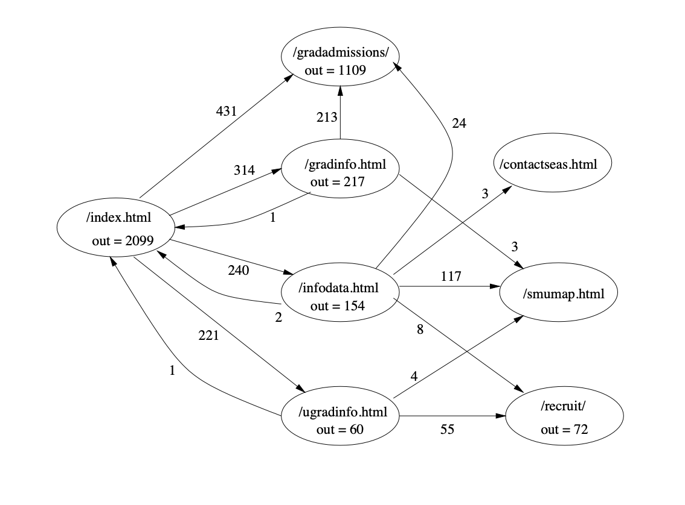

# Chapter 10 Coverage and Usage Testing Based on FSMs and Markov Chains

* Finite-State Machines (FSMs)
* FSM-Based Testing
* Markov Chains as Enhanced FSMs
* Unified Markov Models for Testing

## 10.1 Finite-State Machines (FSMs)

### 10.1.1 Alternative Testing Models

* Motivation: Why FSMs?
  - Complicated operations involve many steps/stages in the end-to-end chain
  - Not modeled in checklists/partitions.
  - Ability to use existing models and structural information
  - Ability to use localized knowledge
  - Local information easy to gather
* FSM: Basic ideas
  * State: operations/functions.
  * Transition: link in a chain.
  * Input/output associated with transition. 
  * Complete operation: chain.

> ###  动机：为什么选择FSMs？
>
> - 复杂操作涉及端到端链中的许多步骤/阶段
> - 在清单/分区中无法建模
> - 能够使用现有模型和结构信息
> - 能够利用局部知识
> - 局部信息易于收集
>
> ### FSM：基本概念
>
> - 状态：操作/功能。
> - 转换：链中的链接。
> - 转换相关的输入/输出。
> - 完整操作：链。
>
> #### 例子解释：
>
> 假设我们有一个在线购物的应用程序，用户需要经过选择商品、添加到购物车、输入地址、选择支付方式、确认支付这几个步骤来完成一次购物。这个购物过程就涉及了许多步骤/阶段，而且这些步骤是有顺序的，一步接一步进行。如果我们用传统的方法，比如清单或分区来建模，就很难体现出这个过程的顺序性和步骤间的依赖关系。而有限状态机（FSM）就能很好地模拟这个过程。
>
> 在FSM中，每一个步骤可以被看作一个状态，比如“选择商品”是一个状态，“添加到购物车”是另一个状态，以此类推。每个状态之间的转换就是用户的操作，比如从“选择商品”状态转换到“添加到购物车”状态，转换的触发操作就是用户点击“添加到购物车”按钮。这样的转换可以关联具体的输入（用户选择的商品）和输出（商品被添加到购物车的反馈）。整个购物过程就是一个状态链，从初始状态“选择商品”开始，到最终状态“确认支付”结束。通过FSM，我们就能清晰地描述和理解整个购物过程。

### 10.1.2 FSMs as Graphs

* FSMs often represented by graphs.
* State/node and properties:
  * Represents status/processing/component 
  * Identification and labeling
  * Other properties: node weights

* Links and link properties:
  - Represent state transitions.
  - Labeling: Often by the nodes they link.
  - Other properties: link weights
    * associated input and output.
  - Directed (e.g., A-B link $\neq$ B-A link).

> ### 10.1.2 FSMs作为图
>
> - FSMs通常由图表示。
> - 状态/节点及其属性：
>   - 表示状态/处理/组件
>   - 识别和标记
>   - 其他属性：节点权重
> - 链接及链接属性：
>   - 表示状态转换。
>   - 标记：通常按它们连接的节点。
>   - 其他属性：链接权重
>     - 关联输入和输出。
>   - 有向的（例如，A-B链接 ≠ B-A链接）。
>
> #### 例子解释：
>
> 想象一下，我们有一个用于处理用户订单的系统，可以用FSM图来表示。在这个系统中，有几个状态：订单创建（A）、订单审核（B）、支付处理（C）和订单完成（D）。
>
> 在FSM图中，这些状态被表示为节点，每个节点都有其标签和可能的权重（如果我们需要强调某些状态的重要性）。例如，订单创建状态（A）可以是起始节点，订单完成状态（D）可以是终止节点。
>
> 状态之间的转换被表示为有向链接。例如，从订单创建（A）到订单审核（B）的状态转换可以表示为一个从A到B的有向链接。这个链接可以被标记为“审核”，并且可以有一个链接权重，这个权重可以基于转换的频率或与该转换相关联的输入和输出的重要性。
>
> 如果我们考虑输入和输出，这些可以与每个链接相关联。例如，从订单创建到订单审核的转换（A到B的链接）可能关联着输入（订单细节）和输出（审核状态）。
>
> 这种表示法清晰地说明了订单处理系统的流程，每个状态何时发生，以及它们是如何通过用户操作或系统处理从一个状态转移到另一个状态的。通过这种方式，FSMs作为图提供了一个直观的方式来理解和分析系统的行为。

### 10.1.3 Types of FSMs

* Types of FSMs:
  * Classification by input/output. 
  * Classification by state.
  * Other classifications possible.

* FSM types by input/output representation:
  * Mealy model: both input and output associated with transitions
  * Moore model: output represented as separate states.
  * Mealy model used in this book.
* Classification by state representation.
  - Type I. state = status, with most of the processing and I/O at transition.
  - Type II. transition = I/O free link, with most of the processing and I/O at state.
  - We use both, and mixed type too.

- Type I & II as Mealy models:
  - Type I: classical Mealy model.
  - Type II: modified Mealy model, I/O not explicitly represented in FSMs.
  - Mixed type: used for convenience if not leading to confusion.

* Type I example: classical Mealy model.
  * also web testing example in Section 10.3.
* States:
  * “initial” state: when program starts,
  * “final” state: where program terminates, 
  * other states (and transitions below).
* State transitions accompanied by some pro- cessing and associated I/O:
  * performing user-oriented functions
  * execution some statements
  * I/O associated with above (or empty)

* Type II example: control flow graph (CFG) or flow chart in Chapter 11.
* Mixed type for convenience:
  * Hard to restrict to one type ⇒ use mixed type.
  * Ensure no confusion.
  * Key: significant difference among states so that state transitions are meaningful.

* Mixed type example: Fig 10.1 (p.151)
  * states with processing: A, B, D, E
  * state w/o processing: C (status)
  * transitions: implicit or no output
    * explicit input: C-D, C-B, D-C, D-E.
    * implicit/no input: A-B, B-C, E-B.

> ###  10.1.3 FSM的类型
>
> - FSM的分类：
>   - 根据输入/输出分类。
>   - 根据状态分类。
>   - 还有其他可能的分类。
> - 根据输入/输出表示的FSM类型：
>   - Mealy模型：输入和输出都与转换相关联
>   - Moore模型：输出表示为单独的状态。
>   - 本书中使用Mealy模型。
> - 根据状态表示的分类。
>   - 类型I. 状态 = 状态，大部分处理和I/O在转换时发生。
>   - 类型II. 转换 = 自由I/O链接，大部分处理和I/O在状态时发生。
>   - 我们使用这两种，也使用混合类型。
>
> - 类型I和II作为Mealy模型：
>   - 类型I：经典Mealy模型。
>   - 类型II：修改过的Mealy模型，I/O在FSMs中不明确表示。
>   - 混合类型：如果不会导致混淆，出于方便使用。
>
> - 类型I示例：经典Mealy模型。
>   - 也是10.3节中Web测试的例子。
> - 状态：
>   - “初始”状态：程序开始时，
>   - “最终”状态：程序终止的地方，
>   - 其他状态（和下面的转换）。
> - 状态转换伴随着一些处理和相关的I/O：
>   - 执行用户导向的功能
>   - 执行某些声明
>   - 与上述相关的I/O（或为空）
> - 类型II示例：第11章中的控制流图（CFG）或流程图。
> - 为方便起见的混合类型：
>   - 难以限制为一种类型 ⇒ 使用混合类型。
>   - 确保没有混淆。
>   - 关键：状态之间有明显差异，以便状态转换有意义。
> - 混合类型示例：图10.1（第151页）
>   - 有处理的状态：A、B、D、E
>   - 没有处理的状态：C（状态）
>   - 转换：隐含或无输出
>     - 显式输入：C-D, C-B, D-C, D-E。
>     - 隐含/无输入：A-B, B-C, E-B。

> > 举例解释 
> >
> > 以您提供的图为例，我们可以将一个有限状态机（FSM）比作一个移动电话通话处理的流程：
> >
> > - 状态 A（Power-up）: 这是启动或“上电”状态，就像您开启手机电源时的状态。
> > - 状态 B（Mobile Station Initialization）: 初始化状态，设备正在启动并准备好连接到网络，相当于手机正在搜索信号并注册到网络。
> > - 状态 C（Mobile Station Idle）: 空闲状态，手机已经注册到网络并等待操作，如接收呼叫或短信。
> > - 状态 D（System Access）: 系统访问状态，代表用户尝试进行呼叫或数据传输时手机与网络的交互。
> > - 状态 E（Mobile Station Control on Traffic Channel）: 流量控制状态，指的是通话或数据传输正在进行时的状态。
> >
> > 在这个FSM中，每个状态都代表电话在不同情况下的不同操作或功能。转换表示从一个状态到另一个状态的链接，这些转换通常伴随着某些操作，比如：
> >
> > - A-B转换：开机后自动进入初始化。
> > - B-C转换：初始化完成后，设备变为等待状态。
> > - C-D转换：用户发起呼叫，设备开始建立系统连接。
> > - D-E转换：通话建立，进入流量通道控制状态。
> >
> > 这些转换可以是有方向的，比如A-B转换不等同于B-A，表示流程是有序且不可逆的。在某些情况下，状态转换可能会因为特定的输入而触发，比如用户发起呼叫，或者由于接收到特定消息，如C状态下接收到寻呼通道消息，会触发转换到D状态。
> >
> > 整个操作链条（A-B-C-D-E）就像用户从开机到进行通话的完整过程。每个转换可能会有相关的输入（如发起呼叫的请求）和输出（如系统反馈表示呼叫已经建立）。通过FSM，我们能清晰地描述和理解移动电话在通话处理过程中的不同阶段和它们之间的关系。

### 10.1.4 FSM Representation

- FSM as a table/matrix

- Cell (x, y): I/O associated with transition from state x to state y.

  * “na”: transition not allowed.

- Table 10.1 (p.152) for FSM in Fig 10.1. ABCDE

  

> - FSM作为表/矩阵
> - 单元格(x, y)：与从状态x到状态y的转换相关联的输入/输出。
>   - “na”：不允许转换。

> > #### 解释：
> >
> > 这个表是图10.1中的FSM的表格表示。每个单元格代表了从一个状态到另一个状态的可能转换，其中包括转换相关联的输入/输出信息。例如：
> >
> > - 单元格 (C, D) 中 "msg/-" 表示从状态C到状态D的转换是在接收到寻呼频道消息的情况下发生的，没有关联的输出。
> > - 单元格 (D, E) 中 "call/-" 表示从状态D到状态E的转换是在用户发起呼叫时发生的，没有关联的输出。
> >
> > "na" 表示从一个状态到另一个状态的转换不允许。例如，单元格 (A, B) 中的 "na" 意味着从状态A直接到状态B的转换是不可能的。
> >
> > 在FSM的测试和应用中，这种表格表示方法可以帮助我们更清晰地理解系统的可能转换路径，并指导我们设计测试用例以覆盖这些路径。在实际应用中，测试者可以使用这种表格来确定需要测试哪些状态转换，以确保系统的所有关键路径都经过了充分的测试。

### 10.1.5 FSM/Graph Representation

* Types of graphs:

  * Directed graph: FSM etc.
  * Undirected graph: neighbor-relation, etc. 
  * Connectivity vs. disconnected graphs.

* Graph representation:

  - Graphical: good for human processing (mostly in the book)
  - Tables/matrices: machine processing
  
  - Lists: compact sets of items like {C, B, “unable to receive paging channel”, -}
  
  - Conversion: easy, but need to know how.

> ###  10.1.5 FSM/图形表示
>
> - 图的类型：
>   - 有向图：FSM等。
>   - 无向图：邻居关系等。
>   - 连通图与非连通图。
> - 图形表示：
>   - 图形表示：适合人类处理（本书中大多数情况）
>   - 表格/矩阵：适合机器处理
>   - 列表：紧凑的项目集，例如 {C, B, “无法接收寻呼频道”, -}
>   - 转换：容易，但需要知道方法。
>
> 在软件测试和系统建模中，这些不同的图形表示方法可以根据使用场景的不同被采用。例如，当需要向人呈现或讨论一个系统的状态转换时，图形表示非常直观。但是，当涉及到自动化工具进行分析或执行时，表格/矩阵表示更易于机器处理。列表表示则提供了一种紧凑的格式，易于存储和传输。
>
> 图形转换到表格或列表是常见的任务，在开发测试案例或者执行测试自动化的过程中尤为重要。理解这些表示方法之间的转换，有助于测试者和系统设计者更有效地使用工具和算法来管理复杂的系统状态和转换。

## 10.2 FSM-Based Testing

### 10.2.1 Basic FSM Testing

* Typical problems:

  - Missing, extra, or incorrect states.

  - Missing, extra, or incorrect transitions.

  - Input problems: treat as related state or transition problems.

  - Output problems: as oracle problems.

* Basic approach:

  - Missing/extra states/transitions dealt with at FSM construction stage.
  - Basic coverage: Node and link coverage via state traversal based on graph theory and algorithms.
  - Assuming correct functioning of individ- ual state ensured by lower level testing.
  
* Checking for missing/extra states/links during model construction.

* Model construction steps:

  * Identify info. sources and collect data. 
  * Construct initial FSM.
  * Model refinement and validation.
  
* Identify information sources and collect data.
  
  - external functional behavior (black-box): – specification, usage scenarios, etc.
  - internal program execution (white-box): – design, code, execution trace, etc.
  - also existing test cases, documents, etc.
  - key: linking individual pieces together.

* Construct initial FSM.
  - state identification and enumeration (states↑↑ ⇒ nested/hierarchical FSMs)
  - transition/link identification
  - identify I/O relations (as test oracles)
  - key sub-step: link identification
* Link identification and problem detection:
  * identify all possible input for each state,
  * input values may be partitioned (Ch. 9)
  * each partitioned subset/subdomain associated with a state transition
  * undefined transition for some input ⇒ missing state or extra link identified.
  * extra state or missing link identified by the collective states and transitions (or by connectivity algorithm later)

*  Model refinement and validation.

  - Refinement with additional states/links.

  - State explosion concerns

    * at most “dozens” of states in FSMs

  - Proper granularity needed

    ⇒ use of nested/hierarchical FSMs 

* Applicability:

  * Suitable for menu driven software.
  * Systems with clearly identified states/stages. 
  * Interactive mode (many I/O pairs).
  * Control systems, OOS, etc.

* Key limitation: state explosion!
   ⇒ nested FSMs, or Markov chains (later)

* Node/link coverage via state traversal
  - Based on graph theory/algorithms.
  - States directly covered.
  - Link coverage: starting from state in combination with input domain testing ideas (Ch.8&9).
* Implementation issues:
  - Sensitization: easy, with specific input.
  - State cover: series of links with input.
  - Capability to “save” state information:
    * help with link coverage from the state,
    * state traversal w/o much repeating.
  - Oracle: output with link (and destination state too!)

> ### 10.2 基于FSM的测试
>
> #### 10.2.1 基本FSM测试
>
> - 典型问题：
>
>   - 缺失、多余或错误的状态。
>   - 缺失、多余或错误的转换。
>   - 输入问题：当作相关的状态或转换问题处理。
>   - 输出问题：当作测试预言器问题处理。
>
> - 基本方法：
>
>   - 在FSM构建阶段处理缺失/多余的状态/转换。
>   - 基本覆盖：通过基于图论和算法的状态遍历实现节点和链接覆盖。
>   - 假设由低级测试确保的个别状态的正确功能。
>
> - 在模型构建过程中检查缺失/多余的状态/链接。
>
> - 模型构建步骤：
>
>   - 确定信息源并收集数据。
>   - 构建初始FSM。
>   - 模型细化和验证。
>
> - 确定信息源并收集数据。
>
>   - 外部功能行为（黑盒）：– 规格说明、使用场景等。
>   - 内部程序执行（白盒）：– 设计、代码、执行追踪等。
>   - 还包括现有的测试用例、文档等。
>   - 关键：将个别部分链接在一起。
>
> - 构建初始FSM。
>
>   - 状态识别和枚举（状态数量↑↑ ⇒ 嵌套/层次FSMs）
>   - 转换/链接识别
>   - 确定I/O关系（作为测试预言器）
>   - 关键子步骤：链接识别
>
> - 链接识别和问题检测：
>
>   - 识别每个状态的所有可能输入，
>   - 输入值可能被分区（第9章）
>   - 每个分区子集/子域与状态转换相关联
>   - 一些输入未定义的转换 ⇒ 识别缺失状态或多余链接。
>   - 通过集合状态和转换识别出的多余状态或缺失链接（或稍后通过连通性算法）
>
> - 模型细化和验证。
>
>   - 使用额外的状态/链接进行细化。
>
>   - 状态爆炸问题
>
>     - 在FSMs中最多“几十个”状态
>
>   - 需要适当的粒度
>
>     ⇒ 使用嵌套/层次FSMs
>
> - 适用性：
>
>   - 适合菜单驱动软件。
>   - 有明确标识的状态/阶段的系统。
>   - 交互模式（许多I/O对）。
>   - 控制系统、OOS等。
>
> - 主要限制：状态爆炸！ ⇒ 嵌套FSMs或马尔可夫链（稍后讨论）
>
> - 通过状态遍历实现节点/链接覆盖
>
>   - 基于图论/算法。
>   - 状态直接覆盖。
>   - 链接覆盖：从状态开始结合输入域测试思想（第8&9章）。
>
> - 实施问题：
>
>   - 敏化：易于实现，具体输入。
>   - 状态覆盖：一系列带输入的链接。
>   - “保存”状态信息的能力：
>     - 帮助从状态开始进行链接覆盖，
>     - 状态遍历无需多次重复。
>   - 预言器：链接（和目标状态！）的输出。

> > 
> > 以一个网上银行系统为例，来解释FSM的测试以及它在检测问题、构建模型和测试实施中的应用：
> >
> > #### 基本FSM测试
> >
> > **典型问题：**
> >
> > - 缺失的状态：例如，用户登录后没有被正确地引导到账户总览页面。
> > - 多余的转换：用户从转账页面不经意中跳转到了信用卡申请页面，这在应用流程中是不应存在的路径。
> > - 输入问题：如果用户输入了不合法的字符而系统没有给出错误提示。
> > - 输出问题：用户完成交易后没有收到确认信息。
> >
> > **基本方法：**
> >
> > 在构建FSM的阶段，需要识别所有的状态和状态间的合法转换。通过对图论的应用，我们可以确保通过测试用例覆盖所有的节点和链接。
> >
> > **模型构建步骤：**
> >
> > 1. **识别信息源和收集数据：**
> >    - 对于黑盒测试，可能需要收集规格说明和使用场景。
> >    - 对于白盒测试，可能需要访问设计文档、代码和执行追踪。
> > 2. **构建初始FSM：**
> >    - 识别状态，例如，“登录”、“账户总览”、“转账”等。
> >    - 识别转换，如从“登录”到“账户总览”的转换。
> > 3. **模型细化和验证：**
> >    - 如果发现了额外的状态或转换，需要细化模型并验证这些新增加的部分。
> >
> > #### 测试实施
> >
> > - **敏化：** 确定每个测试用例需要的特定输入数据。
> > - **状态覆盖：** 创建测试用例来遍历状态，模拟用户从一个操作到另一个操作的流程。
> > - **保存状态信息：** 如果测试需要从某个特定状态开始，能够“保存”状态信息将帮助测试人员从该状态继续测试，而不需要重头开始。
> > - **预言器：** 对于每个转换，预期的输出需要在测试前定义好，以便于执行结果验证。
> >
> > 例如，在网上银行系统中，客户登录后通常预期看到的是他们的账户总览。这可以被视为一个状态（登录后的页面）。从这个状态出发，用户可能会执行多种操作，如查看最近交易（状态转换）、进行转账（另一状态转换）、修改个人信息等。每个操作都是从当前状态通过一个链接（用户操作）到达新的状态。在测试过程中，我们将确保每个预期的状态和状态间的转换都被测试到，任何不应存在的状态或转换都被识别和修正。

### 10.2.2 Case Study: FSMs for Web Testing

* Web applications vs. menu-driven systems:
  * Many similarity but significant differences. 
  * Computation vs. information/document. 
  * Separate vs. merged navigations.
  * Entry/exit/control difference.
  * Differences in population size/diversity. 
  * Layers in web applications.

* Web layers: Fig. 10.2 (p.158)

  

* Web problems: What to test:

  - Reliability: failure-free content delivery.
  - Failure sources identified accordingly:
    *  host or network failures
    *  browser failures
    *  source or content failures 
    *  user problems
  - Focus on source/content failures

* Web source/content components:

  * HTML and other documents
  * Programs (Java/JavaScript/ActiveX/etc.) 
  * Data forms and backend databases
  * Multi-media components

> ###  10.2.2 案例研究：基于Web的测试的FSMs
>
> - Web应用程序与菜单驱动系统：
>   - 许多相似之处但也有显著差异。
>   - 计算 vs. 信息/文档。
>   - 分开 vs. 合并导航。
>   - 入口/出口/控制差异。
>   - 人群规模/多样性差异。
>   - Web应用程序中的层次。
> - Web层次：图 10.2 (第158页)
> - Web问题：要测试什么：
>   - 可靠性：无故障的内容交付。
>   - 相应地确定故障源：
>     - 主机或网络故障
>     - 浏览器故障
>     - 来源或内容故障
>     - 用户问题
>   - 关注来源/内容故障
> - Web来源/内容组件：
>   - HTML和其他文档
>   - 程序（Java/JavaScript/ActiveX等）
>   - 数据表单和后端数据库
>   - 多媒体组件

> > #### 举例解释：
> >
> > 让我们考虑一个Web电子商务平台来举例说明基于Web的测试中FSMs的使用。这个平台有不同的层次：
> >
> > - 客户端 - Web浏览器：用户使用浏览器浏览商品，添加商品到购物车。
> > - Web服务器：处理用户的HTTP请求，显示网页内容。
> > - 中间件：连接Web服务器和数据库的软件，处理业务逻辑。
> > - 数据库 - 后端：存储商品信息，用户数据，订单信息等。
> >
> > 在测试这个Web平台时，我们关注的不仅仅是功能（比如能否添加商品到购物车），而且还有可靠性（页面是否总是正常加载），以及用户可能面临的问题（如网络延迟导致的加载失败）。Web应用程序的每个层次都需要被测试以确保整体系统的健康。例如：
> >
> > - 如果测试发现用户经常在特定时间无法访问网站，可能是因为Web服务器在高流量时出现性能瓶颈。
> > - 如果特定浏览器上的用户经历了兼容性问题，可能是浏览器故障层面的问题。
> > - 如果用户在填写表单时数据没有正确保存，可能是中间件或数据库后端的故障。
> >
> > 在这种情况下，FSM用于模拟用户在Web应用程序中的不同操作路径。例如，一个可能的FSM状态链可能是：“查看商品” → “添加到购物车” → “进入结账页面” → “填写地址” → “选择支付方式” → “完成购买”。每个状态都代表用户在购买流程中的一个步骤，而状态之间的转换表示从一个步骤到下一个步骤的操作。
> >
> > 通过基于FSM的测试，我们可以确保所有关键的用户路径都经过了测试，这有助于识别可能的故障点，从而提高Web平台的整体可靠性。

### 10.2.3 FSMs for Web Testing

* Testing of individual components:
   ≈ traditional testing (mostly coverage).

* Testing of overall operation:
  * FSMs for navigation/usage
  * States = pages
  * Transitions = embedded links (direct URLs not by content providers)
  * I/O: clicks & info. loading/displaying.

* Difficulty: size!
   ⇒ extending FSMs for selective testing.

> ###  10.2.3 基于Web的测试的FSMs
>
> - 单个组件的测试： ≈ 传统测试（主要是覆盖率）。
> - 整体操作的测试：
>   - FSMs用于导航/使用
>   - 状态 = 页面
>   - 转换 = 嵌入链接（不是内容提供者的直接URL）
>   - I/O：点击和信息加载/显示。
> - 困难：规模！ ⇒ 扩展FSMs以进行选择性测试。

> > #### 举例解释：
> >
> > 假设我们有一个网上购物网站，我们想要测试整个网站的导航系统。我们会用FSMs来建立整个网站的一个模型，这个模型将包括：
> >
> > - 状态，每个状态代表网站上的一个页面，比如首页、商品详情页、购物车页面等。
> > - 转换，代表从一个页面到另一个页面的链接，比如从首页点击进入商品详情页的链接。
> >
> > 在这种模型中，输入/输出（I/O）将是用户点击和页面加载的信息。例如，当用户点击“添加到购物车”时，我们预期会发生以下事件：触发一个从商品详情页到购物车页面的状态转换（I/O），并且购物车页面上会显示新添加的商品信息。
> >
> > 然而，由于Web网站可能包含成千上万个页面，建立一个全面的FSM可能非常庞大且难以管理。为了应对这个问题，我们可能需要将FSM扩展为选择性测试。这意味着我们专注于最重要的页面和最常用的导航路径，比如那些从首页到商品购买流程的关键路径，而不是网站的每一个单独链接。通过这种方式，我们能集中资源和努力，确保用户最可能互动的部分经过了充分的测试，这可以通过分析用户的浏览数据来确定。

## 10.3 Markov Chains as Enhanced FSMs

### 10.3.1 Markov Usage Model: Overview

* Markov-chain OP models
  * State transitions and probability
  * Markov property
  * Attractive in interactive systems, GUI, and many state-transition types
  * Structural and conceptual integrity
* Comparison with Musa OP:
  * Similar to FSM vs list/partitions.
  * Musa OP as collapsed Markov chains. 
  * Coverage: harder to achieve.

> #### 10.3.1 马尔可夫使用模型：概述
>
> - 马尔可夫链操作概况（OP）模型
>   - 状态转换和概率
>   - 马尔可夫性质
>   - 在交互式系统、图形用户界面和许多状态转换类型中具有吸引力
>   - 结构和概念完整性
> - 与Musa OP的比较：
>   - 类似于FSM与列表/分区的比较。
>   - Musa OP可以视为折叠的马尔可夫链。
>   - 覆盖：更难实现。

> > 假设我们有一个在线视频流平台，用户可以浏览视频、播放、暂停、添加到收藏列表或评论。这个平台可以用马尔可夫链操作模型（OP）来表示，其中的状态是用户在平台上可能处于的不同界面或操作，如“浏览视频列表”、“观看视频”、“视频暂停”等，而状态转换对应于用户的行为，如从视频列表选择视频进行观看，或者在观看时暂停视频。
> >
> > 在这个马尔可夫链模型中，每个状态转换都与一个概率相关联，表示用户从一个状态转移到另一个状态的可能性。例如，用户可能有一个很高的概率（假设为80%）从“浏览视频列表”状态转移到“观看视频”状态。这种概率反映了用户的行为模式，并且是“无记忆的”（Markov性质），意味着下一步的状态仅取决于当前状态和转换概率，而与之前的状态无关。
> >
> > 与Musa的操作概况（OP）相比，马尔可夫链提供了一种考虑状态间复杂关系的方法。如果我们使用Musa OP，整个用户行为可能被折叠为一个简化的模型，例如将所有观看行为简化为一个单一的操作，而不考虑用户是如何到达播放页面的。这种简化可能会使得某些用户路径的重要性被低估，从而在测试覆盖方面面临挑战。例如，在马尔可夫模型中，“从推荐列表中选择视频”和“从搜索结果中选择视频”可能是两个不同的状态转换，而在Musa OP中，它们可能被视为相同的“观看视频”操作。
> >
> > 总结来说，马尔可夫链操作模型提供了一种捕捉和分析复杂交互式系统中用户行为的强大工具，使得测试可以更加集中于用户最有可能遵循的路径，同时保持了结构和概念的完整性。

### 10.3.2 Markov Usage Model

* Applications:
  - Similar to flat OP (Musa), but captures more detailed information
  - Models functional structure and usage
  - Test case generation more complex
  - Result: both analytical and observational
* Background and Linkage:
  * Augmented FSMs.
  * Cleanroom background: testing technique and tools
  *  (Whittaker and Thomason, 1994)
    *  TSE 20(10):812-824 (10/94)
  * UMM and web testing at SMU

> ###  10.3.2 马尔可夫使用模型
>
> - 应用：
>   - 类似于平面OP（Musa），但捕获更详细的信息
>   - 建模功能结构和使用
>   - 测试用例生成更为复杂
>   - 结果：既有分析性的也有观察性的
> - 背景和联系：
>   - 增强的FSMs。
>   - 清洁室背景：测试技术和工具
>   - （Whittaker和Thomason，1994）
>     - TSE 20(10):812-824 (10/94)
>   - SMU进行的UMM和Web测试

> > #### 举例解释：
> >
> > 想象一下，我们正在开发一款社交媒体应用程序。在这种类型的应用程序中，用户可能会浏览新闻源、发帖、评论、点赞或分享内容。我们可以使用马尔可夫使用模型来分析和预测用户的行为。
> >
> > 例如，用户可能有60%的概率在浏览新闻源后发帖，有30%的概率在浏览后进行评论，以及10%的概率在浏览后点赞。这种模型可以帮助我们理解用户最常采取的行动，并确保我们的测试覆盖这些行为。
> >
> > 在实际应用中，马尔可夫使用模型可以用来指导测试用例的生成。如果数据表明用户经常浏览新闻源然后发帖，我们可能会产生一系列测试用例，这些测试用例模拟从登陆应用程序到浏览新闻源、发帖的过程。我们可以在这个过程中检查每个步骤的性能，确保用户界面是直观的，并且应用程序可以有效处理发帖请求。
> >
> > 马尔可夫模型背后的科学和工具——特别是在Whittaker和Thomason的作品中描述的——为我们提供了一种结构化的方法来建模和测试软件系统。在SMU进行的UMM和Web测试的实际案例研究表明，马尔可夫使用模型不仅能够捕获用户行为的复杂性，而且能够有效地用于实际的软件测试，使得测试工作可以更聚焦于用户实际使用过程中的关键路径和功能。

### 10.3.3 Markov OP

* Example Markov chains: Fig 10.3 (p.162)

  

  

* FSMs with probabilistic state transition $p_{ij}$, probability from state $i$ to state $j$
  $$
  0 \leq p_{ij} \leq, \text{ and } \sum_jp_{ij} = 1
  $$

> - 马尔可夫链示例：图 10.3 (第162页)
>
>   （图像未显示）
>
> - 带有概率状态转换 $p_{ij}$的FSMs，从状态 *i* 到状态 *j* 的概率
>   $$
>   0 \leq p_{ij} \leq, \text{ and } \sum_jp_{ij} = 1
>   $$

> > #### 举例解释：
> >
> > 设想我们有一个基于马尔可夫链的手机通信系统。在这个系统中，手机的每个状态（如开机、初始化、空闲等）都对应于马尔可夫链中的一个节点，而用户或系统事件（如接收信息、发起呼叫等）则触发从一个状态到另一个状态的转换。每个转换都有一个与之相关联的概率 $p_{ij}$，表示在任何给定时间点，系统从状态 *i* 转换到状态 *j* 的可能性。
> >
> > 在图示的马尔可夫链中，例如：
> >
> > - 状态 A（Power-up）到状态 B（Mobile Station Initialization）的转换概率为*p(*A*,*B)=1，表示开机后总是会进入初始化状态。
> > - 状态 C（Mobile Station Idle）到状态 D（System Access）的转换概率为 p*(*C*,*D)=0.99，意味着当手机处于空闲状态时，有 99% 的可能性接下来会访问系统（例如接收到消息或用户尝试发起呼叫）。
> > - 相反，从状态 C 返回到状态 B（初始化状态）的可能性很小，转换概率为 p*(*C*,*B*)=0.01。
> >
> > 使用马尔可夫链来指导测试案例的生成，可以帮助测试者集中精力于最可能的用户行为和系统反应路径，而不是不太可能发生的路径。比如，在设计测试时，我们可以选择更可能发生的转换（例如，状态 C 到 D 的概率为 99%）作为测试的焦点，而不是那些不太可能发生的转换（如，状态 C 到 B 的概率仅为 1%）。这有助于资源分配，优化测试过程，并确保测试案例覆盖最关键和最常见的系统使用情景。

## 10.4 Unified Markov Models for Testing

### 10.4.1 Markov OP and UMMs

* Memoryless or Markovian property: 
  $$
  P{X_{n+1} = j|X_n = i,X_{n−1} = s_{n−1},...,X_0 = s_0}\\
  = P{X_{n+1} = j|X_n = i} \\ 
  = p_{ij}.
  $$
  
* Markov chain: $p_{ij}$ history independent

  * most well-studied stochastic process 
  * rich analytical/theoretical results
  * many applications

* UMM: Unified Markov Models

  * Hierarchical modeling idea.
  * Markov chains at different-levels.
  * More flexibility for statistical testing.

> #### 10.4.1 马尔可夫操作概况和UMMs
>
> - 无记忆性或马尔可夫性质：
>
>   
> $$
>   P{X_{n+1} = j|X_n = i,X_{n−1} = s_{n−1},...,X_0 = s_0}\\
>   = P{X_{n+1} = j|X_n = i} \\ 
>   = p_{ij}.
> $$
>   这意味着在马尔可夫链中，系统下一个状态的概率仅取决于当前状态和从当前状态到下一个状态的概率，而与之前的历史无关。
>
> - 马尔可夫链$p_{ij}$ 与历史无关
>
>   - 最广泛研究的随机过程
>   - 丰富的分析/理论成果
>   - 众多应用场景
>
> - UMM：统一马尔可夫模型
>
>   - 分层建模思想。
>   - 不同层级的马尔可夫链。
>   - 对统计测试提供更多的灵活性。

> > #### 举例解释：
> >
> > 设想一家大型电商网站，它包含从浏览商品、添加到购物车、结账、支付到最终购买等一系列复杂的用户互动。在这种情况下，UMM（统一马尔可夫模型）可以用来建模这个过程的不同层级。
> >
> > 在最顶层，我们可能有一个马尔可夫链，其状态表示网站的主要部分，如主页、产品目录、特价商品页面等。每个状态都有与之相关联的转换概率，描述了用户从一个页面导航到另一个页面的可能性。
> >
> > 在这个框架内，我们可能会对某些状态进行更细致的建模，例如，产品目录页面可以有自己的UMM，具体到不同类型的商品和类别。
> >
> > 这种层次化的建模方法提供了测试不同用户行为场景的灵活性，允许我们更精确地定义在网站的不同部分进行测试的优先级。例如，如果从数据中我们观察到大多数用户都会在特价商品页面上花费很多时间，我们可以为这个特定部分创建一个具有高转换概率的详细UMM，以确保这一关键路径得到充分的测试。
> >
> > 统一马尔可夫模型的层次化特性也支持了统计测试的灵活性，使得我们可以选择性地针对用户最可能执行的操作序列进行测试，从而优化资源分配并确保测试案例能够覆盖最关键的系统使用场景。

### 10.4.2 UMM Example

* Example UMM:
  * Fig 10.3 (p.162): top-level Markov OP 
  * expand state E into Fig 10.4 (p.163) above

> ###  10.4.2 UMM示例
>
> - 示例UMM：
>   - 图 10.3（第162页）：顶层马尔可夫操作概况（Markov OP）
>   - 将状态E扩展为上面的图 10.4（第163页）

> > #### 解释：
> >
> > 让我们考虑一个手机通信过程的统一马尔可夫模型（UMM）示例。在这个模型中，手机通信过程被分解成一系列可能的状态，每个状态代表通信过程的一个特定阶段，例如：
> >
> > - E1（Traffic Channel Initialization）: 流量通道初始化。
> > - E2（Waiting for Order）: 等待命令。
> > - E3（Waiting for Mobile Station Answer）: 等待移动站回答。
> > - E4（Conversation）: 通话中。
> > - E5（Release）: 释放或通话结束。
> >
> > 每个状态转换都有一个与之相关联的概率，如 *p*(*E*1,*E*2)=0.5 表示从“流量通道初始化”到“等待命令”状态的概率为50%。
> >
> > 这个UMM可以用于描述并测试通信系统的行为，其中的每个状态都可以是测试的一个焦点。测试可以依据转换概率的高低来决定测试路径，以此模拟用户最可能采取的通信行为。例如，如果状态E3到E4的转换概率 *p*(*E*3,*E*4)=0.95 非常高，那么这个转换就是测试的一个关键焦点，因为这意味着一旦等待移动站回答，它几乎总是会进入通话状态。
> >
> > 在更复杂的通信系统中，UMM提供了更多的灵活性，因为它允许在不同层次上模型化和测试。例如，顶层状态可能表示通信系统的整体状态，而更低层次的状态则可以细化到特定的功能，如数据传输、语音调制解调等。这种分层的测试方法允许更加详细和精确地定位可能的错误和性能瓶颈。

### 10.4.3 Markov/UMM Construction: Steps

* Structure of Markov chain:
  - State machines: e.g., IS-95 call processing ⇒ Fig 10.3
  - Flow diagram/function description.
  - At proper granularity
  - Same as FSM construction earlier

* Transition probabilities:
  - Various way to obtain
    * measurement/survey/expert-opinion 
    *  Musa procedures (Ch.8) usable?
  - May use structural/domain knowledge 
  - UMM hierarchy determination/adjustment along the way.

> ### 10.4.3 马尔可夫/UMM构建：步骤
>
> - 马尔可夫链结构：
>   - 状态机：例如，IS-95呼叫处理 ⇒ 图 10.3
>   - 流程图/功能描述。
>   - 适当的粒度
>   - 与之前的FSM构建相同
> - 转换概率：
>   - 获取的各种方法
>     - 测量/调查/专家意见
>     - Musa程序（第8章）可用？
>   - 可能使用结构/领域知识
>   - 在此过程中决定/调整UMM层次结构。

> > ###  10.4.3 马尔可夫/UMM构建：步骤
> >
> > - 马尔可夫链结构：
> >   - 状态机：例如，IS-95呼叫处理 ⇒ 图 10.3
> >   - 流程图/功能描述。
> >   - 适当的粒度
> >   - 与之前的FSM构建相同
> > - 转换概率：
> >   - 获取的各种方法
> >     - 测量/调查/专家意见
> >     - Musa程序（第8章）可用？
> >   - 可能使用结构/领域知识
> >   - 在此过程中决定/调整UMM层次结构。
> >
> > #### 举例解释：
> >
> > 假设我们正在开发一个交通管理系统，这个系统包含多个传感器，用来监测交通流量、控制交通灯等。我们可以使用马尔可夫链来模拟和预测交通流和灯光变换的模式。
> >
> > 在构建马尔可夫链的结构时，我们首先定义了状态机，其中的每个状态可能代表一个交通交叉口的不同交通状况，例如：
> >
> > - "低流量"
> > - "中等流量"
> > - "高流量"
> >
> > 每个状态之间的转换代表流量的变化，例如从“低流量”到“中等流量”的转换。为了确定这些转换的概率，我们可能需要进行交通流量的测量，或者根据专家的意见和历史数据来评估。
> >
> > 此外，我们可能会构建一个层次化的UMM，其中包含不同级别的马尔可夫链。在最顶层，我们可能有一个总体的交通状态描述；在更低的层次，我们可能会详细描述特定交叉口或路段的状态。通过适当的粒度和结构知识，我们可以在系统构建过程中不断调整和完善UMM层次结构。
> >
> > 例如，如果某个交叉口在晚高峰期间经常出现拥堵，我们可能会将这个交叉口的状态细化为几个不同的状态，比如“即将拥堵”、“拥堵中”和“拥堵解除”。每个状态之间的转换概率将基于实际测量的数据或者模型预测。这样，当系统运行时，我们可以使用UMM来预测和管理交通流量，以减少拥堵和提高效率。

### 10.4.4 Markov/UMM Construction

*  Other sources of information:
  - Sources for FSMs, with emphasis on external/black-box information
  - Existing flow charts/testing model
  - Performance models (especially for real time systems)
  - Analytical (e.g. queuing) models
  - Market/requirement analyses
  - Similar/earlier products
  - Industry standards/external surveys

* Use of the above information sources
  * for FSMs and transition probabilities
  * existing hierarchies ⇒ UMM hierarchies?

> ### 10.4.4 马尔可夫/UMM的构建
>
> - 其他信息来源：
>   - 用于FSMs的信息来源，强调外部/黑盒信息
>   - 现有的流程图/测试模型
>   - 性能模型（特别是对于实时系统）
>   - 分析模型（例如排队模型）
>   - 市场/需求分析
>   - 类似的/早期产品
>   - 行业标准/外部调查
> - 使用上述信息来源
>   - 用于FSMs和转换概率
>   - 现有的层次结构 ⇒ UMM层次结构？

> > #### 举例解释：
> >
> > 设想一个航空公司的预订系统，它由多个相互作用的组件组成：网页界面、座位分配逻辑、定价系统和数据库。为了构建这个系统的UMM，我们需要了解各个组件的工作方式以及它们是如何相互连接的。以下是一些可能用到的信息来源：
> >
> > - **外部/黑盒信息**：用户如何与预订系统交互的用户手册或指南，以及外部用户的行为模式。
> > - **现有的流程图/测试模型**：已有的流程图可以帮助理解系统内部工作流程的不同阶段。
> > - **性能模型**：对于实时更新座位和定价的系统，性能模型尤其重要，以确保系统能够迅速响应用户请求。
> > - **分析模型**：例如，排队模型可能用来估算在高需求时期处理预订的延迟。
> > - **市场/需求分析**：这可能揭示了特定航线或价格范围的需求模式，这些模式将影响预订系统的使用。
> > - **类似的/早期产品**：以前的系统版本或类似系统的设计可以提供对可能的状态和转换的见解。
> > - **行业标准/外部调查**：例如，国际航空运输协会（IATA）提供的标准可能影响预订系统的设计。
> >
> > 这些信息来源可以帮助定义预订系统的状态（如“搜索航班”、“选择座位”、“支付”）和这些状态间的转换概率。例如，如果数据显示大多数用户在查看价格后选择离开网站，那么从“选择座位”到“退出系统”的转换概率可能会很高。
> >
> > 在这个过程中，我们也可能需要调整UMM的层次结构，例如，如果有一个新的忠诚度计划影响了用户的预订模式，可能需要在UMM中增加相应的状态和转换。
> >
> > 通过结合这些信息，我们可以创建一个UMM，它精确地反映了航空预订系统的结构和使用模式，这将帮助指导测试和优化系统设计。

### 10.4.5 Markov/UMM Analysis

* Analysis of the chain/model:
  - Static/stationary properties
  - Transient properties
  - Analysis difficulties if size↑ or non-stationary process.
  - Alternative: simulation & measurement.

* Testing result analysis:

  * Testing using Markov OP

  * Collect failure data

  * Fit to reliability models

    ⇒ direct reliability assessment.

> ###  10.4.5 马尔可夫/UMM分析
>
> - 对链/模型的分析：
>
>   - 静态/稳态属性
>   - 瞬态属性
>   - 如果大小增加或非稳态过程，分析难度增加。
>   - 替代方案：仿真和测量。
>
> - 测试结果分析：
>
>   - 使用马尔可夫操作概况进行测试
>
>   - 收集故障数据
>
>   - 拟合到可靠性模型
>
>     ⇒ 直接可靠性评估。

> > #### 举例解释：
> >
> > 假设我们正在分析一个大型电子商务网站的用户行为，这个网站有数千个页面和用户可以执行的动作。UMM可以帮助我们理解用户在这个网站上的行为模式和路径。
> >
> > 1. **静态/稳态属性分析**：确定网站哪些部分被用户频繁访问。例如，如果某个产品页面的稳态概率很高，这意味着用户有很大概率浏览这个页面。
> > 2. **瞬态属性分析**：研究用户行为随时间的变化。例如，在促销期间，某些页面可能会暂时经历更高的访问量。
> > 3. **分析困难**：由于网站的规模很大，并且用户行为可能因时而异，传统的分析方法可能不足以捕获所有细节。在这种情况下，我们可能会转向仿真模型，模拟数百万次用户访问，以更好地理解用户行为的动态。
> > 4. **测试结果分析**：通过在网站上运行自动化测试，并跟踪失败事件（如页面加载错误、购物车功能失败），我们可以收集数据。
> > 5. **拟合到可靠性模型**：使用收集到的数据，我们可以评估不同页面或功能的可靠性。例如，如果结账过程中经常发生故障，我们可能会在UMM中看到从“添加到购物车”到“完成购买”转换的高故障率。
> >
> > 通过这种分析，我们不仅可以直接评估网站的可靠性，而且还可以发现哪些特定的功能或路径可能需要进一步优化或修复。这种深入的UMM分析是在大规模和复杂的互联网环境中确保用户满意度和网站性能的关键工具。

### 10.4.6 Markov/UMM: Testcase Generation

* Basic approaches:
  - Markov chain ⇒ test cases
  - Static: off-line, traditional
    * need more analysis support
  - Dynamic: on-line, dynamic decisions
    * need more run-time support

*  Whittaker/Thomason:
  * Basic testing chain from Markov chain
  * Incorporating failure data
  * Results and result analysis:
    * testing vs. usage comparison 
    * mean-steps-between-failures

* Avritzer/Weyuker (TSE 21, 9/95):
  * Both coverage &usage,
  * Off-line test case generation
  * Path probability and coverage:
    * overall testing, similar to Musa OP.
  * Node probability and coverage:
    * critical component testing
  * Call-pair probability and coverage:
    * transition/interface testing

* Hierarchical testing with UMMs
  * High level coverage
  * Low level selective/statistical testing 
  * Dynamic expansion

> ###  10.4.6 马尔可夫/UMM：测试用例生成
>
> - 基本方法：
>   - 马尔可夫链 ⇒ 测试用例
>   - 静态：离线，传统
>     - 需要更多分析支持
>   - 动态：在线，动态决策
>     - 需要更多运行时支持
> - Whittaker/Thomason：
>   - 从马尔可夫链出发的基本测试链
>   - 结合故障数据
>   - 结果和结果分析：
>     - 测试与使用比较
>     - 平均故障间步数
> - Avritzer/Weyuker (TSE 21, 9/95)：
>   - 覆盖和使用都要考虑，
>   - 离线测试用例生成
>   - 路径概率和覆盖：
>     - 总体测试，类似于Musa OP。
>   - 节点概率和覆盖：
>     - 关键组件测试
>   - 调用对概率和覆盖：
>     - 转换/接口测试
> - 使用UMM的层次化测试
>   - 高级覆盖
>   - 低级选择性/统计测试
>   - 动态扩展

> > #### 举例解释：
> >
> > 设想一个复杂的软件系统，如电信网络的服务交付平台，该平台处理客户订单、配置网络服务并监控服务质量。在这种系统中，你可能有多种类型的客户互动，包括订单输入、服务选择、定价选项、订单确认等。
> >
> > 使用UMM来生成测试用例可能包括以下步骤：
> >
> > 1. **基于马尔可夫链**：首先，创建一个表示平台操作的马尔可夫链。每个状态代表一个特定的交互或处理步骤，而转换概率反映了从一个步骤到下一个的可能性。
> > 2. **静态测试用例生成**：通过离线分析这个模型，确定那些频繁遇到的路径，为常用操作生成测试用例。
> > 3. **动态测试用例生成**：在实际操作中，可能需要根据实时数据动态调整测试用例。这可能是基于监控到的用户行为或系统性能数据。
> > 4. **层次化测试**：例如，你可能有一个高级UMM，它涵盖了客户订单的所有主要步骤。一旦识别出一个特定的测试焦点（如服务配置），可以动态扩展UMM以包括更详细的低级测试，这些测试可能会集中在系统的特定子系统或模块上。
> >
> > 通过这样的方法，测试团队可以在软件开发生命周期的早期识别和解决问题，提高测试效率，确保关键路径和功能在产品发布前得到充分测试和验证。

### 10.4.7 UMM in Web Testing

* Web testing factors:
  - Existing: coverage-based testing
  - Web size, complexity, user focus
  - Dynamic nature
  - Focus on source failures
  - Statistical web testing
    * modeling, testing, result analysis 
* Measurement and analysis support:
  * Model construction: access-log 
  * Analysis: error-/access-logs
  * Some existing analyzers

> ###  10.4.7 UMM在Web测试中的应用
>
> - Web测试因素：
>   - 现有：基于覆盖率的测试
>   - Web的规模、复杂性、用户关注点
>   - 动态特性
>   - 关注源故障
>   - 统计Web测试
>     - 建模、测试、结果分析
> - 测量和分析支持：
>   - 模型构建：访问日志
>   - 分析：错误日志/访问日志
>   - 一些现有的分析器

> > #### 举例解释：
> >
> > 设想我们负责测试一个大型在线购物平台。这个平台可能包括数百个产品页面、用户帐户管理、订单处理系统、搜索功能和客户支持页面。在这样一个复杂的Web环境中，传统的基于覆盖率的测试可能不足以确保高质量的用户体验，尤其是在Web平台经常更新和用户行为模式快速变化的背景下。
> >
> > 为了更有效地测试这样一个平台，我们可以使用统一马尔可夫模型（UMM）来模拟用户如何与网站互动。例如：
> >
> > - 使用Web服务器的访问日志来构建UMM，分析用户如何从首页导航到特定的产品类别，再到商品详情页面，以及他们如何完成购买。
> > - 通过错误日志和访问日志的深入分析，识别哪些页面或功能可能存在故障或设计不当，这可能导致用户流失或负面反馈。
> > - 使用现有的分析器工具，如Google Analytics，来补充UMM的数据，了解用户行为的趋势和模式，以及哪些方面可能需要改进。
> >
> > UMM可以帮助我们确定测试的重点区域，例如那些用户最频繁访问的页面或功能。这允许我们将资源集中在最有可能影响用户满意度和网站性能的地方。对于经常变动的内容，如促销页面或特别活动，UMM可以动态调整以反映最新的用户行为模式。
> >
> > 最终，UMM在Web测试中的应用可以帮助确保测试工作与真实世界的使用模式一致，从而提高测试的相关性和有效性。

### 10.4.8 Statistical Web Testing

* High level testing: UMMs
  * Overall structure and linkage
  * Usage and criticality information
  * Guide/drive low level testing
  * Performance and reliability analyses

* Low level testing:
  * HTML checkers
  * Other existing tools
  * Future: formal spec. checker

> ###  10.4.8 统计网页测试
>
> - 高级测试：UMMs
>   - 总体结构和链接
>   - 使用和关键性信息
>   - 指导/推动低级别测试
>   - 性能和可靠性分析
> - 低级别测试：
>   - HTML检查器
>   - 其他现有工具
>   - 未来：正式规范检查器

> > #### 举例解释：
> >
> > 假设我们有一个在线零售网站，其运作涉及多个层次的操作，从用户浏览商品，到添加到购物车，再到结账和支付。对这样的网站进行统计网页测试可以这样进行：
> >
> > 1. **高级别测试（使用UMMs）**：在网站的顶层，我们创建一个统一马尔可夫模型（UMM）来反映用户如何通常与网站交互。这包括哪些页面是用户最常访问的，哪些功能是关键的，以及用户之间的跳转概率。例如，用户可能有90%的概率在查看商品详情后将其添加到购物车。
> > 2. **使用和关键性信息**：根据用户访问数据和关键性分析，例如哪些功能对业务至关重要，我们可以确定测试的重点，以确保这些功能的高性能和可靠性。
> > 3. **指导低级别测试**：UMM可以帮助决定哪些较低级别的测试是必需的，例如对特定的支付处理流程进行详细的性能测试。
> > 4. **性能和可靠性分析**：测试结果可以用来分析网站的整体性能和可靠性，帮助我们理解在高流量时网站的表现。
> > 5. **低级别测试**：使用诸如HTML检查器之类的工具来测试每个网页的代码质量，确保没有断链或兼容性问题。
> > 6. **未来工具**：随着技术的进步，我们可能会开发出基于正式规范的检查器，这将自动验证网页内容是否符合某些设计标准。
> >
> > 通过结合高级和低级测试，网站的开发和测试团队可以确保从宏观到微观的每个方面都进行了彻底的测试，从而提供高质量的用户体验并降低因错误导致的业务风险。

### 10.4.9 UMMs: Web Usage Modeling

* Example access log: Fig 10.5 (p.168)

  

*  Web usage modeling based on information extracted from web access logs.

* Access log analysis:

  * Access frequency from different users
  * Timing analysis of accesses
  * Network traffic and performance

* For usage-based web testing?

  * usage patterns and frequencies
  * usage model: UMMs
  * using existing tool, e.g., FastStats, for summary statistics etc.
  * new utility programs for other purposes
  * missing information: need extra effort and ways to collect additional data.

* Entry pages: Table 10.2 (p.170)

  

* Skewed distribution ⇒ single top model

* Exit pages: implicit.

* Top level model: Fig 10.6 (p.170)

  

  - Node and link information: \#s not probabilities due to omission.
  - Selection of top-hit pages.
  - Grouping of low-hit pages.
  - Lower level models connected to this.

> ### 10.4.9 UMMs: 网页使用建模
>
> - 访问日志示例：图 10.5（第168页）
>
>   （图像未显示）
>
> - 基于从网络访问日志提取的信息进行网页使用建模。
>
> - 访问日志分析：
>
>   - 不同用户的访问频率
>   - 访问的时间分析
>   - 网络流量和性能
>
> - 用于基于使用的网络测试？
>
>   - 使用模式和频率
>   - 使用模型：UMMs
>   - 使用现有工具，例如FastStats，进行总结统计等
>   - 新的实用程序用于其他目的
>   - 缺少信息：需要额外努力和方式来收集额外数据。
>
> - 入口页面：表 10.2（第170页）
>
>   （图像未显示）
>
> - 偏斜分布 ⇒ 单一顶层模型
>
> - 出口页面：隐含。
>
> - 顶层模型：图 10.6（第170页）（图像未显示）
>
>   - 节点和链接信息：由于省略，因此不是概率而是数量。
>   - 选择点击量最高的页面。
>   - 对点击量低的页面进行分组。
>   - 连接到此的低级别模型。

> > #### 举例解释：
> >
> > 考虑一个用UMMs模型来表示大型教育机构网站使用情况的情境。该机构可能有数十个不同的部门，每个部门都有自己的入口页面。分析网站的访问日志可以揭示哪些页面是用户访问最频繁的，以及用户如何从一个页面导航到另一个页面。例如，访问日志可能表明大多数访问者首先访问根页面 `/index.html`，然后根据他们的特定兴趣转移到特定的部门或专业页面。
> >
> > UMM可以根据这些数据构建，以便反映用户在网站上的实际导航路径。入口页面表（Table 10.2）可以告诉我们哪些页面作为访问者的第一个接触点。例如，`/index.html` 可能远远超过其他任何页面作为入口点。然后，顶层UMM模型（图 10.6）将展示从这个入口页面到其他高点击页面的链接，以及每个链接的点击次数，这将指导测试团队进行更详细的测试，确保这些高使用页面的可靠性和性能。低点击量的页面可能会被分组并作为低优先级进行测试，或者可能不会被包含在初级UMM模型中。
> >
> > 这样的UMM建模和基于使用的测试方法有助于测试团队优先处理最有可能影响用户体验的领域，并确保网站能够满足用户的需求和期望。

### 10.4.10 UMMs vs. Musa

* Flat (Musa) vs. Markovian OPs
  - Granularity and sequencing differences
  - Use in test case generation
    * Musa: direct test cases
    *  Markov: tool to generate test cases
  - Use in reliability analysis
    * overall (both) vs. localized (Markov)
*  Common issues:
  * Musa’s 5 steps applicable to both 
  * Focus on customer and reliability 
  * Information collection
*  Integrating Markov and Musa OPs (and traditional testing): Chapter 12.

> ### 10.4.10 UMMs与Musa的比较
>
> - 平面（Musa）与马尔可夫操作概况的比较
>   - 细粒度和序列差异
>   - 用于测试用例生成
>     - Musa：直接生成测试用例
>     - 马尔可夫：作为生成测试用例的工具
>   - 用于可靠性分析
>     - 总体上（两者都适用）与局部（马尔可夫）
> - 共同问题：
>   - Musa的五个步骤适用于两者
>   - 关注客户和可靠性
>   - 信息收集
> - 集成马尔可夫和Musa操作概况（以及传统测试）：第12章。

> > #### 举例解释：
> >
> > 想象一个复杂的电子商务平台，它包含用户界面、产品数据库、订单处理系统和客户服务组件。在这样的系统中，测试团队需要根据系统的不同部分生成测试用例，以确保系统的每个部分都按照预期工作，并且用户体验是无缝的。
> >
> > 1. **平面（Musa）操作概况**：可能直接基于用户的通用使用模式，例如搜索产品、添加到购物车、进行结账等，不考虑具体的使用序列。Musa模型可以帮助我们识别需要测试的主要功能。
> > 2. **马尔可夫操作概况**：考虑到系统中不同操作之间的特定序列，如从搜索产品到查看产品详情，然后添加到购物车。这个过程可能依赖于用户的导航路径，每个转换都有一个与之相关的概率。马尔可夫模型可以用来生成代表用户真实行为的复杂测试用例。
> > 3. **可靠性分析**：使用Musa和马尔可夫操作概况来分析系统的总体可靠性以及特定组件或路径的可靠性。例如，如果订单处理系统在高压力测试下表现出故障，这可能表明需要更多的资源来处理高流量。
> > 4. **信息收集**：可以使用从网站日志、客户反馈和系统监控工具收集的数据来增强这些模型，以便更准确地反映真实世界的使用情况。
> > 5. **集成操作概况**：在第12章中，我们将探讨如何将平面和马尔可夫操作概况与传统测试方法结合起来，以实现全面的测试策略，确保电子商务平台在所有方面都能够满足高标准的可靠性和用户体验。

### 10.4.11Choice: Musa vs Markov/UMM

* External (primary) factors to consider:
  * Product size
  * Product/usage structure
  * Link/sequence of operations 
  * Granularity of info. available

* Internal (secondary) factors to consider:
  * Ability to handle complexity 
  * Desired level of detail
  * Tool support

* Key: What does the user see? (unit of operation or in a lump?)

> ### 10.4.11选择：Musa与马尔可夫/UMM
>
> - 考虑的外部（主要）因素：
>   - 产品大小
>   - 产品/使用结构
>   - 操作的链接/序列
>   - 可用信息的细粒度
> - 考虑的内部（次要）因素：
>   - 处理复杂性的能力
>   - 期望的细节水平
>   - 工具支持
> - 关键点：用户看到的是什么？（操作的单元还是整体？）

> > #### 举例解释：
> >
> > 假设有一家公司正在开发一个复杂的在线学习管理系统（LMS），它需要根据系统特性和需求来选择最合适的操作概况方法进行测试。
> >
> > 1. **产品大小和结构**：如果LMS设计包含了多个独立的模块，如课程创建、用户管理、成绩跟踪等，每个模块的使用结构可能非常不同。马尔可夫/UMM方法可以更好地捕捉到模块之间复杂的关系和用户导航路径。
> > 2. **操作的链接/序列**：如果用户在LMS中的行为高度顺序化，例如，他们通常在创建账户后立即注册课程，那么马尔可夫/UMM会更合适，因为它们可以建模操作间的序列依赖性。
> > 3. **信息的细粒度**：如果测试团队有访问详细用户行为日志的能力，这可能支持使用马尔可夫/UMM，因为这些详细信息可以用来建模用户如何通过系统导航的概率。
> > 4. **处理复杂性的能力和期望的细节水平**：如果LMS的设计复杂，而公司希望确保测试可以深入到用户体验的每个小细节，马尔可夫/UMM提供的分层和转换概率可能会更有帮助。
> > 5. **工具支持**：如果公司已经拥有一套成熟的测试工具和流程，这些工具和流程可能更适合Musa操作概况的直接和平面方法。
> > 6. **用户看到的是什么**：最终，选择使用哪种模型还取决于用户在LMS中的体验是如何分解的。如果用户视角是以单个连贯操作为单位的，那么马尔可夫/UMM可能更合适；如果用户体验可以被视为更大的整体，Musa方法可能就足够了。

### 10.4.12 Conversion: Musa ⇔ Markov

* Is conversion meaningful? 
* Musa to Markovian:
  * enough info?
  * additional information gathering 
  * additional analysis/construction

* Markovian to Musa:
  * prob(path) from prob(links)
  * loops ⇒ prob. threshold
  * mostly related to test case generation

> ###  10.4.12 转换：Musa ⇔ 马尔可夫
>
> - 转换是否有意义？
> - Musa转马尔可夫：
>   - 信息是否充足？
>   - 需要收集额外的信息
>   - 需要进行额外的分析/建模
> - 马尔可夫转Musa：
>   - 从链接的概率导出路径的概率
>   - 循环 ⇒ 概率阈值
>   - 主要与测试用例生成相关

> > #### 举例解释：
> >
> > 假设一个项目团队已经使用Musa方法开发了一套测试用例，但现在想要更详细地理解用户的行为路径和在不同模块间的转换概率。在这种情况下，团队可能会考虑将其现有的Musa操作概况转换为马尔可夫链模型。
> >
> > 1. **Musa转马尔可夫**：如果Musa操作概况提供了关于各个功能使用频率的足够信息，但没有详细到链接级别的数据，那么可能需要收集更多关于用户如何从一个功能导航到另一个功能的信息。这可能涉及分析额外的用户日志或行为数据，然后使用这些数据来构建一个马尔可夫链模型，其中每个状态对应于一个特定的系统功能，每个转换概率反映用户从一个功能转移到另一个功能的概率。
> > 2. **马尔可夫转Musa**：如果团队已经有了一个马尔可夫链模型，并且想要创建一个更高层次、更通用的测试用例集，那么可以通过计算从一个模块到另一个模块的路径概率来生成Musa操作概况。对于模型中的循环，可以设定一个概率阈值，当路径的概率低于这个阈值时，可以选择不包括这个路径在测试用例中。
> >
> > 在每种情况下，转换都需要仔细考虑测试目的和可用的数据，以确保转换后的模型依然能够为制定有效的测试策略提供有用的见解。

## 10.5 Summary and Comparison

* FSMs and Markov-OPs/UMMs:
  * More complex operations/interactions
  * More complex models too!

  * Need algorithm and tool support for analysis and testing.

  * Difficulties with FSMs: state explosion ⇒ UBST with Markov-OPs/UMMs

* FSM testing focus on traversal of individual states and links ⇒ extend FSMs to test problems involving more states/links:
  * specialized FSM to test execution paths 
  * test related data dependencies?
  * CFT and DFT techniques (Ch.11)

> ##  10.5 概要和比较
>
> - FSM（有限状态机）和马尔可夫操作概况/UMM（统一马尔可夫模型）：
>   - 处理更复杂的操作/交互
>   - 也导致模型变得更复杂！
>   - 需要算法和工具支持进行分析和测试。
>   - FSM的困难：状态爆炸问题 ⇒ 使用马尔可夫操作概况/UMM进行基于使用的统计测试（UBST）
> - FSM测试聚焦于遍历单个状态和链接 ⇒ 扩展FSM以测试涉及更多状态/链接的问题：
>   - 专用FSM测试执行路径
>   - 测试相关数据依赖性？
>   - 控制流测试（CFT）和数据流测试（DFT）技术（第11章）

> > #### 举例解释：
> >
> > 想象一家电信公司要测试其网络的电话交换系统。系统包含数百个状态，如呼叫初始化、呼叫等待、呼叫转接、通话和通话结束。使用传统的FSM进行测试可能会很快导致状态过多，难以管理和测试所有可能的状态转换路径。
> >
> > 为了管理这种复杂性，公司可能会使用UMMs来模拟电话交换系统的操作，其中顶层UMM可能包括主要的呼叫处理状态，而更详细的UMMs可能用于表示如通话控制、呼叫转接和其他子系统的具体状态。
> >
> > 随着测试进行，测试团队将关注那些用户最常执行的操作序列，这些序列由UMM的状态转换概率决定。例如，如果大多数呼叫都是直接完成而不是转接，那么直接完成的路径将获得更多的测试关注。
> >
> > 此外，如果存在数据依赖问题，例如，一个特定的呼叫转接请求可能依赖于之前的一系列状态，这可能需要结合控制流测试（CFT）和数据流测试（DFT）技术来进行更深入的测试。
> >
> > 总体而言，这种方法允许电信公司以用户行为为指导，优先测试那些最可能触发故障的操作路径，同时管理与系统规模和复杂性相关的挑战。

