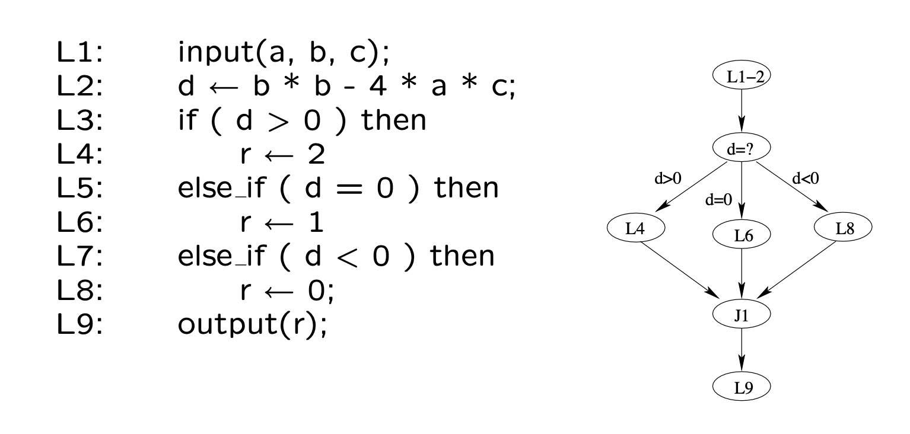
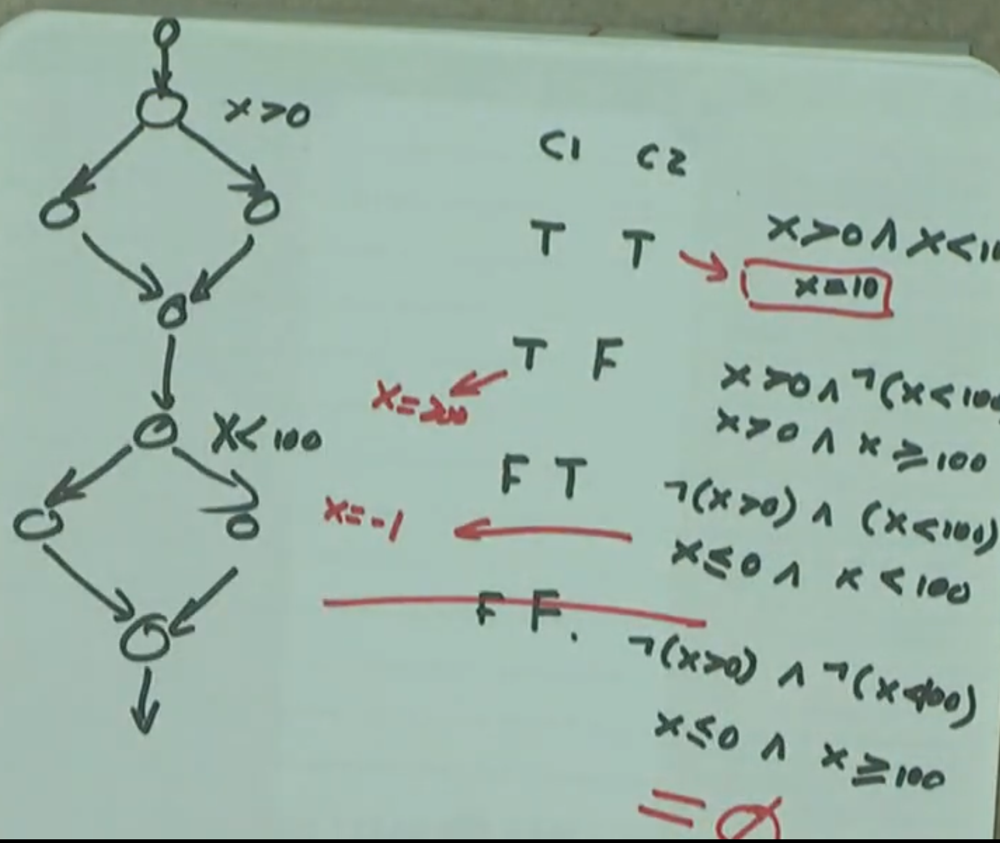
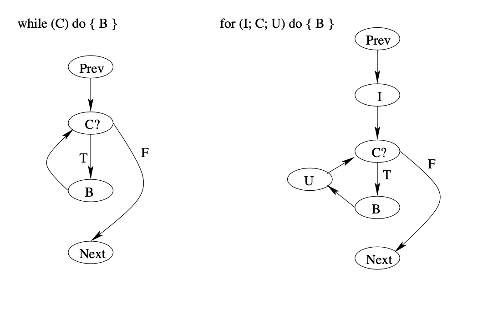
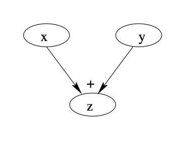
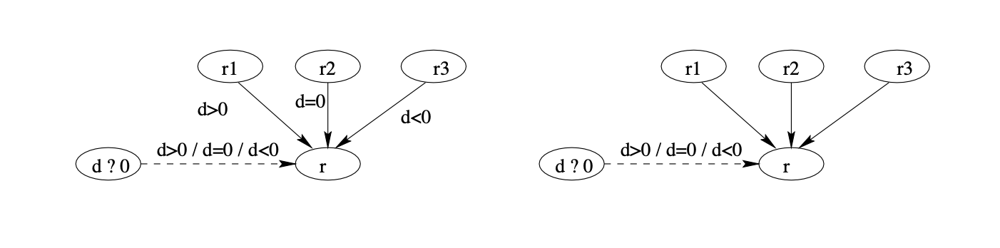
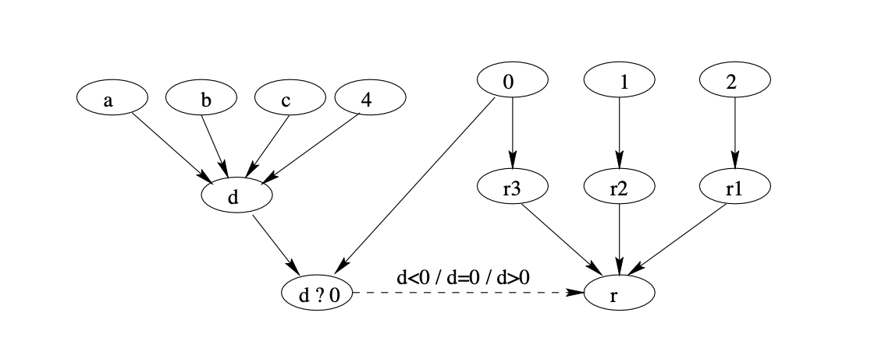
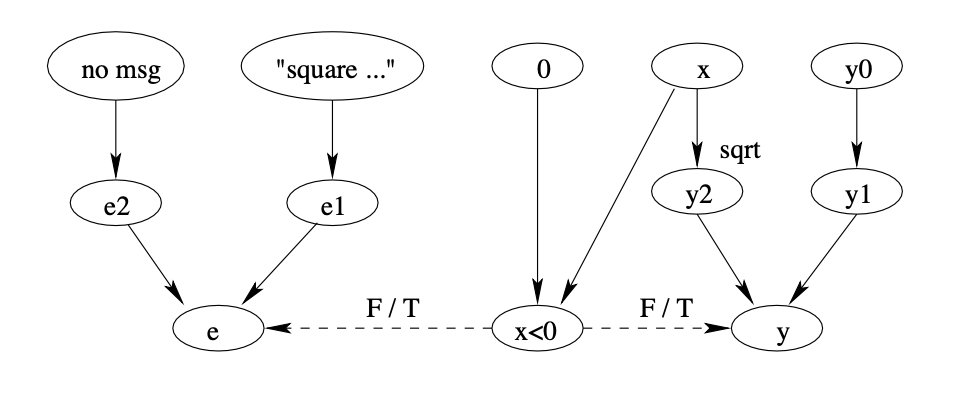
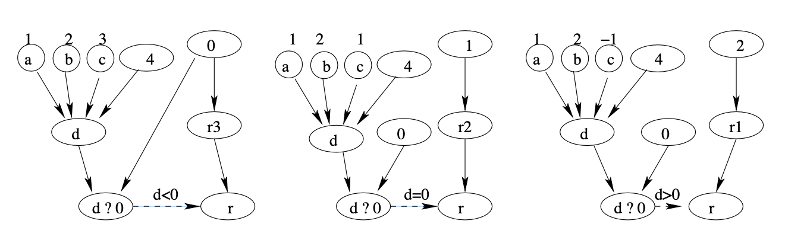
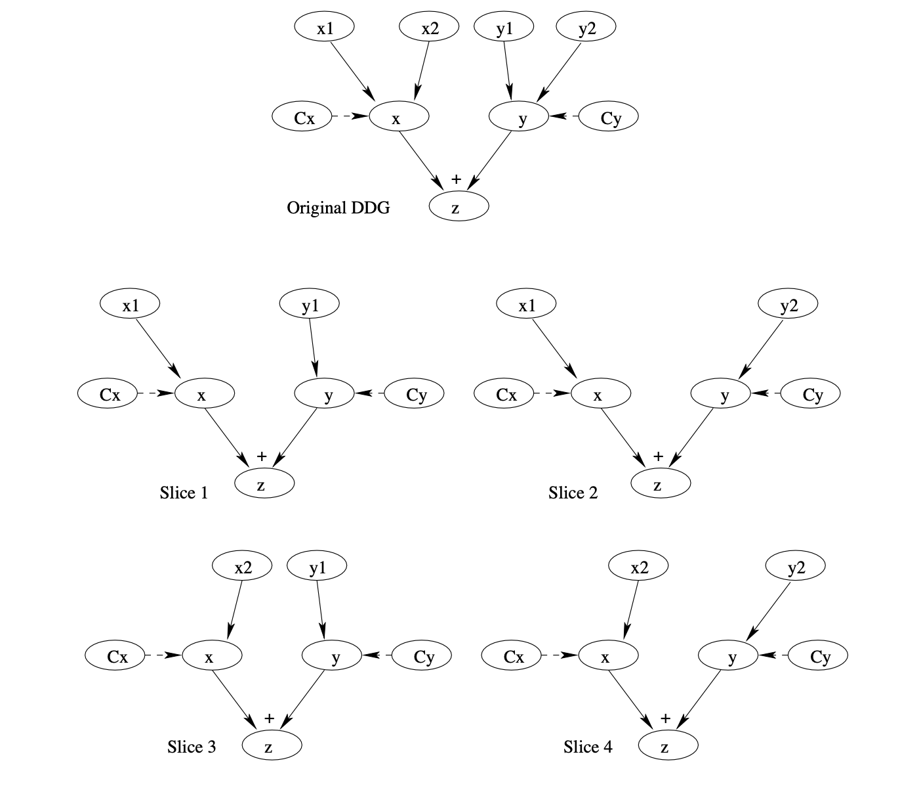
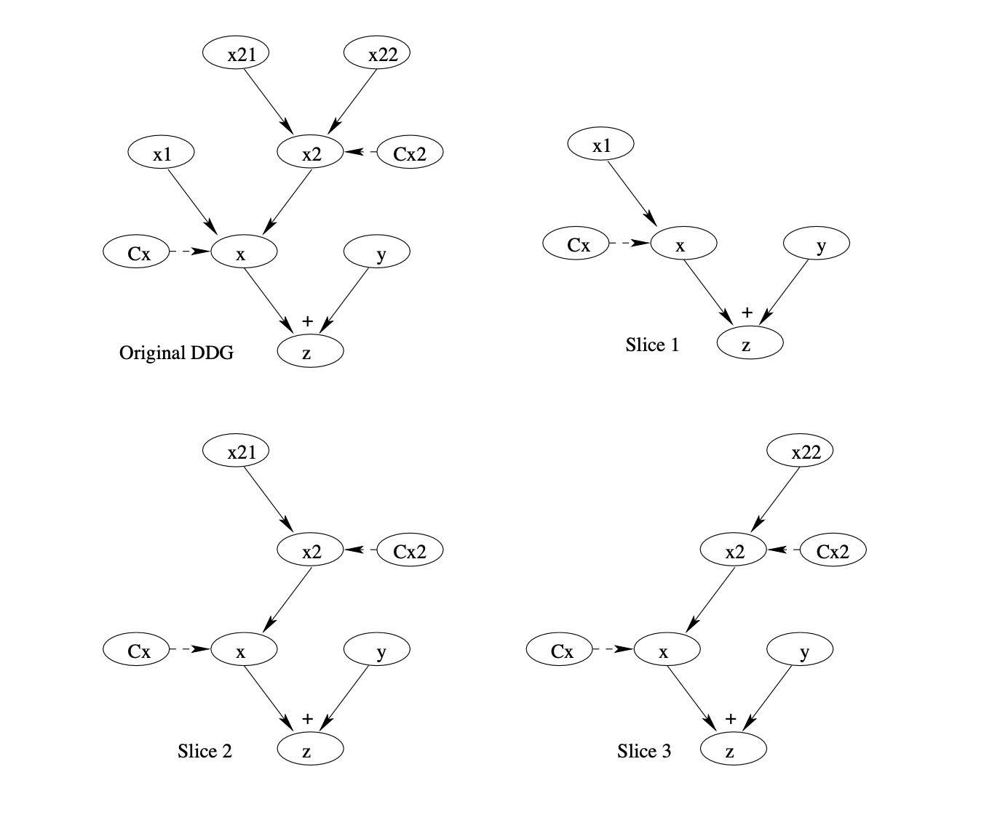

# Chapter 11 Control Flow, Data Dependency, and Interaction Testing

* General Types of Interaction in Execution. 
* Control Flow Testing (CFT)
* Data Dependency Analysis
* Data Flow Testing (DFT)

## 11.1 General Types of Interaction in Execution. 

### 11.1.1 Extending FSM for Testing

* FSMs and extensions:
  * Difficulties with FSMs: state explosion 
    * UBST with Markov-OPs/UMMs
  * FSM Limitation: node/link traversal 
    * other testing for complex interactions

* Interactions in program execution:
  * Interaction along the execution paths:
    * path: involving multiple elements/stages
    * later execution affected by earlier stages
    * tested via control flow testing (CFT)
    * control flow graph (CFG) ⊂ FSM
  * Computational results affected too:
    * data dependency through execution
    * analysis: data dependency graph (DDG)
    * tested via data flow testing (DFT)

> ### 11.1.1 扩展FSM以进行测试
>
> - FSM及其扩展:
>   - FSM的困难：状态爆炸
>     - 使用马尔可夫操作/统一建模方法(UBST)进行优化
>   - FSM的局限性：节点/链接遍历
>     - 其他测试复杂交互
> - 程序执行中的交互：
>   - 执行路径上的交互：
>     - 路径：涉及多个元素/阶段
>     - 后续执行受前期阶段影响
>     - 通过控制流测试(CFT)测试
>     - 控制流图(CFG) ⊂ FSM
>   - 计算结果也受影响：
>     - 执行过程中的数据依赖
>     - 分析：数据依赖图(DDG)
>     - 通过数据流测试(DFT)测试

> > 
> > 当我们谈论软件测试时，有限状态机（FSM）是一个常用的概念，特别是在设计和验证系统行为方面。然而，FSM在处理复杂系统时面临一些限制，比如状态爆炸问题和对复杂交互测试的限制。这就需要对FSM进行扩展或采用其他方法来更全面地测试软件。以下通过例子来解释上述概念和方法：
> >
> > ### 状态爆炸问题
> >
> > 假设我们正在测试一个简单的电子邮件客户端，其状态可能包括“未登录”、“已登录”、“正在查看邮件”和“正在撰写邮件”。如果每个状态都可以通过多种路径到达，每种路径可能还有自己的状态（比如“正在加载”、“连接错误”等），那么状态的总数会迅速增加，这就是所谓的状态爆炸问题。为了解决这个问题，可以使用基于Markov操作过程（Markov-OPs）或统一建模方法（UMMs）的统一基于状态的测试（UBST），这种方法通过将状态转换概率纳入考虑来减少需要考虑的状态数量。
> >
> > ### FSM在节点/链路遍历限制
> >
> > 继续使用电子邮件客户端的例子，假设我们想测试从“已登录”状态到“正在撰写邮件”状态的过程中，软件是否能正确处理接收新邮件的情况。这种复杂的交互可能不容易直接通过传统的FSM来测试，因为它涉及到多个节点和链接的动态遍历。在这种情况下，我们可能需要采用其他测试方法来模拟和测试这种复杂的交互过程。
> >
> > ### 程序执行中的交互
> >
> > #### 控制流测试（CFT）
> >
> > 假设我们的电子邮件客户端在处理邮件时涉及到多个步骤，比如验证用户、检索邮件、显示邮件。每个步骤都可能根据不同的条件分支到不同的执行路径。控制流测试（CFT）通过构建控制流图（CFG）来测试这些路径，确保每个决策点都被适当地测试。CFG是FSM的一个子集，专注于程序执行的路径而非所有可能的状态。
> >
> > #### 数据流测试（DFT）
> >
> > 在相同的电子邮件客户端中，假设用户设置了一个过滤规则，该规则基于邮件的发件人或主题来自动分类邮件。这种情况下，程序执行不仅取决于控制流（即何时执行什么操作），还取决于数据的流动（即哪些数据影响了操作的结果）。数据流测试（DFT）关注的是数据依赖性，通过构建数据依赖图（DDG）来分析和测试数据在程序执行过程中的流动和变化。
> >
> > 通过这些例子，我们可以看到，虽然FSM是一个有用的工具，但在面对更复杂的软件系统时，我们需要采用更多元化的测试方法来确保软件的正确性和稳定性。


### 11.1.2 CFGs and FSMs

* CFG (control flow graph):
  * Basis for control flow testing (CFT).
  * CFG as specialized FSMs:
    * type II: processing & I/O in nodes,
    * links: “is-followed-by” relation, some annotated with conditions.
* CFG elements as FSM elements:
  * nodes = states = unit of processing.
  * links = transitions = “is-followed-by”.
  * link types: unconditional and conditional, latter marked by branching conditions.

> - 控制流图（CFG）：
>   - 控制流测试（CFT）的基础。
>   - 将CFG视为特殊的FSM（有限状态机）：
>     - 类型II：节点中的处理和I/O（输入/输出），
>     - 链接：表达“被接着”的关系，一些链接上标注有条件。
> - CFG元素作为FSM元素：
>   - 节点 = 状态 = 处理单元。
>   - 链接 = 转换 = “被接着”。
>   - 链接类型：无条件和有条件，后者通过分支条件标记。
>
> > 例如，在一个软件应用程序中，如果我们想测试用户登录的流程，我们可以使用CFG来表示这个过程的控制流。在这个CFG中，每个节点可能代表一个特定的处理步骤，比如显示登录界面、获取用户输入、验证用户凭证等。链接则代表从一个步骤到下一个步骤的转换，某些转换可能会根据特定条件进行，比如如果用户输入的凭证无效，则转移到显示错误信息的步骤。在这种情况下，节点相当于FSM中的状态，而链接相当于状态之间的转换。通过这种方式，我们可以清晰地理解和测试软件在不同输入和条件下的行为表现。

### 11.1.3 CFG Example

* Example: Fig 11.1 (p.177) for a proper structured program (seq. concat. + nesting, no GOTOs)

  


> 11.1.3 控制流图示例
>
> - 示例：图11.1（第177页）为一个结构良好的程序（顺序连接+嵌套，没有GOTO语句）

> > 提供的图表似乎是一个结构良好程序的控制流图（CFG）。这个CFG包括顺序连接和嵌套，但它没有使用GOTO语句。图表被划分为三个部分，每个部分分别标记为G1、G2和G3，这些可能代表程序中的不同模块或代码段。
> >
> > 在CFG中：
> >
> > - 用P标记的椭圆形状（例如，P1、P2、P3等）代表处理节点，表示处理或计算的单元。
> > - 用C标记的菱形状（例如，C1、C2、C3）代表条件节点，表示控制流可能基于某些条件而分叉的决策点。
> > - 箭头显示了控制流的流向，用'T'标记为'true'，用'F'标记为'false'，描述了程序将根据在决策节点上的条件评估所遵循的路径。
> > - 用J标记的矩形（例如，J1、J2、J3）代表汇合节点，是路径合并的点。
> > - P7代表这个流程的结束或退出节点。
> >
> > 这个CFG示例可以用于控制流测试（CFT），以分析和测试程序的所有可能执行路径，确保在测试期间每个路径至少执行一次。这确保所有决策点和处理单元得到验证，这对发现程序控制流相关的任何错误至关重要。

### 11.1.4 CFG: Nodes and Links

* Inlink and outlink defined w.r.t a node.
* Entry/exit/processing nodes:
  * Entry (source/initial) nodes.
  * Exit (sink/final) nodes.
  * Processing nodes.
* Branching & junction nodes & links:
  * Branching/decision/condition nodes: 
    * multiple outlinks,
    * each marked by a specific condition, 
    * only 1 outlink taken in execution.
  * Junction nodes:
    * opposite to branching nodes,
    * but no need to mark these inlinks, 
    * only 1 inlink taken in execution.
  * 2-way and N-way branching/junction.

### 

> 1.1.4 控制流图：节点和链接
>
> - 针对一个节点定义的入链和出链。
> - 入口/出口/处理节点：
>   - 入口（源/初始）节点。
>   - 出口（汇/最终）节点。
>   - 处理节点。
> - 分支与汇合节点及链接：
>   - 分支/决策/条件节点：
>     - 多个出链，
>     - 每个出链由特定条件标记，
>     - 执行中只取一个出链。
>   - 汇合节点：
>     - 与分支节点相反，
>     - 但无需标记这些入链，
>     - 执行中只取一个入链。
>   - 二元和多元分支/汇合。
>
> > 例如，假设我们有一个在线购物系统中的结账流程。在这个流程中，用户首先选择商品（处理节点），然后系统会判断是否所有商品都有库存（决策节点）。如果有库存（出链条件为真），则流程继续到支付环节（另一个处理节点）；如果没有库存（出链条件为假），则流程转到库存不足警告（又一个处理节点）。支付完成后，进入订单确认（汇合节点），最后完成购买流程（出口节点）。这个结账流程的控制流图可以帮助我们确保在各种不同条件下，每个处理步骤都被正确执行。

## 11.2 Control Flow Testing (CFT)

### 11.2.1 CFG for CFT

* CFGs for our CFT:
  * Separate processing/branching/junction nodes for clarity
  * Sequential nodes: mostly processing ⇒ collapsing into one node (larger unit)
  * No parallelism allow (single point of control in all executions).
  * Mostly single-entry/single-exit CFGs
  * Focus: structured programs, ¬ GOTO.
    * GOTOs ⇒ ad hoc testing.

*  Notational conventions:
  * “Pi” for processing node “i”
  * “Ji” for junction node “i”
  * “Ci” for condition/branching node “i”

> ### 11.2.1 控制流图用于控制流测试
>
> - 我们用于控制流测试（CFT）的控制流图（CFGs）：
>   - 为了清晰起见，单独处理/分支/汇合节点
>   - 顺序节点：大多数是处理节点 ⇒ 合并成一个节点（更大的单元）
>   - 不允许并行（所有执行中的单一控制点）。
>   - 大多是单入口/单出口的CFGs
>   - 重点：结构化程序，非GOTO。
>     - GOTO ⇒ 临时测试。
> - 符号约定：
>   - “Pi”代表处理节点“i”
>   - “Ji”代表汇合节点“i”
>   - “Ci”代表条件/分支节点“i”
>
> > 例如，考虑一个在线购物应用程序的结账过程。在这个过程的控制流图中，我们可能有多个顺序节点，例如“选择商品（P1）”，“添加到购物车（P2）”，“输入送货信息（P3）”，然后是一个条件节点“是否选择了快递送货（C1）”。如果是（True），则进入“计算快递费用（P4）”，否则（False），进入“选择普通邮递（P5）”。最后，这些路径可能在一个汇合节点“完成结账（J1）”处汇合。在这个控制流图中，我们可以清楚地标记处理节点、分支节点和汇合节点，并在进行控制流测试时检查每个节点和路径是否按预期工作。

### 11.2.2 CFT Technique

* Test preparation:
  - Build and verify the model (CFG)
  - Test cases: CFG ⇒ path to follow
  - Outcome checking: what to expect and how to check it
* Other steps: Standard (Ch.7)
  * Test planning & procedure preparation. 
  * Execution: normal/failure case handling. 
  * Analysis and Followup
* Some specific attention in standard steps: Confirmation of outcome and route in analysis and followup.

> ### 11.2.2 控制流测试技术
>
> - 测试准备：
>   - 构建并验证模型（控制流图CFG）
>   - 测试用例：控制流图CFG ⇒ 要遵循的路径
>   - 结果检查：期望什么结果以及如何检查
> - 其他步骤：标准（第7章）
>   - 测试计划与程序准备。
>   - 执行：正常/失败案例处理。
>   - 分析和后续跟进
> - 标准步骤中的一些特别关注点：在分析和后续跟进中确认结果和路径。

> > 例如，在测试一个网络应用程序的登录功能时：
> >
> > - **构建和验证模型**：我们首先绘制登录功能的CFG，确保它正确地反映了预期的登录流程。
> > - **测试用例**：确定哪些路径需要测试。例如，可能有一个路径是用户输入有效凭证，一个是用户输入无效凭证，还有用户尝试注入SQL的路径等。
> > - **结果检查**：定义每条路径的期望结果以及如何验证这些结果。对于有效凭证路径，期望结果可能是重定向到主页；对于无效凭证，可能是错误信息的显示。
> >
> > 在测试计划和程序准备中，我们会确定资源、时间表和责任分配。执行阶段将包括对每个测试用例的实际运行，以及对失败案例的适当处理。最后，在分析和后续跟进阶段，我们会确认测试是否按预期发生，并记录结果，如果发现问题，则需进行进一步的调查和修复

### 11.2.3 CFT: Constructing CFG

* Sources for CFG:
  * White box: design/code
    * traditional white-box technique
  * Black box: specification
    * structure and relations in specs
* Program-derived (white-box) CFGs:
  * Processing: assignment and calls
  * Branch statements:
    * binary: if-then-else, if-then
    * multi-way: switch-case, cascading if’s.
  * Loop statements (later)
  * composition: concatenating/nesting.
  * structured programming: no GOTOs
    * hierarchical decomposition possible.
  * explicit/implicit entry/exit

> ### 11.2.3 CFT：构建CFG
>
> - CFG的来源：
>   - 白盒：设计/代码
>     - 传统的白盒技术
>   - 黑盒：规格说明
>     - 规格说明中的结构和关系
> - 程序导出的（白盒）CFGs：
>   - 处理：赋值和调用
>   - 分支语句：
>     - 二元：if-then-else, if-then
>     - 多路：switch-case, 级联if’s。
>   - 循环语句（稍后讨论）
>   - 组合：串联/嵌套。
>   - 结构化编程：没有GOTOs
>     - 可以进行分层分解。
>   - 显式/隐式入口/出口
>
> 举例来说，如果在开发一个软件时需要构建CFG来帮助控制流测试，那么我们可以查看程序的源代码或设计文档（白盒视角），或者是基于外部规格说明（黑盒视角）。在白盒视角下，我们会识别程序中的每一个赋值和函数调用，以及所有的分支语句，如二元的if-then-else或者多路的switch-case。我们还会分析循环语句，以及这些不同的代码部分是如何串联或嵌套在一起的。结构化编程强调避免使用GOTO语句，这使得可能对程序进行分层分解。对于程序入口和出口，有时是显式指明的，例如函数的开始和结束，有时则是隐式的，例如主程序的开始和结束。通过这些信息，我们可以构建CFG来可视化程序中的控制流，这对于后续的测试至关重要。


### 11.2.4 CFT: Constructing WB/CFG

*  Example: Fig 11.2 (p.179)
  * analyze program code on left
  * derive CFG on right
  * focus on decision and branches



> ### 11.2.4 控制流测试：构建WB/CFG
>
> - 示例：图 11.2（第179页）
>   - 分析左侧的程序代码
>   - 导出右侧的控制流图
>   - 专注于决策和分支
>
> 示例中的程序代码通过一系列的条件判断来决定变量`r`的值。在控制流图（CFG）中，这些决策点被明确地表示出来，使得程序的逻辑结构一目了然。在CFG中：
>
> - “L1-2”代表输入和赋值语句（L1: 输入(a, b, c); L2: d ← b * b - 4 * a * c;）的组合节点。
> - “d=?” 是一个条件节点，根据变量`d`的值分为三个分支。
> - “L4”, “L6”, “L8”分别代表不同条件下对变量`r`赋值的节点。
> - “J1” 是一个汇合节点，表示在赋值后，不同分支的执行将汇合到输出操作（L9: 输出(r);）。
>
> 此示例中的CFG揭示了如何从程序代码转换到更形式化的表示，它可以用于控制流测试，帮助测试者理解程序在不同决策点上的行为，并确保所有逻辑分支都得到了验证。

### 11.2.5 CFT: Constructing CFG

* Specification-derived (black-box) CFGs:
  * Node: “do” (enter, calculate, etc.)
  * Branch: “goto/if/when/while/...”
  * Loop: “repeat” (for all, until, etc.)
  * Entry: usually implicit
  * Exit: explicit and implicit
  * External reference as process unit
  * General sequence: “do”...(then)...“do”.
  * Example: CFG in Fig 11.2 from external specifications.
* Comparison to white-box CFGs:
  * Implementation independent.
  * Generally assume structured programs.
  * Other info sources: user-related items
    * usage-scenarios/traces/user-manuals
    * high-level req. and market analyses.

> ###  11.2.5 控制流测试：构建控制流图
>
> - 基于规格说明的（黑盒）控制流图：
>   - 节点：“做”（进入，计算等）
>   - 分支：“跳转/如果/何时/当……”
>   - 循环：“重复”（对于所有的，直到等）
>   - 入口：通常是隐含的
>   - 出口：显式和隐式
>   - 外部引用作为处理单元
>   - 一般顺序：“做”......（然后）...“做”。
>   - 示例：图11.2中从外部规格说明得出的控制流图。
> - 与白盒控制流图的比较：
>   - 独立于实现。
>   - 通常假设结构化程序。
>   - 其他信息来源：与用户相关的项目
>     - 使用场景/追踪/用户手册
>     - 高层需求和市场分析。
>
> 举个例子，假如我们正在为一款新的手机应用设计一个用户注册流程的控制流图。根据规格说明书，用户需要先输入个人信息，然后选择一个用户名，之后设置密码。如果用户名已经被占用，系统将要求用户选择另一个。整个流程结束时，应用将发送一封确认邮件给用户。在这种情况下，每一步都可以表示为一个“做”的节点。用户名被占用的情况将是一个“如果”的分支节点。用户完成注册后，发送确认邮件的节点可以是一个隐含的出口节点。通过这样的控制流图，我们可以在不依赖于任何特定实现的情况下，检查应用是否按照预定的流程执行注册过程，确保所有决策点和行为与规格说明相符。

### 11.2.6 CFT: Path Definition

* Test cases: CFG ⇒ path to follow
  * Connecting CFG elements together in paths.
  * Define and select paths to cover
  * Sensitize (decide input for) the paths
* Path related concepts/definitions:
  * Path: entry to exit via n intermediate links and nodes.
  * Path segment or sub-path: proper subset of a path.
  * Loop: path or sub-path with 1+ nodes visited 1+ times.
  * Testing based on sub-path combinations.
  * Loop testing: specialized techniques.

> ###  11.2.6 控制流测试：路径定义
>
> - 测试用例：CFG ⇒ 要遵循的路径
>   - 将控制流图的元素以路径形式连接在一起。
>   - 定义和选择要覆盖的路径。
>   - 敏感化（决定输入）路径。
> - 与路径相关的概念/定义：
>   - 路径：通过n个中间链接和节点从入口到出口。
>   - 路径段或子路径：路径的适当子集。
>   - 循环：路径或子路径中1个或多个节点被访问1次或多次。
>   - 基于子路径组合的测试。
>   - 循环测试：专门的技术。
>
> 举例来说，假设我们有一个在线购物网站的结账流程的控制流图，我们可以定义一系列的测试用例来覆盖这个流程中所有可能的路径。每个测试用例将是一个从开始结账（入口）到完成支付（出口）的路径，可能包括选择商品、添加地址、选择支付方式、确认订单等步骤。如果结账流程包含循环，例如用户可以添加多个地址，然后选择一个，这种循环将需要特殊的测试技术来确保循环在各种不同的迭代次数下都能正确处理。通过这种方式，我们可以确保测试覆盖了结账流程的所有关键部分，并验证了所有重要的控制流决策点。

### 11.2.7 CFT: Path Selection

* Path selection (divide & conquer)
  * Path segment definition
  * Sequential concatenation
  * Nesting of segments
  * Unstructured construction: difficult
  * Eliminate unachievable/dead paths (contradictions and correlations)
* “Divide”: hierarchical decomposition for structured programs.
* “Conquer”: Bottom-up path definition one segment at a time via basic cases for nesting and sequential concatenation.
* Graph G made up of G1 and G2 subgraphs, with M and N branches respectively
  * Subgraph: 1 entry + 1 exit.
  * Key decisions at entry points.
* Path segment composition:
  * Sequential concatenation: G = G1 ◦ G2
    * M × N combined paths.
  * Nesting: G = G1 (G2)
    * M + N − 1 combined paths.
* Example paths for Fig 11.1 (p.177): TT-, TFT, TFF, FT-, FFT, FFF.

> ###  11.2.7 控制流测试：路径选择
>
> - 路径选择（分治法）
>   - 路径段定义
>   - 顺序串联
>   - 段落嵌套
>   - 无结构构造：困难
>   - 排除无法实现/死亡路径（矛盾和关联）
> - “分治”：对结构化程序进行分层解构。
> - “征服”：通过基本情况的嵌套和顺序串联，一次一个段地自下而上定义路径。
> - 图G由G1和G2子图组成，分别有M和N个分支
>   - 子图：1个入口+1个出口。
>   - 入口点的关键决策。
> - 路径段组合：
>   - 顺序串联：G = G1 ◦ G2
>     - M × N 组合路径。
>   - 嵌套：G = G1 (G2)
>     - M + N − 1 组合路径。
> - 图11.1（第177页）的示例路径：TT-、TFT、TFF、FT-、FFT、FFF。
>
> 举例来说，如果我们考虑一个购物车软件模块，该模块允许用户添加商品（G1），然后结账（G2）。在这种情况下，每个子流程可以有多种路径（例如，G1中添加了M种商品，G2中有N种支付方式）。我们可以选择G1和G2中的所有可能路径的组合来测试整个购物车模块。对于更复杂的嵌套情况（比如在结账过程中有一系列优惠券逻辑的检查），我们将需要考虑如何合理组合这些路径段来覆盖所有的逻辑。这种分治法使得测试更有条理，允许我们逐步验证软件的每个部分，同时保持整体测试覆盖的完整性。通过这种方法，我们可以系统地探索并验证程序的所有可能执行路径



> HW 

### 11.2.8 CFT: Sensitization

* Path sensitization/realization
  * Logic: constant predicates.
  * Algebraic: variable predicates.
  * Use simple, obvious test cases
  * Rely on good application knowledge
    * run through first
    * add other cases later
  * Obtain input values (test point)
    * select for non-unique solutions
  * Alternative solutions via DFT later.
* Trouble sensitize ⇒ check others first.
  * Unachievable?
  * Model/specification bugs? 
  * Nothing above ⇒ failure.

> ###  11.2.8 控制流测试：敏感化
>
> - 路径敏感化/实现
>   - 逻辑：恒定的谓词。
>   - 代数：变量谓词。
>   - 使用简单、明显的测试案例
>   - 依赖良好的应用知识
>     - 先进行初步测试
>     - 稍后添加其他案例
>   - 获取输入值（测试点）
>     - 为非唯一解选择
>   - 通过稍后的DFT寻找替代解决方案。
> - 敏感化困难 ⇒ 先检查其他情况。
>   - 无法实现？
>   - 模型/规格说明书的错误？
>   - 如果上述都不是 ⇒ 故障。
>
> 举例来说，如果我们在测试一个网络应用的登录功能，我们首先需要确定哪些路径通过登录流程。例如，可能有一个路径是用户输入正确的用户名和密码，另一个路径是用户名正确但密码错误，还有用户两者都输入错误的路径。我们会选择能够触发这些不同路径的输入值，即“敏感化”这些路径。如果我们遇到无法实现或无法触发的路径，我们可能需要检查我们的模型或应用知识是否有误，或者是程序中是否存在故障。通过敏感化路径，我们可以保证我们的测试覆盖了程序的所有关键行为，并能准确预测和验证程序对每个可能输入的反应。

### 11.2.9 CFT: Logic Sensitization

*  Segment and combination
  - Divide into segments (entry-exit).
  - Examine predicate relations.
  - Uncorrelated: direct combination.
  - Correlated:
    * analysis ⇒ path elimination, 
    * combination.

* Path elimination:

  * Highly correlated:
    * identical: direct merge 
    * contradictory
    * logic implications
  * Repeat above steps

> ### 11.2.9 控制流测试：逻辑敏感化
>
> - 段落和组合
>   - 将其分为段落（入口-出口）。
>   - 检查谓词关系。
>   - 不相关：直接组合。
>   - 相关联：
>     - 分析 ⇒ 路径消除，
>     - 组合。
> - 路径消除：
>   - 高度相关：
>     - 相同：直接合并
>     - 矛盾
>     - 逻辑含义
>   - 重复上述步骤
>
> 例如，假设我们正在测试一个网上图书馆的搜索系统，用户可以通过多种搜索条件来查找图书。在CFT的上下文中，路径敏感化意味着我们为这个搜索系统的控制流图中的每条路径选择测试用例，以确保在实际执行时可以触发这些路径。这可能包括设置不同的搜索条件（逻辑谓词），如关键字搜索、作者搜索或分类搜索。逻辑敏感化涉及检查这些条件是否独立，以及它们是否可能导致路径的组合或消除。例如，如果用户未输入任何搜索条件，则可能没有搜索结果（路径消除），或者如果用户输入了相互矛盾的条件，则可能需要合并这些条件以形成一个合理的测试用例。这个过程有助于确认控制流图是否准确反映了搜索系统的逻辑，并确保测试涵盖了所有重要的功能和决策点。

### 11.2.10 CFT: Algebraic Sensitization

* Complexity due to dynamic values
  - Symbolic execution
  - Replace conditions in predicates (sensitive to prior path segments?)
  - Then similar to logic sensitization
  - More complex than logical sensitization
* Segment and combination
  * Divide into segments (same)
  * Examine variable relation in predicates
  * Uncorrelated: combination (same)
  * Correlated:
    * path elimination then combination using replaced values via symbolic execution

> ### 11.2.10 控制流测试：代数敏感化
>
> - 由于动态值带来的复杂性
>   - 符号执行
>   - 替换谓词中的条件（对之前路径段敏感？）
>   - 然后类似于逻辑敏感化
>   - 比逻辑敏感化更复杂
> - 段落和组合
>   - 划分为段落（相同）
>   - 检查谓词中的变量关系
>   - 不相关联：组合（相同）
>   - 相关联：
>     - 使用符号执行替换值后进行路径消除然后组合
>
> 例如，如果我们要测试一个财务管理软件，其中包含计算税率的复杂逻辑，这可能需要对不同收入水平和各种可扣除条款的组合进行敏感化。在代数敏感化过程中，我们可能需要进行符号执行来理解不同的数值是如何影响最终税率的计算的。这可能涉及替换路径段中使用的条件表达式中的具体值，然后确定这些值如何影响路径的选择。
>
> 如果谓词中的条件是不相关的，那么我们可以将路径直接组合起来进行测试。但如果条件是相关联的，那么可能需要先通过符号执行替换值，进行路径消除，然后再组合路径进行测试。这种方法有助于理解程序中的动态数据如何影响决策路径，并确保测试能覆盖这些动态行为。


### 11.2.11 CFT: Other Steps

* Similar to Chapter 7.
* Execution and followup:
  * Path/statement-oriented execution
    * debugger and other tools helpful
  * Followup: coverage and analysis
* Outcome prediction and confirmation:
  * Test oracle or outcome prediction:
    * may use path-specific properties.
  * Path confirmation/verification.
  * Guard against coincidental correctness.
  * Instrumentation may be necessary.
  * Automation: dynamic execution path and related tracing.

> ###  11.2.11 控制流测试：其他步骤
>
> - 与第7章相似。
> - 执行和后续跟踪：
>   - 面向路径/语句的执行
>     - 调试器和其他工具有帮助
>   - 后续跟踪：覆盖率和分析
> - 结果预测和确认：
>   - 测试预言机或结果预测：
>     - 可以使用路径特定属性。
>   - 路径确认/验证。
>   - 防范偶然的正确性。
>   - 可能需要进行工具化。
>   - 自动化：动态执行路径和相关追踪。


> > 例如，如果我们正在测试一个复杂的网络服务器软件，我们可能会在服务器处理不同类型请求的过程中，使用调试器或日志记录工具来监控和验证预定的控制流路径是否被正确地执行。这个过程中，我们会依据预先定义的测试用例来预测期望的结果，并使用这些工具来确认实际的执行路径是否符合预期。
> >
> > 在执行和后续跟踪阶段，我们会收集关于哪些路径已经执行（覆盖率）以及是否出现任何预期之外的行为的数据。如果测试结果与预测不符，我们需要进行更深入的分析，可能包括确认是否是由于测试用例的选择导致了偶然的正确性，或者是程序内部的逻辑有问题。
> >
> > 为了确保测试结果的准确性，可能需要在软件中植入额外的监控代码（工具化），这有助于更精确地追踪程序在执行过程中的状态和变量值的变化。此外，自动化工具可以用来追踪动态执行路径，并收集有关程序执行的详细信息，从而为分析和验证提供更强大的支持。

### 11.2.12 Loops: What and Why

* Loop: What is it?
  * Repetitive or iterative process.
  * Graph: a path with one or more nodes visited more than once.
  * Appear in many testing models.
  * Recursion.
* Why is it important?
  * Intrinsic complexity:
    * coverage: how much?
    * effectiveness concerns (above)
  * Practical evidence: loop defects
  * Usage in other testing.

> ###  11.2.12 循环：是什么以及为什么重要
>
> - 循环是什么？
>   - 重复或迭代的过程。
>   - 图表示：一条路径中一个或多个节点被访问多次。
>   - 在许多测试模型中出现。
>   - 递归。
> - 为什么它重要？
>   - 内在的复杂性：
>     - 覆盖率：需要多少？
>     - 有效性问题（上述）。
>   - 实践证据：循环缺陷。
>   - 在其他测试中的使用。
>
> 例如，在测试一个电子邮件客户端软件时，可能有一个循环来检查新邮件。这个循环需要不断地查询服务器，查看是否有新邮件到达。循环的存在增加了测试的复杂性，因为我们需要确保在所有可能的迭代次数中，循环都能正确地执行。可能需要检查循环在一次迭代中工作是否正确，以及它是否能够在没有新邮件时优雅地退出。还要检查循环是否能够处理累积状态，例如，如果多次检查后收到了多封邮件，循环是否能够正确地处理所有新邮件。循环的测试不仅关注覆盖率，即循环的每一部分是否都被执行到，还关注循环引起的潜在缺陷，这通常是由于循环控制逻辑的错误造成的。此外，循环的缺陷可能在实际使用中表现出来，因此循环也是其他测试方法中的一个关注点，比如性能测试和稳定性测试。

### 11.2.13 Loop Examples

* Common loop examples: Fig 11.3 (p.183)

  * left: “while” loops

  * right: “for” loops

  * other (structured) loops can be converted to these loops

    

> ### 11.2.13 循环示例
>
> - 常见的循环示例：图 11.3（第183页）
>
>   - 左侧：“while”循环
>
>   - 右侧：“for”循环
>
>   - 其他（结构化的）循环可以转换为这些循环
>
>     
>
> 举例来说，我们来看一个简单的软件应用，它计算给定数字列表的平均值。对于“while”循环，可能有一个计数器和累加器，循环会持续进行，直到遍历完所有数字。在控制流图中，“C?”将检查是否还有更多的数字要处理，“B”将执行实际的累加操作。而“for”循环可能会在循环开始前设置一个计数器，“I”进行初始化，“C?”检查是否满足继续循环的条件，"B"执行累加，并且每次迭代后，“U”会更新计数器。这两种循环在CFG中的表现分别对应于它们在程序代码中的逻辑结构。这样的表示有助于在进行控制流测试时，识别和测试代码中的所有可能循环路径。


### 11.2.14 Loop Specification

* Deterministic vs. nondeterministic
  * determining #iterations ahead of time?
* Individual loops:
  * Loop control: node, predicate, and control variable.
  * Loop entry/exit.
  * Processing and looping: pre-test, post-test, mixed-test.

* Combining loops: structured (nesting & concat.) vs. non-structured (goto).

> ### 11.2.14 循环规格
>
> - 确定性与非确定性
>   - 能否提前确定迭代次数？
> - 单个循环：
>   - 循环控制：节点，谓词和控制变量。
>   - 循环入口/出口。
>   - 处理和循环：前测试，后测试，混合测试。
> - 组合循环：结构化（嵌套和连接）与非结构化（goto）。
>
> 例如，在一个决策支持系统中，可能有一个确定性的循环用来计算所有可能的解决方案的成本，并选择最低成本的解决方案。在这种情况下，循环的每次迭代都代表了一个潜在的解决方案，并且系统可能会提前知道需要考虑多少个解决方案。循环控制可以通过一个谓词来决定是否继续寻找新的解决方案，而循环的每次进入和退出都必须明确定义，以确保所有解决方案都被考虑到。
>
> 另一方面，如果系统是根据用户输入的数据动态生成解决方案，那么循环可能就是非确定性的，因为不知道用户会输入多少数据。在这种情况下，循环控制会根据用户输入的数据量动态地确定迭代次数。
>
> 当我们将多个这样的循环结合在一起时，如果每个循环都是结构化的，比如一个循环嵌套在另一个循环中，或者是一系列循环顺序执行，我们可以清晰地定义整个程序的执行流。然而，如果使用非结构化的方法，比如goto语句来组合循环，就可能导致程序流程难以追踪和测试。在设计循环时，推荐使用结构化方法，因为它更有助于清晰地理解和测试程序的行为。

### 11.2.15 Loop Testing

* Path coverage:

  * All: infeasible for nested loops:

    $\sum_{i=0}^{M-1} N^i = \frac{N^{M}-1}{N-1}$

  * Works for i iterations

    => i + 1 iterations most likely fine too.

  * Important: how to select?

    * heuristics and concrete measures
    * boundary related problems more likely

* Hierarchical modeling/testing:

  * Test loop in isolation first.
  * Collapse loop as a single node in higher level models
  * Other hierarchical testing techniques.

> ### 11.2.15 循环测试
>
> - 路径覆盖率：
>
>   - 全覆盖：对于嵌套循环是不可行的：
>
>     $\sum_{i=0}^{M-1} N^i = \frac{N^{M}-1}{N-1}$
>
>   - 对于i次迭代有效 
>
>     => i + 1次迭代很可能也没问题。
>
>   - 重要的是：如何选择？
>
>     - 启发式方法和具体措施
>     - 与边界相关的问题更有可能出现
>
> - 分层建模/测试：
>
>   - 首先单独测试循环。
>   - 在更高级别的模型中将循环折叠为单个节点
>   - 其他分层测试技术。
>
> 例如，如果我们正在测试一个内容管理系统（CMS），其中包含一个循环，用于渲染页面上的多个内容模块。在这种情况下，对于每个模块的渲染，可能需要迭代整个内容列表。因为嵌套循环可能会导致巨大数量的迭代，全面测试所有可能的迭代组合是不可行的，因此我们可能会采用启发式方法来选择测试边界情况（如列表的开始和结束）以及典型值。
>
> 分层测试方法可能涉及首先测试单个内容模块的渲染，然后在更广泛的页面渲染中将内容模块视为一个单元。这种方法简化了测试过程，因为它将关注点从整体列表的迭代转移到单个模块的正确性上。这样，即使不测试每个可能的迭代组合，我们也能有信心系统能正确处理内容的渲染。

### 11.2.16 Critical Values for Loop Testing

* General boundary problems:
  * Under/over defined problems and closure problems.
  * Boundary shift, ±1 problem.
  * Similar to boundary testing (Ch.9).
* Lower bound problems:
  * Initialization problem.
  * Loop execution problem.
  * Other boundary problems.
* Lower bound test values:
  * Bypass, once, twice.
  * Min, min + 1, min − 1.

> ### 11.2.16 循环测试的关键值
>
> - 通用边界问题：
>   - 定义不足/过度以及封闭性问题。
>   - 边界移动，±1问题。
>   - 与边界测试相似（第9章）。
> - 下界问题：
>   - 初始化问题。
>   - 循环执行问题。
>   - 其他边界问题。
> - 下界测试值：
>   - 绕过，一次，两次。
>   - 最小值，最小值+1，最小值-1。

> > 例如，假设我们要测试一个计数器循环，该循环计算从1数到用户指定的数的总和。在这种情况下，边界问题可能包括：
> >
> > - 如果用户指定的数是0（定义不足），循环应该被绕过，不执行任何操作。
> > - 如果用户指定的数是最大可能的整数（过度定义或封闭性问题），循环可能会面临整数溢出的问题。
> > - 边界移动问题可能涉及循环是否正确处理起始和终止条件，例如，是否正确计算了1到N（包含N）的总和，而不是错误地计算了1到N-1或1到N+1的总和。
> >
> > 对于下界问题，测试值的选择可能包括：
> >
> > - 绕过：如果循环的初始条件即不满足（例如用户指定的数小于1），则循环不应执行。
> > - 一次：确保循环能够正确地执行一次迭代。
> > - 两次：确保循环能够在第一次迭代后正确地继续到第二次。
> >
> > 在设置最小值测试时，我们可能需要考虑：
> >
> > - 最小值：测试循环是否能够处理最小的有效输入。
> > - 最小值+1：测试循环在处理接近最小边界的值时是否正确。
> > - 最小值-1：测试循环是否能够处理无效输入，并且不执行任何不应该执行的操作。
> >
> > 这些测试有助于确保循环在处理边界值时的鲁棒性和正确性，特别是对于初始化和循环逻辑来说至关重要。

### 11.2.17 Critical Values for Loop Testing

* Upper bound problems:
  * Primarily ±1 problem
  * Capacity problem
  * Other boundary problems
* Upper bound test values:
  * Max, max + 1, max – 1;
  * Practicality: avoid max combinations;
  * Testability: adjustable max.
  * Related: capacity/stress testing

* Other critical values:

  * Typical number (≈ usage-based testing);
  * Implicit looping assumptions in hierarchical models

* Generic test cases:

  * Lower bound: alway exists

    ⇒ related critical values.

  * Upper bound: not always exists

    * if so ⇒ related critical values,
    * if not ⇒ related capacity testing.

  * Other critical values.

  * Level of details to cover in hierarchical modeling/testing.

> ### 11.2.17 循环测试的关键值
>
> - 上界问题：
>   - 主要是±1问题
>   - 容量问题
>   - 其他边界问题
> - 上界测试值：
>   - 最大值，最大值+1，最大值-1；
>   - 实用性：避免最大值组合；
>   - 可测试性：可调整的最大值。
>   - 相关：容量/压力测试
> - 其他关键值：
>   - 典型数值（≈ 基于使用的测试）；
>   - 分层模型中隐含的循环假设
> - 通用测试案例：
>   - 下界：始终存在 ⇒ 相关关键值。
>   - 上界：并不总是存在
>     - 如果存在 ⇒ 相关关键值，
>     - 如果不存在 ⇒ 相关的容量测试。
>   - 其他关键值。
>   - 在分层建模/测试中要覆盖的细节级别。

> > 例如，假设一个应用程序允许用户创建多达100个自定义设置。在循环测试中，上界问题可能会包括：
> >
> > - 测试程序是否可以处理用户尝试创建第101个设置时的情况（最大值+1），并确保系统能够优雅地拒绝该请求而不是崩溃或行为异常。
> > - 确保程序在用户拥有恰好100个设置时仍然正常工作（最大值），没有性能下降或意外的行为。
> > - 测试当用户拥有99个设置并尝试添加另一个时，程序是否正确地处理（最大值-1），确保程序的边界检查逻辑正确。
> >
> > 为了避免在测试中考虑所有可能的最大值组合（由于资源限制可能不可行），测试人员可以选择具有代表性的测试值，并且可能调整程序允许的最大设置数量以进行测试。此外，这种测试与容量和压力测试密切相关，因为它们可以揭示在接近设计限制时系统的行为。在分层测试中，可以假设在某一层次上用户将永远不会超过某个数量的设置，这样的假设应该在测试计划中明确，以确保所有重要的行为都得到验证。

### 11.2.18 CFT Usage

* As white box testing (more often):
  * Small programs during unit testing.
  * Coarse-grain system level model.
* As black box testing (less often):
  * Model built on specification
    * higher level constraints as specs.
  * Overall coverage of functionality.
  * Can be used for UBST.
* Application environment:
  * Control flow errors (& decision errors).
  * In combination with other techniques.

>   11.2.18 控制流测试的使用
>
> - 作为白盒测试（更常见）：
>   - 在单元测试期间用于小型程序。
>   - 粗粒度系统级模型。
> - 作为黑盒测试（较少见）：
>   - 基于规格说明书构建模型
>     - 规格说明书作为更高级别的约束条件。
>   - 功能的整体覆盖。
>   - 可用于基于使用情景的测试（UBST）。
> - 应用环境：
>   - 控制流错误（及决策错误）。
>   - 与其他技术结合使用。
>
> 例如，在一个电商平台的开发中，控制流测试可以用于验证购物车和结账流程中的所有决策点和控制流转是否正确。作为白盒测试，开发人员可以在单元测试阶段利用详细的程序代码构建控制流图（CFG），以确保代码中的每个决策点和路径都被测试到，从而找出可能的控制流错误。
>
> 相对地，作为黑盒测试，控制流测试可能基于产品的功能规格说明来构建一个高层次的控制流图，而不依赖于代码的具体实现。这种方法可以用来确保整个系统按照设计的功能需求正确运行，而不必关心实现的细节。这通常适用于系统测试阶段，确保整个系统从用户的角度看是按照预期工作的。
>
> 在不同的应用环境中，控制流测试通常与其他测试技术结合使用。例如，在集成测试中，可能会将控制流测试与数据流测试结合起来，以便同时验证程序的控制逻辑和数据处理逻辑。此外，还可以结合使用场景测试，特别是在测试复杂的用户交互和交易流程时，确保系统能够处理各种用户输入和操作路径。


### 11.2.19 CFT: Other Issues

*  Limit control flow complexity
  * Proper granularity
  * Hierarchical modeling ideas:
    * external units/internal blocks
  * Combination with other strategies:
    * CFT for frequently-used/critical parts
  * Language/programming methodology
  * Complexity measurement as guidelines

* Need automated support:
  * Models from specifications/programs
  * Sensitization support — debugging
  * Path verification — tracing

> ###  11.2.19 控制流测试：其他问题
>
> - 限制控制流的复杂性
>   - 适当的粒度
>   - 分层建模思想：
>     - 外部单元/内部块
>   - 与其他策略的组合：
>     - 对于经常使用/关键部分的控制流测试
>   - 编程语言/方法论
>   - 复杂度测量作为指导
> - 需要自动化支持：
>   - 从规格说明/程序中获取模型
>   - 敏感化支持 — 调试
>   - 路径验证 — 追踪


> > 例如，如果一个软件工程团队正在开发一个大型企业资源规划（ERP）系统，他们可能会面对控制流复杂性的问题。为了管理这种复杂性，他们可能会使用分层建模方法来将系统分解为可以单独测试的外部单元和内部块。他们也可能会优先对那些频繁使用或视为关键部分的控制流进行测试。
> >
> > 此外，团队可能会利用编程语言提供的方法论来简化控制流，比如使用面向对象编程的封装和继承来管理复杂度。复杂度测量，如环路复杂度或函数点分析，可能会用来指导测试计划，帮助团队识别需要特别注意的代码区域。
> >
> > 由于控制流测试可能涉及大量的测试用例和路径，自动化支持在这里显得尤为重要。自动化工具可以帮助从规格说明或程序代码中生成控制流模型，提供路径敏感化的支持，并帮助调试代码以验证路径是否如预期执行。自动化追踪工具也是必不可少的，它可以帮助验证测试用例是否覆盖了所有的控制流路径，确保测试的完整性。


## 11.3 Data Dependency Analysis

### 11.3.1 Dependency vs. Sequencing

* Sequencing:
  * Represented in CFT “is-followed-by”
  * Implicit: sequential statements
  * Explicit: control statements & calls
  * Apparent dependency:
    * order of execution (sequential machine)
    * but must follow that order?

* Dependency relations:
  * Correct computational result?
  * Correct sequence: dependencies
  * Synchronization
  * Must obey: essential
    * captured by data flow/dependency
  * PL/system imposed: accidental
    * CFT, including loop testing

> ### 11.3.1 依赖关系与顺序执行
>
> - 顺序执行：
>   - 在控制流测试（CFT）中表示为“按顺序跟随”
>   - 隐含的：顺序语句
>   - 显式的：控制语句和调用
>   - 表面依赖：
>     - 执行顺序（顺序机）
>     - 但必须遵循该顺序吗？
> - 依赖关系：
>   - 正确的计算结果？
>   - 正确的顺序：依赖关系
>   - 同步
>   - 必须遵守：本质上
>     - 通过数据流/依赖性捕获
>   - 编程语言/系统强加：偶然的
>     - 包括循环测试的控制流测试

> > 例如，在一个电子表格程序中，计算单元格C1的值可能依赖于单元格A1和B1的值。这种依赖性关系是计算结果正确性的关键。在程序代码中，虽然计算C1的命令可能在读取A1和B1值之后顺序执行，但顺序本身不是因为顺序机的限制，而是因为数据的依赖性。这意味着无论执行顺序如何，只要保持了数据的依赖关系，计算结果就是正确的。
> >
> > 在控制流测试中，这种数据依赖性通常不是主要考虑的因素，而是更多地关注代码的执行路径，包括循环。然而，如果我们想确保计算结果的正确性，那么必须关注数据依赖关系，这通常通过数据流测试来实现。这种测试方法会捕获和分析数据项之间的关键依赖关系，而不是简单地跟踪执行顺序。在编程语言或系统设计中，某些顺序可能是由于编程习惯或特定的系统限制而随意加入的，而控制流测试需要识别和测试这些可能是偶然加入的顺序关系。

### 11.3.2 Dependency Relations

* Convenient but not essential
  * stmts not involving common variables
  * some data relations (later in DFT)
  * intermediate variables
* Nonessential iteration/loops:
  * most deterministic loops;
  * due to language/system limitations;
  * example: sum over an array.
* Essential dependency:
  * data in computation must be defined.
  * essential loops: most nondeterministic.
  * result depends on latest values.

> ### 11.3.2 依赖关系
>
> - 方便但非必需
>   - 不涉及共同变量的语句
>   - 某些数据关系（后续在数据流测试DFT中讨论）
>   - 中间变量
> - 非本质迭代/循环：
>   - 大多数确定性循环；
>   - 由于语言/系统的限制；
>   - 例如：遍历数组求和。
> - 本质依赖：
>   - 计算中的数据必须先定义。
>   - 最重要的非确定性循环。
>   - 结果依赖于最新值。
>
> 例如，当一个计算程序需要遍历用户提供的数据集并计算总和时，使用一个确定性循环（例如，一个“for”循环遍历数组的每个元素）是方便的。这样的循环不是因为逻辑上必须要迭代，而是因为大多数编程语言在设计上要求这样做。
>
> 然而，在一些情况下，迭代是必须的，如在搜索算法中，你可能需要持续迭代直到找到一个满足条件的元素。在这种情况下，循环是本质的，因为计算结果依赖于数据集中最新发现的值。
>
> 在数据流测试（DFT）中，这些非本质迭代可能被视为一个整体来处理，测试其结果，而不一定需要分析循环的每次迭代。但是，如果在计算中有本质的数据依赖关系，比如迭代产生的结果影响了后续计算，那么这种依赖关系是不可避免的，并需要通过数据流测试来验证。这种本质依赖关系通常是由非确定性循环引入的，如基于用户输入或实时数据变化的循环。在这些情况下，测试需要确保不仅循环本身正确，而且循环中处理的每个数据项都正确地贡献了计算结果。


### 11.3.3 Need for DFT

* Need other alternatives to CFT:
  - CFT tests sequencing
    * either implemented or perceived
  - Dependency $\ne$ sequencing
  - Other technique to test dependency

* Data flow testing (DFT)
  - Data dependencies in computation
  - Different models/representations (traditionally/often as augmented CFT)
  - DFT is not untouched data items within a program/module/etc.
  - “data flow” may referred to information passed along from one component to another, which is different from DFT
  - Key: dependency (not flow)?

> ### 11.3.3 数据流测试的需求
>
> - 需要除了控制流测试（CFT）的其他替代方法：
>   - CFT 测试顺序执行
>     - 不论是实现的还是感知的
>   - 依赖性 ≠ 顺序执行
>   - 其他技术来测试依赖性
> - 数据流测试（DFT）
>   - 计算中的数据依赖性
>   - 不同的模型/表示方法（传统上/通常作为增强的CFT）
>   - DFT不涉及程序/模块等内部未触及的数据项
>   - “数据流”可能指的是从一个组件传递到另一个组件的信息，这与DFT不同
>   - 关键：依赖性（而不是流动）？
>
> 举例来说，假设我们在测试一个风险评估系统，该系统需要集合多种财务数据来计算风险评分。控制流测试可能关注的是确保所有的数据输入、处理和输出操作都按照程序的顺序执行。然而，数据流测试将更关注这些财务数据项之间的依赖关系是否得到正确的处理，例如，确保负债比率的计算依赖于最新的负债和资产值。
>
> 在这种情况下，DFT将提供一种不同的视角，专注于数据本身如何流经系统，并确保所有重要的数据关系在计算过程中得到尊重。例如，如果某些数据项是通过前一个计算步骤定义的，DFT会帮助确保这种关系在测试中得到验证，而不仅仅是数据项按顺序被处理。这对于那些数据驱动且其准确性至关重要的系统来说尤其重要。


### 11.3.4 DFT: Data Operations

* Types of data operation/references
  - Definition (write) and use (read).
  - Define: create, initialize, assign (may also include side effect).
  - Use: computational and predicate (referred to as C-use or P-use).

* Characteristics of data operations:
  - U: nothing change to original, but
    * P-use affects execution path,
    * C-use affects computational result.
  - D: new (lasting) value.
  - Focus on D and related U.

> ### 11.3.4 DFT：数据操作
>
> - 数据操作/引用的类型
>   - 定义（写）和使用（读）。
>   - 定义：创建、初始化、赋值（也可能包括副作用）。
>   - 使用：计算和谓词（称为C-use或P-use）。
> - 数据操作的特点：
>   - U：原始数据不变，但
>     - P-use影响执行路径，
>     - C-use影响计算结果。
>   - D：新的（持久的）值。
>   - 重点关注D及相关的U。

> >  例如，考虑一个简单的银行账户余额更新程序，其中包含两个主要操作：存款（定义操作）和检查余额（使用操作）。
> >
> > - **定义操作（D）**：当一个客户存款时，程序会有一个“定义”操作，比如`balance = balance + depositAmount;`。这里，`balance`变量被赋予一个新的值，即原来的余额加上存款金额。这个操作会改变`balance`变量的状态，因此被视为一个定义（写入）操作。
> > - **使用操作（U）**：
> >   - **计算使用（C-use）**：如果接下来的操作是计算年终奖金，那么`balance`的当前值将被用于计算，例如`bonus = balance * interestRate;`。这里，`balance`的使用直接影响到计算结果（`bonus`），即它对计算有影响。
> >   - **谓词使用（P-use）**：另一个场景是，如果程序需要决定是否对账户收取维护费用，可能会有一个条件检查，如`if (balance < minimumBalance) applyFees();`。在这种情况下，`balance`的使用决定了执行的路径（是否执行`applyFees`），即它对程序执行路径有影响。
> >
> > 通过分析这些数据操作，数据流测试（DFT）可以帮助确认程序在所有可能的数据定义和使用场景下都能正确地执行，确保软件行为的正确性和预期一致。

### 11.3.5 Data Flow or Data Dependencies

- Pairwise relations between data operations:

  - U-U: no effect or dependency 

    * therefore ignore

  - D-U: normal usage case 

    * normal DFT

  - D-D: overloading/masking

    * no U in between ⇒ problems/defects? (racing conditions, inefficiency, etc.) – implicit U: D-U, U-D

    * expand for conditionals/loops

  - U-D: anti-usage

    * substitute/ignore if sequential 
    * convert to other cases in loops

- Data dependency analysis may detect some problems above immediately.

- DFT focuses on testing D-U relations.

> ### 11.3.5 数据流或数据依赖
>
> - 数据操作之间的成对关系：
>   - U-U：无效果或依赖
>     - 因此忽略
>   - D-U：正常使用情况
>     - 正常的DFT
>   - D-D：重载/掩盖
>     - 中间无U ⇒ 问题/缺陷？（竞态条件、效率低下等）- 隐含的U：D-U，U-D
>     - 针对条件语句/循环展开
>   - U-D：反向使用
>     - 如果是顺序执行则替换/忽略
>     - 在循环中转换为其他情况
> - 数据依赖性分析可能立即检测到一些上述问题。
> - DFT专注于测试D-U关系。
>
> 例如，考虑一个电子商务网站后台处理系统，其中包括库存管理功能。库存量（`stock`）的更新和订单处理涉及到多个数据操作：
>
> - **定义操作（D）**：当新货物到达时，库存量更新为`stock = stock + newStock;`。这是一个D操作，因为它改变了`stock`的值。
> - **使用操作（U）**：订单处理时，系统检查库存量是否足够，`if (stock >= orderAmount) fulfillOrder();`，这里的`stock`使用是一个P-use，因为它影响执行路径（是否执行`fulfillOrder`）。
> - **D-D关系**：如果库存更新操作紧接着又一次更新库存，比如`stock = stock - damagedGoods;`而中间没有使用`stock`的操作，这可能指示了效率低下（如果`damagedGoods`在第一次更新前就已知）或潜在的竞态条件（如果存在并发操作）。
> - **D-U关系**：这是DFT的主要关注点，确保每次库存量的定义都能正确地被后续使用，以确保订单处理逻辑的正确性。
>
> 通过分析这些数据操作之间的关系，数据流测试可以帮助识别潜在的问题，比如未使用的变量定义、不必要的重复计算，或逻辑错误，从而提高系统的可靠性和效率。


## 11.4 Data Flow Testing (DFT)

### 11.4.1 DDG and DFT

- Data dependency graphs (DDGs): Computation result(s) expressed in terms of input variables and constants via inter- mediate nodes and links.
- DFT central steps (test preparation):
  - Build and verify DDGs.
  - Define and select data slices to cover. (Slice: all used to define a data item.)
  - Sensitize data slices.
  - Plan for result checking.
- Other steps in DFT can follow standard testing steps for planning and preparation, execution, analysis and followup.

> ### 11.4.1 数据依赖图和DFT
>
> - 数据依赖图 (DDGs)：通过中间节点和链接以输入变量和常数表达的计算结果。
> - DFT的核心步骤（测试准备）：
>   - 构建并验证DDGs。
>   - 定义并选择要覆盖的数据切片。（切片：所有用于定义一个数据项的。）
>   - 敏感化数据切片。
>   - 规划结果检查。
> - DFT的其他步骤可以遵循标准的测试步骤，包括规划和准备、执行、分析和后续跟踪。
>
> 例如，假设一个在线图书馆系统允许用户搜索和查看图书。在该系统中，图书的检索可能基于多个输入变量，如搜索关键词、作者名或出版年份。DDG可以用来表示搜索结果如何从这些输入变量和系统中存储的图书数据中得出。
>
> 在DFT的上下文中，测试人员首先需要构建一个DDG，明确搜索结果与输入变量和数据库查询之间的依赖关系。接着，测试人员将定义不同的数据切片，例如仅基于搜索关键词的搜索，或是基于搜索关键词和指定作者名的组合搜索。
>
> 接下来，测试人员需要敏感化这些数据切片，通过为输入变量提供具体的值，来测试系统是否能够正确处理不同的搜索请求，并返回正确的搜索结果。最后，测试人员会规划如何检查搜索功能的结果，确保返回的图书列表匹配预期的查询条件。
>
> 通过DFT，测试人员可以确保在线图书馆系统中的数据流逻辑正确无误，从而提高系统的准确性和用户满意度。

### 11.4.2 DDG Elements

* Nodes in DDG: data definitions (D)

  - Represent definitions of data items:

    * typically variables and constants,
    * also functional/structural components

    e.g., file/record/grouped-data/etc.

  - Input/output/storage/processing nodes.

* Links: relating different D-nodes

  * relation: is-used-by (D-U relation)
  * an earlier D is used by a later D 

* Conditional vs unconditional D’s:
  * unconditional: directly link nodes
  * conditional: use data selectors (later)

> ### 11.4.2 DDG元素
>
> - DDG中的节点：数据定义（D）
>
>   - 代表数据项的定义：
>
>     - 通常是变量和常量，
>     - 也包括功能/结构组件
>
>     例如，文件/记录/分组数据等。
>
>   - 输入/输出/存储/处理节点。
>
> - 链接：关联不同的D节点
>
>   - 关系：被使用（D-U关系）
>   - 早期的D被后来的D使用
>
> - 有条件与无条件的D：
>
>   - 无条件：直接链接节点
>   - 有条件：使用数据选择器（稍后介绍）
>
> 例如，在分析一个在线图书馆系统的数据流时，一个“书籍信息”节点（定义了一本书的信息，如标题、作者、ISBN等）可能会被多个后续的节点使用，包括一个“检查库存”节点（确定书籍是否可借）和一个“更新书籍信息”节点（例如，当书籍信息有变更时）。这些节点之间的关系由DDG的链接表示，显示了数据是如何流动和被不同操作所使用的。
>
> 在有条件的情况下，比如如果一个操作只有在特定条件下才使用某个数据定义，DDG可以利用数据选择器来表示这种有条件的依赖关系。例如，如果只有当书籍为特定类别时才更新库存，这种条件依赖可以通过在“书籍信息”和“检查库存”节点之间加入一个条件选择器来表示，这样只有满足特定条件时，数据流才会继续。这样的细节在设计测试用例时非常重要，它们帮助测试者理解哪些数据定义和使用是关键的，以及它们之间是如何相互依赖的。


### 11.4.3 Example DDG Elements

* Unconditional definition example Fig 11.4 (p.188) for z ← x+y

  

* Conditional definition example:

  Fig 11.5 (p.190) with a data selector node

  * parallel conditional assignment

  * multi-valued data selector predicate 

  * match control and data inlink values

    

> ### 11.4.3 示例 DDG元素
>
> - 无条件定义示例 图 11.4 (第188页) 表示 z ← x + y
>
>   - 这里x和y是数据定义（D）节点，它们没有前置条件，直接定义了z。这个DDG的节点直接相连，因为z的值直接由x和y决定。
>
> - 条件定义示例：
>
>   图 11.5 (第190页) 有一个数据选择器节点
>
>   - 并行条件赋值
>   - 多值数据选择器谓词
>   - 匹配控制和数据入链值
>
> 在这个条件定义的示例中，有三个潜在的定义r1、r2和r3，这取决于变量d的值。这些定义会根据d与0的比较结果（大于、等于或小于）来选择，使用数据选择器节点r来确定最终的r值。控制入链是通过一个谓词（d与0的比较）来控制的，根据其结果选择对应的数据入链。这个例子展示了DDG在描述程序中基于条件的不同数据流路径时的能力。

### 11.4.4 DDG Characteristics and Construction

* Characteristics of DDG:
  * Multiple inlinks at most non-terminal nodes.
  * Focus: output variable(s)
    * usually one or just a few
  * More input variables and constants.
  *  “Fan” shape common.
  * Usually more complex than CFG
    * usually contains more information (omit non-essential sequencing info.)

* Source of modeling:
  - White box: design/code (traditionally).
  - Black box: specification (new usage).
  - Backward data resolution (often used as construction procedure.)

> ### 11.4.4 数据依赖图（DDG）的特性和构建
>
> - DDG的特性：
>   - 大部分非终端节点有多个输入链。
>   - 重点：输出变量
>     - 通常是一个或只有几个
>   - 更多的输入变量和常量。
>   - 常见的“扇形”结构。
>   - 通常比控制流图（CFG）更复杂
>     - 通常包含更多信息（省略非本质的顺序信息）。
> - 建模来源：
>   - 白盒：设计/代码（传统）。
>   - 黑盒：规格说明（新用途）。
>   - 逆向数据解析（通常作为构建程序）。
>
> 例如，如果一个分析团队正在构建一个数据依赖图来表示他们的股票市场分析软件的计算流程，他们可能会从输出变量开始，如最终的投资评级。他们会逆向追踪该评级依赖的所有输入变量和常量，比如历史股价、交易量和经济指标等。这可能会导致一个复杂的“扇形”DDG，其中包含多个输入变量和中间变量，每个变量都对应于软件中的一个数据定义点。
>
> 在建模时，他们可能会选择白盒方法，直接从代码中提取数据定义和使用的地方，或者采用黑盒方法，基于软件的功能规格说明来构建DDG。使用逆向数据解析作为构建程序通常有助于揭示数据流程中潜在的问题点，例如，可能发现某个输入变量并没有如预期那样影响输出结果，这可能表明存在隐藏的缺陷或程序逻辑上的问题。通过建立DDG，团队能够确保他们的软件在处理所有相关数据时都能保持正确和一致的逻辑。

### ==11.4.5 Building DDG==

* ==Overall strategy:==
  - ==Backward chaining/resolution==
  - ==Computation flow:==
    * ==result backward==
    * ==implementation forward==
  - ==For DDGs based on specifications.==

* ==Basic steps==
  - ==Identify output variable(s) (OV)==
  - ==Backward chaining to resolve OV:==
    * ==variables used in its computation==
    * ==identify D-U relations==
    * ==repeat above steps for other variables== 
    * ==until all resolved as input/constants==
  - ==Handling conditional definitions in above.==

> ###  11.4.5 构建数据依赖图 (DDG)
>
> - **整体策略：**
>   - **向后追溯/解析**
>   - 计算流程：
>     - **从结果向后追溯**
>     - **从实现向前追溯**
>   - **基于规格说明的DDGs**
> - **基本步骤：**
>   - **确定输出变量（OV）**
>   - 向后追溯以解析OV：
>     - **用于其计算的变量**
>     - **识别D-U关系**
>     - **对其他变量重复上述步骤**
>     - **直到所有变量都解析为输入/常量**
>   - **在上述中处理条件定义。**
>
> 举个例子，假设我们有一个程序功能，它计算银行客户的月度利息。在构建DDG时，首先我们会识别输出变量——这里可能是`interest`。
>
> 接着，我们将使用向后追溯方法来解析`interest`变量。这可能包括找到计算`interest`所需的变量，如账户余额`balance`和利率`rate`。我们将确定`balance`和`rate`是如何定义的（D操作），并查看这些定义是如何被`interest`计算使用的（U操作）。
>
> 如果在这个过程中我们发现`balance`依赖于其他变量，如初始余额`initialBalance`和当月存款`deposits`，我们将进一步追溯这些变量的定义，并将它们也包括在DDG中。
>
> 在处理条件定义时，比如利率`rate`可能根据账户类型有不同的值，我们需要使用数据选择器节点来表示这些条件，并确保它们在DDG中正确反映。例如，如果`rate`取决于账户是否是优先账户，我们可能需要添加条件来检查账户类型，并将这个检查的结果用作选择正确利率的依据。
>
> 通过这个过程，我们能够构建一个完整的DDG，它详细地展示了如何从输入和常量中解析出`interest`输出变量。这样的DDG将帮助测试人员理解数据如何流经程序，以及如何通过选择特定的数据片段来测试关键的数据依赖关系。

### 11.4.6 Building DDG: An Example

*  Example: Fig 11.6 (p.192)
  - data selector in Fig 11.5 as start (we did output r and its data selector already in Fig 11.5)
  - identify non-terminal nodes
  - resolve them, until only input/constants left (at top part)



> ### 11.4.6 构建DDG：一个例子
>
> - 示例：图11.6（第192页）
>   - 以图11.5中的数据选择器为起点（我们在图11.5中已经完成了输出r及其数据选择器）
>   - 识别非终端节点
>   - 解析它们，直到只剩下输入/常量（在顶部）


> 例如，如果我们正在构建一个决定二次方程`ax^2 + bx + c = 0`实数根个数的数据依赖图（DDG），我们从决定根的数量`r`的数据选择器开始。这个选择器将基于判别式`d`的值来选择`r1`，`r2`，或者`r3`，分别对应于方程没有实数根，有一个实数根，或者有两个实数根。
>
> 首先，我们需要确认`r`是如何由`r1`，`r2`，和`r3`定义的，这些又如何由`d`的值决定。在图11.6中，我们会看到`r1`，`r2`，和`r3`与不同的判别式`d`值相连接。`d`本身是由输入变量`a`，`b`，和`c`以及常量`4`通过计算`b*b - 4*a*c`来定义的。
>
> 我们接着向上追溯，解析`d`的计算，并将它连接到`a`，`b`，和`c`。这些输入是决定`d`值的源头，因此也是整个决策过程的起点。通过这种方式，我们可以构建一个完整的DDG，这个DDG在最上层只有输入变量和常量，而所有其他非终端节点都已解析。这样的DDG可以用来进行数据流测试，确保方程根数的计算正确处理了所有的数据依赖关系。
>
> 

### ==11.4.7 Building DDG via Code or CFG==

* Alternative DDG construction strategy:
  * Difficulty with previous strategy ⇒ build CFG first and then DDG.
  * DDG construction based on code (no need to build CFG first).

* Sequential D: y ← rhs
  - y defined by the expression rhs
  - no in a branching statement
  - identify all variables $x_i$’s and constants $c_i$’s in rhs.
  - link $x_i$’s and $c_i$’s to y.
  - if $x_i$ is not an input variable, it will be resolved recursively.

* D in conditional Branches:

  - blockI; if P then A else B with different y definitions for A and B.

  - Build sequential subgraph for each branch 

    * blockI; A, with output marked as y1, 
    * blockI; B, with output marked as y2.

  - Build selector predicate subgraph for P with context blockI; P

  - Selector to select between A/B branch, 

    * y in the selector node,

    * y1 and y2 as data inlink,
    * P as control inlink,
    * match control and data inlink values.

* N-way branch: Similar, but with N-way selectors and corresponding labeling

> ###  11.4.7 通过代码或CFG构建DDG
>
> - 替代的DDG构建策略：
>   - 如果之前的策略有困难 ⇒ 先构建CFG然后再构建DDG。
>   - 基于代码的DDG构建（无需先构建CFG）。
> - 顺序定义D：y ← rhs
>   - y由表达式rhs定义
>   - 不在分支语句中
>   - 识别rhs中的所有变量$x_i$和常量$c_i$。
>   - 将$x_i$和$c_i$链接到y。
>   - 如果$x_i$不是输入变量，则将递归解析。
> - 条件分支中的D：
>   - blockI; if P then A else B 对应于A和B的不同y定义。
>   - 为每个分支构建顺序子图
>     - blockI; A，输出标记为y1，
>     - blockI; B，输出标记为y2。
>   - 为P构建选择器谓词子图，上下文为blockI; P
>   - 选择器用于在A/B分支之间选择，
>     - y在选择器节点中，
>     - y1和y2作为数据输入链接，
>     - P作为控制输入链接，
>     - 匹配控制和数据输入链接的值。
> - N路分支：类似，但使用N路选择器和相应的标记
>
> > 例如，假设我们有以下代码段：
> >
> > ```c++
> > double computeTax(double income) {
> >   double tax;
> >   if (income <= 10000) {
> >     tax = income * 0.1;
> >   } else if (income <= 20000) {
> >     tax = 1000 + (income - 10000) * 0.2;
> >   } else {
> >     tax = 3000 + (income - 20000) * 0.3;
> >   }
> >   return tax;
> > }
> > ```
> >
> > 要通过这段代码构建DDG，我们可以使用分支中的不同`tax`定义来构建顺序子图。我们会标记每个子图的输出为y1、y2和y3，并为每个条件构建谓词子图，然后使用选择器节点来选择在特定条件下应用的正确税率计算。
> >
> > 因此，DDG将包括三个节点：y1、y2、y3，每个节点代表税金的不同计算方式。我们将有一个选择器节点用于`tax`，基于`income`值来决定使用哪个计算方式。这个选择器节点将是我们在DFT中测试的焦点，确保对于所有可能的`income`值，正确的税率计算都会被执行。

### 11.4.8 Building DDG

* Branching with empty “else”:
  - Special alert: still two choices 
    * one updated, one unchanged.
  - Selector still needed

* Branching with multiple OVs:

  * CFG subgraph for each OV

  * Same control predicated used as inlinks to multiple selectors

  * Example: Fig 11.7 (p.194)

    

> ###  11.4.8 构建DDG
>
> - 带有空“else”的分支情况：
>
>   - 特别提醒：仍然有两种选择
>     - 一个更新了，另一个未变。
>   - 仍然需要选择器
>
> - 带有多个输出变量（OVs）的分支：
>
>   - 对于每个OV构建CFG子图
>
>   - 同一控制谓词被用作连接到多个选择器的入链
>
>   - 例如：图11.7（第194页）
>
>     

> > 例如，在处理带有条件语句的代码时，尤其是当“else”部分为空时，我们需要特别注意。在这种情况下，输出变量可能有两个潜在的值，一个是在条件为真时更新的值，另一个是保持不变的原始值。在构建DDG时，我们需要包含一个数据选择器节点来表示这两种可能性。
> >
> > 如果代码涉及多个输出变量，并且这些变量的定义取决于相同的条件谓词，我们需要为每个变量建立CFG的子图。然后，使用相同的控制谓词作为这些子图的数据选择器的控制入链。这样可以确保，在条件为真或假时，每个输出变量都能根据相同的逻辑获得正确的值。
> >
> > 例如，考虑一个检查输入变量`x`是否为负数并相应地执行操作的程序片段。如果`x`为负，程序将输出一条错误消息（`"square root undefined for negative numbers"`）。否则，它将计算`x`的平方根并将其赋给变量`y`。在DDG中，我们会有一个选择器节点来根据`x`的值选择是显示错误消息还是计算平方根。这个选择器将控制是否输出错误消息`e1`或者计算得到的值`y1`，如图11.7所示。
> >
> > 这种分析有助于确保程序在所有可能的执行路径下都能正确处理条件逻辑，进而保证软件的正确行为和预期一致。

==DDG most likely a tree.==

### 11.4.9 DFT and Loops

*  Essential vs nonessential loops:
  - Essential: mostly nondeterministic
  - Nonessential iteration/loops:
    * most deterministic loops
    * due to language/system limitations; 
    * example: sum over an array
* Loop testing in DFT:
  - Treat loop as a computational node
  - Unfold/unwind once or twice
  - Similar to one or two if’s
  - Test basic data relation but not all (loop) boundary values

> ###  11.4.9 数据流测试与循环
>
> - 必要与非必要循环：
>   - 必要循环：大多数为非确定性循环。
>   - 非必要迭代/循环：
>     - 大多数确定性循环。
>     - 由语言/系统限制所致；
>     - 例如：对数组求和。
> - 在数据流测试中的循环测试：
>   - 将循环视为一个计算节点。
>   - 展开/展平一次或两次。
>   - 类似于一个或两个if语句。
>   - 测试基本的数据关系，但不包括所有（循环）边界值。
>
> 例如，假设我们在一个财务应用程序中有一个循环，用于计算一组交易的总金额。在传统编程语言中，这可能通过一个`for`循环实现，累加每一笔交易的金额。
>
> 在数据流测试中，我们可以将这个`for`循环简化为一个计算节点，比如命名为`totalTransactions`，而不必关注循环内部的每一次迭代。为了测试这个计算节点，我们可能会展开循环一次或两次，相当于手动执行一或两次循环体内的代码，并验证结果是否正确。
>
> 这种方法允许我们测试循环的基本逻辑和数据关系，而不用测试在实际运行中可能成千上万次迭代的边界值。这样做可以减少测试用例的数量，同时确保关键功能的正确性得到验证。

### 11.4.10 Defining Data Slices

* Data slice: data item and all information needed to determine its value

* No data selector involved ⇒ 1 slice. 

* Single data selector:

  * n slices for an n-way selector 

  * example: Fig 11.8 (p.195)

    

> ### 11.4.10 定义数据切片
>
> - 数据切片：一个数据项及确定其值所需的所有信息
> - 未涉及数据选择器 ⇒ 只有1个切片。
> - 单一数据选择器：
>   - 对于n路选择器，有n个切片
>   - 例如：图11.8（第195页）


> > 例如，考虑一个用于确定二次方程实数根个数的程序。方程的判别式 `d = b^2 - 4ac` 决定了根的数量 `r`。如果 `d` 大于0，方程有两个实数根；如果 `d` 等于0，有一个实数根；如果 `d` 小于0，则没有实数根。
> >
> > 在这种情况下，`r` 的值取决于一个数据选择器，它基于判别式 `d` 的值来选择。因此，对于这个二次方程的程序，我们将有三个数据切片，每个切片对应于 `d` 的一个可能值：
> >
> > 1. 当 `d > 0`，切片会包含计算 `d` 的所有输入变量和常量，以及导致 `r = 2` 的逻辑。
> > 2. 当 `d = 0`，切片会包含计算 `d` 的所有输入变量和常量，以及导致 `r = 1` 的逻辑。
> > 3. 当 `d < 0`，切片会包含计算 `d` 的所有输入变量和常量，以及导致 `r = 0` 的逻辑。
> >
> > 每个切片为测试人员提供了一组特定的输入和预期结果，用于验证程序对于不同的输入值是否能够正确地计算出根的数量。这种方式使得测试更加集中和高效，因为我们不需要测试方程的每一个可能的输入组合，而是测试关键的数据依赖关系是否得到了正确处理。

### 11.4.11 Sensitization in DFT

* Test one slice at a time:

  * Test cases: (input-variable, value) pairs to compute a slice.
  * Combining (sub)slices.
  * Focus on variables in tested slice only.
  * Use default values for other variables (still need in our sequential machines).

* Combining multiple selectors:

  - an M-way and an N-way selector.

  - independent: not in other’s slice

    (not used to define each other)

    * direct combination: M × N slices ≈ sequential concatenation in CFG.

  - nesting: M + N − 1 combined slices ≈ nesting in CFG.

> ### 11.4.11 数据流测试中的敏化
>
> - 每次测试一个数据片段：
>   - 测试用例：计算一个片段所需的（输入变量，值）对。
>   - 组合（子）片段。
>   - 仅关注测试片段中的变量。
>   - 对于其他变量使用默认值（在我们的顺序执行机器中仍然需要）。
> - 组合多个选择器：
>   - 一个M方式和一个N方式选择器。
>   - 独立：不在对方的片段中（不用来相互定义）
>     - 直接组合：M × N个片段 ≈ 在CFG中的顺序串接。
>   - 嵌套：M + N - 1个组合片段 ≈ 在CFG中的嵌套。

> > 例如，假设我们有一个数据依赖图（DDG），其中包含了两个选择器，一个基于用户的账户类型（普通或优先），另一个基于用户的信用评分。对于账户类型，有两种可能的结果（普通或优先），对于信用评分，有三种可能的结果（低，中，高）。
> >
> > 在没有嵌套的情况下，我们将创建6（2×3）个数据片段，每个片段将基于账户类型和信用评分的一种组合。这就像在控制流图（CFG）中进行顺序串接，我们测试所有可能的路径。
> >
> > 如果其中一个选择器嵌套在另一个选择器的片段中（例如，如果优先账户类型的用户有额外的信用评分选项），我们将首先测试外部选择器，创建两个片段，然后对于每个外部片段的结果，我们将测试内部选择器的三个片段，总共有5（2 + 3 - 1）个片段。这就像在CFG中进行嵌套，我们测试通过外部和内部节点的路径。这种方法允许我们更精确地测试在特定条件下的数据依赖关系，例如在银行软件中针对不同账户类型和信用评分计算利率

### 11.4.12 Sensitization in DFT

* Example: Fig 11.9 (p.196)

  * independent selectors for x and y

  * 2 × 2 = 4 combined slices

    


* Example: Fig 11.10 (p.197)

  * x2-selector nested in x-selector

  * 3 combined selectors

    

* Handling correlations/connections in DFT. 
* Correlations/connections in unconditional definitions:
  - Nothing special need to be done.
  - Computational results affected by the shared variables and constants.
  - Slice selections not affected.
* Correlations/connections in data selectors: ≈ correlated CFT conditions.
  *  Show up in selector control predicates.
  * Correlations captured by shared variable and constants in predicate sub-slices.
  * Easily detected, and more easily handled than in CFT.

> ###  11.4.12 数据流测试中的敏化
>
> - 示例：图 11.9 (第196页)
>   - x 和 y 独立选择器
>   - 2 × 2 = 4 个组合片段
> - 示例：图 11.10 (第197页)
>   - x2 选择器嵌套在 x 选择器中
>   - 3 个组合选择器
> - 在数据流测试中处理相关性/联系。
> - 无条件定义中的相关性/联系：
>   - 无需采取特别措施。
>   - 计算结果受共享变量和常量影响。
>   - 片段选择不受影响。
> - 数据选择器中的相关性/联系：≈ 数据流测试中相关的条件。
>   - 显示在选择器控制谓词中。
>   - 相关性通过谓词子片段中共享的变量和常量捕获。
>   - 相比于控制流测试，更容易检测和处理。

> > 例如，假设我们的软件需要根据用户的选择计算不同的折扣。x 选择器代表是否为 VIP 客户，y 选择器代表是否有优惠券。我们将为 VIP 客户和非 VIP 客户以及有无优惠券的每种组合定义一个数据片段。当选择器相关联，例如，如果只有 VIP 客户才能获得某种特别优惠，我们将基于 VIP 客户的选择创建额外的片段。
> >
> > 通过敏化，我们可以选择特定的输入值来触发并测试每个片段的计算，确保不同情况下的折扣计算正确无误。这样的测试策略确保了软件能够根据不同的业务规则正确地处理数据，并在用户满足特定条件时提供相应的折扣。

### 11.4.13 Other Activities in DFT

* Default/random value setting
  - Not affecting the slice
  - But may affect other executions
  - DFT slices has better separation and focus than CFT paths
  - Automated support
* Outcome prediction: only need relevant variables in the slice. (simpler than CFT!)
* Path vs. slice verification: (similar, but more powerful and more work, so more need for automated support).

> ###  11.4.13 数据流测试中的其他活动
>
> - 默认/随机值设定
>   - 不影响数据片段的结果
>   - 但可能影响其他执行结果
>   - 数据流测试中的片段比控制流测试中的路径有更好的分离和关注点
>   - 自动化支持
> - 结果预测：只需数据片段中的相关变量（比控制流测试更简单！）
> - 路径与数据片段验证：（相似，但更强大且需要更多的工作，因此更需要自动化支持）。


> > 例如，如果我们在测试一个电商系统中的价格计算功能，我们可能会定义一个数据片段来表示商品的最终价格是如何根据商品基础价格、折扣率、税率和运费来计算的。我们不必担心用户界面或数据库操作的默认值，因为它们不会影响价格计算的结果。我们只关注影响价格计算的那些变量。
> >
> > 在自动化支持方面，我们可以使用测试框架来为每个数据片段设定输入值，并自动运行测试用例来验证计算结果。如果结果与预期的价格计算公式不符，测试框架可以帮助我们快速定位问题所在。
> >
> > 对于结果预测，我们可能会使用一个函数或模型来模拟价格计算逻辑，并将这个函数作为测试的一个“oracle”，即一个用来判断测试是否成功的标准。在测试中，我们将输入值提供给这个函数，并比较函数的输出与实际系统的输出是否一致。如果有差异，我们就需要进一步分析原因。
> >
> > 数据片段的验证则涉及确保我们的测试覆盖了所有的数据定义和使用情况，并且数据依赖关系被正确处理。这可能需要更详细的日志记录和监控，以确保在系统的执行过程中所有的数据流动和变化都是按照预期进行的。如果数据流测试揭示了与预期不符的行为，那么就可能需要对代码进行调整或优化，以确保数据依赖性是正确处理的。

### 11.4.14 DFT vs CFT

* Comparing with CFT:
  - Independent models
  - DFT closer to specification (what result, not how to proceed)
  - More complex, and more info. ⇒ limit data flow complexity
  - Essential vs. accidental dependencies
  - Loop handling limitations
* Combine CFT with DFT
  * Use in hierarchical testing
  * Nesting, inner CFT & outer DFT
  * CFT for loops (then collapse into a single node in DFT)
  * Other combinations to focus on items of concern

> ### 11.4.14 数据流测试与控制流测试的比较
>
> - 与控制流测试的比较：
>   - 独立的模型
>   - 数据流测试更接近于规格说明（关注结果是什么，而非如何进行）
>   - 更复杂，信息更多 ⇒ 限制数据流的复杂性
>   - 本质依赖与偶然依赖
>   - 处理循环的限制
> - 将控制流测试与数据流测试结合使用
>   - 用于层次化测试
>   - 嵌套，内部使用控制流测试 & 外部使用数据流测试
>   - 对于循环使用控制流测试（然后在数据流测试中折叠成单个节点）
>   - 其他组合以关注关心的项目
>
> 例如，假设你正在测试一个网络应用程序，该程序需要从用户获取输入，处理数据，并提供输出。在使用数据流测试时，你会专注于验证输入数据是否正确转换成了预期的输出，而忽略了程序的具体执行路径。如果测试发现输出数据与预期不符，这可能表明存在数据处理错误，而这是控制流测试可能无法直接发现的问题。
>
> 另一方面，控制流测试会关注程序中的决策点和转换，确保所有可能的路径都被测试到。这在检测路径依赖的错误方面非常有用，例如，只有在特定条件下才会出现的错误。
>
> 在一个大型项目中，你可能会先使用控制流测试来快速检查程序的主要逻辑路径，然后用数据流测试来深入检查数据处理的正确性。对于循环，你可能会使用控制流测试来验证循环逻辑，然后在数据流测试中将循环视为一个黑盒，只关注循环前后数据的变化。
>
> 通过结合使用控制流测试和数据流测试，可以更全面地覆盖软件测试的不同方面，同时也能提高测试的效率。

### 11.4.15 DFT vs Others

* Relation to other testing techniques:
  - Usage and importance of features: ⇒ similar to Markov OPs.
  - Synchronization (example later) in transaction flow testing (TFT).
  - Compare to I/O relations in BT: 1 stage vs multiple/different stages.

* Beyond software testing:
  * Data verification/inspection.
  * Data flow machines as oracle?
  * DDG in parallel programs/algorithms:
    * help parallelize/speed-up tasks.

> ###  11.4.15 数据流测试与其他测试技术的关系
>
> - 与其他测试技术的关系：
>   - 特性的使用和重要性 ⇒ 类似于马尔可夫操作过程。
>   - 在事务流测试（TFT）中的同步（稍后举例）。
>   - 与边界测试中的输入/输出关系比较：单阶段与多阶段/不同阶段。
> - 超越软件测试领域：
>   - 数据验证/检查。
>   - 数据流机器作为预测机？
>   - 在并行程序/算法中的数据依赖图：
>     - 帮助并行化/加速任务。
>
> 例如，数据流测试与事务流测试的比较中，数据流测试可能专注于确保程序内的数据流逻辑正确无误，而事务流测试可能会更加关注这些数据流如何在不同系统组件或服务之间同步和交互。在系统设计中，如果特定的功能或服务非常重要，可能会用类似马尔可夫操作过程的方法来强调这些部分的测试，确保它们按预期运行，并满足用户使用的概率。
>
> 在并行计算或分布式系统中，数据依赖图可以用来识别并行执行的可能性。这有助于优化性能，通过确定哪些计算可以同时进行而不会互相影响结果的完整性。例如，如果算法中的不同部分在数据依赖图中没有直接联系，这意味着它们可能能够在不同处理器或计算机节点上同时进行，从而减少总体处理时间。
>
> 总的来说，数据流测试不仅仅局限于传统的软件测试领域，它的原理和模型也可以用于其他领域，如并行计算和数据处理的验证，以确保数据正确地流动和处理。

### 11.4.16 Other Issues

* Applicability: (in addition to CFT)
  - Synchronization.
  - OO systems: abstraction hierarchies.
  - Integration testing:
    * communication/connections, 
    * call graphs.
* Need automated support:
  * Graph models from (pseudo)programs 
  * Sensitization: default setting, etc.
  * Path/slice verification
  * Execution support

> ###  11.4.16 数据流测试的其他问题
>
> - 适用性（除了控制流测试以外）：
>   - 同步问题。
>   - 面向对象系统：抽象层次结构。
>   - 集成测试：
>     - 通信/连接，
>     - 调用图。
> - 需要自动化支持：
>   - 从（伪）程序中生成图模型。
>   - 敏感化：默认设置等。
>   - 路径/切片验证。
>   - 执行支持。
>
> 在考虑数据流测试的适用性时，需要注意的是，它可以作为解决特定问题的工具而被纳入更广泛的测试框架中。例如，同步问题通常出现在多线程或分布式系统中，数据流测试可以帮助确保数据在正确的时间点被正确地处理和访问。在面向对象系统中，数据流测试可以帮助验证不同层次的对象如何相互作用和传递数据，这对于维持系统的整洁和可维护性至关重要。
>
> 集成测试中，数据流测试可以用来检查不同组件或服务之间的通信和连接是否如预期工作，以及调用图是否反映了正确的函数或方法调用顺序。
>
> 由于数据流测试的复杂性，自动化支持成为一个必要条件，这涉及到从代码或设计文档自动生成图模型、设置测试用例的默认值、验证路径和切片的正确性，以及在执行测试时的支持。这可能包括使用调试器、跟踪工具和其他类型的测试工具，以确保测试是高效和全面的。

### 11.4.17 DFT in Synchronization Testing

* Correct output produced:
  * Input and expected output
  * What we did already in DFT

* Synchronization of arrivals (timing):

  - Input in different arriving orders

  - Example with two way synchronization:

    * nothing arrives ⇒ no output
    * one arrives ⇒ no output
    * two arrive (3 cases: A-B, B-A, AB)

    ⇒ correct token generated

  - Combination with correct tokens

> ### 11.4.17 数据流测试在同步测试中的应用
>
> - 产生正确的输出：
>
>   - 输入和预期的输出
>   - 我们在数据流测试中已经完成的工作
>
> - 到达时间的同步：
>
>   - 输入以不同的顺序到达
>
>   - 双向同步的例子：
>
>     - 什么都没到达 ⇒ 没有输出
>     - 只有一个到达 ⇒ 没有输出
>     - 两个同时到达（三种情况：A-B，B-A，AB）
>
>     ⇒ 生成正确的结果
>
>   - 结合正确的结果进行测试
>
> 在同步测试中，不仅要确保在所有输入数据都已到达后能产生正确的输出，而且还要确保系统能处理不同到达顺序的输入。这对于并发和分布式系统尤其重要，因为数据项可以在不同的时间点以不同的顺序完成，测试需要验证系统是否能够在任何给定的输入顺序下都能产生正确的输出。
>
> 例如，在一个并发系统中，可能需要同步来自不同线程的数据。如果数据的同步处理不正确，即使是正确的输入也可能导致错误的结果。因此，同步测试是验证并发系统正确性的关键步骤，数据流测试在其中发挥着重要作用。
>
> 在上述的双向同步示例中，测试需要涵盖所有可能的输入顺序组合，这确保了不同的同步场景都被验证。此外，还需验证在没有任何输入的情况下系统是否保持了应有的行为（即没有输出），这有助于排除系统中可能存在的错误触发行为。

### 11.4.18 DFT: Synchronization Testing

* Multi-way synchronization testing:
  * similar: correct output and timing
  * more cases: combinatorial explosion 
  * solution: simplify via stages

* Multi-stage synchronization:
  - solves combinatorial explosion problem
  - input grouping possibilities
  - in-group synchronization and then cross-group synchronization
  - example: 4-way synchronization
  - shares idea of hierarchical testing

> ### 11.4.18 数据流测试在同步测试中的应用
>
> - 多方向同步测试：
>   - 相似性：正确的输出和时序
>   - 更多案例：组合爆炸
>   - 解决方案：通过分阶段简化
> - 多阶段同步：
>   - 解决组合爆炸问题
>   - 输入分组的可能性
>   - 组内同步，然后进行组间同步
>   - 例子：四向同步
>   - 采用了层次化测试的思想
>
> 在进行多方向同步测试时，我们面临着一个挑战，那就是随着参与同步的组件数量的增加，需要测试的情况数呈指数增长。为了管理这种复杂性，一种方法是将输入分组，并先在组内进行同步测试，然后在组之间进行同步测试。这样，我们可以将一个庞大的测试问题分解成更小、更可管理的部分。
>
> 例如，在一个四向同步中，如果我们可以将四个输入分为两组，每组两个输入，我们首先测试每组内的同步，这可能各需要六个测试案例（因为两方同步有六种可能的顺序）。之后，我们将每组视为一个单独的输入来测试组间同步，再加上六个测试案例。这样，总共就是十八个测试案例，而直接测试四方同步可能需要多得多的案例。
>
> 这种层次化的测试方法不仅可以简化测试过程，还能帮助我们更有效地发现问题，因为它允许我们集中精力在特定的、控制得更好的测试情况上。这种方法也是在并行和分布式系统中优化性能时常用的策略，它依靠正确理解和处理各个组件间的依赖关系。