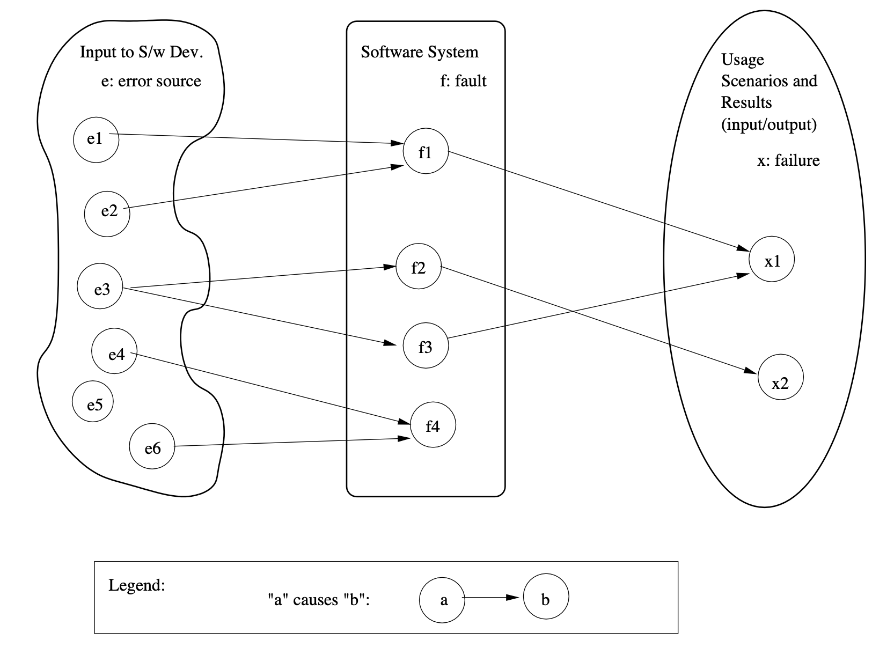
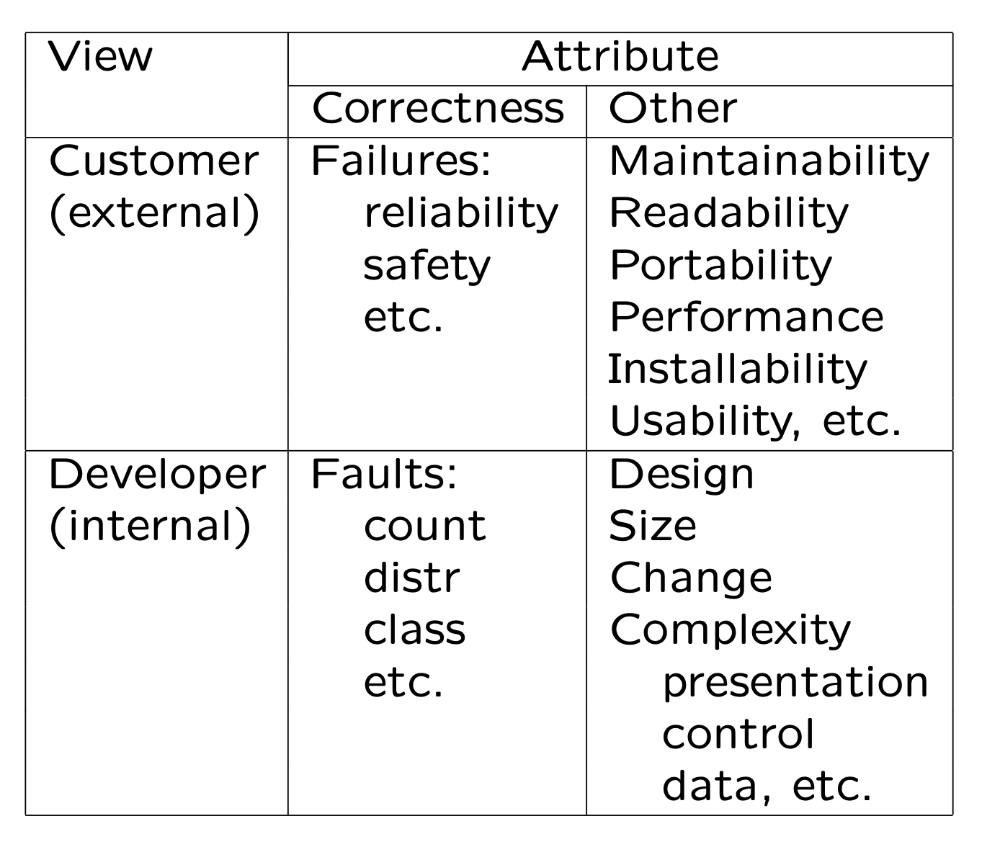

# Chapter 2 What is quality

* Perspectives and Expectations
* Quality Frameworks and ISO-9126
* Correctness, Defect, and Quality
* A Historical Perspective

## 2.1 Perspectives and Expectations

* General: “good” software quality

* Perspectives:

  people/subject’s view, software as object

* Expectations: quality characteristics & level

* In Kitchenham & Pfleeger (1996):

  * Transcendental view: seen/not-defined. 
  * User view: fitness for purpose.
  * Manufacturing view: conform to specs. 
  * Product view: inherent characteristics. 
  * Value-based view: willing to pay.

> * 一般:“良好”的软件质量
>
> * 观点:
>
>   人/主体的观点，软件作为客体
>
> * 期望:质量特点和水平
>
> * Kitchenham & Pfleeger (1996):
>   * 先验视图:可见/未定义。
>   * 用户视图:适合用途。
>   * 制造视图:符合规格。
>   * 产品视图:固有特性。
>   * 基于价值的观点:愿意付费。
>

## 2.2 Quality Perspectives

* Perspectives: subject and object
* Subject: people’s perspectives
  * external/consumer: customers and users
  * internal/producer: developers, testers, and managers
  * other: 3rd party, indirect users, etc.
  * users generalized: other systems etc.
  * focus on external/consumer side

* Objects of our study:
  * software products, systems, and services 
  * stand-alone, embedded, etc.
  * affect quality definitions/expectations

> 2.2质量视角
> * 视角:主体和客体
> * 主题:人们的观点
> * 外部/消费者:客户和用户
> * 内部/制作人:开发者、测试人员和管理人员
> * 其他:第三方、间接用户等。
> * 用户概括:其他系统等。
> * 关注外部/消费者方面
>
> * 研究对象:
> * 软件产品、系统和服务
> * 单机、嵌入式等
> * 影响质量定义/期望

## 2.3 Quality Expectations

* Expectations from different people 

* External/consumer expectations:

  * “good enough” for the price

    * fit-for-use, doing the “right things” 

    * conformance, doing “things right” 

      ⇒ validation and verification (V&V)

  * customer vs user (price?)

  * internal vs external user

  * generalized user: other hw/sw/system/etc.

* Expectations for different software:
  * general: functionality & reliability,
  * usability: GUI/end-user/web/etc.,
  * interoperability: embedded systems, 
  * safety: safety-critical systems, etc.

* Internal/producer:
  * “good enough” for the cost
    * mirror consumer side
    * functionality & correctness via V&V
  * cost: developers vs managers
  * service related: maintainability
  * interfacing units: interoperability
  * 3rd party: modularity

- Different expectations for different types of products and market segments too.
-  Different QA/SQE activities needed.

> 2.3 质量期望
>
> - 不同人的期望
>
> - 外部/消费者期望：
>
>   - 对于价格而言“足够好”
>
>     - 适用性，做“正确的事情”
>
>     - 符合性，正确“做事情”
>
>       ⇒ 验证与确认（V&V）
>
>   - 客户与用户（价格？）
>
>   - 内部用户与外部用户
>
>   - 泛化用户：其他硬件/软件/系统等。
>
> - 不同软件的期望：
>
>   - 通用：功能性与可靠性，
>   - 可用性：图形用户界面/终端用户/网络等，
>   - 互操作性：嵌入式系统，
>   - 安全性：安全关键系统等。
>
> - 内部/生产者：
>
>   - 对于成本而言“足够好”
>     - 反映消费者侧
>     - 通过验证与确认实现功能性与正确性
>   - 成本：开发者与管理者
>   - 服务相关：可维护性
>   - 接口单元：互操作性
>   - 第三方：模块化
>
> - 不同类型的产品和市场细分也有不同的期望。
> - 不同的质量保证/软件质量工程活动也是必需的。

## 2.4 ISO-9126 Quality Framework

* ISO 9126 quality characteristics:
  * Functionality: what is needed? 
  * Reliability: function correctly. 
  * Usability: effort to use.
  * Efficiency: resource needed.
  * Maintainability: correct/improve/adapt. 
  * Portability: one environment to another.

* Impact and limitations:
  * Characteristics into sub-characteristics 
  * Comprehensive framework
  * Strict hierarchy ⇒ other alternatives

> 2.4 ISO-9126 质量框架
>
> - ISO 9126 质量特性：
>   - 功能性：需要什么？
>   - 可靠性：正确执行功能。
>   - 可用性：使用的努力。
>   - 效率：所需资源。
>   - 可维护性：更正/改进/适应。
>   - 可移植性：从一个环境转移到另一个环境。
> - 影响与局限性：
>   - 特性细化为子特性
>   - 综合性框架
>   - 严格的层次结构 ⇒ 其他替代方案

> >
> > ISO-9126质量框架是一个用于软件产品质量评估和保证的国际标准，它定义了软件质量的六个主要特性以及这些特性下的若干子特性。这个框架提供了一个全面的方法来评估和描述软件产品的质量，旨在帮助开发者、评估者和用户理解和满足质量需求。下面是ISO-9126质量特性及其在实际软件项目中的应用例子：
> >
> > 
> >
> > 功能性
> >
> > **定义：** 软件能够提供适当的功能以满足特定需求。 **例子：** 一个文本编辑器提供拼写检查、格式化文本、导出PDF等功能。
> >
> > 
> >
> > 可靠性
> >
> > **定义：** 软件能够在规定条件下保持其性能水平。 **例子：** 银行软件在处理交易时能够确保数据的准确性和一致性，即使在系统负载较高或网络问题发生时也不例外。
> >
> > 
> >
> > 可用性
> >
> > **定义：** 软件能够被用户容易地理解、学习、使用，并对用户友好。 **例子：** 一款手机应用有一个直观的用户界面，使用户能够轻松找到并使用各种功能，如在线购物、订单跟踪等。
> >
> > 
> >
> > 效率
> >
> > **定义：** 软件能够在执行其功能时，对系统资源的使用进行有效管理。 **例子：** 一个视频处理软件能够快速渲染视频，同时优化CPU和内存的使用，以提供流畅的用户体验。
> >
> > 
> >
> > 可维护性
> >
> > **定义：** 软件能够容易地被修改以改正缺陷、改善性能或其他属性。 **例子：** 企业资源规划（ERP）系统设计有模块化架构，便于添加新的功能模块或更新现有模块，以应对业务需求的变化。
> >
> > 
> >
> > 可移植性
> >
> > **定义：** 软件能够被从一个环境转移到另一个环境。 **例子：** 一个跨平台的办公软件能够在Windows、macOS和Linux操作系统上运行，而不需要进行重大修改。
> >
> > ISO-9126质量框架通过这些特性和子特性提供了一个评估软件质量的结构化方法。然而，它的严格层次结构可能限制了其适用性，促使一些组织寻找或开发其他替代方案来更好地满足他们的具体需求。

## 2.5 Other Quality Frameworks

Adaptation of ISO-9126:

- customized for companies
  * e.g., IBM’s CUPRIMDSO.
- adapted to application domains
  * reliability, usability, security for Web

* Other quality frameworks/mega-models
  * McCall: factors, criteria, and metrics
  * Basili: GQM (goal-question-metric)
  * SEI/CMM: process focus/levels
  * Dromey: component reflects Q-attributes
  * Defect-based view: common in industry
    * cost of defect: by Boehm, NIST, etc.

> ISO-9126质量框架的适应性调整:
>
> - 针对公司的定制
>   - 例如，IBM的CUPRIMDSO。
> - 针对应用领域的调整
>   - 网络的可靠性、可用性、安全性
>
> 
>
> 其他质量框架/超级模型
>
> - **McCall模型**：该模型通过因素、标准和指标来定义软件质量。它早期提出，侧重于产品的操作、修正和转换特性。
> - **Basili的GQM（目标-问题-指标）方法**：这是一种将组织的目标具体化为可测量的指标的方法，以便于评估这些目标是否被达成。
> - **SEI/CMM（软件工程研究所/能力成熟度模型）**：这是一种重点关注过程的框架，通过定义不同的成熟度等级来帮助组织改进其软件开发过程。
> - **Dromey模型**：这个模型强调组件如何反映质量属性，通过将质量建模为软件构件与质量特性之间的关系来指导质量的改进。
> - **基于缺陷的视角**：这在工业界很常见，关注缺陷产生的成本及其影响。著名的成本模型包括Boehm的软件经济学模型和NIST的经济分析。
>
> 
>
> 示例解释：
>
> - **IBM的CUPRIMDSO模型**是IBM公司定制的软件质量框架，它是ISO-9126的一个扩展，包括了可用性、性能、可靠性、安装性、维护性、文档、安全性、在线性和操作性等多个维度。
> - **针对Web应用**，质量框架可能会特别强调可靠性、可用性和安全性，因为这些是Web应用成功的关键质量特性。
>
> 这些框架和模型提供了不同的视角来审视软件质量，从而能够根据特定的需求和上下文来选择或定制最适合的质量评估方法。

## 2.6 Correctness, Defect and Quality

* High quality ≈ low defect
  * intuitive notion related to correctness
  * quality problem ≈ defect impact
  * widely accepted, but need better definitions

* Defect/bug definition
  * failure: external behavior
    * deviation from expected behavior
  * fault: internal characteristics
    * cause for failures
  * error: incorrect/missing human action
    * error source: conceptual mistakes etc.
  * defect: error, fault, failure collectively
  * bug/debug: problematic terms, avoid

> 
> 高质量 ≈ 低缺陷
>
> - 这是与正确性相关的直观概念
> - 质量问题 ≈ 缺陷影响
> - 虽然广泛接受，但需要更好的定义
>
> 缺陷/错误定义
>
> - 失败：外部行为
>   - 与预期行为的偏离
> - 故障：内部特性
>   - 导致失败的原因
> - 错误：不正确或缺失的人为行动
>   - 错误源头：概念性错误等
> - 缺陷：错误、故障、失败的总称
> - bug/debug：问题术语，避免使用

* Relations: errors ⇒ faults ⇒ failures
  not necessarily 1-1, Fig 2.1 (p.21) above
* Other issues:
  * QA as dealing with defect: Ch.3
  * defect handling/resolution: Chapter 4

> 高质量的软件意味着在软件的执行过程中出现缺陷的可能性很低。这种观点基于软件的正确性——软件能否按照设计和需求的预期来运行。在这个框架下，质量问题通常可以被视为缺陷的影响，即缺陷对软件功能、性能或用户体验的负面影响。
>
> 在详细讨论缺陷定义时，我们区分了几个相关但不同的概念：
>
> - **失败（failure）**指的是软件的外部行为与预期行为不一致的情况。例如，一个计算器应用在执行加法运算时给出了错误的结果。
> - **故障（fault）**是软件内部特性的问题，它是导致软件失败的直接原因。在上面的计算器例子中，故障可能是由于加法运算的代码逻辑错误。
> - **错误（error）**指的是开发过程中的不正确或缺失的人为行动，如编码时的逻辑错误或设计时的概念性错误。这些错误可能导致软件中出现故障。
> - **缺陷（defect）**是一个总称，涵盖了错误、故障和失败。这个术语用于描述从错误的源头到外部表现为失败的整个过程中的任何问题。
> - **bug和debug**是在软件开发中常用的术语，但它们可能会引起误解或被视为非正式的。因此，在正式讨论软件质量时，建议使用更精确的术语，如缺陷（defect）。
>
> 通过这些定义，我们可以更清晰地理解软件质量问题，更有效地识别、分析和解决软件开发和维护过程中的问题。

##==2.7 Defining Quality in SQE==

* Quality: views and attributes

  

*  SQE focus: correctness-related.

> 质量：视角与属性
>
> 视角
>
> - **客户（外部）**：客户的视角通常关注软件的外部表现和与其直接相关的属性。客户关心的是软件是否能够满足他们的需求，以及使用软件时的体验。
> - **开发者（内部）**：开发者的视角则更加关注软件的内部质量，比如代码的可维护性、复杂度以及设计的优雅性等。
>
> 属性
>
> - **正确性**：软件是否按照规定的功能和需求执行。
> - **其他**：还有很多其他的质量属性，它们可以从客户（外部）和开发者（内部）的视角进行考量。
>
> 客户（外部）视角的属性：
>
> - **故障**（指可靠性方面的失败）：软件的可靠性是用户非常关心的，包括软件运行的稳定性和少出错的能力。
> - **安全性**等：软件使用的安全性，特别是对于涉及敏感数据和操作的应用来说非常重要。
> - **可维护性、可读性、可移植性、性能、可安装性、可用性**等：这些都是用户在使用软件产品时可能关心的其他方面。例如，软件是否容易安装和使用，是否能够在不同的平台上运行，运行时的性能如何，以及在需要时是否容易进行维护和升级等。
>
> 开发者（内部）视角的属性：
>
> - **故障数、分布、类别**等：这些都是开发者关注的软件内部质量指标，可以帮助他们了解软件的缺陷密度和问题分布情况。
> - **设计、大小、变更复杂度**以及**表示、控制、数据**等方面：这些属性关注的是软件的内部结构和组织，包括代码的大小、设计的复杂性以及如何管理数据和控制流等。
>
> 软件质量工程（SQE）的焦点：
>
> - SQE主要关注于与正确性相关的属性。这意味着SQE的目标是确保软件能够准确地执行其预定功能和需求，同时也关注于提高软件的其他质量属性，如可维护性、可用性等，以提供高质量的软件产品。

## 2.8 Quality: Historical Perspective

* Software vs other products/systems:

  * pre-software/IT: manufacturing process $\rightarrow$ physical-object attributes (defects)

  * service: manage expectations: 0 defect $\rightarrow$ 0 defection

  * IT and software: below

* The new meaning of quality in the information age (Prahalad & Krishnan 1999):

  * Conformance/adaptability/innovation

  * Traditional: conformance only

  * Domain-specific (for info. age):

    * specificity, stability, evolvability

* A historical perspective of SE, in 4 stages (Musa & Everett, 1990):

  * functional: focus on automation

  * schedule: timely/orderly product intro

  * cost: competitive marketplace

  * reliability: meet user expectations

* Historical perspectives based on:

  * measurement/feedback (Part IV),

  * process maturity, etc.

* So, what is software quality?

  * many aspects/perspectives, but correctness-centered in SQE

> 2.8 质量：历史视角
>
> - 软件与其他产品/系统对比：
>   - 在软件/信息技术之前：制造过程 → 物理对象属性（缺陷）
>   - 服务业：管理期望：0缺陷 → 0流失
>   - 信息技术和软件：见下文
> - 信息时代质量新含义（Prahalad & Krishnan 1999）：
>   - 符合性/适应性/创新
>   - 传统上：仅限于符合性
>   - 针对信息时代的特定领域：
>     - 特异性、稳定性、可进化性
> - 软件工程的历史视角，分为四个阶段（Musa & Everett, 1990）：
>   - 功能性：关注自动化
>   - 进度：及时/有序的产品引入
>   - 成本：竞争性市场
>   - 可靠性：满足用户期望
> - 基于以下方面的历史视角：
>   - 测量/反馈（第四部分）、
>   - 过程成熟度等。
> - 那么，什么是软件质量？
>   - 许多方面/视角，但在软件质量工程（SQE）中以正确性为中心。

> > 解释并举例
> >
> > 软件与其他产品或系统相比，其质量的评估和保证有着独特的挑战和机遇。在信息技术之前，产品质量主要关注于物理对象的属性和制造过程中的缺陷。例如，汽车制造行业通过改进制造流程和增加质量控制检查来减少物理缺陷，以提高汽车的可靠性和安全性。
> >
> > 服务行业，如酒店和银行，通过管理顾客的期望和提供无缺陷的服务来减少顾客流失。例如，酒店可能通过提供一致的高标准服务和及时响应客户投诉来实现这一点。
> >
> > 在信息时代，软件质量的含义扩展到了符合性、适应性和创新。这意味着软件不仅需要满足规定的需求和标准，还需要能够适应变化的环境和需求，同时引入创新的功能和解决方案。例如，一个成功的软件应用需要不断更新，以适应新的技术标准和用户需求，同时引入新功能来保持其竞争力。
> >
> > 从历史视角看，软件工程的发展经历了从专注于功能性、进度、成本到可靠性的阶段。这表明，随着时间的推移，软件质量的重点从单一的功能实现转移到了满足用户期望和市场竞争力的多维度目标。
> >
> > 总的来说，软件质量涵盖了多个方面和视角，但在软件质量工程中，正确性——即软件是否按照规定的需求和标准正确执行——仍然是核心关注点。这包括确保软件没有缺陷、能够可靠地执行其功能，以及在必要时能够适应变化和进化。