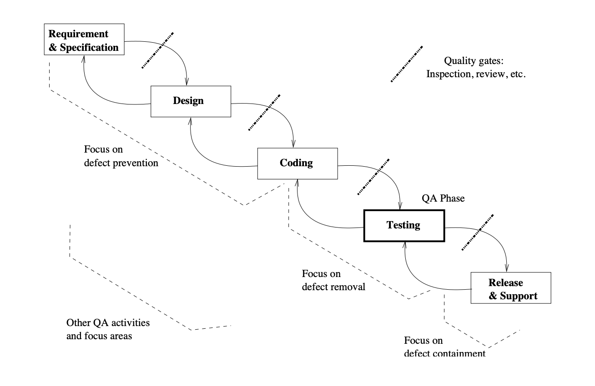
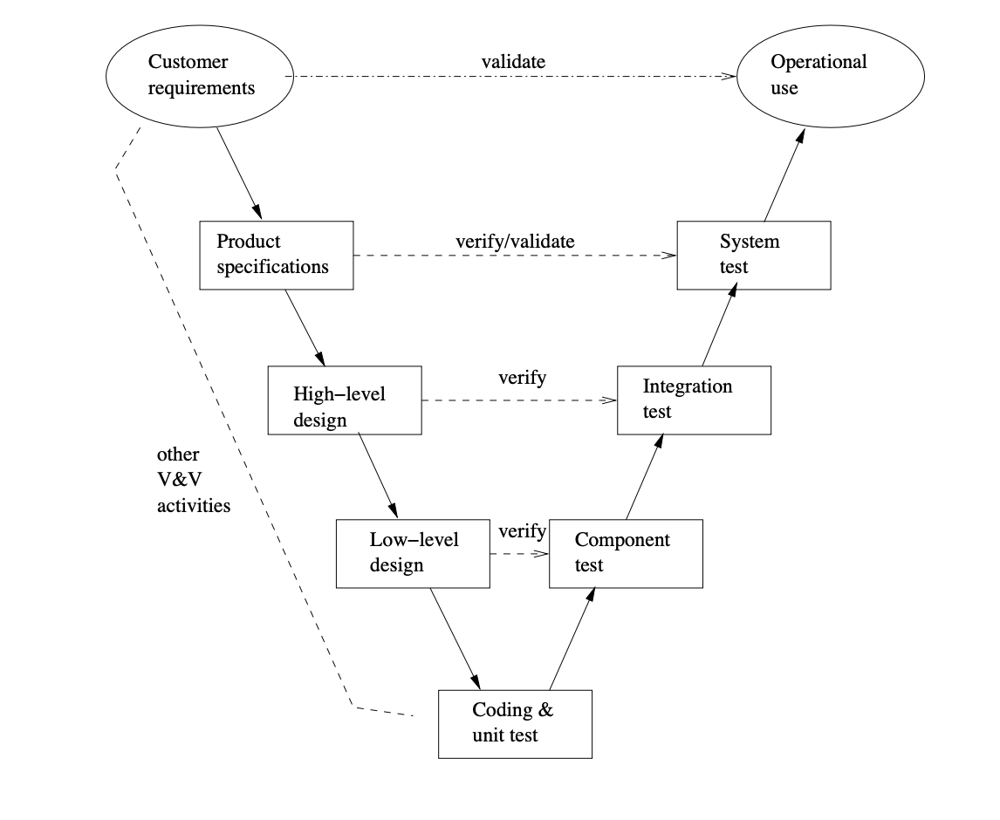
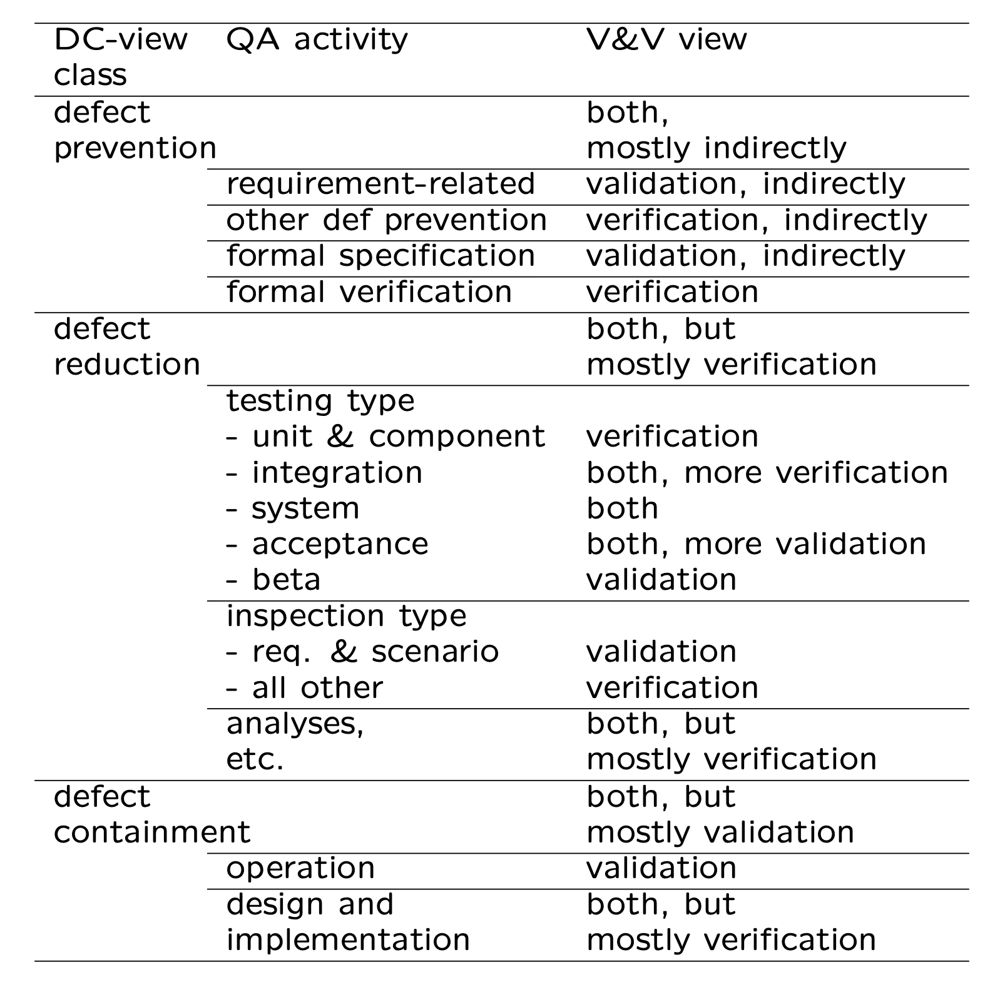

# Chapter 4 QA in Context

- Defect Handling
- QA in Software Processes
- V&V Perspective
- QA: Defect View vs V&V View

## 4.1 QA in Context

* QA and the overall development context

  * defect handling/resolution

  * activities in process

  * alternative perspectives:

    verification/validation (V&V) view 

* Defect handling/resolution
  * status and tracking
  * causal (root-cause) analysis
  * resolution: defect removal/etc.
  * improvement: break causal chain

> - 质量保证与整体开发上下文
>   - 缺陷处理/解决
>   - 过程中的活动
>   - 替代视角： 验证/确认（V&V）视角
> - 缺陷处理/解决
>   - 状态和跟踪
>   - 因果（根本原因）分析
>   - 解决方案：缺陷移除等
>   - 改进：打破因果链

> > 解释与例子
> > 质量保证与整体开发上下文
> > 质量保证（QA）是软件开发过程中的一个关键组成部分，它涵盖了从需求收集到设计、编码、测试和部署的每一个阶段。QA的目的是确保软件产品满足预定的质量标准和用户需求，通过有效的缺陷管理和解决方案来提高软件的可靠性和性能。
> >
> > 缺陷处理/解决
> > 状态和跟踪：这涉及到记录和监控缺陷从发现到解决的整个过程，使用缺陷跟踪系统来保持对缺陷状态的实时更新。
> >
> > 因果（根本原因）分析：这是一种识别导致缺陷的根本原因的过程，目的是防止未来的重复问题。通过深入分析缺陷背后的原因，可以更有效地解决问题。
> >
> > 解决方案：这可能包括直接修复缺陷、重新设计软件组件或实施其他纠正措施。
> >
> > 改进：通过从根本上解决问题，打破导致缺陷的因果链，从而在未来的开发过程中避免类似问题的再次发生。
> >
> > 例子
> > 假设在一个软件项目中发现了一个导致系统崩溃的缺陷。首先，项目团队会在缺陷跟踪系统中记录这个问题，并标记为“正在调查”。接下来，通过团队合作进行根本原因分析，发现缺陷是由于某个数据验证函数没有正确处理特定格式的输入数据。解决方案是修正该验证函数，并更新相关的测试用例以覆盖这种特殊情况。此外，团队还决定审查其他类似的函数，以确保不会有类似的问题发生，从而实现对该问题的长期改进和预防。
> >
> > 通过这种方式，QA过程不仅帮助解决了立即的缺陷问题，还通过打破导致缺陷的因果链，提高了软件的整体质量和可靠性。

## 4.2 Defect Measurement and Analysis

* Defect measurement:
  * parallel to defect handling
  * where injected/found?
  * type/severity/impact?
  * more detailed classification possible?
  * consistent interpretation
  * timely defect reporting

* Defect analyses/quality models
  * as followup to defect handling.
  * data and historical baselines
  * goal: assessment/prediction/improvement 
  * causal/risk/reliability/etc. analyses

* Details in Part IV.

> - 缺陷测量：
>   - 与缺陷处理并行
>   - 在哪里注入/发现？
>   - 类型/严重性/影响？
>   - 是否可以进行更详细的分类？
>   - 一致的解释
>   - 及时的缺陷报告
> - 缺陷分析/质量模型
>   - 作为缺陷处理的后续。
>   - 数据和历史基线
>   - 目标：评估/预测/改进
>   - 因果/风险/可靠性等分析

> > 解释与例子
> > 缺陷测量
> > 缺陷测量是软件开发过程中的一个重要方面，它涉及到对软件缺陷的详细记录和分析。这包括确定缺陷在软件生命周期中的注入点和发现点、缺陷的类型（如逻辑错误、界面问题等）、严重性（从轻微到致命）和对软件或用户的影响。通过对这些数据的一致解释和及时报告，可以帮助团队更好地管理缺陷和优化开发过程。
> >
> > 例如，一个团队可能发现大多数缺陷是在测试阶段发现的，但实际上是在需求和设计阶段注入的。这种信息可以指导团队改进早期阶段的活动，减少后续阶段的缺陷。
> >
> > 缺陷分析/质量模型
> > 缺陷分析和质量模型是缺陷测量的进一步深化，它们使用收集到的数据来评估软件质量、预测未来的缺陷趋势和改进软件开发过程。这些分析可以基于历史数据和比较基线，包括因果分析（寻找缺陷背后的根本原因）、风险分析（评估特定缺陷可能导致的风险）和可靠性分析（预测软件在实际使用中的表现）。
> >
> > 例如，通过分析历史缺陷数据，一个团队可能识别出软件开发过程中的某些模式或趋势，指出哪些阶段或活动可能导致更高的缺陷率。基于这些分析，团队可以实施针对性的改进措施，如加强特定阶段的质量控制，或引入新的测试策略，以降低未来缺陷的风险和影响。
> >
> > 通过这种方法，软件团队不仅能够更有效地管理当前的缺陷，还能通过对数据的深入分析和了解，持续改进软件开发过程，提高软件的整体质量和可靠性。

## 4.3 QA in Software Processes

- Mega-process: initiation, development, maintenance, termination.
- Development process components: requirement, specification, design, coding, testing, release.
- Process variations:
  - waterfall development process
  - iterative development process
  - spiral development process
  - lightweight/agile development processes and XP (extreme programming)
  - maintenance process too
  - mixed/synthesized/customized processes
- QA important in all processes

> - **超级过程**：启动、开发、维护、终止。
> - **开发过程组成部分**：需求、规格说明、设计、编码、测试、发布。
> - 过程变种:
>   - 瀑布式开发过程
>   - 迭代开发过程
>   - 螺旋开发过程
>   - 轻量级/敏捷开发过程及极限编程（XP）
>   - 维护过程也包括在内
>   - 混合/综合/定制过程
> - **所有过程中质量保证都很重要**

> > 解释与例子
> > 超级过程
> > 软件开发的超级过程包含了软件生命周期的所有阶段，从项目的启动到其终止。在每个阶段，质量保证（QA）措施都至关重要，以确保软件的质量和可靠性。
> >
> > 开发过程组成部分
> > 在软件开发的各个组成部分中实施QA活动，可以帮助识别和解决问题，从需求定义开始，直到软件发布。例如，在需求阶段，通过仔细审查和验证需求来防止需求误解；在设计阶段，使用设计审查来识别潜在的设计缺陷；在编码阶段，实施代码审查和单元测试来检测和修复错误。
> >
> > 过程变种
> > 瀑布式开发过程：这是一种线性顺序的开发模型，每个阶段完成后才开始下一个阶段。在瀑布模型中，QA活动通常在每个阶段的末尾进行。
> > 迭代开发过程和螺旋开发过程：这些模型通过重复的迭代来逐步完善软件，每次迭代都包括需求定义、设计、实现和测试。在这些模型中，QA是一个持续的过程，伴随着每次迭代。
> > 轻量级/敏捷开发过程及极限编程（XP）：敏捷和XP强调灵活性和快速反应变化，QA通过持续集成、测试驱动开发等实践紧密集成在开发过程中。
> > 维护过程：在软件发布后，维护是不可避免的。QA在维护阶段同样重要，以确保对软件的修改不会引入新的缺陷。
> > QA的重要性
> > 无论采用哪种开发过程，QA都是确保软件质量和满足用户需求的关键。通过在软件开发的每个阶段实施适当的QA活动，可以有效地识别和解决问题，减少开发成本，提高软件的可靠性和用户满意度。例如，在敏捷开发中，通过持续的用户反馈和迭代测试来确保软件产品符合用户的实际需求，并及时调整开发方向。

## 4.4 QA in Waterfall Process

* QA throughout process (Fig 4.1 p.45)
  * defect prevention in early phases
  * focused defect removal in testing phase 
  * defect containment in late phases
  * phase transitions: inspection/review/etc.

> 质量保证贯穿整个过程（图4.1，第45页）
>
> - 在早期阶段预防缺陷
> - 在测试阶段集中移除缺陷
> - 在后期阶段控制缺陷
> - 阶段转换：审查/检查等

> > 解释与例子
> > 瀑布过程中的质量保证
> > 瀑布模型是一种传统的软件开发过程，按照固定顺序通过需求分析、设计、实现、测试、部署和维护等阶段。在这种模型中，质量保证（QA）活动在每个阶段都至关重要，以确保软件的质量和可靠性。
> >
> > 在早期阶段预防缺陷：在需求分析和设计阶段，通过仔细审查需求文档和设计规格，可以预防许多潜在的缺陷。例如，使用正式的需求审查会议来验证需求的完整性和一致性，确保所有需求都被正确理解和记录。
> >
> > 在测试阶段集中移除缺陷：在实现（编码）后的测试阶段，通过各种测试方法（如单元测试、集成测试、系统测试）集中识别和修正软件中的缺陷。例如，通过单元测试检查单个组件的功能，通过系统测试验证整个软件系统的行为。
> >
> > 在后期阶段控制缺陷：在软件部署和维护阶段，如果发现新的缺陷，需要采取措施控制这些缺陷的影响，并确定修复的优先级。例如，使用缺陷跟踪系统来管理发现的问题，并安排修复计划。
> >
> > 阶段转换：审查/检查等：在从一个阶段过渡到另一个阶段时，通过审查和检查来验证前一阶段的成果是否满足进入下一阶段的条件。例如，设计完成后进行设计审查，确保设计满足需求规格，并且可以支持后续的实现工作。
> >
> > 例子
> > 假设一个软件开发项目正在开发一个在线购物平台。在需求分析阶段，团队通过需求审查会议来确保所有用户需求都被充分理解和记录。在设计阶段，通过设计检查来验证架构和数据模型是否能满足这些需求。在编码阶段，实施代码审查和单元测试来检测编码错误。在测试阶段，通过集成测试和系统测试来识别更多的缺陷。最后，在软件发布后，通过缺陷跟踪和用户反馈来管理和修复新发现的问题。

## 4.5 QA in Software Processes

* Process variations (¬ waterfall) and QA:
  * iterative: QA in iterations/increments
  * spiral: QA and risk management
  * XP: test-driven development
  * mixed/synthesized: case specific
  * more evenly distributed QA activities

-  QA in maintenance processes:
  * focus on defect handling;
  * some defect containment activities for critical or highly-dependable systems;
  * data for future QA activities
- QA scattered throughout all processes

> - 程变种（非瀑布式）与质量保证：
>   - 迭代式：迭代/增量中的QA
>   - 螺旋式：QA与风险管理
>   - XP（极限编程）：测试驱动开发
>   - 混合/综合式：特定案例
>   - 更均匀分布的QA活动
>
> - 维护过程中的QA：
>   - 专注于缺陷处理；
>   - 对于关键或高度依赖的系统，进行一些缺陷控制活动；
>   - 为未来的QA活动提供数据
> - 质量保证贯穿所有过程

> > 解释与例子
> > 过程变种与质量保证
> > 迭代式开发中，QA活动被嵌入到每个迭代或增量中，允许团队持续地评估和改进软件的质量。例如，在每个迭代结束时执行回顾会议，讨论缺陷和改进措施。
> >
> > 螺旋式开发强调风险管理和迭代式原型制作。在每个循环中，QA活动与风险分析紧密结合，确保识别和减轻潜在的项目风险。
> >
> > **极限编程（XP）**采用测试驱动开发（TDD），先写测试用例再编写代码以通过测试。这种方法促进了从开发早期就开始的质量保证。
> >
> > 混合/综合式开发根据项目需求定制QA活动。例如，结合敏捷方法的灵活性和瀑布模型的结构性，以满足特定项目的需求。
> >
> > 在所有这些过程变种中，QA活动更加均匀地分布在整个软件开发生命周期中，而不是仅集中在某个阶段。
> >
> > 维护过程中的QA
> > 维护阶段的QA活动主要聚焦在缺陷处理上，包括修复在软件使用过程中发现的缺陷。对于关键或高度依赖的系统，还会进行缺陷控制活动，如打补丁和发布更新，以确保系统的稳定性和安全性。此外，维护活动提供的数据可以用来改进未来的QA策略和过程。
> >
> > QA贯穿所有过程
> > 在所有的软件开发和维护过程中，质量保证是一个持续的关注点。从项目开始到结束，以及在维护和更新期间，持续的QA活动帮助确保软件产品满足质量标准和用户需求。例如，一个采用敏捷方法的项目可能会在每个冲刺中进行用户故事的验收测试，以及定期的代码审查和性能测试，确保软件在快速迭代中仍保持高质量标准。

## 4.6 V&V

* Core QA activities grouped into V&V. 

* Validation: w.r.t. requirement (what?)

  * appropriate/fit-for-use/“right thing”?

  * scenario and usage inspection/testing; 
  * system/integration/acceptance testing; 
  * beta testing and operational support.

* Verification: w.r.t. specification/design (how?)
  * correct/“doing things right”?
  * design as specification for components; 
  * structural and functional testing;
  * inspections and formal verification.

> - 核心质量保证活动归类为验证与确认。
> - 确认：相对于需求（做什么？）
>   - 是否适当/适用/“做正确的事”？
>   - 场景和使用情况的检查/测试；
>   - 系统/集成/验收测试；
>   - Beta测试和运营支持。
> - 验证：相对于规格说明/设计（怎么做？）
>   - 是否正确/“正确地做事”？
>   - 设计作为组件的规格说明；
>   - 结构和功能测试；
>   - 检查和正式验证。

> > 解释与例子
> > 验证与确认
> > 在软件开发过程中，验证（Verification）和确认（Validation）是两个关键的质量保证活动，它们帮助确保软件产品既符合设计和规格说明，又满足用户的需求和期望。
> >
> > 确认
> > 确认的目标是确保软件产品满足用户的需求，即“做正确的事”。这涉及到评估软件的功能和性能是否符合用户的实际使用场景和需求。例如，在软件开发的早期阶段，通过用户故事和使用案例来验证需求的完整性；在开发后期，通过系统测试、集成测试和验收测试来验证软件是否满足这些需求；最后，通过Beta测试和运营支持来收集用户反馈，进一步确认软件的适用性。
> >
> > 验证
> > 验证的目标是确保软件产品正确实现了规格说明和设计，即“正确地做事”。这包括检查软件的内部结构和逻辑是否按照预定的设计规格进行构建和实现。例如，通过设计审查来验证设计是否满足规格说明；通过结构测试（如单元测试）和功能测试来验证软件组件的实现；以及通过代码审查和正式的验证方法（如模型检查）来确保软件的正确性。
> >
> > 例子
> > 假设开发一个电子商务平台，确认活动可能包括与用户合作定义功能需求，然后通过用户接受测试来验证这些需求是否得到满足。另一方面，验证活动可能包括对购物车组件的单元测试，以确保它按照技术规格正确处理商品添加和删除操作，以及对整个平台的性能测试，以验证它符合设计时的性能标准。
> >
> > 通过这样的V&V活动，团队不仅可以确保软件按照技术规格正确构建，而且可以确保它满足用户的实际需求和期望，从而提高软件产品的整体质量。

## 4.7 V&V in Software Process

* V&V in V-model above (Fig 4.2 p.49):
  * V-model as bent-over waterfall
  * left-arm: implementation (& V&V) 
  * right-arm: testing (& V&V)
  * user@top vs. developer@bottom

> - V模型被视为弯曲的瀑布模型。
> - 左臂：实现（及V&V）
> - 右臂：测试（及V&V）
> - 顶部是用户，底部是开发者

> > 解释与例子
> > V模型和其在V&V中的角色
> > V模型是软件开发过程中一个常用的模型，它通过可视化的方式强调了开发活动（实现）和测试活动（V&V）之间的对应关系。与传统的瀑布模型相比，V模型特别强调在每个开发阶段之后立即进行相应的测试和验证活动，从而提高软件质量和可靠性。
> >
> > 左臂代表软件开发过程中的各个阶段，包括需求分析、系统设计、架构设计、模块设计等，以及与之对应的验证活动。在这一过程中，验证活动旨在确认开发活动的输出物是否符合之前阶段的规格和需求。
> >
> > 右臂代表随后的测试阶段，包括单元测试、集成测试、系统测试和验收测试，以及与之对应的确认活动。在这一过程中，确认活动旨在验证软件是否满足用户的实际需求和期望。
> >
> > 用户@顶部 vs. 开发者@底部：这个布局强调了V&V活动是连接用户需求与软件开发的桥梁。用户在顶部，表示他们的需求和期望是整个开发过程的出发点和终点；开发者在底部，代表他们在实现这些需求的过程中扮演的角色。
> >
> > 例子
> > 在使用V模型开发一个银行系统时，需求分析阶段确定了系统必须支持的交易类型。在左臂的系统设计阶段，开发团队设计了满足这些需求的软件架构，并进行了相应的验证，确保设计方案能够满足需求。随着进入右臂的单元测试阶段，团队对每个交易类型的处理模块进行了测试，确认它们按照设计正确执行。在集成测试和系统测试阶段，验证系统的各个部分能够一起工作，并且整个系统满足用户的期望。最终，在验收测试阶段，用户参与测试，确认系统满足他们的业务需求。
> >
> > 通过这种方式，V模型通过在每个开发阶段后配对相应的V&V活动，帮助确保软件产品从一开始就在正确的轨道上发展，并最终满足用户的需求。

## 4.8 V&V vs DC View

* Two views of QA:
  * V&V view
  * DC (defect-centered) view in this book 
  * Interconnected: mapping possible?

* Mapping between V&V and DC view:
  * V&V after commitment (defect injected already)
     ⇒ defect removal & containment focus
  * Verification: more internal focus
  * Validation: more external focus
  * In V-model: closer to user (near top) or developer (near bottom)?

> - 质量保证的两种视角：
>   - V&V视角
>   - 本书中的缺陷中心（DC）视角
>   - 是否可以相互连接：映射可能？
>
>  * V&V与DC视角之间的映射：
>   * V&V在承诺之后（缺陷已注入） ⇒ 焦点在缺陷移除和控制
>    * 验证：更多内部焦点
>    * 确认：更多外部焦点
>    * 在V模型中：更靠近用户（接近顶部）还是开发者（接近底部）？
> 

> > 解释与例子
> > V&V与DC视角
> > V&V视角强调的是通过验证（确保产品按照规格说明书和设计文档进行了正确构建）和确认（确保产品满足用户需求和预期）的过程来实现质量保证。
> >
> > 缺陷中心（DC）视角则侧重于识别、追踪和解决软件开发过程中出现的缺陷，以及采取预防措施防止未来缺陷的产生。
> >
> > 这两种视角虽然侧重点不同，但实际上是相互补充的。V&V活动有助于防止和识别缺陷，而DC视角则关注于如何处理这些缺陷。
> >
> > V&V与DC视角之间的映射
> > 在V模型中，V&V活动分布在模型的两臂上，其中验证活动更接近开发过程的底部，侧重于内部质量和技术规格的符合性；而确认活动则更接近顶部，侧重于外部质量和用户需求的满足。
> >
> > 从DC视角来看，一旦在软件生命周期的任何阶段注入了缺陷，V&V活动就变成了缺陷移除和控制的关键环节。在V模型中，这意味着缺陷的识别和解决不仅仅发生在开发的早期阶段，而且在接近用户的测试阶段也同样重要。
> >
> > 例子
> > 假设在软件开发过程中，需求分析阶段遗漏了一个关键功能。在V模型的左臂，这个遗漏可能在设计审查（验证活动）时未被识别。然而，当软件进入系统测试阶段（确认活动），用户测试可能揭示了这个遗漏，这时缺陷中心视角就显得尤为重要，需要团队识别和解决这个问题，然后通过额外的验证和确认活动确保解决方案的有效性。
> >
> > 通过在V&V活动中整合缺陷中心视角，软件团队可以更全面地管理和提高软件质量，确保最终产品不仅技术上符合规格，而且满足用户的实际需求和预期。

## 4.9 DC-V&V Mapping (Table 4.1, p.51)

> 在讨论软件质量保证（QA）时，缺陷中心（DC）视角和验证与确认（V&V）视角提供了两种不同但互补的方法来处理和减少软件开发过程中的缺陷。下面是这两种视角如何相互映射和支持软件质量改进的概述：
>
>  缺陷预防
>
> - **需求相关的其他缺陷预防**：通过形式化规格和形式化验证，可间接地在V&V视角中实现验证和确认，主要是通过验证活动。
> - **形式化规格**和**形式化验证**：这两种技术都在V&V过程中起到作用，尤其是在验证方面，帮助确保软件的设计和实现符合严格定义的规格。
>
>  缺陷减少
>
> - 测试类型：
>   - 单元和组件测试、集成测试、系统测试、验收测试以及Beta测试主要关注于验证，但系统测试和验收测试也涉及到确认。
> - 检查类型：
>   - 需求和场景检查更侧重于确认，而对于所有其他检查，V&V视角都有所涵盖，但更多侧重于验证。
> - 分析等：
>   - 涵盖V&V的所有方面，但根据具体活动，可能更侧重于验证或确认。
>
> 缺陷控制
>
> - **运行设计和实现**：这些活动在确保软件在实际操作中能够有效地管理和控制已知缺陷方面起着关键作用，既涉及验证也涉及确认。
>
> 通过将DC视角和V&V视角结合起来，软件开发团队可以从多个角度来识别、预防、减少和控制缺陷，从而提高软件的整体质量和可靠性。例如，在需求分析阶段通过形式化规格来预防缺陷，通过单元测试和代码审查来减少缺陷，以及通过Beta测试和运行时监控来控制缺陷的影响。这种综合方法有助于确保软件不仅在技术上符合规格说明书，而且在实际使用中满足用户的需求和期望。

> > 示例项目：在线购物平台
> > 假设团队正在开发一个在线购物平台，该项目需要处理客户信息、库存管理和订单处理等关键功能。
> >
> > 缺陷预防
> > 需求分析阶段：通过形式化的需求规格说明书来明确客户信息处理、库存管理和订单处理的具体需求。在这一阶段，V&V活动（尤其是验证）帮助确保这些需求被正确理解和记录。同时，DC视角强调需求审查会议来识别可能的需求遗漏或歧义，作为预防缺陷的一种方式。
> >
> > 缺陷减少
> > 设计阶段：采用形式化验证方法，比如使用UML工具来建模软件架构，确保设计满足之前定义的需求规格。这里，验证活动确保设计的正确性，而DC视角关注于设计审查，以减少由于设计缺陷而引入的错误。
> > 编码阶段：开发者采用测试驱动开发（TDD），先写测试用例再编写代码，这是V&V视角中的一个典型验证活动。同时，代码审查作为DC视角的一部分，帮助团队成员相互检查代码以减少缺陷。
> >
> > 缺陷控制
> > 测试阶段：系统经过单元测试、集成测试和系统测试，这些都是V&V视角下的验证活动，旨在识别和修复代码中的缺陷。Beta测试阶段允许真实用户在生产环境中测试软件，这更倾向于确认活动，帮助确认软件是否满足用户的实际需求。
> >
> > 上线后：在软件部署后，维护团队使用运行时监控和日志分析等工具来控制缺陷影响，这些活动既包含了DC视角（识别并修复运行中的问题）也包含了V&V视角（通过实际使用情况验证软件的稳定性和性能）。
> > 通过这个例子，我们可以看到，缺陷中心视角和验证与确认视角在软件开发的不同阶段都发挥着关键作用。它们共同目标是确保软件不仅在技术上符合规格说明书，而且能够满足用户的实际需求和期望，从而提高软件的整体质量和用户满意度。