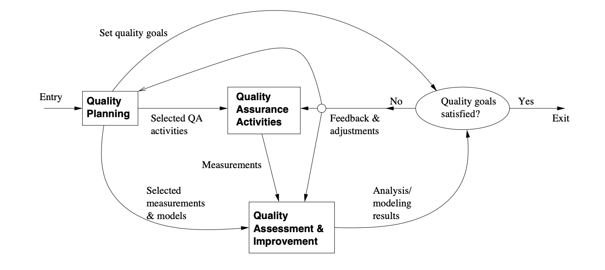

# Chapter 5 Quality Engineering

* SQE: Software Quality Engineering
* Key SQE Activities
* SQE in Software Process

## 5.1 QA to SQE

 QA activities need additional support:

- Planning and goal-setting
- Management:
  * when to stop?
  * adjustment and improvement, etc.
  * all based on assessments/predictions

* Assessment of quality/reliability/etc.:
  * Data collection needed
  * Analysis and modeling
  * Providing feedback for management

* QA + above
   ⇒ software quality engineering (SQE)

> 质量保证（QA）活动需要额外的支持：
>
> - 规划和目标设定
> - 管理：
>   - 何时停止？
>   - 调整和改进等
>   - 所有这些都基于评估/预测
>
> - 质量/可靠性等的评估：
>   - 需要收集数据
>   - 分析和建模
>   - 为管理提供反馈
> - QA + 上述活动 ⇒ 软件质量工程（SQE）

> > 解释与例子
> > 从QA到SQE的转变
> > 传统的质量保证（QA）活动着重于通过一系列检查和测试来确保软件产品符合预定的质量标准。这包括代码审查、单元测试、集成测试等。然而，为了更系统地提升软件质量，QA活动需要得到额外的支持，包括规划、管理、质量评估和反馈机制。这些额外的支持活动将QA提升到软件质量工程（SQE）的水平。
> >
> > 规划和目标设定
> > 在项目开始阶段，团队需要确定质量目标和标准，这些目标将指导整个项目的QA活动。例如，对于一个在线银行系统，质量目标可能包括确保高度的安全性、稳定性和用户友好性。
> >
> > 管理
> > 管理活动涉及决定QA活动的范围和深度，以及何时停止测试或审查。这需要基于对软件质量的持续评估和预测。例如，如果通过持续的测试发现新缺陷的比率明显下降，管理层可能会决定软件已准备好发布。
> >
> > 质量评估
> > 质量评估需要收集和分析数据，如缺陷率、测试覆盖率等，以评估软件的质量和可靠性。这些数据可以帮助团队识别质量问题的根源，以及评估改进措施的效果。例如，通过分析缺陷数据，团队可能发现某个软件模块特别容易出错，进而采取针对性的改进措施。
> >
> > 提供管理反馈
> > 基于数据分析的结果，SQE为管理层提供关于软件质量状态的反馈，以及关于如何调整开发和测试策略以提升软件质量的建议。例如，如果分析显示某个特定类型的缺陷频繁出现，管理层可能决定增加对相关领域的测试强度或审查频率。
> >
> > 通过整合这些活动，软件质量工程（SQE）不仅关注于检测和修复软件缺陷，而且通过规划、评估和管理活动，系统地提升软件的整体质量。这种方法使得质量保证变成了一个更全面的、以数据为驱动的过程，有助于确保软件产品能够满足甚至超越用户的期望和需求。

## ==5.2 SQE Process==

*  SQE process to link major SQE activities: Fig 5.1 (p.54)
  * Pre-QA planning;
  * QA: covered previously (Ch.3 & 4); 
  * Post-QA analysis and feedback (maybe parallel instead of “post-”)

> 软件质量工程（SQE）过程将主要的SQE活动联系起来：图5.1（第54页）
>
> - QA前的规划；
> - QA：前面已经覆盖（第3章和第4章）；
> - QA后的分析和反馈（也许与QA同步进行，而非“之后”）

> 解释与例子
> SQE过程
> 在软件质量工程（SQE）过程中，我们通常关注三个主要环节：
>
> QA前的规划：在软件开发生命周期的开始，团队会设定质量目标，并规划如何实现这些目标。这包括选择适当的QA活动、确定所需的资源以及如何度量和评估质量。
>
> QA活动：这涵盖了第3章和第4章中讨论的各种QA实践，如代码审查、测试、验证和确认等。这些活动有助于确保软件产品符合规格要求和用户期望。
>
> QA后的分析和反馈：在QA活动完成后，会对结果进行分析，评估质量目标是否得到满足，并根据结果进行必要的调整。这可能包括更改开发过程、引入新的QA技术或对现有实践进行改进。这个环节可能与QA活动同步进行，形成一个持续改进的循环。
>
> 示例
> 假设一个团队正在开发一个移动应用程序。在项目启动时，团队设定了包括安全性、性能和可用性在内的质量目标，并规划了一系列QA活动来达到这些目标。
>
> 在QA前的规划阶段，团队选择了自动化测试、定期代码审查和性能监控等QA活动。
> 在QA活动阶段，团队实施了这些活动，并收集了相关的度量数据，如缺陷发现率和修复时间。
> 在QA后的分析和反馈阶段，团队分析了收集到的数据，发现虽然性能目标基本得到满足，但在安全性测试中识别了一些问题。根据这些反馈，团队调整了安全性测试的范围，并引入了额外的安全性QA措施，如更频繁的安全审查和增强的加密措施。
> 通过上述活动的反馈和调整，团队能够持续改进开发过程，提高软件产品的质量，更好地满足质量目标。这种整体性的方法，结合了规划、实施和分析，是软件质量工程（SQE）的核心。

## 5.3 SQE and QIP

* QIP (quality improvement paradigm):
  * Step 1: understand baseline
  * Step 2: change then assess impact 
  * Step 3: package for improvement
* QIP support:
  - overall support: experience factory
  - measurement/analysis: GQM (goal-question-metric paradigm)
*  SQE as expanding QA to include QIP ideas.

> - 质量改进范式（QIP）：
>   - 步骤1：理解基线
>   - 步骤2：进行改变然后评估影响
>   - 步骤3：为改进打包
> - QIP支持：
>   - 整体支持：经验工厂
>   - 测量/分析：目标-问题-指标范式（GQM）
> - 软件质量工程（SQE）将QA扩展为包括QIP理念。

> > 质量改进范式（QIP）
> > QIP是一个持续改进软件质量的方法。它是通过以下步骤实现的：
> >
> > 步骤1：理解基线。这意味着要评估当前的软件开发实践和产品质量，并建立基准数据。例如，一个团队可能会评估其当前软件的缺陷密度或用户满意度作为基线。
> >
> > 步骤2：进行改变然后评估影响。在此步骤中，团队会实施变更（如新的测试策略或工具），然后评估这些变更对软件质量的影响。比如，引入自动化测试后，团队会评估其对测试覆盖率和缺陷发现率的影响。
> >
> > 步骤3：为改进打包。将成功的改进策略和实践打包，以便在未来的项目中重用。这包括记录最佳实践、工具配置和教训，以供团队参考。
> >
> > QIP支持
> > 经验工厂提供了一个组织结构，可以收集、分析和共享跨项目的知识和经验，从而支持整个组织的质量改进。
> > GQM范式是一种测量和分析方法，它通过定义明确的目标，从这些目标导出问题，并为这些问题确定度量指标，从而支持质量改进的决策。
> > SQE与QIP的结合
> > SQE将传统的QA活动（如测试和审查）扩展为包括QIP的理念，将质量保证转变为一个更广泛的质量工程过程。例如，SQE不仅关注缺陷的识别和修复，还包括使用GQM来确定质量目标，通过经验工厂来分析和共享知识，以及应用QIP的步骤来持续改进质量管理过程。
> >
> > 通过这种方式，SQE提供了一个更为全面的质量管理框架，它不仅着眼于当前的质量保证，还致力于长期的质量改进和知识管理。

## 5.4 Pre-QA Planning

* Pre-QA planning:
  * Quality goal
  * Overall QA strategy:
    * QA activities to perform?
    * measurement/feedback planning

* Setting quality goal(s):
  * Identify quality views/attributes
  * Select direct quality measurements 
  * Assess quality expectations vs. cost

> - QA前的规划：
>   - 质量目标
>   - 整体QA策略：
>     - 要执行的QA活动？
>     - 测量/反馈规划
> - 设定质量目标：
>   - 确定质量视角/属性
>   - 选择直接的质量度量
>   - 评估质量期望与成本之间的关系

> > 释与例子
> > QA前的规划
> > 在软件开发过程的早期，就要开始进行QA前的规划，这是确保软件质量的重要步骤。
> >
> > 质量目标：确定软件产品需要达到的质量标准。这些目标应当是具体、可度量的，并且与组织的业务目标一致。
> >
> > 整体QA策略：开发一个综合性的计划，决定哪些QA活动将被执行，这些活动可能包括代码审查、各种类型的测试（单元测试、集成测试、系统测试等）、性能评估和安全审计。同时，规划如何收集和使用质量相关的数据，以便进行反馈和持续改进。
> >
> > 设定质量目标
> > 确定质量视角/属性：识别出项目对哪些质量属性最为关注，例如可靠性、性能、可维护性、用户体验等。
> >
> > 选择直接的质量度量：基于选定的质量属性，选择可以直接测量的指标，如缺陷密度、响应时间、系统可用性等。
> >
> > 评估质量期望与成本之间的关系：分析提高某项质量属性可能带来的成本，与预期的质量目标进行比较，以确保计划的实施性和可持续性。
> >
> > 例子
> > 假设一个团队正在开发一个医疗健康应用。在QA前的规划阶段，他们确定了以下质量目标：
> >
> > 安全性：确保所有患者数据都符合HIPAA（健康保险携带和责任法案）的隐私标准。
> > 可用性：用户界面应直观易用，以便患者和医生能够轻松访问信息。
> > 性能：应用应能够快速响应用户的请求，即使在高流量时段。
> > 为了达到这些目标，团队制定了一个包括定期安全审计、用户体验测试和性能监控的QA策略。他们还计划收集关于用户互动和系统性能的数据，并设立反馈机制，以便在开发过程中及时调整QA策略。通过这样的预先规划，团队可以确保他们的健康应用在上市时能够满足用户的期望，并且在运营中能够持续提供高质量的服务。

## 5.5 Setting Quality Goals

* Identify quality views/attributes
  * customer/user expectations, 
  * market condition,
  * product type, etc.

* Select direct quality measurements
  * direct: reliability
  * defect-based measurement 
  * other measurements

* Assess quality expectations vs. cost 
  * cost-of-quality/defect studies
  * economic models: COCOMO etc

> - 确定质量视角/属性
>   - 客户/用户期望，
>   - 市场状况，
>   - 产品类型等。
> - 选择直接的质量度量
>   - 直接：可靠性
>   - 基于缺陷的度量
>   - 其他度量
> - 评估质量期望与成本
>   - 质量成本/缺陷研究
>   - 经济模型：如构造性成本模型（COCOMO）等

> > 解释与例子
> > 确定质量视角/属性
> > 在设定质量目标时，首先需要确定哪些质量视角和属性对项目最为关键。这通常包括：
> >
> > 客户/用户期望：例如，如果软件是面向消费者的，则用户界面的直观性和易用性可能是关键的质量属性。
> > 市场状况：例如，在高度竞争的市场中，性能和创新可能是区分产品的关键质量因素。
> > 产品类型：例如，嵌入式系统的可靠性和安全性可能是最重要的质量属性。
> > 选择直接的质量度量
> > 确定如何度量这些属性。可能的度量包括：
> >
> > 可靠性：比如系统的故障间隔时间（MTBF）。
> > 基于缺陷的度量：比如缺陷密度（每千行代码的缺陷数）。
> > 其他度量：比如代码复杂性度量、功能覆盖率或用户满意度调查结果。
> > 评估质量期望与成本
> > 最后，需要评估达到这些质量目标的成本，这可能包括：
> >
> > 质量成本/缺陷研究：评估提高质量或减少缺陷所需的投资，以及由质量问题导致的潜在损失。
> > 经济模型：如构造性成本模型（COCOMO），它可以帮助估计软件开发的成本，并根据质量目标的改变来调整成本估计。
> > 例子
> > 假设一个团队正在开发一个在线支付系统，他们确定了以下质量目标：
> >
> > 安全性：系统必须符合最新的网络安全标准。
> > 性能：系统应在高流量下保持响应时间小于2秒。
> > 可用性：系统应通过用户友好性测试，确保新用户能在不超过5分钟的时间内学会使用。
> > 为了度量这些目标，团队选择了：
> >
> > 安全性：通过第三方安全审计来验证。
> > 性能：通过压力测试来度量响应时间。
> > 可用性：通过用户测试和调查来度量。
> > 然后，团队使用COCOMO模型来估计增加额外的安全性和性能测试所需的成本，并与预期的质量收益进行比较，以决定最优的投资水平。通过这样的方法，团队可以确保质量目标的实现同时符合预算和时间约束。

## 5.6 Forming QA Strategy

* QA activity planning

  * evaluate individual QA alternatives
    * strength/weakness/cost/applicability/etc.

  - match against goals
  - integration/cost considerations

* Measurement/feedback planning:
  * define measurements (defect & others) 
  * planning to collect data
  * preliminary choices of models/analyses 
  * feedback & followup mechanisms, etc.

> - QA活动规划
>   - 评估各种QA方案
>     - 优势/劣势/成本/适用性等。
>   - 与目标匹配
>   - 集成/成本考虑
> - 测量/反馈规划：
>   - 定义度量（缺陷和其他）
>   - 计划收集数据
>   - 初步选择模型/分析
>   - 反馈与后续机制等。

> > 解释与例子
> > QA活动规划
> > 在形成QA策略时，首先需要评估不同的QA活动，这包括分析每种方法的优缺点、成本和适用性。例如，自动化测试可以提高测试的频率和一致性，但可能需要前期较高的投资。代码审查可能在某些团队中非常有效，但在专业知识不足的情况下可能不适用。规划时需要考虑这些活动如何与项目的质量目标对齐，以及这些活动的集成和成本如何影响项目的总体预算和进度。
> >
> > 测量/反馈规划
> > 度量和反馈规划是QA策略的关键组成部分。团队需要定义将用于评估质量的具体度量，这可能包括缺陷数量、缺陷类型、测试覆盖率、代码复杂性等。之后，团队要规划如何收集这些数据，并确定如何使用这些数据来进行质量评估。这可能涉及初步选择用于分析这些数据的模型和分析方法。最后，需要建立反馈和后续机制，以便根据分析结果调整QA策略和开发过程。
> >
> > 例子
> > 考虑一个开发团队正在为一个医疗设备制造商制定QA策略。他们的质量目标包括确保设备的软件在所有情况下都能准确地执行，并且用户界面简单直观。团队评估了包括对关键组件进行单元测试、集成测试以及进行用户体验测试的多种QA方法。他们决定使用自动化工具来增加测试的效率，并计划每两周收集一次测试结果来评估是否需要调整测试用例。团队还决定使用静态代码分析工具来降低复杂性并提前发现潜在的缺陷。通过这些措施，团队希望在开发过程中持续改进质量，确保最终产品能够满足严格的质量标准。

## 5.7 Analysis and Feedback

* Measurement:
  * defect measurement as part of defect handling process
  * other data and historical baselines 
* Analyses: quality/other models
  * input: above data
  * output/goal: feedback and followup
  * focus on defect/risk/reliability analyses

* Feedback and followup:
  * frequent feedback: assessments/predictions 
  * possible improvement areas
  * project management and improvement

* Details in Part IV.

> - 测量：
>   - 缺陷测量作为缺陷处理过程的一部分
>   - 其他数据和历史基准
> - 分析：质量/其他模型
>   - 输入：上述数据
>   - 输出/目标：反馈和后续跟进
>   - 专注于缺陷/风险/可靠性分析
> - 反馈和后续跟进：
>   - 频繁的反馈：评估/预测
>   - 可能的改进领域
>   - 项目管理和改进

> > 解释与例子
> > 测量
> > 在软件开发过程中，测量是收集有关软件质量的数据的活动。这通常包括缺陷数量、类型、严重性等缺陷度量，以及其他质量相关数据，如代码复杂度、测试覆盖率等。团队还可能参考历史项目的数据，建立基准以评估当前项目的表现。
> >
> > 分析
> > 分析活动利用测量收集的数据来评估软件的质量状态，并识别潜在的风险和问题。这可能涉及到应用统计模型、预测模型或其他质量模型，以从数据中提取有用的信息。分析的结果是确定改进的领域和制定相应行动计划的基础。
> >
> > 反馈和后续跟进
> > 反馈是基于分析结果对开发团队、项目管理者和其他利益相关者进行的通报。它提供了有关当前质量状况的信息，并可能包括关于如何改进的建议。后续跟进是根据这些反馈采取的具体措施，旨在改进项目管理和软件开发实践。
> >
> > 例子
> > 假设一个团队正在开发一个在线教育平台。在项目的早期阶段，他们发现了一个高缺陷密度的模块。团队采取了以下步骤：
> >
> > 测量：记录该模块中的缺陷数量、类型和严重性，与历史类似模块的缺陷数据进行比较。
> > 分析：应用质量模型分析缺陷数据，确定缺陷的根本原因，如是否由于设计不足、编码错误或测试不充分。
> > 反馈：将分析结果和改进建议反馈给开发团队和项目管理者。
> > 后续跟进：团队根据反馈调整设计和编码实践，加强测试策略，并监控改进措施的效果。
> > 通过这种分析和反馈机制，团队能够及时识别和解决问题，优化开发过程，并提高最终产品的质量。这些步骤是SQE中持续质量改进的关键部分。

## 5.8 SQE in Software Processes

* SQE activities ⊂ development activities:
  * quality planning ⊂ product planning
  * QA activities ⊂ development activities
  * analysis/feedback ⊂ project management

* Fitting SQE in software processes:
  * different start/end time
  * different sets of activities, sub-activities, and focuses
  * in waterfall process: more staged (planning, execution, analysis/feedback)
  *  in other processes: more iterative or other variations

> - 软件质量工程（SQE）活动是开发活动的子集：
>   - 质量规划属于产品规划的一部分
>   - 质量保证（QA）活动属于开发活动的一部分
>   - 分析/反馈属于项目管理的一部分
> - 将SQE融入软件过程：
>   - 不同的开始/结束时间
>   - 不同的活动集合、子活动和关注点
>   - 在瀑布过程中：更多阶段性（规划、执行、分析/反馈）
>   - 在其他过程中：更多迭代或其他变体

> > 解释与例子
> > 将SQE融入软件过程
> > 在软件开发过程中，SQE活动需要与产品规划、开发和项目管理活动紧密集成。这意味着在每个开发阶段都要考虑质量因素，并确保质量目标与产品目标一致。
> >
> > 质量规划应当在产品规划阶段就开始，确定质量目标、选择合适的QA活动和测量方法。
> > QA活动应当与开发活动同步进行，包括代码审查、测试、验证和确认等。
> > 分析/反馈是项目管理的一部分，它涉及对QA活动的成果进行评估，并根据结果调整开发和QA策略。
> > 在不同软件过程中的SQE
> > 在瀑布过程中，SQE活动往往是阶段性的。在每个开发阶段结束后，进行质量分析和反馈，然后进入下一个阶段。
> >
> > 在迭代和其他类型的开发过程中，SQE活动可能更加迭代和连续。每次迭代可能包括一系列小的规划、执行和分析/反馈循环，以便更快地响应问题和变化。
> >
> > 例子
> > 例如，在一个采用敏捷开发方法的软件项目中，团队在每个冲刺的开始进行质量规划，确定冲刺目标和关键的质量目标。在冲刺执行过程中，QA活动（如TDD和持续集成）与编码和设计活动并行进行。冲刺结束时，分析/反馈环节帮助团队评估他们是否达到了质量目标，以及是否需要在下一个冲刺中调整方法或重点。
> >
> > 在这个例子中，SQE活动与敏捷开发过程的每个阶段密切结合，形成了一个连续的质量改进循环。这种集成确保了质量保证是开发工作的一个内在部分，而不是一个独立或附加的活动。通过这种方法，团队能够持续地提高产品的质量，并及时响应项目中出现的任何质量问题。

## 5.9 SQE in Waterfall Process

* Fig 5.2 (p.61) above
  * activity start/finish line
  * different focus and effort (later)

> 在水瀑布过程中的软件质量工程（图5.2，第61页）
>
> - 活动的开始/结束线
> - 后期不同的焦点和努力

> > 解释与例子
> > 在水瀑布过程中的软件质量工程
> > 图5.2可能展示了在传统的瀑布软件开发过程中如何融入软件质量工程（SQE）的活动。在瀑布模型中，每个开发阶段按顺序进行，每个阶段结束时都有明确的开始和结束点，SQE活动在特定的点集成进来以提升整个开发过程的质量。
> >
> > 活动的开始/结束线
> > 这可能指的是每个SQE活动在瀑布模型中的确切开始和结束时间。例如，质量规划在项目的需求分析阶段开始，并在整个项目中持续进行，以确保所有活动都以质量为中心。
> >
> > 后期不同的焦点和努力
> > 随着项目的进展，SQE的重点可能会从最初的质量规划转移到后期的质量保证、评估和反馈。例如，早期可能更多关注需求的准确性和设计的合理性，而在项目后期，当项目进入测试、发布和支持阶段时，焦点转向确保缺陷被识别和修正，以及基于用户反馈的持续改进。
> >
> > 例子
> > 设想一个团队正在开发一个企业资源规划（ERP）系统。在质量规划阶段，他们设定了系统性能和用户友好性的质量目标，并选择了与之对应的质量保证策略，如同行评审和性能基准测试。
> >
> > 在设计和编码阶段，他们执行这些质量保证策略，并在每个阶段结束时通过检查点（活动开始/结束线）确认是否达到了质量标准。
> >
> > 进入测试阶段后，焦点转向验证软件是否满足既定的性能标准和用户接口的易用性。测试结果将用于质量评估和改进，如果发现问题，将根据反馈进行必要的调整。
> >
> > 在发布和支持阶段，团队继续监控系统的性能和用户反馈，确保任何后续发现的问题都能够得到及时的响应和解决。这种持续的质量关注确保了ERP系统在整个生命周期中都能保持高质量标准，并且能够适应不断变化的业务需求。

## 5.10 SQE Effort Profile

- QE activity/effort distribution/dynamics:
  - different focus in different phases
  - different levels (qualitatively)
  - different build-up/wind-down patterns
  - impact of product release deadline (deadline-driven activities)

* planning: front heavy
* QA: activity mix  (early vs. late; peak variability? deadline?)
* analysis/feedback: tail heavy (often deadline-driven or decision-driven)

> - 质量工程（QE）活动/努力的分布/动态：
>   - 在不同阶段有不同的焦点
>   - 不同的层次（质量上的）
>   - 不同的增长/减少模式
>   - 产品发布截止日期的影响（受截止日期驱动的活动）
>
> - 规划：前期密集
> - QA：活动混合（早期vs晚期；高峰期变化？截止日期？）
> - 分析/反馈：后期密集（通常受截止日期或决策驱动）

> > 解释与例子
> > SQE努力程度剖析
> > 在一个软件项目中，质量工程的努力程度和活动的分布会随着项目的不同阶段而变化。
> >
> > 在不同阶段有不同的焦点：例如，在项目的早期，重点可能是需求分析和设计审查；而在项目的后期，重点可能转移到测试和缺陷修复。
> > 不同的层次：在项目的早期阶段，质量活动可能更加集中和深入；在项目的后期，质量活动可能更加广泛和多样化。
> > 不同的增长/减少模式：某些质量活动可能在项目初期迅速增长，如需求验证，而其他活动可能在项目后期增加，如系统测试。
> > 产品发布截止日期的影响：随着产品发布的截止日期临近，可能需要加快测试和缺陷修复的活动，以确保产品按时发布。
> > 规划：前期密集
> > 在项目的起始阶段，规划活动较为密集，需要设置目标、定义策略、选择工具和过程。
> >
> > QA：活动混合
> > 在整个项目周期中，QA活动的混合和强度会变化。在早期，可能更侧重于预防性措施，如代码审查和单元测试；在项目接近截止日期时，可能会出现QA活动的高峰，特别是在压力测试和缺陷修复方面。
> >
> > 分析/反馈：后期密集
> > 分析和反馈活动在项目的后期阶段可能更为密集，特别是在做出是否发布产品的决策时。这时，收集的数据和反馈将用于指导最后的质量保证活动和任何必要的产品调整。
> >
> > 例子
> > 假设一个团队正在开发一个新的社交媒体应用程序。在项目开始时，他们进行了密集的质量规划，定义了性能和用户体验的关键指标。随着项目的进行，QA活动如定期的代码审查和自动化测试变得常规化。然而，在发布日期临近时，团队加大了集成测试的力度，并开始了回归测试和负载测试，以确保应用程序能够处理预期的用户量。在最后阶段，团队进行了数据分析，以确定是否满足了质量目标，并为产品发布提供了最终的反馈。这个过程确保了应用程序在上市时既稳定又能提供良好的用户体验。

## 5.11 SQE Effort in Waterfall Process

* Effort profile above (Fig 5.3, p.63)
  - planning/QA/analysis of total effort
  - general shape/pattern only (actually data would not be as smooth)
  - in other processes:
    *  similar but more evenly distributed

> 在水瀑布过程中的软件质量工程努力程度（图5.3，第63页）
>
> - 上述努力程度剖析
>   - 规划/QA/分析的总努力
>   - 只是一般形状/模式（实际数据不会这么平滑）
>   - 在其他过程中：
>     - 类似但更均匀分布

> > 努力程度剖析
> > 在瀑布软件开发过程中，SQE的努力通常按阶段分布，并随时间变化。图5.3可能展示了这三个主要活动——质量规划、质量保证、质量分析——在整个开发时间线上的努力程度。
> >
> > 质量规划在项目开始时就开始了，随着项目的进行，这个努力可能逐渐减少。
> > 质量保证的努力可能在整个项目中逐渐增加，特别是在开发和测试阶段，然后在产品发布前达到高峰。
> > 质量分析的努力可能在项目的后期增加，尤其是在产品发布前后，以评估质量目标是否得到满足并进行最终的改进。
> > 虽然图中的曲线可能显示平滑的变化，但实际情况可能不那么规则，努力的程度可能会因项目具体情况和遇到的挑战而波动。
> >
> > 在其他过程中的努力程度
> > 在敏捷或迭代式开发过程中，这些SQE活动的努力可能更加均匀地分布在每个迭代或冲刺中。每个阶段都会进行一定程度的规划、执行QA活动和进行质量分析，而不是在瀑布模型中那样明显地聚焦在特定的阶段。
> >
> > 例子
> > 在一个瀑布模型的项目中，一个团队可能在项目初期进行了密集的质量规划活动，确立了性能、安全性、可用性等关键质量目标。随着进入设计和编码阶段，团队增加了代码审查和单元测试的努力，以确保代码质量。接近产品发布时，团队加强了系统测试和缺陷修复工作，以确保产品达到质量标准。在产品发布后，质量分析活动变得密集，团队会分析用户反馈和产品性能数据，确定是否需要发布补丁或进行其他改进。