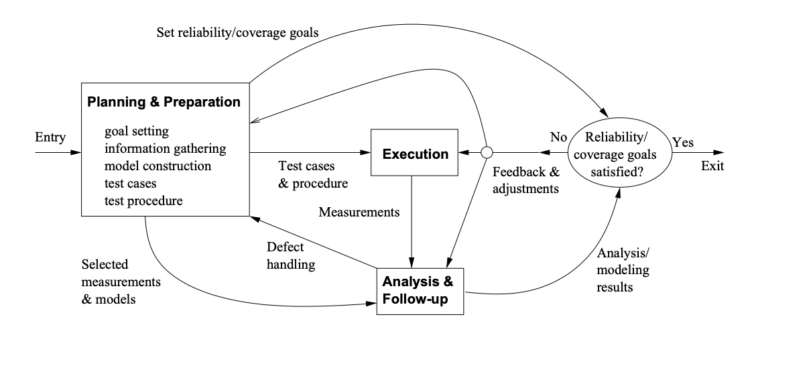

#Chapter 6 Testing Overview

* Testing: Concepts & Process
* Testing Related Questions
* Major Testing Techniques

## ==6.1 Testing and QA Alternatives==

* **Defect and QA:**
  * Defect: error/fault/failure.
  * Defect prevention/removal/containment.
  * Map to major QA activities

* Defect prevention:

  Error blocking and error source removal.

* Defect removal:
  * Testing – Part II, Ch.6-12
  * Inspection, etc.

* Defect containment: Fault tolerance and failure containment (safety assurance).

> - **缺陷与QA：**
>   - 缺陷：错误/故障/失败。
>   - 缺陷预防/移除/控制。
>   - 映射到主要QA活动
> - 缺陷预防： 阻止错误和移除错误源。
> - 缺陷移除：
>   - 测试 - 第二部分，第6-12章
>   - 检查等。
> - 缺陷控制：容错和失败控制（安全保证）。
>
> 

> > 解释与例子
> > 缺陷与QA
> > 在软件开发中，缺陷管理是QA活动的核心组成部分。缺陷可以是代码中的错误（导致系统无法正常工作的逻辑问题），故障（系统的不正确状态），或失败（系统的不期望行为）。
> >
> > 缺陷预防的目标是避免错误和故障的产生。这可以通过改进编程实践、使用更好的设计模式、进行有效的需求管理和代码审查等方法来实现。
> > 缺陷移除涉及识别和修复在软件开发周期中产生的缺陷。这通常通过各种形式的测试（如单元测试、集成测试、系统测试）和检查（如代码审查、设计审查）来完成。
> > 缺陷控制旨在减少已经存在的故障对系统的影响。在系统运行时，通过容错机制（如冗余设计、异常处理）和安全措施（如限制系统在特定条件下的行为）来实现。
> > 例子
> > 考虑一个在线银行系统的开发：
> >
> > 缺陷预防：在需求分析阶段，团队确保所有的用户故事都经过彻底讨论和确认，以避免误解。他们还进行定期的设计审查，以确保架构能够处理潜在的安全问题。
> > 缺陷移除：开发过程中，通过持续集成和自动化测试来定期检查代码质量，及早发现和修复缺陷。此外，团队还安排了定期的代码审查会议，以互相检查彼此的工作。
> > 缺陷控制：在系统部署后，通过设置适当的容错机制，比如数据库的事务回滚和冗余服务器，以确保即使在某个组件失败的情况下，系统仍能维持基本的运行。
> > 通过这些缺陷管理活动，团队能够最大限度地减少软件产品中的缺陷，并确保它们对用户和业务的影响降到最低。

## 6.2 QA and Testing

*  Testing as part of QA:
  - Activities focus on testing phase
  - QA/testing in waterfall and V-models (Fig 4.1, p.45 and Fig 4.2, p.49)
  - One of the most important part of QA
    * defect removal: Fig 3.1 (p.30)
* Testing: Key questions:
  * Why: quality demonstration vs. defect detection and removal
  * How: techniques/activities/process/etc. 
  * View: functional/external/black-box vs. structural/internal/white-box 
  * Exit: coverage vs. usage-based

> - 测试作为QA的一部分：
>   - 活动专注于测试阶段
>   - 瀑布模型和V模型中的QA/测试（图4.1，第45页和图4.2，第49页）
>   - QA中最重要的部分之一
>     - 缺陷移除：图3.1（第30页）
> - 测试的关键问题：
>   - 为什么：展示质量vs.检测和移除缺陷
>   - 如何：技术/活动/过程等
>   - 视角：功能性/外部/黑盒测试 vs. 结构性/内部/白盒测试
>   - 退出：覆盖率vs.基于使用

> > 解释与例子
> > 测试作为QA的一部分
> > 在软件开发过程中，测试是质量保证的关键组成部分，通常专注于开发周期的测试阶段。在瀑布模型和V模型中，测试活动与各个开发阶段对应，旨在验证每个阶段的产出是否符合预定的质量标准。
> >
> > 测试的关键问题
> > 为什么测试：测试的目的可以是为了展示软件的质量，也可以是为了检测和移除软件中的缺陷。这决定了测试活动的重点和测试计划的制定。
> > 如何测试：涉及选择适当的测试技术、活动和过程。这可以包括单元测试、集成测试、系统测试、性能测试等。
> > 测试的视角：从功能性/外部/黑盒测试的角度来看，测试关注于软件的行为是否符合用户的需求。而从结构性/内部/白盒测试的角度来看，测试关注于软件的内部结构和逻辑是否构建得当。
> > 何时停止测试（退出标准）：这可以基于测试覆盖率，即代码或功能被测试的程度；或者基于使用，即测试案例覆盖了用户的实际使用模式。
> > 例子
> > 例如，一个团队正在开发一个电子健康记录系统。他们进行了以下类型的测试：
> >
> > 功能性测试（黑盒）：验证系统是否可以正确地记录和检索患者信息，是否符合临床操作的需求。
> > 性能测试：确保系统在高并发用户访问时仍能快速响应。
> > 安全性测试：检查系统是否有足够的防护措施来保护患者数据的安全和隐私。
> > 代码审查和单元测试（白盒）：检查代码的质量，确保逻辑正确，没有编程错误。
> > 在测试过程中，团队会根据测试结果来不断调整测试策略，直到系统的质量达到可以接受的水平，同时确保测试覆盖了所有关键的功能和用户场景。当系统通过了所有测试并且满足了退出标准时，团队才会将其推向生产环境。通过这样的QA和测试活动，团队可以更有信心地确保软件的质量和稳定性。

##6.3 Testing: Why?

* Original purpose: demonstration of proper behavior or quality demonstration.

  ≈ “testing” in traditional settings.

  * evidence of quality or proper behavior.

* New purpose: defect detection & removal:
  * mostly defect-free software manufacturing vs. traditional manufacturing. 
  * flexibility of software (ease of change; sometimes, curse of change/flexibility) . 
  * failure observation ⇒ fault removal. (defect detection ⇒ defect fixing) . 
  * eclipsing original purpose

> - 最初目的：展示正确的行为或质量展示。 ≈ 在传统设置中的“测试”。
>   - 质量或正确行为的证据。
> - 新目的：缺陷检测与移除：
>   - 几乎无缺陷的软件制造与传统制造相对比。
>   - 软件的灵活性（易于变更；有时，变更/灵活性的诅咒）。
>   - 失败观察 ⇒ 故障移除。（缺陷检测 ⇒ 缺陷修复）。
>   - 使最初的目的相形见绌

> > 解释与例子
> > 测试的原始目的
> > 在软件开发的早期阶段，测试主要是用来展示软件的正确行为或验证软件质量的。这是一种保证，通过测试可以证明软件满足了预定的功能和性能要求，通常在产品发布之前向利益相关者展示软件的可靠性和有效性。
> >
> > 测试的新目的
> > 随着软件工程的发展，测试的主要目的已经转变为缺陷检测和移除。与传统制造业不同，软件制造能够在发现问题后迅速进行修复，这一点得益于软件的灵活性。然而，这种灵活性也可能成为一个问题，因为它可能导致频繁的变更，而没有充分的测试来确保每次变更都不会引入新的问题。
> >
> > 故障的观察变成了一个发现和解决问题的机会，测试不再仅仅是为了证明软件的质量，而是成为一个积极的工具，用于识别和修复缺陷，提高软件的整体质量。
> >
> > 例子
> > 想象一个团队正在开发一个在线支付系统。最初，他们使用测试来证明系统可以安全地处理交易，这是向客户展示系统可靠性的方式。然而，随着开发的进行，他们意识到测试更多的是一个寻找和解决问题的过程，而不仅仅是证明系统已经准备就绪。
> >
> > 在测试过程中，团队可能发现了一个安全漏洞，这立即引起了他们的注意。他们不仅修复了这个问题，还回顾了整个安全协议，以确保没有其他潜在的安全问题。因此，测试从最初的质量展示变成了一个不断的质量改进过程，确保最终产品不仅符合质量标准，而且尽可能地无缺陷。通过这种方式，测试成为了软件开发不可或缺的一部分，帮助团队不断地提高产品的质量和稳定性。

## 6.4 Testing: How

* How? Run-observe-followup (particularly in case of failure observations)

* Refinement

  -> generic process below (Fig 6.1, p.69)

  

* Generic testing process as instantiation of SQE process in Fig 5.1, p.54.

> - 如何？运行-观察-后续跟进（特别是在出现失败的情况下）
> - 精炼 -> 下面的通用过程（图6.1，第69页）
> - 通用测试过程可以看作是SQE过程（如图5.1，第54页所示）的具体实例子

> > 测试的过程
> > 在软件质量工程（SQE）中，测试过程是一系列有组织的步骤，旨在评估软件的质量并确保它满足既定的标准。这个过程通常包括以下步骤：
> >
> > 规划和准备：设定可靠性和覆盖率目标，收集信息，构建模型，准备测试用例和测试程序。
> >
> > 执行：运行测试用例，观察软件行为，记录结果。
> >
> > 分析和后续跟进：处理发现的缺陷，分析测试结果，模型化这些结果，并根据反馈进行必要的调整。
> >
> > 反馈和调整：基于测试结果和分析，确定是否达到了可靠性和覆盖率目标。如果没有，进行调整并可能重复测试。
> >
> > 精炼
> > 通用测试过程可以看作是SQE过程（如图5.1，第54页所示）的具体实例。它强调了测试不仅仅是一个执行操作，而是一个包括规划、执行、分析和反馈的完整循环。
> >
> > 例子
> > 例如，一个团队正在开发一个新的网络应用程序。在测试过程的规划和准备阶段，他们决定重点测试应用程序的负载承受能力和交易的安全性。他们构建了一个测试模型，模拟了高流量和各种安全威胁的场景，并准备了相应的测试用例。
> >
> > 在执行阶段，他们运行了这些测试用例，观察应用程序如何响应高流量和安全攻击，并记录下所有的问题和失败情况。
> >
> > 在分析和后续跟进阶段，他们分析了这些问题，确定了失败的原因，并对应用程序进行了必要的调整。然后，他们可能会重新运行测试，确保所有的问题都已解决。
> >
> > 在整个过程中，团队不断回顾和调整测试策略，以确保最终产品能够满足既定的质量标准，以及在实际部署时能够表现出高度的可靠性和安全性。通过这种方式，测试成为了提高软件质量和确保客户满意度的重要手段。

## 6.5 Testing: Activities & Generic Process

* Major testing activities:
  * test planning and preparation . 
  * execution (testing) . 
  * analysis and followup

* Link above activities ⇒ generic process:
  * planning-execution-analysis-feedback. 
  * entry criteria: typically external. 
  * exit criteria: internal and external. 
  * some (small) process variations 
    * but we focus on strategies/techniques.

> - 主要测试活动：
>   - 测试规划和准备。
>   - 执行（测试）。
>   - 分析和后续跟进。
> - 将上述活动链接⇒通用过程：
>   - 规划-执行-分析-反馈。
>   - 进入标准：通常是外部的。
>   - 退出标准：内部和外部的。
>   - 一些（小的）过程变体
>     - 但我们重点关注策略/技术。

> > 解释与例子
> > 主要测试活动
> > 在软件测试中，有几个关键活动是测试成功的基础：
> >
> > 测试规划和准备：这包括定义测试目标，选择测试方法和工具，以及创建测试用例和测试数据。规划阶段确保测试活动有明确的方向和结构。
> >
> > 执行（测试）：这是实际运行测试用例并记录测试结果的阶段。它包括测试软件的功能、性能、安全性等各个方面。
> >
> > 分析和后续跟进：这包括评估测试结果，识别问题，并据此改进软件。这个阶段是发现和修复缺陷的关键时刻。
> >
> > 通用过程
> > 将上述活动结合起来，我们得到了软件测试的通用过程：
> >
> > 规划-执行-分析-反馈：这是一个循环过程，通过不断迭代来提高软件质量。
> > 进入标准：确定测试是否可以开始的标准。这些通常是由项目的外部因素决定的，比如客户需求或监管要求。
> > 退出标准：决定测试何时完成的标准。这些可以是内部的，比如达到了一定的代码覆盖率；也可以是外部的，比如满足了客户的质量要求。
> > 过程变体：尽管有一些小的变体，但测试的核心通常集中在策略和技术上，以确保有效地执行测试并获得有价值的反馈。
> > 例子
> > 想象一下，一个团队正在为一款移动应用开发测试计划。在规划和准备阶段，他们确定了要在不同类型的设备上测试应用的兼容性，并创建了代表不同用户场景的测试用例。
> >
> > 在执行阶段，他们在真实设备和模拟器上运行这些测试用例，并记录下任何问题或错误。
> >
> > 接下来，在分析和后续跟进阶段，他们评估这些问题的严重性，决定哪些需要立即修复，哪些可以在下一个版本中解决。他们还可能根据反馈调整他们的测试计划，增加额外的测试用例或改进现有的测试。
> >
> > 通过这种方法，测试团队确保了应用程序在发布时能够满足高标准的质量，并在未来的迭代中不断改进。

##6.6 Testing: Planning and Preparation

* Test planning:
  * goal setting based on customers’ quality perspectives and expectations.
  * overall strategy based on the above and product/environmental characteristics.

* Test preparation:
  * preparing test cases/suites:
    * typically based on formal models.
    
  * preparing test procedure. 
  

* More details in Chapter 7.

> > 解释与例子
> > 测试规划
> > 测试规划是确保测试活动有效性和效率的重要步骤。它通常涉及以下内容：
> >
> > 目标设定：根据客户的质量视角和期望来设定测试目标。例如，如果客户特别关注性能，则测试目标可能会侧重于验证系统响应时间和处理能力。
> >
> > 制定总体策略：根据产品特性（如软件的复杂度、使用的技术栈）和环境特性（如目标市场、预定的部署环境）来制定测试策略。这可能包括决定测试的范围、选择测试方法、确定资源需求和时间安排等。
> >
> > 测试准备
> > 准备测试用例和测试程序是测试规划的一部分，它确保了测试活动可以系统地执行。
> >
> > 准备测试用例/套件：这通常涉及到根据软件的功能和需求构建形式化模型，然后根据这些模型来创建测试用例。测试用例应覆盖所有关键功能和潜在的错误情况。
> >
> > 准备测试程序：这是一套详细的步骤说明，描述了如何执行每个测试用例，包括所需的输入数据、执行步骤、预期结果以及记录实
> >
> > 际结果的方式。
> >
> > 例子
> > 设想一个团队正在为一个在线购物平台制定测试计划。在测试规划阶段，他们与客户沟通了质量目标，客户指出最关心的是系统的用户体验和安全性。基于这些期望，团队确定了测试策略，决定重点关注用户界面的可用性测试和支付流程的安全测试。
> >
> > 接下来，在测试准备阶段，团队成员使用用例图和活动图这样的UML（统一建模语言）工具来构建测试用例。他们为每个关键的用户故事设计了测试用例，并准备了一个测试套件，用于自动化执行这些测试用例。测试程序也被详细地编写出来，指导测试人员如何逐步执行测试，以及如何记录和评估结果。
> >
> > 在整个测试准备过程中，团队确保了测试用例能够覆盖所有重要的功能，并且测试步骤清晰明了，以便在执行阶段可以高效地进行。通过这样详细的规划和准备，团队为发现和修复潜在的缺陷，确保软件在上市时能够满足客户的质量期望，打下了坚实的基础。

## 6.7 Testing: Execution

- General steps in test execution
  - allocating test time (& resources)
  - invoking test
  - identifying system failures (& gathering info. for followup actions)
- Key to execution: handling both normal vs. abnormal cases
- Activities closely related to execution:
  - failure identification: test oracle problem
  - data capturing and other measurement
- More details in Chapter 7.

> - 测试执行中的一般步骤
>   - 分配测试时间（和资源）
>   - 调用测试
>   - 识别系统失败（并收集信息以供后续行动）
> - 执行的关键：处理正常情况与异常情况
> - 与执行密切相关的活动：
>   - 失败识别：测试甲骨文问题
>   - 数据捕获和其他测量
> - 第7章有更多细节。

> > 解释与例子
> > 测试执行的一般步骤
> > 在软件测试中，执行阶段是实际运行测试用例并观察结果的过程。这通常包括以下步骤：
> >
> > 分配测试时间和资源：根据测试计划，决定每个测试用例或测试套件所需的时间和资源。
> >
> > 调用测试：执行测试用例，这可能涉及到启动测试环境、输入测试数据、运行测试脚本等。
> >
> > 识别系统失败：在测试执行过程中，识别并记录系统的任何失败行为，同时收集足够的信息以供后续的分析和修复。
> >
> > 执行的关键
> > 成功的测试执行不仅要处理系统的预期（正常）行为，也要处理系统的异常行为。这需要测试人员对预期结果有清晰的理解，并能够识别和记录任何偏离这些预期的行为。
> >
> > 与执行密切相关的活动
> > 失败识别：这涉及到确定测试结果是否符合预期，通常称为“测试甲骨文”问题。测试甲骨文可以是简单的断言，也可以是复杂的检查逻辑。
> >
> > 数据捕获和其他测量：在测试执行过程中，收集有关测试执行的数据，如执行时间、资源使用、输出数据等。这些数据对于后续的分析和质量评估至关重要。
> >
> > 例子
> > 假设一个团队正在进行一个网络应用程序的性能测试。在测试执行阶段，他们安排了多个并发用户来模拟高负载情况，并观察应用程序的响应时间。
> >
> > 他们首先分配足够的时间来温和地增加负载，并观察系统何时开始出现性能瓶颈。
> > 在测试执行过程中，他们调用了事先准备好的测试用例，并记录了每次测试的详细日志。
> > 当系统失败时，他们记录了失败发生的具体条件，包括用户负载、执行时间和系统的具体响应。
> > 通过这个过程，团队能够识别出性能瓶颈，并收集了有用的数据以供性能优化使用。这样的执行策略确保了测试不仅能够发现问题，还能够提供改进系统性能的见解。

## 6.8 Testing: Analysis and Followup

* Analysis of testing results:
  - result checking (as part of execution)
  - further result analyses
    * defect/reliability/etc. analyses.
  - other analyses: defect ∼ other metrics.

* Followup activities:
  * feedback based analysis results.
  * immediate: defect removal (& re-test)
  * other followup (longer term):
    * decision making (exit testing, etc.) 
    * test process improvement, etc.

* More details in Chapter 7 (for activities) and Part IV (for mechanisms/models/etc.).

> - 测试结果分析：
>   - 结果检查（作为执行的一部分）
>   - 进一步结果分析
>     - 缺陷/可靠性等分析。
>   - 其他分析：缺陷 ∼ 其他度量。
> - 后续活动：
>   - 基于分析结果的反馈。
>   - 立即行动：缺陷移除（及重新测试）
>   - 其他后续行动（长期）：
>     - 决策制定（结束测试等）
>     - 测试过程改进等。
> - 第7章有更多活动细节，第四部分有机制/模型等详细信息。

> > 解释与例子
> > 测试结果分析
> > 在软件测试过程中，测试结果分析是识别和理解测试结果、以及基于这些结果做出决策的活动。
> >
> > 结果检查：这通常在测试执行阶段进行，涉及确认测试结果是否符合预期。
> > 进一步结果分析：深入分析测试结果，以识别缺陷模式、评估软件的可靠性，或进行其他相关的质量度量分析。
> > 其他分析：这可能包括将缺陷数据与其他度量（如代码复杂度、测试覆盖率等）相关联，以获得更深入的洞察。
> > 后续活动
> > 基于测试结果分析，后续活动可能包括：
> >
> > 立即行动：这通常涉及缺陷的修复和后续的重测，以验证缺陷是否已经被有效地解决。
> > 其他后续行动：这可能包括基于测试结果的决策制定，如是否结束测试或将软件推向生产环境，以及基于分析结果改进测试过程。
> > 例子
> > 假设一个团队正在测试一个CRM系统。在测试结果分析阶段，他们对测试结果进行了评估，并发现了一些重复的错误模式，表明某个功能区存在设计问题。
> >
> > 立即行动：团队修复了已识别的缺陷，并重新进行了测试，以确保这些问题已得到解决。
> > 其他后续行动：他们分析了出现缺陷的原因，决定对该功能区的设计进行重构，并在未来的测试计划中增加了更多针对该区域的测试用例。
> > 通过这种分析和后续跟进，团队不仅修复了当前的问题，还改进了测试和开发过程，减少了未来可能出现的类似问题。这样的持续改进是提高软件质量和测试效率的关键。

## 6.9 Testing: How?

* How to test?
  * refine into three sets of  questions
    * basic questions
    *  testing technique questions
    * activity/management questions

* Basic questions addressed in Ch.6:
  - What artifacts are tested?
  - What to test?
    *  from which view?
    * related: type of faults found?
  - When to stop testing?

> - 如何进行测试？
>   - 详细到三组问题
>     - 基本问题
>     - 测试技术问题
>     - 活动/管理问题
> - 第6章解决的基本问题：
>   - 测试哪些工件？
>   - 测试什么？
>     - 从哪个视角？
>     - 相关：发现了哪种类型的故障？
>   - 什么时候停止测试？

> > 解释与例子
> > 如何进行测试
> > 在制定测试计划时，需要考虑一系列问题，这些问题可以分为基本问题、测试技术问题和活动/管理问题。
> >
> > 基本问题
> > 这些问题是测试过程的基础，包括：
> >
> > 测试哪些工件：确定测试的对象，比如软件的某个模块、整个应用程序、或是接口等。
> >
> > 测试什么：决定测试的内容，这可能包括功能、性能、安全性、用户体验等不同方面。
> >
> > 从哪个视角测试：视角可能是黑盒（基于功能的外部视角），白盒（基于内部结构的视角），或灰盒（结合两者）。
> >
> > 发现了哪种类型的故障：故障可能是逻辑错误、性能问题、安全漏洞等。
> >
> > 何时停止测试：确定测试结束的标准，这可能基于测试覆盖率、已发现的故障数、或者是预定的测试周期结束。
> >
> > 活动/管理问题
> > 这些问题关注于测试的执行和管理，包括如何分配资源、如何调度测试、如何处理测试结果等。
> >
> > 例子
> > 例如，一个团队在为一个电子商务网站进行测试计划时，他们首先确定了要测试的工件——网站的前端用户界面和后端数据库。他们决定从功能性和性能的视角来测试，旨在发现任何可能影响用户购物体验的故障。为了确定何时停止测试，他们设定了一系列标准，包括完成所有预定的测试用例、达到一定的代码覆盖率，以及在连续的测试周期中未发现新故障。通过这些标准，团队能够有效地管理测试活动，并确保软件在上线前达到了质量要求

## ==6.10 Testing Technique Questions==

* Testing technique questions:
  - specific technique used?
  - systematic models used?
    * related model questions (below)
  - adapting technique from other domains?
  - integration for efficiency/effectiveness↑?

* Testing model questions:
  * underlying structure of the model? – main types: list vs. FSM?
  * how are these models used?
  * model extension?

- Major techniques: Chapters 8–11.

> - 测试技术问题：
>   - 使用了哪种具体技术？
>   - 使用了系统化模型吗？
>     - 相关模型问题（见下文）
>   - 从其他领域适配技术？
>   - 整合提高效率/效果？
> - 测试模型问题：
>   - 模型的基本结构是什么？ - 主要类型：列表 vs. 有限状态机（FSM）？
>   - 这些模型如何被使用？
>   - 模型扩展？
>
> - 主要技术：第8-11章。

> > 解释与例子
> > 测试技术问题
> > 选择合适的测试技术对于确保测试活动的有效性和效率至关重要。这些问题涉及到选择哪种测试方法，如何应用系统化的测试模型，以及是否可以从其他领域借鉴技术来提高测试的效率和效果。
> >
> > 具体技术：决定使用哪种测试技术，比如单元测试、集成测试、系统测试、压力测试等。
> > 系统化模型：考虑是否使用如图形模型、状态转换模型、数据流模型等形式化的方法来指导测试用例的设计。
> > 适配技术：研究是否有可能从其他领域借鉴技术或方法，如使用软件工程中的设计模式来指导测试。
> > 整合：探讨如何将不同的技术或工具结合起来，以提高测试的全面性和深度。
> > 测试模型问题
> > 测试模型提供了一种结构化的方式来表示和分析被测试的软件或系统。
> >
> > 模型结构：确定使用哪种类型的模型，例如列表（简单的测试用例列表）或有限状态机（用于描述状态和转换的复杂系统）。
> > 模型使用：描述如何使用这些模型来生成测试用例、预测系统行为或验证测试结果。
> > 模型扩展：考虑是否需要扩展模型以涵盖更多的测试情况或更准确地反映系统行为。
> > 例子
> > 假设一个团队在为一个移动应用进行测试。他们选择使用**有限状态机（FSM）**作为模型，来表示用户的不同状态和可能的转换。这个模型帮助他们生成了一系列测试用例，每个用例对应一个特定的用户交互序列。
> >
> > 为了提高测试效率，团队决定整合自动化测试工具来执行这些测试用例，并记录结果。他们还使用了代码覆盖分析工具来确保测试覆盖了应用的所有关键部分。
> >
> > 此外，团队从网络安全领域借鉴了一些技术，将安全性测试集成到他们的测试计划中，以确保应用能够抵抗常见的安全威胁。通过这些方法，团队能够系统地执行测试，并根据测试结果不断完善应用。

## 6.11 Test Activity/Management Questions

- ddressed already: Generic process and relation to QA and software processes.

- Other activity/management questions:

  * Who performs which specific activities?
  * When can specific activities be performed? 
  * Test automation? What about tools?
  * Artifacts used for test management?
  * General environment for testing?
  * Product type/segment?

- Most questions answered in Chapter 7. 

  Integration issues addressed in Chapter 12.

> - 已经讨论：通用过程及其与QA和软件过程的关系。
>
> - 其他活动/管理问题：
>
>   - 谁执行哪些具体活动？
>   - 何时可以执行特定活动？
>   - 测试自动化？工具如何？
>   - 用于测试管理的工件是什么？
>   - 测试的一般环境是什么？
>   - 产品类型/市场细分？
>
> - 大多数问题在第7章有答案。
>
>   集成问题在第12章讨论。

> > 解释与例子
> > 测试活动/管理问题
> > 在测试过程中，除了测试技术和执行的具体步骤之外，还需要考虑一系列活动和管理相关的问题，这些问题关系到测试的组织和实施。
> >
> > - **执行者**：确定哪些团队成员负责执行特定的测试活动。这可能基于个人的专长、经验或角色。
> > - **时间安排**：确定在项目的哪个阶段或时间点进行特定的测试活动，以确保测试既及时又有效。
> > - **测试自动化和工具**：考虑哪些测试活动可以自动化，选择哪些工具可以支持测试执行和管理。
> > - **测试管理工件**：使用哪些文档、数据库或其他资源来跟踪测试计划、测试用例、测试结果等。
> > - **测试环境**：建立一个适合测试活动的环境，包括硬件、软件、网络配置等。
> > - **产品类型/市场细分**：根据产品的特点和目标市场来适配测试活动，以确保测试是相关且充分的。
> >
> > 例子
> >
> > - QA经理负责**规划**测试活动，软件开发工程师和专门的测试人员负责执行测试。
> > - 在开发早期就开始进行单元测试和集成测试，系统测试则安排在开发后期。
> > - 团队使用自动化测试框架来执行回归测试，并利用持续集成工具来提高测试效率。
> > - 使用测试管理工具来跟踪测试用例的状态和缺陷报告。
> > - 在一个独立的测试环境中进行测试，该环境模拟了客户的生产环境。
> > - 考虑到产品的复杂性和企业用户的高要求，测试重点关注性能、安全性和数据准确性。
> >
> > 通过这种综合的测试管理方法，团队能够确保他们的测试活动既有条不紊又具有针对性，能够满足产品质量的高标准，并准备好面对严格的企业市场需求。

## ==6.12 Functional vs. Structural Testing==

* Key distinction: Perspective on what need to be checked/tested.

* Functional testing:

  * tests external functions.
    * as described by external specifications
  * black-box in nature;
    * functional mapping: input ⇒ output
    * without involving internal knowledge

* Structural testing:

  * tests internal implementations.

    * components and structures.

  * white-box in nature;

    * “white” here = seeing through

      ⇒ internal elements visible.

  * really clear/glass/transparent box.

> 6.12 功能测试与结构测试
>
> - 关键区别：关于需要检查/测试什么的视角。
> - 功能测试：
>   - 测试外部功能。
>     - 根据外部规格说明
>   - 本质上是黑盒；
>     - 功能映射：输入 ⇒ 输出
>     - 不涉及内部知识
> - 结构测试：
>   - 测试内部实现。
>     - 组件和结构。
>   - 本质上是白盒；
>     - “白”在这里意味着透视 ⇒ 内部元素可见。
>   - 真正清晰/玻璃/透明的盒子。

> > 解释与例子
> > 功能测试与结构测试
> > 在软件测试领域，功能测试和结构测试是两种主要的测试方法，它们从不同的角度对软件进行检查和验证。
> >
> > 功能测试
> > 功能测试关注软件的外部行为和用户界面。它是基于软件应该执行的功能和操作的规格说明来设计测试用例的。测试的重点是软件的输出是否符合预期的输出，而不需要考虑软件的内部结构或实现细节。
> >
> > 例子：对于一个网上银行应用，功能测试可能包括验证用户是否能够登录、进行转账、查看账户余额等功能。测试用例将描述这些功能的预期结果，不管背后的代码是如何实现的。
> > 结构测试
> > 结构测试则专注于软件的内部逻辑和构造。这种测试需要了解软件的内部代码和结构，以确保所有的路径、分支和函数都被测试到。
> >
> > 例子：在相同的网上银行应用中，结构测试可能会检查程序的不同逻辑路径，确保每个条件语句都被正确执行，每个函数都能在预期的参数下运行。
> > 功能测试vs结构测试
> > 功能测试通常更侧重于验证软件的整体功能和用户体验，而结构测试更侧重于确保代码的质量和健壮性。两者通常是互补的，在完整的测试策略中都是必不可少的。通过结合使用功能测试和结构测试，测试团队可以更全面地评估软件的质量，确保软件不仅在用户层面上表现良好，而且在代码层面上也是健壮和可维护的。

## ==6.13 Black-Box vs. White-Box View==

* Object abstraction/representation:
  * high-level: whole system ≈ black-box
  * low-level: individual statements, data, and other elements ≈ white-box.
  * middle-levels of abstraction:
    * function/subroutine/procedure, module, subsystem, etc
    * method, class, super-class, etc.

* Gray-box (mixed black-/white-) testing:
  * many of the middle levels of testing.
  * example: procedures in modules
    * procedures individually as black box,
    * procedure interconnection ≈ white-box at module level.

>  6.13 黑盒测试与白盒测试视角
>
> - 对象抽象/表现形式：
>   - 高层次：整个系统 ≈ 黑盒
>   - 低层次：单独语句、数据和其他元素 ≈ 白盒
>   - 中等层次的抽象：
>     - 函数/子程序/过程、模块、子系统等
>     - 方法、类、超类等
> - 灰盒（混合黑/白盒）测试：
>   - 许多中等层次的测试。
>   - 例子：模块中的过程
>     - 过程单独视为黑盒，
>     - 过程互连 ≈ 在模块层次上的白盒。

> > 解释与例子
> > 对象抽象/表现形式
> > 在测试软件时，根据测试的层次和对软件的了解程度，可以选择不同的测试视角：
> >
> > 高层次的抽象：把整个系统看作一个黑盒，不考虑内部如何实现，只关注输入和输出之间的关系。
> >
> > 低层次的抽象：深入到代码级别，每个语句和数据结构都在考察之中，即白盒测试。
> >
> > 中等层次的抽象：介于两者之间，可能关注系统的一部分，如一个模块或一个子系统，或者是面向对象的类和方法。
> >
> > 灰盒测试
> > 灰盒测试结合了黑盒测试和白盒测试的元素，通常适用于那些既需要了解系统部分内部结构，又需要测试外部行为的情况。
> >
> > 例子：考虑一个数据库管理系统，其中的存储过程可能作为黑盒单独测试，确保每个过程返回正确的结果。同时，这些过程的互联则可能作为模块级的白盒测试，以确保它们之间的交互按预期工作。
> > 在实际的软件测试中，灰盒测试允许测试者根据需要深入到合适的抽象层次。这种方法提供了灵活性，在不同的测试阶段采用不同的视角，以便全面评估软件的质量。

## ==6.14 White-box Testing==

* Program component/structure knowledge (or implementation details)
  * statement/component checklist
  * path (control flow) testing
  * data (flow) dependency testing

* Applicability
  * test in the small/early
  * dual role of programmers/testers
  * can also model specifications

* Criterion for stopping
  * mostly coverage goals.
  * occasionally quality/reliability goals.

> - 程序组件/结构知识（或实现细节）
>   - 语句/组件检查表
>   - 路径（控制流）测试
>   - 数据（流）依赖测试
> - 适用性
>   - 在小范围内/早期测试
>   - 程序员/测试员的双重角色
>   - 也可以模拟规格说明
> - 停止标准
>   - 主要是覆盖率目标
>   - 偶尔是质量/可靠性目标

> > 解释与例子
> > 白盒测试
> > 白盒测试，又称为结构测试或透明盒测试，是一种测试方法，它需要对软件的内部结构和工作原理有深入的了解。测试者使用程序的内部逻辑来设计和执行测试用例，目的是检查程序的内部操作并确保它们按预期工作。
> >
> > 语句/组件检查表：确保测试用例覆盖了程序中的所有语句或组件。
> >
> > 路径测试：关注程序的控制流，确保测试用例覆盖了所有可能的执行路径。
> >
> > 数据依赖测试：检查程序中的数据流，确保数据在不同部分之间正确地传递和更新。
> >
> > 适用性
> > 白盒测试通常在开发的早期阶段进行，因为它允许测试者在代码完成后立即进行测试，有助于及时发现和修复错误。
> >
> > 在某些情况下，程序员也可以扮演测试员的角色，利用他们对代码的了解来进行测试。
> >
> > 白盒测试不仅适用于测试代码实现，也可以用于检查是否正确实现了规格说明中描述的逻辑。
> >
> > 停止标准
> > 白盒测试的停止标准通常基于覆盖率目标，例如，当所有可能的执行路径都被测试或特定比例的代码行被执行时，测试可以停止。
> >
> > 在某些情况下，也可以根据质量或可靠性目标来决定测试何时完成，比如在没有发现新缺陷的情况下连续运行一定时间。
> >
> > 例子
> > 假设一个团队正在开发一个在线支付系统。在进行白盒测试时，他们使用路径测试来确保系统中的每个决策点和循环都至少执行了一次。他们还使用数据依赖测试来验证支付处理过程中的数据是否正确地从用户界面传递到后端数据库，并正确地更新账户余额。
> >
> > 通过这种方法，测试团队能够确保支付系统的每个内部组件都按预期工作，并且系统的整体逻辑得到了正确实现。这有助于提高系统的可靠性和用户的信任度。

## ==6.15 Black-box Testing==

* Input/output behavior
  * specification checklist.
  * testing expected/specified behavior
    * finite-state machines (FSMs)
  * white-box technique on specification
    * functional execution path testing.

* Applicability
  * late in testing: system testing etc
  * suitable for IV&V
  * compatible with OO/Reuse paradigm

* Criteria: when to stop
  * traditional: functional coverage
  * usage-based: reliability target

> - 输入/输出行为
>   - 规格说明检查表。
>   - 测试预期/规定的行为
>     - 有限状态机（FSMs）
>   - 在规格说明上应用白盒技术
>     - 功能执行路径测试。
> - 适用性
>   - 在测试后期：系统测试等
>   - 适合独立验证与确认（IV&V）
>   - 与面向对象/重用范式兼容
> - 停止标准
>   - 传统：功能覆盖率
>   - 基于使用的：可靠性目标

> > 解释与例子
> > 黑盒测试
> > 黑盒测试，又称为功能测试或规格测试，是一种不需要对软件内部结构有任何了解的测试方法。测试者基于软件应有的功能和外部规格说明来设计测试用例，重点关注软件的输入和输出行为是否符合预期。
> >
> > 规格说明检查表：确保所有的功能需求都被测试到。
> >
> > 有限状态机：用于描述软件或系统的状态以及在这些状态之间的转换，有助于测试者理解软件的行为并设计相应的测试用例。
> >
> > 在规格说明上应用白盒技术：虽然黑盒测试通常不涉及内部结构，但可以在高层次的规格说明上应用类似白盒的方法，如分析功能之间的逻辑路径。
> >
> > 适用性
> > 黑盒测试通常在软件开发的后期进行，特别是在系统测试和验收测试阶段，因为这时软件的功能更加完整。
> >
> > 它非常适合独立验证与确认（IV&V）过程，因为测试者不需要访问源代码即可进行测试。
> >
> > 黑盒测试方法也与面向对象和软件重用的范式兼容，因为它专注于测试公开的接口和行为。
> >
> > 停止标准
> > 功能覆盖率：当所有规定的功能都被测试，并且每个功能的各种情况都得到了覆盖时，可以考虑停止测试。
> >
> > 基于使用的可靠性目标：基于软件的实际使用情况和可靠性指标来决定测试何时结束，例如，当软件达到了预定的可靠性水平时。
> >
> > 例子
> > 假设一个团队正在测试一个新的航班预订系统。在进行黑盒测试时，他们根据系统的规格说明来设计测试用例，包括测试不同类型的航班搜索、预订流程和支付处理。他们使用有限状态机来表示用户在预订过程中可能遇到的不同状态以及状态之间的转换，以确保系统能够正确处理各种情况。
> >
> > 通过这种方法，测试团队能够验证航班预订系统的功能是否符合用户的预期，并且确保了用户在使用系统时能够获得一致的体验。这有助于提高系统的用户满意度和信任度。

## ==6.16 When to Stop Testing==

* Resource-based criteria:
  * Stop when you run out of time.  
  * Stop when you run out of money. 
  * Irresponsible ⇒ quality/other problems.

* Quality-based criteria:
  * Stop when quality goals reached. 
  * Direct quality measure: reliability 
    * sresemble actual customer usages . 
  * Indirect quality measure: coverage. 
  * Other surrogate: activity completion. 
  * Above in decreasing desirability.

> - 基于资源的标准：
>   - 当时间用尽时停止。
>   - 当资金用尽时停止。
>   - 不负责任 ⇒ 质量或其他问题。
> - 基于质量的标准：
>   - 当达到质量目标时停止。
>   - 直接质量度量：可靠性
>     - 应模拟实际客户使用情况。
>   - 间接质量度量：覆盖率。
>   - 其他替代指标：活动完成。
>   - 上述指标按期望性递减。

> > 解释与例子
> > 基于资源的停止标准
> > 在实际操作中，项目的时间和预算限制往往是决定测试何时停止的实际因素。然而，仅仅因为时间或资金耗尽而停止测试可能会导致产品的质量问题，从而影响用户满意度和产品的市场表现。因此，虽然这些是现实考量，但它们不应成为唯一的停止测试的标准。
> >
> > 基于质量的停止标准
> > 更理想的做法是基于质量目标来决定测试的结束时机。
> >
> > 可靠性：如果软件的可靠性达到了预定的目标，比如通过模拟实际使用情况的测试没有发现新的重要缺陷，那么可以考虑停止测试。
> >
> > 覆盖率：软件测试的覆盖率，包括代码覆盖率、功能覆盖率或路径覆盖率，是另一种常用的质量度量。当测试覆盖到了所有重要的代码路径和功能点时，可以考虑完成测试。
> >
> > 活动完成：有时候，测试可以在所有预定的测试活动完成后结束，尤其是当这些活动被设计来覆盖所有关键质量目标时。
> >
> > 例子
> > 考虑一个团队正在开发一个在线教育平台。他们设定了具体的质量目标，包括系统的响应时间、错误率和用户满意度。通过一系列的性能测试、用户接受测试和安全性测试，团队监控着这些指标的变化。
> >
> > 如果在截止日期前，所有的质量目标都已经达到，包括软件的可靠性和预定的覆盖率目标，那么团队可以有信心地决定停止测试并准备发布产品。
> >
> > 另一方面，如果测试揭示了未解决的重要问题，团队可能需要重新评估项目时间表和预算，以确保产品达到质量标准，即使这意味着必须寻找额外的资源或延迟发布日期。
> >
> > 通过这种方法，测试的结束是基于对产品质量的综合评估，而不仅仅是基于资源的耗尽。这有助于确保产品在上市时既满足用户需求又具备竞争力。

## 6.17 Usage-Based Testing and OP

* Usage-based statistical testing:
  * actual usage and scenarios/information . 
  * captured in operational profiles (OPs) . 
  * simulated in testing environment (too numerous ⇒ random sampling)

* Applicability
  * final stages of testing. 
  * particularly system/acceptance testing.
  * use with s/w reliability engineering.

* Termination criteria: reliability goals

> - 基于使用的统计测试：
>   - 实际使用和场景/信息。
>   - 捕获在操作概况（OPs）中。
>   - 在测试环境中模拟（太多 ⇒ 随机抽样）
> - 适用性
>   - 测试的最终阶段。
>   - 尤其是系统/验收测试。
>   - 与软件可靠性工程一起使用。
> - 终止标准：可靠性目标

> > 解释与例子
> > 基于使用的统计测试
> > 基于使用的测试是一种侧重于模拟真实世界用户行为和场景的测试方法。通过分析操作概况（OP），测试团队可以了解软件在日常操作中的典型使用模式，然后在测试环境中模拟这些场景。由于实际使用情况可能非常多样，随机抽样通常被用来选取代表性的测试场景进行模拟。
> >
> > 操作概况（OP）：是一种详细描述软件如何被使用的模型，包括用户行为、使用频率、输入数据类型等。
> > 适用性
> > 基于使用的测试特别适合于测试的后期阶段，如系统测试和验收测试，这是因为这时软件的功能和性能应接近最终产品。它也是软件可靠性工程的一个重要组成部分，因为通过模拟真实使用场景来测试软件，可以更准确地评估软件的可靠性。
> >
> > 终止标准
> > 当软件达到预定的可靠性目标时，可以考虑停止基于使用的测试。这些目标通常是基于预期的故障率或特定时间内无故障运行的能力。
> >
> > 例子
> > 假设一个团队正在开发一个移动导航应用。通过分析操作概况，他们识别了一系列的典型使用场景，如城市导航、偏远地区探索和交通状况查询等。然后，团队设计了一系列的测试用例来模拟这些场景，在测试环境中重现用户可能遇到的各种情况。
> >
> > 随着测试的进行，团队通过分析测试结果来评估应用的可靠性，直到应用表现出足够低的故障率并满足了预定的可靠性目标。这样的测试方法不仅帮助团队识别和修复潜在的问题，还确保了应用在面对真实世界的挑战时能够表现出高度的可靠性和用户满意度。

## 6.18 Coverage-Based Testing

* Coverage-based testing: 
  * systematic testing based on formal (BBT/WBT) models and techniques . 
  * coverage measures defined for models . 
  * testing managed by coverage goals

* Applicability
  * all stages of testing. 
  * particularly unit and component testing.
  * later phases at high abstraction levels.

* Termination criteria: coverage goals

> - 基于覆盖率的测试：
>   - 基于形式化（黑盒测试BBT/白盒测试WBT）模型和技术的系统测试。
>   - 为模型定义覆盖率度量。
>   - 通过覆盖率目标管理测试。
> - 适用性
>   - 测试的所有阶段。
>   - 尤其是单元和组件测试。
>   - 在后期阶段以高抽象层次进行。
> - 终止标准：覆盖率目标

> > 解释与例子
> > 基于覆盖率的测试
> > 基于覆盖率的测试是一种系统化的测试方法，它利用定义良好的模型和技术来确保测试能够广泛地覆盖被测试软件的不同方面。通过为这些模型定义具体的覆盖率度量（如语句覆盖、分支覆盖、路径覆盖等），测试团队可以有目标地执行测试，直到达到预定的覆盖率目标为止。
> >
> > 适用性
> > 这种方法适用于测试过程的各个阶段，从单元测试到系统测试，特别是在早期的单元和组件测试阶段最为有效。在项目的后期，基于覆盖率的测试可以以更高的抽象层次进行，比如使用场景覆盖或需求覆盖等。
> > 终止标准
> > 测试的终止标准基于覆盖率目标。例如，当软件的核心功能的路径覆盖达到100%时，或当所有重要决策点的分支覆盖达到了预定的百分比时，测试可以结束。
> > 例子
> > 假设一个团队正在开发一个在线购物平台。在单元测试阶段，他们使用白盒测试技术来确保每个函数和方法都被充分测试，设置了语句覆盖和分支覆盖的目标。通过自动化测试工具，他们能够实时监控覆盖率，并在达到目标后停止特定的测试活动。
> >
> > 在系统测试阶段，团队转向基于黑盒的场景覆盖，确保所有用户故事和使用场景都被测试到。这不仅帮助他们识别了用户界面和流程中的潜在问题，还确保了平台的核心功能在各种情况下都能正常工作。
> >
> > 通过这种基于覆盖率的测试方法，团队能够系统地验证软件的每个部分，确保软件在发布时具有高质量和稳定性。

## ==6.19 Steps in Systematic Testing==

* Instantiation of Fig 6.1 (p.69), but,
  * with a formalized strategies/goals,
  * based on formal models and techniques, 
  * managed by termination criteria.

* Steps in model construction and usage:
  * Define the model, usually represented as graphs and relations.
  * “Check” individual elements:
  * “Test”: derive (sensitize) test cases and then execute them.
  * Result checking and followup.

* Specifics on model construction and usage in individual testing techniques: Ch.8–11.

> - 图6.1（第69页）的实例化，但是，
>   - 使用形式化的策略/目标，
>   - 基于形式化模型和技术，
>   - 由终止标准管理。
> - 模型构建和使用中的步骤：
>   - 定义模型，通常表示为图和关系。
>   - “检查”单个元素：
>   - “测试”：派生（激活）测试用例，然后执行它们。
>   - 结果检查和后续跟进。
> - 在各个测试技术中模型构建和使用的具体内容：第8-11章。

> > 解释与例子
> > 系统化测试中的步骤
> > 系统化测试是一种结构化的方法，旨在通过使用形式化模型和技术来确保软件质量。这个过程涉及到从模型的定义开始，直到测试的执行和结果的分析。
> >
> > 定义模型：首先，需要定义代表软件功能、行为或结构的模型。这些模型通常以图形或数学关系的形式表示，如状态转移图、数据流图或控制流图。
> >
> > 检查单个元素：在模型基础上检查软件的各个元素，确保它们符合预定的规范。
> >
> > 测试：基于模型，派生出测试用例，并执行这些测试用例。这个过程包括测试用例的设计，以及测试的实际运行。
> >
> > 结果检查和后续跟进：执行测试后，分析测试结果，确定软件是否按预期工作。根据结果进行必要的修改，并可能需要重新测试。
> >
> > 模型构建和使用
> > 在不同的测试技术中，模型的构建和使用方式可能有所不同。例如：
> >
> > 在单元测试中，可能使用控制流图来定义组件或方法的执行路径，然后基于这些路径设计测试用例。
> >
> > 在集成测试中，可能使用数据流图来表示不同组件之间的数据交换，以测试数据的正确传输和处理。
> >
> > 在系统测试中，可能使用场景模型或用例图来表示用户的交互路径，以测试软件的整体功能和用户体验。
> >
> > 例子
> > 假设一个团队正在为一个在线教育平台进行系统测试。他们首先定义了一个场景模型，表示用户注册、课程浏览、视频观看和测试提交的过程。基于这个模型，团队派生出一系列测试用例，覆盖了从用户注册到完成课程的整个流程。通过执行这些测试用例，团队能够验证平台是否能够满足用户的需求，并按预期工作。测试结果的分析帮助团队发现了一些用户界面的问题，他们随后对这些问题进行了修复，并重新进行了测试，以确保所有问题都已解决。
> >
> > 通过这种系统化的测试方法，团队能够全面评估软件的质量，确保在上市前达到高标准。