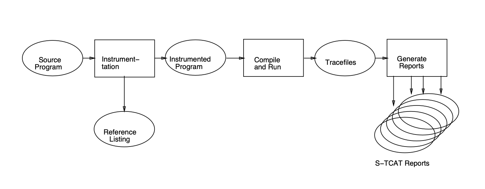

# Chapter 7 Testing Activities, Management, and Automation

* Major Testing Activities
* Test Management
* Testing Automation

## 7.1 Test Planning and Preparation

* Major testing activities:
  * test planning and preparation 
  * execution (testing) 
  * analysis and followup

* Test planning: 
  * goal setting
  * overall strategy

-  Test preparation:
  * ==preparing test cases & test suite(s) (systematic: model-based; our focus)==
  * preparing test procedure

> - 主要测试活动：
>   - 测试规划和准备
>   - 执行（测试）
>   - 分析和后续跟进
> - 测试规划：
>   - 目标设定
>   - 总体策略
>
> - 测试准备：
>   - 准备测试用例和测试套件（系统化：基于模型；我们的重点）
>   - 准备测试程序


> > 解释与例子
> > 测试规划
> > 测试规划是确保测试活动能够有效且有组织地进行的关键步骤。这包括确定测试的目标和目的，比如验证功能、评估性能或确保安全性。总体策略涉及到选择测试方法（如黑盒测试、白盒测试或灰盒测试），定义测试范围，安排时间表，以及分配资源。
> >
> > 测试准备
> > 测试准备阶段是将测试规划转化为实际可执行任务的过程，包括：
> >
> > 准备测试用例和测试套件：基于模型的方法可以帮助系统化地生成测试用例，这些模型可以是需求模型、设计模型或行为模型等。测试用例应覆盖所有重要的功能和场景，测试套件是一组相关的测试用例集合，旨在一起执行以验证特定的软件特性或行为。
> >
> > 准备测试程序：定义如何执行测试用例的详细步骤，包括设置测试环境、执行测试用例的顺序、输入数据和预期结果以及如何记录测试结果。
> >
> > 例子
> > 假设一个团队正在为一个新的社交媒体应用进行测试规划和准备。在测试规划阶段，他们设定了多个测试目标，包括验证用户注册流程、帖子发布功能、以及朋友推荐算法的准确性。他们选择了基于用户故事的黑盒测试作为主要测试方法，并制定了详细的测试计划，包括测试时间表和所需资源。
> >
> > 在测试准备阶段，团队基于应用的功能需求，设计了一系列测试用例，覆盖了所有的用户故事和关键功能。对于每个测试用例，他们详细定义了测试数据、执行步骤和预期的结果，并将它们组织成多个测试套件，分别针对不同的应用模块。
> >
> > 通过这样的测试规划和准备，团队确保了测试活动能够全面地评估应用的质量，并及时发现和修复潜在的问题，从而提高了应用的稳定性和用户满意度。


### 7.1.1 Test Planning

* Goal setting and strategic planning. 
* Goal setting
  * quality perspectives of the customer
  * quality expectations of the customer
  * mapping to internal goals and concrete (quantified) measurement.
  * e.g., customer’s correctness concerns ⇒ specific reliability target 

* Overall strategy, including:
  * specific objects to be tested.
  * techniques (and related models) to use. 
  * measurement data to be collected.
  * analysis and followup activities.
  * key: plan the “whole thing”!

> - 目标设定和战略规划。
> - 目标设定
>   - 客户的质量视角
>   - 客户的质量期望
>   - 映射到内部目标和具体（量化）的度量。
>   - 例如，客户的正确性关切 ⇒ 特定的可靠性目标
> - 总体策略，包括：
>   - 要测试的具体对象。
>   - 使用的技术（和相关模型）。
>   - 需要收集的度量数据。
>   - 分析和后续活动。
>   - 关键：规划“整个过程”！

> > 解释与例子
> > 目标设定
> > 在测试规划的起始阶段，明确测试的目标至关重要。这包括理解客户对产品质量的期望（如功能完整性、性能、安全性等），并将这些期望转化为具体的、可度量的内部质量目标。例如，如果客户特别关心软件的错误率，测试团队可能会设定一个具体的可靠性目标，如“软件在操作期间故障率不超过0.01%”。
> >
> > 总体策略
> > 测试的总体策略涉及多个方面：
> >
> > 要测试的对象：明确指出测试的范围，包括哪些功能、组件或系统需进行测试。
> >
> > 使用的技术：选择适合的测试技术和方法，如黑盒测试、白盒测试或灰盒测试，以及这些技术背后的模型，如状态转移图、数据流图等。
> >
> > 度量数据收集：确定在测试过程中需要收集哪些数据，如测试覆盖率、缺陷发现率等，以便于后续的分析和评估。
> >
> > 分析和后续活动：规划如何处理测试结果，包括缺陷管理、性能评估和质量改进措施。
> >
> > 例子
> > 假设一个团队正在为一个在线支付系统进行测试规划。他们从客户那里了解到，系统的安全性和交易处理速度是最重要的质量期望。基于这些信息，团队设定了具体的测试目标，如“确保所有交易在2秒内完成”和“系统能够抵御所有已知的安全威胁”。
> >
> > 为了实现这些目标，团队决定采用性能测试来评估交易处理速度，使用安全性测试来验证系统的安全措施。他们还计划收集相关的度量数据，如每项交易的平均响应时间和在测试期间发现的安全漏洞数量。此外，团队还安排了详细的缺陷跟踪和分析过程，确保所有发现的问题都能得到及时的解决。
> >
> > 通过这种详细的测试规划，团队能够确保他们的测试活动既有针对性又全面，能够有效地评估和提高系统的质量。

### 7.1.2 Test Preparation

* Procedure for test preparation
  * preparing test cases (model-based) 
    * individual test cases
    * test case allocation
  * preparing test procedure
    * basis for test procedure
    * order, flow, followup

*  General concepts
  - test run: operation instances
  - input variable: test point
  - input space: all possible input variable values
  - test case: static object + input to enable test to start-execute-finish.

> - 测试准备的程序
>   - 准备测试用例（基于模型）
>     - 单个测试用例
>     - 测试用例分配
>   - 准备测试程序
>     - 测试程序的基础
>     - 顺序、流程、后续跟进
> - 一般概念
>   - 测试运行：操作实例
>   - 输入变量：测试点
>   - 输入空间：所有可能的输入变量值
>   - 测试用例：静态对象 + 输入，以启动-执行-完成测试。

> > 解释与例子
> > 测试准备的程序
> > 测试准备是测试过程中的关键阶段，涉及到详细规划如何执行测试，包括定义测试用例和测试程序。
> >
> > 准备测试用例：这一步骤涉及到基于软件的模型（如功能模型、状态机模型或数据模型）来设计测试用例。每个测试用例都应该针对特定的功能或行为，确保覆盖到软件的关键部分。测试用例分配确保测试能够高效地执行，同时最大限度地覆盖测试目标。
> >
> > 准备测试程序：测试程序定义了执行测试用例的具体步骤，包括测试的顺序、如何设置测试环境、如何输入测试数据、如何收集和分析结果，以及在发现问题时的后续跟进措施。
> >
> > 一般概念
> > 测试运行：指的是执行单个测试用例的实例，其中包括了输入数据的应用和对结果的观察。
> >
> > 输入变量/测试点：测试用例中的具体值或条件，用于触发被测试软件的特定行为。
> >
> > 输入空间：表示所有可能的输入组合，测试的目标是尽可能全面地覆盖这个空间，以找出潜在的错误。
> >
> > 测试用例：一个定义良好的测试实体，包含了足够的信息来执行一个测试，从而验证软件的某个特定方面是否符合预期。
> >
> > 例子
> > 假设团队正在为一个图书管理系统准备测试。他们首先基于系统的功能需求（如借书、还书、查询图书等）来设计测试用例。每个测试用例包含了特定的图书信息、用户操作和预期结果。
> >
> > 接着，团队编写了测试程序，详细说明了如何登录系统、如何输入图书和用户信息、如何执行借书和还书操作，以及如何验证操作结果是否符合预期。
> >
> > 通过这种方法，测试团队能够系统地覆盖图书管理系统的关键功能，确保在上线前发现并修复潜在的问题。这样的测试准备工作有助于提高软件的质量和可靠性，确保用户在使用系统时能够获得良好的体验。

#### 7.1.2.1 Individual Test Case Preparation

* Individual test cases (micro-level) vs. test suite (macro-level)
* From multiple sources:
  * actual runs (usage-based).
  * implementation-based (white-box).
  * specification-based (black-box).
  * may use similar/earlier products.
  * (direct) record and replay (less often).
  * (via) formal models (OP, CFT, BT, etc.)

* Defining input values (model ⇒ test cases):
  * initial/intermediate/interactive input (expected output too?)
  * exercise path/slice/track/etc
  * in testing terminology: sensitization

> - 单个测试用例（微观层面）与测试套件（宏观层面）
> - 来自多个来源：
>   - 实际运行（基于使用）。
>   - 基于实现（白盒）。
>   - 基于规格（黑盒）。
>   - 可能使用类似/早期产品。
>   - （直接）记录和回放（较少使用）。
>   - （通过）形式模型（操作概况OP，控制流图CFT，行为树BT等）。
> - 定义输入值（模型 ⇒ 测试用例）：
>   - 初始/中间/交互式输入（也需要预期输出吗？）
>   - 练习路径/切片/轨迹等
>   - 在测试术语中：敏化


> > 解释与例子
> > 单个测试用例准备
> > 准备单个测试用例是测试活动中的一个重要环节，它涉及到根据特定的测试目标和策略来设计具体的测试实例。
> >
> > 多种来源：测试用例可以根据实际使用情况、软件的内部实现细节、规格说明书或是参考类似的早期产品来设计。例如，基于用户的实际操作来创建测试用例，或者使用白盒测试方法来检查代码的特定路径。
> >
> > 定义输入值：为每个测试用例定义适当的输入值是关键，这包括不仅是初始状态的输入，还可能涉及到测试过程中的中间或交互式输入。预期的输出也需要定义，以便于在执行测试后评估软件的行为是否符合预期。
> >
> > 敏化
> > 敏化是一个测试术语，指的是选择或设计测试用例的过程，目的是触发软件中特定的路径或行为，以检测潜在的错误。
> > 例子
> > 考虑一个团队正在为一个在线购物系统设计测试用例。他们可能从多个来源获取测试用例的灵感：
> >
> > 基于实际使用：分析用户购物的典型流程，如搜索商品、添加到购物车、进行结算等，来设计测试用例。
> >
> > 基于规格：根据购物系统的功能需求文档来创建测试用例，确保所有列出的功能都被测试到。
> >
> > 基于实现：如果团队成员对系统的内部结构有深入了解，他们可以设计测试用例来检查特定的数据结构或算法。
> >
> > 对于每个测试用例，团队定义了具体的输入值（如商品ID、用户信息等），预期的操作路径（如从添加商品到购物车到完成支付的过程），以及预期的输出结果（如订单确认信息）。通过这样的细致准备，团队能够确保测试覆盖到系统的关键功能，并及时发现并修复潜在的问题。

#### 7.1.2.2 Test Cases Based on Formal Models

* Most organized, systematic test cases are derived from formal testing models:
  * directly via newly constructed models. 
  * indirectly via exist test cases, etc.

* Model construction steps:
  * information source identification and data collection
  * analysis and initial model construction
  * model validation and improvement

* Model usage:
  * defining test cases. (details with individual models/techniques)
  * indirectly in analysis/followup (Part IV).


> 7.1.2.2 基于形式模型的测试用例
>
> - 最有组织、系统化的测试用例通常来源于形式测试模型：
>   - 直接通过新构建的模型。
>   - 间接通过现有的测试用例等。
> - 模型构建步骤：
>   - 识别信息来源和数据收集
>   - 分析和初步模型构建
>   - 模型验证和改进
> - 模型使用：
>   - 定义测试用例。（具体内容取决于各个模型/技术）
>   - 在分析/后续跟进中间接使用（第四部分）。


> > 解释与例子
> > 基于形式模型的测试用例
> > 利用形式化的测试模型来派生测试用例是一种提高测试效率和有效性的方法。这些模型可以是基于状态的模型、基于数据流的模型、或是基于行为的模型等，它们提供了一种结构化的方式来描述软件的预期行为和特性。
> >
> > 直接来源：新构建的模型，如状态转移图或用例图，可以直接用来定义测试用例。通过分析模型中的各个元素和转换，测试团队可以系统地覆盖软件的各个功能。
> >
> > 间接来源：现有的测试用例或其他文档也可以作为模型构建的间接来源。通过分析这些资料，可以识别出软件的关键特性和潜在的测试点。
> >
> > 模型构建步骤
> > 信息来源识别和数据收集：收集有关软件的所有相关信息，包括需求文档、设计文档、用户手册等。
> >
> > 分析和初步模型构建：基于收集的信息，构建初步的测试模型。这可能涉及到将软件的功能和行为映射到特定的模型结构上。
> >
> > 模型验证和改进：验证模型是否准确地反映了软件的预期行为，并根据需要进行调整和改进。
> >
> > 模型使用
> > 定义测试用例：基于模型来定义测试用例，确保测试用例能够覆盖模型中描述的所有关键路径和条件。
> >
> > 间接分析/后续跟进：在测试执行后，模型也可以用来帮助分析测试结果，识别问题原因，并指导后续的测试和改进活动。
> >
> > 例子
> > 假设一个团队正在为一个航班预订系统进行测试。他们使用了状态转移图来模型化用户的预订过程，包括搜索航班、选择航班、填写乘客信息、支付和确认预订等状态和转换。
> >
> > 通过这个模型，团队能够定义一系列测试用例，每个测试用例针对不同的预订路径和条件。这些测试用例帮助团队系统地验证预订系统的各个方面，确保系统能够按预期处理各种预订情况。
> >
> > 通过基于形式模型的测试准备，团队能够有效地提高测试的全面性和准确性，从而提高软件产品的质量和可靠性。

#### 7.1.2.3 Test Suite Preparation

* Test suite (macro-level)
  * existing suite: what and where?
    * suitability? selection/screening? 
  * construction/generation of new ones
  * organization & management: often hierarchical, e.g., sc, sn, vn. 

* Adding new test cases
  * estimate # of new test cases
  * specify new (individual) test cases 
  * integrate to existing test cases

* Allocation to systems/operations 
  * OP-/structure-based allocation
  *  both old and new test cases in suite

> - 测试套件（宏观层面）
>   - 现有套件：有哪些，存在哪里？
>     - 适用性？选择/筛选？
>   - 新套件的构建/生成
>   - 组织与管理：通常是分层的，例如，场景（sc）、场景节点（sn）、版本（vn）。
> - 添加新测试用例
>   - 估算新测试用例的数量
>   - 指定新的（单个）测试用例
>   - 将新测试用例整合到现有测试用例中
> - 分配给系统/操作
>   - 基于操作概况（OP）/结构的分配
>   - 在测试套件中既包括旧的也包括新的测试用例


> > 解释与例子
> > 测试套件准备
> > 测试套件是一组有组织的测试用例集合，旨在一起执行以验证软件的一组特定功能或性能。准备测试套件涉及到审视现有的测试用例集合，构建新的测试套件，以及管理和维护这些套件。
> >
> > 现有套件的审视：首先需要确定已有的测试用例和套件的位置和内容，评估它们的适用性和覆盖范围，决定是否需要进行选择或筛选以适应新的测试需求。
> >
> > 新套件的构建：根据最新的测试需求和目标，可能需要构建新的测试用例和套件。这包括定义新的测试场景和条件，以及确保测试覆盖率。
> >
> > 组织与管理：测试套件的组织通常是分层的，以便于管理和执行。这可能涉及到按照功能、模块或版本来组织测试用例。
> >
> > 添加新测试用例
> > 新测试用例的添加是测试准备过程中的一个重要环节，涉及到估算所需的新测试用例数量，详细指定这些用例的具体条件和预期结果，以及将它们有效地整合到现有的测试框架中。
> > 分配给系统/操作
> > 测试用例的分配需要考虑软件的操作概况和内部结构，确保测试覆盖到软件的关键功能和潜在风险区域。这包括对旧的和新的测试用例进行合理的分配和安排。
> > 例子
> > 假设一个团队正在为一个金融软件系统准备测试套件。团队首先回顾了现有的测试用例库，发现某些用例不再适用于新版本的功能需求。他们决定保留适用的用例，同时构建新的测试用例来覆盖新增的功能，如加密交易和多因素认证。
> >
> > 团队设计了一系列新的测试场景，针对这些新功能制定了详细的测试用例，并将它们整合到现有的测试框架中。测试套件被分层组织，按照功能模块和测试类型进行分类。
> >
> > 通过这种方法，团队确保了测试套件能够全面覆盖软件的功能和性能需求，同时提高了测试活动的效率和效果。

#### 7.1.2.4  Test Procedure Preparation

* Key consideration: sequencing:
  * general: simple to complex.
  * dependency among test cases.
  * defect detection related sequencing.
  * sequence to avoid accident.
  * problem diagnosis related sequencing. 
  * natural grouping of test cases.

* Other considerations:
  * effectiveness/efficiency concerns.
  * smooth transition between test runs. 
  * management/resource/personnel/etc.

#### 

> 7.1.2.4 测试程序准备
>
> - 关键考虑因素：排序：
>   - 一般原则：从简单到复杂。
>   - 测试用例之间的依赖关系。
>   - 与缺陷检测相关的排序。
>   - 避免意外的序列。
>   - 与问题诊断相关的排序。
>   - 测试用例的自然分组。
> - 其他考虑因素：
>   - 效果/效率问题。
>   - 测试运行间的平滑过渡。
>   - 管理/资源/人员等。


> > 解释与例子
> > 测试程序准备
> > 在准备测试程序时，一个关键的任务是确定测试用例的执行顺序。这个排序过程需要综合考虑多个因素，以确保测试能够高效、有序地进行。
> >
> > 排序原则：测试通常从简单的用例开始，逐步过渡到更复杂的情况。这不仅有助于快速识别基本问题，也可以在测试过程中逐步建立复杂度。
> >
> > 依赖关系：某些测试用例可能依赖于其他用例的结果。例如，测试用户登录功能需要在测试个人资料编辑功能之前执行。
> >
> > 缺陷检测与问题诊断：测试用例的顺序可以根据缺陷检测的可能性或诊断问题的需要来调整。例如，如果某个功能区域在先前测试中频繁发现问题，可能优先测试该区域。
> >
> > 自然分组：相关的测试用例可以分组执行，以提高测试的逻辑性和效率。
> >
> > 其他考虑因素
> > 效率与效果：测试程序应考虑测试的效率和效果，比如通过自动化测试来减少重复工作，或选择能够覆盖多个测试场景的用例。
> >
> > 平滑过渡：测试程序应设计得使得从一个测试运行到另一个测试运行之间能够平滑过渡，减少设置和清理所需的时间和资源。
> >
> > 管理和资源：测试程序还需要考虑可用的资源和人员，确保测试活动可以在有限的资源下有效执行。
> >
> > 例子
> > 假设一个团队正在为一个电子商务网站准备测试程序。他们首先执行基础功能的测试用例，如用户注册、登录和商品浏览，然后逐步过渡到更复杂的用例，如商品搜索、购物车管理和在线支付。
> >
> > 团队按照功能模块将测试用例进行了分组，并考虑了测试中可能出现的依赖关系。例如，只有在用户成功登录后，才能测试购物车和支付功能。此外，团队使用自动化测试工具来提高测试的效率，并安排了专门的测试人员来监控测试过程，确保及时发现并处理问题。
> >
> > 通过这样的测试程序准备，团队能够系统地覆盖网站的所有关键功能，并有效地管理测试过程，确保在上线前能够发现并修复潜在的问题。


### 7.1.3 Test Execution

* Major testing activities:
  * test planning and preparation 
  * execution (testing)
  * analysis and followup

* Test execution:
  * execution planning and management
  * related activities: important part
    * failure identification and measurement 
    * other measurement

* General steps
  * allocating test time (& resources)
  * invoking test
  * identifying system failures (& gathering info. for followup actions) 
* Allocating test time
  * OP-based: systems/features/operations 
    * also coverage concerns for critical parts
  * coverage-based: func./struc. areas
  * alternative: bottom-up approach
    * individual test cases ⇒ test time 
    * sum-up ⇒ overall allocation
    * by OP or coverage areas

* Invoking test (OP-based)
  * OP ⇒ input variables (test points)
  * follow probabilistic distributions (could be dynamically determined)
  * sequence (what to test first?): COTS, product, supersystem 

* Invoking test (coverage-based)
  * organize sensitized testcases
  * sequence ⇐ coverage hierarchies

* Common part: Retest due to
  * defect fix ⇒ verify fix
  * code-base or feature change 
  * general regression test

* Identifying system failures (oracle problem):
  * similar for OP-/coverage-based
  * analyze test output for deviations
  * determine: deviation = failure ?
  * handling normal vs. failed runs
    * non-blocking failure handling

-  Solving oracle problem:
  * theoretically undecidable.
  * some cases obvious: crash, hang, etc.
  * practically based on heuristics:
    * product domain knowledge
    * cross-checking with other products
    * implementation knowledge & internals 
    * limited dynamic consistency checking

* Failure observation and measurement:
  * Determine: deviation = failure ?
  * Establish when failure occurred
    * used in reliability and other analysis
  * Collect failure information (e.g., ODC):
    *  what/where/when/severity/etc.
* Defect handling and test measurement:
  - defect status and change (controlled)
  - information gathering during testing
  - Followup activities:
    * fix-verification cycle
    * other possibilities (defer, invalid, etc.)

> - 主要测试活动：
>   - 测试规划和准备
>   - 执行（测试）
>   - 分析和后续跟进
> - 测试执行：
>   - 执行计划和管理
>   - 相关活动：重要部分
>     - 失败识别和测量
>     - 其他测量
> - 一般步骤
>   - 分配测试时间（和资源）
>   - 调用测试
>   - 识别系统失败（和收集后续行动信息）
> - 分配测试时间
>   - 基于操作概况（OP）：系统/功能/操作
>     - 对关键部分也考虑覆盖率问题
>   - 基于覆盖率：功能/结构区域
>   - 另一选择：自下而上的方法
>     - 个别测试用例 ⇒ 测试时间
>     - 总和 ⇒ 总体分配
>     - 按OP或覆盖区域
> - 调用测试（基于OP）
>   - OP ⇒ 输入变量（测试点）
>   - 遵循概率分布（可能动态确定）
>   - 序列（首先测试什么？）：COTS, 产品, 超系统
> - 调用测试（基于覆盖率）
>   - 组织敏化测试用例
>   - 序列 ⇐ 覆盖率层次
> - 共同部分：由于
>   - 缺陷修复 ⇒ 验证修复
>   - 代码库或功能变更
>   - 一般回归测试
> - 识别系统失败（甲骨文问题）：
>   - 对基于OP/覆盖率的类似
>   - 分析测试输出的偏差
>   - 确定：偏差 = 失败？
>   - 处理正常与失败运行
>     - 非阻塞失败处理
>
> - 解决甲骨文问题：
>   - 理论上不可判定。
>   - 一些情况显而易见：崩溃、挂起等。
>   - 实际基于启发式：
>     - 产品领域知识
>     - 与其他产品交叉检查
>     - 实现知识和内部
>     - 有限的动态一致性检查
>
> - 失败观察和测量：
>   - 确定：偏差 = 失败？
>   - 确定失败发生时间
>     - 用于可靠性和其他分析
>   - 收集失败信息（例如，ODC）：
>     - 什么/在哪里/何时/严重性等。
> - 缺陷处理和测试测量：
>   - 缺陷状态和变化（控制）
>   - 测试期间的信息收集
>   - 后续活动：
>     - 修复-验证循环
>     - 其他可能性（推迟、无效等）。

> > 解释与例子
> > 在软件测试过程中，执行阶段是确保软件质量的关键步骤。通过有效地管理测试执行、识别和测量失败，测试团队可以确保软件满足既定的质量标准。
> >
> > 例如，一个团队正在测试一个电子邮件客户端软件。在分配测试时间阶段，他们根据操作概况来确定测试重点，如发送和接收邮件的功能。通过基于覆盖率的方法，确保测试覆盖到所有重要的功能和代码路径。
> >
> > 在调用测试阶段，团队使用自动化测试工具来执行预定义的测试套件，同时监控系统的表现和任何异常行为。当发现失败时，通过识别系统失败的步骤，团队收集失败的详细信息，包括失败的具体条件和系统的响应，以便于进一步的分析和修复。
> >
> > 通过这样的测试执行过程，团队能够有效地识别和解决软件中的问题，提高软件的整体质量和稳定性。这不仅有助于确保软件在上市时能满足用户的需求，也有助于维护团队的品牌声誉和客户满意度。

### 7.1.4 Test/Failure Measurement

* Example template: (Table 7.1, p.93)
  * information collected at test execution

* rid – run identification, consisting of:
  - sc – scenario class,
  - sn – scenario number,
  - vn – variation number with a particular sce- nario,
  - an – attempt number for the specific scenario variation
* timing – start time t0 and end time t1
* tester – the tester who attempted the test run
* trans – transactions handled by the test run
* result – result of the test run (1 indicates success and 0 for failure)

> - 示例模板：（表7.1，第93页）
>   - 在测试执行时收集的信息
> - rid – 运行标识，包括：
>   - sc – 场景类别，
>   - sn – 场景编号，
>   - vn – 特定场景的变体编号，
>   - an – 对特定场景变体的尝试编号
> - timing – 开始时间t0和结束时间t1
> - tester – 执行测试运行的测试人员
> - trans – 测试运行处理的事务
> - result – 测试运行的结果（1表示成功，0表示失败）

> > 解释与例子
> > 测试/失败测量
> > 测试/失败测量是测试执行过程中的一个重要环节，它涉及到收集和记录测试运行的详细信息。这些信息对于评估软件的质量、识别和修复问题至关重要。
> >
> > 运行标识（rid）：唯一标识每次测试运行，帮助测试团队跟踪和管理测试活动。它包括场景类别（sc）、场景编号（sn）、场景的变体编号（vn）和尝试编号（an），为每次测试提供了一个清晰的上下文。
> >
> > 时间（timing）：记录测试的开始和结束时间，可以用来评估测试运行的时长和效率。
> >
> > 测试人员（tester）：记录执行特定测试运行的测试人员，有助于在发现问题时进行沟通和协作。
> >
> > 事务（trans）：记录测试运行处理的事务数量，对于评估系统的性能和稳定性很有用。
> >
> > 结果（result）：标识测试运行是成功还是失败（1表示成功，0表示失败），是评估软件质量的直接指标。
> >
> > 例子
> > 假设一个团队正在进行一个在线购物平台的性能测试。他们设计了一个场景，模拟用户在高峰时段浏览商品、添加到购物车和结账的过程。每次测试运行都被赋予一个唯一的运行标识，例如，场景类别为“性能测试”，场景编号为1，变体编号为1，尝试编号为1（表示第一次尝试）。
> >
> > 测试开始和结束的时间被记录下来，以计算整个测试过程的时长。执行测试的测试人员的名字也被记录下来，以便于后续的沟通。此外，测试运行处理的事务数量也被记录，以评估系统在高负载下的表现。
> >
> > 通过这样的测试/失败测量，团队能够详细地了解每次测试运行的性能，识别瓶颈和问题，并据此优化系统。这有助于提高平台的稳定性和用户满意度，确保在正式上线时能够承受实际的用户负载。

## 7.1.5 Testing Analysis and Followup

* Major testing activities:
  * test planning and preparation 
  * execution (testing)
  * analysis and followup

* Test analysis and followup:
  * execution/other measurement analyzed
  * analysis results as basis for followup
  * feedback and followup:
    * decision making (exit testing? etc.) 
    * adjustment and improvement.

* Input to analysis
  * test execution information
  * particularly failure cases
  * timing and characteristics data

* Analysis and output
  * basic individual (failure) case
    * problem identification/reporting 
    * repeatable problem setup
  * overall reliability and other analysis? (Chapter 22 and Part IV)

- Followup activities
  * defect analysis and removal (& re-test). 
  * decision making and management.
  * test process and quality improvement.

* For individual test runs:
  * success: continue with normal testing.
  * failure: see below.

*  Analysis and followup for failed runs:
  * understanding the problem by studying the execution record.
  * recreating the problem (confirmation).
  * problem diagnosis
    * may involve multiple related runs.
  * locating the faults.
  * defect fixing (fault removal)
    * commonly via add/remove/modify code
    * sometimes involve design changes
  * re-run/re-test to confirm defect fixing.

* Analysis and followup for overall testing:
  * reliability analysis and followup. 
  * coverage analysis and followup. 
  * defect analysis and followup.
  * focus of Part IV.

* Analyses: Different focuses:
  * overall reliability and coverage for usage based and coverage-based testing.
  * detailed defect analysis. 
*  Followup activities: Similar.
  * decision making and management.
  * test process and quality improvement.

> - 主要测试活动：
>   - 测试规划和准备
>   - 执行（测试）
>   - 分析和后续跟进
> - 测试分析和后续跟进：
>   - 分析执行/其他测量结果
>   - 分析结果作为后续跟进的依据
>   - 反馈和后续跟进：
>     - 决策制定（结束测试？等）
>     - 调整和改进
> - 分析输入
>   - 测试执行信息
>   - 特别是失败案例
>   - 时间和特性数据
> - 分析和输出
>   - 基本的个别（失败）案例
>     - 问题识别/报告
>     - 可重复的问题设置
>   - 整体的可靠性和其他分析？（第22章和第四部分）
>
> - 后续活动
>   - 缺陷分析和移除（&重测）
>   - 决策制定和管理
>   - 测试过程和质量改进
>
> - 对于个别测试运行：
>   - 成功：继续正常测试
>   - 失败：见下文
> - 失败运行的分析和后续跟进：
>   - 通过研究执行记录理解问题
>   - 重现问题（确认）
>   - 问题诊断
>     - 可能涉及多个相关运行
>   - 定位故障
>   - 缺陷修复（故障移除）
>     - 通常通过增加/删除/修改代码
>     - 有时涉及设计变更
>   - 重运行/重测以确认缺陷修复
> - 整体测试的分析和后续跟进：
>   - 可靠性分析和后续跟进
>   - 覆盖率分析和后续跟进
>   - 缺陷分析和后续跟进
>   - 第四部分的重点
> - 分析：不同的关注点：
>   - 整体的可靠性和覆盖率，用于基于使用的和基于覆盖率的测试
>   - 详细的缺陷分析
> - 后续活动：相似
>   - 决策制定和管理
>   - 测试过程和质量改进


> > 解释与例子
> > 在软件测试过程中，测试分析和后续跟进是确保软件质量和持续改进的关键环节。通过深入分析测试结果，特别是失败的测试用例，团队可以识别软件中的问题，进行必要的调整，并制定改进措施。
> >
> > 例如，一个团队正在测试一个移动应用。在测试执行阶段，他们记录了所有测试用例的执行情况，包括成功的和失败的。对于失败的测试用例，团队深入分析执行记录，尝试重现问题，进行故障诊断，最终定位到一个由于输入验证不充分导致的缺陷。
> >
> > 接下来，在后续活动阶段，团队修复了这个缺陷，并对相关的代码进行了改进，以避免未来发生类似问题。之后，他们重新执行了失败的测试用例以及一系列回归测试，以确认缺陷已经被正确修复，并且没有引入新的问题。
> >
> > 通过这种系统化的测试分析和后续跟进过程，团队不仅解决了即时的软件问题，还通过持续的质量改进措施提高了软件的整体质量和可靠性。

## 7.11 Test Management

* People’s roles/responsibilities in formal and informal testing.

* In informal testing:
  * “run-and-observe” by testers.
  * “plug-and-play” by users.
  * informal testing with ad-hoc knowledge
  * deceptively “easy”, but not all failures or problems easy to recognize. 

* In formal testing:
  * testers, and organized in teams.
  * management/communication structure. 
  * role of “code owners” (multiple roles?) 
  * 3rd party (IV&V) testing.
  * career path for testers.

* Test team organization:
  * vertical: project oriented
    * product domain knowledge,
    * staffing/resource management hard.
  * horizontal: task oriented
    * even distribution of staff/resources 
    * lack of internal knowledge/expertise
  * Mixed models might work better. 
* Users and 3rd party testers:
  * user involvement in beta-testing and other variations (e.g., ECI in IBM)
  * IV&V with 3rd party testing/QA
  * impact of new technologies:
    * CBSE, COTS impact
    * security, dependability requirements.

> - 在正式和非正式测试中的人员角色/责任。
> - 在非正式测试中：
>   - 测试人员的“运行并观察”。
>   - 用户的“即插即用”。
>   - 基于特定知识的非正式测试
>   - 表面上“容易”，但并非所有失败或问题都易于识别。
> - 在正式测试中：
>   - 测试人员，并组织成团队。
>   - 管理/沟通结构。
>   - “代码所有者”的角色（多重角色？）
>   - 第三方（IV&V）测试。
>   - 测试人员的职业路径。
> - 测试团队组织：
>   - 纵向：面向项目
>     - 产品领域知识，
>     - 人员/资源管理困难。
>   - 横向：面向任务
>     - 员工/资源的均匀分配
>     - 缺乏内部知识/专长
>   - 混合模型可能更有效。
> - 用户和第三方测试者：
>   - 用户参与Beta测试和其他变体（例如，IBM的ECI）
>   - 第三方测试/QA的IV&V
>   - 新技术的影响：
>     - CBSE（基于组件的软件工程），COTS（商用现成软件）的影响
>     - 安全性，可靠性要求。


> > 解释与例子
> > 测试管理
> > 测试管理是确保软件质量和测试效率的关键组成部分。它涉及到对测试人员的角色、职责和组织结构的定义和管理。
> >
> > 非正式测试
> > 非正式测试通常由测试人员或用户在没有严格计划和过程的情况下进行。尽管这种测试方法看似简单，但它依赖于个人的经验和直觉，可能无法系统地识别所有潜在问题。
> >
> > 正式测试
> > 相比之下，正式测试涉及到更为组织化和结构化的过程，包括明确的角色定义、团队合作和管理结构。这可能包括专职的测试人员、代码所有者以及参与IV&V的第三方测试机构。
> >
> > 测试团队组织
> > 测试团队的组织方式可以是纵向的，侧重于产品领域知识和项目管理，或者是横向的，侧重于任务分配和资源管理。混合模型结合了这两种方法的优点，可能提供更好的灵活性和效率。
> >
> > 用户和第三方测试者
> > 用户参与测试，如Beta测试，可以提供宝贵的反馈，帮助改进产品。第三方测试机构提供独立验证和确认（IV&V），可以提高软件的质量和可靠性。
> >
> > 例子
> > 假设一个软件开发公司正在开发一个新的云存储服务。为了确保产品的质量，公司实施了正式的测试流程，包括内部测试团队的系统测试和由第三方机构执行的安全性测试。测试团队采用混合组织模型，将人员按照专业技能进行分组，同时根据项目需求进行灵活调配。通过用户参与的Beta测试，公司收集了宝贵的用户反馈，进一步改进了产品。这种综合的测试管理方法确保了云存储服务在上市时的高质量和用户满意度。

## 7.12 Test Automation

* Basic understanding:
  * automation needed for large systems. 
  * fully automated: impossible.
  * focus on specific needs/areas.

* Key issues to consider:
  * specific needs and potentials.
  * existing tools available/suitable?
    * related: cost/training/etc.
  * constructing specific tools?
  * additional cost in usage & support.
  * impact on resource/schedule/etc.

* Automation by test activity areas:
  * automated test planning&preparation.
  * automated test execution.
  * automated test measurement, analysis, and followup.
  * slightly different grouping due to tightly coupling for measurement & analysis. 

- Automation for test execution.
  * many debuggers: semi-automatic.
  * task sequencing/scheduling tools.
  * load/test generator: script ⇒ runs
  * generally easier to obtain test scripts.

* Automation for test planning/preparation:
  * test planning: Human intensive not much can be done (≈ inspection and FV).
  * test model construction: similar to above. 
    *  automation possible at a small scale.
  * test case generation: focus. 

- Test case generation:
  - from test model to test cases.
  - specific to individual techniques
    *  e.g., cover checklist items, paths, etc.
  - various specific tools.
  - key: which specific testing technique supported by the specific tool?

* Test measurement, analysis, and followup.
  - analyses dictate measurements needed.
  - most common: reliability/coverage.
  - defect measurement needed in most cases:
    * defect tracking tools.

- Reliability analysis related tools:
  * analysis/modeling tools.
  * collecting execution/input/etc. data. 
  * more in Chapter 22.

* Coverage-based testing: measuring cover- age and compare to pre-set goals.
* Test coverage steps:
  * preparation: program instrumentation. 
  * measurement step: run and collect data. 
  * analysis step: analysis for coverage.

* Test coverage tools:
  * different levels/definitions of coverage ⇒ different tools.
  * example tools:
    * McCabe: execution (control flow) path 
    * S-TCAT: functional coverage
    * A-TAC: data flow coverage.


> 测试自动化
>
> - 基本理解：
>   - 大型系统需要自动化。
>   - 完全自动化：不可能。
>   - 专注于特定需求/领域。
> - 需要考虑的关键问题：
>   - 特定需求和潜力。
>   - 现有工具可用/适合吗？
>     - 相关：成本/培训等。
>   - 构建特定工具？
>   - 使用和支持的额外成本。
>   - 对资源/进度等的影响。
> - 按测试活动领域自动化：
>   - 自动化测试规划和准备。
>   - 自动化测试执行。
>   - 自动化测试测量、分析和后续跟进。
>   - 由于测量和分析的紧密耦合，分组略有不同。
>
> - 测试执行的自动化。
>   - 许多调试器：半自动。
>   - 任务序列/调度工具。
>   - 负载/测试生成器：脚本 ⇒ 运行
>   - 通常更容易获得测试脚本。
>
> - 测试规划/准备的自动化：
>   - 测试规划：人力密集型，无法做太多（≈检查和FV）。
>   - 测试模型构建：类似于上述。
>     - 小规模可能实现自动化。
>   - 测试用例生成：重点。
>
> - 测试用例生成：
>   - 从测试模型到测试用例。
>   - 特定于个别技术
>     - 例如，覆盖清单项、路径等。
>   - 各种特定工具。
>   - 关键：特定工具支持哪种特定测试技术？
>
> - 测试测量、分析和后续跟进。
>   - 分析指明所需测量。
>   - 最常见的：可靠性/覆盖率。
>   - 在大多数情况下需要缺陷测量：
>     - 缺陷跟踪工具。
>
> - 可靠性分析相关工具：
>   - 分析/建模工具。
>   - 收集执行/输入等数据。
>   - 第22章有更多信息。
>
> - 基于覆盖率的测试：测量覆盖率并与预设目标比较。
> - 测试覆盖率步骤：
>   - 准备：程序插桩。
>   - 测量步骤：运行并收集数据。
>   - 分析步骤：覆盖率分析。
> - 测试覆盖率工具：
>   - 不同级别/定义的覆盖率 ⇒ 不同工具。
>   - 示例工具：
>     - McCabe：执行（控制流）路径
>     - S-TCAT：功能覆盖率
>     - A-TAC：数据流覆盖率。


> > 解释与例子
> > 测试自动化是软件测试过程中提高效率和有效性的关键工具。通过自动化，测试团队可以减少重复性工作，更快地执行测试，并提高测试的准确性。
> >
> > 例如，对于一个需要频繁回归测试的大型Web应用，测试团队可能使用自动化工具来自动执行测试用例。这包括使用负载测试生成器来模拟高并发用户访问，使用覆盖率工具来评估测试覆盖的代码范围，以及使用缺陷跟踪工具来管理和跟踪发现的缺陷。
> >
> > 通过自动化测试执行，团队可以在短时间内完成大量测试，快速识别和修复问题。同时，通过使用测试覆盖率工具，如A-TAC，团队可以确保测试覆盖到了所有关键的数据流路径，进一步提高软件的质量和稳定性。
> >
> > 自动化测试规划和准备阶段可能涉及到使用特定的工具来生成测试用例，基于预先定义的测试模型。例如，如果测试模型定义了软件的状态转换图，测试团队可以使用工具自动生成测试用例，以确保覆盖所有可能的状态转换。
> >
> > 通过测试自动化，软件测试过程变得更加高效和系统化，有助于提高软件产品的质量和可靠性。

### 7.13.1  Test Automation: JUnit Example

- P. Louridas, “JUnit: Unit Testing and Coding in Tandem” IEEE Software, Vol.22, No.4., pp.12-15, July/Aug., 2005. (A nice short survey about JUnit.)
- JUnit example (Fig.1 in paper above)
  - JUnit test setup: initialize some complex numbers
  - JUnit test cases:
    * execution using “assertEquals(x, y)” 
    * base test case: x, y numbers
    * general cases: “expected” = op-result?
  - $\sum$ test cases ⇒ test suite
- Still need:
  * oracle/“expected” above
  * test cases ⇐ techniques (Ch.8∼12)


> - P. Louridas, “JUnit: Unit Testing and Coding in Tandem” IEEE Software, Vol.22, No.4., 第12-15页, 2005年7月/8月。 (关于JUnit的一个很好的简短调查。)
> - JUnit示例（上述论文中的图1）
>   - JUnit测试设置：初始化一些复数
>   - JUnit测试用例：
>     - 使用“assertEquals(x, y)”执行
>     - 基础测试用例：x, y为数字
>     - 一般情况：“expected” = 操作结果？
>   - $\sum$ 测试用例 ⇒ 测试套件
> - 仍然需要：
>   - 甲骨文/“预期”结果
>   - 测试用例 ⇐ 技术（第8∼12章）


> > 解释与例子
> >
> > JUnit是一个流行的Java编程语言的单元测试框架。它使得开发者可以写出更健壮的代码并提高软件的质量。通过使用JUnit，开发者可以轻松地编写和执行自动化的单元测试，帮助及时发现和修复代码中的错误。
> >
> >  JUnit测试示例
> >
> > 假设你正在开发一个处理复数的库。你可以使用JUnit来设置和执行一系列的测试用例，以确保你的复数运算实现是正确的。
> >
> > - **测试设置**：在测试开始之前，你可以初始化一些复数实例，这些实例将在你的测试用例中被使用。
> > - **编写测试用例**：对于每个要测试的复数运算，你可以编写一个测试用例，使用`assertEquals`方法来验证运算的实际结果是否符合预期。例如，如果你有一个添加两个复数的方法，你可以编写一个测试用例来验证这个方法返回的结果是否正确。
> > - **构建测试套件**：所有的测试用例加起来构成了一个测试套件，JUnit允许你轻松地执行这个套件中的所有测试用例，并报告哪些通过了测试以及哪些失败了。
> >
> > 仍然需要的
> >
> > 尽管JUnit提供了一个强大的框架来编写和执行测试用例，但开发者仍然需要确定每个测试用例的“预期”结果。这通常需要对被测试的功能有深入的理解。此外，选择和设计有效的测试用例是基于具体的测试技术，如第8到第12章中所讨论的那样。
> >
> > 示例
> >
> > 考虑一个简单的例子，你有一个方法`add(ComplexNumber a, ComplexNumber b)`，用于计算两个复数的和。你可以编写一个JUnit测试用例：
> >
> > ```java
> > javaCopy code
> > @Test
> > public void testAdd() {
> >     ComplexNumber a = new ComplexNumber(1, 1);
> >     ComplexNumber b = new ComplexNumber(2, 2);
> >     ComplexNumber expected = new ComplexNumber(3, 3);
> >     ComplexNumber result = add(a, b);
> >     assertEquals(expected, result);
> > }
> > ```
> >
> > 这个测试用例首先创建两个复数`a`和`b`，然后计算它们的和，并使用`assertEquals`方法验证结果是否为预期的复数`(3, 3)`。通过这种方式，JUnit帮助开发者确保复数加法的实现是正确的。
> >
> > 使用JUnit进行单元测试不仅可以提高代码质量，也使得开发过程更加高效。


### 7.13.2 Test Automation: Coverage Example



* Test coverage analysis with S-TCAT (Fig 7.1, p.100).
  * S-TCAT: functional coverage 
  * results: 2 reports:
    1. list of covered functions 
    2. function-#times-used


> 7.13.2 测试自动化：覆盖率示例
>
> - 使用S-TCAT进行测试覆盖率分析（图7.1，第100页）。
>   - S-TCAT：功能覆盖率
>   - 结果：2个报告：
>     1. 已覆盖功能的列表
>     2. 功能使用次数


> > 解释
> > 测试覆盖率分析是确定测试用例是否覆盖了代码中所有重要路径和决策点的过程。S-TCAT（Software Test Coverage Analysis Tool）是一种功能覆盖率工具，它通过插桩技术来监控程序运行时的行为，并生成覆盖率报告。
> >
> > 插桩（Instrumentation）
> > 插桩是在源代码中添加额外的代码，用以在运行时收集关于程序行为的信息。这种技术可以用来监测哪些代码行或路径被执行过。
> >
> > 编译和运行（Compile and Run）
> > 一旦源程序被插桩，它就会被编译并运行。在这个过程中，插桩代码会收集执行路径和函数调用的数据，并将这些数据存储在跟踪文件中。
> >
> > 生成报告（Generate Reports）
> > 跟踪文件中的数据会被分析，以生成覆盖率报告。这些报告通常包括以下内容：
> >
> > 已覆盖功能的列表：显示哪些功能在测试中被执行过，这有助于识别未被覆盖的代码区域。
> >
> > 功能使用次数：显示每个功能在测试运行中被调用的次数，这可以用来识别被频繁使用的功能，或者可能需要进一步测试的功能。
> >
> > 例子
> > 考虑一个团队正在测试一个库存管理系统。他们使用S-TCAT工具来确定测试用例是否覆盖了所有的库存处理功能。
> >
> > 在插桩阶段，团队修改了源代码，使其在执行特定功能时生成额外的跟踪信息。
> >
> > 接着，他们编译并运行了插桩后的程序，收集了跟踪数据。
> >
> > 最后，在生成报告阶段，团队利用S-TCAT分析了跟踪数据，生成了覆盖率报告。报告显示了哪些库存处理功能被测试覆盖到，以及哪些功能没有被执行，从而指导团队针对未覆盖的功能增加更多的测试用例。
> >
> > 通过这种测试覆盖率分析，团队确保了测试用例集能够全面覆盖到库存管理系统的关键功能，从而提高了软件的质量和可靠性。

## 7.14 Summary

* Test activities:
  * planning&preparation: focus of Part II. 
  * execution&measurement: common.
  * analysis&followup: focus of Part IV.

* Test management:
  * different roles and responsibilities.
  * good management required. 
* Test automation:
  * set realistic expectations.
  * specific areas for automation, esp. in execution, measurement, and analysis.

> - 测试活动：
>   - 规划和准备：第二部分的重点。
>   - 执行和测量：常见步骤。
>   - 分析和后续跟进：第四部分的重点。
> - 测试管理：
>   - 不同的角色和职责。
>   - 需要良好的管理。
> - 测试自动化：
>   - 设定现实的期望值。
>   - 特定的自动化领域，特别是在执行、测量和分析方面。


> > 解释
> > 测试活动是软件开发周期中的关键组成部分，涉及多个阶段和详细步骤。
> >
> > 规划和准备：在软件测试的初期阶段，团队需要制定测试策略，准备测试用例和测试环境。这个阶段是确保后续测试有效性的基础。
> >
> > 执行和测量：这是测试过程中的实际操作阶段，包括运行测试用例，监测和记录测试结果，以及测量软件的性能和其他关键指标。
> >
> > 分析和后续跟进：测试执行之后，团队需要分析测试结果，识别和修复缺陷，并根据测试发现调整和改进软件。这个阶段对于提高软件质量和预防未来问题至关重要。
> >
> > 测试管理确保所有测试活动都按计划进行，并有效地使用资源。不同的团队成员，如测试人员、项目经理和质量保证人员，都有自己的角色和职责。
> >
> > 测试自动化可以显著提高测试效率，但它不是万能的。它在测试执行、测量和分析等特定领域尤为有用。自动化工具可以帮助团队更快地执行重复性任务，提供更一致和准确的测试结果。
> >
> > 例子
> > 例如，在一个大型的网络服务项目中，测试团队可能使用自动化工具来执行成百上千的测试用例，自动收集性能数据，并利用分析软件来识别潜在的性能瓶颈。管理团队确保测试计划得到适当执行，资源得到合理分配，并监督测试过程以确保质量目标得到满足。通过这种结构化和自动化的测试过程，项目能够在规定的时间内达到高质量标准，为最终用户提供稳定和可靠的网络服务。
