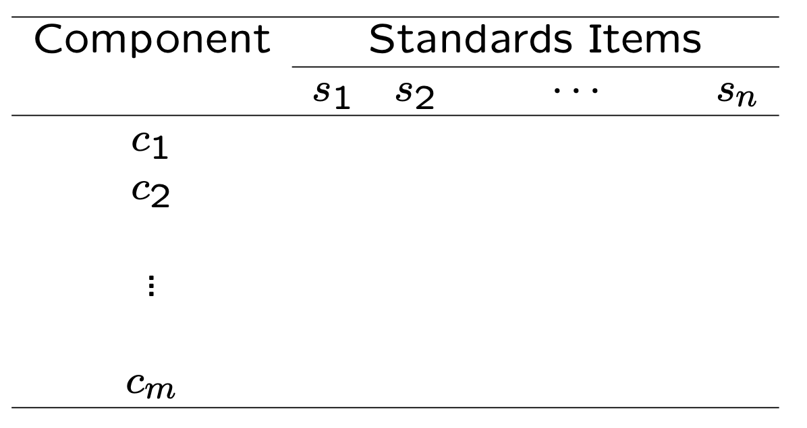
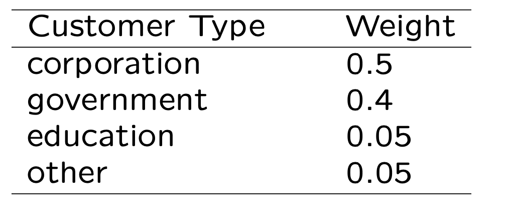
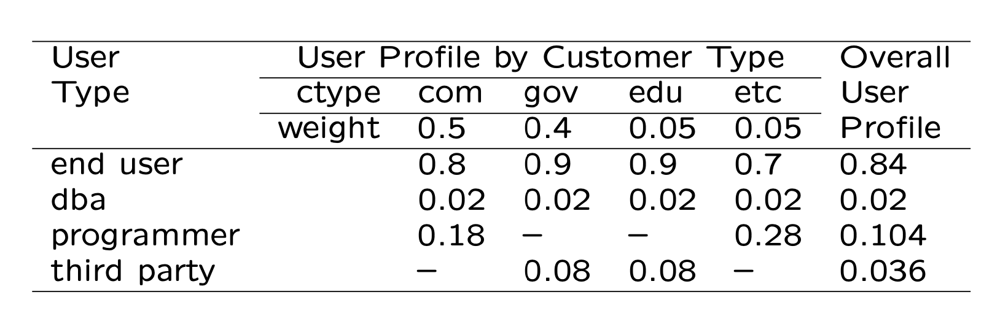
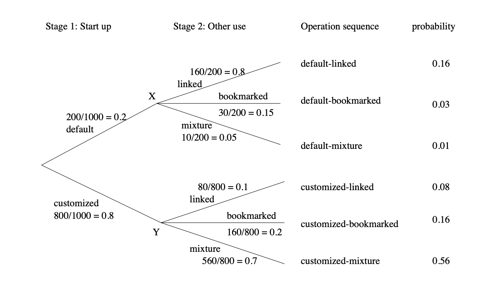
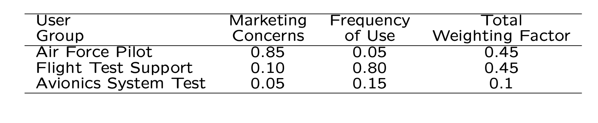
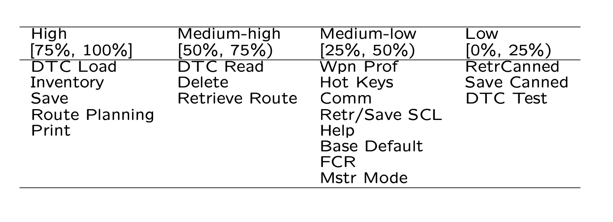

# ==Chapter 8 Coverage and Usage Testing Based on Checklists and Partitions==

* Checklist-Based Testing
* Partitions and Partition Testing
* Usage-Based Testing with Musa’s OPs
* OP Development: Procedures/Examples

## 8.1 Checklists for Testing

* Ad hoc testing:
  * “run-and-observe”
  * How to start the run?
  * Areas/focuses of “observations”?
  * Implicit checklists may be involved.

* Explicit checklists:
  * Function/features (external)  
  * Implementation (internal)
  * Standards, etc.
  * Mixed or combined checklists

> - 临时测试：
>   - “运行并观察”
>   - 如何开始运行？
>   - “观察”的领域/焦点是什么？
>   - 可能涉及隐式清单。
> - 显式清单：
>   - 功能/特性（外部）
>   - 实现（内部）
>   - 标准等
>   - 混合或组合清单

> > 解释
> > 临时测试
> > 临时测试是一种无需详细计划的测试方法，通常基于测试人员的直觉和经验。测试人员启动软件，进行“运行并观察”操作，以识别任何异常或错误。这种测试方法可能包含一个隐式的测试清单，测试人员根据经验判断哪些功能或区域可能存在问题。
> >
> > 显式清单
> > 显式测试清单是一个事先定义好的测试项目列表，它可以基于软件的功能、实现细节或标准要求。
> >
> > 功能/特性清单：根据软件的外部特性和功能编写的清单，确保所有列出的项目都得到验证。
> >
> > 实现清单：基于软件的内部代码和结构，包括代码规范、性能指标和安全性要求。
> >
> > 标准清单：确保软件遵守特定的行业或项目标准，例如编码标准、用户接口指南或法规合规性。
> >
> > 混合或组合清单：结合了上述多种类型的测试项目，为测试人员提供一个全面的测试范围。
> >
> > 例子
> > 假设你是一个测试工程师，负责测试一个移动应用。你可能会创建一个包含以下内容的显式测试清单：
> >
> > 功能/特性清单：
> >
> > 注册和登录流程是否顺畅。
> > 用户能否正确上传和分享内容。
> > 应用是否能在没有网络连接时正常运行。
> > 实现清单：
> >
> > 数据加密和安全性测试。
> > 应用的加载时间和响应速度。
> > 内存泄漏和资源管理。
> > 标准清单：
> >
> > 应用是否符合iOS和Android的设计指南。
> > 应用是否遵守隐私保护法规。
> > 多语言支持和无障碍功能测试。
> > 通过这样的测试清单，你可以系统地检查应用的各个方面，确保它在发布之前达到预期的质量标准。

> > Ad hoc testing 是一种非正式的软件测试方法，不依赖于任何详细的测试计划或测试用例，而是由测试人员根据他们的经验、直觉和对产品的理解进行的测试。这种测试方法的目的是快速找出软件中的错误或缺陷，通常在正式的测试阶段之前或之中进行。Ad hoc testing 被认为是探索性测试的一种形式，它帮助测试人员通过随机或无序的方式探索应用程序的不同部分，以发现潜在的问题。
> >
> > Ad hoc testing 的特点包括：
> >
> > - **非结构化**：它不遵循任何预定的测试脚本或过程。
> > - **灵活性**：测试人员可以自由选择测试的路径和方法。
> > - **依赖经验**：测试人员的经验和直觉在此过程中起到关键作用。
> > - **目的性**：主要目的是快速发现重要的错误，而不是系统地覆盖所有测试场景。
> >
> > 尽管 Ad hoc testing 可以快速发现错误，但它也有一些局限性，比如缺乏全面性、难以重现找到的错误（因为没有详细的记录）以及难以衡量测试的覆盖范围。因此，它通常与其他更正式的测试方法结合使用，以确保软件的质量和稳定性。
> >
> > 假设你是一个测试工程师，负责测试一个电子商务网站。在正式的测试计划执行之外，你决定进行一些 Ad hoc 测试来探索网站的功能和性能。以下是一些可能的 Ad hoc 测试活动：
> >
> > 1. 随机浏览商品
> >    你开始随机浏览网站上的不同商品类别，查看商品详情，加入购物车，然后删除一些商品，看看这个过程中是否会发现任何问题。例如，你可能会发现某个特定的商品详情页每次加载时都异常缓慢，或者在尝试删除购物车中的某个特定商品时应用程序崩溃。
> >
> > 2. 测试优惠券功能
> >    你决定测试网站的优惠券功能，随机输入几个优惠码，看看系统是否能正确识别和应用这些优惠。在这个过程中，你可能发现某些优惠码虽然已经过期，但系统仍然接受并应用了这些优惠，导致价格计算错误。
> >
> > 3. 尝试不同的支付方式
> >    为了测试网站的支付系统，你尝试使用不同的支付方式（如信用卡、PayPal、货到付款等）进行结账。在这个过程中，你可能会发现，当用户尝试使用特定的支付方式时，支付页面加载失败或出现错误消息。
> >
> > 4. 检查多语言支持
> >    如果网站支持多语言，你可能会随机切换到不同的语言，查看网站内容是否正确翻译和显示。这时，你可能会发现某些页面的内容没有被翻译或者翻译错误。
> >
> > 这些 Ad hoc 测试活动基于你的直觉和对应用的理解进行，而不是遵循任何预先定义的测试脚本。通过这种方式，你可能会发现一些在正式测试中可能被忽略的错误或问题。然而，由于 Ad hoc 测试的非正式和随机性，发现的问题可能难以重现，因此记录你的测试活动和发现的问题是非常重要的。

### 8.1.1 Function Checklists

* Function/feature (external) checklists: 
  * Black-box in nature
  * List of major functions expected

* Example: Table 8.1 (p.105)
  * abnormal termination 
  * backup and restore
  * communication
  * co-existence
  * file I/O
  * gateway
  * index management
  * installation
  * logging and recovery 
  * locking
  * migration
  * stress

> - 功能/特性（外部）清单：
>   - 黑盒测试的性质
>   - 预期的主要功能列表
> - 例子：表8.1（第105页）
>   - 异常终止
>   - 备份和恢复
>   - 通信
>   - 共存
>   - 文件输入/输出
>   - 网关
>   - 索引管理
>   - 安装
>   - 日志记录和恢复
>   - 锁定
>   - 迁移
>   - 压力测试

> > 解释
> > 功能或特性清单是在软件测试计划中用来确保所有预期功能都被检查和验证的工具。这些清单基于黑盒测试原则，关注软件的外部行为而不依赖于内部实现。
> >
> > 黑盒性质：测试人员使用功能/特性清单来检查软件的外部功能是否符合需求规格说明书。这种测试不关心代码的内部逻辑。
> >
> > 主要功能列表：清单列出了软件应该执行的所有主要功能，以确保测试覆盖所有重要的用户场景和软件行为。
> >
> > 例子
> > 假设你是一个负责测试新CRM（客户关系管理）软件的测试经理。你的功能/特性清单可能包括以下条目：
> >
> > 异常终止：测试软件在遇到错误时是否能够优雅地关闭，并给出用户友好的错误信息。
> >
> > 备份和恢复：验证软件是否能够正确备份用户数据，并在需要时恢复这些数据。
> >
> > 通信：确保软件能够与其他系统或服务（如电子邮件服务器）正确地通信。
> >
> > 共存：检查软件是否能够在不同的操作系统和软件环境中运行，而不会与其他应用程序冲突。
> >
> > 文件输入/输出：测试软件处理文件操作（如读取、写入、删除文件）的能力。
> >
> > 网关：验证软件是否可以作为不同网络或服务之间的桥梁。
> >
> > 索引管理：检查软件如何管理数据库索引，以及这是否影响性能。
> >
> > 安装：确保软件的安装流程简单明了，并能在多种配置上成功安装。
> >
> > 日志记录和恢复：验证软件在出现问题时是否记录必要的信息，并能从问题状态中恢复。
> >
> > 锁定：测试软件在多用户环境下的数据锁定机制，以避免数据冲突。
> >
> > 迁移：检查软件在从旧版本迁移到新版本时的稳定性和数据完整性。
> >
> > 压力测试：确保软件在高负载或数据量下仍然稳定运行。
> >
> > 通过这样的功能/特性清单，可以确保CRM软件在所有关键方面都达到了预定的性能标准和用户期望。

### 8.1.2 Implementation Checklists

* Implementation (internal) checklists:
  * White-box in nature
  * At different levels of abstraction
    * e.g., lists of modules/components/etc. 
    * statement coverage as covering a list

* Related: cross-cutting features/structures:
  * Multiple elements involved.
  * Examples: call-pairs, diff. parts that cooperate/collaborate/communicate/etc. 

* Other checklists:
  * related to certain properties 
    * e.g., coding standards,
  * hierarchical list, e.g., refined Table 8.1

> - 实现（内部）清单：
>   - 白盒测试的性质
>   - 不同抽象级别
>     - 例如，模块/组件等的列表
>     - 语句覆盖率可以看作是覆盖一个列表
> - 相关：横切特性/结构：
>   - 涉及多个元素。
>   - 示例：调用对，协作/合作/通信等的不同部分。
> - 其他清单：
>   - 与某些特性相关
>     - 例如，编码标准，
>   - 层次化列表，例如，细化的表8.1

> > 解释与例子
> > 实现清单专注于软件内部的实现细节。这些清单通常用于白盒测试，目的是确保内部结构和逻辑符合设计和编码标准。
> >
> > 白盒性质：白盒测试关注软件的内部逻辑，实现清单通常包括代码结构的详细列表，如模块、类、方法和其他组件。
> >
> > 不同抽象级别：实现清单可以覆盖从低级的代码语句到高级的组件和模块的各个层面。例如，语句覆盖率测试确保每条代码语句至少被执行一次。
> >
> > 横切特性/结构：软件设计中某些特性可能跨越多个模块和组件。实现清单可以帮助识别和测试这些跨模块的协作或通信。
> >
> > 与特性相关的其他清单：除了基本的实现清单，还可能有与特定属性或标准相关的清单，如安全性检查、性能指标或代码复用程度。
> >
> > 例子
> > 假设一个软件团队正在开发一个在线银行系统。他们可能会创建以下类型的实现清单：
> >
> > 模块清单：列出所有的银行交易处理模块，包括转账、存款和取款。
> >
> > 类和方法清单：详细列出每个模块中的类和方法，以及它们的职责和交互方式。
> >
> > 横切特性清单：识别那些需要在不同模块之间进行数据传递和事件通知的特性。
> >
> > 编码标准清单：确保所有代码符合组织设定的编码标准，包括变量命名规则、注释准则和错误处理。
> >
> > 通过这样的实现清单，测试团队可以确保所有代码都经过彻底的测试，任何偏离设计规范的地方都能被识别和修正。这有助于提升系统的可维护性和可靠性，并减少未来潜在的故障和安全漏洞。

### 8.1.3 Other Checklists

* Combined ×-list based on n attributes for large products,

* Example: Table 8.2 (p.106)

  

* Checklists in other forms:

  * tree/graph/etc. ⇒ enumerate into lists 
  * certain elements of complex models
    * e.g., lists of states and links in FSMs

> - 基于大型产品的n个属性的组合×列表，
> - 例子：表8.2（第106页）
> - 其他形式的清单：
>   - 树/图等 ⇒ 列出列表
>   - 复杂模型的某些元素
>     - 例如，FSM（有限状态机）中的状态和链接列表

> > 8.1.3 其他清单
> > 基于大型产品的n个属性的组合×列表，
> >
> > 例子：表8.2（第106页）
> >
> > 其他形式的清单：
> >
> > 树/图等 ⇒ 列出列表
> > 复杂模型的某些元素
> > 例如，FSM（有限状态机）中的状态和链接列表
> > 解释
> > 其他类型的测试清单可以将多个测试属性或要求结合在一起，用于管理和执行大型复杂产品的测试。这些清单通常用于捕捉和组织软件测试的多维度特性。
> >
> > 组合×列表：这种类型的清单可以涵盖多个属性，例如功能、性能、安全性和可用性。它可以帮助确保测试团队不会遗漏任何关键的测试维度。
> >
> > 其他形式的清单：有时，测试要求或测试项可能以非线性结构存在，如树或图。这些结构可以被转换为列出的列表形式，以便于管理和跟踪。
> >
> > 例子
> > 假设一个测试团队正在为一个大型的电子健康记录系统准备测试。他们可能会创建一个包含多个属性的组合×列表，每个属性都对应着系统的不同方面，如用户界面、数据处理、安全性和合规性。
> >
> > 例如，表8.2可能包含以下列：
> >
> > 组件：系统中的各个模块或组件，如患者信息管理、预约调度、药物交互检查。
> >
> > 标准项：每个组件需要遵守的标准或要求，如HIPAA（健康保险便携性与责任法案）合规性、数据加密标准、用户访问控制。
> >
> > 测试团队会用这个清单来确保每个组件在所有相关的标准项上都经过了彻底的测试。例如，对于患者信息管理组件，团队将检查是否有足够的隐私保护措施，以及是否符合HIPAA规定。
> >
> > 通过使用这样的组合清单，测试团队能够确保系统的每个方面都得到了充分的考虑和测试，从而大大提高了产品的质量和用户的信任度。
> >
> > 
> > 假设我们有一个表格，它列出了一个网络应用程序的各个组件和需要符合的标准项，如下所示：
> >
> > | 组件        | 标准项 s1 | 标准项 s2 | ...  | 标准项 sn |
> > | ----------- | --------- | --------- | ---- | --------- |
> > | 用户认证 c1 | ✓         |           | ...  | ✓         |
> > | 数据加密 c2 | ✓         | ✓         | ...  |           |
> > | 交易处理 c3 |           | ✓         | ...  | ✓         |
> > | 错误日志 c4 | ✓         |           | ...  | ✓         |
> > | API集成 c5  |           | ✓         | ...  |           |
> >
> > 在这个例子中，每个组件都需要经过测试来确保它们符合列出的标准项。标准项可以包括安全性要求、性能基准、法规遵从性或任何其他相关标准。
> >
> > 例如：
> >
> > - **用户认证（c1）**：需要测试是否实现了安全的登录机制（标准项 s1）和是否有适当的会话管理措施（标准项 sn）。
> > - **数据加密（c2）**：需要验证数据是否在传输（标准项 s1）和存储时（标准项 s2）被正确加密。
> > - **交易处理（c3）**：需要检查系统是否能够处理高并发交易（标准项 s2）并在出现错误时保持数据一致性（标准项 sn）。
> > - **错误日志（c4）**：需要确保所有异常都被记录在错误日志中（标准项 s1）并且可以用于故障排除和分析（标准项 sn）。
> > - **API集成（c5）**：需要测试应用程序的API是否能够与外部服务（标准项 s2）正确集成，并保持接口稳定性（标准项 sn）。
> >
> > 通过这种方式，测试团队可以确保系统的每个组件不仅在单独测试时是可靠的，而且当与其他组件集成时也能保持整体系统的稳定性和安全性。这种结构化的测试方法帮助团队全面覆盖所有重要的测试点，确保软件在部署前符合所有关键标准。

### 8.1.4 Checklists: Assessment

* Key advantage: simplicity.
* Possible drawbacks of checklists:
  * Coverage: need to fill “hole”.
  * Duplication: need to improve efficiency.
  * Complex interactions not modeled.
  * Root cause: complexity
    * contributing to all 3 problems above. 
* Possible solutions:
  * specialized checklists ⇒ partitions. 
  * alternatives to checklists: FSMs.

> 8.1.4 清单：评估
>
> - 主要优势：简单性。
> - 清单可能的缺点：
>   - 覆盖率：需要填补“漏洞”。
>   - 重复：需要提高效率。
>   - 复杂的交互没有被模型化。
>   - 根本原因：复杂性
>     - 导致上述所有3个问题。
> - 可能的解决方案：
>   - 专门的清单 ⇒ 划分。
>   - 清单的替代品：有限状态机（FSMs）

> > 解释与例子
> > 清单的简单性
> > 测试清单的一个主要优势在于它的简单性，它提供了一个清晰的框架来确保测试人员考虑到了所有预定的测试点。这种方法容易理解和实施，特别适用于项目早期或快速评估的场景。
> >
> > 清单的缺点
> > 然而，清单方法也有一些局限性：
> >
> > 覆盖率：清单可能不全面，遗漏了一些关键的测试场景。例如，如果清单没有包括针对某个特定交互的测试，就可能会导致软件中的错误未被发现。
> >
> > 重复：清单中的项目可能存在重复，这不仅浪费资源，还可能导致测试团队无法集中精力在更关键的测试上。
> >
> > 复杂交互：传统的清单可能难以捕捉软件组件间复杂的交互关系，导致在实际使用中可能出现的问题未能被测试覆盖。
> >
> > 解决方案
> > 为了解决这些问题，可以采取一些措施：
> >
> > 专门的清单划分：通过创建更细化的清单来专门针对软件中不同的部分，帮助填补潜在的“漏洞”。
> >
> > 使用有限状态机：FSMs可以为软件的状态和可能的状态转换提供一个更结构化的视图，它们特别适合模拟和测试软件的行为和交互。
> >
> > 例子
> > 假设一个测试团队正在评估一个在线支付系统的安全性。传统的安全测试清单可能包括项目如SQL注入、跨站脚本（XSS）攻击等。然而，这个清单可能没有考虑到用户在特定顺序下进行操作时的安全问题。
> >
> > 团队可以将清单细分为更具体的部分，比如创建一个清单专门用于测试非顺序操作的安全性。此外，团队还可以开发一个FSM来表示用户交云的可能路径，然后生成测试用例来确保这些路径下的操作都是安全的。
> >
> > 通过这种方式，测试团队能够更全面地评估在线支付系统的安全性，确保所有潜在的风险都被考虑到并进行了适当的测试。

### 8.1.5 Checklists to Partitions

* Examples: solving $ax^2 + bx + c = 0$,

  * solution: $r = \frac{-b \pm \sqrt{b^2 -4ac}}{2a}$ 
  * input: a, b, c; output: r.
  * 32 bits floating point numbers used 
  * input combinations: $2^{32} \times 2^{32} \times 2^{32} = 2^{96}$ 

* 3 solution partitions (Table 8.3, p.108):

  

> - 示例：解方程 $ax^2 + bx + c = 0$,
>   - 解：$r = \frac{-b \pm \sqrt{b^2 -4ac}}{2a}$ 
>   - 输入：a, b, c；输出：r.
>   - 使用32位浮点数
>   - 输入组合：$2^{32} \times 2^{32} \times 2^{32} = 2^{96}$ 
> - 3个解的分区（表8.3，第108页）

> > 解释与例子
> > 在软件测试中，将测试用例分区是一种将输入数据划分为不同类别的方法，每个类别代表了特定的测试条件或行为。这种方法有助于组织和减少测试用例的数量，同时确保测试的全面性。
> >
> > 对于解二次方程的软件模块，测试用例可以根据判别式$d = b^2 -4ac$ 的值来分区，以决定方程的解的性质。
> >
> > 以下是基于三种不同条件的测试用例分区的示例
> >
> > | Test Case | Condition   | Input          |
> > | --------- | ----------- | -------------- |
> > | 1         | \( d > 0 \) | a=1, b=2, c=-1 |
> > | 2         | \( d = 0 \) | a=1, b=2, c=1  |
> > | 3         | \( d < 0 \) | a=1, b=2, c=3  |
> >
> > - **解的分区**：
> >   - 对于 d > 0，二次方程有两个不同的实数解。
> >   - 当  d = 0  时，存在一个重根。
> >   - 若  d < 0 ，则方程没有实数解，而是有两个复数解。
> >
> > 在这个示例中，每个测试用例都设计来验证求解器在不同情况下的表现，确保软件能够处理各种可能的方程解。

## 8.2 Partitions and Partition Testing

### 8.2.1 Partitions: Ideas and Definitions

* Partitions: a special type of checklists
  * Mutually exclusive ⇒ no overlaps.
  * Collectively exhaustive ⇒ coverage.
  * Address two problems of checklists. (Third addressed by FSMs in Ch.10.) 
* Partition of set S into subsets $G_1, G_2, ..., G_n(G_i \subset S)$: 
  * $G_i$'s are mutaully exclusive: $\forall i, j, i \neq j \Rightarrow G_i \cap G_j = \varnothing$
  * $G_i$’s are collectively exhaustive: $\bigcup_{i=1}^{n}G_i = S$

* Each $G_i$ forms an equivalent class (next).

> ###  8.2.1 分区：概念与定义
>
> - 分区：一种特殊类型的检查清单
>   - 相互排斥 ⇒ 没有重叠。
>   - 集体穷尽 ⇒ 覆盖率。
>   - 解决检查清单的两个问题。（第三个问题由第10章中的FSMs解决。）
> - 集合S划分为子集 $G_1, G_2, ..., G_n(G_i \subset S)$: 
>   - $G_i$是相互排斥的： $\forall i, j, i \neq j \Rightarrow G_i \cap G_j = \varnothing$
>   - $G_i$集体穷尽： $\bigcup_{i=1}^{n}G_i = S$
> - 每个$G_i$形成一个等价类（接下来会解释）。

> > 解释与例子
> > 在软件测试中，分区是将输入数据划分为没有交集的子集的方法，每个子集代表了一组在某种意义上相等或相似的测试情况。这种方法有助于确保测试用例可以覆盖所有可能的情况，而不遗漏任何场景。
> >
> > 分区的两个主要特性
> > 相互排斥：每个分区中的测试用例不会与其他分区中的测试用例重叠，确保测试不会重复。
> >
> > 集体穷尽：所有的分区加起来覆盖了所有可能的测试场景，确保测试的完整性。
> >
> > 例子
> >
> > 假设一个团队正在测试一个电子邮件客户端应用程序的发送功能。他们可以根据电子邮件的大小将测试用例分区，比如：
> >
> > - **小型邮件（$G_1$）**：邮件大小小于1MB。
> > - **中型邮件（$G_2$）**：邮件大小在1MB和10MB之间。
> > - **大型邮件（$G_3$）**：邮件大小大于10MB。
> >
> > 在这个例子中，G1，G2，和G3是相互排斥的，因为一个邮件不能同时是小型、中型和大型。同时，它们集体穷尽了所有可能的邮件大小场景。
> >
> > 使用这种分区方法，测试团队可以确保针对不同大小的邮件都有相应的测试，从而验证电子邮件客户端在处理各种大小的邮件时的性能和可靠性。

### 8.2.2 Partitions: Formal Definitions

* Relation: An association of interest to some observers among objects.
  * $R(A_1,A_2,...,A_n)$
  * Binary relations: $R(A,B)$ or $ARB$. most commonly used relations. 

* Relational properties
  * Transitivity: $ARB \and BRC$ ⇒ $ARC$ e.g., “>” relation.
  * Symmetry: $ARB \and BRA$ e.g., “is-neighbor-to” relation.
  * Reflexivity: $ARA$ e.g., “=” relation.

* Equivalence relation: All the above properties hold.

> - 关系：观察者对对象间的某些感兴趣的关联。
>   - $R(A_1,A_2,...,A_n)$
>   - 二元关系：$R(A,B)$或 $ARB$。最常用的关系类型。
> - 关系属性
>   - 传递性：如果 $ARB \and BRC$  ，则 $ARC$ 。例如，“>”关系。
>   - 对称性：如果$ARB \and BRA$ ，则 A 和 B 互为对称。例如，“是邻居”关系。
>   - 自反性：$ARA$. 例如，“=”关系。
> - 等价关系：以上所有属性都成立。

> > 解释与例子
> > 在软件测试中，分区经常依赖于建立等价关系，将输入空间划分为互不相交、集合覆盖的等价类。等价关系是一种具有传递性、对称性和自反性的关系。
> >
> > 传递性：如果一种行为或属性在一个对象和第二个对象之间成立，同时在第二个对象和第三个对象之间也成立，那么它应该在第一个和第三个对象之间也成立。例如，在测试中，如果我们认为两个输入 
> > A 和 B 导致相同的行为，B 和 C 也是如此，那么 A 和 C 也应该导致相同的行为。
> >
> > 对称性：如果一个对象和另一个对象有相同的关系，那么反过来也应该是相同的。例如，如果输入 
> > A 可以替换为输入 B 而不影响测试结果，那么 B 也应该能够替换 A。
> >
> > 自反性：每个对象都应与自身有相同的关系。在测试中，这意味着每个输入都应该被视为与自身相等，因此不需要与自己进行比较。
> >
> > 例子
> >
> > 考虑一个测试场景，我们需要测试一个排序算法。我们可以将输入的数组根据长度进行分区：
> >
> > - **空数组（G1）**：数组中没有元素。
> > - **单元素数组（G2）**：数组中只有一个元素。
> > - **多元素数组（G3）**：数组中有多个元素。
> >
> > 根据等价关系的定义，我们可以断定：
> >
> > - **传递性**：如果算法可以正确排序长度为 n 和n+1 的数组，那么它也应该能正确排序长度为 n+2 的数组。
> > - **对称性**：如果算法在排序长度为 n 的数组时表现正确，那么任何长度为 n 的数组都应该能被算法正确排序。
> > - **自反性**：算法对于特定长度的任何数组都应该有一致的表现。
> >
> > 通过使用等价类划分，测试人员可以针对每个分区选择或创建代表性的测试用例，从而确保测试的全面性和有效性。

### 8.2.3 Partition-Based Testing

* Different types of partition definitions:
  * membership based partition definitions 
  * properties/relations used in definitions 
  * combinations

* Basic idea of partition-based testing:
  * membership/equivalence-class analysis ⇒ defining meaningful partitions
  * sampling from partitioned subsets for different types of partitions

* Extending basic coverage to perform non- uniform testing (later).

*  Testing for membership in partitions:

  * partitions: components in a subsystems

  * testing via direct sampling,

    e.g., sampling 1 component/subsystem 

* Testing for general partitions:
  * properties/relations used in definitions
  * direct predicates on logical variables
    * direct derivation of test cases
  * operations on numerical variables 
    * sensitize (select) input values

* Testing for combinations of the above partition definitions

* Testing predicates on logical variables:
  *  logical variable P as input
    * 2 partitions/test-cases: P=T, P=F. 
  *  $P \and Q$, with 2 partitions (outcomes):
    * $P \and Q$= T , with P = T and Q = T . 
    * $P \and Q$ =F, 1 test case from 3 pairs: {(P=T, Q=F); (P=F, Q=T); (P=F, Q=F)}

* Testing comparisons on numerical variables:
  * x > 0, many possible test cases 
    * x = 101: a specific test case
  * combinations: satisfy all conditions, e.g., 
    * $(x>0) \and (y<100)$, select x, y values individually, say x = 101 and y = 21; 
    * $(x>0)\and(x≤100)$, select x value to satisfy both conditions, say x = 17.

- Testing multiple sets of partitions:
  * Divide-and-conquer.
  * Model as stages.
  * Combination (cross-product) of the stages.
    * e.g. binary partitions P followed by Q: four combinations: TT, TF, FT, FF.
- General: an m-way partition followed by an n-way partition: $m\times n$ combinations.

- Coordinated sensitization often needed, similar to for $(x > 0) \and (x \leq 100)$ above.
- Extensions to basic ideas:
  * Sampling from partitioned subsets.
  * Coverage of partitions: non-uniform?
  * Testing based on related problems:
    * usage-related problems?
    * boundary problems?
  * Testing based on level/hierarchy/etc.?

- Usage-related problems:
  - More use ⇒ failures more likely
  - Usage information in testing ⇒ (Musa’s) operational profiles (OPs) 

* Boundary problems:

  Input domain boundary testing (Ch.9).

>  8.2.3 基于分区的测试
>
> - 不同类型的分区定义：
>
>   - 基于成员身份的分区定义
>   - 定义中使用的属性/关系
>   - 组合
>
> - 基于分区测试的基本思想：
>
>   - 成员身份/等价类分析 ⇒ 定义有意义的分区
>   - 从不同类型的分区子集中抽样
>
> - 扩展基本覆盖率以执行非均匀测试（稍后讨论）。
>
> - 对分区成员资格的测试：
>
>   - 分区：子系统中的组件
>   - 通过直接抽样进行测试，
>     - 例如，抽样1个组件/子系统
>
> - 对一般分区的测试：
>
>   - 定义中使用的属性/关系
>   - 对逻辑变量的直接谓词
>     - 直接导出测试用例
>   - 对数值变量的操作
>     - 感知（选择）输入值
>
> - 对以上分区定义组合的测试
>
> - 对逻辑变量的谓词测试：
>
>   - 逻辑变量P作为输入
>
>     - 2个分区/测试用例：P=T, P=F。
>
>   - *P*∧*Q*
>
>     ，有2个分区（结果）：
>
>     - *P*∧*Q*=*T*，P = T 且 Q = T。
>     - *P*∧*Q*=*F*，从3对中选择1个测试用例：{(P=T, Q=F); (P=F, Q=T); (P=F, Q=F)}
>
> - 对数值变量的比较测试：
>
>   - x > 0, 许多可能的测试用例
>     - x = 101: 一个具体的测试用例
>   - 组合：满足所有条件，例如，
>     - (*x*>0)∧(*y*<100)，分别选择x, y的值，比如 x = 101 且 y = 21；
>     - (*x*>0)∧(*x*≤100)，选择x的值以满足两个条件，比如 x = 17。
>
> - 测试多组分区：
>   - 分而治之。
>   - 将其模型化为阶段。
>   - 阶段的组合（交叉乘积）。
>     - 例如，二元分区P后跟Q：四种组合：TT, TF, FT, FF。
> - 一般来说，一个m方式分区后跟一个n方式分区：m*×*n*组合。
> - 经常需要协调感知，类似于上面的(*x*>0)∧(*x*≤100)。
> - 基本思想的扩展：
>   - 从分区子集中抽样。
>   - 分区的覆盖率：非均匀？
>   - 基于相关问题的测试：
>     - 使用相关问题？
>     - 边界问题？
>   - 基于级别/层次等的测试？
> - 使用相关问题：
>   - 使用越多 ⇒ 失败可能性越大
>   - 测试中的使用信息 ⇒ （Musa的）操作配置文件（OPs）
>
> - 边界问题：
>
>   输入域边界测试（第9章）。

> > 基于分区的测试是一种在软件测试中常用的方法，它将输入数据划分为不同的分区，每个分区代表了输入数据的一个等价类。测试人员通过为每个分区选择或生成代表性的测试用例来确保测试的全面性。这种方法的优点在于它能够有效地识别软件中的缺陷，同时减少不必要的重复测试。
> >
> > 分区应满足两个条件：它们应该是互斥的（即，一个输入数据只能属于一个分区），并且它们应该是集体穷尽的（即，所有的输入数据都应该被分区所覆盖）。
> >
> > 例子
> >
> > 假设我们正在测试一个简单的图书管理系统，其中可以添加图书信息，包括书名、作者和价格。我们可以根据价格对图书进行分区：
> >
> > - **分区1**：免费图书（价格为0）
> > - **分区2**：廉价图书（价格在1到10美元之间）
> > - **分区3**：标准图书（价格在11到50美元之间）
> > - **分区4**：昂贵图书（价格超过50美元）
> >
> > 每个分区的测试用例可能会选择或生成具有代表性的图书信息来测试系统的行为。例如，对于免费图书的分区，测试用例需要验证系统是否能够正确地添加一本价格为0的图书。对于廉价图书的分区，测试用例可能会验证系统是否在输入价格在1到10美元的图书时，计算出正确的折扣和总价。这种测试方法确保了系统能够正确处理不同价格范围的图书信息。

## 8.3 Usage-Based Testing with Musa’s OPs

###8.3.1 Usage-Based Statistical Testing

* Usage based statistical testing (UBST) to ensure reliability.
* Reliability: Probability of failure-free operation for a specific time period or a given set of input under a specific environment
  * Reliability: customer view of quality 
  * Probability: statistical modeling
  * Time/input/environment: OP

* OP: Operational Profile
  * Quantitative characterization of the way a (software) system will be used.
  * Generate/execute test cases for UBST
  * Realistic reliability assessment
  * Development decisions/priorities

> 8.3.1 基于使用的统计测试
>
> - 基于使用的统计测试（UBST）以确保可靠性。
> - 可靠性：在特定时间段内或对于一组给定输入在特定环境下无故障运行的概率
>   - 可靠性：顾客对质量的看法
>   - 概率：统计建模
>   - 时间/输入/环境：操作剖面（OP）
> - 操作剖面（OP）：
>   - 对（软件）系统使用方式的量化描述。
>   - 生成/执行测试用例以进行UBST
>   - 现实的可靠性评估
>   - 开发决策/优先级

> > 解释与例子
> > 基于使用的测试是一种评估软件可靠性的方法。它使用统计学原理，基于软件的实际使用方式和环境来模拟和测试软件的行为。这种方法的目标是预测软件在实际运行中的表现，并评估它在面对真实世界的输入和操作时的可靠性。
> >
> > 操作剖面（OP）
> > 操作剖面是一个统计模型，它描述了软件在实际操作中的使用模式。它包括用户如何与软件交互、哪些功能最常使用、输入数据的类型等。通过分析这些数据，可以生成代表实际使用情况的测试用例。
> >
> > 例子
> > 假设一个团队正在测试一个在线购物平台。他们可以收集数据来创建一个操作剖面，其中包括：
> >
> > 最常购买的商品类型。
> > 用户平均每次访问查看的商品数量。
> > 结账过程中的平均步骤数。
> > 不同时间段的访问频率。
> > 然后，团队将使用这个操作剖面来生成测试用例，模拟最常见的购物模式、中等频率的模式以及较少见的模式。例如，他们可能会创建测试用例来模拟高峰时间段的大量并发用户访问，或者模拟在特定节日期间的购买行为。通过这种方式，他们可以评估在线购物平台在面对真实世界使用模式时的可靠性，并确保它能够满足顾客的期望和需求。

### 8.3.2 UBST: General Issues

* General steps:
  * Information collection.
  * OP construction.
  * UBST under OP.
  * Analysis (reliability!) and followup.

* Linkage to development process
  * Construction: Requirement/specification, and spill over to later phases.
  * Usage: Testing techniques and SRE
*  Procedures for OP construction necessary

> - 一般步骤：
>   - 信息收集。
>   - 操作剖面（OP）构建。
>   - 在操作剖面下进行UBST。
>   - 分析（重点是可靠性！）和后续跟进。
> - 与开发过程的联系
>   - 构建：需求/规格定义，延伸至后续阶段。
>   - 使用：测试技术和软件可靠性工程（SRE）
> - 必须有操作剖面构建的程序

> > 解释与例子
> > 基于使用的统计测试（UBST）一般问题
> > 基于使用的统计测试（UBST）是一种侧重于使用统计方法来评估软件在实际操作中的可靠性。这涉及到收集有关软件使用模式的信息，构建一个反映这些模式的操作剖面，然后根据该剖面进行测试和分析。
> >
> > 一般步骤
> >
> > - **信息收集**：这可能包括从用户那里获取数据、分析使用日志、或者与客户沟通，以了解软件是如何被使用的。
> > - **操作剖面构建**：利用收集到的信息，创建一个详细描述软件使用模式的模型。
> > - **在操作剖面下进行UBST**：使用操作剖面指导测试过程，确保测试覆盖了所有重要的使用场景。
> > - **分析和后续跟进**：对测试结果进行分析，特别是从可靠性的角度，然后根据分析结果进行必要的软件调整和改进。
> >
> > 与开发过程的联系
> >
> > - **构建阶段**：操作剖面通常在需求和规格定义阶段构建，但它的影响会延伸到软件开发的后续阶段。
> > - **使用**：操作剖面在测试阶段非常有用，它可以指导选择合适的测试技术，并与软件可靠性工程（SRE）紧密结合。
> >
> > 构建操作剖面的程序
> >
> > - 确定哪些操作是最常见的。
> > - 了解不同操作的比例。
> > - 分析操作的分布，比如某些功能可能在一天中的某些时段更频繁地被使用。
> >
> > 例子
> >
> > 考虑一个企业资源规划（ERP）系统，它用于管理企业的日常业务活动。在构建操作剖面时，团队可能会收集以下信息：
> >
> > - 不同部门使用系统的频率。
> > - 最常执行的操作类型，如订单处理、库存管理或财务报告。
> > - 用户进行这些操作的时间分布。
> >
> > 使用这些信息，团队可以构建一个操作剖面，然后执行针对这些操作的测试。这些测试会模拟真实世界中最常见的使用案例，从而为ERP系统的可靠性提供一个准确的评估。如果发现某个操作中存在问题，则可以对该特定区域进行集中分析和修复，以提高系统的整体性能和稳定性。

### 8.3.2 UBST: Primary Benefit

* Primary benefit:
  * Overall reliability management. 
  * Focus on high leverage parts⇒ productivity and schedule gains:
    * same effort on most-used parts
    * reduced effort on lesser-used parts
    * reduction of 56% system testing cost 
    * or 11.5% overall cost (Musa, 1993)

* Gains vs. savings situations
  * Savings situation: AT&T (above) 
    * reliability goal within reach
    * not to over test lesser-used parts
  * Gains situation: more typical
    * re-focusing testing effort
    * constrained reliability maximization

> - 主要优势：
>   - 全面的可靠性管理。
>   - 针对高杠杆部分的关注⇒生产力和进度收益：
>     - 在最常使用的部分投入相同的努力
>     - 在使用较少的部分减少努力
>     - 系统测试成本减少56%
>     - 或者整体成本减少11.5%（Musa，1993）
> - 收益与节省情况：
>   - 节省情况：AT&T（上述情况）
>     - 可达到的可靠性目标
>     - 不过度测试使用较少的部分
>   - 收益情况：更典型的情况
>     - 重新聚焦测试努力
>     - 受限的可靠性最大化

> > 解释与例子
> > 基于使用的统计测试（UBST）的主要优势在于它能够有效管理整体的软件可靠性。通过这种方法，测试团队可以将测试资源集中在用户最频繁使用的软件部分，而对于不太常用的部分，则可以降低测试的强度。这种方法的目的是确保测试工作能够最大化地提高软件的可靠性，同时减少不必要的成本和时间投入。
> >
> > 例子
> > 例如，一个软件开发团队正在开发一个多功能的办公软件包。他们通过收集用户数据发现，文字处理器和表格计算程序是最常被使用的组件，而演示程序和数据库管理工具的使用频率较低。基于这些信息，团队决定在文字处理器和表格计算程序上投入更多的测试资源，确保这些关键组件的高可靠性。对于演示程序和数据库管理工具，尽管也会进行测试，但资源投入较少，因为这些组件的使用频率和影响较低。
> >
> > 通过这种方法，团队成功地在关键组件上达到了高可靠性标准，同时避免了在用户不常使用的功能上浪费资源。Musa在1993年的研究表明，这种方法可以显著减少系统测试成本，甚至可以减少整个项目的总成本。在AT&T的一个实际案例中，通过这种方法节省了大量的测试成本，因为团队没有过度测试那些使用频率较低的组件。在其他更典型的情况下，UBST方法可以帮助团队在有限的资源下，最大限度地提高软件的可靠性。

### 8.3.3 UBST: Other Benefits

* Introducing new product
  * Highly-used features quickly
  * Lesser-used: subsequent releases

* Better communications/customer relations
  * Customer perspective & involvement ⇒ closer ties to customers
  * More precise requirement/specification
  * Better training focus

* High return on investment:
  * OP cost, “average” 1 staff-month
    * 10 developers, 100KLOC, 18 months 
    * sub-linear increase for larger ones
  * Cost-benefit ratio: 10

> - 引入新产品
>   - 快速推出高频使用的功能
>   - 次要使用的功能：后续版本中推出
> - 更好的沟通/客户关系
>   - 客户视角和参与 ⇒ 与客户关系更紧密
>   - 更精确的需求/规格定义
>   - 更有针对性的培训重点
> - 高投资回报：
>   - 操作剖面（OP）成本，“平均”1人月
>     - 10名开发人员，10万行代码，18个月
>     - 对于更大的项目增长幅度是亚线性的
>   - 成本效益比：10

> > 解释与例子
> > 基于使用的统计测试（UBST）不仅有助于提高软件的可靠性，还带来了其他商业和技术上的优势。
> >
> > 引入新产品的策略
> > 通过UBST，公司可以采取分阶段推出产品的策略。在产品的初期版本中，可以优先推出那些被用户频繁使用的关键特性。这样做可以快速吸引用户，并且获取初期市场的反馈。对于那些不常使用的功能，则可以计划在后续的产品更新中逐渐引入，这允许公司集中资源在最重要的功能上，并根据用户反馈对这些功能进行改进。
> >
> > 促进沟通和客户关系
> > 使用UBST能够帮助开发团队从客户的角度来理解和评估软件的使用模式。这种参与和沟通可以增强与客户的联系，使得需求和规格的定义更加精确，同时也能够指导产品培训的重点，以确保用户能够充分利用软件的关键功能。
> >
> > 投资回报
> > 从成本效益的角度来看，虽然开发操作剖面需要一些前期投入（平均为1人月），但与整个项目的规模相比（例如，10名开发人员开发10万行代码，历时18个月），这笔成本是非常小的。而且，对于更大规模的项目，成本的增长是亚线性的，意味着不会随项目规模的增大而成比例增长。整体来看，成本效益比可以达到10，即每投入1单位成本，可以得到10单位的收益。
> >
> > 例子
> > 假设一个软件公司正在开发一个CRM系统，他们可以利用UBST来识别出最频繁使用的功能，比如客户数据管理和销售机会跟踪。公司可以在第一版产品中重点推广这些功能，并根据客户的使用情况来优化它们。同时，公司也可以与客户紧密合作，确保系统的设计能够满足他们的具体需求。通过这种方法，软件公司不仅能够提高产品的市场竞争力，还能够以较低的成本实现更大的市场影响。

## 8.4 OP Development: Procedures/Examples

###8.4.1 OP: Concepts and an Example

* Profile: Disjoint alternatives and their probabilities (sorted in decreasing order).

*  Example: Table 8.4, p.112

  * file type usage OP for SMU/SEAS

    

* OP often as a graph, e.g., Fig 8.1 (p.113).
  * attractive alternative to table earlier.

> 8.4.1 操作剖面（OP）：概念和示例
>
> - 剖面：不相交的替代方案及其概率（按降序排序）。
> - 示例：表8.4，第112页
>   - SMU/SEAS的文件类型使用操作剖面
>
> - 操作剖面通常以图表形式展示，例如，图8.1（第113页）。
>   - 相比之前的表格，图表形式更具吸引力。

> > 解释与例子
> > 操作剖面（OP）是一种描述软件系统使用情况的模型，它为不同的使用案例和它们发生的概率提供了一个量化的视图。这些数据可以帮助测试团队确定应该重点测试哪些功能以及如何分配测试资源。
> >
> > 示例
> > 在表8.4中，我们可以看到不同文件类型的访问次数和它们占总访问次数的百分比。这个操作剖面可以用于一个大学的学院网站，以确定哪些文件类型最常被访问。例如：
> >
> > .gif 文件占了 57.47% 的访问量，这表明图像文件非常受欢迎。
> > .html 页面次之，占了 16.89%。
> > 其他文件类型如 .jpg、.pdf 和 .class 分别占有一定的百分比，但远不如前两者。
> > 这个信息可以帮助网站管理员和测试团队确定应该优化哪些文件类型的加载速度和可用性，以及哪些文件类型应该在备份和恢复计划中优先考虑。
> >
> > 从图表中可以清晰地看到，使用频率高的文件类型如 .gif 和 .html 应该是性能测试和可用性测试的重点，因为这些类型的文件对用户体验有很大影响。相比之下，使用频率较低的文件类型，如 .css、.txt、.doc 可能不需要如此频繁的测试，除非它们对特定用户群体至关重要。
> >
> > 通过使用操作剖面，团队可以确保他们的测试活动与用户的实际使用模式保持一致，从而提高软件的整体质量和用户满意度。

### 8.4.2 OP Characteristics and Usage

* Uneven distribution: basis for UBST to ensure product reliability
   (otherwise uniform sampling adequate)

* Usage of OPs in UBST:

  - Pure random sampling rare
    * requires dynamic (on-the-fly) decisions – might interfere with system functions
  - More often: pre-prepared test cases – “pseudo” randomness
  - Other variations:
    * normal cases and then perturbations – use of adjustable thresholds
  - \#operations↑↑ ⇒ cutoff threshold.

* OP sometimes directly used in reliability

  evaluations and improvement.

> 8.4.2 操作剖面（OP）的特征和使用
>
> - 不均匀分布：为确保产品可靠性而使用基于使用的统计测试（UBST）的基础 （否则均匀抽样就足够了）
> - 在UBST中使用OP：
>   - 纯随机抽样很少见
>     - 需要动态（实时）决策 - 可能会干扰系统功能
>   - 更常见的是：预先准备好的测试用例 - “伪”随机性
>   - 其他变体：
>     - 正常情况然后扰动 - 使用可调节的阈值
>   - 操作数量增加 ⇒ 截断阈值。
> - OP有时直接用于可靠性评估和改进。

> > 解释与例子
> > 操作剖面（OP）通常显示用户操作的不均匀分布。这些数据用于指导基于使用的统计测试（UBST），这是一种高级的测试策略，目的是通过模拟真实的使用模式来确保软件产品的可靠性。
> >
> > 示例
> > 假设有一个电子商务平台，其操作剖面可能显示大多数用户访问首页、搜索商品和查看商品详情页。相比之下，只有少数用户访问帮助中心或使用高级搜索功能。在这种情况下，UBST会集中在用户最常访问的页面上，确保这些页面的性能和可靠性达到最高标准。
> >
> > 在测试过程中，纯随机抽样很少见，因为它要求测试在运行时做出决策，这可能会影响到系统的正常运行。更常见的做法是使用预先准备好的测试用例，并引入“伪”随机性，这样做可以在不干扰系统的前提下进行测试。
> >
> > 有时，测试团队会先测试正常情况，然后通过引入小的变化来测试系统的稳定性。例如，他们可能会通过增加用户负载或改变输入数据的顺序来模拟不同的操作情境。随着操作数量的增加，可能会设置一个截断阈值，超过这个阈值的操作不再被视为典型用例，因此在测试中的优先级较低。
> >
> > 在某些情况下，操作剖面还直接用于可靠性评估和改进。通过分析操作剖面，团队可以识别出软件的薄弱环节，并将资源集中在那些对用户体验影响最大的部分。这种方法不仅提高了软件的整体质量，还提高了投资的回报率。

### ==8.4.3 Developing OP==

* OP: operations & their probabilities.
  * probability: partition that sum up to 1.
* Obtaining OP information:
  - identify distinct operations as disjoint alternatives.
  - assign associated probabilities
    * occurrences/weights ⇒ probabilities.
  - in two steps or via an iterative procedure
* OP information sources:
  * actual measurement.
  * customer surveys.
  * expert opinion.

* Actual measurement for OP construction:
  * Most accurate but also most costly. 
  * Limitations for new products.
  * Legal/IP issues.

* Overcoming difficulties for new products: 
  * Measurement for similar products.
  * Necessary adjustment.

* Overcoming legal/IP difficulties:
  * Similar to new product strategy above?
  * Voluntary participation:
    *  “out” participation: beta testing,
    *  “in” participation: ECI in IBM
  * Use of existing logs/records/etc.

* Customer surveys:
  - Less accurate/costly than measurement.
  - But without the related difficulties.
  - Key to statistical validity:
    * large enough participation
    * “right” individuals completing surveys
  - More important to cross-validate
    * see example study in Section 8.5.

* Expert opinion:
  * Least accurate and least costly.
  * Ready availability of internal experts. 
  * Use as a rough starting point.

* Who should develop OP?
  - System engineers
    * requirement ⇒ specification
  - High-level designers
    * specification ⇒ product design
  - Planning and marketing 
    * requirement gathering
  - Test planners (testing) 
    * users of OP
  - Customers (implicitly assumed) 
    * as the main information source

* Key: those who can help us
  * identify distinct alternatives (operations)
  * assign associated probabilities

* One OP or multiple OPs?

  - One OP for each homogeneous group of users or operations:

    * user group or market segmentation
    * groups of operations (op. modes)

  - Fundamental differences ⇒ split

  - Hybrid strategy often useful:

    * develop separate OPs

    * merged OP for overall picture – both types offer valuable info.

* Development procedure (2 variations)

  * Top-down/Musa-1: (Musa, 1993)
  * Musa-2: Musa 1998 book (Chapter 3)

> - 操作剖面（OP）：操作及其概率。
>   - 概率：分区之和达到1。
> - 获取OP信息：
>   - 确定不同的操作作为不相交的替代方案。
>   - 分配相关的概率
>     - 发生次数/权重 ⇒ 概率。
>   - 通过两步或迭代过程来完成
> - OP信息来源：
>   - 实际测量。
>   - 客户调查。
>   - 专家意见。
> - 实际测量用于构建OP：
>   - 最准确但也最昂贵。
>   - 新产品的限制。
>   - 法律/IP问题。
> - 克服新产品的难题：
>   - 为类似产品进行测量。
>   - 必要的调整。
> - 克服法律/IP难题：
>   - 类似于上述的新产品策略？
>   - 自愿参与：
>     - “外部”参与：beta测试，
>     - “内部”参与：IBM的ECI
>   - 使用现有的日志/记录等。
> - 客户调查：
>   - 比测量更不准确/昂贵。
>   - 但没有相关的困难。
>   - 统计有效性的关键：
>     - 足够多的参与
>     - 完成调查的“正确”个人
>   - 更重要的是交叉验证
>     - 见8.5节中的示例研究。
> - 专家意见：
>   - 最不准确和最便宜。
>   - 内部专家的即时可用性。
>   - 用作粗略的起点。
> - 谁应该开发OP？
>   - 系统工程师
>     - 需求 ⇒ 规格
>   - 高级设计师
>     - 规格 ⇒ 产品设计
>   - 规划和市场
>     - 需求收集
>   - 测试规划师（测试）
>     - OP的用户
>   - 客户（隐含假设）
>     - 作为主要信息来源
> - 关键：能帮助我们的人
>   - 确定不同的替代方案（操作）
>   - 分配相关的概率
> - 一个OP还是多个OP？
>
> * 每个同质用户组或操作都有一个OP：
>   * 用户群或市场细分
>   * 操作组（操作模式）
>
> - 基本差异 ⇒ 分割
> - 混合策略通常有用：
>   - 开发单独的OPs
>   - 合并OP以获得整体画面 - 两种类型都提供有价值的信息。
>
> - 开发程序（两种变体）
>   - 自上而下/Musa-1: (Musa, 1993)
>   - Musa-2: Musa 1998年的书（第3章）

> > 让我们以一个在线电子商务平台为例，来解释如何开发操作剖面（OP）并说明其在测试中的使用。
> >
> > 步骤 1: 信息收集
> > 首先，团队需要收集关于用户如何与平台交互的数据。这可能包括：
> >
> > 用户在网站上浏览商品的平均时间。
> > 最常被查看和购买的商品类型。
> > 用户进行购买的步骤。
> > 结账过程中用户最常使用的支付方法。
> > 步骤 2: 构建OP
> > 使用收集到的数据，团队构建一个操作剖面，该剖面量化了用户的行为模式。例如，如果数据显示70%的用户首先浏览销售最好的商品，那么这个行为会在操作剖面中被赋予相应的高概率。
> >
> > 步骤 3: 在OP指导下进行UBST
> > 接下来，团队使用操作剖面来指导测试。他们会创建测试用例，模拟最常见的用户路径，例如从首页导航到销售最好的商品，选择一个商品，添加到购物车，然后结账。
> >
> > 步骤 4: 分析和后续行动
> > 测试完成后，团队分析结果，尤其是可靠性方面。如果在模拟用户最常用路径的测试中发现了缺陷，这些缺陷将被优先处理，因为它们影响了大多数用户的体验。
> >
> > 使用OP的其他好处
> > 由于团队了解哪些功能最重要，他们还可以利用这些信息来确定哪些功能应该首先发布，哪些可以稍后添加。这样可以更快地推出关键功能，而对于不那么常用的功能，则可以在后续版本中逐步完善。
> >
> > 开发新产品的OP
> > 对于尚未发布的新产品，团队可能无法通过实际测量来获取OP信息。在这种情况下，他们可以参考类似产品的数据，或者通过客户调查和专家意见来估计。例如，如果团队正在开发一个新的视频流平台，他们可能会调查潜在用户最感兴趣的内容类型和观看习惯。
> >
> > 通过这些方法，团队可以开发出一个反映预期使用情况的操作剖面，从而指导产品的测试和开发，确保在发布时能够满足用户的需求和期望。

### 8.4.4 OP Development: Musa-1

- One OP for each homogeneous group of users or operations.
- Top-down procedure focusing on external users and their product usage.
- Generic steps:
  1. Find the customer profile.
  2. Establish the user profile.
  3. Define the system modes.
  4. Determine the functional profile. 5. Determine the operational profile.
- First two steps external view; last three steps internal view.

> * 每个同质用户组或操作各自有一个操作剖面（OP）。
>
> - 自上而下的程序，关注外部用户及其产品使用情况。
> - 通用步骤：
>   1. 找到客户概况。
>   2. 建立用户概况。
>   3. 定义系统模式。
>   4. 确定功能概况。
>   5. 确定操作剖面。
> - 前两步是外部视角；最后三步是内部视角。

> > 解释与例子
> > 在Musa的操作剖面开发方法（Musa-1）中，目标是为每个用户组或操作集创建一个量化的使用模式描述。这个过程通常是自上而下的，首先考虑客户和用户如何看待产品，然后深入到系统内部的操作和功能。
> >
> > 示例
> > 假设我们在开发一个在线学习平台，我们需要为不同的用户群体（例如学生、教师、管理员）创建操作剖面。
> >
> > 找到客户概况：首先，我们收集市场数据，识别潜在的客户群体及其需求。
> > 建立用户概况：然后，我们通过调查和用户访谈来详细了解这些用户群体如何使用在线学习平台。
> > 定义系统模式：接下来，我们定义用户与平台交互时的不同模式，例如浏览课程、提交作业、参与讨论等。
> > 确定功能概况：我们进一步分析平台的各项功能，以及用户使用这些功能的频率。
> > 确定操作剖面：最后，我们结合所有信息，量化每个功能的使用概率，从而创建一个操作剖面。
> > 在这个过程中，前两步关注的是外部用户的视角，即市场和客户的需求；而后三步则是从内部视角出发，具体分析系统的功能和操作。
> >
> > 通过这种方法，测试团队可以确保测试计划与用户的实际使用模式保持一致，从而增加产品在市场上的成功率。

#### 8.4.4.1 Musa-1.1: Finding the Customer Profile

*  Differentiate customer from users
  * Customer: acquisition of software
  * User: using software
* Weight assignment:
  * By #customers
  * By importance/marketing concerns, etc.

* Example: Table 8.5 (p.118)

  

> #### 
>
> 8.4.4.1 Musa-1.1: 确定客户概况
>
> - 区分客户和用户
>
>   - 客户：软件的获取
>   - 用户：软件的使用
>
> - 权重分配：
>
>   - 根据客户数量
>   - 根据重要性/市场关注等
>
> - 示例：表8.5（第118页）
>
> - | 客户类型 | 权重 |
>   | -------- | ---- |
>   | 公司     | 0.5  |
>   | 政府     | 0.4  |
>   | 教育     | 0.05 |
>   | 其他     | 0.05 |

> > 在Musa-1方法中，确定客户概况是开发操作剖面的第一步。这个步骤涉及了对软件的潜在购买者（客户）和实际使用者（用户）的区分。在这个过程中，我们不仅考虑每个客户类型的数量，而且还考虑他们的重要性和市场策略上的关注点。
> >
> > 例如，如果我们正在为一家提供云服务的公司开发操作剖面，我们可能会发现大型企业客户占总客户的50%，政府客户占40%，而教育机构和其他类型的客户各占5%。这些权重将反映在我们的操作剖面中，并将指导我们的测试策略，确保我们的测试能够覆盖最重要和最有价值的客户群体。
> >
> > 例如，在上述表格中，由于公司和政府客户占据了绝大部分权重，测试团队将专注于确保软件满足这两个群体的需求和预期。这可能意味着为这两个客户群体提供的功能会经过更严格的测试，而对于教育和其他客户群体使用的功能，则可能进行更少量的测试。这样的策略可以帮助团队更高效地分配有限的测试资源，同时确保对产品成功至关重要的领域给予足够的关注。

#### 8.4.4.2 Musa-1.2: Establishing the User Profile

* Breakdown of customer groups

  * Different usages of user groups
  * Merging similar users across customers

* Weighting factor assignment for user weights within customer types:

  * by users (equal usage intensity) 
  * by usage frequency
  * other factors also possible
  
* Comprehensive user profile derivation: weighted sum of individual user profiles

* Example: Table 8.6 (p.119)

  - row: user type

  - column: user profile in a customer type

  - customer profile used to calculate

    comprehensive user profile:
     0.8×0.5 (com) + 0.9×0.4 (gov) + 0.9 × 0.05 (edu) + 0.7 × 0.05 (etc)
     = 0.84

  

> 8.4.4.2 Musa-1.2: 建立用户概况
>
> - 客户群体的细分
>   - 不同用户群体的使用情况
>   - 合并不同客户中相似的用户
> - 为客户类型中的用户权重分配加权因子：
>   - 按用户（使用强度相等）
>   - 按使用频率
>   - 也可能有其他因素
> - 全面用户概况的推导：个别用户概况的加权总和
> - 示例：表8.6（第119页）
>   - 行：用户类型
>   - 列：某客户类型中的用户概况
>   - 客户概况用于计算 综合用户概况： 0.8×0.5（公司）+ 0.9×0.4（政府）+ 0.9 × 0.05（教育）+ 0.7 × 0.05（其他） = 0.84

> > 在Musa-1的第二步中，我们要根据不同的客户类型（例如公司、政府、教育机构等）来定义用户的使用概况。这涉及到将每个客户类型中不同用户的使用情况进行权重分配，然后根据这些权重来计算综合的用户概况。
> >
> > 例如，假设一个软件产品由四类客户使用：公司、政府、教育机构和其他。每类客户中可能有终端用户、数据库管理员（dba）、程序员和第三方用户。我们可以分别为这些用户类型在不同客户类型中设置权重，然后计算出一个综合的用户概况。这个综合概况可以帮助我们了解哪些用户类型在整个用户基础中占比最大，从而指导我们的测试策略。
> >
> > 以表8.6为例，我们可以看到终端用户在公司客户中占比最大（权重为0.8），政府客户中也很高（权重为0.9）。通过计算这些权重与对应客户类型的权重的乘积，我们可以得到终端用户的综合用户概况为0.84，这意味着在我们的操作剖面中，终端用户的使用情况将是主要关注点。这有助于测试团队确定哪些功能和操作是测试的重点，以确保产品能够满足主要用户的需求。

#### 8.4.4.3 Musa-1.3: Defining System Modes

* System mode
  * A set of functions/operations
  * For operational behavior analysis
  * Practicality: expert for system mode

* Example modes
  * Business use mode
  * Personal use mode
  * Attendant mode
  * System administration mode 
  * Maintenance mode
  * Probabilities (weighting factors)

#### 

> 8.4.4.3 Musa-1.3: 定义系统模式
>
> - 系统模式
>   - 一组功能/操作
>   - 用于操作行为分析
>   - 实用性：系统模式专家
> - 示例模式
>   - 商务使用模式
>   - 个人使用模式
>   - 服务模式
>   - 系统管理模式
>   - 维护模式
>   - 概率（权重因子）

> > 在Musa-1的第三步中，我们需要定义系统的不同模式。这些模式描述了软件系统的不同使用情境或操作环境，每个模式由一组特定的功能或操作组成。通过分析这些模式的操作行为，我们可以更好地了解系统在不同情境下的性能和可靠性需求。
> >
> > 例如，一个企业级软件可能包含以下系统模式：
> >
> > - **商务使用模式**：这可能包括数据分析、报告生成、项目管理等功能。
> > - **个人使用模式**：这可能涉及个性化设置、消息通知、个人日程管理等。
> > - **服务模式**：可能包括客户服务代表的交互、服务请求处理等。
> > - **系统管理模式**：涵盖系统监控、配置管理、权限分配等。
> > - **维护模式**：可能包括备份、系统更新、故障排除等操作。
> >
> > 为这些模式分配概率（或权重因子）是根据它们在实际操作中的相对重要性或使用频率来进行的。在实际应用中，这些概率可以通过实际测量、客户调查或专家意见来确定。
> >
> > 举个例子：
> >
> > 假设在企业软件中，商务使用模式占有很高的使用频率，因此我们可能会给这个模式分配更高的权重。这样，测试团队就会在测试计划中为这个模式下的功能分配更多的资源。而维护模式由于使用频率较低，可能会获得较低的权重，意味着在测试资源更紧张的情况下，这些功能可能会接受较少的测试。
> >
> > 定义系统模式是创建操作剖面的关键步骤，因为它们帮助我们识别出在测试和开发过程中需要特别关注的区域。通过这种方式，我们可以确保软件产品能够在所有关键操作模式下都表现良好，从而满足不同用户群体的需求。

#### 8.4.4.4 Musa-1.4: Determining Functional Profile

*  Identifying functions
  - Function: high-level task/work of the projected system in the requirement.
  - Input domain partitions/combinations
  - Hardware/OS/system configuration
  - Base on environmental variables
* Creating/consolidating function list
  - From system requirement
  - From prototypes/previous release/user manual etc.
*  Determining occurrence probabilities
  * Measurement and adjustment 
  * Functions ⇔ operations

> 8.4.4.4 Musa-1.4: 确定功能概况
> 确定功能
>
> 功能：需求中预期系统的高级任务/工作。
> 输入域分区/组合
> 硬件/操作系统/系统配置
> 基于环境变量
> 创建/整合功能列表
>
> 来自系统需求
> 来自原型/前一版本/用户手册等。
> 确定发生概率
>
> 测量和调整
> 功能 ⇔ 操作

> > 在Musa-1的第四步中，任务是确定软件系统的功能概况，这涉及到识别系统的主要功能并为它们分配概率，这些概率反映了每个功能在实际操作中被使用的频率。
> >
> > 例如，如果一个团队正在开发一个新的在线购物平台，他们需要识别和列出所有预期的功能，如商品搜索、添加到购物车、结账、用户账户管理、订单历史查看等。每个功能都可能基于不同的输入域（如商品类别、用户类型等）进行分区，还可能涉及不同的硬件和操作系统配置。
> >
> > 一旦功能列表创建完毕，团队需要确定每个功能的使用概率。这可以通过分析系统需求文档、研究原型或之前的产品版本来实现，也可以根据用户手册或用户反馈来确定。在一些情况下，如果已经有相关的产品在市场上，可以通过测量现有产品中功能的使用情况来估算。
> >
> > 例如，如果测量显示用户在购物平台上80%的时间用于浏览商品，那么“商品搜索”功能的发生概率将很高。相比之下，如果只有5%的用户访问订单历史，那么该功能的发生概率将相对较低。
> >
> > 这些发生概率最终将用来指导测试用例的生成和测试活动的焦点，确保测试计划反映了用户的实际使用模式，并且系统中最关键和最常用的功能得到充分的验证。通过这种方式，可以优化测试活动的有效性和效率，确保软件产品在发布时的质量。

#### 8.4.4.5 Musa-1.5: Determining OP

*  Refining functional profile into OP 
* Defining operations
  - Operation: implemented task/work that can be used as part of system test plan
  - Defining the input space
  - Partitioning input space into operations
  - Typically: 1 function ⇒ n operations
* Obtaining occurrence probabilities
  - In-field measurement
  - Estimation for new systems or added functionalities using symbolic models or prototypes
  - Help from functional probabilities

> 8.4.4.5 Musa-1.5: 确定操作剖面（OP）
>
> - 将功能概况精细化为操作剖面（OP）
> - 定义操作
>   - 操作：实现的任务/工作，可作为系统测试计划的一部分
>   - 定义输入空间
>   - 将输入空间分区为各种操作
>   - 通常情况下：1个功能 ⇒ n个操作
> - 获取发生概率
>   - 现场测量
>   - 对于新系统或新增功能，使用符号模型或原型进行估算
>   - 利用功能概率的帮助

> > 在Musa-1方法的最后一步中，我们需要根据已确定的功能概况进一步精细化，创建具体的操作剖面。这一步是将高级的功能任务细分成实际可以在系统测试中执行的具体操作。
> >
> > 例如，假设一个功能是“处理在线订单”，它可能会被分解为多个操作，如“验证订单信息”、“计算运费”、“发送订单确认邮件”等。每个操作都有一个明确定义的输入空间，这是指定操作所需的所有可能输入的集合。
> >
> > 一旦操作被定义，接下来是为每个操作分配发生概率。这可以通过实地测量得到，即直接观察和记录现场系统中的操作发生频率。对于新系统或新增加的功能，发生概率可能是基于原型测试或使用符号模型估算得出的。
> >
> > 例如，如果在早期的原型测试中发现，“发送订单确认邮件”的操作在每次购买中都会执行，而“计算运费”的操作因为可能有免费运费促销而不总是发生，那么前者的发生概率会比后者高。
> >
> > 这些操作及其概率将成为测试计划的基础，使测试团队能够创建测试用例，不仅反映了用户可能执行的任务，还按照这些任务发生的概率进行加权，从而确保在整个测试过程中给予重点关注的是用户最可能遇到的情况。通过这种方法，测试不仅是广泛的，也是有针对性的，能更有效地确保产品的质量和可靠性。

### 8.4.5 OP Development: Musa-2

* One OP for each operational mode (testing under specific modes in practice)
* General idea:
  * Op. group: coarse → fine → individual.
  * Focus: internal users (testers).
* Generic steps:
  1. Identify initiators of operations.
  2. Tabular or graphical representation.
  3. Operations lists: initiators → consolidated.
  4. Determine the occurrence rate.
  5. Determine the occurrence probability.

1. Identify initiators of operations
   * Who are the users of the system? human users, other hw/sw/network/etc.
   * Consolidate across organizations or customer types

2. Tabular vs graphical representation

   * Tabular: operation-probability pairs. 

   * Graphical: stages/steps of operation

     * operation = a path in graph/tree 

     * probability for branching (joint prob = product of indiv. prob.)

3. Operations lists:

-  Initiators ⇒ indiv. op. lists
- Consolidation ⇒ overall op. lists
- Proper granularity adjustment:
  * possible split/merge

4. Determine the occurrence rate
   * Measurement (and survey?) 
   * Tabulation

5. Determine the occurrence probability
   * Normalized occurrence rate
   *  $0\leq p_i \leq1$ and $\sum_ip_i= 1$

> 8.4.5 操作剖面开发：Musa-2
>
> - 每个操作模式一个操作剖面（在实际中针对特定模式进行测试）
> - 基本思想：
>   - 操作组：粗略 → 细致 → 个别。
>   - 重点：内部用户（测试人员）。
> - 通用步骤：
>   1. 确定操作的发起者。
>   2. 制作表格或图形表示。
>   3. 操作列表：发起者 → 综合。
>   4. 确定发生率。
>   5. 确定发生概率。
>
>  步骤 1: 确定操作的发起者
>
> - 谁是系统的用户？人类用户、其他硬件/软件/网络等。
> - 在组织或客户类型间进行整合
>
> 步骤 2: 表格与图形表示
>
> - 表格：操作-概率对。
> - 图形：操作的阶段/步骤
>   - 操作 = 图/树中的路径
>   - 分支的概率 （联合概率 = 个别概率的乘积）
>
> 步骤 3: 操作列表：
>
> - 发起者 ⇒ 个别操作列表
> - 综合 ⇒ 总操作列表
> - 适当的粒度调整：
>   - 可能的分割/合并
>
>  步骤 4: 确定发生率
>
> - 测量（和调查？）
> - 制表
>
> 步骤 5: 确定发生概率
>
> - 标准化发生率
> - $0\leq p_i \leq1$​ and $\sum_ip_i= 1$

> > 在Musa的第二种方法（Musa-2）中，重点是从内部用户（测试人员）的角度出发，确定不同操作模式的操作剖面。这包括识别系统的发起者，然后通过表格或图形的方式表示不同的操作以及它们发生的频率。
> >
> > 例如，如果我们正在为一个网络服务平台开发操作剖面，发起者可能包括注册用户、管理员、系统自动任务等。我们将列出每种用户可能执行的所有操作，如登录、上传内容、下载内容、系统维护任务等，并且会为这些操作分配一个发生率。
> >
> > 然后，我们将这些发生率标准化，以确保所有操作的概率之和等于1。这样，每个操作在测试计划中的权重就会反映其在实际使用中的相对重要性。
> >
> > 通过Musa-2方法，我们可以确保测试计划涵盖了系统的所有关键操作，并且将测试资源集中在最有可能影响系统稳定性和性能的操作上。这种方法使测试更加有针对性和高效，有助于提高软件产品的整体质量和可靠性。

#### 8.4.5.1 OP Development: Musa-2 Example

* Example: Fig 8.2, p.121
  * a tree-structured OP
  * graphical (not tabular) representation 
  * far right: equivalent flat OP

> - 示例：图8.2，第121页
>   - 一个树状结构的操作剖面
>   - 图形（非表格）表示
>   - 最右边：等效的扁平操作剖面

> > 在Musa-2方法中的一个示例中，我们可能会使用一个树状结构来表示操作剖面。这种表示方式不同于表格，它使用图形来展示从一系列起始点（比如“启动”阶段）到达不同最终操作的可能路径。
> >
> > 例如，假设我们正在评估一个网页浏览器的使用，它的操作剖面可能会从用户启动浏览器的“启动”阶段开始。从这里，用户可以选择“默认”设置或“自定义”设置，这是树的第一级分支。在每个分支下，可能有进一步的选择，如“链接”、“书签”或“混合”使用模式。每一条路径（或操作序列）都会有一个概率，表示用户采用该序列的可能性。
> >
> > 例如，如果1000次启动中有200次用户选择默认设置，那么“默认”分支的概率是0.2。在这200次默认设置中，如果160次选择了“链接”，那么“默认-链接”的概率是0.8，以此类推。
> >
> > 在树的最右边，我们可能会看到这些路径的平坦表示，它们直接列出了所有操作序列和它们的概率。这提供了一个清晰的概览，显示了哪些操作序列是最常见的，哪些是较不常见的。
> >
> > 这种操作剖面可以帮助测试团队决定在测试计划中应该重点关注哪些路径，以确保最常用的功能和操作被充分测试。例如，在上面的场景中，“自定义-混合”操作序列可能是最常见的，因此在测试计划中应该获得最多的注意。通过这种方法，测试资源可以根据实际的使用模式来分配，从而提高测试的效率和有效性。

### ==8.4.6 Comparison: Musa-1 vs. Musa-2==

* Generic steps:
  - Musa-1: customer → user → sys. modes → functional → operational
  - Musa-2: initiator → representation → list → rate → probability

* Comparison
  * Size/environment/population differences.
  * One OP for each distinguished group
    *  Musa-1: user or operation group,
    * Musa-2: operational modes.
  * Musa-1: 5 profiles, refined along.
  * Musa-2: different elements for 1 profile.

> - 通用步骤：
>   - Musa-1：从客户 → 用户 → 系统模式 → 功能 → 操作
>   - Musa-2：发起者 → 表示 → 列表 → 率 → 概率
> - 对比
>   - 大小/环境/人口差异。
>   - 每个区分的组一个操作剖面
>     - Musa-1：用户或操作组，
>     - Musa-2：操作模式。
>   - Musa-1：5个概况，沿着路径逐步细化。
>   - Musa-2：1个概况的不同元素。

> > Musa-1和Musa-2都是用于开发操作剖面的方法，但它们在步骤和焦点上有所不同。Musa-1方法更注重从外部（客户和用户）到内部（系统模式和功能）的逐步细化。它识别了五个不同的概况，每个概况都是上一个概况的细化，最终得到操作剖面。
> >
> > 相反，Musa-2方法从系统内部开始，识别操作的发起者，并且通常是针对特定的操作模式创建一个综合的操作剖面。它的步骤更加直接，将注意力集中在操作的实际发生上，而不是从用户的角度出发。
> >
> > 例如，如果我们正在为一个在线银行系统创建操作剖面，Musa-1可能会首先考虑银行的不同客户类型（如个人、小企业、大企业），然后是这些客户类型的用户（如普通用户、会计、财务经理），接着是他们可能使用的系统模式（如查询、转账、贷款管理），然后是在这些模式下可用的功能，最后是用户可能执行的具体操作。
> >
> > 而Musa-2可能会直接从银行系统的各种启动者（如用户登录、交易请求、报告生成）开始，然后直接列出所有可能的操作，并为它们分配发生率和概率。
> >
> > 选择Musa-1还是Musa-2可能取决于特定项目的需求、可用信息的种类以及预期使用操作剖面的方式。如果外部用户的信息更容易获取，那么Musa-1可能更合适；如果已经有关于系统内部操作的详细数据，Musa-2可能更加直接和高效。

### 8.4.7 OP Construction: A Case Study

* Background:
  - Former CSE 5314 student
  - Course project: OP development
  - Application of Musa-1
  - Chruscielski/Tian: ISSRE’97 paper (IEEE-ISSRE’97 best paper award) 
* Problem and key decisions:
  - Product: LMTAS/CSS
  - Product characteristics ⇒ OP type
    * menu selection/classification type
    *  flat instead of Markovian
  - Result OP, validation, and application

* Participants:
  * Software Product Manager 
  * Test Engineers
  * Systems Engineers
  * Customers
  * Chruscielski: pulling it together
  * Tian: technical advising
  * Chruscielski/Tian: documentation
* Information gathering
  - Interview Software Product Manager to identify target customers
  - Customer survey/questionnaire to obtain customer usage information
  - Preparation, OP construction and followup

* Customer profile:
  * US Air Force and other AFs
  * Similar customers/usage ⇒ one OP

* User profile: Table 8.7 (p.123)

  

* User profile weighting:
  - User groups & marketing concerns.
  - Profile reflects both.
  - Idea applicable to other steps:
    * profile can be importance weighted 
* System modes
  * No significant difference in op.
  * By-pass: proceed to functional profile
* Functional/operational profile:
  - CSS: functions ≈ operations
  - Flat structure/choices ⇒ implicit profile (function-usage% vs. prob(op-sequence))
  - OPs: for both individual user groups and comprehensive

* Analysis and followup
  - Cross-validation: Peer review by Software Product Manager, System Engineers and Test Engineers
  - Classification of usage frequencies found to be useful (table below)
  - Followup actions

* Table 8.8 (p.134) classified usage.

  

### 8.4.8 Alternative Usage Models

* Motivation: enhance flat OP
  - Complicated operations involve many steps/stages in the end-to-end chain
  - Ability to use existing models and structural information
  - Ability to use localized knowledge
  - Local information easy to gather
* Markov OP: Basic ideas
  - Markov chain for usage information
  - State: operations/functions
  - Transition: probabilistic
    * reflects usage sequence/frequency 
    * history independent (Markovian) 
    * but reflects local usage info.
  - Details in Chapter 10.

>   8.4.8 Alternative Usage Models
>
> - 动机：提升扁平操作概况（OP）
>   - 复杂操作涉及终端到终端链中的多个步骤/阶段
>   - 能够使用现有模型和结构信息
>   - 能够利用局部知识
>   - 局部信息易于收集
> - 马尔可夫操作概况：基本思想
>   - 马尔可夫链用于使用信息
>   - 状态：操作/功能
>   - 转换：概率性
>     - 反映使用序列/频率
>     - 历史独立（马尔可夫性）
>     - 但反映局部使用信息。
>   - 第10章有详细内容。

> > 在软件测试中，操作轮廓（OP）通常用于反映软件在实际使用中的行为。传统的OP通常是平面的，列出了各种功能或操作以及它们被使用的概率。然而，这种方法可能不会捕捉到用户行为的序列或流程。
> >
> > 为了解决这个问题，可以使用马尔可夫操作轮廓，它使用马尔可夫链来模拟用户的操作序列。在马尔可夫模型中，每个状态代表软件中的一个操作或功能，状态之间的转移概率反映了用户从一个操作过渡到另一个操作的频率。这种模型假设未来的操作仅依赖于当前的状态，而与之前的历史无关，即所谓的马尔可夫性质。
> >
> > 例如，假设一个软件应用程序有三个功能：登录（A），查看消息（B），发送消息（C）。用户可能以如下方式使用这些功能：首先登录，然后查看消息，最后发送消息。这可以被表示为一个马尔可夫链，其中每个功能是一个状态，用户从一个功能转移到另一个功能的概率是转移概率。如果大多数用户在登录后通常查看消息，那么从状态A到状态B的转移概率会很高。相应地，测试团队可以根据这些概率来优先测试最可能被用户执行的功能序列。
> >
> > 通过这种方式，马尔可夫OP能够提供一个更细致和动态的使用模型，从而允许测试团队更有效地分配测试资源，并更准确地模拟和测试软件在实际使用中可能遇到的场景。
