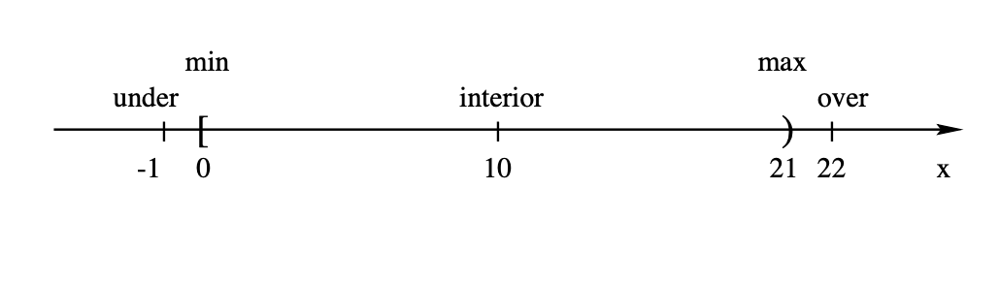
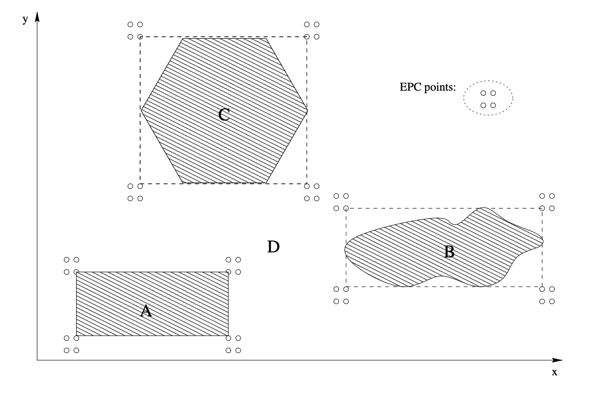
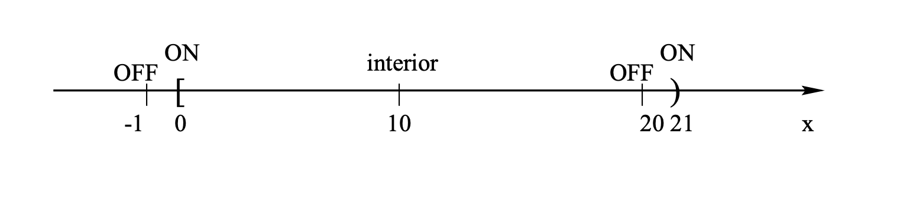
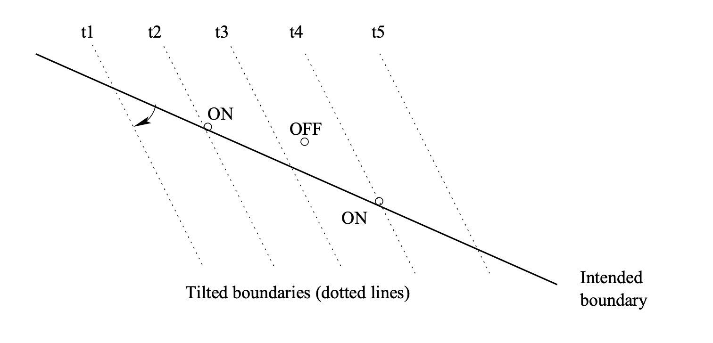
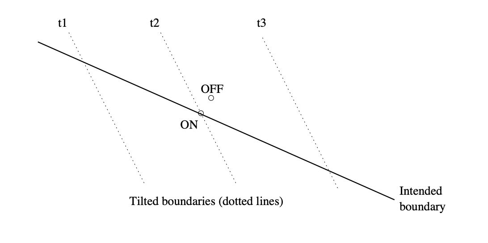

# Chapter 9 Boundary Testing

> 边界测试

* Input Domain Partitioning 
* Simple Domain Analysis and Testing 
* Important Boundary Testing Strategies 
* Extensions and Perspectives

> * 输入域划分
> * 简单的领域分析和测试
> * 重要的边界测试策略
> * 扩展和视角

### Non-Uniform Partition Testing

* Extensions to basic partition testing ideas: 

  Non-uniform partitioned testing. 

  * Testing based on related problems . 
  * Usage-related problems ⇒ UBST . 
  * Boundary problems ⇒ What to do?

* Usage-related problems: 
  * More use ⇒ more likely failures . 
  * Usage information in testing ⇒ (Musa’s) operational profiles (OPs)

* Boundary problems (This Chapter): 

  ⇒ input domain boundary testing (BT).

> 非均匀分区测试是对基本分区测试思想的扩展，涵盖了以下几个方面：
>
> - 基于相关问题的测试。
>  - 与使用相关的问题 ⇒ 使用基于统计的测试（UBST）。
>   - 边界问题 ⇒ 应该怎么办？
> - 与使用相关的问题：
>   - 使用越多 ⇒ 故障可能性越大。
>  - 在测试中使用使用信息 ⇒ （Musa的）操作配置文件（OPs）。
> - 边界问题（本章）： ⇒ 输入域边界测试（BT）。
>
> 举例解释：
> 
> 对于**与使用相关的问题**，考虑一个软件应用，其中某些功能比其他功能更频繁地被使用。根据使用基于统计的测试（UBST），我们会根据这些功能的使用频率来分配测试资源，即对那些被用户更频繁使用的功能进行更多的测试。例如，如果一个电子商务网站的结账功能比搜索功能使用得更频繁，那么结账功能将在测试计划中获得更多的关注。这种方法的依据是，被频繁使用的功能更有可能出现故障，因此需要更多的测试来确保其可靠性。
>
> 对于**边界问题**，输入域边界测试（BT）专注于识别和测试输入域边界的问题。这包括测试输入值处于边界上、刚刚超过边界或刚刚低于边界的情况。例如，在测试一个接受年龄作为输入的软件时，如果接受的年龄范围是18到65岁，边界测试会专门测试年龄为17岁（刚刚低于下界）、18岁（恰好在下界）、65岁（恰好在上界）和66岁（刚刚超过上界）的情况。通过这种方式，测试人员可以确保软件能够正确处理边界情况，避免因输入值位于边界附近而导致的错误。
>
> 通过将这些扩展应用到分区测试中，测试人员可以更全面地覆盖软件的不同使用场景，同时确保软件在边界条件下的稳定性和可靠性。

### Boundary Testing: Overview

* What is it? 
  * Test I/O relations. 
  * Classifying/partitioning of input space: 
    * case-like processing model. 
    * Cover input space and related boundary conditions. 
    * Also called (input) domain testing.

* Characteristics and applications?
  * Functional/black-box view (I/O mapping for multiple sub-domains)
  * Well-defined input data: 
    * numerical processing and decisions.
  * Implementation information may be used.
  * Focus: boundaries and related problems.
  * Output used only in result checking.

> 边界测试：概述
>
> - 它是什么？
>   - 测试输入/输出关系。
>   - 输入空间的分类/分区：
>     - 类似情况的处理模型。
>     - 覆盖输入空间及相关的边界条件。
>     - 也称为（输入）域测试。
> - 特点和应用？
>   - 功能性/黑盒视角（多个子域的输入/输出映射）
>   - 明确定义的输入数据：
>     - 数值处理和决策。
>   - 可能会使用实现信息。
>   - 重点：边界及相关问题。
>   - 输出仅在结果检查中使用。
>
> 举例解释：
>
> 考虑一个软件应用，该应用需要处理来自用户的数值输入，并根据这些输入值进行一系列的计算和决策。边界测试在这个过程中的作用是确保软件能够正确处理各种边界条件下的输入值。例如，如果一个功能接受的输入值范围是0到100（包括0和100），边界测试将会专门检查边界值0和100，以及接近边界的值如-1和101，以确保软件能够正确响应这些边界情况，例如拒绝无效输入或在达到边界值时正确计算。
>
> 边界测试的应用不仅限于数值输入。在处理包含有限选项的输入时，如选项菜单或者是开/关切换，边界测试也非常有用。例如，对于一个允许用户选择年份的下拉菜单，如果选项限定在2000年到2020年之间，边界测试会检查2000年和2020年这两个边界条件，以及可能超出范围的年份，如1999年或2021年，以确保软件能够正确管理这些情况。
>
> 通过这样的测试，开发团队可以更有信心地确保软件在面对边界条件时的行为符合预期，从而提高软件的稳定性和用户满意度。

### I/O Variables and Values

* Input:
  * Input variables: $x_1, x_2, . . . , x_n$. 
  * Input space: n-dimensional. 
  * Input vector: $X = [x_1, x_2, . . . , x_n]$.
  * Test point: X with specific xi values.
  * Domains and sub-domains: specific types of processing are defined. 
  * Focus on input domain partitions.

* Output (assumed, not the focus)
  * Output variables/vectors/space/range similarly defined. 
  * Mapped from input by a function. 
  * Output only used as oracle.

> 输入/输出变量和值
>
> - 输入：
>   - 输入变量：x1, x2, ..., xn。
>   - 输入空间：n维。
>   - 输入向量：X = [x1, x2, ..., xn]。
>   - 测试点：具有特定xi值的X。
>   - 域和子域：定义了特定类型的处理。
>   - 重点关注输入域的分区。
> - 输出（假定的，不是焦点）
>   - 输出变量/向量/空间/范围同样定义。
>   - 通过函数从输入映射。
>   - 输出仅作为预言机使用。
>
> 举例解释：
>
> 考虑一个软件应用，用于计算银行贷款的利息。在这个应用中：
>
> - 输入变量可能包括贷款金额（x1）、贷款期限（x2，以年计）、年利率（x3）等。
> - 输入空间是三维的，每个维度代表一个输入变量。
> - 输入向量X = [x1, x2, x3]代表一组特定的贷款条件。
> - 一个测试点可能是X = [10000, 5, 5]，表示一笔10,000单位货币、期限5年、年利率5%的贷款。
> - 不同的贷款条件（如不同的贷款金额范围、期限或利率）可能定义为输入域的不同子域，每个子域针对特定类型的贷款条件进行处理。
>
> 在输出方面，假设输出变量是计算出的利息总额。输出是通过输入向量和贷款计算函数映射得到的。在测试中，输出（利息总额）被用作oracle（即，用于验证软件是否根据输入正确计算利息）。
>
> 通过将输入空间划分为具有不同贷款条件的子域，并针对每个子域设计测试点，测试人员可以确保软件能够正确处理各种贷款情况，从而验证软件的准确性和鲁棒性

> > 在软件测试中，"oracle"是一个术语，指的是一个机制或方法，用于判断一个测试是否通过。它提供了一个标准或依据，以确定软件的实际行为是否符合预期行为。换句话说，测试oracle能够告诉你软件的输出或结果是否正确。Oracle可以是预定义的期望结果、规范、已存在的标准软件行为、用户的期望或任何可以用来验证软件正确性的参考。

### Domain Partitioning and Sub-domains

* Input domain partitioning

  * Divide into sets of sub-domains. 
  * “domain”, “sub-domain”, and “region” often used interchangeably

* A sub-domain is typically defined by a set of conditions in the form of: 
  $$
  f(x_1, x_2, . . . , x_n) < K
  $$
  where “<” can also be substituted by “>”, “=”, “$\neq$”, “$\leq$”, or “$\geq$”.
  
* Domain (sub-domain) boundaries:

  - Distinguishes/defines different sub-domains.
  
  - Each defined by it boundary condition,
  
    e.g., f(x1,x2,...,xn) = K
  
  - Adjacent domains: those share common boundary(ies)
  
*  Boundary properties and related points:

  * Linear boundary:
    $$
    a_1x_1 + a_2x_2 + ... + a_nx_n = K
    $$
    (Otherwise, it is a nonlinear boundary.)
  
    Boundary point: on the boundary.

	* Vertex point: 2+ boundaries intersect.
	
	*  Other properties w.r.t. domains later.

> 
> 输入域的划分和子域
>
> - 输入域划分
>
>   - 将其划分为一组子域。
>   - “域”、“子域”和“区域”通常可以互换使用。
>
> - 一个子域通常由一组条件以以下形式定义：
>
>   
> $$
>   f(x_1, x_2, . . . , x_n) < K
> $$
>   其中“<”也可以被“>”、“=”、“$\neq$”、“$\leq$”或“$\geq$”替换。
>
> - 域（子域）边界：
>
>   - 区分/定义不同的子域。
>   - 每个子域由其边界条件定义， 例如，$f(x_1, x_2, ..., x_n) = K$
>   - 相邻域：那些共享公共边界的域。
>
> - 边界属性及相关点：
>
>   - 线性边界：
>     $$
>     a_1x_1 + a_2x_2 + ... + a_nx_n = K
>     $$
>     （否则，它是一个非线性边界。）
>
>     边界点：位于边界上。
>
>   - 顶点：两个或更多边界交叉的地方。
>
>   - 关于域的其他属性将在后面讨论。
>
> 举例解释：
>
> 考虑一个简单的软件应用，它根据用户的年龄（x）和月收入（y）来决定信用卡的额度。这个应用的输入域可以被划分为几个子域，每个子域对应于不同的额度范围。
>
> 例如，一个可能的子域定义为年龄大于18岁且月收入大于3000的用户，即 $f(x, y) = {x > 18} \land {y > 3000}$，这些用户可能被赋予更高的信用卡额度。
>
> 在这个例子中，域的边界可以是 $x = 18$ 和 $y = 3000$。那些恰好在边界上的点，如一个用户的年龄恰好是18岁和/或月收入恰好是3000，被认为是边界点。而那些使得这两个条件同时满足的点，则可能位于某个特定子域内部或其边界上。
>
> 通过识别并测试这些边界条件和子域，测试人员可以确保软件能够正确处理不同的输入值，并为符合特定条件的用户分配适当的信用卡额度。

### Boundary and Domain Properties

* Boundary properties w.r.t domains: 
  * Closed boundary: inclusive ($\leq, \geq$) 
  * Open boundary: exclusive ($<, >$)

* Domain properties and related points:
  * Closed domain: all boundaries closed . 
  * Open domain: all boundaries open . 
  * Linear/nonlinear domain: all linear boundary conditions? 
  * Interior point: in domain and not on boundary. 
  * Exterior point: not in domain and not on boundary.

> 边界和域的属性
>
> - 关于域的边界属性：
>   - 封闭边界：包含性的（$\leq, \geq$）
>   - 开放边界：排他性的（$<, >$）
> - 域的属性及相关点：
>   - 封闭域：所有边界都是封闭的。
>   - 开放域：所有边界都是开放的。
>   - 线性/非线性域：所有边界条件都是线性的？
>   - 内部点：在域内且不在边界上。
>   - 外部点：不在域内且不在边界上。
>
> > 举例解释：
> >
> > 考虑一个在线购物平台的促销策略，该策略根据用户的购物金额（x）提供不同等级的折扣。假设这个策略有两个子域：
> >
> > 1. 购物金额小于等于1000的用户（$x \leq 1000$），获得5%的折扣。
> > 2. 购物金额大于1000的用户（$x > 1000$），获得10%的折扣。
> >
> > 在这个例子中，$x = 1000$ 是一个封闭边界的示例，因为它包含在第一个子域中，即 $\leq 1000$。这表示购物金额恰好为1000的用户仍然属于第一个子域，并且能够获得5%的折扣。对于第二个子域，边界是开放的，即 $x > 1000$，表示购物金额必须大于1000才能享受10%的折扣。
> >
> > 如果这个促销策略中的所有边界条件都是以类似的方式定义的（包含性或排他性），那么我们可以称之为封闭或开放域。在这个案例中，由于存在至少一个封闭边界，所以这个促销策略的域至少部分是封闭的。
> >
> > 考虑到这些边界和域的属性，可以帮助测试人员设计测试案例，以确保在线购物平台的软件能够正确地根据购物金额识别并应用相应的折扣率。这涉及到测试内部点（如 $x = 500$ 和 $x = 1500$）、边界点（$x = 1000$）以及外部点（如 $x = -100$，虽然可能在实际情况下不会出现负数的购物金额，但测试外部点有助于验证输入验证的健壮性）。

## 9.1.2 Input Domain Partition Testing

* General steps: 
  * Identify input variable/vector/domain. 
  * Partition the input domain into sub-domains. 
  * Perform domain/sub-domain analysis. 
  * Define test points based on the analysis. 
  * Perform test and followup activities.

* Boundary testing: Above with focus on boundaries.
* Domain analysis:
  * Domain limits in each dimension. 
  * Domain boundaries (more meaningful).  
  * Closure consistency? 
  * Plotting for 1D/2D, algebraic for 3D+.

> ### 输入域分区测试
>
> - 一般步骤：
>   - 确定输入变量/向量/域。
>   - 将输入域分割成子域。
>   - 执行域/子域分析。
>   - 基于分析定义测试点。
>   - 执行测试和后续活动。
> - 边界测试：以上内容，重点关注边界。
> - 域分析：
>   - 每个维度的域限制。
>   - 域边界（更有意义）。
>   - 闭合一致性？
>   - 对于1D/2D进行绘图，3D及以上使用代数方法。
>
> 举例解释：
>
> 假设我们正在测试一个软件应用，该应用根据用户的年龄（A）和收入（I）来推荐不同的金融产品。
>
> 1. **确定输入变量/向量/域**：在这个例子中，输入变量是用户的年龄（A）和收入（I），因此输入向量是[A, I]，输入域是所有可能的[A, I]组合。
> 2. **将输入域分割成子域**：基于业务逻辑，我们可以将输入域分割成几个子域，比如"年轻、低收入"、"年轻、高收入"、"中年、低收入"和"中年、高收入"。
> 3. **执行域/子域分析**：分析每个子域的特征和边界条件。例如，"年轻"可以定义为18岁到30岁之间，"中年"为31岁到60岁，"低收入"为年收入小于50,000，"高收入"为年收入大于或等于50,000。
> 4. **基于分析定义测试点**：为每个子域选择测试点。例如，在"年轻、高收入"子域中，一个测试点可能是25岁的用户，年收入55,000。
> 5. **执行测试和后续活动**：使用定义的测试点测试软件，观察推荐是否符合预期，并根据需要进行调整或修复。
>
> - **边界测试**：对于上述每个子域，特别关注边界条件的测试点，如年龄正好为30岁（年轻到中年的边界）和年收入正好为50,000（低收入到高收入的边界）。
> - **域分析**：对于每个维度（年龄和收入），确定域的限制和边界，确保在闭合条件下的一致性（比如是否包含边界值），并通过绘图或代数方法来可视化或理解域和子域的布局。
>
> 通过这种方法，测试人员可以系统地探索输入域的不同区域，确保软件在各种输入条件下都能正确工作，特别是在边界条件下，这对于发现潜在的问题非常关键。

#### 9.1.2.1 Problems in Partitioning

* Domain partitioning problems: 
  * Ambiguity: under-defined/incomplete.
  * Contradictions: over-defined/overlap. 
  * Most likely to happen at boundaries.
  * Key: sub-domains form a partition.

* ==Related boundary problems:==  
  * ==Closure problem.== 
  * ==Boundary shift: $f(x_1, x_2, . . . , x_n) = K + \delta $ .== 
  * ==Boundary tilt: parameter change(s).== 
  * ==Missing boundary.== 
  * ==Extra boundary.==

> #### 分区中的问题
>
> - 域分区问题：
>   - 模糊性：定义不足/不完整。
>   - 矛盾：定义过多/重叠。
>   - 最有可能在边界处发生。
>   - 关键：子域形成一个分区。
> - 相关的边界问题：
>   - 闭合问题。
>   - 边界移位：$f(x_1, x_2, . . . , x_n) = K + \delta$。
>   - 边界倾斜：参数变化。
>   - 缺失的边界。
>   - 额外的边界。
>
> 举例解释：
>
> 假设我们在对一个地图应用进行测试，该应用允许用户根据不同的地理区域（如城市、乡村）查看天气信息。我们将输入域分为城市和乡村两个子域。
>
> 1. **模糊性**：如果"乡村"的定义不够清晰（例如，未明确指出某些边缘地带是否属于乡村），这可能导致输入值（地理位置）的分类不明确。
> 2. **矛盾**：如果某个地理位置同时满足"城市"和"乡村"的定义条件（例如，因定义重叠），则会导致输入值的分类产生矛盾。
> 3. **边界问题**：
>    - **闭合问题**：假设我们没有明确指出城市边缘的天气信息是属于城市还是乡村。
>    - **边界移位**：如果城市边界扩展（$K + \delta$），原本属于乡村的区域现在成为城市区域。
>    - **边界倾斜**：随着时间的推移，某些地区的发展使得原本清晰的城市与乡村边界发生变化。
>    - **缺失的边界**：如果忽略了某个特定地区，导致该地区既不属于城市也不属于乡村的分类。
>    - **额外的边界**：在定义过程中错误地添加了不必要的分类，例如将"郊区"作为独立的子域，但其实它可能只是城市或乡村的一部分。
>
> 通过识别和解决这些分区和边界问题，测试人员可以确保地图应用能够正确地为每个地理位置提供准确的天气信息，从而提高用户满意度和应用的准确性。

## 9.2 Simple Domain Analysis and EPC

* Simple domain analysis:  

  * identify domain limits in each dimension 

    * min, max values . 

    * push “over” max, “under” min 

      ⇒ 4 values for each variable or dimension: under, min, max, over

* 1D example: Fig 9.1 (p.133)

  

* Extreme point combinations (EPC)
  * Combine above to derive test points.
  * Combine variables (×, cross-product).
  * \# testcases: $4^n + 1$.

* 2D examples: 9.2 (p.134)

  

* Problems/shortcomings with EPC:

  * Missing boundary points: 2D example. (unless boundaries are perfectly aligned)

  * Exponential # testcases: $4^n + 1$. 

    ⇒ Need more effective strategies.

> ### 简单域分析和极点组合（EPC）
>
> - **简单域分析**：
>   - 确定每个维度的域限制。
>     - 最小值、最大值。
>     - 超出最大值、低于最小值。
>     - 因此，每个变量或维度有四个值：低于、最小、最大、超过。
> - **1D 示例**：如图9.1所示，可能是一个一维数值如温度或距离，图表将展示这个变量的四个关键点：最小值前的一个点、最小值、最大值和最大值后的一个点。
> - **极点组合（EPC）**：
>   - 结合以上信息来推导测试点。
>   - 组合变量（×，笛卡尔乘积）。
>   - 测试用例的数量为 $4^n + 1$。
> - **2D 示例**：如图9.2所示，可能展示了两个变量如温度和湿度，在二维空间中的组合。图表将展示这些变量如何围绕它们的最小值和最大值定义测试案例。
> - **EPC的问题/缺陷**：
>   - 缺失的边界点：2D 示例中可能会遗漏边界点，除非边界完美对齐。
>   - 测试用例数量呈指数增长：$4^n + 1$。
>     - 这就需要更有效的策略。
>
> 举例说明：
>
> 如果我们正在测试一个接受两个输入变量x和y的应用程序，我们可以将每个变量的范围划分为四个测试点。例如，如果x的范围是0到20，那么对于x，测试点可能是-1（低于最小值）、0（最小值）、20（最大值）、21（超过最大值）。对于y，如果范围是10到30，测试点可能是9、10、30、31。使用EPC方法，我们将创建一个测试案例集，包括所有这些测试点的组合，例如（-1,9）、（0,10）、（20,30）、（21,31）等，以确保覆盖所有可能的输入组合。对于二维输入域，我们可能会得到一个4x4的测试案例矩阵，每个变量有四个测试点，因此总共有16个测试案例，加上至少一个额外的测试案例来验证功能正常，总共是17个测试案例。
>
> 但是，当变量数量增加时，需要的测试案例数量将以指数级增长。例如，对于三个变量，我们将需要 $4^3 + 1 = 65$ 个测试案例。这对测试资源的需求可能非常高，尤其是当我们处理更多变量时。因此，在实际情况中，我们可能需要更有效的策略来选择最有代表性的测试案例，同时保证合理的测试覆盖率。

## 9.3 Boundary Testing Ideas

*  Using points to detect boundary problems:
  * A set of points selected on or near a boundary: ON and OFF points.
  * Able to detect movement, tilt, etc.
  * Motivational examples for boundary shift.

* ε neighborhood and ON/OFF points
  * Region of radius ε around a point
  * Theoretical: could be infinitesimal
  * Practical: numerical precision
  * ON point: On the boundary
  * OFF point:
    * opposite to ON processing
    * off boundary, within ε distance 
    * closed boundary, outside
    * open boundary, inside

> ###  边界测试思想
>
> - 使用点检测边界问题：
>   - 在边界上或附近选取一组点：ON点和OFF点。
>   - 能够检测移动、倾斜等。
>   - 用于激励边界移动的示例。
> - ε 邻域和ON/OFF点
>   - 围绕一个点的半径为ε的区域
>   - 理论上：可以是无限小的
>   - 实践中：数值精度
>   - ON点：在边界上
>   - OFF点：
>     - 与ON处理相反
>     - 在边界外，距离边界ε距离以内
>     - 封闭边界，外部
>     - 开放边界，内部
>
> 边界测试是一种测试策略，专注于发现输入或输出域边界附近可能存在的问题。这些问题可能是由于边界处理的编程错误，例如，边界条件编写错误或不完整。ON点和OFF点是边界测试中用来确定软件是否正确处理边界值的测试数据。
>
> 举例说明：
>
> 假设有一个应用程序，它的任务是接受0到100之间的整数输入，并对这些输入进行分类。根据边界测试的思想，我们将选择一些测试点：
>
> - **ON点**：这些点位于边界上，例如0和100。这些点应该被正确分类，因为它们恰好在定义的输入域的边界上。
> - **OFF点**：这些点位于边界附近但不在边界上，例如-1和101。根据程序的设计，它们可能会被拒绝，或者分类到默认情况下。对于封闭边界，OFF点可能是101（因为100是允许的最大值），对于开放边界，OFF点可能是99（假设100是不允许的最大值）。
>
> ε邻域是选择OFF点的一种方法，用于定义一个小范围，表示接受范围外的值。在实际测试中，ε的大小由数值计算的精度决定，可能是0.1、0.01或更小，具体取决于测试的需要和输入数据的特性。
>
> 通过这些ON点和OFF点的测试，测试人员可以验证软件在边界处的行为是否符合预期，这是软件质量保证中的一个关键方面。如果软件在处理边界值时出现问题，这可能表明存在潜在的更广泛的质量问题。

### 9.3.1 Weak N x 1 Strategy

* N x 1 strategy (N-dimensional space)
  * N ON points (linearly independent): confirm (n-1)-D hyper-plane boundary.
  
  * 1 OFF point: centroid of ON points.
  
  * 1D: 1ON,1OFF
  
  * 1D examples: Fig 9.3 (p.137)
  
    

* Typical errors detected:
  * Closure bug 
  * Boundary shift 
  * Boundary tilt (later) 
  * Extra boundary (sometimes) 
  * Missing boundary

> ==You have to know three major testing strategies why and advantages and disadvantages.==

* N x 1: N ON and 1 OFF points

  * Weak: set of tests per boundary instead of per boundary segment. 
  * \# test points: (n + 1) × b + 1 
  * 2D example: Fig. 9.4 (p.137) below 
    * advantages over EPC!
  
  
  
  

* Boundary tilt: Fig 9.5 (p.138) above
  * series of tilting points 
  * some ON/OFF points combination will detect each tilt 
  * (moving) illustration in class

* Other problems detected ≈ 1D example

> ### 弱N x 1策略
>
> - **N x 1策略（N维空间）**:
>   - N个ON点（线性独立）：确认（n-1）维超平面边界。
>   - 1个OFF点：ON点的质心。
>   - 一维情况：1个ON点，1个OFF点。
> - **典型检测到的错误**:
>   - 闭合缺陷。
>   - 边界移动。
>   - 边界倾斜（稍后讨论）。
>   - 额外的边界（有时）。
>   - 缺失的边界。
>
> 你需要了解三大测试策略的原因以及它们的优缺点。
>
> - **N x 1：N个ON点和1个OFF点**:
>   - 弱：针对每个边界而不是每个边界段设置测试集。
>   - 测试点数量：(n + 1) × b + 1。
>   - 二维示例：优于EPC的优点！
> - **边界倾斜**：一系列倾斜点，某些ON/OFF点组合将检测到每个倾斜。
>
> 检测到的其他问题≈一维示例。
>
> #### 举例解释：
>
> 假设有一个软件系统，其输入空间是由年龄和收入的两个维度组成。在弱N x 1策略中，我们会选择N个线性独立的ON点，这些点位于预期的年龄和收入边界上。例如，如果边界是18岁，ON点可以是18岁的一组不同收入水平的测试点，OFF点可以是18岁的收入水平的平均值，稍微低于或高于这个平均值。
>
> 在一维示例中，如只有年龄作为变量，测试点可以在边界上（ON点，如18岁）和边界附近但不超出（OFF点，如17岁）。这种方法可以帮助检测边界处理的错误，例如如果软件错误地允许17岁的用户访问只针对18岁及以上用户的功能。
>
> 通过对边界点周围的测试点进行分析，测试人员可以验证系统是否正确处理边界情况，并识别可能的边界相关缺陷，如边界移位或闭合问题。这对于开发高质量、健壮性强的软件系统至关重要。

### 9.3.2 Weak 1 x 1

* Motivation: #test-points↓ without losing much of the problem detection capability.
  * boundary defined by 1 ON 1 OFF (n ON points in weak N ×1 form an equivalent class ⇒ sampling 1)
  
  * 2D example: Fig 9.6 (p.139) below.
  
    

* Typical errors detected:
  * Closure bug
  * Boundary shift
  * Boundary tilt (not always!) 
  * Missing boundary
  * Extra boundary (sometimes)

* Tilting in Fig 9.7, p.140, below (miss tilting at ON point, vs Weak N×1)

  

#### 9.3.3 Other BT Strategies

*  Strong vs. weak testing strategies:

  * Weak: 1 set of tests for each boundary

  * Strong: 1 set of tests for each segment 

    

- Why use strong BT strategies?
  * Gap in boundary condition
  * Closure change
  * Coincidental correctness: particularly stepwise implementation
  * Code clues: complex, convoluted
  * Use in safety-critical applications

* Nonlinear boundaries: Approximate (e.g., piecewise) strategies often useful.

> ###  9.3.2 弱1 x 1策略
>
> - 动机：在不丧失太多问题检测能力的情况下减少测试点数量。
>   - 由1个ON点和1个OFF点定义边界（弱N x 1中的n个ON点形成一个等价类 ⇒ 采样1个）
>   - 二维示例：下图9.6。
> - 典型检测到的错误：
>   - 闭合缺陷
>   - 边界移位
>   - 边界倾斜（不总是！）
>   - 缺失的边界
>   - 额外的边界（有时）
> - 在图9.7中的倾斜，低于ON点的倾斜将被错过，与弱N×1对比。
>
> #### 9.3.3 其他边界测试策略
>
> - 强测试策略 vs. 弱测试策略：
>   - 弱：每个边界一套测试
>   - 强：每个分段一套测试
>
> - 为什么使用强边界测试策略？
>   - 边界条件中的缺口
>   - 闭合条件的变化
>   - 偶然正确性：特别是分步实施
>   - 代码线索：复杂、曲折
>   - 在安全关键应用中使用
>
> - 非线性边界：近似（例如，分段）策略常常有用。

> > #### 解释和例子
> >
> > 弱1 x 1策略是为了在测试过程中保持效率而设计的。在二维示例中，比如测试一个图形绘制程序，该程序允许用户在屏幕上绘制不同的形状，每个形状在特定条件下变色。如果我们关注的是形状的边缘，例如一个正方形的一个角落是否会在用户执行特定操作时变色，我们可以使用弱1 x 1策略：
> >
> > - 选择一个ON点，可能是角落的确切坐标，我们期望在这个点上发生变色。
> > - 选择一个OFF点，这个点会在角落的直接邻域中，但不在预期变色的边界上。
> >
> > 通过这种方式，我们可以有效地测试程序是否只在指定的边界上正确变色，而不是在其他地方错误地触发变色效果。
> >
> > 强测试策略更加详尽，适用于更高风险的场景，例如在医疗设备或安全系统中测试边界条件，因为这里的边界错误可能导致严重后果。在这些情况下，每个边界段的测试覆盖是很重要的，因为这有助于确保每个可能的边界行为都被认真考虑和验证过。
> >
> > 在非线性边界的情况下，例如测试一个自动调节室内温度的系统，可能需要近似策略。因为温度变化可能不是线性的，所以我们可能需要在一系列预定点上测试，以确保系统在各种不同温度下都能正确响应。这可能涉及设置温度阈值并测试系统是否能在达到或超过这些阈值时正确调整空调设备的输出。

## 9.4 Extensions and Perspectives

### 9.4.1 BT Extensions

* Direct extensions
  * Data structure boundaries. 
  * Capacity testing.
  * Loop boundaries (Ch.11).
* Other extensions
  * Vertex testing:
    * problem with boundary combinations 
    * follow after boundary test (1X1 etc.) 
    * test effective concerns
   * Output domain in special cases 
     * similar to backward chaining 
     * safety analysis, etc.

* Queuing testing example below.

### 9.4.2 BT and Queuing

* Queuing description: priority, buffer, etc. 
* Priority: time vs. other:
  * time: FIFO/FCFS, LIFO/stack, etc. 
  * other/explicit: SJF, priority#, etc.
  * purely random: rare

* Buffer: bounded or unbounded? 
* Other information:
  * Pre-emption allowed?
  * Mixture/combination of queues
  * Batch and synchronization

> #### 9.4.1 边界测试的直接扩展
>
> - 直接扩展
>   - 数据结构边界。
>   - 容量测试。
>   - 循环边界（第11章）。
> - 其他扩展
>   - 顶点测试：
>     - 边界组合的问题。
>     - 在边界测试（1X1等）之后进行。
>     - 测试有效关注点。
>   - 特殊情况下的输出域
>     - 类似于反向链接。
>     - 安全分析等。
> - 下面是队列测试的例子。
>
> #### 解释和例子
>
> 边界测试的直接扩展包括对数据结构边界的测试，如数组或链表的大小限制；容量测试，如数据库或网络带宽的负载能力；以及循环边界的测试，例如确认循环在正确的条件下启动和终止。
>
> 顶点测试是在测试已经完成的边界条件后的进一步检查，它关注于多个边界条件交汇的点，这些点可能引发特殊的问题。例如，一个软件可能需要处理基于用户角色和操作类型的权限分配。角色和操作类型的每种组合可能形成一条边界，而交汇的顶点需要额外的注意，以确保权限正确分配。
>
> 在特殊情况下的输出域测试与输入域测试相似，但关注的是软件的输出是否符合预期。这类测试通常出现在需要进行安全分析的场景中，例如在控制系统中，输出的正确性至关重要。
>
> 队列测试是另一个边界测试的应用，特别是在动态系统中，如计算机网络或消息队列。测试的重点可能是确认系统能否在到达容量极限时正确处理新的请求，以及当队列为空时的行为。
>
> 举个例子，如果你正在测试一个网络请求处理器，该处理器在达到一定数量的并发请求时应该停止接受新的请求。在这种情况下，你会测试当处理器接近其容量限制时的行为，同时确保当请求数量低于阈值时，处理器能够重新开始接受请求。这就需要对容量边界进行精细的测试，确保在实际应用中，系统不会因超负荷而崩溃或不会在还有处理能力时就停止接受新的请求。

### 9.4.3 Testing a Single Queue

* Test case design/selection:
  * Conformance to queuing priority.
  * Boundary test
  * Test cases: input + expected output. 
  * Combined cases of the above.

* Testing specific boundary conditions:

  * lower bound: 0, 1, 2 (always)

  * server busy/idle at lower bound

  * upper bounds: B, B ± 1 (bounded Q)

    for bounded queue with bound B 

* Other test cases:
  * Typical case: usage-based testing idea. 
  * Q unbounded: some capacity testing.

> ###  9.4.3 测试单个队列
>
> - 测试用例设计/选择：
>   - 遵守排队优先级。
>   - 边界测试。
>   - 测试用例：输入 + 预期输出。
>   - 上述的组合情况。
> - 测试特定边界条件：
>   - 下限：0，1，2（总是测试）
>   - 服务器在下限时忙碌/空闲
>   - 上限：B，B ± 1（有界队列） 对于有边界B的有界队列
> - 其他测试用例：
>   - 典型情况：基于使用的测试思想。
>   - 队列无界：一些容量测试。
>
> #### 解释和例子
>
> 在测试一个单一队列的系统时，如一个事件处理队列，我们要设计测试用例来验证系统是否能够按照既定的优先级来处理事件，并且要确保在队列的边界条件下系统表现正确。
>
> **测试用例设计/选择**可以包括：
>
> - 验证最先到达的事件是否被最先处理，确保遵循FIFO（先进先出）规则。
> - 当队列为空时（下限），添加一个事件，确保它被立即处理。
> - 当队列中已有一个事件时，添加另一个事件，确保两者的处理顺序正确。
>
> **具体的边界条件测试**可能包括：
>
> - 在队列为空时，确认系统是否空闲或者忙碌，这可能影响新事件的处理方式。
> - 对于有界队列，测试当队列接近其上限B时的表现，比如当队列中有B-1、B、B+1个事件时的行为。这可以包括确认系统是否拒绝添加新事件（当达到B+1时），或者是否有正确的溢出策略。
>
> **其他测试用例**可能包括：
>
> - 典型情况的测试，即队列长度在正常操作范围内时的表现，以验证常规使用情况。
> - 对于无界队列，进行一些容量测试，如在队列中添加大量事件以测试系统的处理能力和性能。
>
> 例如，如果你正在测试一个机场安检队列的管理系统：
>
> - 你会想要确保优先级较高的乘客（如头等舱乘客）比普通乘客更快通过安检。
> - 你可能会测试当安检点空闲时，乘客是如何被添加到队列中并立即处理的。
> - 当队列达到了其设计容量时，你会想要确保系统不会过载，也不会错误地允许额外的乘客进入队列，这可能需要模拟高峰时段的乘客流量。
>
> 通过这些测试，你可以确保队列管理系统能够在各种不同的操作条件下，稳健地维护队列和优先级规则，从而提高效率和乘客满意度。

### 9.4.4 BT Limitations

* Simple processing/defect models:
  * Processing: case-like, general enough? 
  * Specification: ambiguous/contradictory. 
  * Boundary: likely defect.
  * Vertex: ad hoc logic.

* Limitations
  - Processing model: no loops.
  - Coincidental correctness: common.
  - ε-limits, particularly problematic for multi-platform products.
  - OFF point selection for closed domain
    *  possible undefined territory,
    *  may cause crash or similar problems.
  - Detailed analysis required.

> ### 9.4.4 边界测试的局限性
>
> - 简单处理/缺陷模型：
>   - 处理方式：类似于case语句，是否足够通用？
>   - 规范：可能含糊或矛盾。
>   - 边界：缺陷可能性大。
>   - 顶点：特定逻辑。
> - 局限性
>   - 处理模型：不包括循环。
>   - 偶然正确性：常见。
>   - ε-极限，特别是对于多平台产品而言，问题多多。
>   - 封闭域的OFF点选择
>     - 可能涉及未定义领域，
>     - 可能引起崩溃或类似问题。
>   - 需要详细分析。
>
> #### 解释和例子
>
> 在软件测试中，边界测试尽管是一种有效的方法，但它基于一些假设和模型，这些假设在某些情况下可能会限制它的效果。
>
> 例如，假设我们在测试一个简单的在线支付系统，该系统根据用户的交易金额来计算交易费用。如果这个系统的处理模型非常简单，比如只基于金额的几个固定区间来决定费率，这就假设了在这些区间内的所有金额都会受到相同的处理。这种case-like的处理方式可能无法捕捉到更复杂或非线性的缺陷。
>
> 此外，如果规范模糊或自相矛盾，如未清楚说明交易金额的边界条件，或者规定了不一致的费率，这就可能导致边界测试产生歧义结果。因此，虽然边界测试可能表明边界处理得当，但由于规范问题，实际上可能并不是正确的行为。
>
> 边界测试的另一个局限性是ε-极限的选择，这是用来定义边界附近应该如何处理数据的阈值。对于在多个平台上运行的软件产品，这个阈值可能会变化，因为不同的平台可能有不同的数值表示和精度。
>
> 而在封闭域中选择OFF点也可能会有问题。如果测试点延伸到了未定义的输入空间，可能导致软件崩溃或其他未预料到的行为。
>
> 因此，尽管边界测试是一种强大的测试方法，它还是需要与其他形式的测试结合起来，并且在应用时需要仔细的规划和分析，以确保测试尽可能地有效。
