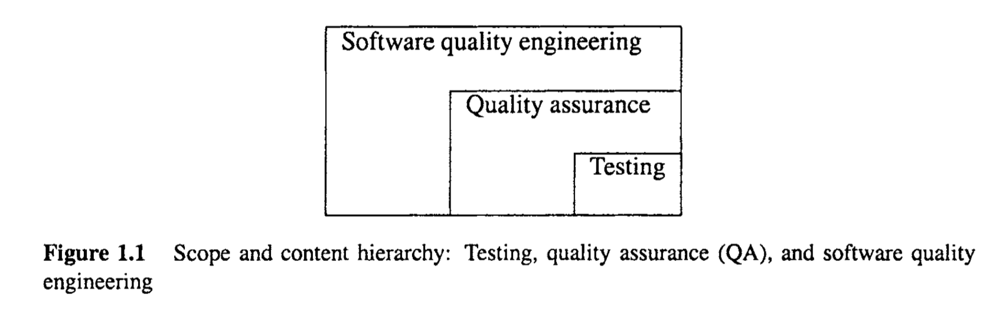
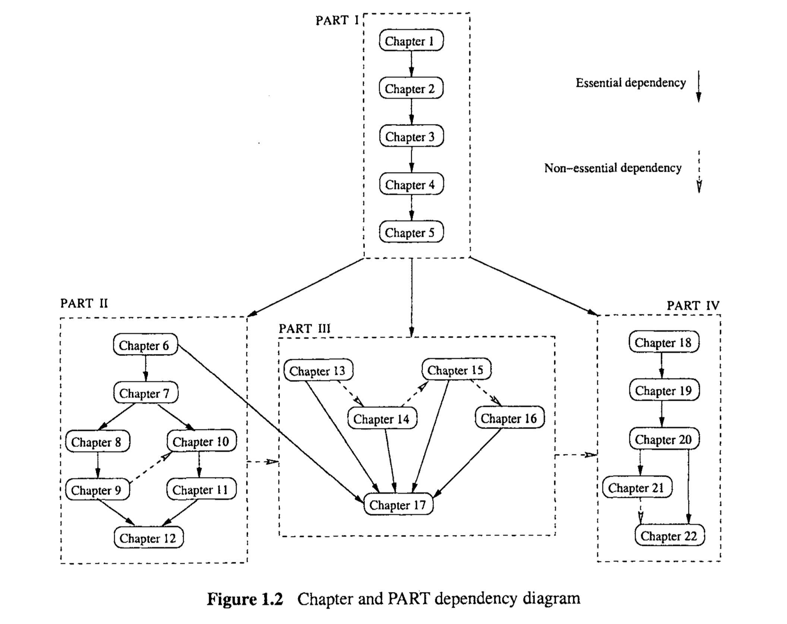

# Chapter 1 OVERVIEW

Computers and software systems are becoming ubiquitous in modern society. Worldwide users rely on individual and interconnected computers, as well as the global information infrastructure, such as the Internet and the World Wide Web (WWW), to fulfill their needs for information processing, storage, search, and retrieval. All these needs are met with the support of the underlying software. This reliance requires the software to function correctly over a long time, to be easy to use, and so on. In general, such requirements for high quality need to be satisfied by the people involved in the development and support of these software systems through various quality assurance activities, and the claims for high quality need to be supported by evidence based on concrete measurements and analyses. 
This chapter introduces various concepts related to quality, quality assurance (QA), and quality engineering, and outlines the contents of this book.

> 计算机和软件系统在现代社会变得无处不在。世界各地的用户依靠个人和相互连接的计算机，以及全球信息基础结构，如互联网和万维网(WWW)，来满足他们对信息处理、存储、搜索和检索的需求。所有这些需求都在底层软件的支持下得到满足。这种依赖要求软件在很长一段时间内正常工作，易于使用，等等。一般来说，这种高质量的需求需要通过各种质量保证活动来满足参与开发和支持这些软件系统的人员，并且高质量的要求需要基于具体测量和分析的证据来支持。
> 本章介绍了与质量、质量保证(QA)和质量工程相关的各种概念，并概述了本书的内容。

#### 1.1 MEETING PEOPLE’S QUALITY EXPECTATIONS

In general, people’s quality expectations for software systems they use and rely upon are two-fold:

1. The software systems must do what they are supposed to do. In other words, they must do the right things. 
2. They must perform these specific tasks correctly or satisfactorily. In other words, they must do the things right.

> 一般来说，人们对他们使用和依赖的软件系统的质量期望有两个方面:
>
> 1. 软件系统必须做它们应该做的事情。换句话说，他们必须做正确的事情。
> 2. 他们必须正确地或令人满意地完成这些具体任务。换句话说，他们必须把事情做对。

The former requires that the software be the “right software”, or perform the right functions. For example, an airline reservation system is supposed to handle reservations, not intended to fly airplanes automatically. The focus of the related activities is to validate the required software functions under their intended operational environment. The latter requires that the software systems perform their intended functions without problems. In the airline reservation system example, the system should help travel agents or individual travelers make valid reservations within a pre-specified time limit, instead of making invalid ones, taking too long to make a reservation, or refusing to make reservations without proper justification. The focus of the related activities is to verify that the implemented software functions operate as specified.

> 前者要求软件是“正确的软件”，或者执行正确的功能。例如，飞机订票系统应该处理预订，而不是自动驾驶飞机。相关活动的重点是在预期的操作环境下验证所需的软件功能。后者要求软件系统无问题地执行其预期功能。在飞机订票系统的例子中，系统应该帮助旅行社或个人旅行者在预先指定的时间限制内进行有效的预订，而不是进行无效的预订，花费太长时间进行预订，或者在没有适当理由的情况下拒绝预订。相关活动的重点是验证实现的软件功能是否按规定运行。

##### Main tasks for software quality engineering

As the main topics of this book, the tasks for software QA and quality engineering are to ensure software quality through the related validation and verification activities. These activities need to be carried out by the people and organizations responsible for developing and supporting these software systems in an overall quality engineering process that includes :

> 作为本书的主要主题，软件QA和质量工程的任务是通过相关的确认和验证活动来确保软件质量。在一个全面的质量工程过程中，这些活动需要由负责开发和支持这些软件系统的人员和组织来执行，包括:

* quality planning;
* execution of selected QA or software validation and verification activities; 
* measurement and analysis to provide convincing evidence to demonstrate software quality to all parties involved. 

> * 质量策划;
> * 执行选定的QA或软件确认和验证活动;
> * 测量和分析，以提供令人信服的证据，向所有相关方证明软件质量。

In particular, customers and users need to have the assurance that their quality expectations are satisfied by the delivered software systems. The overall experience and lessons learned in delivering such high-quality software systems can be packaged into the software quality engineering process for quantifiable quality improvement in future development projects or to provide better product support. 

> 特别是，客户和用户需要确保交付的软件系统能够满足他们的质量期望。在交付这种高质量软件系统的过程中获得的全部经验和教训可以打包到软件质量工程过程中，以便在未来的开发项目中进行可量化的质量改进，或者提供更好的产品支持。

When viewed from a different angle, the negative impact of software problems is also increasing, accompanying the pervasive use of and reliance on software systems in modern society. The problems could be associated with performing wrong functions, or performing intended functions incorrectly, thus causing unintended consequences. We would like to see such negative impact be eliminated, if possible. However, due to the increasing demand for automation, additional functionality and convenience by modern society to the computer and software systems, and due to the ubiquitous nature of modern computer, software, and information infrastructure, the size and complexity of modern software systems have also increased steadily. This increase in size and complexity also has unintended consequences in terms of causing quality problems.

> 从另一个角度来看，随着现代社会对软件系统的普遍使用和依赖，软件问题的负面影响也在增加。这些问题可能与执行错误的功能或错误地执行预期的功能有关，从而导致意想不到的后果。如果可能的话，我们希望消除这种负面影响。然而，由于现代社会对计算机和软件系统的自动化、附加功能和便利性的需求日益增加，并且由于现代计算机、软件和信息基础结构的无处不在的性质，现代软件系统的规模和复杂性也在稳步增加。这种规模和复杂性的增加在导致质量问题方面也会产生意想不到的后果。

##### Quality problems in large software systems

Many software systems nowadays are highly complex and contain millions of lines of source code. Examples of such large software systems can be found in virtually every product segment or every application domain, from various operating systems, such as commonly used versions of the Microsoft Windows and UNIX operations systems, to commercial software products, such as database products, to aviation and in-flight entertainment software used on Boeing 777, to defense related software systems, such as various commandcommunicatiodcontrol (CCC) systems.

> 现在许多软件系统都非常复杂，包含数百万行源代码。这种大型软件系统的例子实际上可以在每个产品部分或每个应用领域中找到，从各种操作系统，如常用的Microsoft Windows和UNIX操作系统版本，到商业软件产品，如数据库产品，到波音777上使用的航空和飞行娱乐软件，到国防相关软件系统，如各种命令通信控制(CCC)系统。

Such large and complex systems typically involve hundreds or even thousands of people in their development over months or even years, and the systems are often to be operated under diverse, and sometimes unanticipated, application environments. One may argue that some systems are unnecessarily large and complex. According to (Wirth, 1995), such “fat software” may be caused by indiscriminately adding non-essential features, poor design, improper choices of languages and methodologies, which could be addressed by disciplined methodologies and return to essentials for “lean software”. Various QA techniques, including many of those covered in this book, can help produce high-quality, lean software. 

> 这种大型而复杂的系统通常涉及数百甚至数千人在数月甚至数年的开发中，并且系统通常要在不同的(有时是意想不到的)应用程序环境下操作。有人可能会说，有些系统过于庞大和复杂。根据(Wirth, 1995)的观点，这种“胖软件”可能是由于不加选择地添加非必要的功能、糟糕的设计、语言和方法的选择不当造成的，这些都可以通过有纪律的方法来解决，回归到“精益软件”的本质。各种各样的QA技术，包括本书中涉及的许多技术，都可以帮助生产高质量的精益软件。

However, there is no “silver bullet”, or an all powerful and effective solution to the size, complexity, quality, and other software engineering problems, due to the fundamental requirements and constraints that a software system must satisfy (Brooks, 1987). Accompanying the size and complexity problems are the many chances for other problems to be introduced into the software systems. Therefore, dealing with problems that may impact customers and users negatively and trying to manage and improve software quality are a fact of life for people involved in the development, management, marketing, and operational support of most modern software systems.

> 然而，由于软件系统必须满足的基本需求和约束，对于大小、复杂性、质量和其他软件工程问题，没有“银弹”，也没有一个强大而有效的解决方案(Brooks, 1987)。伴随着规模和复杂性问题的是其他问题被引入软件系统的许多机会。因此，处理可能对客户和用户产生负面影响的问题，并试图管理和改进软件质量，对于参与大多数现代软件系统的开发、管理、营销和操作支持的人来说，这是生活中的一个事实。

**Testing, quality assurance (QA), and quality engineering**

The above factors make it virtually impossible or practically infeasible to achieve the complete prevention or elimination of software problems and related negative impact. Consequently, various software QA activities are carried out to prevent or eliminate certain classes of problems that lead to such negative impact, or to reduce the likelihood or severity of such negative impact when it is unavoidable. This book systematically describes topics and issues related to these software QA activities, with an emphasis on the technical aspects. 

> 上述因素使得完全预防或消除软件问题及相关的负面影响几乎不可能或实际上不可行。因此，进行各种软件QA活动是为了防止或消除导致此类负面影响的某些类别的问题，或者在不可避免的情况下降低此类负面影响的可能性或严重性。本书系统地描述了与这些软件QA活动相关的主题和问题，重点放在技术方面。

Software testing plays a central role among the software QA activities. By running the software system or executing its prescribed functions, testers can determine if the observed system behavior conforms to its specifications or requirements. If discrepancies exist between the two, follow-up actions can be carried out to locate and remove the related problems in software code, which may also include modifying the software design. 

> 软件测试在软件QA活动中起着中心作用。通过运行软件系统或执行其规定的功能，测试人员可以确定观察到的系统行为是否符合其规格或需求。如果两者之间存在差异，则可以采取后续行动，定位和消除软件代码中的相关问题，也可能包括修改软件设计。

Therefore, the detection and removal of defects through testing help reduce the number of defects in delivered software products, thus helping to achieve the quality goals. Even if no discrepancy is observed, the specific instances can be accumulated as evidence to demonstrate that the software performs as specified. Consequently, testing is the most frequently used means to assure and to demonstrate software quality. A substantial part of this book is devoted to software testing, with an emphasis on commonly used techniques that have proven to be effective in various practical application environments. 

> 因此，通过测试检测和移除缺陷有助于减少交付软件产品中的缺陷数量，从而帮助实现质量目标。即使没有观察到差异，也可以将特定的实例积累起来，作为证明软件按规定执行的证据。因此，测试是保证和演示软件质量最常用的方法。本书的大部分内容都是关于软件测试的，重点是在各种实际应用环境中被证明是有效的常用技术。

Beyond testing, there are many other QA alternatives supported by related techniques and activities, such as inspection, formal verification, defect prevention, and fault tolerance. Inspection is a critical examination of software code or other artifacts by human inspectors to identify and remove problems directly, without resorting to execution. Fault tolerance prevents global system failures even if local problems exist, through various redundancies strategically designed and implemented into the software systems. Other QA techniques employ specific means to assure software quality. This book also provides a comprehensive coverage of these topics. 

> 除了测试之外，还有许多其他由相关技术和活动支持的QA替代方案，例如检查、正式验证、缺陷预防和容错。检查是由人工检查人员对软件代码或其他工件进行的关键检查，以直接识别和删除问题，而不诉诸于执行。通过在软件系统中战略性地设计和实现各种冗余，容错可以防止全局系统故障，即使存在局部问题。其他QA技术采用特定的方法来保证软件质量。这本书还提供了这些主题的全面覆盖。

In addition, all these QA activities need to be managed in an engineering process we call the software quality engineering process, with quality goals set early in the product development, and strategies for QA selected, carried out, and monitored to achieve these preset quality goals. As part of this overall process, data collected during the QA activities, as well as from the overall development activities, can be analyzed to provide feedback to the software development process for decision making, project management, and quantifiable quality improvement. This book also provides a comprehensive coverage of these topics.

> 此外，所有这些QA活动都需要在我们称为软件质量工程过程的工程过程中进行管理，在产品开发的早期设置质量目标，以及选择、执行和监控QA策略以实现这些预设的质量目标。作为整个过程的一部分，在QA活动中收集的数据，以及从整个开发活动中收集的数据，可以被分析，以向软件研制过程提供反馈，用于决策制定、项目管理和可量化的质量改进。这本书还提供了这些主题的全面覆盖。

#### 1.2 BOOK ORGANIZATION AND CHAPTER OVERVIEW

Figure 1.1 illustrates the general scope of the topics introduced above: Testing is an important subset of QA activities; and QA is an important subset of quality engineering activities.  This diagram also explains our book title: “Software Quality Engineering: Testing, Quality Assurance, and Quantifiable Improvement”. This book is organized in four major parts and 22 chapters, with the main topics outlined below.

> 图1.1说明了上述主题的一般范围:测试是QA活动的一个重要子集;而QA是质量工程活动的一个重要子集。这个图也解释了我们书的标题:“软件质量工程:测试、质量保证和可量化的改进”。本书分为四个主要部分和22章，主要主题概述如下。

##### Part I: Overview and Basics

Part I gives a general introduction and overview of the topics covered in the book, and presents the basic concepts and definitions related to quality, QA, testing, quality engineering, etc. Specific questions answered include: 

* About this book: What is it? How to use it? How is it organized? In addition, what background knowledge is needed to have a thorough understanding of the technical aspects of this book? These questions are answered in Chapter 1. 
* What is software quality? In particular, what are the different views of quality? Is quality a single, atomic concept, or does it consist of many different attributes or characteristics? What is the relationship between quality, correctness, and defect? Can we narrow down the definition of quality to better focus our attention on various QA activities commonly carried out during software life cycles? These questions are answered in Chapter 2. 
* What is QA? The question is answered from a particular perspective in Chapter 3, representing a defect-based interpretation of quality and QA. 
* What are the different QA activities and related techniques? A defect-based classification is presented, also in Chapter 3, for the major QA alternatives and techniques, such as testing, inspection, formal verification, fault tolerance, and so on. 
* How to fit the different QA activities into the software development processes? What about other frameworks to classify QA activities? These questions are answered in Chapter 4.
* The QA activities are broadened in Chapter 5 into quality engineering that includes quality planning prior to specific QA activities and measurement, analysis, and feedback activities to close the loop for quality assessment and quantifiable improvement.

> 第一部分对书中涉及的主题进行了一般的介绍和概述，并介绍了与质量、QA、测试、质量工程等相关的基本概念和定义。回答的具体问题包括:
>
> * 关于这本书:它是什么? 如何使用它?它是如何组织的?此外，要彻底理解本书的技术方面，需要哪些背景知识?这些问题将在第一章中得到解答。
> * 什么是软件质量?特别是，对质量的不同看法是什么?质量是一个单一的原子概念，还是由许多不同的属性或特征组成?质量、正确性和缺陷之间的关系是什么?我们能否缩小质量的定义范围，以便更好地将注意力集中在软件生命周期中通常执行的各种QA活动上?这些问题将在第二章中得到解答。
>
> * 什么是QA?第3章从一个特定的角度回答了这个问题，代表了对质量和QA的基于缺陷的解释。
> * 有哪些不同的QA活动和相关技术?第三章还介绍了主要的QA替代方法和技术的基于缺陷的分类，例如测试、检查、正式验证、容错等等。
> * 如何将不同的QA活动融入软件开发过程?还有其他框架来对QA活动进行分类吗?这些问题将在第4章中得到解答。
> * 第5章将质量保证活动扩展为质量工程，包括在具体质量保证活动和测量、分析和反馈活动之前的质量计划，以完成质量评估和可量化改进的闭环。

##### Part II: Software Testing

Part I1 deals with all the important topics related to software testing, with an emphasis on commonly used testing techniques that have proven to be effective and efficient in many practical application environments. The chapters in this part are organized into two subparts: Descriptions of specific testing techniques (Chapters 8 through 11) are surrounded by chapters on the general issues of testing (Chapters 6,7, and 12). Individual chapters are described below:

> 第11部分讨论了与软件测试相关的所有重要主题，重点介绍了在许多实际应用环境中被证明是有效和高效的常用测试技术。这一部分的章节被组织成两个子部分:具体测试技术的描述(第8章到第11章)被关于测试的一般问题的章节(第6、7和12章)所包围。个别章节的描述如下:

* General questions, issues, terminology about testing, including the generic testing process and a taxonomy for testing, are discussed in Chapter 6. 

  >  第6章讨论了有关测试的一般问题、问题、术语，包括通用测试过程和测试分类。

* The major testing activities, people’s roles and responsibilities in these activities, test management, and test automation issues are covered in Chapter 7. 

  > 第7章涵盖了主要的测试活动、人们在这些活动中的角色和责任、测试管理以及测试自动化问题。

* Checklist and partition-based testing: Chapter 8 starts with the simplest testing of them all, ad hoc testing, then progresses to more organized testing using simple models such as lists and partitions. Specific testing techniques covered in Chapter 8 include: 

  > 清单和分区测试：第8章从最简单的测试开始，即临时测试，然后进展到使用简单模型（如列表和分区）的更有组织的测试。第8章涵盖的具体测试技术包括：

  * testing with different types of general checklists; 
  * decision and predicate testing; 
  * usage-based statistical testing using flat operational profiles. 

  > - 使用不同类型的通用清单进行测试；
  > - 决策和谓词测试；
  > - 使用平坦操作概况的基于使用的统计测试。

* Boundary testing: As a special case and extension of partition testing, we cover boundary testing in Chapter 9. Application of boundary testing ideas in other testing situations is also covered. 

  > 边界测试：作为分区测试的一个特殊情况和扩展，我们在第9章讨论边界测试。也涵盖了在其他测试情境中应用边界测试思想。

* State-based testing: Both the finite-state machines (FSMs), which serve as the basis for state-based testing, and the augmented FSMs, which form Markov chains for more in-depth usage-based statistical testing, are covered in Chapter 10. 

  > 基于状态的测试：第10章涵盖了作为基于状态测试基础的有限状态机（FSM）以及形成马尔可夫链的增强FSM，用于更深入的基于使用的统计测试。

* Interaction testing: Instead of focusing on individual partitions or states, the testing techniques described in Chapter 11 deal with the interactions along a complete execution path or a dependency slice. Specifically, this chapter covers the following traditional testing techniques: 

  > 交互测试：第11章描述的测试技术不是关注单独的分区或状态，而是处理沿着完整执行路径或依赖切片的交互。具体来说，这一章涵盖以下传统测试技术：

  * control-flow testing (CFT); 
  * data-flow testing (DFT). 

  > - 控制流测试（CFT）；
  > - 数据流测试（DFT）。

* Chapter 12 discusses application of specific testing techniques for specific testing tasks in different sub-phases or in specialized tasks. The integration of different testing techniques to fulfill some common purposes is also discussed.

  > 第12章讨论了在不同子阶段或专门任务中针对特定测试任务应用特定测试技术的情况。还讨论了整合不同测试技术以实现一些共同目的。

##### Part III: Quality Assurance Beyond Testing

Part III  covers important QA techniques other than testing, including the ones described below, and a comparison of all the QA alternatives at the end. 

> 第三部分覆盖了除测试外的重要质量保证（QA）技术，包括下面描述的技术，并在最后比较所有的QA替代方案。

* Various defect prevention techniques are described in Chapter 13. 

  > 第13章描述了各种缺陷预防技术。

* Software inspection, or critical examination of software artifacts by human inspectors, is described in Chapter 14. 

  > 第14章描述了软件审查，或者说是人类检查员对软件工件的关键审查

* Formal verification of program correctness with respect to its formal specifications is covered in Chapter 15. 

  > 第15章涵盖了关于程序正确性的正式验证与其正式规范的对应性。

* Fault tolerance techniques that prevent failures through some redundancy or duplication are discussed in Chapter 16. Related techniques based on similar ideas, such as failure containment to minimize failure impact, are also discussed in Chapter 16. 

  > 第16章讨论了通过某些冗余或复制来防止失败的容错技术。基于类似思想的相关技术，如为最小化失败影响而进行的失败限制，也在第16章讨论。

* Some program analysis techniques, specifically static analyses, are also covered in Chapter 14 in connection to inspection. Related topics on dynamic program analyses are briefly covered in Chapter 12 in connection to specialized testing techniques. 

  > 一些程序分析技术，特别是静态分析，也在与审查相关的第14章中涵盖。与专门测试技术相关的动态程序分析的相关主题，在第12章中简要涵盖。

* Comparison of different QA alternatives and techniques, including those covered in Part III as well as testing covered in Part II, is presented in Chapter 17.

  > 第17章呈现了不同QA替代方案和技术的比较，包括第三部分覆盖的那些以及第二部分覆盖的测试

#####Part IV Quantifiable Quality Improvement

第四部分 量化质量改进

Part IV covers the important activities carried out in parallel or as follow-up to the main QA activities described in Part II and Part III.  The purpose of these activities is to monitor the QA activities to provide quantitative quality assessment and feedback to the quality engineering process. Such assessment and feedback can be used to help with decision making, project management, and various improvement initiatives. The main contents of the specific chapters in this part are described below: 

> 第四部分涵盖了与第二部分和第三部分所描述的主要质量保证（QA）活动并行进行或作为后续的重要活动。这些活动的目的是监控QA活动，以提供定量的质量评估和反馈给质量工程过程。这种评估和反馈可以用来帮助决策、项目管理和各种改进计划。这部分的具体章节内容如下所述：

* First, the parallel and follow-up activities, as well as the collection and usage of the raw and processed data in related analyses to provide specific feedback for various purposes, are described in Chapter 18. 

  > 首先，第18章描述了并行和后续活动，以及在相关分析中收集和使用原始数据和处理后数据以提供针对各种目的的具体反馈。

* Chapter 19 describes different models and measurements for quality assessment and improvement, and classifies them according to the information provided and the specific types of data required. 

  > 第19章描述了不同的模型和测量方法用于质量评估和改进，并根据提供的信息和所需的特定类型数据进行分类。

* Defect classification and analysis models are described in Chapter 20, as an important sub-class of quality assessment models that focuses on the collection and analysis of detailed defect information. 

  > 第20章描述了缺陷分类和分析模型，作为关注详细缺陷信息收集和分析的质量评估模型的一个重要子类。

* Further analysis of the discovered defects and other measurement data from QA and overall development activities can be carried out to identify high-risk or highdefect areas for focused remedial actions aimed at effective quality improvement. Various risk identification techniques and related models for doing this are presented in Chapter 21. 

  > 进一步分析QA和整个开发活动中发现的缺陷及其他测量数据，可以用来识别高风险或高缺陷区域，以针对有效质量改进进行重点补救措施。第21章介绍了用于此目的的各种风险识别技术和相关模型。

* As an alternative to the defect-based view of quality that is closer to the developers’ perspective, reliability is a quality measure that is closer to the users’ perspective and more meaningful to target customers. Chapter 22 presents software reliability models and analysis techniques to provide reliability assessments and guidance for reliability improvement.

  > 作为更接近开发者视角的基于缺陷的质量视图的一种替代，可靠性是一种更接近用户视角、对目标客户来说更有意义的质量衡量指标。第22章介绍了软件可靠性模型和分析技术，以提供可靠性评估和可靠性改进指导。

#### 1.3 DEPENDENCY AND SUGGESTED USAGE

The integration of the interconnected chapters is an important feature of this book. We next examine the topic and chapter dependencies, and discuss different ways that these topics can be combined for different readers with different purposes in mind.

> 相互关联的章节的整合是这本书的一个重要特点。接下来，我们将检查主题和章节的相关性，并讨论针对不同目的的不同读者组合这些主题的不同方式。

##### Chapter dependency

Figure 1.2 depicts the dependencies among different chapters, as well as among different parts, with each part grouped by dotted lines. We use solid lines to depict essential dependencies and dashed lines to depict dependencies that are desirable but not essential. An example of the latter type of dependencies is the non-essential dependency between quality assessment and analysis in Part IV and QA topics in Parts II and III :  The knowledge of the topics presented in Parts I1 and I11 would make most of topics covered in Part IV more meaningful. However, one can have a general understanding of Part IV without a thorough knowledge of Parts III  and III . Similarly, although all the chapters in Part III  except the last one can be treated as parallel ones, Chapters 13 through 16 generally follow the sequence of activities or phases in the development process. Therefore, it would be more logical to follow this sequence. Some specific dependencies are explained below:

> 图1.2展示了不同章节之间以及不同部分之间的依赖关系，每个部分用虚线分组。我们使用实线来表示基本的依赖关系，用虚线来表示那些理想但非必需的依赖关系。后一种类型依赖的一个例子是第四部分中的质量评估和分析与第二部分和第三部分中的QA主题之间的非基本依赖：了解第二部分和第三部分中呈现的主题将使第四部分中覆盖的大多数主题更有意义。然而，即使没有对第二部分和第三部分有透彻的了解，也可以对第四部分有一个一般的理解。同样，尽管第三部分中除最后一章外的所有章节可以被视为并行章节，但第13章到第16章通常遵循开发过程中活动或阶段的顺序。因此，遵循这一序列会更加合逻辑。以下是一些特定依赖的解释：

* In addition to Chapter 17’s dependency on previous chapters of Part 111, it should also be preceded by chapters in Part 11, at least Chapter 6, because the comparison of QA alternatives in Chapter 17 rely on the general knowledge of individual alternatives and techniques. 

  > 除了第17章依赖于第三部分的前几章之外，它还应该先于第二部分的章节，至少是第6章，因为第17章中的QA替代方案比较依赖于对各个替代方案和技术的一般了解。

* The chapters on testing techniques in Part I1 follow the natural progression from simple models to complex ones. However, there is no essential dependency between those based on simple partitions (Chapters 8 and 9) and those based on more complex models (Chapters 10 and 11). 

  > 第二部分中的测试技术章节遵循从简单模型到复杂模型的自然进展。然而，基于简单分区的那些（第8章和第9章）与基于更复杂模型的那些（第10章和第11章）之间没有本质的依赖关系。

* The last two chapters in Part IV can be treated as parallel chapters except that part of Chapter 22, the topic on tree-based reliability models (TBRMs), uses the modeling technique called tree-based modeling covered in Chapter 21.

  > 第四部分的最后两章可以被视为并行章节，除了第22章中的一部分，即树形可靠性模型（TBRMs）的主题，使用了第21章中覆盖的树形建模技术。

##### Suggested usage

This book is suitable as the main textbook for a one-semester course in various software engineering programs. Other people who are interested in learning all the major topics in software quality engineering should also read the whole book. However, for people who just want to get a general idea of the topics covered in this book, the following chapters are appropriate:

> 这本书适合作为各种软件工程程序中一个学期课程的主教材。对于那些有兴趣学习软件质量工程中所有主要主题的其他人来说，也应该阅读整本书。然而，对于那些只想对本书涵盖的主题有一个大致了解的人来说，以下章节是适当的：

* The minimal set: Chapters 1-6,17, and 18. This minimal set includes all five chapters in Part I and one chapter each from Parts II, III, and IV, respectively.

  > 最小集合：第1-6章、第17章和第18章。这个最小集合包括第一部分的所有五个章节，以及第二部分、第三部分和第四部分各自的一个章节。

Between these two extremes (the minimal set and all chapters), there are also other possible usages of this book. All the followingwould assume the basic coverageof minimal set of chapters above and some other chapters in addition to it. Some suggested usages are given below:

> 在这两个极端之间（最小集合和所有章节），也有使用这本书的其他可能方式。所有以下假设都基于上述最小章节集合的基本覆盖，并且还包括一些其他章节。一些建议的使用方式如下：

* Half semester course: Cover all in selective details, with emphasis on either Part II , III, or IV.
* Short course on specialized topics: minimal set above plus one of the part from Parts II,  III,  and IV. Such short courses would be similar in length to about ten hours or 3-4 weeks of class lectures.
* Other combinations of chapters are also possible, but would require the reader to keep track of the cross-references in topics and related dependencies using Figure 1.2 as the guide.

> - 半学期课程：覆盖所有选择性细节，重点在第二部分、第三部分或第四部分之一。
> - 关于专题的短期课程：上述最小集合加上第二部分、第三部分和第四部分中的一部分。这样的短期课程在长度上类似于大约十个小时或3-4周的课堂讲座。
> - 也可能有其他章节的组合，但这需要读者使用图1.2作为指南来跟踪主题中的交叉引用和相关依赖。

In addition to its use as a textbook, or as a technical book that introduces other people to the important topics of software quality engineering, the comprehensive coverage of all the important topics and pointers to further reading should also make this book a good reference for readers in their professional career.

> 除了作为教科书或介绍其他人进入软件质量工程重要主题的技术书籍外，全面覆盖所有重要主题和进一步阅读的指引也应该使这本书成为读者在其职业生涯中的一个好参考。

#####Suggested usage

This book is suitable as the main textbook for a one-semester course in various software engineering programs. Other people who are interested in learning all the major topics in software quality engineering should also read the whole book. However, for people who just want to get a general idea of the topics covered in this book, the following chapters are appropriate:

> 本书适合作为各种软件工程专业一学期课程的主要教材。其他对学习软件质量工程中所有主要主题感兴趣的人也应该阅读整本书。然而，对于那些只是想对本书所涵盖的主题有个大致了解的人来说，以下几章是合适的:

* The minimal set: Chapters 1-6,17, and 18. This minimal set includes all five chapters in Part I and one chapter each from Parts II, III, and IV, respectively.

  > The minimal set: Chapters 1-6,17, and 18. This minimal set includes all five chapters in Part I and one chapter each from Parts 11,111, and IV, respectively.

Between these two extremes (the minimal set and all chapters), there are also other possible usages of this book. All the followingwould assume the basic coverageof minimal set of chapters above and some other chapters in addition to it. Some suggested usages are given below:

> 在这两个极端之间(最小集和所有章节)，这本书还有其他可能的用法。下面的所有内容都假定基本涵盖了上述最小章节集和其他一些章节。一些建议的用法如下:

* Half semester course: Cover all in selective details, with emphasis on either Part II ,  III, or IV.
* Short course on specialized topics: minimal set above plus one of the part from Parts II ,  III ,  and IV. Such short courses would be similar in length to about ten hours or 3-4 weeks of class lectures.
* Other combinations of chapters are also possible, but would require the reader to keep track of the cross-references in topics and related dependencies using Figure 1.2 as the guide.

> * 半学期课程:涵盖所有选择性细节，重点是第二部分，第三部分或第四部分。
> * 专业主题的短期课程:上述最小集加上第二部分，第三部分和第四部分中的一部分。此类短期课程的长度与大约10小时或3-4周的课堂讲座相似。
> * 其他章节的组合也是可能的，但需要读者使用图1.2作为指导，跟踪主题中的交叉引用和相关依赖关系。

In addition to its use as a textbook, or as a technical book that introduces other people to the important topics of software quality engineering, the comprehensive coverage of all the important topics and pointers to further reading should also make this book a good reference for readers in their professional career.

> 除了作为教科书使用，或者作为向其他人介绍软件质量工程的重要主题的技术书籍之外，所有重要主题的全面覆盖和进一步阅读的指针也应该使本书成为读者在其职业生涯中的一个很好的参考。

#### 1.4 READER PREPARATION AND BACKGROUND KNOWLEDGE

To have a good understanding of the technical details, the readers need to have a general knowledge of mathematics, statistics, computer science, and software engineering, equivalent to that at the level of college juniors, seniors, or new graduate students in computer science, software engineering, or a related field. The following is intended as a general checklist for the readers: If you find that you lack certain background knowledge listed below, you need to study or review them on your own before proceeding to related technical discussions. This checklist will help readers link specific pieces of background knowledge to specific parts of the book.

> 为了深入理解技术细节，读者需要具备数学、统计学、计算机科学和软件工程的一般知识，这些知识的水平相当于计算机科学、软件工程或相关领域的大学三年级、四年级学生或新研究生的水平。以下是为读者准备的一般性检查清单：如果你发现自己缺乏下面列出的某些背景知识，你需要在继续相关技术讨论之前自行学习或复习它们。这个清单将帮助读者将特定的背景知识与书中的特定部分联系起来。

##### Mathematical and statistical knowledge

Reviewing standard textbooks on mathematics and statistics covering the following topics would be useful if you are unfamiliar with some of them:

> 如果你对下面的某些主题不熟悉，回顾数学和统计学的标准教科书会很有帮助：

* Basic concepts of relations, algebra, and set theory: Used throughout the book, and especially in the following: 
  * Sets, subsets, partitions, basic types of relations, and equivalence classes in Chapter 8 for partition-based testing. 
  * Use of algebraic equations to define boundaries in Chapter 9 for boundary 
  * Precedence and dependency relations in Chapter 11 for control-flow and data- Cause-effect and data flow testing.
  * Cause-effect relations in Chapter 16 for hazard analysis and safety assurance, and in Chapter 20 for defect analysis.
* Logic, particularly Boolean logic, and related formalisms: Used throughout the book, and especially in the following:
  * Boolean logic for predicate and decision testing in Chapter 8.
  * Mathematical logic and formalisms in Chapter 15 for formal verification of program correctness.

* Some basic concepts of graph theory: Used throughout the book, and especially in the following:
  * Decision trees in Chapter 8 for operational profiles used in statistical testing.
  * Graph elements for finite-state machines (FSMs) and related testing in Chapter 10.
  * Flow-chart like situations for control-flow testing in Chapter 11.
  * Data dependency graphs (a tree-structured graph) for data-flow testing in Chapter 11.
  * Trees in fault-tree analysis and event-tree analysis in Chapter 16 for hazard analysis and safety assurance.
  * Tree-based models for risk identification in Chapter 21 and for reliability analysis in Chapter 22.

* Basic concepts of probability and statistics: Particularly important to the following topics: 
  * Usage-based testing in Chapters 8 and 10. 
  * Defect classification and distribution analysis in Chapter 20. 

* Basic concepts of statistical analysis and modeling: Important to the topics in Part IV, in particular, 
  *  General analysis and modeling techniques in Chapter 19. 
  *  Various specific types of analyses for risk identification in Chapter 21. 
  *  Stochastic process and analysis for software reliability modeling in Chapter 22.

> - 关系、代数和集合论的基本概念：在整本书中特别是以下方面使用：
>   - 第8章分区测试中使用的集合、子集、分区、基本类型的关系和等价类。
>   - 第9章边界测试中使用的代数方程来定义边界。
>   - 第11章控制流和数据流测试中的优先级和依赖关系。
>   - 第16章危害分析和安全保证以及第20章缺陷分析中的因果关系。
> - 逻辑，特别是布尔逻辑及相关形式主义：在整本书中特别是以下方面使用：
>   - 第8章谓词和决策测试中的布尔逻辑。
>   - 第15章程序正确性的形式验证中的数学逻辑和形式主义。
> - 图论的一些基本概念：在整本书中特别是以下方面使用：
>   - 第8章统计测试中使用的操作概况的决策树。
>   - 第10章有限状态机（FSMs）及相关测试中的图元素。
>   - 第11章控制流测试中类似流程图的情况。
>   - 第11章数据流测试中的数据依赖图（一种树形结构图）。
>   - 第16章危害分析和安全保证中的故障树分析和事件树分析。
>   - 第21章风险识别和第22章可靠性分析中的基于树的模型。
> - 概率和统计的基本概念：对以下主题特别重要：
>   - 第8章和第10章的基于使用的测试。
>   - 第20章的缺陷分类和分布分析。
> - 统计分析和建模的基本概念：对第四部分的主题特别重要，
>   - 第19章一般分析和建模技术。
>   - 第21章风险识别的各种特定类型分析。
>   - 第22章软件可靠性建模的随机过程和分析。

##### Computer science knowledge

Reviewing standard textbooks on computer science covering the following topics would be useful if you are unfamiliar with some of them:

* Familiarity with programming and general software development using a high-level language. However, to make the understanding of basic concepts independent of specific implementation languages, example programs in the book are given in pseudocode form. Therefore, at a minimum, the readers need to be familiar with pseudocode commonly used to present basic algorithms in computer science literature and sometimes to illustrate design ideas during software development.

  > 熟悉使用高级语言进行编程和一般软件开发。然而，为了使对基本概念的理解不依赖于特定的实现语言，书中的示例程序以伪代码形式给出。因此，至少读者需要熟悉计算机科学文献中常用的伪代码，这些伪代码用来介绍基本算法，有时也用来在软件开发期间说明设计思想。

* Fundamentals of computing, particularly: - Finite-state machines (FSMs), which are the basis for state-based testing in Chapter 10. 

  > 计算基础，特别是:-有限状态机(FSMs)，这是第10章中基于状态的测试的基础。

  - Execution flow and data dependencies, which are the basis for control flow and data.flow testing in Chapter 11. 

    > —执行流和数据依赖关系，它们是控制流和数据的基础。第11章的流量测试。

  - Some formalisms about computing and programming languages used in Chapters 10, 11, and 15. 

    > 第10,11和15章中使用的关于计算和编程语言的一些形式。

  - Some analysis techniques commonly identified with computer science and artificial intelligence, such as pattern matching, learning algorithms, and neural networks used in Chapter 2 1.

    > 一些通常与计算机科学和人工智能相关的分析技术，如模式匹配、学习算法和第21章中使用的神经网络。

* Design and organization of computer and software systems such as used in parallel and redundant systems in Chapter 16.

  > 计算机和软件系统的设计和组织，如在第16章中使用的并行和冗余系统。

##### Software engineering knowledge

Reviewing standard textbooks on software engineering covering the following topics would be useful if you are unfamiliar with some of them:

* General knowledge of software development and maintenance activities, including requirement analysis, product specification, design, coding, testing, release, support, etc.
* General awareness of different software development processes, including waterfall, spiral, incremental, iterative, extreme programming (XP), etc., and the software process capability maturity model (CMM).
* General awareness with software management and system engineering issues, including economic consequences of project decisions, tradeoffs between different objectives and concerns, feedback and improvement mechanisms, optimization, etc.
* Familiarity with at least one of the commonly used development methodologies (and related tools), such as object-oriented development (OOD), structured development (SD), Cleanroom technology, agile methods, formal methods, etc.
* Practical experience working with some industrial software projects would be extremely helpful.

> 对软件开发和维护活动的一般知识，包括需求分析、产品规格定义、设计、编码、测试、发布、支持等。
>
> 对不同软件开发流程的一般了解，包括瀑布模型、螺旋模型、增量模型、迭代模型、极限编程（XP）等，以及软件过程能力成熟度模型（CMM）。
>
> 对软件管理和系统工程问题的一般认识，包括项目决策的经济后果、不同目标和关切之间的权衡、反馈和改进机制、优化等。
>
> 至少熟悉一种常用的开发方法论（及相关工具），如面向对象开发（OOD）、结构化开发（SD）、无尘室技术、敏捷方法、形式方法等。
>
> 在一些工业软件项目中的实际经验将非常有帮助。

