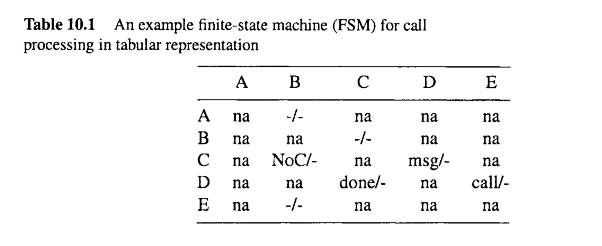
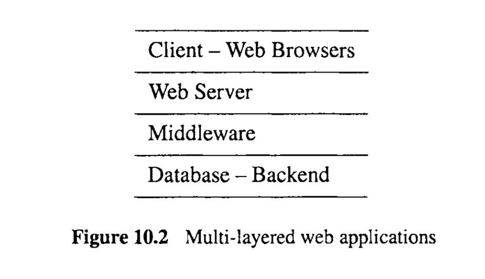
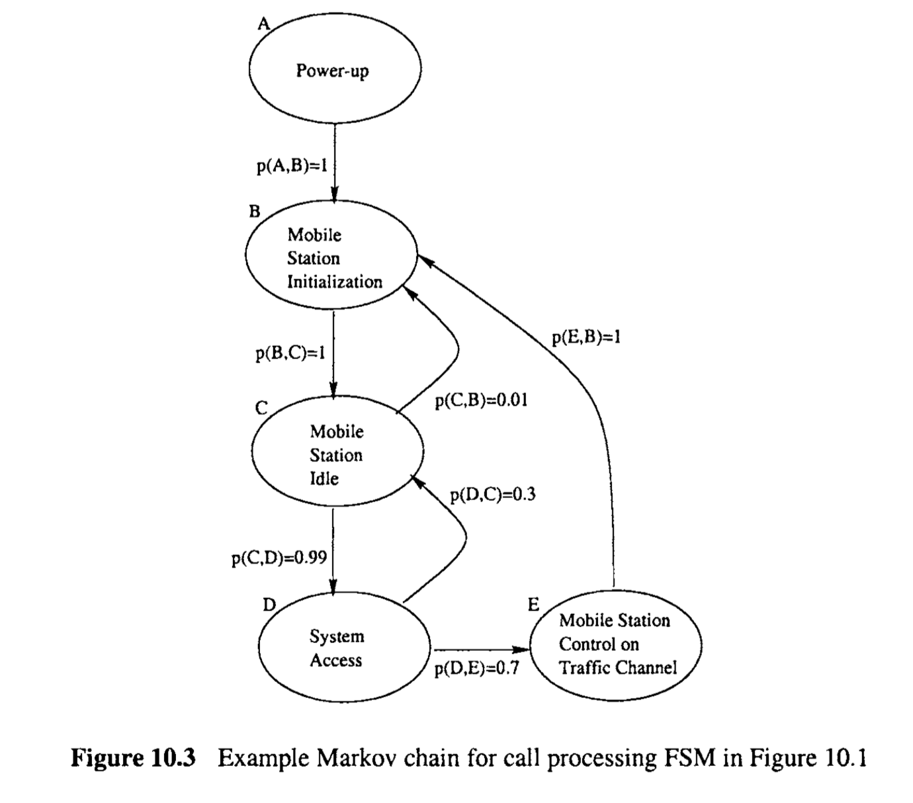
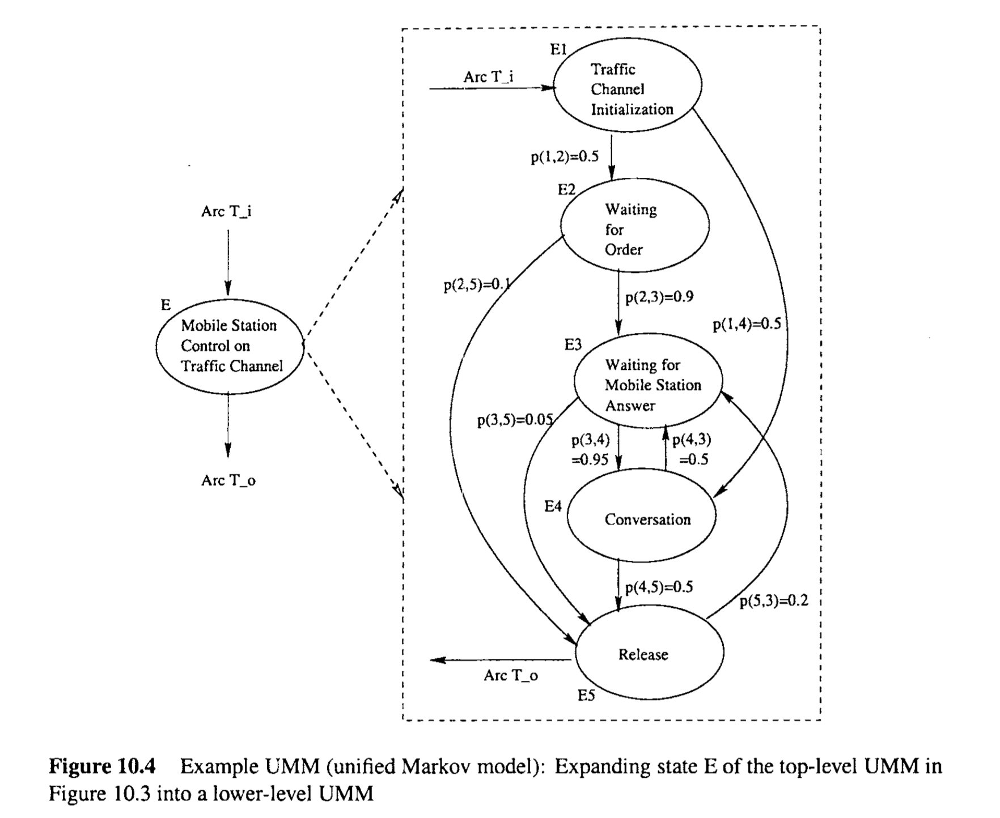
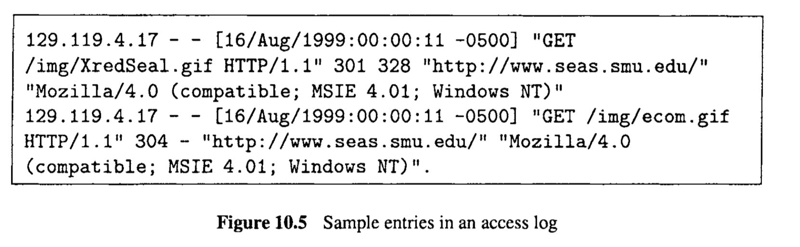

# Chapter 10 Coverage and Usage Testing Based on Finite-State Machines and Markov Chains

There are many limitations with the testing techniques based on simple models, such as checklists, partitions, and trees, described in the previous two chapters. Program execution details, interactions among different parts of programs, as well as detailed usage information cannot be adequately represented in such simple models for testing. In this chapter, we introduce finite-state machines (FSMs) as the basis for various testing techniques, in particular: 

* The basic concepts of FSMs are introduced in Section 10.1. 
* The direct use of FSMs in testing to cover the modeled states is described in Section 10.2. 
* A comprehensive case study to model web testing and web crawling using FSMs is presented in Section 10.3. 
* The enhancement of FSMs into Markov chains and Unified Markov Models (UMMs) as usage models is described in Section 10.4. 
* The usage based testing using Markov chains and UMMs is described in Section 10.5 
* A comprehensive case study of statistical web testing based on UMMs is presented in Section 10.6. 

As extensions to FSM-based testing that focus on interactions along execution paths and data dependencies, control flow and data flow testing techniques are covered in Chapter 11.

> 在前两章中描述的基于简单模型的测试技术，如清单、分区和树，存在许多限制。程序执行细节、程序不同部分之间的交互，以及详细的使用信息无法在这些简单模型中得到充分表示以用于测试。在本章中，我们介绍有限状态机（FSMs）作为各种测试技术的基础，特别是：
>
> - 第10.1节介绍FSMs的基本概念。
> - 第10.2节描述了直接使用FSMs进行测试以涵盖建模的状态。
> - 第10.3节展示了使用FSMs对网页测试和网页爬虫进行建模的全面案例研究。
> - 第10.4节描述了将FSMs增强为马尔可夫链和统一马尔可夫模型（UMMs）作为使用模型。
> - 第10.5节描述了使用马尔可夫链和UMMs的基于使用的测试。
> - 第10.6节展示了基于UMMs的统计网页测试的全面案例研究。
>
> 作为对FSM基础测试的扩展，关注执行路径和数据依赖的控制流和数据流测试技术将在第11章中覆盖。

## 10.1 FINITE-STATE MACHINES AND TESTING

The basic idea of FSMs is to use an intermediate formalism to model the program execution or behavior that strikes a balance between expressive power and simplicity (Chow, 1978). At one extreme, lists and partitions covered in the previous two chapters provide simple processing models that may not be expressive enough to represent complex program executions and behavior. On the other hand, the actual implementation, or the programs themselves, contains too much detail that needs to be abstracted into models so that specific aspects or features can be analyzed and tested. FSMs lie in between these two extremes and possess some flexibility in the level of details that can be modeled by the number of states, the number of links among them, and related input-output.

> 10.1 有限状态机与测试
>
> 有限状态机（FSMs）的基本思想是使用一种中间形式主义来模拟程序执行或行为，这种模拟在表达能力和简洁性之间寻找平衡（Chow, 1978）。在一个极端，前两章介绍的列表和分区提供了简单的处理模型，这些模型可能不足以表达复杂的程序执行和行为。另一方面，实际的实现或程序本身包含了太多需要被抽象成模型的细节，以便可以分析和测试特定的方面或特性。FSMs位于这两个极端之间，它们在可以通过状态数量、状态之间的链接数量及相关输入输出模拟的细节级别上具有一定的灵活性。

### 10.1.1 Overcoming Limitations of Simple Processing Models

The processing model used in the previous two chapters is a single stage one in the form of “input-process-output”. Both the input and the output are associated with this single stage of processing. We focused on the input in test model construction and test case sensitization, while implicitly assuming that the corresponding output can be obtained and checked through some oracle. As extensions to the single-stage processing model, we also introduced multi-stage ones such as the use of hierarchical lists, multi-dimensional lists, and tree-structured decision models. Some of the basic assumptions in those extensions include: 

* There is a finite number of stages or lists. 
* Each stage or list is unique, that is, no stage or list is a repetition of another. 
* The final choices made through multiple stages or lists are uniquely determined by the items in each list involved or by the choices made at every stage. 

Consequently, although multiple lists or multiple decision stages are involved, the final choices or complete operations can still be represented by a global one-level list or decision by collapsing the lists or stages. In the case of a tree-structured processing model that can represent both hierarchical lists and graphical operational profiles in Chapter 8, there is always a unique path from the root to each leaf node. The whole paths associated with these leaf nodes represent the series of decisions or stages of processing. Therefore all the information can be represented at the leaf node, as in Figure 8.2 in Chapter 8. In the case of multi-dimensional lists, each individual choice can be represented as a point in the multidimensional space, such as in Table 8.2 in Chapter 8. All these points can be enumerated as long as there are finite dimensions and finite choices for each dimension. 

However, we know in information processing, repetition or looping is a common way to handle various tasks, and the program behavior also shows repetition. It would be desirable under such situations to relax the unique stage or decision assumption above so that such repeated processing or behavior can also be modeled. This relaxation actually leads us to finite-state machines, if we do the following: 

* We simply replace the above decision points associated with individual lists or processing stages by states. 
* The selection of an individual list item or the processing decision can be replaced by a stage or state transition.
* Looping back to some list or stage is allowed from any state.

Such models can be formalized and used to precisely specify the behavior and interactions for many systems and components and serve as the basis for testing. In addition, many of the sub-operations within end-to-end operations specified in checklists or associated with partitions may be in common. The construction of FSMs could highlight these commonly used core sub-operations. The use of FSMs could lead to more effective testing by focusing on these core sub-operations and their connections to the rest of the system operations.  Similarly, more economical testing could also be achieved by avoiding the exact repetition of some of these common sub-operations.

> 10.1.1 克服简单处理模型的限制
>
> 在前两章中使用的处理模型是单阶段的，形式为“输入-处理-输出”。输入和输出都与这一单一阶段的处理相关联。我们专注于在测试模型构建和测试用例敏化中的输入，同时隐含地假设相应的输出可以通过某种预言机获得并检查。作为对单阶段处理模型的扩展，我们还介绍了多阶段的模型，如使用层次化列表、多维列表和树状决策模型。这些扩展中的一些基本假设包括：
>
> - 有一个有限数量的阶段或列表。
> - 每个阶段或列表是唯一的，即没有阶段或列表是另一个的重复。
> - 通过多个阶段或列表做出的最终选择由每个列表中的项目或在每个阶段做出的选择唯一确定。
>
> 因此，尽管涉及多个列表或多个决策阶段，最终选择或完整操作仍可通过折叠列表或阶段表示为全局单级列表或决策。在可以表示层次化列表和图形操作概况的树状处理模型的情况下，从根到每个叶节点总有一个唯一路径。这些叶节点关联的整个路径代表一系列决策或处理阶段。因此，所有信息可以在叶节点表示，如第8章中的图8.2所示。在多维列表的情况下，每个单独的选择可以表示为多维空间中的一个点，如第8章中的表8.2所示。只要每个维度的维数和选择是有限的，就可以枚举所有这些点。
>
> 然而，我们知道在信息处理中，重复或循环是处理各种任务的常见方法，程序行为也表现出重复。在这种情况下，放宽上述唯一阶段或决策假设，以便也可以对这种重复的处理或行为进行建模，将是可取的。这种放松实际上引导我们使用有限状态机，如果我们做以下操作：
>
> - 我们简单地将与个别列表或处理阶段相关联的上述决策点替换为状态。
> - 选择单个列表项或处理决策可以被替换为阶段或状态转换。
> - 允许从任何状态循环回某个列表或阶段。
>
> 这样的模型可以被正式化并用于精确指定许多系统和组件的行为和交互，并作为测试的基础。此外，在端到端操作中指定的许多子操作或与分区相关的子操作可能是共有的。构建FSMs可以突出这些常用的核心子操作。使用FSMs可以通过关注这些核心子操作及其与系统其余操作的连接来实现更有效的测试。同样，通过避免重复某些这些共有子操作的确切重复，也可以实现更经济的测试。

### 10.1.2 FSMs: Basic concepts and examples

Finite-state machines (FSMs) are standard models in the basic studies of computer science. 
There are four basic elements for FSMs, which can be grouped into two subsets: 

* Static elements: The subset of static elements includes states and state transitions. 
  The state transitions are often referred to as just transitions. The number of states is finite. By not allowing duplicate transitions from one state to another, that is, a direct transition from state A to state B can only follow a unique link labeled A-B, the number of state transitions is also finite. 

* Dynamic elements: The subset of dynamic elements includes the input provided to the FSMs and the output generated from the FSMs in dynamic executions of the FSMs. In general, both the number of different input and the number of different output are also finite. In the case that such input and output may take a large number or an infinite number of values, we generally need to group them into partitions, much like what we did in checklist and partition based testing in Chapter 8. These finite groups or partitions will correspond to transitions from one state to another. 
  Therefore, they form some special types of equivalence classes. 

At any time, the system can be in one state or in transition from one state to another. If we ignore the transition time, the system is in exactly one state at any time in what we call the “current” state. If the output and the next state are both uniquely determined by the current state and the input, we call it a “deterministic” FSM. We first deal with testing based on deterministic FSMs in this chapter, with non-deterministic or probabilistic FSMs used in Section 10.4 for usage-based testing. 

The FSMs and their elements are typically represented graphically. The main graphical elements include: 

* Each state is represented as a node in a graph. 
* Each transition is represented as a directed link from one state to another. 
* Input and output are associated with state transitions, and are represented as link weights or annotations by the transitions. 

The above representation is called the Mealy model (Mealy, 1955). An alternative model is to represent each output as a state, resulting in the so-called Moore model (Moore, 1956).  We use Mealy model in this book primarily for its simplicity in reducing the number of states.

So far, we have not directly dealt with the question: “What is represented by a state in FSMs?’. The answer depends on what we want to model. Most commonly, a state corresponds to some program execution state, or a specific time period or instance between certain actions. For example, consider the following execution sequence: 

* When a program starts, it is in the “initial” state. 

* After performing a user-oriented function (black-box view), or executing a statement or an internal procedure (white-box view), the program execution is transitioned to another state. 

* The above step can be repeated a number of times, with some of the states possibly repeated as well. 

* The state where program execution terminates is called the “final” state. 

* In each of the transitions, some input might be needed, and some output might be produced. 

  

In the above example, the states represent some abstraction of execution status or states, and most of the operations are associated with the links or state transitions. A concrete example familiar to almost everyone in modern society is the use of the world wide web (WWW or simply the web): Each web page a user is viewing can be considered a state. When we start a web browser, the default starting page or our customized starting page will be loaded, which corresponds to the initial state. Each time we follow a link in a page or specifically request a page through the use of bookmarWfavorite selections or by directly typing in a URL (universal resource locator, or the unique address for a specific web page), we start a transition to another web page. We can stop anytime by exiting the web browser, or implicitly by no longer requesting pages. This last page visited is then the final state. In this example of web usage, most of the operations such as requesting and loading a page, as well as the related error or other messages, are associated with the transitions. The FSM states are clearly visible to the users and represent the main purpose of using the web. 

Alternatively, various individual operations, functions, or tasks can be represented by the states, and the transitions merely indicate their logical connections or precedence relations. 
  For example, the flow-charts commonly used in product design, program implementation, and program analysis are examples of this type. We will see many examples of such FSMs when we discuss control flow testing in Chapter 11. 

In many applications, a mixture of the above two types of FSMs can be used as long as there is no confusion. A concrete example of FSM of this type is Figure 10.1 that depicts the states and state transitions for call processing in a cellular communication system (TIAEIA, 1994; Garg, 1999). Specific information includes: 

* Specific states related to different operations or system status are identified, for example, “Power-up”, “Mobile Station Initialization”, “Mobile Station Idle”, etc., and are identified by their labels A, B, C, D, E, respectively. 
* Some transitions are not associated with any input (null input) or output (null output). They simply follow after the completion of the task associated with the current state. In such cases, there is usually only one possible transition, because otherwise specific input or conditions will be needed to specify which allowable transition to take. For example, after state A (Power-up), the next state to follow is always B (MS Initialization). Similarly, after state D the next state to follow is always C (MS Idle); and state E (Mobile Station Control on Traffic Channel) is always followed by state B. In general, such transitions are not associated with any processing but only a logical relation between the states, just like “is-followed-by” relation in control flow graphs in Chapter 11.
* Other transitions in Figure 10.1 are associated with specific messages or conditions as input and some possible output. For example, the states to follow C (MS Idle) could be D (System Access), associated with receiving a paging channel message requiring response, originating a call, or performing registration. State B (MS Initialization) could also follow C for the condition that MS is unable to receive paging channel. Similarly, State D can be followed by state E (Mobile Station Control on Traffic Channel) if a call is originated, or followed by state B if other System Access tasks are completed.

> ### 10.1.2 FSMs: 基本概念和示例
>
> 有限状态机（FSMs）是计算机科学基础研究中的标准模型。 FSMs有四个基本要素，可以分为两个子集：
>
> - 静态元素：静态元素的子集包括状态和状态转换。状态转换通常简称为转换。状态的数量是有限的。不允许从一个状态到另一个状态的重复转换，即，从状态A到状态B的直接转换只能遵循一个唯一的标记为A-B的链接，状态转换的数量也是有限的。
> - 动态元素：动态元素的子集包括提供给FSMs的输入和FSMs在动态执行中生成的输出。一般来说，不同输入的数量和不同输出的数量也是有限的。在输入和输出可能取大量值或无限数量值的情况下，我们通常需要将它们分组到分区中，就像我们在第8章的清单和基于分区的测试中所做的那样。这些有限的组或分区将对应于从一个状态到另一个状态的转换。因此，它们形成了一些特殊类型的等价类。
>
> 在任何时候，系统可以处于一个状态，或从一个状态转换到另一个状态。如果我们忽略过渡时间，系统在任何时候都确切地处于一个我们称之为“当前”的状态。如果输出和下一个状态都唯一地由当前状态和输入确定，我们称它为“确定性”的FSM。我们首先在本章中处理基于确定性FSMs的测试，然后在第10.4节用于基于使用的测试中使用非确定性或概率性FSMs。
>
> FSMs及其元素通常以图形方式表示。主要的图形元素包括：
>
> - 每个状态表示为图中的一个节点。
> - 每个转换表示为从一个状态到另一个状态的有向链接。
> - 输入和输出与状态转换相关联，并以链接权重或转换旁的注释表示。
>
> 上述表示方法称为Mealy模型（Mealy，1955）。另一种模型是将每个输出表示为一个状态，从而得到所谓的Moore模型（Moore，1956）。我们在这本书中主要使用Mealy模型，因为它在减少状态数量方面的简单性。
>
> 到目前为止，我们还没有直接处理这个问题：“FSMs中的状态代表什么？”。答案取决于我们想要模拟什么。通常，一个状态对应于某个程序执行状态，或在某些动作之间的特定时间段或实例。例如，考虑以下执行序列：
>
> - 当程序开始时，它处于“初始”状态。
> - 在执行用户导向的功能（黑盒视图）或执行语句或内部程序（白盒视图）之后，程序执行转移到另一个状态。
> - 可以重复上述步骤多次，其中一些状态也可能重复。
> - 程序执行终止的状态称为“最终”状态。
> - 在每次转换中，可能需要一些输入，并且可能产生一些输出。
>
> 在上述示例中，状态代表了执行状态或状态的某种抽象，大多数操作与链接或状态转换相关联。一个对现代社会中几乎所有人都熟悉的具体示例是使用万维网（WWW或简称web）：用户正在查看的每个网页都可以被视为一个状态。当我们启动一个网页浏览器时，会加载默认的起始页面或我们自定义的起始页面，这对应于初始状态。每次我们在页面中跟随一个链接或通过使用书签/收藏选择或直接输入URL（统一资源定位器，或特定网页的唯一地址）特别请求一个页面时，我们开始转换到另一个网页。我们可以随时通过退出网页浏览器来停止，或者隐含地不再请求页面。然后，这最后访问的页面就是最终状态。在这个网页使用的例子中，大多数操作，如请求和加载页面以及相关的错误或其他消息，都与转换相关联。FSM状态对用户清晰可见，并代表了使用网页的主要目的。
>
> 或者，各种个别操作、功能或任务可以由状态表示，转换仅表示它们的逻辑连接或先行关系。例如，在产品设计、程序实现和程序分析中常用的流程图就是这种类型的示例。当我们在第11章讨论控制流测试时，我们将看到这种类型的FSMs的许多示例。
>
> 在许多应用中，只要不会造成混淆，可以使用上述两种类型的FSMs的混合物。这种类型FSM的一个具体示例是图10.1，它描绘了蜂窝通信系统中呼叫处理的状态和状态转换（TIAEIA，1994；Garg，1999）。具体信息包括：
>
> - 识别与不同操作或系统状态相关的特定状态，例如，“开机”、“移动站初始化”、“移动站空闲”等，并分别用它们的标签A、B、C、D、E标识。
> - 一些转换不与任何输入（空输入）或输出（空输出）相关联。它们仅在与当前状态关联的任务完成后跟随。在这种情况下，通常只有一种可能的转换，因为否则需要特定的输入或条件来指定哪种允许的转换。例如，在状态A（开机）之后，接下来要遵循的状态始终是B（MS初始化）。同样，在状态D之后接下来要遵循的状态始终是C（MS空闲）；状态E（移动站在交通频道上的控制）总是跟随状态B。一般来说，这样的转换不与任何处理相关，只是状态之间的逻辑关系，就像第11章控制流图中的“被跟随”的关系。
> - 图10.1中的其他转换与特定的消息或条件作为输入和一些可能的输出相关联。例如，跟随C（MS空闲）的状态可能是D（系统访问），与接收要求响应的寻呼频道消息、发起呼叫或执行注册相关联。状态B（MS初始化）也可能在MS无法接收寻呼频道的情况下跟随C。类似地，如果发起呼叫，状态D可以被状态E（移动站在交通频道上的控制）跟随，或者如果完成了其他系统访问任务，则可以被状态B跟随。

### 10.1.3 Representations of FSMs

The most intuitive and most straightforward way to represent FSMs is to use graphical means, such as in Figure 10.1. As we know from graph theory (Deo, 1974), such graphs can also be formally specified as a set of states, a set of allowable state transitions, and associated input/output. For example, the set of states corresponding to Figure 10.1 is {A, B, C, D, E}. The transition from C to B is represented as {C, B, “unable to receive paging channel”, -}, with input as specified by the third element and null output (-). The set of state transitions and input/output includes this and other similar items as its elements.

Although the graphical representation is intuitive and easy to interpret by human subjects, it becomes impractical when the number of states becomes large. When we have more than 20 or 30 states, the drawing will become messy and hard to trace. Consequently, tabular representation (also called matrix representation) is often used, which is easy for computer to process as well. For example Figure 10.1 can be represented by Table 10.1 that can be interpreted as follows:

* The states are listed as both the rows and columns.
* The rows represent originating states and the columns represent ending states for specific transitions.
* If a transition from state X (row X) to state Y (column Y) is allowed, then the corresponding cell (row X, column Y) is marked by its input and output. A null input or a null output is marked by “-”. For the specific input conditions or messages in Table 10.1, we used shorthands msg , NoC , c a l l ,  and done to represent “paging channel message”, “unable to receive paging channel”, “making a call”, and “finished with other tasks”, respectively.
* If a cell is marked with “na” or not marked (left empty), the corresponding transition is not allowed.

As we can see, the tabular representation is systematic, regular (an N x N table), and not too hard to interpret. Therefore, it is used quite commonly to represent FSMs. The regularity makes computation and analysis based on tabular FSMs easy to perform. 

However, when there are many empty cells, we end up wasting a lot of memory space to store the N x N table. Consequently, a third commonly used representation, what we call the list representation, is directly based on the formal specification for the graphs in graph theory formalisms (Deo, 1974). Basically, the set of states is represented by a list; and the set of allowable state transitions is also represented by a list, with its elements in the form of {C, B, “unable to receive paging channel”, -} that we mentioned above. The list representation is more compact but less regular. The comparison between the list and tabular representations is similar to the comparison between the list and 2-dimensional array data structures in computing and information processing: The trade off is between storage savings for lists and faster indexed access for arrays. 

All three types of representations of FSMs, graphical, tabular, and list, are commonly used in testing literature. Therefore, the readers should become familiar with all three, possibly through some additional exercises interpreting and converting among them. In what follows, we primarily use graphical representation to make it easy to present and illustrate the basic ideas and techniques.

> ### 10.1.3 FSM的表示方法
>
> 表示FSMs最直观、最简单的方法是使用图形手段，如图10.1所示。正如我们从图论（Deo, 1974）中知道的，这样的图也可以被正式指定为一组状态、一组允许的状态转换和相关的输入/输出。例如，对应图10.1的状态集是{A, B, C, D, E}。从C到B的转换表示为{C, B, "无法接收寻呼频道", -}，输入由第三个元素指定，输出为空（-）。状态转换和输入/输出的集合包括这些和其他类似项作为其元素。
>
> 虽然图形表示直观且易于被人理解，但当状态数量变大时它变得不切实际。当我们有超过20个或30个状态时，图形将变得混乱且难以追踪。因此，通常使用表格表示法（也称为矩阵表示法），这对计算机来说也容易处理。例如，图10.1可以由表10.1表示，其解释如下：
>
> - 状态列在行和列中。
> - 行表示特定转换的起始状态，列表示结束状态。
> - 如果允许从状态X（行X）到状态Y（列Y）的转换，则相应的单元格（行X，列Y）标记为其输入和输出。空输入或空输出用“-”标记。对于表10.1中的特定输入条件或消息，我们使用缩写msg，NoC，call和done来分别代表“寻呼频道消息”，“无法接收寻呼频道”，“正在通话”，和“完成其他任务”。
> - 如果一个单元格标记为“na”或未标记（留空），则不允许相应的转换。
>
> 如我们所见，表格表示法是系统的、规则的（一个N x N表），且不太难解释。因此，它常用于表示FSMs。规则性使得基于表格FSMs的计算和分析易于执行。
>
> 然而，当有许多空单元格时，我们最终浪费了大量的内存空间来存储N x N表。因此，第三种常用的表示方法，我们称之为列表表示法，直接基于图论形式中图的正式规范（Deo, 1974）。基本上，状态集由一个列表表示；允许的状态转换集也由一个列表表示，其元素的形式为我们上面提到的{C, B, "无法接收寻呼频道", -}。列表表示法更紧凑但不太规则。列表与表格表示法之间的比较类似于在计算和信息处理中列表与二维数组数据结构之间的比较：折中是列表的存储节省与数组的更快索引访问之间的权衡。
>
> 所有三种类型的FSMs表示方法——图形、表格和列表——都常用于测试文献。因此，读者应该熟悉所有这三种方法，可能还需要通过一些额外的练习来解释和转换它们。在下文中，我们主要使用图形表示法，以便易于呈现和说明基本概念和技术。

## 10.2 FSM TESTING: STATE AND TRlANSlTlON COVERAGE

We next examine the basic FSM-based testing that attempts to achieve basic coverage of states and transitions as the basic elements of FSMs, and using related input and output for test sensitization and result checking.

> 10.2 FSM测试：状态和转换覆盖
>
> 接下来，我们将检查基于FSM的基本测试，它试图实现对FSMs基本元素的状态和转换的基本覆盖，并使用相关的输入和输出进行测试敏化和结果检查。

### 10.2.1 Some typical problems with systems modeled by FSMs

As mentioned above, FSMs can be used to model either external system behavior (blackbox view) or detailed execution of specific implementations (white-box view). In either view, we can consider the four basic elements, namely, states, transitions, input, and output, to examine possible and likely problems of systems modeled by FSMs, as follows:

* State problems: missing, extra, or incorrect states:
  * An incorrect state is one with ill-defined behavior. 
  * A missing state corresponds to one that has a valid current state and input but the next state is missing. A special case of the missing state is that the system with unspecified initial state. 
  * Extra state may be related to unreachable state or dead state, where there is no path from any initial state to it through a number of state transitions. Multiple next states for the same input may also be linked to some extra states. In this case, the current state is also an incorrect state because its behavior is ill-defined.

* Transition problems: missing, extra, or incorrect transitions;
  * A missing transition is one that corresponds to a valid current state and input but the next state is missing or not specified.
  * An extra transition is associated with multiple transitions for the same current state and input. 
  * An incorrect transition is a transition to an unexpected state or one that produces state is missing or not specified unexpected output.

* Input problems: In FSM-based testihg, we typically treat input problems as part of state or transition problems, assuming that all input needs to be handled correctly through some state transitions by the FSM. As a general extension, even invalid input is expected to be handled correctly without causing system crash or other problems, such as through the following means: 

  * ignoring invalid input, such as staying in the same state for invalid input. 

  - direct handling of invalid input, such as outputting some error message and going through some exception handling and related state transitions

* Output problems: We do not typically deal with output problems directly, but rather as part of the test oracle problem in state transitions. For example, if a state transition produces unexpected output, such as missing, extra, or incorrect output, we identify the transition as an incorrect transition.

Therefore, in FSM-based testing, we focus on state and transition problems. Input is primarily used for test sensitization, and output is primarily used for result checking.

> ###  10.2.1 由FSM建模的系统的一些典型问题
>
> 如上所述，FSMs可以用来建模外部系统行为（黑箱视图）或特定实现的详细执行（白箱视图）。在任一视图中，我们可以考虑四个基本元素，即状态、转换、输入和输出，来检查由FSM建模的系统可能存在的问题，如下所示：
>
> - 状态问题：缺失、多余或错误的状态：
>
>   - 错误的状态是指行为定义不良的状态。
>   - 缺失的状态对应于有一个有效的当前状态和输入，但下一个状态缺失的情况。缺失状态的一个特殊情况是系统的初始状态未指定。
>   - 多余的状态可能与无法到达的状态或死状态相关，即从任何初始状态通过若干个状态转换都无法到达它的路径。同一输入对应多个下一个状态也可能与一些多余的状态相关。在这种情况下，当前状态也是一个错误的状态，因为其行为定义不良。
>
> - 转换问题：缺失、多余或错误的转换；
>
>   - 缺失的转换是指对应于有效的当前状态和输入，但下一个状态缺失或未指定的转换。
>   - 多余的转换与同一当前状态和输入的多个转换相关联。
>   - 错误的转换是指向一个意外的状态或产生意外输出的转换。
>
> - 输入问题：在基于FSM的测试中，我们通常将输入问题视为状态或转换问题的一部分，假设所有输入都需要通过FSM的某些状态转换正确处理。作为一般性扩展，甚至预期无效输入也能被正确处理，而不会引起系统崩溃或其他问题，例如通过以下方式：
>
>   - 忽略无效输入，如对无效输入保持在相同状态。
>
>   - 直接处理无效输入，如输出某些错误消息并进行一些异常处理和相关状态转换。
>
> - 输出问题：我们通常不直接处理输出问题，而是作为状态转换中的测试预言机问题的一部分。例如，如果一个状态转换产生了意外的输出，如缺失、多余或错误的输出，我们将该转换标识为一个错误的转换。
>
> 因此，在基于FSM的测试中，我们关注的是状态和转换问题。输入主要用于测试敏化，输出主要用于结果检查。

### 10.2.2 Model construction and checking for missing or extra states or transitions

During model construction, all the basic elements of the FSMs need to be identified, including states, transitions, input, and output. Following the generic steps for test model construction in the test preparation activities we outlined in Chapter 7, some self-checking or model validation is usually needed to make sure the model reflects reality. Therefore, checking for missing or extra states or transitions is usually carried out as part of the model construction process, in particular, as part of model validation step in this process.

Instantiating and expanding the generic steps for model construction we described in Chapter 7, we can construct FSMs and validate them in the following steps:

* Step 1. Information source identification and data collection: Depending on whether external functional behavior is modeled (black-box view) or internal program execution states are modeled (white-box view) in FSMs, we can identify different sources of information. In the former case, the information sources include external product specification or expected usage scenarios. They represent functional and logical relations between different subsets of operations and interfaces. In the latter case, internal product information, such as structure and connections of the implemented components in product design documents and the program code can be used for model construction. For many existing products, existing test cases and checklists can also be used as an important source of information. The sub-operations need to be extracted from such existing sources and linked together to form FSMs.

* Step 2. Construction of  initial FSMs based on the information sources identified in Step 1 above: We next consider the four basic elements, namely, states, transitions, input, and output, to construct the initial FSMs. Some of the elements are considered together for convenience in the following steps: 

  * Step 2.1. State identification and enumeration: We need to keep the number of states to a manageable level, ranging from a handful to a few dozens, but not thousands. In cases where the real system needs to be represented by a large number of states, we can use nested or hierarchical FSMs, as we will describe in further detail in model refinement below. 

  - Step 2.2. Transition identification with the help o f  input values: For each state, we can consider all the possible transitions in connection with all the possible input values. As mentioned in Section 10.1, when the number of possible input values is large or infinite, we can use input partitions to help identify specific transitions. These partitions represent equivalence classes defined with respect to the state transitions to be taken. Another side effect of this step is to identify some missing states from Step 2.1 above, where some transitions lead to states other than those already identified above. 
  - Step 2.3. Identifying input-output relations related to individual transitions. 
  This output will be used as part of the test oracle to check the testing results.

* Step 3. Model refinement and validation: This step includes two interconnected activities. In the process of validating the initial FSM, new states and/or new transitions might be identified, resulting in the refinement of the FSM. However, as we mentioned above, this process cannot be carried to excess, to include too many states and transitions in the FSM. Consequently, when large numbers of states and transitions need to be represented in a model, we typically use nested or hierarchical FSMs, with some of the specific states in the higher-level FSMs expandable to lower-level FSMs. This issue is examined further at the end of this section. We can also check the information sources to identify missing or extra states or transitions as part of the model validation exercise. This issue is elaborated below.

The basic idea for identifying missing states or transitions is similar to checklist- and partition-based testing. For example, a checklist based on product functional specifications can be used to directly check the missing states or transitions. However, such functional specifications usually correspond to high-level states and state transitions, which need to be refined to the same level of the states and transitions captured by the FSMs. For lower-level FSMs, product design information and documents, or program code, can usually be used to help identify missing states or transitions.

Checking for extra states and transitions can follow essentially the same procedure by cross-validating them with the information sources. However, this checking is typically more difficult than identifying missing ones, similar to the situation that requires product requirement traceability: If every state and every transition can be traced back to the corresponding information sources for their creation, this checking can be done easily. However, one should not expect complete documentation associated with every state or transition to be included in the FSMs. This fact makes it hard to identify extra states and transitions if we don’t know what led to their creation in the first place. As an alternative to this procedure of checking for extra states or transitions, we can perform reachability analysis to identify individual unreachable states or clusters of unreachable states. Usually, these unreachable states or clusters represent extra states or some other problems. The reachability analysis algorithms from graph theory (Deo, 1974, Knuth, 1973) and related tools can be used to perform such analyses. 

In addition to the above methods of checking the missing or extra states and transitions, sometimes, they can also be checked together with incorrect ones. To actually test the states and transitions, we need to start from an initial state or from an intermediate current state saved in some means, and then follow a series of transitions to test the correct state that we try to reach and the correct transitions we try to follow.

> ###  10.2.2 模型构建和检查缺失或多余的状态或转换
>
> 在模型构建过程中，需要识别FSMs的所有基本元素，包括状态、转换、输入和输出。按照我们在第7章中概述的测试准备活动中的通用测试模型构建步骤，通常需要进行一些自检或模型验证，以确保模型反映了现实。因此，检查缺失或多余的状态或转换通常作为模型构建过程的一部分进行，特别是作为该过程中模型验证步骤的一部分。
>
> 将我们在第7章中描述的模型构建的通用步骤具体化和扩展，我们可以通过以下步骤构建FSMs并验证它们：
>
> - 步骤1. 信息来源识别和数据收集：根据FSMs中是建模外部功能行为（黑盒视图）还是内部程序执行状态（白盒视图），我们可以识别不同的信息来源。在前者的情况下，信息来源包括外部产品规范或预期使用场景。它们代表了不同操作子集和接口之间的功能和逻辑关系。在后者的情况下，内部产品信息，如产品设计文档和程序代码中实现的组件的结构和连接，可以用于模型构建。对于许多现有产品，现有的测试用例和清单也可以作为一个重要的信息来源。需要从这些现有来源中提取子操作并连接起来形成FSMs。
>
> - 步骤2. 基于步骤1中识别的信息来源构建初始FSMs：接下来考虑四个基本元素，即状态、转换、输入和输出，来构建初始FSMs。为了方便起见，在接下来的步骤中，一些元素被一起考虑：
>
>   - 步骤2.1. 状态识别和枚举：我们需要保持状态的数量在一个可管理的水平，从少数几个到几十个，而不是成千上万。在需要用大量状态表示实际系统的情况下，我们可以使用嵌套或层次FSMs，我们将在下面的模型细化中进一步详细描述。
>
>   - 步骤2.2. 帮助输入值的转换识别：对于每个状态，我们可以考虑所有可能的转换与所有可能的输入值的连接。如第10.1节所述，当可能的输入值数量很大或无限时，我们可以使用输入分区来帮助识别特定的转换。这些分区代表了相对于要采取的状态转换定义的等价类。这个步骤的另一个副作用是识别出步骤2.1中的一些缺失状态，其中一些转换导致了除上述已识别状态以外的其他状态。
>   - 步骤2.3. 识别与单个转换相关的输入输出关系。 这个输出将作为测试预言机的一部分用于检查测试结果。
>
> - 步骤3. 模型细化和验证：这一步包括两个相互关联的活动。在验证初始FSM的过程中，可能会识别出新的状态和/或新的转换，从而细化FSM。然而，如我们上面提到的，这个过程不能过度进行，包含太多的状态和转换在FSM中。因此，当需要在模型中表示大量的状态和转换时，我们通常使用嵌套或层次FSMs，其中一些特定的高层FSMs中的状态可以扩展到低层FSMs。这个问题将在本节末尾进一步检查。我们还可以检查信息来源以识别缺失或多余的状态或转换作为模型验证练习的一部分。这个问题下面将详细阐述。
>
> 识别缺失状态或转换的基本思想类似于基于清单和分区的测试。例如，基于产品功能规范的清单可以用来直接检查缺失的状态或转换。然而，这样的功能规范通常对应于高层状态和状态转换，需要细化到与FSMs捕获的状态和转换相同的层级。对于低层FSMs，产品设计信息和文档或程序代码通常可以用来帮助识别缺失的状态或转换。
>
> 检查多余的状态和转换可以基本上遵循相同的程序，通过与信息来源交叉验证。然而，这种检查通常比识别缺失的状态更困难，类似于需要产品需求可追溯性的情况：如果每个状态和每个转换都可以追溯到它们创建的相应信息来源，这种检查就可以容易地完成。然而，不应期望FSMs中包含与每个状态或转换相关的完整文档。这一事实使得如果我们不知道最初是什么导致它们的创建，就很难识别出多余的状态和转换。作为检查多余状态或转换的替代方法，我们可以进行可达性分析以识别个别不可达的状态或不可达状态的集群。通常，这些不可达的状态或集群代表了多余的状态或一些其他问题。可以使用图论（Deo, 1974，Knuth, 1973）和相关工具的可达性分析算法来进行此类分析。
>
> 除了上述检查缺失或多余状态和转换的方法，有时它们也可以与错误的状态一起检查。要实际测试状态和转换，我们需要从一个初始状态开始或从某种方式保存的中间当前状态开始，然后遵循一系列转换来测试我们试图到达的正确状态和我们试图遵循的正确转换。

### 10.2.3 Testing for correct states and transitions

The general testing based on FSMs and the. particular checking of correct states and correct transitions can be treated as two separate problems: 

* State or node coverage: We need to make sure that each state can be reached and visited by some test cases. This is essentially a state or node traversal problem in graph theory (Deo, 1974; Knuth, 1973). Consequently, various graph node traversal algorithms can be used to help us with the development of test cases. 
* Transition or link coverage: We need to make sure that each link or state transition is covered by some test cases. Although this problem can also be treated as link traversal in graph theory, the above. state coverage testing already helped us reach each reachable states. It would be more economical to combine the visit to these states with the possible input values to cover all the links or transitions originated from this current state.

In trying to reach a specific state, each test case is essentially a series of input values that enables us to make the transitions from an initial state to some target state, possibly through multiple hops by way of some intermediate states. It is possible that one test case could potentially enable us to visit all the states thus achieving complete state coverage.  However, we need multiple test cases under most circumstances because there might be multiple initial states, multiple final states, and multiple sequences of transitions leading from an initial state to a specific state. In most systems modeled by FSMs, the initial states are the ones without incoming links and the final states are the ones without outgoing links. Under such circumstances, whenever multiple initial or final states exist, we would need at least as many test cases, and most likely much more.

From the current state, the next state to visit is determined by the input. Therefore, this one-step state transition can be viewed as first classifying the input into equivalence classes and then follow a specific transition according to the classification. With our knowledge for checklist- and partition-based testing in Chapter 8 and its special cases of input domain boundary testing in Chapter 9, we can easily perform link coverage starting from each state that we can reach. The one-step “classify-and-process” model from the current state to the next state fits perfectly with the processing model we used for those testing techniques. 

All the input variables and associated values, as well as input domain partitioning in correspondence to the specific transitions to take, can be examined to derive our test cases as described in those chapters. 
Test case sensitization for FSM-based testing is fairly easy and straightforward. For each test case of state coverage, we have a specific initial state and a series of state transitions to lead to a target state. Since each transition is associated with specific input values, we can simply select such input values to sensitize the test case. The key in this sensitization is to remember that in FSM-modeled systems, input and output are associated with individual transitions instead of as an indistinguishable lump of initial input for many other systems. Consequently, the input sequencing is as important as correct values for the specific input.

For link coverage, the testing we described above is essentially the same as partition based input domain testing. We can follow the corresponding techniques to achieve partition coverage, or if necessary, to test the boundary conditions related to these partitions. The test sensitization issues are also the same as in those testing techniques described in Chapters 8 and 9. 

One useful capability for test execution is the ability to save some “current state” that can be restored when we start testing. This would significantly shorten the series of state transitions needed to reach a target state, which may be important because in some systems these transitions may take a long time. This capability is especially useful for link coverage testing starting from a specific state: If we can start from this saved state, we can go directly into link coverage testing without waiting for the state transitions to reach this state from a specific initial state. 

The result checking is similarly easy and straightforward, since the output for each transition is also specified in FSMs in addition to the next state. The key to this result checking is to make sure that both the next state and the output are checked.

> ###  10.2.3 测试正确的状态和转换
>
> 基于FSMs的通用测试和特定的正确状态和转换检查可以被视为两个独立的问题：
>
> - 状态或节点覆盖：我们需要确保每个状态都可以通过一些测试用例到达和访问。这本质上是图论中的状态或节点遍历问题（Deo, 1974; Knuth, 1973）。因此，各种图节点遍历算法可以帮助我们开发测试用例。
> - 转换或链接覆盖：我们需要确保每个链接或状态转换都被一些测试用例覆盖。尽管这个问题也可以被视为图论中的链接遍历，但上述状态覆盖测试已经帮助我们到达了每个可达状态。将访问这些状态与可能的输入值相结合以覆盖从这个当前状态开始的所有链接或转换会更经济。
>
> 在尝试到达特定状态时，每个测试用例本质上是一系列输入值，使我们能够从初始状态通过一些中间状态进行多次跳转到达目标状态。理论上，一个测试用例可能使我们访问所有状态，从而实现完全的状态覆盖。然而，在大多数情况下，我们需要多个测试用例，因为可能有多个初始状态、多个最终状态，以及多个从初始状态到特定状态的转换序列。在大多数由FSMs建模的系统中，初始状态是没有传入链接的状态，而最终状态是没有传出链接的状态。在这种情况下，只要存在多个初始或最终状态，我们就至少需要相同数量的测试用例，而且很可能需要更多。
>
> 从当前状态出发，下一个要访问的状态由输入决定。因此，这一步的状态转换可以视为首先将输入分类到等价类中，然后根据分类执行特定转换。根据我们在第8章中对清单和分区基础测试的了解及其在第9章中的输入域边界测试的特殊情况，我们可以轻松执行从每个可达状态开始的链接覆盖。从当前状态到下一个状态的一步“分类和处理”模型与我们对这些测试技术使用的处理模型完美吻合。
>
> 所有输入变量和关联值，以及与特定转换相对应的输入域分区，都可以根据那些章节中描述的来审查以得出我们的测试用例。 基于FSM的测试用例敏化相对简单直接。对于每个状态覆盖的测试用例，我们有一个特定的初始状态和一系列状态转换来引导到目标状态。由于每个转换都与特定的输入值相关联，我们可以简单地选择这样的输入值来敏化测试用例。在这种敏化中要记住的关键是，在FSM建模的系统中，输入和输出与个别转换相关联，而不是与许多其他系统中的不可区分的初始输入堆
>
> 成一块。因此，输入的顺序与特定输入的正确值一样重要。
>
> 对于链接覆盖，上述描述的测试本质上与基于分区的输入域测试相同。我们可以遵循相应的技术来实现分区覆盖，或者在必要时，测试与这些分区相关的边界条件。测试敏化问题也与第8章和第9章中描述的那些测试技术相同。
>
> 执行测试时的一个有用能力是能够保存某个“当前状态”，以便在我们开始测试时恢复。这会显著缩短到达目标状态所需的一系列状态转换，这可能很重要，因为在某些系统中这些转换可能需要很长时间。这项能力对于从特定状态开始的链接覆盖测试特别有用：如果我们可以从这个保存的状态开始，我们可以直接进入链接覆盖测试，而不必等待从一个特定初始状态到达这个状态的状态转换。
>
> 结果检查同样容易且直接，因为在FSMs中，除了下一个状态外，每个转换的输出也被指定了。这个结果检查的关键是确保检查了下一个状态和输出。

### 10.2.4 Applications and limitations

The most common application domain for FSM-based testing is the menu-driven software, where each menu demands some input and produces some output that is often accompanied by a new menu. This situation with interactive input is also different from various more autonomous systems where mostly an initial set of input is required but little or no interaction with the user is needed. A special case of menu-driven software is the use of the web that we will examine in more detail in Section 10.3. 

FSM-based testing is generally suitable for systems with clearly identifiable states and state transitions. The situation covers various real-time systems, control systems, and systems that operate continuously. In many of these systems, it is more common to relate various system properties, such as status, controllability, safety, etc., to the current system states than to the beginning or end of systems operations. Related protocols for such systems can also be easily specified as FSMs and tested accordingly. Our example of call processing given in Figure 10.1 is an example of such a systems. 

Another area where FSM-based testing has received significant attention is the testing of object-oriented software and systems (00s). Object-state testing typically resembles FSM testing, with some specific customization (Binder, 2000; Kung et al., 1998). There are various other application domains, such as device drivers, software for installation, backup and recovery, and software that replaces certain hardware (Beizer, 1995). 

The primary limitation of FSM-based testing is its inability to handle large number of states. Although nested or hierarchical FSMs can help alleviate the problems, they have their own limitations in assuming clear-cut hierarchies: In lower-level models, we general assume a common source and common sink as its interface with higher-level models. However, the interactions may well be cutting through hierarchy boundaries in real systems. For large software products, the complete coverage of all these hierarchical FSMs would still be impractical because of the size as well as the generally uneven distribution of problems and usage frequencies in different areas and product components. Selective testing focused on highly used operations or product components can be supported by extending FSMs with usage information to form Markov chains and using them for statistical usage-based testing, as we describe in Section 10.4.

> ### 10.2.4 应用及局限性
>
> 基于FSM的测试最常见的应用领域是菜单驱动的软件，在这种软件中，每个菜单需要一些输入，并产生一些输出，这通常伴随着一个新菜单的产生。这种具有交互式输入的情况也不同于那些更多的自主系统，这些系统主要需要一组初始输入，但几乎不需要或不需要与用户的互动。菜单驱动软件的一个特殊案例是使用Web，我们将在10.3节中更详细地检查这一点。
>
> 基于FSM的测试通常适用于具有清晰可识别状态和状态转换的系统。这种情况涵盖了各种实时系统、控制系统和持续运行的系统。在许多这样的系统中，将各种系统属性，如状态、可控性、安全性等，与当前系统状态关联起来比与系统操作的开始或结束关联更为常见。这些系统的相关协议也可以轻松地被指定为FSMs并相应地进行测试。图10.1中给出的呼叫处理示例就是这样一个系统的例子。
>
> 另一个基于FSM的测试受到重视的领域是面向对象软件和系统（OOs）的测试。对象状态测试通常类似于FSM测试，但有一些特定的定制（Binder, 2000; Kung et al., 1998）。还有其他各种应用领域，例如设备驱动程序、安装、备份和恢复的软件，以及替代某些硬件的软件（Beizer, 1995）。
>
> 基于FSM的测试的主要局限性是它无法处理大量的状态。尽管嵌套或层次FSM可以帮助缓解问题，但它们在假设明确的层次结构方面有自己的局限性：在较低层次的模型中，我们通常假定有一个公共源和公共汇作为其与高层模型的接口。然而，在实际系统中，交互可能会穿越层次结构的边界。对于大型软件产品，由于大小以及不同区域和产品组件中问题和使用频率的普遍不均匀分布，完全覆盖所有这些层次化FSM仍然是不切实际的。通过将FSM扩展到带有使用信息的马尔可夫链，并使用它们进行统计基于使用的测试，可以支持针对高使用率操作或产品组件的选择性测试，我们将在10.4节中描述这一点。

## 10.3 CASE STUDY: FSM-BASED TIESTING OF WEB-BASED APPLICATIONS

Web-based applications provide cross-platform universal access to web resources for the massive user population. With the prevalence of the world wide web (WWW), testing and quality assurance for the web is becoming increasingly important. We next examine the characteristics of the web and discuss the use of FSM-models for web testing.

> 10.3 案例研究：基于FSM的Web应用测试
>
> Web应用为庞大的用户群提供了跨平台的通用访问Web资源的能力。随着全球信息网（WWW）的普及，Web的测试和质量保证变得越来越重要。我们接下来将审查Web的特点，并讨论使用FSM模型进行Web测试。

### 10.3.1 Characteristics of web-based applications

Web applications possess various unique characteristics that affect the choices of appropriate techniques for web testing. One of the fundamental differences is the document and information focus for the web as compared to the computational focus for most traditional software. Although some computational capability has evolved in newer web applications, document and information search and retrieval still remain the dominant usage for most web users. In addition, navigational facility is a central part of web-based applications, with the most commonly used HTML (hyper-text markup language) documents play a central role in providing both information and navigational links. In this respect, web-based applications resemble many menu-driven software products. However, there are also some significant differences, as follows:

* Traditional menu-driven software still focuses on some computation; while webbased applications focus on information and documents.

  

* Traditional menu-driven software usually separates its navigation from its computation; while the two are tightly mingled for web-based applications.
* In traditional menu-driven software, there is usually a single top menu that serves as the entry point; while for web-based applications, potentially any web page or web content can be the starting point. These entry or starting points typically correspond to initial states in an FSM. Similar differences exist for the end points or final states, with traditional menu-driven software having limited exits while web-based applications typically can end at any point when the user chooses to exit the web browser or stop web browsing activities.
* Another significant difference is the qualitative difference in the huge number of navigational pages of web-based applications even for moderately sized web sites and the limited number of menus for all traditional menu-driven applications.
* Web-based applications typically involve much more diverse support facilities than traditional menu-driven software. Web functionalities are typically distributed across multiple layers and subsystems as illustrated in Figure 10.2. We need to make sure all these functionalities and related components work well together, to eliminate failure sources or to reduce failure chances.

Similar to general testing, testing for web applications focuses on the prevention of web failures or the reduction of chances for such failures. Therefore, we need to examine the common problems and associated concepts such as web failures, faults, and errors, before we can proceed with the selection of appropriate testing techniques to identify and remove these problems and problems sources.

> ###  10.3.1 基于Web的应用程序的特点
>
> Web应用程序具有多种独特的特征，这些特征影响了选择适合Web测试的技术。一个基本区别是，与大多数传统软件的计算重点相比，Web更注重文档和信息。尽管新型Web应用程序已经发展出一些计算能力，但文档和信息的搜索与检索仍然是大多数Web用户的主要使用方式。此外，导航功能是基于Web应用程序的核心部分，最常用的HTML（超文本标记语言）文档在提供信息和导航链接方面起着中心作用。在这方面，基于Web的应用程序类似于许多菜单驱动的软件产品。然而，也存在一些显著的差异，如下所示：
>
> - 传统的菜单驱动软件仍然关注于某些计算；而基于Web的应用程序则关注于信息和文档。
> - 传统的菜单驱动软件通常将其导航与计算分开；而这两者对于基于Web的应用程序则紧密交织在一起。
> - 在传统的菜单驱动软件中，通常有一个单一的顶级菜单作为入口点；而对于基于Web的应用程序，任何Web页面或Web内容都可能是起点。这些入口或起点通常对应于FSM中的初始状态。对于结束点或最终状态，也存在类似的差异，传统的菜单驱动软件有限的退出方式，而基于Web的应用程序通常可以在用户选择退出Web浏览器或停止Web浏览活动时在任何点结束。
> - 另一个显著的区别是即使是中等大小的网站，基于Web的应用程序的庞大数量的导航页面和所有传统菜单驱动应用程序的有限数量菜单之间的质的差异。
> - 基于Web的应用程序通常涉及比传统菜单驱动软件更多样化的支持设施。Web功能通常分布在多个层次和子系统中，如图10.2所示。我们需要确保所有这些功能和相关组件能够很好地协同工作，以消除故障源或减少故障机会。
>
> 与一般测试类似，Web应用程序的测试侧重于预防Web故障或减少此类故障的机会。因此，我们需要在选择适当的测试技术来识别和消除这些问题和问题来源之前，先检查常见的问题和相关概念，如Web故障、错误和缺陷。

### 10.3.2 What to test: Characteristics of  web problems

We define web failures as inability to correctly deliver information or documents required by web users. This definition also conforms to the standard definition of failures as the behavioral deviations from user expectations (correct delivery expected by web users) we outlined in Chapter 2. Based on this definition, we can consider the following failure sources: 

* Host or network failures: Hardware or systems failures at the destination host or home host, as well as network failures, may lead to web failures. These failures are mostly linked to middleware and web server layers in Figure 10.2. However, such failures are no different from the regular system or network failures, and can be analyzed by existing techniques.
* Browser failures: Browser failures are linked to problems at the highest layer in Figure 10.2 on the client side. These failures can be treated the same way as software product failures, thus existing techniques for software testing can be used.
* Source or content failures: Web failures can also be caused by the information source itself at the server side, associated with the lowest layer in Figure 10.2.

In addition, user errors may also cause problems, which can be addressed through user education, better usability design, etc. The host, network, and browser failures mentioned above can be addressed by the “global” web community using existing techniques. However, web source or content failures are typicallly directly related to the services or functions that web-based applications are trying to provide. In addition, although usability is one of the primary concerns for novice web users, reliability is increasingly become a primary concern for sophisticated web users (Vatanasombut et al., 2004). Therefore, we will focus on web source failures and trying to ensure reliability of such web-based applications from a user’s perspective in this case study. Related web components (Miller, 2000) include the following:

* HTML document, still the most common form for documents on the web. 
*  Java, JavaScript, and ActiveX comnnonly used to support platform independent executions. 
* Cgi-Bin Scripts used to pass data or perform some other activities. 
* Database, a major part of the backend. 
* Multimedia components used to present and process multi-media information.

We need to ensure the functionality, performance, reliability, usability, etc. of these web components and their applications. To do this, various types of existing web testing can be performed (Bowers, 1996; Bachiochi et al., 1997; Fromme, 1998; Miller, 2000), including: functionality testing, load and stress testing, browser rendering, and usability testing. However, such testing typically focus on a small area or a specific aspect of the web quality problems. We next describe the use of FSMs in web testing to ensure the overall satisfactory performance from the user’s perspective for the operational usage scenarios and sequences.

> ### 10.3.2 测试内容：Web问题的特点
>
> 我们将Web故障定义为无法正确交付Web用户所需的信息或文档。这个定义也符合我们在第2章中概述的故障的标准定义，即行为偏离用户期望（Web用户期望的正确交付）。基于这个定义，我们可以考虑以下故障源：
>
> - 主机或网络故障：目标主机或本地主机的硬件或系统故障，以及网络故障，可能会导致Web故障。这些故障主要与图10.2中的中间件和Web服务器层相关。然而，这些故障与常规的系统或网络故障没有什么不同，可以用现有技术分析。
> - 浏览器故障：浏览器故障与图10.2中客户端最高层的问题相关。这些故障可以像软件产品故障一样处理，因此可以使用现有的软件测试技术。
> - 来源或内容故障：Web故障也可能由服务器端的信息源本身造成，与图10.2中的最低层相关。
>
> 此外，用户错误也可能引起问题，可以通过用户教育、更好的可用性设计等方法解决。上述的主机、网络和浏览器故障可以通过使用现有技术的“全球”Web社区解决。然而，Web来源或内容故障通常直接与基于Web的应用程序试图提供的服务或功能相关。此外，虽然可用性是初级Web用户的主要关注点之一，但可靠性正日益成为复杂Web用户的主要关注点（Vatanasombut et al., 2004）。因此，在这个案例研究中，我们将专注于Web来源故障，并试图从用户的角度确保此类基于Web的应用程序的可靠性。相关的Web组件（Miller, 2000）包括以下几点：
>
> - HTML文档，仍然是Web上最常见的文档形式。
> - 常用于支持平台独立执行的Java、JavaScript和ActiveX。
> - Cgi-Bin脚本用于传递数据或执行其他活动。
> - 数据库，后端的主要部分。
> - 多媒体组件用于呈现和处理多媒体信息。
>
> 我们需要确保这些Web组件及其应用程序的功能性、性能、可靠性、可用性等。为此，可以执行各种类型的现有Web测试（Bowers, 1996; Bachiochi et al., 1997; Fromme, 1998; Miller, 2000），包括：功能性测试、负载和压力测试、浏览器渲染和可用性测试。然而，这类测试通常专注于Web质量问题的一个小领域或特定方面。接下来，我们将描述在Web测试中使用FSMs来确保从用户的角度对操作使用场景和序列的总体满意性能。

### 10.3.3  FSMs for web testing

From the web user’s point of view, each web-based application or function consists of various components, stages, or steps, visible to the web users, and typically initiated by them. Consequently, state transition base:d FSMs models are appropriate for this kind of applications. We next consider the four basic elements of FSMs and map them to web-based applications:

* Each web page corresponds to a slate in an FSM. Potentially any page can be the initial state and any page can be the: final state. 

* State transitions correspond to web navigations following hypertext links embedded in HTML documents and other web contents. One special case is that a user may choose to follow a previous saved Rink (bookmarked favorites) or to directly type a 

* URL (universal resource locator, the address of a specific page). The use of these latter navigation tools makes state transitions more unpredictable. However, there are also two factors worth noting in modeling web navigations as state transitions in FSMs: 

  * From the point of view of Internet- and web-based service providers, it is more important to ensure that the “official” contents on the providers web site are correct than to ensure that the user’s bookmarks or typed URLs are up-to-date or correct. 

  - There is empirical evidence to show that the vast majority of web navigations are following embedded hypertext links instead of using bookmarked or typed URLs. For example, for the www . seas. smu . edu web site studied in (Ma and Tian, 2003), 75.84% of the navigations are originated from embedded links within the same web site, only 12.42% are user originated, and the rest from external and other links. 

  Consequently, we choose to focus on the embedded navigation links and capture them in FSMs for web testing.

* The input and output associated with such navigations are fairly simple and straightforward: The input is the clicking of the embedded link shown as highlighted content; and the corresponding output is the loading of the requested page or content with accompanying messages indicating the HTML status, error or other messages, etc.

Existing techniques that attempt to “cover” certain aspects can still be used, but at a lower level than the FSM-based testing. For example, syntax and form testing can still be performed on individual pages and Java testing can be performed for Java components. Link checking can be considered as part of this FSM-based testing for transition coverage, but not based on formal models. The overall FSMs can guide the overall testing of the web navigations. In fact, web robots used by various Internet search engines or index services commonly “crawl” the web by systematically following the embedded hypertext links to create indexes or databases of the overall web contents. This crawling is very much like the state traversal for FSMs, with appropriate graph node traversal algorithm typically used. 

There is one obvious drawback to web testing using such FSMs: the number of web pages for even a moderate-sized web site can be thousands or much more. Consequently, there would be significant numbers of states in these FSMs, which makes any detailed testing beyond simple indexing impractical, even with some automated support. In fact, even such simple indexing by the most powerful robot for major web search engines or index sites only cover a small percentage of the entire web. On the other hand, as a general rule, usage and problem distribution among different software components is highly uneven, which is also demonstrated to be true among different web contents (Li and Tian, 2003). Consequently, some kind of selective testing is needed to focus on highly-used and problematic areas to ensure maximal web site reliability improvement, such as through usage-based statistical testing we discuss next.

> ### 10.3.3 基于FSM的Web测试
>
> 从Web用户的角度来看，每个基于Web的应用程序或功能由各种对Web用户可见的组件、阶段或步骤组成，通常由用户启动。因此，基于状态转换的FSM模型适用于此类应用。接下来，我们考虑FSMs的四个基本元素，并将它们映射到基于Web的应用中：
>
> - 每个网页对应于FSM中的一个状态。理论上任何页面都可以是初始状态，任何页面都可以是最终状态。
>
> - 状态转换对应于遵循HTML文档和其他Web内容中嵌入的超文本链接的Web导航。一个特殊情况是用户可能选择跟随之前保存的链接（收藏的书签）或直接输入URL（统一资源定位符，特定页面的地址）。这些后者导航工具的使用使状态转换更加不可预测。然而，在将Web导航作为FSM中的状态转换建模时，也有两个值得注意的因素：
>
>   - 从互联网和基于Web的服务提供商的角度来看，确保提供商网站上的“官方”内容正确比确保用户的书签或输入的URL是最新的或正确的更重要。
>
>   - 有经验证据显示，绝大多数Web导航是遵循嵌入的超文本链接，而不是使用书签或输入的URL。例如，在(Ma和Tian, 2003)研究的www . seas . smu . edu网站中，75.84%的导航源自同一网站内的嵌入链接，只有12.42%是用户发起的，其余的来自外部和其他链接。
>
>   因此，我们选择关注嵌入的导航链接并在基于FSM的Web测试中捕获它们。
>
> - 与此类导航相关的输入和输出相当简单直接：输入是点击显示为突出内容的嵌入链接；相应的输出是加载请求的页面或内容，伴随着指示HTML状态、错误或其他消息等的消息。
>
> 尝试“覆盖”某些方面的现有技术仍然可以使用，但处于比基于FSM测试更低的层次。例如，仍然可以对单个页面执行语法和表单测试，可以对Java组件执行Java测试。链接检查可以被视为此基于FSM测试的转换覆盖的一部分，但不基于正式模型。整体FSM可以指导Web导航的整体测试。实际上，各种互联网搜索引擎或索引服务使用的Web机器人通常通过系统地遵循嵌入的超文本链接来“爬行”Web，以创建整体Web内容的索引或数据库。这种爬行非常像FSM的状态遍历，通常使用适当的图节点遍历算法。
>
> 使用此类FSM进行Web测试的一个明显缺点是：即使是中等大小的网站，Web页面的数量也可能达到数千甚至更多。因此，这些FSM中将有大量的状态，这使得任何超出简单索引的详细测试都变得不切实际，即使有一些自动化支持。事实上，即使是最强大的搜索引擎或索引站点的机器人也只能覆盖整个Web的一小部分。另一方面，作为一般规则，不同软件组件之间的使用和问题分布高度不均匀，这在不同的Web内容中也被证明是真实的（Li和Tian, 2003）。因此，需要某种选择性测试来关注高使用率和问题领域，以确保最大程度地提高网站可靠性，例如通过我们接下来讨论的基于使用的统计测试。

## 10.4 MARKOV CHAINS AND UNIFIED MARKOV MODELS FOR TESTING

Parallel to the situation with the use of flat or Musa’s operational profiles (OPs) for usage-based statistical testing using partitions, we can also augment FSMs with probabilistic usage information so that usage scenarios and navigation sequences commonly used by target customers can be tested more thoroughly than the less frequently used ones. The use of this approach would help us ensure and maximize product reliability from a customer’s perspective. Such augmented FSMs are our OPs, which typically form Markov chains, to be described in this section.

> ## 10.4 马尔可夫链和统一马尔可夫模型用于测试
>
> 与使用平面或Musa的操作概况（OPs）进行基于使用的统计测试使用分区的情况平行，我们也可以通过将FSMs与概率使用信息增强，从而使目标客户常用的使用场景和导航序列比不太频繁使用的情况得到更彻底的测试。采用这种方法将帮助我们从客户的视角确保并最大化产品的可靠性。这种增强的FSMs就是我们的OPs，它们通常形成马尔可夫链，将在本节中描述。

### 10.4.1 Markov chains and operational profiles

For large systems, the state explosion problem (massive number of states in FSMs) calls for selective testing instead complete coverage. As a basic assumption for usage-based testing, if some functions or components are used more often, the likelihood that an underlying fault is going to be triggered through such iusage is also higher. Therefore, we need to focus on those highly used parts in the FSMs. Both the need for selective testing to deal with the size problem and the need for focused testing of highly used FSM parts can be supported by augmented FSMs in the form of Markov chains. The use of Markov chains in usage-based statistical testing also allows us to obtain realistic and meaningful evaluation of system reliability under an environment that resembles the actual usage environment by the target customers. The additional information for the FSMs is the probabilities associated with different state transitions that satisfy the following property:

* From the current state $X_n= i$ at time n or stage n, the probability of state transition to state $X_{n+1} = j$ for the next time period or stage $n + 1$ is denoted as $p_{ij}$ ,  which is independent of the history, that is, 
  $$
  P{x_{n+1} = j|X_n=i, X_{n-1}=s_{n-1},...,X_0 = s_0}\\
  =P{X_{n+1} = j|X_n=i,} \\
  =p_{ij}.
  $$
  In other words, the probability that the system will be in state $j$ only depends on the current state i and the history-independent transition probability $p_{ij}$​.  Equivalently, the complete history is summarized in the current state, thus removing the need to look back into the past history to determine the next transition to take. This property is call the memoryless, Markov, or Markovian property in stochastic processes (Karlin and Taylor, 1975).

* Since $p_{ij}$​’s are probabilities, they also obey the following equations:
  $$
  0 \leq p_{ij} \leq 1, \text{ and } \sum_j p_{ij} =1
  $$

* If the above conditions hold for every state in an FSM, the FSM forms a Markov chain. Although there are also other types of Markov chains, such as continuous time and infinite-state ones (Karlin and Taylor, 1975), we restrict our attentions to the ones based on our FSMs: Current state is associated with a stage of the FSM but not necessarily associated with fixed amount of time within the state, and state transition may take unspecified time to complete. In the context that we use it for usage-based statistical testing, this Markov chain is also called a Markov OP, because it constitutes the specific operational profile (OP) for the system.

Figure 10.3 is a sample Markov chain enhanced from the FSM in Figure 10.1. The transitions here are probabilistic instead of deterministic. Specific messages or conditions in the corresponding FSM are augmented with the associated probability. For example, after state B the next state to follow is always C, as represented by the transition probability of p(B, C) = 1. While the states to follow C could be D, with probability p(C, D) = 0.99 for the normal case, or B, with probability p(C, B )  = 0.01 for the rare occasion that MS is unable to receive paging channel. Notice that we omitted the input/output information in such Markov OPs to keep the illustration simple, with the understanding that the input/output information is available for us to sensitize testing.

> ### 10.4.1 马尔可夫链和操作概况
>
> 对于大型系统，状态爆炸问题（FSMs中的大量状态）要求选择性测试而不是完全覆盖。作为基于使用测试的基本假设，如果某些功能或组件使用得更频繁，通过此类使用触发潜在故障的可能性也更高。因此，我们需要关注FSMs中使用频率高的部分。通过增强的FSMs以马尔可夫链的形式，既可以支持选择性测试以处理大小问题，也可以支持针对高频使用FSM部分的集中测试。在基于使用的统计测试中使用马尔可夫链还允许我们在类似目标客户实际使用环境的环境下，获得系统可靠性的现实和有意义的评估。为FSMs增加的信息是与不同状态转换相关联的概率，满足以下性质：
>
> - 从当前状态 $X_n= i$ 在时间n或阶段n，状态转换到下一个时间段或阶段 $n + 1$ 的状态 $X_{n+1} = j$ 的概率表示为 $p_{ij}$，这个概率与历史无关，即
>
>   
> $$
>   P{x_{n+1} = j|X_n=i, X_{n-1}=s_{n-1},...,X_0 = s_0}\\
>   =P{X_{n+1} = j|X_n=i,} \\
>   =p_{ij}.
> $$
>   
>
>   换句话说，系统处于状态 $j$ 的概率仅依赖于当前状态i和与历史无关的转换概率 $p_{ij}$。等效地，完整的历史在当前状态中被概括，从而消除了回顾过去历史以确定下一个要采取的转换的需要。这个性质在随机过程中被称为无记忆性、马尔可夫性或马尔可夫性质（Karlin和Taylor, 1975）。
>
> - 由于 $p_{ij}$ 是概率，它们还遵循以下等式：
>
>   
> $$
>   P{x_{n+1} = j|X_n=i, X_{n-1}=s_{n-1},...,X_0 = s_0}\\
>   =P{X_{n+1} = j|X_n=i,} \\
>   =p_{ij}.
> $$
>
> - 如果上述条件对FSM中的每个状态都成立，该FSM形成一个马尔可夫链。虽然还有其他类型的马尔可夫链，如连续时间和无限状态的（Karlin和Taylor, 1975），但我们将注意力限制在基于我们FSMs的那些上：当前状态与FSM的一个阶段相关联，但不一定与状态内的固定时间量相关联，状态转换可能需要未指定的时间来完成。在我们用它进行基于使用的统计测试的上下文中，这个马尔可夫链也被称为马尔可夫操作概况（OP），因为它构成了系统的特定操作概况（OP）。
>
> 
>
> 图10.3是从图10.1中的FSM增强得到的一个示例马尔可夫链。这里的转换是概率性的而不是确定性的。相应FSM中的特定消息或条件被增加了相关联的概率。例如，状态B之后下一个状态总是C，表示为转换概率p(B, C) = 1。而C之后的状态可能是D，正常情况下的概率p(C, D) = 0.99，或者在MS无法接收寻呼频道的罕见情况下是B，概率p(C, B) = 0.01。注意，我们在这种马尔可夫操作概况中省略了输入/输出信息，以保持示例的简单性，但理解为我们可以使用输入/输出信息来敏感测试。

### 10.4.2 From individual Markov chains to unified Markov models

Statistical testing using Markov chains started with (Mills, 1972), which was integrated with formal verification to create Cleanroom technology (Mills et al., 1987b), and formalized later (Whittaker and Poore, 1993; Whittaker and Thomason, 1994). Recently, hierarchical Markov chains in a framework called unified Markov models (UMMs) to support statistical testing, performance evaluation, and reliability improvement were developed (Tian and Lin, 1998; Tian and Nguyen, 1999; Kallepalli and Tian, 2001; Tian et al., 2003; Tian et al., 2004). In what follows, we focus on the use of UMMs to support effective and flexible statistical usage-based testing. 

The usage information is represented in UMMs as a set of hierarchical Markov chains. For example, the top-level Markov chain in UMMs for call processing in a cellular communication network is represented in Figure 10.3. However, various sub-operations may be associated with each individual state in the top-level Markov chain, and could be modeled by more detailed Markov chains, such as the Markov chain in Figure 10.4 for expanded state E. Notice that in some of these Markov chains, the sum of probabilities for transitions out from a given state may be less than 1, because the external destinations (and sources) are omitted to keep the models simple. ‘The implicit understanding in UMMs is that the missing probabilities go to external destinations. 

Such UMMs make it easy to model individual operational units and link them together to form the global operations. The higher-level operations can be expanded into lower-level models for more thorough testing. Therefore, they are more suitable for large systems with complex operational scenarios and sequences than Musa’s OPs we described in Chapter 8 or deterministic FSMs described earlier in this chapter. This hierarchical structure and the associated flexibility that can be tailored to multi-purpose applications set this approach apart from earlier approaches to statistical testing using Markov chains. 
Each state or transition represents an individual operation, workload, or execution stage. 

They form the building blocks for the end-to-end operations by following the probabilistic state transitions. We will focus on the use of UMMs in testing in Section 10.5, with some discussion on reliability analysis and improvement covered in Chapter 22. For practical implementations, predefined procedures and automated tools can be used to support information gathering, model construction, measurement collection, and result analysis, which we discuss next.

> ### 10.4.2 从单个马尔可夫链到统一马尔可夫模型
>
> 使用马尔可夫链进行的统计测试始于（Mills, 1972），它与形式验证集成在一起，创建了清洁室技术（Mills等人，1987b），并后来被正式化（Whittaker和Poore，1993；Whittaker和Thomason，1994）。近期，为了支持统计测试、性能评估和可靠性改进，开发了一种名为统一马尔可夫模型（UMMs）的框架中的层次马尔可夫链（Tian和Lin，1998；Tian和Nguyen，1999；Kallepalli和Tian，2001；Tian等人，2003；Tian等人，2004）。接下来，我们将关注使用UMMs来支持有效和灵活的基于使用的统计测试。
>
> 使用信息在UMMs中被表示为一组层次马尔可夫链。例如，用于蜂窝通信网络中呼叫处理的顶层马尔可夫链在图10.3中表示。然而，顶层马尔可夫链中的每个单独状态可能与各种子操作相关联，并且可以通过更详细的马尔可夫链建模，例如图10.4中展开的状态E的马尔可夫链。请注意，在某些马尔可夫链中，从给定状态出发的转换的概率之和可能小于1，因为为了保持模型的简单性，省略了外部目的地（和来源）。UMMs中的隐含理解是，缺失的概率转向外部目的地。
>
> 
>
> 这样的UMMs使得模拟个别操作单元并将它们链接起来形成全局操作变得简单。更高层次的操作可以扩展到更低层次的模型中，以进行更彻底的测试。因此，它们比我们在第8章中描述的Musa的OPs或本章前面描述的确定性FSMs更适合于具有复杂操作场景和序列的大型系统。这种层次结构和可以定制到多用途应用的相关灵活性使这种方法区别于先前使用马尔可夫链进行统计测试的方法。每个状态或转换代表一个单独的操作、工作负载或执行阶段。
>
> 它们通过遵循概率状态转换形成端到端操作的构建块。我们将在10.5节中重点讨论UMMs在测试中的使用，同时涵盖第22章中讨论的可靠性分析和改进。对于实际实现，可以使用预定义的程序和自动化工具来支持信息收集、模型构建、测量收集和结果分析，我们接下来将讨论这些内容。

### 10.4.3 UMM construction

The construction of UMMs can be considered as the instantiation of the general model construction process outlined in Chapter 7, which includes the three steps of identifying information sources, constructing the initial model or models, and several rounds of validation and refinement. Since UMMs are enhanced FSMs, much of the results for FSM construction can be reused as part of the process to construct UMMs. For each individual Markov chain in the UMMs, there are two distinct sub-steps in model construction: 

Step M1: Constructing the basic FSMs, which we have already described in Section 10.2, with an emphasis on external functions and operations visible to target users. 

Step M2: Complete the usage model by assigning transition probabilities based on measurement or surveys of target customers and actual product usage by them. 

Transition probabilities could be obtained by several methods we mentioned in Chapter 8 in connection with Musa’s operational profiles, including: Subjective evaluation based on expert opinions, survey of target customers, and measurement of actual usage. A combination of the these three methods can be used to achieve the optimal combination of high accuracy and low cost for UMM construction. In addition, expert opinions, customer surveys, and usage measurement can also be used to confirm the overall structure and elements of the FSMs (states and state transitions) derived in step M1 above. 

The hierarchical structure of UMMs and their use also affects their construction process: Not every higher-level state needs to be expanded into lower-level models, because testing using lower-level model are to be performed selectively. Therefore, a threshold should be set up so that only the ones above it need to be expanded with their corresponding lowerlevel UMMs constructed. In the case that the usage is expected to fluctuate, we might need to use a lower threshold so that more candidate models of lower-level can be constructed to handle different usage situations. However, there should be a balance between the number of UMMs and the flexibility depending on the specific application environment.

> ###  10.4.3 UMM构建
>
> UMMs的构建可以被视为第7章概述的通用模型构建过程的具体化，该过程包括识别信息来源、构建初始模型或模型，以及多轮验证和细化的三个步骤。由于UMMs是增强的FSMs，因此大部分用于FSM构建的结果可以作为构建UMMs过程的一部分被重用。对于UMMs中的每个单独马尔可夫链，模型构建中有两个不同的子步骤：
>
> 步骤M1：构建基本的FSMs，我们已经在10.2节中描述过，强调的是目标用户可见的外部功能和操作。
>
> 步骤M2：根据目标客户的测量或调查以及他们实际的产品使用情况，通过分配转换概率来完成使用模型。
>
> 转换概率可以通过我们在第8章中提到的与Musa的操作概况相关的几种方法获得，包括：基于专家意见的主观评估、目标客户的调查和实际使用的测量。这三种方法的组合可以用来达到UMM构建的高准确性和低成本的最佳组合。此外，专家意见、客户调查和使用测量也可以用来确认在步骤M1上得出的FSMs的整体结构和元素（状态和状态转换）。
>
> UMMs及其使用的层次结构也影响它们的构建过程：并不是每个高层状态都需要扩展到低层模型，因为使用低层模型进行测试应该是选择性的。因此，应该设定一个阈值，只有超过这个阈值的才需要扩展并构建相应的低层UMMs。如果预期使用情况会波动，我们可能需要使用一个较低的阈值，以便构建更多的低层候选模型来处理不同的使用情况。然而，应该根据特定的应用环境在UMMs的数量和灵活性之间保持平衡。

## 10.5 USING UMMS FOR USAGE-BASED STATISTICAL TESTING

We next describe the use of UMMs in usage-based statistical testing and illustrate them with some concrete examples.

> ###  10.5 使用UMMs进行基于使用的统计测试
>
> 接下来，我们将描述在基于使用的统计测试中使用UMMs的方法，并通过一些具体示例进行说明。

### 10.5.1 Testing based on usage frequencies in UMMs

Test cases can be generated by following the states and state transitions in UMMs to select individual operational units (states) and link them together (transitions) to form overall end-to-end operations. Possible test cases with probabilities above or at specific thresholds can be generated to cover frequently used operations. In practical applications, thresholds can be adjusted to control the numbers of test cases to be generated and executed. For example, we can start with a high threshold to test only the most frequently used operations, and gradually lower the threshold to cover more distinct situations and ensure satisfactory performance and reliability for a wider variety of operations. Several thresholds have been initially proposed (Avritzer and Weyuker, 1995) and used in developing UMMs (Tian and Lin, 1998; Kallepalli and Tian, 2001). In this book, we use three kind of thresholds for usage-based statistical testing, including:

* Overallprobability threshold for complete end-to-end operations to ensure that commonly used complete operation sequences by target customers are covered and adequately tested. 
* Stationary probability threshold to ensure that frequently visited states are covered and adequately tested. 
* Transition probability threshold to ensure commonly used operation pairs, their interconnections and interfaces are covered and adequately tested.

To use the overall probability threshold, the probability for possible test cases (or complete operations) need be calculated can compared to this threshold. For example, the probability of the sequence ABCDEBCDC in Figure 10.3 can be calculated as the products of its transitions, that is,
$$
1 \times 1 \times 0.99 \times 0.7 \times 1 \times 1 \times 0.99 \times 0.3 = 0.205821.
$$
If this is above the overall end-to-end probability threshold, this test case will be selected and executed.

If the Markov chain is stationary, it can reach an equilibrium or become “stationary” (Karlin and Taylor, 1975). In such a state, the stationary probability $\pi_i$  for being in state $\pi_i$ remains the same before and after state transitions over time. The set $\{\pi_i\}$  can be obtained by solving the following set of equations:
$$
\pi_j = \sum_i\pi_ip_{ij}, \pi_i \geq, \text{ and } \sum_i\pi_i=1
$$
where $p_{ij}$ is the transition probability from state $i$ to state $j$ .  The stationary probability $\pi_i$ indicates the relative frequency of visits to a specific state $i$ after the Markov chain reaches this equilibrium. Therefore, testing states above a given threshold is to focus on frequently used individual operations or system states. For the many Markov chains that are not stationary (Karlin and Taylor, 1975), the same idea of focused testing can still be used by approximating stationary probabilities with the recorded relative frequencies of visit. 

A mirror case to test states with stationary probabilities above a given threshold is to test links with transition probabilities above a given threshold. In this case, the testing is actually much easier to perform, because all the $p_{ij}$’s are specified in the UMMs. A larger value of $p_{ij}$, indicates a commonly used operations (if we associate individual operations with transitions) or operational pairs (if we associate individual operations with states) in the sense that whenever i is reached, j is likely to follow. 

Some combinations of these thresholds could also be used if they make sense for some specialized situations. For example, if state i is visited very infrequently (low $\pi_i$) ,  then even larger values of $p_{ij}$ may not be that meaningful if state j is not tightly connected as the destination of other links (that is, low $p_{kj}, k\neq i$). In this example, we would combine stationary probability threshold with link probability threshold to select our test cases.

> ### 10.5.1 基于UMMs中使用频率的测试
>
> 测试用例可以通过遵循UMMs中的状态和状态转换来生成，选择单个操作单元（状态）并将它们连接在一起（转换），以形成整体的端到端操作。可以生成概率在特定阈值以上或等于特定阈值的可能测试用例，以覆盖频繁使用的操作。在实际应用中，可以调整阈值以控制生成和执行的测试用例数量。例如，我们可以从高阈值开始，仅测试最常用的操作，然后逐渐降低阈值以覆盖更多不同的情况，并确保更广泛的操作类型具有令人满意的性能和可靠性。最初提出了几个阈值（Avritzer和Weyuker，1995）并用于开发UMMs（Tian和Lin，1998; Kallepalli和Tian，2001）。在本书中，我们使用三种阈值进行基于使用的统计测试，包括：
>
> - 完整端到端操作的总体概率阈值，以确保目标客户常用的完整操作序列被覆盖并充分测试。
> - 静止概率阈值，以确保频繁访问的状态被覆盖并充分测试。
> - 转换概率阈值，以确保常用的操作对、它们的相互连接和接口被覆盖并充分测试。
>
> 使用总体概率阈值时，需要计算可能测试用例（或完整操作）的概率并与此阈值进行比较。例如，图10.3中序列ABCDEBCDC的概率可以计算为其转换的乘积，即
> $$
> 1 \times 1 \times 0.99 \times 0.7 \times 1 \times 1 \times 0.99 \times 0.3 = 0.205821.
> $$
> 如果这高于总体端到端概率阈值，此测试用例将被选择并执行。
>
> 如果马尔可夫链是静止的，它可以达到平衡或变得“静止”（Karlin和Taylor，1975）。在这种状态下，经过时间上的状态转换之前和之后，处于状态$\pi_i$的静止概率保持不变。集合${\pi_i}$可以通过解决以下方程组获得：
> $$
> \pi_j = \sum_i\pi_ip_{ij}, \pi_i \geq, \text{ and } \sum_i\pi_i=1
> $$
> 其中$p_{ij}$是从状态$i$到状态$j$的转换概率。静止概率$\pi_i$指示在马尔可夫链达到这种平衡后访问特定状态$i$的相对频率。因此，测试高于给定阈值的状态是为了关注频繁使用的个别操作或系统状态。对于许多不是静止的马尔可夫链（Karlin和Taylor，1975），通过用记录的访问相对频率近似静止概率，仍然可以使用相同的集中测试思想。
>
> 测试静止概率高于给定阈值的状态的镜像情况是测试转换概率高于给定阈值的链接。在这种情况下，测试实际上更容易执行，因为所有的$p_{ij}$在UMMs中都被指定了。$p_{ij}$的较大值表明了常用的操作（如果我们将个别操作与转换关联）或操作对（如果我们将个别操作与状态关联），意味着每当达到i时，j很可能紧随其后。
>
> 如果对于某些特殊情况有意义，也可以使用这些阈值的一些组合。例如，如果状态i被非常不频繁地访问（低$\pi_i$），那么即使$p_{ij}$的值较大，如果状态j不作为其他链接的紧密连接目的地（即，低$p_{kj}, k\neq i$），那么这可能没有那么有意义。在这个示例中，我们会结合使用静止概率阈值和链接概率阈值来选择我们的测试用例。

### 10.5.2 Testing based on other criteria and UMM hierarchies

Coverage, importance and other information or criteria may also be used to generate test cases. In a sense, we need to generate test cases to reduce the risks involved in different usage scenarios and product components, and sometimes to identify such risks as well (Frank1 and Weyuker, 2000). The direct risks involved in selective testing including missing important areas or not covering them adequately. These “important” areas can be characterized by various external or internal information, as discussed below. 

As a basic principle, all implemented functions or sub-functions should at least be covered once and found to be satisfactory before product release. This coverage requirement can be handled similarly by adjusting the probabilities to ensure that all things we would like to cover stays above a certain threshold, or by adjusting our test case selection procedures. 

In addition to the coverage requirement, some critical functions of low usage frequencies also must be thoroughly tested because of the severe consequences if faults exist in them. For example, some recovery procedures may have little chance of being invoked in customer settings, but they still need to be adequately tested because of the critical role they play in emergency situations. Similar adjustments as above can be used to ensure such test cases are generated, selected, and executed. 

In general, importance information can be used in conjunction to usage frequencies to establish various probabilities or weights, as we have already seen in the case study of usage-based testing in Chapter 8. The same idea can be carried over to UMMs, weighing link probabilities accordingly. The importance information can be obtained by consulting product experts. In addition, the complexity of the implemented components may also influence the choice of functions or sub-functions to test. Test case allocation can be adjusted accordingly to compensate for increased complexity. 

As mentioned before, models of different granularity can be constructed and then be used with the above methods for test case generation. Test efficiency concerns may require that we cover different functions with a minimal of test cases. The hierarchical structure of UMMs also gives us the flexibility to improve test efficiency by avoiding redundant executions once a subpart has been visited already. This is particularly true when there are numerous common sub-operations within or among different end-to-end operations. 

When revisiting certain states, exact repetition of the execution states that have been visited before is less likely to reveal new problems. The revisited part can be dynamically expanded to allow for different lower-level paths or states to be covered. For example, when state E is revisited in the high-level Markov chain in Figure 10.3, it can be expanded by using the more detailed Markov chain in Figure 10.4, and possibly execute different sub-paths there. In general, to avoid exact repetition, we could expand revisited states with operations of finer granularity, and more thoroughly test those frequently used parts.

> ### 10.5.2 基于其他标准和UMM层次的测试
>
> 覆盖率、重要性和其他信息或标准也可以用来生成测试用例。从某种意义上讲，我们需要生成测试用例以减少不同使用场景和产品组件中涉及的风险，并有时也要识别这些风险（Frank1和Weyuker，2000）。选择性测试涉及的直接风险包括错过重要区域或没有充分覆盖它们。这些“重要”区域可以通过以下讨论的各种外部或内部信息来表征。
>
> 作为一个基本原则，所有实现的功能或子功能至少应在产品发布前被覆盖一次并被认为是满意的。这个覆盖要求可以通过调整概率来类似处理，以确保我们想要覆盖的所有内容保持在某个阈值之上，或通过调整我们的测试用例选择程序。
>
> 除了覆盖要求外，一些低使用频率但关键的功能也必须经过彻底测试，因为如果其中存在故障，后果将非常严重。例如，一些恢复程序在客户环境中可能很少被调用，但由于它们在紧急情况下的关键作用，它们仍需要充分测试。可以使用类似上述的调整来确保生成、选择和执行这些测试用例。
>
> 一般而言，重要性信息可以与使用频率一起使用，以建立各种概率或权重，正如我们在第8章的基于使用的测试案例研究中已经看到的。同样的想法可以转移到UMMs上，相应地调整链接概率。重要性信息可以通过咨询产品专家获得。此外，实现组件的复杂性也可能影响测试功能或子功能的选择。测试用例分配可以相应调整以补偿增加的复杂性。
>
> 如前所述，可以构建不同粒度的模型，然后使用上述方法生成测试用例。测试效率的考虑可能要求我们用最少的测试用例覆盖不同的功能。UMMs的层次结构也为我们提供了通过避免重复执行已经访问过的子部分来提高测试效率的灵活性。当不同的端到端操作中或操作之间有许多共同的子操作时，这一点尤其正确。
>
> 当重新访问某些状态时，重复执行之前已经访问过的执行状态不太可能揭示新问题。可以动态扩展重新访问的部分，以允许覆盖不同的较低级别路径或状态。例如，当在图10.3中的高级马尔可夫链中重新访问状态E时，可以使用图10.4中更详细的马尔可夫链进行扩展，并可能在那里执行不同的子路径。一般来说，为了避免完全重复，我们可以用更细粒度的操作扩展重新访问的状态，并更彻底地测试那些频繁使用的部分。

### 10.5.3 Implementation, application, and other issues

The test sensitization and outcome prediction are relatively simple and straightforward, as we discussed above for testing based on general FSMs in Section 10.2. Because UMMs are based on FSMs with augmented probabilistic transitions, once a series of state transitions is selected using the criteria above, the sensitization simply follows the required sequence of input and the result checking simply compares the actual output and next states to what are specified in the corresponding FSMs. In effect, we can prepare all the input and specify the anticipated output and transitions ahead of time. However, under some dynamic situations, it would be hard to anticipate the input as well as the next state. One may also argue that such prepared tests are not truly random in the statistical sense. Under such situations, dynamic test cases may be generated in the following way: From a current state, the transition or branching probabilities can be used directly to dynamically select the next state to visit, and sensitized on the spot. As discussed in Chapter 7, such dynamic test cases also have their own drawbacks, primarily in the reduced system performance due to the overhead to dynamically prepare and sensitize these test cases.

The usage-based testing based on UMMs also yield data that can be used directly to evaluate the reliability of the implemented system, to provide an objective assessment of product reliability based on observation of testing failures and other related information. Such use of statistical testing data in reliability analysis is described in Chapter 22. Unique to the usage of UMMs is that the failures can be associated with specific states or transitions. We can use such information to evaluate individual state reliability as well as overall system reliability, to extrapolate system reliability to different environments, and to identify highrisk (low-reliability) areas for focused reliability improvement. 

The general applicability of UMMs is similar to that for FSMs, such as menu-driven, interactive, and real-time systems, especially to large software systems of these types. In addition, the hierarchical UMMs fit well with incremental, iterative, and spiral development processes, where new software increments or sub-systems can be treated as a new toplevel node in UMMs to be added, expanded, and tested, while the rest of the models can remain essentially the same. Reuse of software components or use of COTS (commercial off-the-shelf) components can be supported, modeled, and tested similarly.

>  10.5.3 实施、应用和其他问题
>
> 如我们在10.2节中讨论的基于通用FSMs的测试所示，测试敏化和结果预测相对简单直接。因为UMMs是基于增加了概率转换的FSMs，一旦使用上述标准选择了一系列状态转换，敏化就简单地遵循所需的输入序列，而结果检查只需将实际输出和下一个状态与相应FSMs中指定的内容进行比较。实际上，我们可以提前准备所有输入并指定预期的输出和转换。然而，在一些动态情况下，很难预测输入以及下一个状态。也可能有人会争辩说，这样准备的测试在统计意义上并不真正随机。在这种情况下，可以以以下方式生成动态测试用例：从当前状态开始，可以直接使用转换或分支概率动态选择下一个要访问的状态，并即时敏化。如第7章所讨论的，这种动态测试用例也有自己的缺点，主要是由于动态准备和敏化这些测试用例而导致的系统性能降低。
>
> 基于UMMs的基于使用的测试也产生了可以直接用于评估实现系统的可靠性的数据，以基于测试失败和其他相关信息的观察提供产品可靠性的客观评估。在第22章中描述了这种统计测试数据在可靠性分析中的使用。UMMs的独特之处在于，故障可以与特定状态或转换相关联。我们可以使用这些信息来评估个别状态的可靠性以及整体系统的可靠性，将系统可靠性外推到不同的环境中，并识别高风险（低可靠性）区域以集中改进可靠性。
>
> UMMs的一般适用性类似于FSMs，如菜单驱动、交互式和实时系统，特别是这些类型的大型软件系统。此外，层次化的UMMs很适合增量式、迭代式和螺旋式开发过程，其中新的软件增量或子系统可以作为UMMs中的一个新的顶层节点被添加、展开和测试，而模型的其余部分基本上可以保持不变。软件组件的重用或使用COTS（现成商用）组件可以以类似方式得到支持、建模和测试。

## 10.6 CASE STUDY CONTINUED: TESTING BASED ON WEB USAGES

Continuing our case study in Section 10.3 about web testing, we can use statistical testing based on UMMs to overcome some of the difficulties of using pure FSM-based testing due to the size and other factors. The key to this usage-based statistical testing strategy based on a series of studies is the automatic extraction of web usage information from existing web logs to build UMMs as web usage models (Tian and Nguyen, 1999; Kallepalli and Tian, 2001; Ma and Tian, 2003; Tian et al., 2004).

> 10.6 继续案例研究：基于Web使用的测试
> 继续我们在10.3节关于Web测试的案例研究，我们可以利用基于UMMs的统计测试来克服由于规模和其他因素导致的使用纯FSM基础测试的一些困难。基于一系列研究的这种基于使用的统计测试策略的关键是从现有Web日志中自动提取Web使用信息，以构建UMMs作为Web使用模型（Tian和Nguyen，1999; Kallepalli和Tian，2001; Ma和Tian，2003; Tian等人，2004）。

### 10.6.1 Usage-based web testing: Motivations and basic approach

We characterized web-based applications in Section 10.3 by their informatioddocument focus, integration between information and navigation, and multi-layered support infrastructure to derive FSMs for web-based applications. In addition, we also noticed the inadequacies of using pure FSMs in testing such web-based application due to the size and other factors, as follows:

* Massive user population: Virtually anyone from anywhere with an Internet access can be a user of a given web-site. Although some traditional software systems, such as operating systems, also serve a inassive user population, the systems are usually accessed locally, thus scattering the: user population into sub-groups of limited size.
* Diverse usage environments: Web users employ different hardware equipments, network connections, operating systems, middleware and web server support, and web browsers, as compared to pre-specified platforms for most traditional software.

The combination of these characteristics and other characteristics noticed in Section 10.3 above also make traditional coverage-based testing such as basic state and link coverage based on FSMs inadequate for web-based applications. Instead, statistical testing techniques described above can be used to selectively test those components or usage patterns frequently used by the massive number of users under diverse usage environments. These techniques can help us prioritize testing effort based on usage scenarios and frequencies for individual web resources and navigation patterns to ensure the reliability of web-based applications.

Once we have decided on the use of usage-based statistical web testing, the immediate question is the choice of which types of usage models or operational profiles (OPs), or more specifically, the choice between Musa's flat OP covered in Chapter 8 and the UMMs covered earlier in this chapter. Web applications consist of various components, stages, or steps, visible to the web users, and typically initiated by them. Consequently, state transition based Markov models such as UMMs are generally more appropriate for this kind of applications than flat OP. 

As mentioned in Section 10.4, the construction of UMMs includes two steps: Constructing the basic model elements and the structure first (or the underlying FSMs), and then assigning transition probabilities. In our case study in Section 10.3, we have already constructed the FSMs. Therefore, we can concentrate on obtaining the probabilistic transition information. As pointed out in Chapter 8 in connection to flat (Musa) OPs, such information can be obtained by expert opinions, customer surveys, or actual measurement, with the last one the most accurate but also typically the most difficult and costly to obtain. 

Fortunately, various log files are routinely kept at web servers for normal support of various web-based applications. This availability offers us the opportunities of automatic collection of usage information for OP construction, We next describe this approach and also illustrate it with examples for www . seas. smu . edu, the official web site of the School of Engineering and Applied Science at Southern Methodist University (SMUKEAS). Access log data covering 26 consecutive days were used in these examples.

> ### 10.6.1 基于使用的Web测试：动机和基本方法
>
> 我们在10.3节中通过它们的信息/文档重点、信息和导航的整合，以及多层支持基础设施来描述基于Web的应用程序，从而派生出基于Web应用程序的FSMs。此外，我们还注意到由于规模和其他因素，使用纯FSMs测试此类基于Web的应用程序的不足之处，如下所述：
>
> - 巨大的用户群体：几乎任何地方的任何人只要有互联网接入都可以成为给定网站的用户。虽然一些传统软件系统，如操作系统，也服务于大量用户群体，但这些系统通常是本地访问的，因此将用户群体分散到大小有限的子群体中。
> - 多样化的使用环境：Web用户使用不同的硬件设备、网络连接、操作系统、中间件和Web服务器支持以及Web浏览器，与大多数传统软件的预指定平台相比。
>
> 这些特点的组合以及上文10.3节中注意到的其他特点，也使得传统的基于覆盖的测试，如基于FSMs的基本状态和链接覆盖，对于基于Web的应用程序来说不够充分。相反，上文描述的统计测试技术可以用来选择性地测试大量用户在多样化使用环境下频繁使用的组件或使用模式。这些技术可以帮助我们根据使用场景和频率为个别Web资源和导航模式优先安排测试工作，以确保基于Web的应用程序的可靠性。
>
> 
>
> 一旦我们决定使用基于使用的统计Web测试，立即面临的问题是选择哪种类型的使用模型或操作概况（OPs），或更具体地说，是选择第8章中介绍的Musa的平面OP还是本章早些时候介绍的UMMs。Web应用程序由各种对Web用户可见、通常由他们启动的组件、阶段或步骤组成。因此，基于状态转换的马尔可夫模型，如UMMs，通常比平面OP更适合这类应用。
>
> 如10.4节所述，UMMs的构建包括两个步骤：首先构建基本模型元素和结构（或底层FSMs），然后分配转换概率。在10.3节的案例研究中，我们已经构建了FSMs。因此，我们可以集中精力获取概率转换信息。如第8章中与平面（Musa）OPs相关的讨论，这种信息可以通过专家意见、客户调查或实际测量获得，最后一种方法虽然最准确，但也通常是最难和最昂贵的。
>
> 幸运的是，Web服务器通常会保留各种Web基础应用程序的正常支持的各种日志文件。这种可用性为我们自动收集OP构建的使用信息提供了机会。接下来，我们将描述这种方法，并以南卫理公会大学（SMU）工程与应用科学学院的官方网站www . seas . smu . edu为例进行说明。这些示例使用了连续26天的访问日志数据。

### 10.6.2 Constructing UMMs for statistical web testing

A "hit" is registered in the access log if a file corresponding to an HTML page, a document, or other web content is explicitly requested, or if some embedded content is implicitly requested or activated. Most web servers record relevant information about individual accesses in their access logs. 

Every hit is logged as a separate entry in the server's access log file. Some sample entries from the access log for the www . seas. smu. edu web site using Apache Web Server (Behlandorf, 1996) is given in Figure 10.5. Specific information in this access log includes: 

* The reverse-DNS hostname of the machine making the request. If the machine has no reverse-DNS hostname mapped to the IP number, or if the reverse-DNS lookup is disabled, this will just be the IP number. 
* The user name used in any authentication information supplied with the request. 
* If "identd" checking is turned on, the user name as returned by the remote host.
* Date and time that the transfer took place, including offset from GMT (Greenwich Mean Time). 
* The complete first line of the HTTP request, in quotes. 
* The HTTP response code. 
* Total number of bytes transferred.

If the value for any of these data fields is not available, a “-” will be put in its place. 
Although different web servers record different information, the following is almost always present: the requesting computer, the date and time of the request, the file that the client requested, the size of the requested file, and an HTTP status code. 

UMMs can be constructed based on analyzing the access logs using a combination of existing tools and internally implemented utility programs. However, as with most model construction activities, fully automated suipported is neither practical nor necessary. Human involvement is essential in making various modeling decisions, such as to extract UMM hierarchies and to group pages or links, a!s follows:

* For traditional organizations, there is usually a natural hierarchy, such as universityschool-department-individual for universities, which is also reflected in their official web sites. There are generally closer interconnections as represented by more frequent referrals within a unit than across units. This natural hierarchy is used as the starting point for the hierarchies in these UMMs for web testing, which are later adjusted based on other referral frequencies. 
* For links associated with very small link probability values because they are followed infrequently, grouping them together to form a single link would significantly simplify the resulting model, and highlight the frequently used navigation patterns. A simple lower-level model for this group can be obtained by linking this single grouped node to all those it represents to form a one-level tree. Web pages related by contents or location in the overall site structure can also be grouped together to simplify UMMs. 

This approach to UMM construction based on web logs is similar to the use of data mining techniques on web logs for web site evaluation (Spiliopoulou, 2000), but the focus here is to construct integrated models insitead of a loose collection of results and patterns.

> ###  10.6.2 构建用于统计Web测试的UMMs
>
> 如果显式请求了与HTML页面、文档或其他Web内容相对应的文件，或者如果隐式请求或激活了一些嵌入内容，则在访问日志中会注册一个“命中”。大多数Web服务器在其访问日志中记录了有关个别访问的相关信息。
>
> 每个命中都作为服务器访问日志文件中的单独条目记录下来。图10.5给出了使用Apache Web服务器（Behlandorf，1996）的www . seas . smu. edu网站的访问日志的一些示例条目。这个访问日志中的具体信息包括：
>
> - 发出请求的机器的反向DNS主机名。如果该机器没有将IP号码映射到反向DNS主机名，或者如果禁用了反向DNS查找，这将只是IP号码。
> - 随请求提供的任何身份验证信息中使用的用户名。
> - 如果打开了"identd"检查，则远程主机返回的用户名。
> - 发生传输的日期和时间，包括与格林威治标准时间（GMT）的偏差。
> - HTTP请求的完整第一行，用引号括起来。
> - HTTP响应代码。
> - 传输的总字节数。
>
> 如果这些数据字段中的任何一个值不可用，将在其位置放置一个“-”。虽然不同的Web服务器记录的信息不同，但以下信息几乎总是存在的：请求计算机、请求的日期和时间、客户端请求的文件、请求文件的大小以及HTTP状态代码。
>
> UMMs可以基于使用现有工具和内部实现的实用程序的组合分析访问日志来构建。然而，与大多数模型构建活动一样，完全自动化支持既不切实际也不必要。人类参与在做出各种建模决策时是必不可少的，例如提取UMM层次结构以及对页面或链接进行分组，如下所述：
>
> - 对于传统组织，通常存在自然层次结构，如大学-学院-系-个人，这也反映在它们的官方网站上。在单位内部通常存在更频繁的互相引用，表示为更紧密的相互连接，而不是跨单位。这种自然层次结构被用作这些UMMs的Web测试中层次结构的起点，稍后基于其他引用频率进行调整。
> - 对于因不常跟随而具有非常小的链接概率值的链接，将它们组合在一起形成单个链接将显著简化结果模型，并突出显示常用的导航模式。通过将这个单个分组节点链接到它所代表的所有节点，可以获得该组的简单的低级模型，形成一级树。也可以将内容或位置在整个站点结构中相关的Web页面组合在一起，以简化UMMs。
>
> 基于Web日志构建UMMs的这种方法类似于对Web日志使用数据挖掘技术进行Web站点评估（Spiliopoulou，2000），但这里的重点是构建集成模型而不是松散的结果和模式集合。

###10.6.3 Statistical web testing: Delails and examples 

Although any web page can be a potential entry point or initial state in an FSM or its corresponding Markov chain, one basic idea in statistical testing is to narrow this down to one or a few entry points based on their actual usage as entry point to a web site. The destinations of incoming links to a web site from external sources are the entry points for UMMs. These links include URL accesses from dialog boxes, user bookmarks, search engine results, explicit links from external pages, or other external sources. All these accesses were recorded in the access log, and the analysis result is summarized in the entry page report in Table 10.2. For this web site, the root page “/index. htm1”outnumber other pages as the entry page by a large margin. In addition, these top entry pages are not tightly connected. These facts lead to the decision of building a single set of UMMs with this root page as the main entry node to the top-level Markov chain presented in Figure 10.6.

The issue with exit points is more complicated. Potentially any page can be the exit point, if the user decides to end accessing the web site. That is probably why no such exit page report is produced by any existing analyzer. This problem can be handled implicitly by specific usage sequences associated with specific test cases: The end of a usage sequence is the exit point from the UMM. This decision implies that frequently visited pages are also more likely to be the exit node than infrequently visited pages, which makes logical sense. 

Figure 10.6 shows the top-level Markov chain of the UMM for the SMU/SEAS web site. The following information is captured and presented: 

* Each node is labeled by its associated web file or directory name, and the total outgoing direct hits calculated. For example, out = 2099 for the root node “/index. h t m l ” ,  indicates that the total direct hits from this node to its children pages is 2099. 
* Each link is labeled with its direct hit count, instead of branching probability, to make it easier to add missing branching information should such information become available later. Only when such content is requested and loaded,a hit is recorded in the access log, but not when a user accesses a specific content using browser navigation buttons (“Back”, “Forward”, etc.), because the local cache is used for the latter type of accesses. Therefore, branching information represented by the use of these browser navigation buttons can only be extracted from other information sources, such as a collection of user-side records, which would be much harder to obtain than server access logs. However, relative frequencies and conditional branching probabilities for links originating from a given node can be deduced easily. For example, the direct hit count from the page “/index. h.tml” to the page “gradinf 0. html” is 314; and the conditional branching probability for this link is 314/2099 = 20.5%.
* Infrequent direct hits to other pages are omitted from the model to simplify the model and highlight frequently followed sequences. However, the omitted direct hits can be calculated by subtracting out direct hits represented in the diagram from the total “out” hits of the originating node. For example, there are direct hits to nine other pages from the root page: “/index. html”. The combined direct hits are: 2099 - 431 - 314 - 240 - 221 = 893.
* Lower-level models (not shown) are also produced for the nodes “/gradadmission/” and ‘‘/recruit/” in the top-level model. These models can be used to support our hierarchical strategy for statistical usage-based testing.
* For nodes needing no further analysis, such as “/smumap.html” and “/contactseas. html”, neither lower-level models nor “out” hits are produced. Such pages either do not contain outlinks, or are visited with very low frequency, that further analysis is impossible or unnecessary.

> ###  10.6.3 统计Web测试：细节和示例
>
> 虽然任何Web页面都可以成为FSM或其相应马尔可夫链中的潜在入口点或初始状态，但统计测试的一个基本思想是基于它们作为Web站点入口点的实际使用情况，将其缩减到一个或几个入口点。从外部源到Web站点的入站链接的目的地是UMMs的入口点。这些链接包括来自对话框的URL访问、用户书签、搜索引擎结果、来自外部页面的显式链接或其他外部源。所有这些访问都记录在访问日志中，分析结果总结在表10.2的入口页面报告中。对于这个网站，根页面“/index. htm1”以很大的优势超过其他页面成为入口页面。此外，这些顶级入口页面并不紧密相连。这些事实导致了以这个根页面作为主要入口节点构建一组UMMs的决定，这些UMMs构成了图10.6中呈现的顶级马尔可夫链。
>
> 
>
> 
>
> 出口点的问题更为复杂。如果用户决定结束访问Web站点，那么任何页面都可能成为出口点。这可能是为什么任何现有分析器都没有生成此类出口页面报告的原因。这个问题可以通过与特定测试用例相关的特定使用序列来隐含处理：使用序列的结束就是从UMM的出口点。这个决定意味着，频繁访问的页面比不常访问的页面更有可能成为出口节点，这是合乎逻辑的。
>
> 图10.6展示了SMU/SEAS网站UMM的顶级马尔可夫链。捕获并展示了以下信息：
>
> - 每个节点由其关联的Web文件或目录名标记，计算了总的直接命中次数。例如，根节点“/index. h t m l ”的out = 2099，表示从这个节点到其子页面的总直接命中次数为2099。
> - 每个链接以其直接命中次数标记，而不是分支概率，以便在以后变得可用时更容易添加缺失的分支信息。只有当请求并加载了某个内容时，才会在访问日志中记录命中，但当用户使用浏览器导航按钮（“后退”、“前进”等）访问特定内容时，则不记录命中，因为后者类型的访问使用的是本地缓存。因此，由使用这些浏览器导航按钮表示的分支信息只能从其他信息源提取，例如用户端记录的集合，这比服务器访问日志难获得得多。然而，从给定节点发起的链接的相对频率和条件分支概率可以轻易推导出。例如，从页面“/index. h.tml”到页面“gradinf 0. html”的直接命中次数是314；这个链接的条件分支概率是314/2099 = 20.5%。
> - 模型中省略了到其他页面的不常见直接命中，以简化模型并突出频繁遵循的序列。然而，省略的直接命中可以通过从发起节点的总“出”命中中减去图表中表示的直接命中来计算。例如，从根页面“/index. html”有直接命中到其他九个页面。综合直接命中是：2099 - 431 - 314 - 240 - 221 = 893。
> - 也为顶级模型中的节点“/gradadmission/”和“/recruit/”生成了更低级别的模型（未显示）。这些模型可以用来支持我们的层次化统计基于使用的测试策略。
> - 对于不需要进一步分析的节点，如“/smumap.html”和“/contactseas. html”，既不产生更低级别的模型也不产生“出”命中。这些页面要么不包含外链，要么访问频率非常低，以至于进一步分析是不可能的或不必要的。

## 10.7 CONCLUDING REMARKS 

Finite-state machines (FSMs) are often suitable models for many software systems where system functions or operations cannot be: adequately modeled by a one-step or fixed step information processing models such as those based on checklists, partitions, or decision trees. FSMs use states and transitions to model the individual units of system operations or current status, and link them together to form the overall usage scenarios and sequences, with possible repetitions or loops handled easily. Testing based on FSMs can be performed on these systems for basic coverage of states and transitions by directly using the FSMs, or for focused testing of highly used or important parts by using Markov operational profiles (OPs) as extended FSMs with usage probabilities associated with transitions. 

In gaining the power of being able to model and test more realistic steps and transitions with possible repetitions, we lost the siniplicity of simple processing and testing models covered in Chapter 8. In addition, the intrinsic complexity associated with the number of states and transitions limits our ability to model large systems in detail where large numbers of states and transitions are required. Hierarchical FSMs can be used to alleviate the problem by limiting transactions across boundaries of different FSMs in the hierarchy. 

Selective testing based on Markov OPs can also alleviate the problem to some degree by focusing on highly used states and transitions while omitting infrequently used ones or grouping them together. The combination of these hierarchical FSMs and Markov OPs led us to unified Markov models (UMMs) described in this chapter. UMMs can help us prioritize testing effort, perform usage-based statistical testing, improve test efficiency, and support reliability analysis and improvement activities.

These testing techniques can be effectively applied to various systems, such as menudriven, object-oriented, and real-time systems, and systems that operate continuously. We illustrated the use of these testing techniques through a comprehensive case study of testing web-based applications using both the basic FSMs and the extended FSMs in the form of UMMs. Not only can the usage of individual web pages and possible links be captured by FSMs, but also the related usage frequencies and navigation patterns by web users can be captured automatically in UMMs by extracting information from web access logs routinely kept by web server for normal web operations. Therefore, FSM- and UMM-based testing techniques are viable, practical, and effective techniques for web-based applications. 

However, complex interactions along execution paths and detailed dependencies among different data items cannot be adequately modeled and tested by using the testing techniques described in this chapter. On the other hand, the FSMs can be the starting point for us to perform various analyses and build additional models as extensions to the basic FSMs to test more complex interactions, as we will describe in the next chapter

> 10.7 结语
>
> 有限状态机（FSMs）通常适用于许多软件系统的模型，其中系统功能或操作不能仅通过基于清单、分区或决策树的一步或固定步骤信息处理模型充分建模。FSMs使用状态和转换来模型化系统操作的单个单元或当前状态，并将它们链接在一起，形成整体的使用场景和序列，容易处理可能的重复或循环。基于FSMs的测试可以通过直接使用FSMs对这些系统进行基本状态和转换的覆盖，或者通过使用带有转换使用概率的马尔可夫操作概况（OPs）作为扩展的FSMs，对高频使用或重要部分进行集中测试。
>
> 在获得能够模型化和测试更现实的步骤和转换以及可能重复的能力的同时，我们失去了第8章中所覆盖的简单处理和测试模型的简易性。此外，与状态和转换数量相关联的内在复杂性限制了我们详细模型化需要大量状态和转换的大型系统的能力。层次FSMs可以通过限制不同FSMs层次之间的交易来缓解这个问题。
>
> 基于马尔可夫OPs的选择性测试也可以在一定程度上缓解这个问题，通过集中关注高频使用的状态和转换，同时忽略不常使用的或将它们组合在一起。这些层次FSMs和马尔可夫OPs的组合引导我们到本章描述的统一马尔可夫模型（UMMs）。UMMs可以帮助我们优先考虑测试工作，执行基于使用的统计测试，提高测试效率，并支持可靠性分析和改进活动。
>
> 这些测试技术可以有效地应用于各种系统，如菜单驱动、面向对象和实时系统，以及持续操作的系统。我们通过使用基本FSMs和以UMMs形式的扩展FSMs的基于Web应用程序的综合案例研究来说明这些测试技术的使用。不仅可以通过FSMs捕获单个Web页面和可能的链接的使用情况，还可以通过从Web服务器为正常Web操作常规保留的Web访问日志中自动提取信息，在UMMs中自动捕获Web用户的相关使用频率和导航模式。因此，基于FSM和UMM的测试技术是基于Web应用程序的可行、实用和有效的技术。
>
> 然而，通过使用本章描述的测试技术，无法充分模型化和测试沿执行路径的复杂交互以及不同数据项之间的详细依赖性。另一方面，FSMs可以作为我们进行各种分析的起点，并构建额外的模型作为基本FSMs的扩展来测试更复杂的交互，正如我们将在下一章中描述的.
