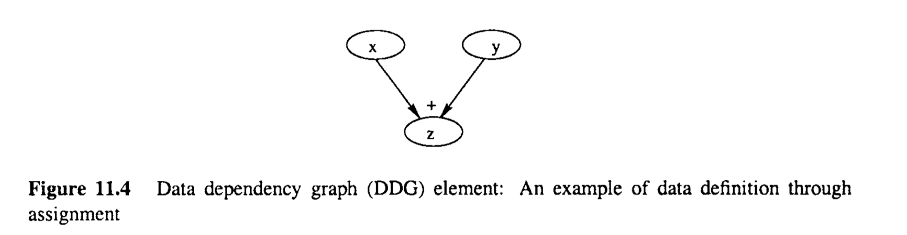
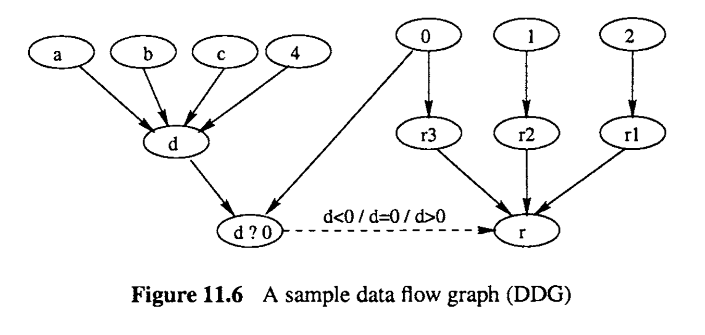
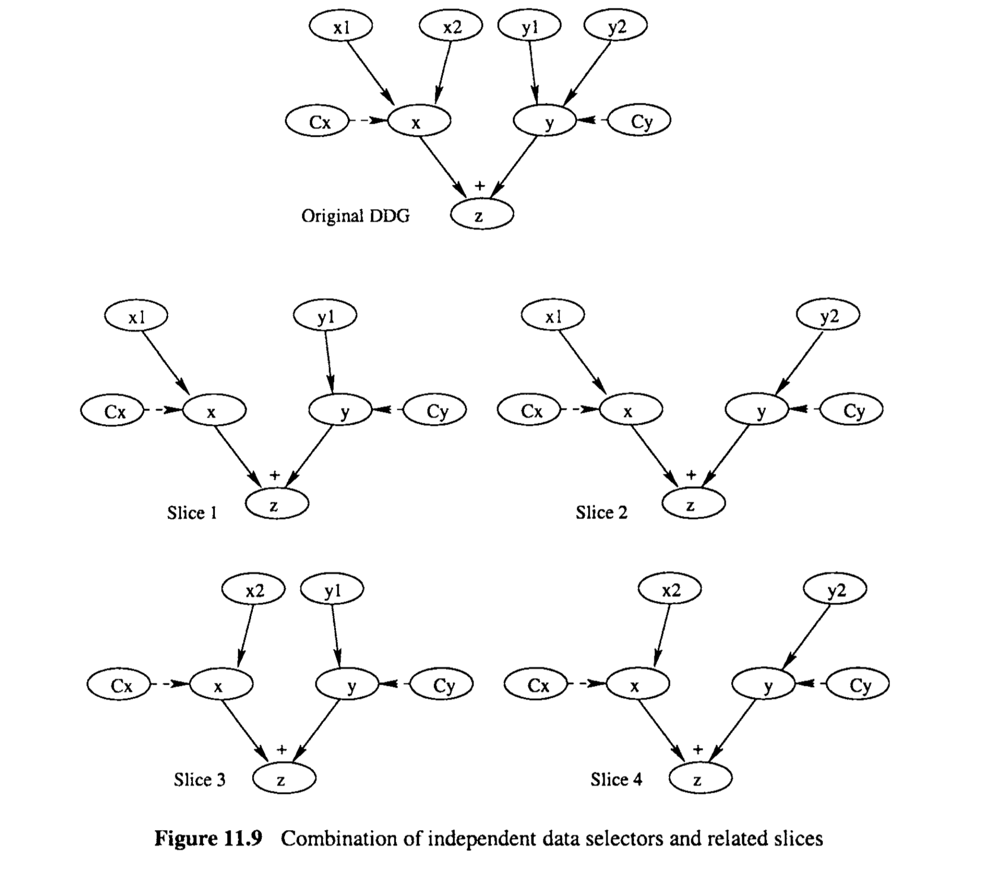

# Chapter 11 Control Flow, Data Dependency, and Interaction Testing

From the structural or implementation view, a software system is made up of interacting components, modules, or sub-systems. As it appears to target customers, the overall system consists of linked functions or operations. Finite-state machines (FSMs) and related usage models we described in the previous chapter can be used to model and test these interconnected system functions, implementations, and related usage. We focused on covering the states, transitions, and related usage without paying too much attention to interactions beyond simple links. In this chapter, we describe testing techniques to deal with complex interactions beyond one-step links in FSMs. Two primary types of such complex interactions are: 

* Interactions along an execution path, where later executions are affected by all that went on before them.
* More specific interactions among data items in execution, with some of the later ones depending on the definitions and vallues of earlier ones for their definitions and values. 

The testing of the above interactions is through what are commonly called control flow testing (CFT) and data flow testing (DFT), respectively. These techniques are traditionally white-box techniques due to the level of detail captured in their models (Myers, 1979; Beizer, 1990), but they have also found some applications as black-box testing techniques applicable to testing system-level functional flow, data dependencies, and related interactions (Howden, 1980; Beizer, 1995). In fact, these techniques and related studies represent some of the earliest formal studies of software testing (Allen and Cocke, 1972; Goodenough and Gerhart, 1975; Clarke, 1976; Howden, 1976; Miller and Howden, 1981).


> 从结构或实现视角来看，软件系统由相互作用的组件、模块或子系统组成。对目标客户来说，整个系统由链接的功能或操作构成。在上一章中，我们描述了可以用来模拟和测试这些互联系统功能、实现及相关使用的有限状态机（FSMs）和相关使用模型。我们重点覆盖了状态、转换和相关使用，而没有过多关注于简单链接之外的交互。在本章中，我们将介绍测试技术，用以处理有限状态机中一步链接之外的复杂交互。这类复杂交互的两个主要类型是：
>
> - 执行路径上的交互，其中后续执行受到之前所有执行的影响。
> - 执行中数据项之间的更具体交互，一些后续数据项的定义和值依赖于之前数据项的定义和值。
>
> 上述交互的测试通过通常称为控制流测试（CFT）和数据流测试（DFT）的技术进行。这些技术传统上是白盒技术，因为它们的模型中捕获了大量的细节（Myers, 1979; Beizer, 1990），但它们也已经找到了作为黑盒测试技术的应用，适用于测试系统级的功能流、数据依赖性及相关交互（Howden, 1980; Beizer, 1995）。实际上，这些技术和相关研究代表了软件测试最早的正式研究之一（Allen and Cocke, 1972; Goodenough and Gerhart, 1975; Clarke, 1976; Howden, 1976; Miller and Howden, 1981）。


## 11.1 BASIC CONTROL FLOW TESTING

Control flow testing (CFT) is a direct and natural extension to coverage-based FSM testing with a specialized type of FSMs called control flow graphs (CFGs) and with a focus on complete execution paths instead of on state or link coverage.

> 控制流测试（CFT）是基于覆盖的FSM测试的直接且自然的扩展，使用了一种特殊类型的FSM，称为控制流图（CFGs），并且关注于完整执行路径而不是状态或链接覆盖。

### 11.1.1 General concepts

When we introduced finite-state machines (FSMs) in Chapter 10, we distinguished the type whose information processing is associated with transitions from the type whose information processing is associated with states. Control flow graphs (CFGs) can be considered as special cases of the latter type, with their elements and characteristics specified as follows:

* Nodes: Each node in a CFG represents a unit of information processing (white-box view) or workload to be handled by the software (black-box view). The nodes in CFGs correspond to the states in FSMs. 

* Links: Each link in a CFG simply represents the relation “is followed by”: If we have a directed link from node A to node B, it is interpreted as A is followed by B, or B follows A. The links in CFGs correspond to the state transitions in FSMs, but no processing or workload is associated with links in CFGs. Duplicate links are not needed in CFGs because there is no need to specify the simple relation “is followed by” more than once. 

* Initial/entry and jinal/exit nodes: The nodes where program execution starts are called the initial or entry nodes and the ones where program execution ends are called the final or exit nodes. In CFT, we mostly deal with proper programs or functions where there is only a single entry node and a single exit node. 

* Outlinks: A link that originates from a node is called an outlink with respect to that node. When there are multiple outlinks from a node, each of them will be labeled with its specific condition. The actual execution will only follow one of these outlinks. 

* Inlinks: A link that ends up in a node is called an inlink with respect to that node. 
  When there are multiple inlinks to a node, the actual execution will only follow one of these inlinks because the above condition on outlinks guarantees that program execution will only follow one link at a time. 

* Decision, junction, and processing nodes: A node associated with multiple outlinks is called a decision node because a decision is made at this node to select an outlink to follow in an actual execution. It is also called a branching node for obvious reasons. 
  Similarly, a node associated with multiple inlinks is called a junction node. A node that is neither a decision node nor a junction node is called a processing node because it usually corresponds to some internal or external processing. Two special cases are the entry nodes, where there may not be any inlink, and exit nodes, where there may not be any outlink. However, they are still grouped as processing nodes, because they are generally associated with some initial or final processing. For clarity, we generally separate out the three types of nodes, with information processing associated with only processing nodes and with one junction node corresponding to each branching node.

  

* Path: A complete path, or simply a path, is one that starts from an entry node, follows a number of links and visits a number of intermediate nodes, and ends up in an exit node. Since no duplicate link is allowed, we can simply identify the path by the sequence of nodes visited. 
* Segment: A path segment, or simphy a segment, is a subpart of a complete path where the first node may not be an entry node and the last node may not be an exit node. 
* Loop: A path or a segment contains a loop if some nodes in the path or segment are revisited. In what follows, we will deal with CFGs without loops first. Section 11.2 is dedicated to loop testin

Figure 11.1 is a sample CFG with processing nodes P1, P2, P3, P4, P5, P6, and P7; decision nodes C1, C2, and C3; and junction node J1, J2, and 53. The CFG is also divided into three different parts GI, G2, and G3, with each part shown inside a dotted rectangle. In another variation of CFGs often used by practitioners and in literature, some of the nodes could be merged if we allow processing in all the nodes. In that variation, we would merge J1 and C2 into one node, and J2, J3 and P7  into another. 

The basic idea for control flow testing (CFT) is to select paths as test cases and sensitize them by assigning corresponding input values. As described in Chapter 7, among the three major activities of test preparation, execution, and follow-up, the last two share much of the same sub-activities among different testing techniques; while different testing techniques prepare test cases and test procedures differently based on different underlying models. For CFT, the test preparation includes the following sub-steps: 0 Build and verify the CFG. 

* Define and select paths to cover as individual test cases based on the CFG. 
* Sensitize the paths or the test cases by deciding the input values. 
* Plan for result checking. 

We elaborate on each of these sub-steps below.

> 在第10章中介绍有限状态机（FSMs）时，我们区分了与转换关联的信息处理类型和与状态关联的信息处理类型。控制流图（CFGs）可以被视为后者的特殊情况，其元素和特征如下所述：
>
> - 节点：CFG中的每个节点代表一个信息处理单元（白盒视角）或由软件处理的工作负载（黑盒视角）。CFG中的节点对应于FSMs中的状态。
> - 链接：CFG中的每个链接简单地代表了“被接着”的关系：如果我们有一个从节点A到节点B的有向链接，它被解释为A被B接着，或B接着A。CFG中的链接对应于FSMs中的状态转换，但CFG中的链接不与任何处理或工作负载关联。在CFGs中不需要重复链接，因为没有必要多次指定简单的“被接着”关系。
> - 初始/入口和最终/出口节点：程序执行开始的节点称为初始或入口节点，程序执行结束的节点称为最终或出口节点。在CFT中，我们主要处理有单一入口节点和单一出口节点的正式程序或函数。
> - 出链：从一个节点发出的链接被称为该节点的出链。当一个节点有多个出链时，每个出链都会被标上其特定条件。实际执行只会跟随这些出链之一。
> - 入链：结束在一个节点的链接被称为该节点的入链。当一个节点有多个入链时，实际执行只会跟随这些入链之一，因为出链上的条件保证了程序执行一次只会跟随一个链接。
> - 决策节点、汇合节点和处理节点：与多个出链关联的节点称为决策节点，因为在这个节点上做出决策以选择在实际执行中要跟随的出链。它也因显而易见的原因被称为分支节点。同样，与多个入链关联的节点称为汇合节点。既不是决策节点也不是汇合节点的节点称为处理节点，因为它通常对应于某些内部或外部处理。两个特殊情况是入口节点，可能没有任何入链，和出口节点，可能没有任何出链。然而，它们仍然被归类为处理节点，因为它们通常与某些初始或最终处理相关联。为了清晰起见，我们通常将这三种类型的节点分开，只有处理节点与信息处理关联，并且每个分支节点对应一个汇合节点。
> - 路径：一个完整的路径，或简称路径，是从一个入口节点开始，跟随多个链接和访问多个中间节点，最终到达一个出口节点的路径。由于不允许重复的链接，我们可以简单地通过访问的节点序列来识别路径。
> - 段：路径段，或简称段，是一个完整路径的子部分，其中第一个节点可能不是入口节点，最后一个节点可能不是出口节点。
> - 循环：如果路径或段中的一些节点被重访，则该路径或段包含循环。在接下来的内容中，我们首先处理没有循环的CFGs。第11.2节专门讨论循环测试。
>
>
> 图11.1是一个示例CFG，包含处理节点P1、P2、P3、P4、P5、P6和P7；决策节点C1、C2和C3；以及汇合节点J1、J2和J3。CFG还被划分为三个不同的部分G1、G2和G3，每个部分都在虚线矩形内显示。在实践中和文献中经常使用的CFGs的另一种变体中，如果我们允许所有节点进行处理，那么一些节点可以合并。在那种变体中，我们会将J1和C2合并成一个节点，将J2、J3和P7合并成另一个节点。
>
> 控制流测试（CFT）的基本思想是选择路径作为测试用例，并通过分配相应的输入值来使它们敏感化。正如第7章所描述的，测试准备、执行和后续跟进这三个主要活动中，后两个在不同的测试技术之间共享许多相同的子活动；而不同的测试技术基于不同的底层模型以不同的方式准备测试用例和测试程序。对于CFT，测试准备包括以下子步骤：构建并验证CFG。
>
> - 根据CFG定义和选择要作为个别测试用例覆盖的路径。
> - 通过决定输入值来使路径或测试用例敏感化。
> - 规划结果检查。
>
> 我们将在下面详细阐述每一个子步骤。


### 11.1.2 Model construction

Notice that Figure 11.1 resembles flow charts often used in software development. In fact, such flow charts are one of the most important sources of information for us to construct CFGs and to perform CFT. One minor difference between CFGs and flow charts is that different types of nodes are typically represented by different symbols in flow charts, but we do not usually use different symbols in CFGs. In the absence of flow charts, program code or program designs can be the information sources for CFG construction. The CFGs constructed in this way are white-box testing models because product implementation information is used, as follows:

* There must be a loop body that accomplishes something, and which may be repeated a number of times. It is usually represented by a node or some other CFG nested inside the loop. 
* There must be some loop control to make the looping decision, or to determine whether to execute the loop body or exit the loop. This loop control may be used repeatedly for each iteration of the loop to make the decision under the current dynamic environment. It is usually represented by a node with associated predicate defined by some control variables whose dynamic values are used to make the looping decisions.

* There must be some loop entry and exit nodes. The ones we commonly deal with in structured programming typically hlave a single entry and a single exit point, such as the “whi1e”and “for” loops. In addition, in many of these loops the entry, exit, and loop control nodes are the same. The exceptions include “repeat -unt il”1oops and unstructured loops using conditional or unconditional goto’s.

* Two or more loops can be combined through nesting (one inside another) and concatenation (one after another). Although non-structured combination using goto’s are also allowed in many programming languages, their usage is discouraged and usually limited to rare situations.

Two of the most common loop instructions in various programming languages are the “while” and “for” loops:

* “while (C) do { B }”, where C1.k the loop condition and B the loop body. The entry point is also the exit point.
* “for (I ; C ; U) do { B }”, where I is the loop initialization before entering the loop, U the loop update after each iteration, C the loop condition, and B the loop body. 
  The entry point is still also the exit point.

Figure 11.3 gives the CFGs for them.


One of the fundamental questions important to testing is whether we can determine the number of iterations for a loop ahead of time before actual test execution. If so, it is called a deterministic loop; otherwise a non-deterministic one. Deterministic loops are commonly used to process some known data or other entities, such as performing some processing for every element of an array of fixed size. One direct implementation is the “do” loop, in the form of “do (n) {B} , that repeats the loop-body B n times. In various languages, this “do” loop is implemented as a more commonly used “for” loop, which usually specifies the number of iterations through related entities in the loop control.

The most common form of the nondeterministic loop is the “while” loop, with the loop body repeated while some condition remains true. For example, the overall operation of an operating system (0s) can be considered a seemingly endless “while” loop: While the system shut-down command has not been issued by the authorized party, the 0s keeps running.  However, we need to distinguish the concepts of deterministic vs. non-deterministic loops from their implementations in specific languages. For example, “for” loops in a language can be used to implement non-deterministic loops and “while” loops for deterministic loops.

> 请注意，图11.1类似于软件开发中经常使用的流程图。实际上，这样的流程图是我们构建CFGs和执行CFT的最重要信息源之一。CFGs和流程图之间的一个小区别是，在流程图中，不同类型的节点通常由不同的符号表示，但在CFGs中我们通常不使用不同的符号。在没有流程图的情况下，程序代码或程序设计可以是CFG构建的信息来源。以这种方式构建的CFGs是白盒测试模型，因为使用了产品实现信息，如下所述：
>
> - 必须有一个循环体，它完成一些任务，并可能被重复多次。它通常由一个节点或一些其他CFG表示，嵌套在循环内部。
> - 必须有一些循环控制来做出循环决策，或确定是否执行循环体或退出循环。这个循环控制可能在循环的每次迭代中被重复使用，以在当前动态环境下做出决策。它通常由一个节点表示，该节点与一些控制变量相关联，这些变量的动态值用于做出循环决策。
> - 必须有一些循环入口和出口节点。我们在结构化编程中常常处理的循环通常有单一的入口和单一的出口点，例如“while”和“for”循环。此外，在许多这样的循环中，入口、出口和循环控制节点是相同的。例外包括使用条件或无条件goto的“repeat-until”循环和非结构化循环。
> - 通过嵌套（一个内嵌另一个）和连接（一个接一个）可以组合两个或更多的循环。尽管在许多编程语言中也允许使用goto进行非结构化组合，但不鼓励使用它们，通常仅限于罕见情况。
>
> 在各种编程语言中最常见的两种循环指令是“while”和“for”循环：
>
> - “while (C) do { B }”，其中C是循环条件，B是循环体。入口点也是出口点。
> - “for (I ; C ; U) do { B }”，其中I是进入循环前的初始化，U是每次迭代后的更新，C是循环条件，B是循环体。入口点仍然也是出口点。
>
> 图11.3给出了它们的CFGs。
>
> 测试的一个基本问题是我们是否可以在实际测试执行之前预先确定循环的迭代次数。如果可以，它被称为确定性循环；否则称为非确定性循环。确定性循环通常用于处理一些已知的数据或其他实体，例如对固定大小的数组的每个元素执行一些处理。一个直接的实现是“do”循环，形式为“do (n) {B}”，重复执行循环体B n次。在各种语言中，这个“do”循环实现为更常用的“for”循环，通常通过循环控制中的相关实体指定迭代次数。
>
> 非确定性循环
>
> 最常见的形式是“while”循环，只要某个条件保持为真，就重复执行循环体。例如，操作系统（OS）的总体操作可以被视为一个看似无尽的“while”循环：只要没有由授权方发出系统关机命令，OS就会继续运行。然而，我们需要区分确定性循环与非确定性循环的概念与它们在特定语言中的实现。例如，某种语言中的“for”循环可以用来实现非确定性循环，“while”循环用于确定性循环

### 11.2.2 Loop testing: Difficulties and a heuristic strategy

Each time we go through a loop a specific number of iterations, we have a distinct path. 
When we combine two loops through concatenation, the number of distinct paths can be obtained by multiplying the distinct paths for each loop, in the same way as we concatenate two loop-free CFGs. However, the possible number of iterations for a loop is usually large.  Therefore, the combination produces a larger number of overall paths.

The nesting of two loops is different from the nesting of loop-free CFGs: The resulting paths is no longer M + N - 1, but a much larger number due to repetition. For example, corresponding to each distinct path for the outer loop, say going through $i$ iterations, each of the outer iterations may involve going through N distinct number of inner loop iterations (from 0 to N -  1). If we unwind the outer loop while treating the inner loop as one indivisible unit, the nested loop would be equivalent to having the inner loop unit concatenated i times. Applying the concatenation rule for path combinations, we obtain $N^i$ combined paths a huge number even for moderate N and i values. The total number of possible control flow paths can be calculated as:
$$
\sum_{i=0}^{M-1}N^i = \frac{N^M-1}{N-1}
$$
which would be beyond complete coverage for almost all cases except very small M and N values. Consequently, we have to abandon any realistic hope for complete path coverage when nested loops are involved, and choose instead selective coverage strategies.

One of the common basis for selective coverage strategies is the empirical evidence or observation of likely problems, much like what we did for boundary testing related to input domain partitions in Chapter 9. For loops, it was observed by practitioners and researchers that we typically have more problems with loop boundaries. For example, for many computational tasks associated with arrays where loops are often used, we often have problems with the lower end, such as initialization problems and special handling of empty, and single item cases. At the upper end, we often have array limit problems commonly manifested as the $N \pm 1$ problems. We can derive our test cases accordingly.

On the other hand, if the upper bound for a loop is N, say N = 1000, and if we have tested for the loop with N/2 iterations without discovering a problem, it is also reasonable to expect that we will not likely to discover a problem when we test with N/2 + 1  iterations. In a sense, this is similar to the equivalence class testing related to different input sub-domains: We typically only need to sample one interior point, while focusing on boundary conditions and related problems. The same idea can be carried to loop testing, as we describe below.

Based on the above discussion, the following execution paths related to lower bound for loops should be used:

* Bypass the loop: This test case can often reveal loop initialization problems. Many operations, such as those associated with the loop body in this case, need proper set-up or initialization, and need some restoration or clean-up to allow for further operations. For example, if the initialization is done before the loop and restoration is done inside the loop, there would be a problem if we bypass the loop, and this test case would reveal the problem.
* Going through the loop once: This test case can often reveal loop initialization or set up problems, such as not initializing certain variable or data items for use in the loop body.
* Going through the loop twice: This test case can often reveal problems that prevent loop repetition.

In some specialized loops, there might be minimum number of iterations. In such cases, the above test cases can be adapted to min and $min \pm 1$ iterations. One other fact worth noting is that every loop has a lower bound but not every one has an upper bound. Therefore, lower-bound testing is more universally applied in loop testing than upper-bound testing.  When an upper bound N exist for a loop, it should also be tested using the test cases of N ,  $N \pm 1$ iterations. This set of test cases can typically reveal capacity problems.

In addition to the above boundary test cases, we should also use some typical cases to make sure that normal executions can be handled properly.

When we test the concatenation of loops, we can combine the above test cases that define separate path segments to form overall paths. For example, for each typical loop, we have seven path segments (bypass, once, twice, typical, max - 1, max, max + 1). The concatenation of two such loops would result in 49 test paths, a large number but still manageable. However, if we have more than a few loops concatenated together, we need to reduce this further.

A more dire situation is with loop nestling. Even with such reduced test cases, when we test for the upper bound of N iterations for the outer loop, we have $7^N$ combination paths because we have seven cases for the inner loop corresponding to each outer iteration. This would be a truly astronomical number even for a moderately large N. Therefore, we need to reduce the test cases further. For example, after testing the inner loop independently, we can fix the inner loop with a single test case when we test the outer loop, thus resulting in only seven test cases for the outer loop. In this case, we used a hierarchical testing strategy, where we tested the inner loop first, and then effectively reduced it to a single node for outer loop testing. If such a strategy sounds too restrictive, we may combine it with a randomly selected inner loop test case whenever the inner loop is invoked to bring more variety to testing without increasing the number of test cases. This idea is similar to the use of hierarchical FSMs or hierarchical Markov chains we described in Chapter 10. In either of these cases, we lose some interactions between the outer and inner loops but significantly reduce the number of test cases. This may be a worthwhile tradeoff for many situations.

The same combinatorial or hierarchical testing ideas can be used to combine loop testing with general CFT. For example, we can combine the heuristic loop test cases with complete coverage test cases for loop-free CFG for concatenation situations. However, when nesting is involved, particularly when something is nested in some loops, we are probably forced to use hierarchical testing ideas as above: First testing the inner CFG or loop in isolation and then treating it as a node when testing the outer loop.

The other testing-related activities, such as path sensitization, execution, result checking, follow-up actions, etc., are not fundamentally different from those for regular loop-free CFT we described in Section 11.1. The only difference is quantitative, with a larger number of conditions to consider, a longer execution time, etc., which would require more meticulous effort by the testers.

> 每次我们经过一个循环特定次数时，我们就有了一个独特的路径。当我们通过连接将两个循环结合在一起时，可以通过乘以每个循环的独特路径数量来获得独特路径的总数，就像我们连接两个无循环的CFG一样。然而，循环的可能迭代次数通常很大。因此，组合产生了更多的总路径。
>
> 两个循环的嵌套不同于无循环CFG的嵌套：产生的路径不再是M + N - 1，而是由于重复而大为增加的数量。例如，对应于外循环的每个独特路径，假设进行i次迭代，每个外部迭代可能涉及进行N次独特的内部循环迭代（从0到N-1）。如果我们在将内循环视为一个不可分割单元的同时展开外循环，嵌套循环相当于将内循环单元连接i次。应用路径组合的连接规则，我们得到$N^i$个组合路径，即使对于适度的N和i值来说也是一个巨大的数字。可能的控制流路径总数可以计算为：
> $$
> \sum_{i=0}^{M-1}N^i = \frac{N^M-1}{N-1}
> $$
> 
>
> 这几乎在所有情况下都超出了完全覆盖的范围，除非M和N值非常小。因此，当涉及嵌套循环时，我们不得不放弃对完全路径覆盖的任何现实希望，而是选择选择性覆盖策略。
>
> 选择性覆盖策略的常见基础之一是经验证据或观察到的可能问题，很像我们在第9章中针对输入域划分进行边界测试时所做的。对于循环，从业者和研究人员观察到，我们通常在循环边界上遇到更多问题。例如，对于许多与数组相关的计算任务，其中循环经常被使用，我们经常在较低端遇到问题，如初始化问题以及空和单项情况的特殊处理。在上限端，我们经常遇到数组限制问题，通常表现为$N \pm 1$问题。我们可以相应地派生我们的测试用例。
>
> 另一方面，如果循环的上界为N，比如N = 1000，如果我们已经测试了N/2次迭代的循环而没有发现问题，我们也有理由期待当我们测试N/2 + 1次迭代时不太可能发现问题。从某种意义上说，这类似于针对不同输入子域的等价类测试：我们通常只需要抽样一个内部点，同时关注边界条件和相关问题。相同的想法可以应用到循环测试中，如下所述。
>
> 基于上述讨论，以下与循环下界相关的执行路径应该被使用：
>
> - 绕过循环：这个测试用例经常可以揭示循环初始化问题。许多操作，例如与循环体关联的操作，在这种情况下需要适当的设置或初始化，并需要一些恢复或清理以允许进一步操作。例如，如果初始化在循环之前完成，并且恢复在循环内部完成，如果我们绕过循环，就会出现问题，这个测试用例会揭示这个问题。
> - 循环一次：这个测试用例经常可以揭示循环初始化或设置问题，如未初始化循环体中使用的某些变量或


### 11.2.3 CFT Usage and Other Issues

As compared to testing based on FSMs, CFT based on CFGs focuses on the complete paths and the decisions as well as interactions along these execution paths. Because of this emphasis on paths, the number of test cases also increases substantially over FSM-based testing based on the similar underlying structures (states and links), particularly when loops are involved. Consequently, the increased power in covering dynamic decisions and interaction problems is accompanied by the additional cost related to the substantially more test cases. The gain needs to be balanced against the cost to arrive at an optimal solution for specific application environments. For most computation intensive applications, which cover most of the traditional software systems, mere state and link coverage would not be enough because of the interconnected dynamic decisions along execution paths. Therefore, CFT is generally a necessary step in the repertoire of different testing techniques for such systems. More often than not, we need to go beyond just CFT to examine detailed interactions that are captured in data dependency analysis and related data flow testing (DFT). 

Because of the complexity with large number of paths when multiple control structures are used, particularly when nested loops are used, CFT is typically applicable as a white-box testing technique to small programs, or to small program units during unit testing. If we want to use it for larger software systems, we have to use a coarse granularity to reduce the number of paths to a manageable level, such as using coarse-grain systemLleve1 CFGs, with each node representing a major function (biack-box view) or a major component (white-box view) instead of individual program instructions. 

CFT can also be enhanced to support usage-based statistical testing. If the branching probabilities are history independent, the corresponding Markov OPs we covered in Chapter 10 can be used. If the probabilities associated with some usage sequences are context and history sensitive (memoryless property for Markov chains not satisfied), we can enumerate individual complete paths and associate usage probabilities with them, similar to the use of Musa’s explicit OPs for complete end-to-end operations we covered in Chapter 8. These OPs can then be used to guide our usage-based statistical testing.

> 与基于FSMs的测试相比，基于CFGs的CFT侧重于完整路径及其上的决策和交互。因为这种对路径的强调，测试用例的数量也会比基于类似底层结构（状态和链接）的FSM测试大幅增加，尤其是涉及循环时。因此，覆盖动态决策和交互问题的增强能力伴随着与大量更多测试用例相关的额外成本。需要权衡收益与成本，以针对特定应用环境找到最佳解决方案。对于大多数计算密集型应用，这涵盖了大部分传统软件系统，仅靠状态和链接覆盖是不够的，因为执行路径上存在相互连接的动态决策。因此，对于这些系统，CFT通常是不同测试技术库中必要的一步。更多情况下，我们需要不仅仅进行CFT，还需要检查在数据依赖分析和相关数据流测试（DFT）中捕获的详细交互。
>
> 由于在使用多个控制结构，特别是使用嵌套循环时，路径数量大的复杂性，CFT通常适用于小程序的白盒测试技术，或在单元测试期间对小程序单元进行测试。如果我们想将其用于更大的软件系统，我们必须使用粗粒度来减少路径数量至可管理水平，例如使用粗粒度的系统级CFGs，每个节点代表一个主要功能（黑盒视图）或一个主要组件（白盒视图），而不是单个程序指令。
>
> CFT也可以增强以支持基于使用的统计测试。如果分支概率与历史无关，我们在第10章中覆盖的相应马尔可夫过程（OPs）可以使用。如果与某些使用序列相关的概率是上下文和历史敏感的（不满足马尔可夫链的无记忆属性），我们可以枚举个别完整路径并将使用概率与它们关联，类似于我们在第8章中覆盖的用于完整端到端操作的Musa的显式OPs的使用。然后可以使用这些OPs来指导我们基于使用的统计测试。

## 11.3 DATA DEPENDENCY AND DATA FLOW TESTING

In the sensitization of CFT test cases, we have encountered some difficulties when shared variables instead of constants are involved in the decision points, and analyses of these variable values were performed to eliminate un-realizable paths. In fact, the correlated decisions need not necessarily involve the shared variable. If some computation and assignments link variables used in later decisions to those used earlier ones, the decisions are correlated. The analysis of this and other data relations is the subject of data dependency analysis (DDA) and the verification of correct handling of such data relations during program execution is the subject of data flow testing (DFT).

> 在CFT测试用例的敏感化过程中，当决策点涉及共享变量而不是常量时，我们遇到了一些困难，对这些变量值进行了分析以消除无法实现的路径。实际上，相关决策不必然涉及共享变量。如果某些计算和赋值将用于后续决策的变量与早期使用的变量链接起来，这些决策就是相关的。分析这些以及其他数据关系是数据依赖分析（DDA）的主题，而在程序执行期间验证这些数据关系的正确处理是数据流测试（DFT）的主题。

### 11.3.1 Basic concepts: Operation:; on data and data dependencies

The use of variables or data items in CFiG decisions is called P-use in data dependency analysis to indicate their use in predicates or conditions. The other kind of use is called C-use, or computational use. One common understanding of these usage situations is that these variables or data must be defined earlier, so that we can determine their types and obtain their values, and use them for various purposes. Formally, we can define these data operations as follows:

* Data definition through data creation, initialization, and assignment, all explicitly, or sometimes through side effects such as through shared memory locations, mailboxes, read-write parameters, etc. It is commonly abbreviated as D-operation, or just D. The key characteristic of the D-operation is that it is destructive, that is, whatever was stored in the data item is destroyed after this operation and cannot be recovered unless some specialized recovery mechanism is used.
* Data use in general computation or in predicate, commonly referred to as C-use or P-use. Both these types of uses are collectively called U-operation, or just U. The key characteristic of the U-operation is that it is non-destructive, that is, the value of the data item remains the same after this operation. However, P-use of a data item in a predicate might affect the execution path to be selected and followed. C-use of data items usually occurs in the form of variables and constants in a computational expression or as parameters in a program function or procedure. Such C-use typically affects some computational results, with some result variables being defined.

With the definitions of these two types of data operations, we can next consider the pair-wise ordinal relations on the same data objects:

* D-U relation: This is the normal usage case. When a data item is used, we need to obtain (or “fetch”) its value defined previously. Most of the data dependency analysis (DDA) and data flow testing (DFT) focus on this type of usage.
* D-D relation: This represents the overloading or masking situation, where the later D-operation destroys the previous contents. One special case is when D-D relation exists without a U-operation in between, that is, a data item is redefined without its previous definition ever being used. This situation might represent some error in the software, or at least some inefficiencies, because the previous definition was totally wasted. Another special situation is the racing condition, where multiple execution streams or parallel processes/devices are all trying to “write” to a shared data item. Again, the unused D-D relation represents problems with control protocol or inefficiencies. However, under the normal circumstances with one or more Uoperations in between, we could focus on the corresponding D-U relations after each D-operation in DDA and DFT while leaving the D-D analysis as specialized tasks for other activities.
* U-U relation: There is no effect or data dependency due to the nature of nondestructive U-operation. Therefore, these relations are ignored in DDA and DFT. 
  As we mentioned before, such correlation might affect the realizability of different execution path. However, as we will see later, we can focus on the corresponding D-U relation for each usage situation to realize different paths in CFT or different slices in DFT, which implicitly takes care of correlated conditions.

* U-D relation: This is called anti-usage. The only interesting situation with it is that a data item is used without ever been defined previously (no D-operation precedes the first U-operation), which usually indicate a problem in the software.

Therefore, with this basic identification and analysis of data operation pairs, some possible problems can be identified immediately. For overall data dependency analysis (DDA) used in data flow testing (DFT), we focus on the D-U relation and related issues.

> 在CFG决策中使用变量或数据项被称为P-use（在数据依赖分析中指代在谓词或条件中的使用）。另一种使用被称为C-use，或计算使用。这些使用情况的一个共同理解是，这些变量或数据必须先前被定义，以便我们可以确定它们的类型并获取它们的值，然后用于各种目的。我们可以正式定义这些数据操作如下：
>
> - 通过数据创建、初始化和赋值来定义数据，所有这些都是显式进行的，或有时通过副作用进行，例如通过共享内存位置、邮箱、读写参数等。它通常简称为D操作，或仅为D。D操作的关键特征是它是破坏性的，即存储在数据项中的内容在此操作后被销毁，并且除非使用一些专门的恢复机制，否则无法恢复。
> - 在一般计算或谓词中使用数据，通常称为C-use或P-use。这两种类型的使用统称为U操作，或仅为U。U操作的关键特征是它是非破坏性的，即数据项的值在此操作后保持不变。然而，数据项在谓词中的P-use可能会影响要选择和遵循的执行路径。数据项的C-use通常发生在计算表达式中的变量和常量形式中，或作为程序函数或过程中的参数。这种C-use通常会影响一些计算结果，其中一些结果变量被定义。
>
> 有了这两种数据操作的定义，我们可以接下来考虑在相同数据对象上的成对序数关系：
>
> - D-U关系：这是正常使用情况。当使用数据项时，我们需要获取（或“取得”）之前定义的值。大多数数据依赖分析（DDA）和数据流测试（DFT）都集中在这种类型的使用上。
> - D-D关系：这表示覆盖或掩盖情况，其中后来的D操作销毁了先前的内容。一个特殊情况是在两个D操作之间不存在U操作，即一个数据项在其先前定义从未被使用的情况下被重新定义。这种情况可能代表软件中的某些错误，或至少是一些低效率，因为之前的定义被完全浪费了。另一个特殊情况是竞争条件，其中多个执行流程或并行进程/设备都试图对共享数据项进行“写入”。再次，未使用的D-D关系代表了控制协议的问题或低效率。然而，在正常情况下，两个D操作之间存在一个或多个U操作，我们可以在DDA和DFT中关注每个D操作后的相应D-U关系，同时将D-D分析留作其他活动的专门任务。
> - U-U关系：由于非破坏性U操作的性质，没有效果或数据依赖。因此，这些关系在DDA和DFT中被忽略。
> - U-D关系：这被称为反使用。唯一有趣的情况是一个数据项在之前从未被定义过（第一个U操作之前没有D操作）就被使用，这通常表明软件中存在问题。
>
> 因此，有了这种基本的数据操作对的识别和分析，一些可能的问题可以立即被识别出来。对于在数据流测试（DFT）中使用的整体数据依赖分析（DDA），我们关注D-U关系及相关问题。


### 11.3.2 Basics of  DFT and DDG

The basic idea of data flow testing (DFT) is to test the correct handling of data dependencies during program execution. Since program execution typically follows a sequential execution model, we can view the data dependencies as embedded in the data flow, where the data flow is the mechanism that data are carried along during program execution. The test cases are derived from data dependency analysis (DDA), with a focus on D-U relations, and the related model we call data dependency graph (DDG).

In DDGs, each node represents the definition of a data item, such as a variable, a constant, and a compound data structure. The links in DDGs represent the D-U relation, or “is used by”. That is, if we have a link from A to B, we interpret it as that the data defined in A is used to define the data in B. For example, the assignment statement “ $z \leftarrow 2 + y$​” can be represented in Figure 11.4, with the definitions for 2 and y used (C-use) in defining z. This analysis of chains of D-U relations used in defining later data items can be carried out to identify the definitions of those earlier items, until we resolve all the definitions. This backward chaining process, starting from the computational result back to all its input and constants represents the model construction process, which we will elaborate later.



In DFT, we directly focus on the data dependencies captured in DDGs instead of the computational sequences or control flow in CFT. One may argue that DFT is closer to testing the essence of computation because such data dependencies directly affect the computational results, while sequencing or control flow is used mainly due to the limitations of our sequential machines and programming languages used (otherwise, much of the computation can be carried out in parallel). For example, the dependency relations in Figure 11.4 must be obeyed to ensure computational result in z. One the other hand, sequencing in program implementations might be altered without affecting the results. For example, the order of the two statements in a sequence
$$
z \leftarrow x + y;\\
i \leftarrow i + 1;
$$
can be switched without changing the computational results. Therefore, in performing DDA and DFT, we separate out essential data dependencies from program execution sequencing to focus on the correct handling of data items and their dependencies, and ultimately the correct computational results.

Similar to any other systematic testing techniques, we focus on the test preparation part for our DFT, with the test execution and follow-up activities essentially the same as that for other testing techniques described in Chapter 7. For DFT, test preparation includes the following steps:

* Build and verify the DDGs. 
* Define and select data slices to cover as individual test cases based on the DDGs. A data slice consists of a data item, usually an output variable, with its definition in terms of other data items, possibly selected from among multiple definitions (Weiser, 1984). 
* Sensitize the data slices or the test cases by deciding the input values. 
* Plan for result checking.

We elaborate on each of these sub-steps below, with a focus on building the DDGs. Once such a DDG is constructed, slice definition and selection is fairly straightforward, and test case sensitization also directly follows. Outcome prediction is also easy with DFT because the selected and sensitized slice directly defines the computational results. Another reason that we focus on DDG construction is that its form and structure are quite different from the program structure and flow-chart that most software developers are familiar with.

We next describe the ways to construct DDGs by first examining the specific characteristics of them, identifying the information sources, outlining a generic DDG construction procedure, and finally an indirect but easy-to-follow procedure for people who are familiar with traditional sequential programming aind flow-charts.

> 数据流测试（DFT）的基本思想是在程序执行期间测试数据依赖的正确处理。由于程序执行通常遵循顺序执行模型，我们可以将数据依赖视为嵌入在数据流中，数据流是数据在程序执行期间传递的机制。测试用例来源于数据依赖分析（DDA），重点关注D-U关系，以及我们称之为数据依赖图（DDG）的相关模型。
>
> 在DDGs中，每个节点代表一个数据项的定义，如变量、常量和复合数据结构。DDGs中的链接代表D-U关系，或“被...使用”。也就是说，如果我们有一个从A到B的链接，我们解释为在A中定义的数据用于定义B中的数据。例如，赋值语句“$z \leftarrow 2 + y$”可以在图11.4中表示，其中2和y的定义被用于（C-use）定义z。这种分析用于定义后续数据项的D-U关系链可以进行，以识别这些先前项的定义，直到我们解决所有定义。这个向后链接过程，从计算结果回溯到所有输入和常量代表了模型构建过程，我们稍后会详细阐述。
>
> 在DFT中，我们直接关注DDGs中捕获的数据依赖，而不是CFT中的计算序列或控制流。有人可能会争辩说，DFT更接近于测试计算的本质，因为这样的数据依赖直接影响计算结果，而序列化或控制流主要是由于我们的顺序机器和使用的编程语言的限制（否则，大部分计算可以并行进行）。例如，图11.4中的依赖关系必须被遵守以确保z中的计算结果。另一方面，程序实现中的排序可以在不影响结果的情况下更改。例如，序列中的两个语句的顺序
> $$
> z \leftarrow x + y;\\
> i \leftarrow i + 1;
> $$
> 可以互换而不改变计算结果。因此，在执行DDA和DFT时，我们将程序执行序列中的本质数据依赖与顺序分离出来，专注于数据项及其依赖的正确处理，最终得到正确的计算结果。
>
> 与任何其他系统化测试技术一样，我们专注于DFT的测试准备部分，测试执行和后续活动本质上与第7章描述的其他测试技术相同。对于DFT，测试准备包括以下步骤：
>
> - 构建并验证DDGs。
> - 根据DDGs定义和选择数据切片作为个别测试用例覆盖。数据切片由一个数据项组成，通常是一个输出变量，以其他数据项的定义表示，可能从多个定义中选择（Weiser, 1984）。
> - 通过决定输入值来使数据切片或测试用例敏感化。
> - 规划结果检查。
>
> 我们将在下面详细阐述这些子步骤，重点构建DDGs。一旦构建了这样一个DDG，切片定义和选择就相当直接了当，测试用例敏感化也直接随之进行。由于选定和敏感化的切片直接定义了计算结果，因此结果预测在DFT中也很容易。我们专注于DDG构建的另一个原因是，其形式和结构与大多数软件开发人员熟悉的程序结构和流程图大不相同。
>
> 我们接下来通过首先审视它们的特定特征、识别信息来源、概述一个通用的DDG构建程序，最后为熟悉传统顺序编程和流程图的人提供一个间接但易于遵循的程序，来描述构建数据依赖图（DDG）的方法。


### 11.3.3 DDG elements and characteristics

In DFT, we are focusing on testing the coirrect handling of different data items involved in producing the final computational output through data dependency analysis (DDA) using DDGs. Therefore, we can view a DDG as a logical graph where computational results are expressed in terms of input variables and constants through the possible use of some intermediate data items as nodes and related D-U relations as links. Based on this view, we can characterize the different graph elements in DDGs as follows:

* Each node represents the definition of a data item z ,  denoted as D(z) and represented as 2 inside an oval in a DDG. The nodes can be classified into three categories:

  * Output or result nodes that represent computational results for the program under testing. These nodes will be analyzed and expressed in terms of other nodes, except in the rare situation that the program does nothing with respect to some data items (that is, some input direct passed down as output).
  * Input or constant nodes that represent user-provided input or pre-defined constants. These nodes represent the “terminal” nodes that do not need to be analyzed any further.
  * Intermediate or storage nodes are those who are neither input nor output nodes. In most computations, these inodes are introduced to facilitate computational procedures to make it easy to obtain the results from input.

* The relations modeled in DDGs are always D-U relations, or “is-used-by” relation. as in the normal usage situations such as ‘‘$z \leftarrow x  + y$” depicted in Figure 11.4.

  

A special case to the above DDG elements is the selective or conditional definitions of certain data items using the so-called data selector nodes. For example, in determining the number of real roots r for the equation $ax^2 + bx + c = 0$, the result r depend on the value $d = b^2 - 4ac$​ in such a way:
$$
(d > 0) \Rightarrow r \leftarrow 2;\\
(d = 0) \Rightarrow r \leftarrow 1; \\
(d < 0) \Rightarrow r \leftarrow 0;
$$
The three possible values for the result r can be marked as r1, r2, and r3. The final result r will be selected among these three values based on the condition on d. Therefore, we can place r in a data selector node, connect r1, r2, and r3 to r as data inlink, and the condition node “$d?0$” to r as the control inlink. We distinguish control inlink from data inlink by using a dotted instead of a solid link. Only one value will be selected for r from candidate values, r1, r2, and r3, by matching their specific conditions to the control inlink evaluation result. The resulting DDG for this data selector is shown in Figure 11.5 (left figure). Although the specific conditions can be shown explicitly in DDGs, we omit some specific labels for conditions where there is no danger for confusion. By doing so, we simplify the DDG by implicitly matching conditions to positions, such as in the right figure in Figure 11.5.

Notice that in this example, both P-use and C-use are present: C-use is associated with computation for the variables r l ,  r2, and r3 within each DDG branches, where the constants 0, 1, and 2 are used. P-use is associated with the variable d and constant 0 for the predicate in the control inlink.

In general, such conditional definitions can be expressed as some parallel conditional assignments, in the form of a collection of conditional pairs:
$$
(C = C_i) \Rightarrow y \leftarrow f(x_1, x_2, ..., x_n)
$$
Each of these possible definitions of y is labeled $y_i$. We can use a data selector node for y to select from $y_i$’s by matching their condition $C_i$’s to the condition node $C$ evaluation result represented in the control inlink. For example, $C = C_2$, then the condition for the $y_2$ data inlink to y would match the control inlink result, leading to $y_2$ value been carried over to $y$.

Unlike the situation with other data definitions where all the dataconnected to the current data item being defined are used, data selectors only need the condition node and one data inlink to uniquely define the current data item. This fact plays a critical role in our data slice definition and related testing to be discussed in Section 11.4.

In most traditional programming languages that support only sequential execution, the above conditional assignments can be implemented using a sequence of assignments controlled by “if”, “switch-case”, or similar statements. We will deal with such implementations and DDGs derived from them later in this section, where the mental mapping between parallel conditional assignments and actual program implementations plays an important role in DDG construction. 

With the above details about DDGs, we can consider a DDG as consisting of input nodes, output nodes, intermediate nodes, data selector nodes, and associated links and properties. Again, the focus is on the output or results, and their resolution through DDGs in terms of input variables and constants. Because of this procedure for data resolution through backward chaining using D-U relations, the DDGs typically show the following characteristics:

* There is usually one output data itern or variable, or at most a few of them. 
* There are typically more input variables and constants. 
* Multiple inlinks are common. 
* Since the DDG is typically shown as flowing from top to bottom, we have the “fan” shaped DDGs as the most common type. This shape is also often described as tree-shaped (like a real tree on the ground, not the upside-down ones in computing literature), or shaped like a river with its tributaries.

> 在数据流测试（DFT）中，我们专注于通过使用数据依赖图（DDGs）进行数据依赖分析（DDA）来测试程序执行过程中不同数据项的正确处理，以产生最终的计算输出。因此，我们可以将DDG视为一个逻辑图，在这个图中，通过可能使用一些中间数据项作为节点和相关的D-U关系作为链接，计算结果以输入变量和常量的形式表达。基于这种视角，我们可以如下描述DDGs中不同图元素的特征：
>
> - 每个节点代表一个数据项z的定义，记为D(z)，在DDG中以椭圆中的2表示。节点可以分为三类：
>   - 输出或结果节点，代表测试程序的计算结果。这些节点将以其他节点的形式进行分析和表达，除非在极少数情况下程序对某些数据项没有任何操作（即，某些输入直接作为输出传递）。
>   - 输入或常量节点，代表用户提供的输入或预定义的常量。这些节点代表“终端”节点，不需要进一步分析。
>   - 中间或存储节点，既不是输入节点也不是输出节点。在大多数计算中，这些节点被引入是为了便于从输入获得结果，以便于执行计算程序。
> - DDGs中建模的关系总是D-U关系，或者“被...使用”的关系。正如正常使用情况下的‘‘$z \leftarrow x + y$”所示。
>
> 特定DDG元素的一个特殊情况是使用所谓的数据选择器节点对某些数据项进行选择性或条件性定义。例如，在确定方程$ax^2 + bx + c = 0$的实根数量r时，结果r取决于值$d = b^2 - 4ac$，如下所示：
> $$
> (d > 0) \Rightarrow r \leftarrow 2;\\
> (d = 0) \Rightarrow r \leftarrow 1; \\
> (d < 0) \Rightarrow r \leftarrow 0;
> $$
> 结果r的三个可能值可以标记为r1，r2，和r3。最终结果r将基于对d的条件从这三个值中选择。因此，我们可以将r放在一个数据选择器节点中，将r1，r2和r3作为数据入链连接到r，将条件节点“$d?0$”作为控制入链连接到r。我们用虚线而不是实线区分控制入链和数据入链。只有一个值会根据控制入链评估结果与特定条件的匹配从候选值r1，r2，r3中为r选择。
>
> 通常，在这个例子中，P-use和C-use都存在：C-use与每个DDG分支内的变量r1，r2和r3的计算相关，其中使用了常量0，1和2。P-use与变量d和常量0用于控制入链中的谓词相关。
>
> 总的来说，这样的条件定义可以表达为一些并行的条件赋值，形式为一组条件对：
> $$
> (C = C_i) \Rightarrow y \leftarrow f(x_1, x_2, ..., x_n)
> $$
> y的每个可能定义都标记为$y_i$。我们可以使用一个数据选择器节点为y从$y_i$中选择，通过将它们的条件$C_i$与条件节点$C$的评估结果匹配来实现。例如，如果$C = C_2$，那么$y_2$数据入链到y的条件将与控制入链结果匹配，导致$y_2$​的值传递给y。
>
> 与其他数据定义的情况不同，所有连接到当前被定义数据项的数据都被使用，数据选择器只需要条件节点和一个数据入链来唯一定义当前的数据项。这一事实在我们的数据切片定义及相关测试中扮演了关键角色，这将在第11.4节中讨论。
>
> 在大多数仅支持顺序执行的传统编程语言中，上述条件赋值可以使用由“if”、“switch-case”或类似语句控制的一系列赋值来实现。我们将在本节后面处理这样的实现及由它们衍生的DDGs，其中并行条件赋值与实际程序实现之间的心智映射在DDG构建中扮演重要角色。
>
> 有了上述关于DDGs的详细信息，我们可以将DDG视为由输入节点、输出节点、中间节点、数据选择器节点及其相关链接和属性组成。再次强调，重点是输出或结果，以及通过DDGs以输入变量和常量的形式对它们进行解析。由于使用D-U关系通过反向链接进行数据解析的程序，DDGs通常显示出以下特征：
>
> - 通常有一个或最多几个输出数据项或变量。
> - 通常有更多的输入变量和常量。
> - 多个入链是常见的。
> - 由于DDG通常显示为从上到下流动，我们有最常见的“扇形”DDGs。这种形状也经常被描述为树形（像地面上的真树，而不是计算文献中的倒置树），或像河流及其支流的形状。

### 11.3.4 Information sources and geineric procedure for DDG construction

Because of its focus on details, DFT and iits DDGs are usually derived from detailed data information about small components such as represented in the program codeor detailed design (white-box view) or detailed functional specifications (black-box view). Traditionally, DFT is more often white-box than black-box, because detailed functional specifications for individual components are not commonly used: Instead of such detailed specifications, the refinement of high-level product specifications is usually accompanied by implementation choices for the components directly. However, for object-oriented methodology, detailed functional specifications might be more meaningful for individual objects, thus making black-box DFT more likely to be used.

When actual code (or detailed design) is available, our natural tendency is to trace it from beginning to end in order to construct our DDGs. In doing so, we could identify input variables and constants first, then follow the code to identify other intermediate variables, link them, and finally conclude with the output variables. This is more akin to following the programmer’s train of thought in the (optimistic) hope that everything will fall into its place when we finish.

In its focus on computational results, DFT construction is more naturally aligned to stepwise data resolution backward from output to input. In addition, a model and view independent of the programmer’s train of thoughts are also beneficial in detecting problems and ensure product quality. Therefore, the following DDG construction procedure based on backward data resolution is generally preferred:

* Identify output variables. 
* Backward chaining to resolve these variables using other variables and constants by consulting the specific computation involved. 
* If there are unresolved variables, the above step is repeated for each one of them, until we have no unresolved variables left.




An unresolved variable is one that is neither an input variable nor a pre-defined constant. 
Therefore, the above procedure ensures that at the end of DDG construction, all leaf nodes are either input variables or constants. For example, we can follow the above procedure to finish the DDG for Figure 11.5 by resolving the variables d, r1, r2, and r3. The resulting DDG is shown in Figure 11.6, where all the leaf nodes are either input variables (a, b, and c) or constants (0, 1,2,4). Notice that we also switched the positions of r3 and r1 and the corresponding conditions in the control inlink so that the sharing of the same constant 0 can be more easily depicted.

One immediate use of such constructed DDGs is the identification of variables in specifications or implementations that are not connected to the DDGs, thus not contributing to the computational results. Such disconnected nodes or sub-graphs are called dead nodes or dead sub-graphs, which usually represent some data problems either in the software or in the model, or at least some wasted system resources in computing something that is not used or returned as results. Such problems can also be detected using DDGs constructed from forward tracing of code by identifying nodes that do not end up in some linked path to output nodes. In this case, effort has already been wasted constructing part of the forward DDGs that lead to nowhere.

>  由于其对细节的关注，数据流测试（DFT）及其数据依赖图（DDGs）通常源自于程序代码或详细设计（白盒视角）中表示的小组件的详细数据信息，或者详细的功能规格说明（黑盒视角）。传统上，DFT比黑盒更常用于白盒测试，因为个别组件的详细功能规格说明并不常用：代替这种详细规格说明的是，高级产品规格的细化通常直接伴随着组件的实现选择。然而，对于面向对象的方法论，详细的功能规格说明对于单个对象可能更有意义，从而使得黑盒DFT更有可能被使用。
>
> 当实际代码（或详细设计）可用时，我们自然倾向于从头到尾跟踪它以构建我们的DDGs。这样做时，我们可以首先识别输入变量和常量，然后跟随代码识别其他中间变量，链接它们，并最终得出输出变量。这更类似于跟随程序员的思维过程，希望当我们完成时，一切都将落到实处。
>
> 由于专注于计算结果，DFT构建更自然地与从输出到输入的逐步数据解析相一致。此外，独立于程序员思维过程的模型和视角对于发现问题和确保产品质量也是有益的。因此，以下基于向后数据解析的DDG构建程序通常更受欢迎：
>
> - 识别输出变量。
> - 通过向后链式解析这些变量，使用其他变量和常量，参考特定的计算过程。
> - 如果有未解析的变量，上述步骤将为它们每一个重复，直到没有未解析的变量为止。
>
> 一个未解析的变量是指既不是输入变量也不是预定义常量的变量。因此，上述程序确保在DDG构建结束时，所有叶节点要么是输入变量，要么是常量。例如，我们可以按照上述程序完成图11.5的DDG，通过解析变量d、r1、r2和r3。结果DDG显示在图11.6中，所有叶节点要么是输入变量（a、b和c）要么是常量（0、1、2、4）。请注意，我们还交换了r3和r1的位置以及控制入链中的相应条件，以便更容易地描述共享相同常量0的情况。
>
> 这样构建的DDGs的一个直接用途是识别规格说明或实现中与DDGs不连接的变量，因此不对计算结果做出贡献。这些断开的节点或子图被称为死节点或死子图，通常代表软件或模型中的一些数据问题，或至少一些在计算不被使用或返回为结果的东西时浪费的系统资源。通过向前跟踪代码并识别不最终链接到输出节点的路径的节点，也可以使用构建的DDGs检测到这样的问题。在这种情况下，已经浪费了努力构建导致无处的前向DDGs的一部分。

### 11.3.5 Building DDG indirectly

In following the backward chaining procedure for DDG construction, various specific situations specified by conditional parallel assignments in specifications or in implementation can be easily handled. However, in most system implementations using traditional programming languages, they are achieved by sequential assignments and use of conditional statements such as “if” and “switch-case”. In addition, most software developers and testers are generally more familiar with such sequential conditional statements. We can customize the above backward chaining procedure to construct DDGs based on information represented in such code and related flow-charts or CFGs. If these CFGs are not available, it is usually much less difficult for people with the traditional training of computer science or software engineering to construct them first and then construct DDGs indirectly. We still follow the same general procedure specified above by starting with the output variables and try to resolve them in terms of other variables and constants until all non-terminal data items are resolved. However, whenever we are dealing with a specific non-terminal node, we can use the corresponding code or CFG in the following steps:

1. Identify all the variables and constants, $x_1, x_2, ..., x_n$,  used in defining the current node $y$ as in the $D(y)$ operation: $y \leftarrow f(x_l,x_2, ... , x_n)$​.

2. For each of these data items xi used, we can trace back to its latest definition by identifying the D-U pair for $x_i$ .  If D(y) is not in a branch, we can directly link node $x_i$​ to node y.

3. If D(y) is in a binary control flow branch, there are two possible definitions for y after the branching statement is done (after the junction point). The actual definition of y can be handled in the following way:

   (a) We can denote the situation as: “blockI; if C then A else B”, where “blockI” is the initial block before the branching statement; C is the branching condition, and A and B are the: “then” and “else” parts where D(y) occurs.

   (b) Build sequential subgraph for each branch independently by treating them as:

   * blockI; A 
   * blockI; B

   We know how to do such sequential situations from step 2 above. This step gives us two y definitions, labeled as y1 and y2.

   (c) Build data selector condition subgraph for: “block1 ; C”. This step gives the definition of C.

   (d) A data selector node will be used for y to select from data definitions yl and y2 

   * The definitions, y l  and y2, can be directly linked to the data selector node y
   * The control inlink to y is from C above in the selector condition subgraph. 

The above step can be repeated for every data definition, until all unresolved variables are resolved. Multi-way branches can be treated similarly as binary branches, but with a multi-way selector instead of a binary selector above.

Following the procedure above, we should be able to obtain the DDG in Figure 11.6 from the pseudo-code or the CFG in Figure 11.2. Also worth noting is the conventions we adopted in such pseudo-code, with explicitly identified input and output variables. In actual programs, they are often implicit, such as through parameter passing or user-prompt for input, and implicitly returned variables (w:ritable parameters or parameters by reference) or explicit returned variable or values using “exit” or “return” statements.

In the above derivation, one common case where mistakes are often made is with the case of empty “else” part. We need to remember that there are still two choices, corresponding to two execution paths, for the variables involved after this “if -then” statement with empty “else”: one updated value and another unchanged. For example, consider the following pseudo-code:
$$
\text{input} (x); \\
y \leftarrow x;\\
\text{if} (x < 0) \text{ then } y \leftarrow -x;\\
\text{output}(y);
$$


In this case, the output variable y still has two possible values, $-x$ and $x$, depending on whether the condition $x < 0$ is true, which can be represented by a data selector on $y$ values in the DDG.


Another complication with branching is the situation with multiple variables being used. 
In this case, we can treat each variable separately, just like in the examples above. However, since the conditions will be the same, they can be shared through control inlinks from the same node. For example, consider the following pseudo-code:

```pseudocode
input(x);
if (x < 0) then 
		exit("square root undefined for negative numbers");
else y <- sqrt(x)
return(y);
```

There are two output variables, one explicitly returned y and another implicitly returned error message e. The DDG can be derived and is shown in Figure 11.7. If the “then” branch is executed (or corresponding data slice realized), we have an error message and the variable y will keep its original value y0. Otherwise, y is assigned sqrt(z) and no error message is produced.

>
> 在遵循构建DDG的向后链接程序中，可以轻松处理由规范或实现中的条件并行赋值指定的各种特定情况。然而，在使用传统编程语言的大多数系统实现中，这些通过顺序赋值和使用诸如“if”和“switch-case”之类的条件语句来实现。此外，大多数软件开发者和测试者通常更熟悉这种顺序条件语句。我们可以定制上述向后链接程序，基于这类代码及相关流程图或CFGs中表示的信息来构建DDGs。如果这些CFGs不可用，对于具有传统计算机科学或软件工程培训的人来说，首先构建它们然后间接构建DDGs通常要容易得多。我们仍然按照上面指定的一般程序，从输出变量开始，并尝试以其他变量和常量来解析它们，直到所有非终端数据项都被解析。然而，每当我们处理一个特定的非终端节点时，我们可以使用相应的代码或CFG进行以下步骤：
>
> 1. 识别定义当前节点$y$的所有变量和常量$x_1, x_2, ..., x_n$，如在$D(y)$操作中：$y \leftarrow f(x_1,x_2, ... , x_n)$。
>
> 2. 对于使用的每个数据项$x_i$，我们可以通过识别$x_i$的D-U对来追溯到其最新的定义。如果D(y)不在分支中，我们可以直接将节点$x_i$与节点y链接。
>
> 3. 如果D(y)在二元控制流分支中，分支语句完成后（在连接点之后）有两种可能的y定义。实际的y定义可以以下列方式处理：
>
>    - 我们可以表示情况为：“blockI; if C then A else B”，其中“blockI”是分支语句之前的初始块；C是分支条件，A和B是“then”和“else”部分，D(y)发生在其中。
>    - 通过将它们视为独立的分支建立序列子图：
>      - blockI; A
>      - blockI; B
>
>    我们知道如何从上面的步骤2中处理这种顺序情况。此步骤给我们两个y的定义，标记为y1和y2。
>
>    - 为“block1 ; C”建立数据选择条件子图。此步骤给出C的定义。
>    - 将数据选择器节点用于y，从数据定义y1和y2中选择
>      - 定义，y1和y2，可以直接链接到数据选择器节点y
>      - y的控制入链来自上述选择器条件子图中的C。
>
> 以上步骤可以针对每个数据定义重复，直到解析所有未解析的变量。多路分支可以类似地作为二元分支处理，但使用多路选择器而不是上述二元选择器。
>
> 按照上述程序，我们应该能够从图11.2中的伪代码或CFG获取图11.6中的DDG。同样值得注意的是我们在这种伪代码中采用的约定，明确识别了输入和输出变量。在实际程序中，它们通常是隐式的，例如通过参数传递或用户提示输入，以及隐式返回的变量（可写参数或引用参数）或使用“exit”或“return”语句显式返回的变量或值。
>
> hen”语句之后，涉及的变量仍有两种选择，对应于两条执行路径：一个是更新后的值，另一个是不变的。例如，考虑以下伪代码：
> $$
>  \text{input} (x); \\y \leftarrow x;\\\text{if} (x < 0) \text{ then } y \leftarrow -x;\\ \text{output}(y);
> $$
>
> 在这个例子中，输出变量y仍然有两个可能的值，$-x$和$x$，取决于条件$x < 0$是否为真，这可以在DDG中用一个对$y$值的数据选择器来表示。
>
> 处理分支的另一个复杂情况是使用多个变量的情况。在这种情况下，我们可以像上面的例子那样单独处理每个变量。然而，由于条件将是相同的，它们可以通过来自同一个节点的控制入链共享。例如，考虑以下伪代码：
>
> ```
> pseudocodeCopy code
> input(x);
> if (x < 0) then 
> 		exit("square root undefined for negative numbers");
> else y <- sqrt(x)
> return(y);
> ```
>
> 有两个输出变量，一个是显式返回的y，另一个是隐式返回的错误消息e。可以派生DDG，并显示在图11.7中。如果执行了“then”分支（或实现了相应的数据切片），我们会有一个错误消息，变量y将保持其原始值yo。否则，y被分配为sqrt(x)且不产生错误消息。

### 11.3.6 Dealing with loops

The use of loops would significantly complicate the DDGs because of the many possible data dependencies involved. The data used within each iteration would be dependent on all the previous iterations, similar to an n-level sequential concatenation. With the difficulties noted above for selector combinations for sequential concatenations, full data dependency analysis for even a loop with moderate number of iterations would be impractical. The situation is much worse than in CFT, where only execution path is analyzed but not the detailed computations and related data definitions within each iteration captured in DDG.

However, many of the loops in actual implementations may not correspond to loops in conceptual models or functional specifications. One concrete example is the summation of an array: conceptually, it can be defined as:
$$
S = \sum_{i=1}^nA[i]
$$
which can be implemented in whichever way supported by a computational model. However, due to the limitations of most sequential programming languages, this is often implemented as a loop. 

When we test such non-essential loops, we can choose to focus on the conceptual data dependency between S and A, instead of the individual elements $A[i]$’s. We could adopt a two-phase strategy, testing the loop by CFT, and then collapsing the loop into one processing node, for example, in the form of “S + arraysum(8) ;”, in performing our data flow testing.

For essential loops that could not be processed without loops even in conceptual models we can attempt to unwind the loops once or twice, treating them as nested if’s. In this way, “while C do B” is unwinded into: “if C then {B; if  C then B}”. That is, we have empty else’s for both the inner and the outer if’s. From what we have described above, we know how to handle such if’s. Therefore, by unwinding the loops once or twice, we can test basic data relations but avoid complications with multiple iterations that would be too complex to handle.

> 循环的使用会因涉及许多可能的数据依赖而显著复杂化DDGs。每次迭代中使用的数据将依赖于所有之前的迭代，类似于n级顺序连接。正如上面对于顺序连接的选择器组合所指出的困难，即使是具有适度迭代次数的循环，进行完整的数据依赖分析也是不切实际的。这种情况比CFT中仅分析执行路径但不捕获DDG中每次迭代内的详细计算和相关数据定义的情况要糟糕得多。
>
> 然而，实际实现中的许多循环可能不对应于概念模型或功能规格中的循环。一个具体的例子是数组的求和：从概念上讲，它可以定义为：
> $$
> S = \sum_{i=1}^nA[i]
> $$
> 这可以用计算模型支持的任何方式来实现。然而，由于大多数顺序编程语言的限制，这通常实现为一个循环。
>
> 当我们测试这种非本质循环时，我们可以选择关注S和A之间的概念数据依赖，而不是单个元素$A[i]$。我们可以采用两阶段策略，通过CFT测试循环，然后在进行数据流测试时，将循环折叠成一个处理节点，例如，以“S + arraysum(A) ;”的形式。
>
> 对于即使在概念模型中也无法无循环处理的本质循环，我们可以尝试将循环展开一次或两次，将它们视为嵌套的if语句。这样，“while C do B”被展开为：“if C then {B; if C then B}”。也就是说，内部和外部if都有空的else部分。从我们上面描述的内容，我们知道如何处理这样的if语句。因此，通过将循环展开一次或两次，我们可以测试基本的数据关系，但避免多次迭代带来的复杂性，这对处理来说过于复杂。


## 11.4 DFT: COVERAGE AND APPLICATIONS

With the data dependency graphs (DDGs) constructed above,data flow testing can be carried out easily by selecting data slices and other entities to cover and sensitize them. Both these selection and sensitization steps are relatively easy and straightforward, as described below.

> 通过上面构建的数据依赖图（DDGs），数据流测试可以通过选择数据切片和其他实体来轻松进行，以覆盖并使它们敏感化。这些选择和敏感化步骤相对容易且直接，如下所述。

### 11.4.1 Achieving slice and other coverage

As with testing based on complex models, we can always start with testing the basic model elements and then complex interactions and dependencies in DFT. For DFT based on DDGs, we can start with the nodes that represent data items. The simplest testing would be to provide input and check the output, while ignoring all that is going on inside. We can then repeat the same type of testing for other variables involved, for the links, etc. All these could be done similar to the way we did for simple testing based on checklists in Chapter 8. One special case in the above elementary coverage based on DDGs is the testing with different predicate values, which would be similar to CFT where decision and related paths are tested. 

What really makes DFT different from CFT is the use of DDGs in slice testing, where a slice is a specific realization of an output variable value through a specific set of input variable and constant values (Weiser, 1984). When there is a single output variable and no selector nodes, then all the used input variables and constants will be covered in one slice. However, when there are selectors, each selector will choose one specific data inlink from multiple data inlinks with the control inlink takes a corresponding value. Therefore, we have as many data slices associated with each data selector as the number of corresponding data inlinks. For example, the DDG in Figure 11.6 has three slices, corresponding to the three candidates r1, r2 and r3 data definiltions for the variable r, as shown in Figure 11.8. 

In general, there will be multiple slices for each output variable, and the number of slices depends on the number of specific selectors and their combinations. The combination of two selectors is similar to the path combination involving nesting (when one selector is in the slice of another) or sequential concatenation (when neither is inside the other’s slice, thus called independent selectors). For example, in computing $z \leftarrow x + y$, if x uses a binary selector and so does y, then the candidate values x1, x2, y1 ,  y2 and related conditions can be combined to produce four slices representing the following pairs of values taken by x and y under corresponding conditions: {(x1, y2), (x1, y2), (x2, y1), (x2, y2)}. 
Figure 11.9 illustrates this DFG (top figure) and its four slices.



Similarly, if we have a selector for x above (but not for y) between x1 and x2, and if x2 involves another binary selection between x21 and x22, then there will be three slices corresponding to {x1, x21, x22}. Notice here x2 is going to takes the values of x21 or x22. Figure 1 1.10 illustrates this DFG (top left figure) and its three slices. 

The above steps for combining two selectors can be repeatedly applied to combine multiple selectors. This process would yield multiple slices from DDGs, and each slice can be selected for testing. The sensitization is fairly easy and straightforward for a selected slice, as follows:

* Every input variable and constant involved in the slice needs to be initialized with specific values, as follows.

  * If it is involved in a predicate, the values selected must ensure the realization of the desired predicate value. To do so, we can work backwards with the desired predicate value, and select its input value, possibly through several steps and using several intermediate variables. 
  * If it is involved as a data input, potentially any value is allowable.

  Again, worth noting is that these input values are not uniquely determined by the data slice selected. We can always use ideas from partition-based, usage-based, or boundary testing covered in Chapters 8 and 9 as well as other practical considerations to make such selections.

* For variables and constants not invdved in the slice, they would not have any effect on the computational results of the slice according to the definition of slice (Weiser, 1984). However, we still need to assign values to them under most circumstances because data input is usually handled as an indivisible group of actions in the execution of sequential programs. Default or random values, sometimes labeled as “don’t care” values, can be used.

The above separation of variables and constants that matter from those that don’t in computational results is one significant difference between DFT and CFT. For example, to sensitize the left slice in Figure 11.8, we need to have d < 0, which can be carried back to values such as a = 1, b = 2, c = 3, also shown for this slice. Notice here that the constants 1 and 2 involved in r2 and r1 branches in the other two slices are not used, thus need not to be provided for the computation of this slice. A better example is the sensitization of the x1 slice (slice 1) in Figure 11.10, where all the variables that are only involved in defining x21 and x22 need not be sensitized. 

In terms of outcome prediction, DFT is also more focused than CFT, because we only need relevant input variables in the slice to predict the computational results. We are not verifying the execution sequence, but the exact output values. However, this prediction also involves substantial amount of work, so we also need automated support that can make predictions based on DDGs, or we have to rely on other oracles discussed in Chapter 7.

> 就像基于复杂模型的测试一样，我们总是可以从测试基本模型元素开始，然后是数据流测试（DFT）中的复杂交互和依赖。基于数据依赖图（DDGs）的DFT，我们可以从代表数据项的节点开始。最简单的测试将是提供输入并检查输出，同时忽略内部发生的所有事情。然后我们可以对涉及的其他变量进行相同类型的测试，对于链接等也是如此。所有这些都可以像我们在第8章中基于检查列表进行的简单测试那样完成。上述基于DDGs的基本覆盖的一个特殊情况是使用不同的谓词值进行测试，这类似于CFT，其中测试决策和相关路径。
>
> 真正使DFT与CFT不同的是在切片测试中使用DDGs，其中一个切片是通过一组特定的输入变量和常量值实现的输出变量值的具体实现（Weiser, 1984）。当有一个单一的输出变量且没有选择器节点时，所有使用的输入变量和常量将在一个切片中被覆盖。然而，当存在选择器时，每个选择器将从多个数据入链中选择一个特定的数据入链，而控制入链取相应的值。因此，我们对每个数据选择器有与相应数据入链数量一样多的数据切片。例如，图11.6中的DDG有三个切片，对应于变量r的三个候选r1、r2和r3数据定义，如图11.8所示。
>
> 通常，每个输出变量将有多个切片，切片数量取决于特定选择器及其组合的数量。两个选择器的组合类似于涉及嵌套（当一个选择器在另一个的切片中时）或顺序串联（当两者都不在对方的切片中时，因此称为独立选择器）的路径组合。例如，在计算$z \leftarrow x + y$​时，如果x使用二元选择器，y也是如此，那么候选值x1、x2、y1、y2及相关条件可以组合产生四个切片，代表在相应条件下x和y采取的以下值对：{(x1, y2), (x1, y2), (x2, y1), (x2, y2)}。 图11.9展示了这个DFG（上图）及其四个切片。
>
> 类似地，如果我们在x1和x2之间有一个选择器用于x（但不是y），并且如果x2涉及x21和x22之间的另一个二元选择，那么将有三个切片对应于{x1, x21, x22}。请注意，在这里x2将取x21或x22的值。图11.10展示了这个DFG（左上图）及其三个切片。 将两个选择器组合的上述步骤可以重复应用于组合多个选择器。这个过程将从DDGs产生多个切片，每个切片都可以被选中进行测试。为选定的切片敏感化相对简单直接，如下：
>
> - 切片中涉及的每个输入变量和常量都需要用特定的值初始化，如下所示。
>
>   - 如果它涉及谓词，所选的值必须确保实现所需的谓词值。为此，我们可以用所需的谓词值向后工作，并选择其输入值，可能通过几个步骤和使用几个中间变量。
>   - 如果它作为数据输入涉及，潜在地任何值都是允许的。
>
>   同样值得注意的是，这些输入值不是由选定的数据切片唯一确定的。我们总是可以使用第8章和第9章中涉及的基于分区的、基于使用的或边界测试的想法，以及其他实际考虑来进行这样的选择。
>
> - 对于切片中不涉及的变量和常量，根据切片的定义（Weiser, 1984），它们不会对切片的计算结果产生任何影响。然而，在大多数情况下，我们仍然需要为它们分配值，因为数据输入通常在顺序程序的执行中被处理为不可分割的一组操作。可以使用默认值或随机值，有时标记为“不关心”的值。
>
> 以上将在计算结果中有影响的变量和常量与没有影响的变量和常量区分开，是DFT和CFT之间的一个重要区别。例如，为了敏感化图11.8中左侧的切片，我们需要有d < 0，这可以追溯到如a = 1, b = 2, c = 3的值，也为这个切片展示。请注意，在其他两个切片的r2和r1分支中涉及的常量1和2没有被使用，因此不需要为这个切片的计算提供。一个更好的例子是图11.10中x1切片（切片1）的敏感化，其中只涉及定义x21和x22的变量不需要被敏感化。
>
> 在结果预测方面，DFT也比CFT更加专注，因为我们只需要切片中相关的输入变量来预测计算结果。我们不是在验证执行序列，而是确切的输出值。然而，这种预测也涉及大量的工作，所以我们还需要基于DDGs的自动化支持来进行预测，或者我们必须依赖第7章讨论的其他预言器。

### 11.4.2 DFT: Applications and other issues

Among the testing techniques, DFT is closest to CFT, with both attempt to test the correct handling of the overall execution. Therefore, the applicability of CFT and DFT is also similar. Much of what we discussed in the usage situations for CFT in Section 11.2 also applies to DFT: Both techniques are suitable for traditional computational tasks, with CFT focusing more on the decisions involved and the execution paths taken, and DFT on the computational results and related data dependencies. In a sense, CFT is more processoriented, as exemplified by its step-by-step paths, and DFT is more result-oriented, as exemplified by its fan-shaped slices. 

Although the starting points for both CFT and DFT are FSMs, we developed independent models for them to focus on different problems, which have various implications on their applications, as below:

* CFT relies on CFGs, a specialized type of FSMs; while DFT relies on DDGs, which deviates greatly from FSMs. 
* CFGs closely resemble the program code or overall execution flow commonly associated with sequential computation models. DDGs capture more details about interactions and essential dependencies while omitting the non-essential sequencing information captured in CFGs. This difference manifests in testing in the fan-shaped slices in DFT as contrast to step-by-step paths in CFT. 
* DDGs are generally more complex than CFGs. 
* The ability for loop handling is much more limited in DFT than in CFT.

Because of the above, our assessment of the limits on applications due to product size and granularity for CFT above is even more true for DFT due to the increasing details in DDGs used in DFT: Both CFT and DFT are generally applicable to small programs, small units of large software systems, or overall system operations for large systems at coarse granularity levels. Automated tool support, such as those discussed in Chapter 7, would help make DFT scale-up to some degree. On the other hand, some of the difficulties with one testing technique can often be compensated for by using the other one. For example, we can use CFT for loops within DFT to form a hierarchical testing strategy. For many systems, CFT and DFT can be used together to ensure product quality, usually with CFT performed before DFT due to its relative simplicity and closer ties to program code.

Similar to CFT, DFT contains much detail in its models and uses it in testing. Typically such detailed information can only be obtained based on program code and detailed design, making them more likely to be used as white-box testing techniques. However, DFT is closer to specification than CFT in its focus on the result instead of the process or path taken to obtain the result. In this respect, DFT is more likely to be used as a black-box testing technique for various situations, including object-level testing for object-oriented systems. 

DFT can also be enhanced to support usage-based statistical testing. For example, when we used hierarchical models to perform DFT for large systems, the important data slices or those associated with higher usage probabilities can be expanded into lower-level DDGs, much like we did in our unified Markov models (UMMs) in Chapter 10. Such information can also be used to determine what we warit to do with loops. For example, if the loops are associated with frequently used slices, we should probably unwind it (once or twice) to test the basic data relations through the loops. Otherwise, we could just perform CFT for the loops and treat them as a functional node in performing DFT. 

In addition to its application to computational and result-oriented system functions and implementation, DFT can be applied in various other application situations due to the information captured in its DDGs. The most important among its other applications is the many uses of data dependency analyses in parallel and distributed systems. If we generalize DDGs to capture the essential dependency among different system tasks instead of data items, we can use such DDGs to help maximize overall system performances: Whenever no dependency is represented in DDGs among different computations tasks, they can be executed in parallel. The parallel execution results can then be synchronized to produce the overall results. In fact, synchronization is a built-in mechanism in DFT, if we interpret the input to a node in a DDG as tasks. We next explore this application of DFT for task synchronization and related testing.

> 在所有测试技术中，数据流测试（DFT）与控制流测试（CFT）最为接近，两者都旨在测试整体执行的正确处理。因此，CFT和DFT的适用性也类似。我们在第11.2节关于CFT使用情况的讨论同样适用于DFT：两种技术都适用于传统的计算任务，其中CFT更多地关注所涉及的决策和采取的执行路径，而DFT则关注计算结果和相关的数据依赖性。从某种意义上说，CFT更加以过程为导向，如其逐步路径所示，而DFT更加以结果为导向，如其扇形切片所示。
>
> 虽然CFT和DFT的出发点都是FSMs，但我们为它们发展了独立的模型，以便关注不同的问题，这对它们的应用有各种含义，如下所述：
>
> - CFT依赖于CFGs，一种特殊类型的FSMs；而DFT依赖于DDGs，这与FSMs有很大的偏差。
> - CFGs与常见的顺序计算模型相关联的程序代码或总体执行流程非常相似。DDGs捕获更多关于交互和基本依赖性的细节，同时省略CFGs中捕获的非基本顺序信息。这种差异在测试中表现为DFT中的扇形切片与CFT中的逐步路径形成对比。
> - DDGs通常比CFGs更复杂。
> - 在DFT中处理循环的能力比在CFT中要受限得多。
>
> 因为上述原因，我们对CFT应用限制由于产品大小和粒度的评估对DFT更为适用，因为DFT中使用的DDGs的细节更多：CFT和DFT通常适用于小程序、大软件系统的小单元，或在粗粒度级别上的大系统的总体操作。自动化工具支持，如第7章中讨论的那样，将有助于在某种程度上扩展DFT的规模。另一方面，一种测试技术的某些困难往往可以通过使用另一种技术来补偿。例如，我们可以在DFT中使用CFT来处理循环，形成一个分层测试策略。对于许多系统，CFT和DFT可以一起使用以确保产品质量，通常先进行CFT再进行DFT，因为CFT相对简单且与程序代码联系更紧密。
>
> 类似于CFT，DFT在其模型中包含大量细节，并在测试中使用这些信息。通常，这些详细信息只能基于程序代码和详细设计获得，使它们更可能被用作白盒测试技术。然而，DFT比CFT更接近于规格说明，因为它关注的是结果而不是获取结果的过程或路径。在这方面，DFT更可能被用作各种情况的黑盒测试技术，包括面向对象系统的对象级测试。
>
> 

### 11.4.3 DFT application in synchronization testing

As we described in Section 11.3, for situations like $y \leftarrow f(x_1, x_2, ..., x_n)$,  that is, when data items $x_1, x_2, ... , x_n$ ,  are used and processed to define the value for y, we can draw links from them to y. When we interpret these $x_i$’s as parallel tasks carried out before our next task y, these links represent the synchlronization situation: All the $x_i$  tasks must finish before y can be completed. That is, if some of the $x_i$​’s finish early, we still have to wait for the other to finish before we can finish y. Because of the dynamic nature of such individual tasks executed in parallel, the testing of the correct handling of such synchronizations involves two elements:

* Correct (computational) result (y value) is obtained or appropriate processing (y processing) is applied for given input $x_i$’s. One special case for this is that no result should be produced or no processing should be applied if we do not have all the $x_i$​’s available.
* Synchronization of arrivals among $x_i$’s in all possible orders, including time ordered arrivals as well as the possibility of one or more $x_i$​’s arriving at exactly the same time.


In synchronization testing, we would combine the above two conditions to test the arrivals of $x_i$​’s in all different arriving orders, and to check for the correct outcome. For example, with two way synchronization of input A and B to produce C, we can run the following synchronization testing cases:

* Nothing arrives $\Rightarrow$ no output.
* One arrives (2 cases: A alone or B alone) + no output.
* Both arrive (3 cases: A then B, B then A, or A and B together) $\Rightarrow $ verify that correct C is obtained.

As we can see, even for such a simple situation, we have 6 synchronization test cases. 
When the number of $x_i$’s goes up, we need significantly more synchronization test cases due to the combinatorial explosion of possible arriving orders. One way to simplify such testing is through hierarchical models to form groups among the $x_i$  and then synchronize the grouped results. For example, for a 4-way synchronization, if we can group them into two groups of 2-way synchronizations, we can then use 6 test cases for each group and then 6 additional test cases to synchronize the two groups by treating each group as a single input in the higher-level model, resulting in 18 total synchronization test cases. The raw 4-way synchronization would involve substantially more test cases.

> 正如我们在11.3节中所描述的，对于像$y \leftarrow f(x_1, x_2, ..., x_n)$这样的情况，即当数据项$x_1, x_2, ... , x_n$被使用和处理以定义y的值时，我们可以从它们画出链接到y。当我们将这些$x_i$解释为在我们的下一个任务y之前执行的并行任务时，这些链接代表同步情况：所有$x_i$任务必须完成，y才能完成。也就是说，如果一些$x_i$提前完成，我们仍然必须等待其他完成，然后我们才能完成y。由于这种并行执行的个别任务的动态性质，正确处理此类同步的测试涉及两个元素：
>
> * 获得正确的（计算）结果（y值）或给定输入$x_i$的适当处理（y处理）。这个的一个特例是，如果我们没有所有的$x_i$可用，不应产生结果或不应应用任何处理。
> * 在所有可能的顺序中同步$x_i$的到达，包括时间顺序到达以及一个或多个$x_i$同时到达的可能性。
>
> 在同步测试中，我们将结合上述两个条件来测试$x_i$的所有不同到达顺序，并检查正确的结果。例如，对于输入A和B进行两路同步以产生C，我们可以运行以下同步测试案例：
>
> * 什么都没有到达$\Rightarrow$无输出。
> * 单独到达（2种情况：仅A或仅B）+无输出。
> * 两者同时到达（3种情况：A然后B，B然后A，或A和B同时）$\Rightarrow$验证是否获得了正确的C。
>
> 如我们所见，即使对于这样一个简单的情况，我们也有6个同步测试案例。当$x_i$的数量增加时，由于可能到达顺序的组合爆炸，我们需要显著更多的同步测试案例。简化此类测试的一种方法是通过分层模型在$x_i$之间形成组，然后同步分组结果。例如，对于4路同步，如果我们可以将它们分组为两组2路同步，我们可以为每组使用6个测试案例，然后使用额外的6个测试案例通过将每组视为高级模型中的单个输入来同步两组，共计18个同步测试案例。原始的4路同步将涉及到更多的测试案例。


## 11.5 CONCLUDING REMARKS

Generally speaking, there are two basic elements in any computation or information processing task: the data element and the control element, which are organized together through some implemented algorithms. In this chapter, we extended the basic analysis based on FSMs further to analyze and test the overall control flow paths and the overall interactions among different data items through control flow testing (CFT) and data flow testing (DFT).  The basis for CFT is the construction of control flow graphs (CFGs) as a special type of FSMs and thq related path analysis. The basis for DFT is the data dependency analysis (DDA) using data dependency graphs (DDGs). CFT tests for basic decision or control flow problems and, to a limited degree, interactions along execution paths. More thorough testing of the interactions can be achieved through DFT. Both CFT and DFT models can be either white-box ones based on implementation details or black-box ones based on external functions and usage scenarios. However, due to the details involved and the close resemblance to program code, their white-box variations are more likely to be produced and used.

In addition to CFT and DFT used individually, they can also be combined into the so called transaction flow testing (Beizer, 1995), where the basic structure resembles control flow while the dynamic tokens and the token relations resemble data flow and parallelism common in many systems. Another specialized analysis technique and related testing is the use of Petri-net models (Ghezzi et al., 2003), which can be considered as a special kind of FSMs with two distinct types of nodes called places and transitions (Peterson, 1981). 
In fact, Petri net shares many of the important characteristics of transaction flow models, such as marking and token relations. These analysis and testing techniques are generally more suitable for overall workload handling in complex systems where parallel execution and process coordination play a central role.

One of the common characteristics that runs through all these testing techniques is their focus on details and the use of such detailed information in performing actual testing. Therefore, these techniques are generally appropriate for small-scale testing, unit testing of large software systems, and high-level control, data, and transaction integration for large systems. In general, for large software systems, people are more like to use a combination of different testing techniques for different purposes and under different environments to maximize the effectiveness of different testing techniques while keeping the overall cost at a reasonable level. These are the subjects that we will examine in the next chapter, to integrate different testing techniques for more effective and efficient testing.

> 一般来说，任何计算或信息处理任务中都有两个基本元素：数据元素和控制元素，这些元素通过一些实现的算法组织在一起。在这一章中，我们基于FSMs的基本分析进一步扩展，以分析和测试整体控制流路径和不同数据项之间的整体交互，通过控制流测试（CFT）和数据流测试（DFT）。CFT的基础是构建控制流图（CFGs）作为一种特殊类型的FSMs及其相关路径分析。DFT的基础是使用数据依赖图（DDGs）进行数据依赖分析（DDA）。CFT测试基本决策或控制流问题，以及在有限程度上，执行路径沿线的交互。通过DFT可以实现对交互的更彻底测试。CFT和DFT模型可以是基于实现细节的白盒模型，也可以是基于外部功能和使用场景的黑盒模型。然而，由于涉及的细节和与程序代码的密切相似性，它们的白盒变体更有可能被产生和使用。
>
> 除了单独使用CFT和DFT外，它们还可以组合成所谓的事务流测试（Beizer, 1995），其中基本结构类似于控制流，而动态令牌和令牌关系类似于许多系统中常见的数据流和并行性。另一种专门的分析技术和相关测试是使用Petri网模型（Ghezzi等人，2003），它可以被视为一种特殊类型的FSMs，具有称为地点和转换的两种不同类型的节点（Peterson, 1981）。实际上，Petri网与事务流模型分享许多重要特征，如标记和令牌关系。这些分析和测试技术通常更适合于复杂系统中的整体工作负载处理，其中并行执行和过程协调发挥核心作用。
>
> 穿过所有这些测试技术的一个共同特点是它们关注细节，并在实际测试中使用这些详细信息。因此，这些技术通常适用于小规模测试、大型软件系统的单元测试，以及大型系统的高级控制、数据和事务集成。一般来说，对于大型软件系统，人们更倾向于使用不同的测试技术组合，针对不同的目的和在不同的环境下，以最大化不同测试技术的有效性，同时保持总体成本在合理水平。这些是我们将在下一章中检查的主题，以集成不同的测试技术以实现更有效和高效的测试。
