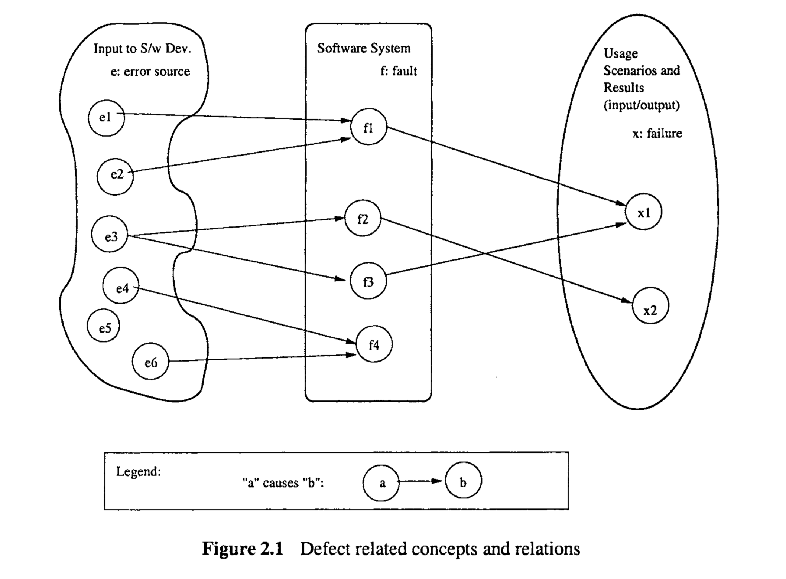
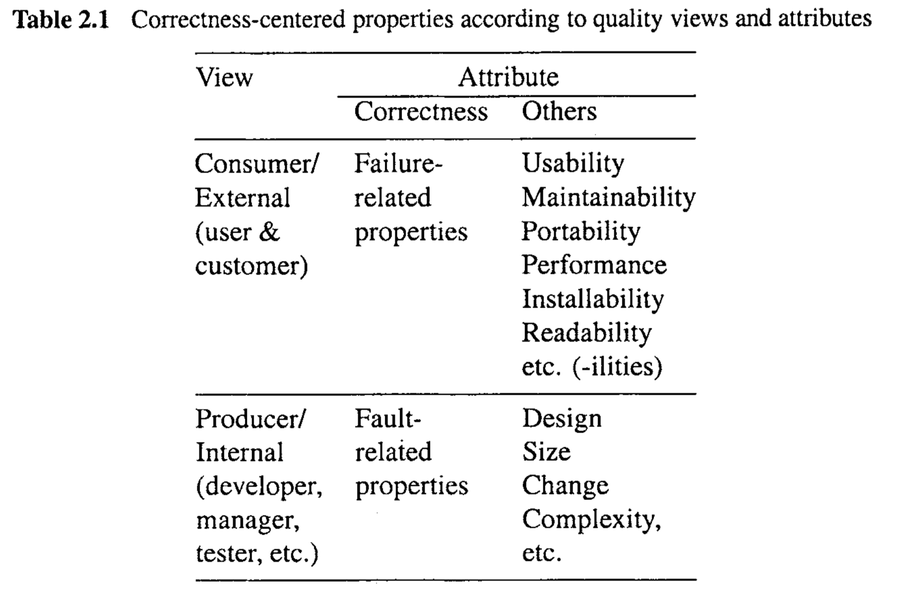

# Chapter 2 WHAT IS SOFTWARE QUALITY?

The question, “What is software quality?’, is bound to generate many different answers, depending on whom you ask, under what circumstances, for what kind of software systems, and so on. An alternative question that is probably easier for us to get more informative answers is: “What are the characteristics for high-quality software? 

> 提出“什么是软件质量？”这个问题，根据你询问的对象、询问的环境、针对的软件系统类型等，可能会得到许多不同的答案。一个可能更容易获得有信息量答案的替代问题是：“高质量软件的特性是什么？”

In this chapter, we attempt to define software quality by defining the expected characteristics or properties of high-quality software. In doing so, we need to examine the different perspectives and expectations of users as well as other people involved with the development, management, marketing, and maintenance of the software products. We also need to examine the individual characteristics associated with quality and their inter-relationship, and focus our attention on the critical characteristics of functional correctness. We conclude the chapter with a comparison of software quality with quality concepts for other (non-software) systems and the evolving place of quality within software engineering.

> 在这一章中，我们尝试通过定义高质量软件预期的特性或属性来界定软件质量。在这样做时，我们需要检视用户以及其他与软件产品的开发、管理、市场营销和维护相关的人员的不同视角和期望。我们还需要检视与质量相关的各个特性及其相互关系，并将我们的注意力集中在功能正确性这一关键特性上。我们以比较软件质量与其他（非软件）系统的质量概念以及质量在软件工程中的演变地位来结束本章。

## 2.1 QUALITY: PERSPECTIVES AND EXPECTATIONS

We next examine the different views of quality in a systematic manner, based on the different roles, responsibilities, and quality expectations of different people, and zoom in on a small set of views and related properties to be consistently followed throughout this book. 

> 我们接下来将基于不同角色、责任和不同人的质量期望，以系统的方式审视不同的质量观点，并聚焦于一小组应贯穿全书一致遵循的观点和相关属性。

Five major views according to (Kitchenham and Pfleeger, 1996; Pfleeger et al., 2002) are: transcendental, user, manufacturing, product, and value-based views, as outlined below:

> 根据(Kitchenham和Pfleeger, 1996; Pfleeger等人, 2002)的说法，有五个主要的观点：超验观点、用户观点、制造观点、产品观点和基于价值的观点，如下所述：

* In the transcendental view, quality is hard to define or describe in abstract terms, but can be recognized if it is present. It is generally associated with some intangible properties that delight users. 
* In the user view, quality is fitness for purpose or meeting user’s needs. 
* In the manufacturing view, quality means conformance to process standards. 
* In the product view, the focus is on inherent characteristics in the product itself in the hope that controlling these internal quality indicators (or the so-called productinternal metrics described in Chapter 18) will result in improved external product behavior (quality in use). 
* In the value-based view, quality is the customers’ willingness to pay for a software.

> - 在超验观点中，质量难以用抽象的术语定义或描述，但如果存在，就能被认出来。它通常与一些令用户高兴的无形属性相关联。
> - 在用户观点中，质量是适用性或满足用户需求。
> - 在制造观点中，质量意味着符合过程标准。
> - 在产品观点中，焦点是产品本身的固有特性，希望通过控制这些内部质量指标（或所谓的产品内部度量，如第18章所述）将导致外部产品行为（使用中的质量）的改进。
> - 在基于价值的观点中，质量是客户愿意为软件支付的价格。

##### People’s roles and responsibilities

When software quality is concerned, different people would have different views and expectations based on their roles and responsibilities. With the quality assurance (QA) and quality engineering focus of this book, we can divide the people into two broad groups: 

> 当涉及到软件质量时，基于他们的角色和责任，不同的人会有不同的观点和期望。随着本书对质量保证（QA）和质量工程的关注，我们可以将人群分为两大类：

* Consumers of software products or services, including customers and users, either internally or externally. Sometime we also make the distinction between the customers, who are responsible for the acquisition of software products or services, and the users, who use the software products or services for various purposes, although the dual roles of customers and users are quite common. We can also extend the concept of users to include such non-human or “invisible” users as other software, embedded hardware, and the overall operational environment that the software operates under and interacts with (Whittaker, 2001). 

  > 软件产品或服务的消费者，包括内部或外部的客户和用户。有时我们还会区分负责获取软件产品或服务的客户和出于各种目的使用软件产品或服务的用户，尽管客户和用户的双重角色非常常见。我们还可以扩展用户的概念，以包括诸如其他软件、嵌入式硬件和软件操作并与之交互的整个运行环境等非人类或“看不见”的用户（Whittaker, 2001）

* Producers of software products, or anyone involved with the development, management, maintenance, marketing, and service of software products. We adopt a broad definition of producers, which also include third-party participants who may be involved in add-on products and services, software packaging, software certification, fulfilling independent verification and validation (IV&V) responsibilities, and so on. 

  > 软件产品的生产者，或任何涉及软件产品的开发、管理、维护、市场营销和服务的人员。我们采用了生产者的广义定义，也包括可能参与附加产品和服务、软件包装、软件认证、履行独立验证和确认（IV&V）责任等的第三方参与者。

Subgroups within the above groups may have different concerns, although there are many common concerns within each group. In the subsequent discussions, we use external view for the first group’s perspective, who are more concerned with the observed or external behavior, rather than the internal details that lead to such behavior. Similarly, we use a generic label internal view for the second group’s perspective, because they are typically familiar with or at least aware of various internal characteristic of the products. In other words, the external view mostly sees a software system as a black box, where one can observe its behavior but not see through inside; while the internal view mostly sees it as a white box, or more appropriately a clear box, where one can see what is inside and how it works.

> 尽管上述各组内的子群体可能有不同的关注点，但每个组内有许多共同的关注点。在后续讨论中，我们使用外部视角来代表第一组的观点，他们更关注观察到的或外部行为，而不是导致这种行为的内部细节。类似地，我们使用一个通用标签内部视角来代表第二组的观点，因为他们通常熟悉或至少意识到产品的各种内部特性。换句话说，外部视角主要将软件系统视为一个黑盒，可以观察其行为但看不到内部；而内部视角主要将其视为一个白盒，或更恰当地说是一个透明盒，可以看到里面的内容及其工作原理。

##### Quality expectations on the consumer side

The basic quality expectations of a user are that a software system performs useful functions as it is specified. There are two basic elements to this expectation: First, it performs right functions as specified, which, hopefully fits the user’s needs (fit for use). Second, it performs these specified functions correctly over repeated use or over a long period of time, or performs its functions reliably. These two elements are related to the validation and verification aspects of QA we introduced in the previous chapter, which will be expanded further in Chapter 4. Looking’into the future, we can work towards meeting this basic expectation and beyond to delight customers and users by preventing unforeseen negative impacts and produce unexpected positive effects (Denning, 1992).

> 用户的基本质量期望是软件系统能够按照规定执行有用的功能。这种期望有两个基本要素：首先，它按照规定执行正确的功能，希望这能满足用户的需求（适合使用). 其次，它能够在反复使用或长时间使用过程中正确执行这些规定的功能，或者能够可靠地执行其功能。这两个要素与我们在上一章介绍的QA的验证和确认方面相关，将在第四章中进一步扩展。展望未来，我们可以努力满足这一基本期望并超越，通过预防未预见的负面影响和产生意外的正面效果，以取悦客户和用户（Denning，1992）。

For many users of today’s ubiquitous software and systems, ease of use, or usability, may be a more important quality expectation than reliability or other concerns. For example, the adoption of graphical user interfaces (GUI) in personal computers to replace textbased command interpreters often used in mainframes is primarily driven by the usability concerns for their massive user population. Similarly, ease of installation, is another major trend for software intended for the same population, to allow for painless (and nearly effortless) installation and operation, or the so-called “plug-and-play”. However, different users of the same system may have different views and priorities, such as the importance of usability for novice users and the importance of reliability for sophisticated users of the web (Vatanasombut et al., 2004).

> 对于当今广泛使用的软件和系统的许多用户来说，易用性或可用性可能比可靠性或其他考虑更为重要。例如，个人电脑采用图形用户界面（GUI）以替代常用于大型机的基于文本的命令解释器，主要是由于针对其庞大用户群体的可用性考虑。同样，易于安装，是针对同一用户群体的软件的另一个主要趋势，以允许无痛苦（几乎不费力）的安装和操作，或所谓的“即插即用”。然而，同一系统的不同用户可能有不同的观点和优先级，例如，对于新手用户而言可用性的重要性，以及对于网络的成熟用户而言可靠性的重要性（Vatanasombut等，2004）。

When we consider the extended definition of users beyond human users, the primary expectations for quality would be to ensure the smooth operation and interaction between the software and these non-human users in the form of better inter-operability and adaptability, so that the software can work well with others and within its surrounding environment.

> 当我们考虑到除人类用户外的用户的扩展定义时，对质量的主要期望将是确保软件与这些非人类用户之间的顺畅运行和交互，形式为更好的互操作性和适应性，以便软件能够与其他系统良好协作，并适应其周围的环境.

The basic quality expectations of a customer are similar to that of a user, with the additional concern for the cost of the software or service. This additional concern can be reflected by the so-called value-based view of quality, that is, whether a customer is willing to pay for it. The competing interests of quality and other software engineering concerns, such as cost, schedule, functionality, and their trade-offs, are examined in Section 2.4.

> 客户的基本质量期望与用户相似，但额外关注软件或服务的成本。这一额外的关注可以通过所谓的基于价值的质量观来反映，即客户是否愿意为之付费。质量与其他软件工程关注点（如成本、进度、功能性）及其权衡的竞争利益，在2.4节中进行了探讨。

### Quality expectations on the producer side

For software producers, the most fundamental quality question is to fulfill their contractual obligations by producing software products that conform to product specifications or providing services that conform to service agreement. By extension, various product internal characteristics that make it easy to conform to product specifications, such as good designs that maintain conceptual integrity of product components and reduce coupling across different components, are also associated with good quality.

> For software producers, the most fundamental quality question is to fulfill their contractual obligations by producing software products that conform to product specifications or providing services that conform to service agreement. By extension, various product internal characteristics that make it easy to conform to product specifications, such as good designs that maintain conceptual integrity of product components and reduce coupling across different components, are also associated with good quality.

For product and service managers, adherence to pre-selected software process and relevant standards, proper choice of software methodologies, languages, and tools, as well as other factors, may be closely related to quality. They are also interested in managing and satisfying user’s quality expectations, by translating such quality expectations into realistic quality goals that can be defined and managed internally, selecting appropriate and effective QA strategies, and seeing them through.

> 对于产品和服务经理而言，遵守预选的软件过程和相关标准、适当选择软件方法论、语言和工具，以及其他因素，可能与质量密切相关。他们还关注于管理和满足用户的质量期望，通过将这些质量期望转化为可以内部定义和管理的现实质量目标，选择适当有效的QA策略，并跟进实施。

For other people on the producer side, their different concerns may also produce quality views and expectations different from the above. For example, usability and modifiability may be paramount for people involved with software service, maintainability for maintenance personnel, portability for third-party or software packaging service providers, and profitability and customer value for product marketing.

> 对于生产方的其他人员，他们不同的关注点也可能产生与上述不同的质量观和期望。例如，对于参与软件服务的人员而言，可用性和可修改性可能至关重要；对于维护人员而言，可维护性是重点；对于第三方或软件打包服务提供商而言，可移植性至关重要；对于产品营销来说，盈利能力和客户价值是主要考虑因素。

## 2.2 QUALITY FRAMEWORKS AND ISO-9126

Based on the different quality views and expectations outlined above, quality can be defined accordingly. In fact, we have already mentioned above various so-called “-ilities” connected to the term quality, such as reliability, usability, portability, maintainability, etc. Various models or frameworks have been proposed to accommodate these different quality views and expectations, and to define quality and related attributes, features, characteristics, and measurements. We next briefly describe ISO-9 126 (ISO, 2001), the mostly influential one in the software engineering community today, and discuss various adaptations of such quality frameworks for specific application environments.

> 基于上述不同的质量观点和期望，可以相应地定义质量。事实上，我们已经在上面提到了与质量相关的各种所谓的“特性”，例如可靠性、可用性、可移植性、可维护性等。已经提出了各种模型或框架来适应这些不同的质量视图和期望，并定义质量和相关的属性、特征、特征和度量。接下来，我们将简要介绍ISO-9126 (ISO, 2001)，这是当今软件工程界最具影响力的标准，并讨论针对特定应用环境对这种质量框架的各种调整。

###ISO-9126

ISO-9 126 (ISO, 2001) provides a hierarchical framework for quality definition, organized into quality characteristics and sub-characteristics. There are six top-level quality characteristics, with each associated with its own exclusive (non-overlapping) sub-characteristics, as summarized below:

> SO-9 126（ISO, 2001）提供了一个分层的质量定义框架，该框架组织成质量特性和子特性。有六个顶级质量特性，每个特性都与其独有的（不重叠的）子特性相关联，如下所述：

* Functionality: A set of attributes that bear on the existence of a set of functions and their specified properties. The functions are those that satisfy stated or implied needs. 
  The sub-characteristics include:
  - Suitability 
  - Accuracy 
  - Interoperability 
  - Security 

* Reliability: A set of attributes that bear on the capability of software to maintain its level of performance under stated conditions for a stated period of time. The sub-characteristics include: 
  * Maturity 
  * Fault tolerance 
  * Recoverability 

* Usability: A set of attributes that bear on the effort needed for use, and on the individual assessment of such use, by a stated or implied set of users. The subcharacteristics include: 
  * Understandability 
  * Learnability 
  * Operability 

* Efficiency: A set of attributes that bear on the relationship between the level of performance of the software and the amount of resources used, under stated conditions. 
  The sub-characteristics include: 
  * Time behavior 
  * Resource behavior

* Maintainability: A set of attributes that bear on the effort needed to make specified modifications. The sub-characteristics include: 
  * Analyzability 
  * Changeability 
  * Stability 
  * Testability 

* Portability: A set of attributes that bear on the ability of software to be transferred from one environment to another. The sub-characteristics include: 
  * Adaptability 
  * Installability 
  * Conformance 
  * Replaceability

> - 功能性：一组与一系列功能及其指定属性的存在相关的属性。这些功能是满足声明或暗示的需求的功能。 子特性包括：
>   - 适用性
>   - 准确性
>   - 互操作性
>   - 安全性
> - 可靠性：一组与软件在声明的条件下保持其性能水平的能力相关的属性。子特性包括：
>   - 成熟度
>   - 容错性
>   - 可恢复性
> - 可用性：一组与使用所需的努力以及对这种使用的个人评估相关的属性，针对声明或暗示的用户群。子特性包括：
>   - 可理解性
>   - 可学习性
>   - 可操作性
> - 效率：一组与软件性能水平与在声明条件下使用的资源量之间的关系相关的属性。 子特性包括：
>   - 时间行为
>   - 资源行为
> - 可维护性：一组与进行指定修改所需的努力相关的属性。子特性包括：
>   - 可分析性
>   - 可变性
>   - 稳定性
>   - 可测试性
> - 可移植性：一组与软件能够从一个环境转移到另一个环境的能力相关的属性。子特性包括：
>   - 适应性
>   - 可安装性
>   - 一致性
>   - 可替换性

### Alternative frameworks and focus on correctness

ISO-9 126 offers a comprehensive framework to describe many attributes and properties we associate with quality. There is a strict hierarchy, where no sub-characteristics are shared among quality characteristics. However, certain product properties are linked to multiple quality characteristics or sub-characteristics (Dromey, 1995; Dromey, 1996). For example, various forms of redundancy affect both efficiency and maintainability. Consequently, various alternative quality frameworks have been proposed to allow for more flexible relations among the different quality attributes or factors, and to facilitate a smooth transition from specific quality concerns to specific product properties and metrics. 

> ISO-9 126提供了一个全面的框架，描述了我们与质量相关联的许多属性和特性。存在一个严格的层次结构，其中质量特性之间没有共享的子特性。然而，某些产品属性与多个质量特性或子特性相关联（Dromey，1995；Dromey，1996）。例如，各种形式的冗余影响效率和可维护性。因此，提出了各种替代的质量框架，以允许不同质量属性或因素之间更灵活的关系，并促进从特定质量关注点到特定产品属性和指标的平滑过渡。

Many companies and communities associated with different application domains have adapted and customized existing quality frameworks to define quality for themselves, taking into consideration their specific business and market environment. One concrete example of this for companies is the quality attribute list CUPRIMDS (capability, usability, performance, reliability, installation, maintenance, documentation, and service) IBM used for their software products (Kan, 2002). CUPRIMDS is often used together with overall customer satisfaction (thus the acronym CUPRIMDSO) to characterize and measure software quality for IBM’s software products. 

> 与不同应用领域相关的许多公司和社区已经适应并定制了现有的质量框架，以定义自己的质量，考虑到他们特定的商业和市场环境。一个具体例子是IBM用于其软件产品的质量属性列表CUPRIMDS（能力、可用性、性能、可靠性、安装、维护、文档和服务）（Kan，2002）。CUPRIMDS经常与总体客户满意度一起使用（因此有CUPRIMDSO的缩写），以表征和衡量IBM软件产品的软件质量。

Similarly, a set of quality attributes has been identified for web-based applications (Offutt, 2002), with the primary quality attributes as reliability, usability, and security, and the secondary quality attributes as availability, scalability, maintainability, and time to market. 

> 类似地，为基于网络的应用程序确定了一组质量属性（Offutt，2002），主要质量属性为可靠性、可用性和安全性，次要质量属性为可用性、可扩展性、可维护性和上市时间。

Such prioritized schemes are often used for specific application domains. For example, performance (or efficiency) and reliability would take precedence over usability and maintainability for real-time software products. On the contrary, it might be the other way round for mass market products for end users. 

> 这些优先级方案通常用于特定的应用领域。例如，对于实时软件产品，性能（或效率）和可靠性可能优先于可用性和可维护性。相反，对于面向最终用户的大众市场产品，情况可能正好相反。

Among the software quality characteristics or attributes, some deal directly with the functional correctness, or the conformance to specifications as demonstrated by the absence of problems or instances of non-conformance. Other quality characteristics or attributes deal with usability, portability, etc. Correctness is typically related to several quality characteristics or sub-characteristics in quality frameworks described above. For example, in ISO-9 126 it is related to both functionality, particularly its accuracy (in other words, conformance) sub-characteristics, and reliability.

> 在软件质量特性或属性中，有些直接处理功能的正确性，或通过缺乏问题或不符合的实例来证明的规范的一致性。其他质量特性或属性处理可用性、可移植性等。正确性通常与上述质量框架中的几个质量特性或子特性相关。例如，在ISO-9 126中，它与功能性相关，特别是其准确性（换言之，一致性）子特性和可靠性相关。

Correctness is typically the most important aspect of quality for situations where daily life or business depends on the software, such as in managing corporate-wide computer networks, financial databases, and real-time control software. Even for market segments where new features and usability take priority, such as for web-based applications and software for personal use in the mass market, correctness is still a fundamental part of the users’ expectations (Offutt, 2002; Prahalad and Krishnan, 1999). Therefore, we adopt the correctness-centered view of quality throughout this book. We will focus on correctnessrelated quality attributes and related ways to ensure and demonstrate quality defined as such.

> 在日常生活或业务依赖于软件的情况下，正确性通常是质量的最重要方面，例如在管理公司范围内的计算机网络、金融数据库和实时控制软件中。即使在新功能和可用性优先的市场细分中，例如基于网络的应用程序和大众市场中个人使用的软件，正确性仍然是用户期望的基本部分（Offutt，2002；Prahalad和Krishnan，1999）。因此，在本书中，我们采用以正确性为中心的质量观。我们将关注与正确性相关的质量属性及其保证和展示这样定义的质量的相关方法。

##2.3 CORRECTNESS AND DEFECTS: DEFINITIONS, PROPERTIES, AND MEASUREMENTS

When many people associate quality or high-quality with a software system, it is an indication that few, if any, software problems, are expected to occur during its operations. What is more, when problems do occur, the negative impact is expected to be minimal. Related issues are discussed in this section.

> 在许多人将质量或高质量与软件系统联系起来时，这表明在其运行期间预计会出现的软件问题很少，如果有的话。更重要的是，当问题确实发生时，预期的负面影响将会最小。本节将讨论相关问题。

### Definitions: Error, fault, failure, and defect

>  定义：错误、故障、失败和缺陷

Key to the correctness aspect of software quality is the concept of defect, failure, fault, and error. The term “defect” generally refers to some problem with the software, either with its external behavior or with its internal characteristics. The IEEE Standard 610.12 (IEEE, 1990) defines the following terms related to defects: 

* Failure: The inability of a system or component to perform its required functions within specified performance requirements. 
* Fault: An incorrect step, process, or data definition in a computer program. 
* Error: A human action that produces an incorrect result.

> 软件质量的正确性方面的关键是缺陷、失败、故障和错误的概念。术语“缺陷”通常指软件的某些问题，无论是其外部行为还是其内部特性。IEEE标准610.12（IEEE，1990）定义了与缺陷相关的以下术语：
>
> - 失败：系统或组件无法在指定的性能要求内执行其所需功能。
> - 故障：计算机程序中的不正确步骤、过程或数据定义。
> - 错误：产生不正确结果的人为行为。

Therefore, the term failure refers to a behavioral deviation from the user requirement or the product specification; fault refers to an underlying condition within a software that causes certain failure(s) to occur; while error refers to a missing or incorrect human action resulting in certain fault(s) being injected .into a software. 

> 因此，术语失败指的是与用户要求或产品规范的行为偏差；故障指的是软件内部导致某些失败发生的潜在条件；而错误指的是由于缺失或不正确的人为行为而导致某些故障被注入软件。

We also extend errors to include error sources, or the root causes for the missing or incorrect actions, such as human misconceptions, misunderstandings, etc. Failures, faults, and errors are collectively referred to as defects in literature. We will use the term defect in this book in this collective sense or when its derivatives are commonly used in literature, such as in defect handling. 

> 我们还将错误扩展到包括错误源，或缺失或不正确行为的根本原因，如人类的误解、理解错误等。在文献中，失败、故障和错误统称为缺陷。在本书中，我们将在这种集合意义上使用术语缺陷，或者当其衍生词在文献中常用时，如在缺陷处理中使用。

Software problems or defects, are also commonly referred to as “bugs”. However, the term bug is never precisely defined, such as the different aspects of defects defined as errors, faults, and failures above. Some people have also raised the moral or philosophical objection to the use of bug as evading responsibility for something people committed. Therefore, we try to avoid using the term “bug” in this book. 

> 软件问题或缺陷，也常被称为“错误”。然而，术语错误从未被精确定义，例如上面定义的缺陷的不同方面，如错误、故障和失败。有些人还提出了道德或哲学上的反对意见，认为使用错误作为逃避人们所犯错误的责任。因此，我们尝试避免在本书中使用术语“错误”。

Similarly, we also try to avoid using the related terms “debug”or “debugging”for similar reasons. The term “debug” general means “get rid of the bugs”. Sometimes, it also includes activities related to detecting the presence of bugs and dealing with them. In this book, we will use, in their place, the following terms:

> 同样，我们也尝试避免使用相关术语“调试”或“除错”出于类似的原因。术语“调试”通常意味着“摆脱错误”。有时，它还包括与检测错误的存在及处理它们相关的活动。在本书中，我们将使用以下术语代替：

* We use ==defect detection== and removal for the overall concept and activities related to what many people commonly call “debugging”. 
* ==When specific activities related to “debugging” are involved, we point the specifics out using more precisely defined terms, including,== 
  * ==Specific activities related to defect discovery, including testing, inspection, etc.== 
  * ==Specific follow-up activities after defect discovery, including defect diagnosis, analysis, fixing, and re-verification.==

> - 我们使用缺陷检测和移除来指代通常许多人称为“调试”的整体概念和相关活动。
> - 当涉及到与“调试”相关的具体活动时，我们使用更精确定义的术语来指出具体内容，包括：
>   - 与缺陷发现相关的具体活动，包括测试、检查等。
>   - 缺陷发现后的具体后续活动，包括缺陷诊断、分析、修复和重新验证。

### Concepts and relations illustrated

The concepts of error (including error source), fault, failure, and defect can be placed into the context of software artifact, software development activities, and operational usage, as depicted in Figure 2.1. Some specific information illustrated include:

> 错误（包括错误源）、故障、失败和缺陷的概念可以放入软件构件、软件开发活动和操作使用的上下文中，如图2.1所示。一些具体信息包括：

* The software system as represented by its artifacts is depicted in the middle box. The artifacts include mainly software code and sometime other artifacts such as designs, specifications, requirement documents, etc. Thefaults scattered among these artifacts are depicted as circled entities within the middle box.

  > 由其构件代表的软件系统在中间框中展示。这些构件主要包括软件代码，有时还包括其他构件，如设计、规范、需求文件等。这些构件中散布的故障被描述为中间框内的带圈实体。

* The input to the software development activities, depicted in the left box, include conceptual models and information, developers with certain knowledge and experience, reusable software components, etc. Various error sources are also depicted as circled entities within this left box.

  > 软件开发活动的输入，在左边框中描绘，包括概念模型和信息、具有一定知识和经验的开发人员、可重用的软件组件等。各种错误源也被描述为这个左框内的带圈实体。

* The errors as missing or incorrect human actions are not directly depicted within one box, but rather as actions leading to the injection of faults in the middle box because of some error sources in the left box. 

  > 错误作为缺失或不正确的人为行为，不直接在一个框内描绘，而是作为由于左框中的某些错误源导致在中间框中注入故障的行为。

* Usage scenarios and execution results, depicted in the right box, describe the input to software execution, its expected dynamic behavior and output, and the overall results. A subset of these behavior patterns or results can be classified as failures when they deviate from the expected behavior, and is depicted as the collection of circled failure instances.

  > 使用场景和执行结果，在右框中描述，描绘了软件执行的输入、其预期的动态行为和输出以及总体结果。这些行为模式或结果的一个子集可以在它们偏离预期行为时被分类为失败，并且被描述为带圈失败实例的集合。

With the above definitions and interpretations, we can see that failures, faults, and errors are different aspects of defects. A causal relation exists among these three aspects of defects:
$$
\text{errors} \rightarrow \text{faults} \rightarrow \text{failures}
$$
That is, errors may cause faults to be injected into the software, and faults may cause failures when the software is executed. However, this relationship is not necessarily 1-to- 1: A single error may cause many faults, such as in the case that a wrong algorithm is applied in multiple modules and causes multiple faults, and a single fault may cause many failures in repeated executions. Conversely, the same failure may be caused by several faults, such as an interface or interaction failure involving multiple modules, and the same fault may be there due to different errors.

> 即，错误可能导致故障注入软件中，故障在软件执行时可能导致失败。然而，这种关系不一定是1对1的：一个错误可能导致许多故障，例如在应用错误算法于多个模块并导致多个故障的情况下，一个故障可能在重复执行中导致许多失败。相反，同一失败可能由几个故障引起，如涉及多个模块的接口或交互失败，同一个故障可能因为不同的错误而存在。

Figure 2.1 also illustrates some of these situations, as described below:

* The error source e3 causes multiple faults, f2 and f3. 
* The fault f1 is caused by multiple error sources, e1 and e2. 
* Sometimes, an error source, such as e5, may not cause any fault injection, and a fault, such as f4, may not cause any failure, under the given scenarios or circumstances. Such faults are typically called dormant or latent faults, which may still cause problems under a different set of scenarios or circumstances.

> 
> 图2.1还展示了一些如下所述的情形：
>
> - 错误源e3导致多个故障，f2和f3。
> - 故障f1由多个错误源e1和e2引起。
> - 有时，一个错误源，如e5，可能不会导致任何故障注入，而一个故障，如f4，在给定的场景或情况下可能不会导致任何失败。这样的故障通常被称为潜在或休眠故障，它们在不同的场景或情况下仍然可能引起问题。

### Correctness-centered properties and measurements

With the correctness focus adopted in this book and the binary partition of people into consumer and producer groups, we can define quality and related properties according to these views (external views for producers vs. internal views for consumers) and attributes (correctness vs. others) in Table 2.1. 

> 采用本书中的正确性焦点，并将人群二元划分为消费者和生产者群体，我们可以根据这些视角（生产者的外部视角 vs. 消费者的内部视角）和属性（正确性 vs. 其他）在表2.1中定义质量和相关属性。

The correctness-centered quality from the external view, or from the view of consumers (users and customers) of a software product or service, can be defined and measured by various failure-related properties and measurement. To a user or a customer, the primary concern is that the software operates without failure, or with as few failures as possible. When such failures or undesirableevents do occur, the impact should be as little as possible. 

> 从外部视角，或从软件产品或服务的消费者（用户和客户）的视角来看，以正确性为中心的质量可以通过各种与失败相关的属性和测量来定义和衡量。对于用户或客户来说，主要关注点是软件操作无失败，或尽可能少的失败。

These concerns can be captured by various properties and related measurements, as follows:

> 以消费者（用户和客户）的视角来看，正确性中心的质量定义和测量可以包括：

* Failure properties and direct failure measurement: Failure properties include information about the specific failures, what they are, how they occur, etc. These properties can be measured directly by examining failure count, distribution, density, etc. We will examine detailed failure properties and measurements in connection with defect classification and analysis in Chapter 20.

  > 故障属性和直接故障测量：故障属性包括关于特定故障的信息，它们是什么，如何发生等。这些属性可以通过检查故障计数、分布、密度等直接测量。我们将在第20章中与缺陷分类和分析联系起来详细检查故障属性和测量

* Failure likelihood and reliability measurement: How often or how likely a failure is going to occur is of critical concern to software users and customers. This likelihood is captured in various reliability measures, where reliability can be defined as the probability of failure-free operations for a specific time period or for a given set of input (Musa et al., 1987; Lyu, 1995a; Tian, 1998). We will discuss this topic in Chapter 22.

  > 故障可能性和可靠性测量：软件用户和客户关心的一个关键问题是故障发生的频率或可能性。这种可能性在各种可靠性度量中被捕捉，其中可靠性可以定义为在特定时间段内或对于给定的输入集无故障运行的概率（Musa等，1987；Lyu，1995a；Tian，1998）。我们将在第22章讨论这个话题。

* Failure severity measurement and safety assurance: The failure impact is also a critical concern for users and customers of many software products and services, especially if the damage caused by failures could be substantial. Accidents, which are defined to be failures with severe consequences, need to be avoided, contained, or dealt with to ensure the safety for the personnel involved and to minimize other damages. We will discuss this topic in Chapter 16.

  > 故障严重性测量和安全保证：许多软件产品和服务的用户和客户也非常关心故障影响，尤其是当故障造成的损害可能很大时。需要避免、控制或处理定义为有严重后果的故障，以确保涉及人员的安全并最小化其他损害。我们将在第16章讨论这个话题。

In contrast to the consumers’ perspective of quality above, the producers of software systems see quality from a different perspectives in their interaction with software systems and related problems. They need to fix the problems or faults that caused the failures, as well as deal with the injection and activation of other faults that could potentially cause other failures that have not yet been observed.

> 与上述消费者的质量视角相反，软件系统的生产者从他们与软件系统和相关问题的互动中看到质量的不同视角。他们需要修复导致失败的问题或故障，以及处理注入和激活其他可能导致尚未观察到的其他故障的故障。

Similar to the failure properties and related measurements discussed above, we need to examine various fault properties and related measurements from the internal view or the producers’ view. We can collect and analyze information about individual faults, as well as do so collectively. Individual faults can be analyzed and examined according to their types, their relations to specific failures and accidents, their causes, the time and circumstances when they are injected, etc. Faults can be analyzed collectively according to their distribution and density over development phases and different software components. 
These topics will be covered in detail in Chapter 20 in connection with defect classification and analysis. Techniques to identify high-defect areas for focused quality improvement are covered in Chapter 21.

> 与上述讨论的故障属性和相关测量类似，我们需要从内部视角或生产者视角检查各种故障属性和相关测量。我们可以收集并分析关于个别故障的信息，也可以集体做这件事。可以根据故障的类型、它们与特定失败和事故的关系、它们的原因、注入的时间和情况等分析和检查个别故障。可以根据它们在开发阶段和不同软件组件上的分布和密度集体分析故障。这些话题将在第20章中与缺陷分类和分析联系起来详细讨论。第21章涵盖了识别高缺陷区域以聚焦质量改进的技术。

### Defects in the context of QA and quality engineering

For most software development organizations, ensuring quality means dealing with defects. 
Three generic ways to deal with defects include: 1) defect prevention, 2) defect detection and removal, and 3) defect containment. These different ways of dealing with defects and the related activities and techniques for QA will be described in Chapter 3.

> 对于大多数软件开发组织，确保质量意味着处理缺陷。处理缺陷的三种通用方式包括：1）缺陷预防，2）缺陷检测和移除，以及3）缺陷限制。这些不同的处理缺陷方式及相关QA活动和技术将在第3章中描述。

Various QA alternatives and related techniques can be used in a concerted effort to effectively and efficiently deal with defects and assure software quality. In the process of dealing with defects, various direct defect measurements and other indirect quality measurements (used as quality indicators) might be taken, often forming a multi-dimensional measurement space referred to as quality profile (Humphrey, 1998). These measurement results need to be analyzed using various models to provide quality assessment and feedback to the overall software development process. Part IV covers these topics.

> 各种QA替代方案和相关技术可以被用于有协调的努力中，以有效和高效地处理缺陷并确保软件质量。在处理缺陷的过程中，可能会进行各种直接缺陷测量和其他间接质量测量（用作质量指标），通常形成一个被称为质量概况的多维测量空间（Humphrey，1998）。这些测量结果需要使用各种模型进行分析，以提供质量评估和反馈到整个软件开发过程。第四部分涵盖这些话题。

By extension, quality engineering can also be viewed as defect management. In addition to the execution of the planned QA activities, quality engineering also includes:

* quality planning before specific QA activities are carried out,
* measurement, analysis, and feedback to monitor and control the QA activities.

In this respect, much of quality planning can be viewed as estimation and planning for anticipated defects. Much of the feedback is provided in terms of various defect related quality assessments and predictions. These topics are described in Chapter 5 and Part IV, respectively.

> 延伸来说，质量工程也可以被视为缺陷管理。除了执行计划的QA活动外，质量工程还包括：
>
> - 在特定QA活动进行之前的质量计划，
> - 测量、分析和反馈以监控和控制QA活动。
>
> 在这方面，许多质量规划可以被视为对预期缺陷的估计和规划。许多反馈以各种与缺陷相关的质量评估和预测的形式提供。这些话题分别在第5章和第四部分中描述。

## 2.4 A HISTORICAL PERSPECTIVE OF QUALITY

We next examine people’s views and perceptions of quality in a historical context, and trace the evolving role of software quality in software engineering.

> 接下来，我们将在历史背景下检查人们对质量的看法和认知，并追踪软件质量在软件工程中的演变角色。

### Evolving perceptions of quality

Before software and information technology (IT) industries came into existence, quality has long been associated with physical objects or systems, such as cars, tools, radio and television receivers, etc. Under this traditional setting, QA is typically associated with the manufacturing process. The focus is on ensuring that the products conform to their specifications. What is more, these specifications often accompany the finished products, so that the buyers or users can check them for reference. For example, the user’s guide for stereo equipments often lists their specifications in terms of physical dimensions, frequency responses, total harmonic distortion, and other relevant information. 

> 在软件和信息技术（IT）行业出现之前，质量长期与物理对象或系统相关联，如汽车、工具、收音机和电视接收器等。在这种传统环境下，QA通常与制造过程相关联。重点是确保产品符合其规格。更重要的是，这些规格经常伴随成品，以便买家或用户可以参考检查。例如，立体声设备的用户指南经常列出它们的规格，如物理尺寸、频率响应、总谐波失真和其他相关信息。

Since many items in the product specifications are specified in terms of ranges and error tolerance, reducing variance in manufacturing has been the focal point of statistical quality control. Quality problems are synonymous to non-conformance to specifications or observed defects defined by the non-conformance. For example, the commonly used “initial quality” for automobiles by the industrial group J.D. Power and Associates (online at www.jdpa.com) is defined to be the average number of reported problems per 100 vehicle by owners during the first three years (they used to count only the first year) of their ownership based on actual survey results. Another commonly used quality measure for automobiles, reliability, is measured by the number of problems over a longer time for different stages of an automobile’s lifetime. Therefore, it is usually treated as the most important quality measure for used vehicles. 

> 由于产品规格中的许多项目以范围和误差容忍度的形式指定，减少制造过程中的变异已成为统计质量控制的焦点。质量问题同义于不符合规格或由不符合定义的观察到的缺陷。例如，工业集团J.D. Power and Associates（在线www.jdpa.com）常用的汽车“初始质量”被定义为车主在前三年（过去只计算第一年）拥有期间基于实际调查结果每100辆车报告问题的平均数。另一个常用的汽车质量度量，可靠性，是通过汽车寿命的不同阶段的问题数量来衡量的。因此，它通常被视为二手车最重要的质量度量。

With the development of service industries, an emerging view of quality is that business needs to adjust to the dynamically shifting expectations of customers, with the focus of quality control shifting from zero defect in products to zero defection of customers (Reichheld Jr. and Sasser, 1990). Customer loyalty due to their overall experience with the service is more important than just conforming to some prescribed specifications or standards. 

> 随着服务行业的发展，质量的新观点是商业需要调整以适应客户动态变化的期望，质量控制的焦点从产品零缺陷转移到客户零流失（Reichheld Jr.和Sasser，1990）。由于客户对服务的整体体验的忠诚度比仅仅符合一些规定的规格或标准更为重要。

According to (Prahalad and Krishnan, 1999), software industry has incorporated both the conformance and service views of quality, and high-quality software can be defined by three basic elements: conformance, adaptability, and innovation. This view generally agrees with the many facets of software quality we described so far. There are many reasons for this changing view of quality and the different QA focuses (Beizer, 1998). For example, the fundamental assumptions of physical constraints, continuity, quantifiability, compositioddecomposition, etc., cannot be extended or mapped to the flexible software world. Therefore, different QA techniques covered in this book need to be used.

> 根据（Prahalad和Krishnan，1999），软件行业已经融合了符合性和服务的质量观点，高质量软件可以由三个基本元素定义：符合性、适应性和创新。这种观点通常与我们迄今为止描述的软件质量的许多方面相一致。这种对质量观点的变化和不同QA焦点的原因有很多（Beizer，1998）。例如，物理约束、连续性、可量化性、组合/分解等的基本假设，不能扩展或映射到灵活的软件世界。因此，需要使用本书中覆盖的不同QA技术。

### Quality in software engineering

Within software engineering, quality has been one of the several important factors, including cost, schedule, and functionality, which have been studied by researchers and practitioners (Blum, 1992; Humphrey, 1989; Ghezzi et al., 2003; von Mayrhauser, 1990). These factors determine the success or failure of a software product in evolving market environments, but may have varying importance for different time periods and different market segments. 

> 在软件工程中，质量一直是几个重要因素之一，包括成本、进度和功能，这些因素被研究人员和实践者所研究（Blum，1992；Humphrey，1989；Ghezzi等，2003；von Mayrhauser，1990）。这些因素决定了软件产品在不断变化的市场环境中的成功或失败，但对于不同的时间段和不同的市场细分可能具有不同的重要性。

In Musa and Everett (1990), these varying primary concerns were conveniently used to divide software engineering into four progressive stages: 

> 在Musa和Everett（1990）中，这些不同的主要关注点被方便地用来将软件工程划分为四个进步阶段：

1. In thefunctional stage, the focus was on providing the automated functions to replace 
2. In the schedule stage, the focus was on introducing important features and new systems
3. In the cost stage, the focus was on reducing the price to stay competitive accompanied by the widespread use of personal computers. 

4. In the reliability stage, the focus was managing users’ quality expectations under the increased dependency on software and high cost or severe damages associated with software failures. 

> 1. 在功能阶段，重点是提供自动化功能以取代
> 2. 在进度阶段，重点是引入重要功能和新系统
> 3. 在成本阶段，重点是降低价格以保持竞争力，伴随着个人电脑的广泛使用。
> 4. 在可靠性阶段，重点是管理用户的质量期望，在软件依赖性增加和软件失败相关的高成本或严重损害的背景下。

We can see a gradual increase in importance of quality within software engineering. 
This general characterization is in agreement with what we have discussed so far, namely, the importance of focusing on correctness-centered quality attributes in our software QA effort for modern software systems.

> 我们可以看到质量在软件工程中的重要性逐渐增加。这种一般性的特征与我们到目前为止讨论的内容一致，即，在我们的软件QA工作中关注以正确性为中心的质量属性对现代软件系统来说是重要的。

### 2.5 SO, WHAT IS SOFTWARE QUALITY?

To conclude this chapter, we can answer the opening question, “What is software quality?’ as follows:

* Software quality may include many different attributes and may be defined and perceived differently based on people’s different roles and responsibilities.
* We adopt in this book the correctness-centered view of quality, that is, high quality means none or few problems of limited damage to customers. These problems are encountered by software users and caused by internal software defects.

The answer to a related question, “How do you ensure quality as defined above?’ include many software QA and quality engineering activities to be described in the rest of this book.

> 总结本章，我们可以如下回答开篇问题，“什么是软件质量？”：
>
> - 软件质量可能包括许多不同的属性，并且基于人们的不同角色和责任可能被不同定义和感知。
> - 我们在本书中采纳以正确性为中心的质量观，即，高质量意味着没有或很少的问题对客户造成的损害有限。这些问题由软件用户遇到，由内部软件缺陷引起。
>
> 对相关问题，“如何确保上述定义的质量？”的回答包括许多软件QA和质量工程活动，这些活动将在本书的其余部分中描述。
