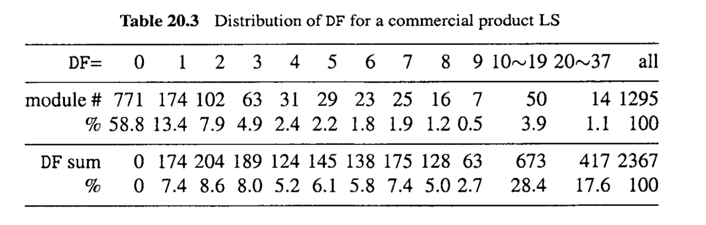
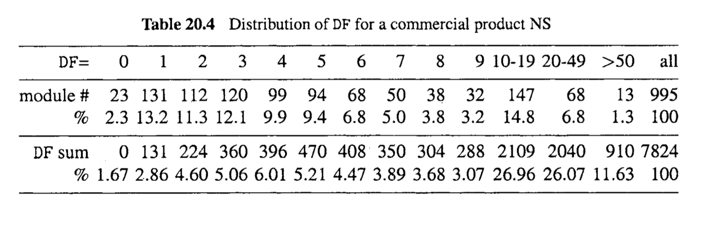
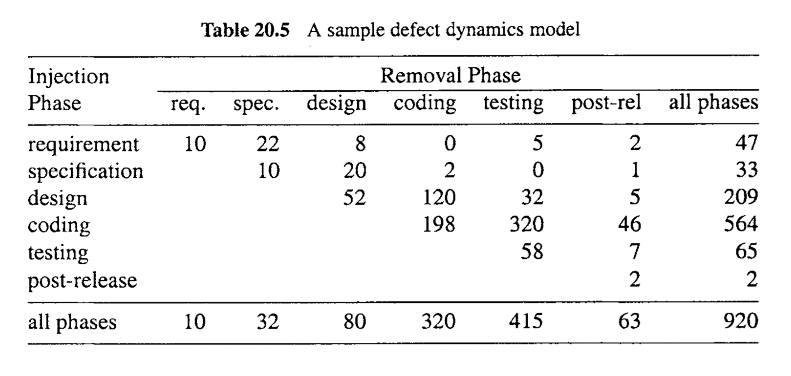
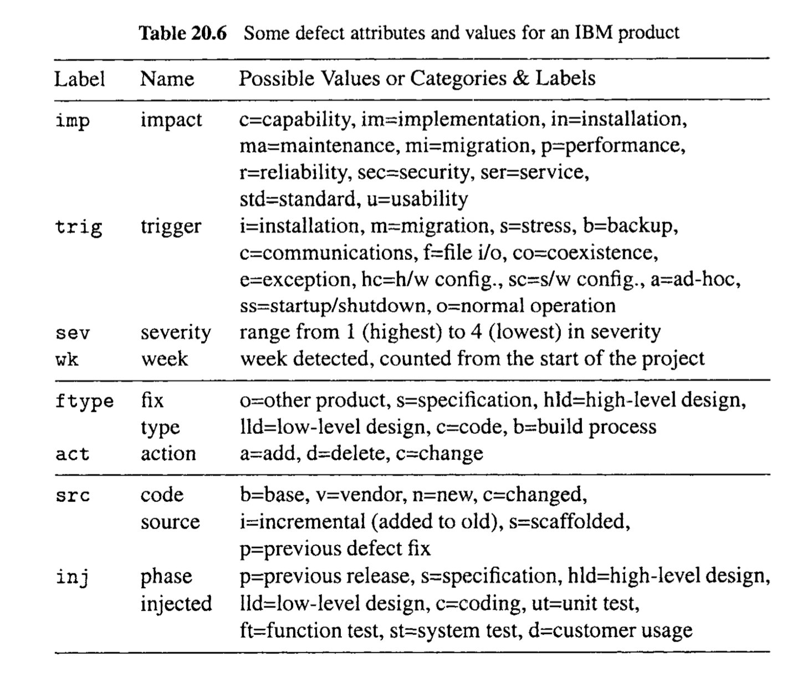
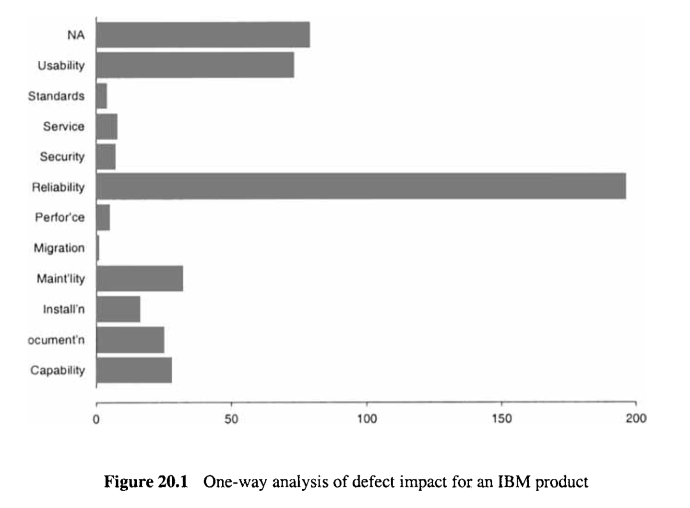
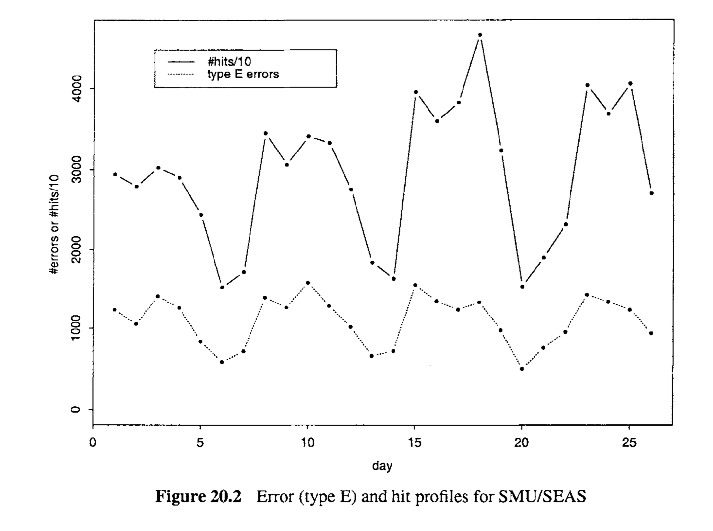
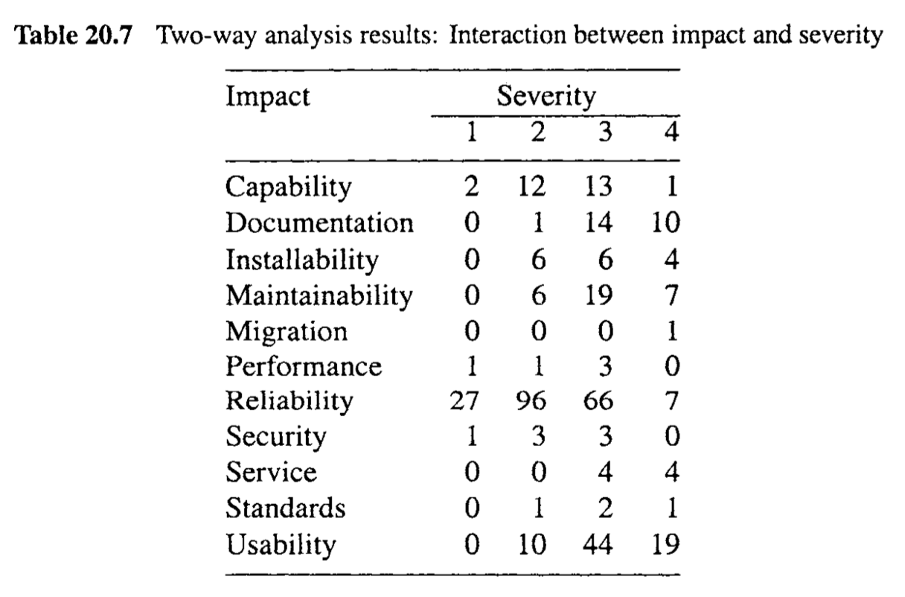

# Chapter 20 Defect Classification and Analysis

Analyses of discovered defects and related information from quality assurance (QA) activities can help both developers and testers to detect and remove potential defects, and help other project personnel to improve the development process, to prevent injection of similar defects and to manage risk better by planning early for product support and services. The defect data are typically collected from the main QA activities. Some additional details regarding the defects may need to be collected during this process or extracted from some system records to provide better quality assessments, predictions, or identification of problematic areas. We next discuss these topics, and illustrate them through several case studies analyzing defects from system testing for some IBM products, and web-related defects for www . seas. smu. edu, the official web site for the School of Engineering and Applied Science, Southern Methodist University (SMUKEAS).

> 通过分析质量保证（QA）活动中发现的缺陷及相关信息，可以帮助开发者和测试人员检测并消除潜在的缺陷，同时帮助其他项目人员改进开发流程，预防类似缺陷的注入，并通过提前规划产品支持和服务来更好地管理风险。缺陷数据通常来自主要的QA活动。在这一过程中，可能需要收集一些关于缺陷的额外细节，或从某些系统记录中提取，以提供更好的质量评估、预测或识别问题区域。接下来，我们将讨论这些主题，并通过几个案例研究来说明它们，这些案例研究分析了一些IBM产品系统测试中的缺陷，以及南卫理公会大学工程与应用科学学院（SMUKEAS）官方网站www.seas.smu.edu的网络相关缺陷。

## 20.1 GENERAL TYPES OF DEFECT ANALYSES

Once a defect is discovered, various individual analyses can be performed. When defect data are accumulated over time, collective analyses can be performed. Although these two forms of analysis have different focuses, the questions asked during the analyses are similar, including: 

* What? The identification and classification of the discovered defects can be performed to identify what they are and classify them by some consistent scheme. This topic is the focus of this chapter, which is discussed in all subsequent sections.
* Where? Where was the defect found or discovered? This information can be used to provide valuable feedback to the development process through defect distribution analysis.
* When? The identification of the exact time or associated development phase or subphase when a defect is injected and when it is discovered is important, because it provides information to analyze the overall defect trend and serves as the basis for quality prediction into the future. This topic is discussed later in this section, and finegrain defect timing analysis is covered in Chapter 22 as part of software reliability engineering.
* Pre- or post-release? An important extension to the “when” question is whether a defect is a pre-release defect or a post-release defect, sometimes labeled as an indevelopment (or in-process) or an in-field defect, respectively. Although the in-field defects are the ones experienced by actual customers or users, and should receive adequate attention, the scarcity of post-release data and business-sensitive information they might contain leave most existing software engineering research with the use of pre-release defect data only. This issue is discussed in relation to specific topics throughout this chapter.
* How and Why? How was the defect injected into the software, and why? These two questions are closely related, both pertaining to the cause of the discovered defects.

Notice that all the analyses listed above are applied to defect information as the primary target or focus. However, other information and measurements related to defect information are often needed in these analyses, although sometimes used implicitly. Each of these analyses, defect distribution, trend, and causal analyses, for the overall defect data are described below.

> 一旦发现缺陷，就可以执行各种个别分析。随着时间的推移，当缺陷数据积累到一定程度时，就可以进行集体分析。尽管这两种分析形式的关注点不同，但在分析过程中提出的问题是相似的，包括：
>
> - 什么？可以对发现的缺陷进行识别和分类，以确定它们是什么，并按照一些一致的方案进行分类。这个话题是本章的重点，在所有后续章节中都有讨论。
> - 哪里？缺陷是在哪里发现的？这一信息可以用来通过缺陷分布分析向开发过程提供宝贵的反馈。
> - 何时？确定缺陷注入的确切时间或相关的开发阶段或子阶段，以及发现的时间是重要的，因为它提供了分析整体缺陷趋势的信息，并作为未来质量预测的基础。这个话题将在本节后面讨论，而精细的缺陷时间分析将在第22章作为软件可靠性工程的一部分进行覆盖。
> - 发布前还是发布后？对于“何时”问题的一个重要扩展是缺陷是发布前缺陷还是发布后缺陷，有时被标记为开发中（或过程中）或现场缺陷。尽管现场缺陷是实际客户或用户所经历的，并应得到足够的关注，但发布后数据的稀缺性和它们可能包含的商业敏感信息使得大多数现有的软件工程研究只使用发布前缺陷数据。这个问题将在本章中与特定话题相关的讨论中提及。
> - 如何和为什么？缺陷是如何注入软件的，为什么会这样？这两个问题密切相关，都涉及到发现缺陷的原因。
>
> 请注意，上述所有分析都是针对缺陷信息作为主要目标或焦点进行的。然而，在这些分析中，通常需要其他与缺陷信息相关的信息和测量，尽管有时是隐式使用的。下面将描述针对整体缺陷数据的每项分析，包括缺陷分布、趋势和因果分析。

### 20.1.1 Defect distribution analysis

Defect distribution analyses can help us answer the what and where questions above. In answering the what question, we can find out the distribution of defects over different defect types, and if certain defect types are associated with an overwhelming share of the overall defects. If the latter is confirmed to be true, the identification of these dominant defect types can help us select appropriate remed.ia1 or corrective actions to effectively address the problems and improve product quality. Similarly, in answering the where question, we can find out the distribution of defects over different areas or product components, and if there are certain areas that are associated with an overwhelming share of the overall defects. If the latter is confirmed to be true, the identification of these high-defect areas can help us focus our remedial or corrective actions to effectively improve product quality.

The defect distribution analyses typically deal with faults or defect fixes instead of failures or errors we defined in Chapter 2. “Defect fixes” is typically used if actual fixing of discovered problem took place before defect analyses were performed, while “faults” can be used as long as it is identified (but not necessarily fixed already). Defect fixes, labeled D F  in this book, are in response to observed failures during testing or to discoveries of other problems during development or operation. We selected defect fixes instead of raw defect counts because much of the defect propagation information is captured in the former but not in the latter. Defect propagation is affected by the system structure, the interconnection among different components, and product evolution. DF  can be identified with specific modules, therefore permitting analysis and modeling using various software metrics defined on modules. Both the pre-release and post-release defect data can be analyzed and compared.

> ###  20.1.1 缺陷分布分析
>
> 缺陷分布分析可以帮助我们回答上述的“什么”和“哪里”问题。在回答“什么”问题时，我们可以找出不同缺陷类型的缺陷分布情况，以及是否有某些缺陷类型占据了绝大部分的整体缺陷。如果后者被证实为真，那么识别这些主导缺陷类型可以帮助我们选择适当的补救措施或纠正措施，以有效地解决问题并提高产品质量。类似地，在回答“哪里”问题时，我们可以找出不同区域或产品组件的缺陷分布情况，以及是否有某些区域占据了绝大部分的整体缺陷。如果后者被证实为真，那么识别这些高缺陷区域可以帮助我们集中我们的补救或纠正措施，以有效提高产品质量。
>
> 缺陷分布分析通常处理的是故障或缺陷修复，而不是我们在第2章中定义的失败或错误。如果在进行缺陷分析之前已经实际修复了发现的问题，通常使用“缺陷修复”；而只要识别了故障（但不一定已经修复），就可以使用“故障”。缺陷修复，在本书中标记为DF，是对测试期间观察到的失败或在开发或运行期间发现的其他问题的响应。我们选择缺陷修复而不是原始缺陷计数，因为前者而非后者捕获了大量的缺陷传播信息。缺陷传播受系统结构、不同组件之间的互连以及产品演变的影响。DF可以与特定模块关联，因此允许使用定义在模块上的各种软件度量进行分析和建模。可以分析和比较发布前和发布后的缺陷数据。

**What: Distribution over defect types**

For different product types or different application domains, the answer to the “what” question can be analyzed by examining the defect types defined accordingly. For example, the type of problems can be directly related to quality attributes, such as CUPRIMDS (capability, usability, performance, reliability, installation, maintenance, documentation, and service) used by IBM for their software products (Kan, 2002). Other information regarding the discovered defects can also be used to answer the “what” questions, as we describe late in connection with defect classification and analysis in Sections 20.2 and 20.3. 

As a concrete example, consider the defects for web-based applications. Using the terminology commonly adopted for WWW, the defects are actually operational failures labeled as web errors and recorded in web server error logs. For the www . seas. smu . edu web site, a total of 30760 errors were recorded for the 26 days covered by the web server logs (Kallepalli and Tian, 2001). The distribution of these errors by error types was summarized in Table 20.1. The first and immediate observation we can make from this distribution analysis is the highly uneven distribution of web errors (or defects in our terminology) over the different error types:

* The most dominant error type is type E, “file does not exist”, which accounts for 93.08% of all the errors recorded. 
* Type A errors, “permission denied”, account for 6.76% of the total errors. 
* All the rest 9 error types account for only 0.16%, a truly negligible share of the total.

Because of this overwhelming share of type E errors, subsequent studies were focused on this error type to assess and improve the quality for this web site.

> **
> 什么：缺陷类型的分布**
>
> 对于不同的产品类型或不同的应用领域，回答“什么”问题可以通过检查相应定义的缺陷类型来分析。例如，问题的类型可以直接与质量属性相关，如IBM用于其软件产品的CUPRIMDS（能力、可用性、性能、可靠性、安装、维护、文档和服务）（Kan, 2002）。有关发现的缺陷的其他信息也可以用来回答“什么”问题，我们将在第20.2节和20.3节与缺陷分类和分析的联系中进行描述。
>
> 作为一个具体的例子，考虑基于网络的应用程序的缺陷。使用通常针对WWW采用的术语，这些缺陷实际上是操作失败，被标记为网络错误，并记录在网络服务器错误日志中。对于www.seas.smu.edu网站，网络服务器日志覆盖的26天内记录了总共30760个错误（Kallepalli和Tian, 2001）。这些错误按错误类型的分布在表20.1中进行了总结。从这个分布分析中我们可以立即观察到的第一点是网络错误（或我们术语中的缺陷）在不同错误类型之间的分布高度不均：
>
> - 最主要的错误类型是类型E，“文件不存在”，占记录的所有错误的93.08%。
> - 类型A错误，“权限被拒”，占总错误的6.76%。
> - 其余9种错误类型仅占总数的0.16%，这是一个真正可以忽略不计的份额。
>
> 由于类型E错误占绝大多数，后续研究便集中在这种错误类型上，以评估和提高该网站的质量。

**Where: Distribution over defect locations**

When the defects are located, we can answer the “where” question. As an example to address the where question by distribution analysis, further analysis for the above web site was performed (Li and Tian, 2003). Since the missing files (Type E errors) are the main defect type, the question worthy of examination is: “What kind of files are missing?” The results are summarized in Table 20.2. Of the more than 100 different file types, the top five accounted for more than 98% of all the missing files. The identification of these missing file types, in connection with their access information, could lead to more focused web site maintenance effort to fix problems and improve web reliability.

> 当缺陷的位置被确定时，我们就可以回答“哪里”的问题。作为一个通过分布分析来解决“哪里”问题的示例，对上述网站进行了进一步分析（Li和Tian，2003）。由于丢失的文件（类型E错误）是主要的缺陷类型，值得考察的问题是：“丢失的是哪种文件？”结果总结在表20.2中。在100多种不同的文件类型中，前五名占所有丢失文件的98%以上。识别这些丢失文件类型，结合它们的访问信息，可能导致更专注的网站维护工作，以解决问题和提高网站的可靠性。

The most common type of distribution analyses to answer the where question is in connection with product components, such in the study of two IBM products LS and NS (Tian and Troster, 1998). Tables 20.3 and 20.4 summarize DF (defect fixes) distribution for LS and NS, respectively, giving the numbers and percentages of modules with given numbers of DF. Although high-defect modules are relatively few, they represent an overwhelming share of observed problems. For example, in LS, only 19.2% (248) of the modules have more than 2 DF (DF > 2), but they represent 84.0% (1989) of the total DF; while 58.8% of the modules are defect free. In NS, 20.5% (204) of the modules have more than 10 defect fixes, but represent 59.5% (4653) of the total fixes. This kind of uneven distribution is generally true for most software systems (Boehm and Basili, 2001).

> 对“哪里”问题进行的最常见的分布分析与产品组件有关，例如在两个IBM产品LS和NS的研究中（Tian和Troster，1998）。表20.3和20.4分别总结了LS和NS的DF（缺陷修复）分布，给出了具有给定数量DF的模块的数量和百分比。虽然高缺陷模块相对较少，但它们占观察到的问题的绝大部分。例如，在LS中，只有19.2%（248）的模块有超过2个DF（DF>2），但它们占总DF的84.0%（1989）；而58.8%的模块无缺陷。在NS中，20.5%（204）的模块有超过10个缺陷修复，但占总修复的59.5%（4653）。这种不均匀的分布通常对大多数软件系统都是适用的（Boehm和Basili，2001）。

**General observations about defect distribution**

Notice that in the above analysis, the generally uneven distribution of defects over types, areas, or product components points to the importance of focusing on the identification and strengthening of specific areas for focused quality improvement initiatives. Similar observations about uneven distributions by other defect attributes, such as severity, fix type, functionality, usage scenarios, etc., have also shown to be true (Chillarege et al., 1992). 

However, under most circumstances, we cannot wait until such defects are discovered and such uneven defect distribution has been confirmed to take actions. Instead, we need to find some way to identify such high-risk or potentially high-defect areas based on historical data. Applicable risk identification techniques and related issues are described in Chapter 21.

> 请注意，在上述分析中，缺陷在类型、区域或产品组件上的普遍不均匀分布突显了集中识别和加强特定区域以进行针对性质量改进的重要性。其他缺陷属性（如严重性、修复类型、功能性、使用场景等）的类似观察结果也显示为真实（Chillarege等人，1992）。
>
> 然而，在大多数情况下，我们不能等到这样的缺陷被发现并且这种不均匀的缺陷分布被确认后再采取行动。相反，我们需要找到一些方法，根据历史数据识别这些高风险或潜在的高缺陷区域。适用的风险识别技术和相关问题在第21章中描述。

### 20.1.2 Defect trend analysis and defect dynamics model

Most of the defect data contains some timing information. At a minimum, the discovered defect is classified as either pre-release or post-release. This information can be used to give us a general picture of the defect trend. When used with appropriate models, these data can provide us with the basis for prediction into the future. 

Sometimes, timing information for individual defects corresponds to some rough information about the development phases or sub-phases recorded in relevant defect records. When such information is available, we can examine the defect distribution over these phases or sub-phases, much like the distribution analysis described above, but with phases or sub-phases along some timeline. The defect removal model in the previous chapter can be considered an example of such a trend analysis. 

If the information about defect injection time is available, it can be used to augment the defect removal models into the so called defect dynamics model, where both the injection and removal of defects are tracked by development phases. This model is often represented as a matrix, such as in Table 20.5, with the rows corresponding to defect injections in each phase, and column corresponding to defect removals in each phase. The inner matrix is always an upper triangular matrix because the removal of a defect is always after its injection. The last row, summing up all the defects removed in different phases, actually gives us a defect removal model similar to the one given in the previous chapter. The last column, summing up all the defects injected in different phases, gives us information about where the major defect sources are in terms of when they are injected. 

> 大多数缺陷数据包含一些时间信息。最基本的，发现的缺陷被分类为发布前或发布后。这些信息可以用来给我们一个关于缺陷趋势的总体画面。当与适当的模型结合使用时，这些数据可以为我们预测未来提供基础。
>
> 有时，单个缺陷的时间信息对应于相关缺陷记录中记录的一些关于开发阶段或子阶段的粗略信息。当这种信息可用时，我们可以检查这些阶段或子阶段的缺陷分布，就像上面描述的分布分析一样，但是沿着某个时间线的阶段或子阶段。前一章中的缺陷移除模型可以被视为这种趋势分析的一个例子。
>
> 如果有关缺陷注入时间的信息可用，它可以用来增强缺陷移除模型，形成所谓的缺陷动态模型，其中缺陷的注入和移除都按开发阶段进行跟踪。这种模型通常表示为一个矩阵，如表20.5所示，行对应于每个阶段的缺陷注入，列对应于每个阶段的缺陷移除。内部矩阵始终是一个上三角矩阵，因为缺陷的移除总是在其注入之后。最后一行，总结了不同阶段移除的所有缺陷，实际上给出了一个与前一章中给出的类似的缺陷移除模型。最后一列，总结了不同阶段注入的所有缺陷，为我们提供了有关主要缺陷来源的信息，特别是它们何时被注入。

However, the cost of each defect injected in phase X and removed in phase Y is not uniform. Typically, the cost increases substantially with the increase of the distance between X and Y, or the number of phases when a defect lies dormant. Because a dormant defect might trigger the injection of other related defects, and the further away a defect is removed from when it is injected, the harder it gets to remove it because of all the intermediate decisions and actions applied that obscure the linkage between causes and effects. Consequently, the focus of defect dynamics models is typically on the off-diagonal ones, or those out-of-phase defect removals. In addition, when the post-release defect data are available, they deserve more attention as well, because these defects are the ones that escaped the software QA process to cause real damage to the customers and users. They also harm the development organizations’ reputation and may lead to product liability problems. 

When precise time information about the defect discoveries is available, it can be used in various models of greater precision to provide finer-grain or better quality predictions. For example, the Putnam model (Putnam, 1978) described in the previous chapter is an example of such a model. Various software reliability growth models (SRGMs) to be described in Chapter 22 can also be considered examples of fine-grain defect trend models. However, typically other measurement data, such as testing or usage activities, are needed for analyses with SRGMs. On the other hand, precise defect injection time information is typically impossible to obtain, depriving us of the fine-grain defect injection or defect dynamics models.

> 然而，每个在阶段X注入并在阶段Y移除的缺陷的成本并不相同。通常，随着X和Y之间距离的增加，或缺陷潜伏的阶段数的增加，成本会大幅上升。因为潜伏的缺陷可能会触发其他相关缺陷的注入，且缺陷从注入到移除的距离越远，由于所有中间的决策和行为掩盖了原因与结果之间的联系，移除它就越困难。因此，缺陷动态模型通常关注的是对角线之外的那些，或者是那些阶段外的缺陷移除。此外，当发布后缺陷数据可用时，也应该给予更多关注，因为这些缺陷是逃过软件QA过程，对客户和用户造成实际损害的缺陷。它们还会损害开发组织的声誉，并可能导致产品责任问题。
>
> 当关于缺陷发现的精确时间信息可用时，它可以用于各种更高精度的模型中，以提供更细粒度或更好质量的预测。例如，上一章中描述的普特南模型（Putnam, 1978）就是这样一个模型的例子。第22章将描述的各种软件可靠性增长模型（SRGM）也可以被视为细粒度缺陷趋势模型的例子。然而，通常需要其他测量数据，如测试或使用活动，才能进行SRGM的分析。另一方面，通常很难获得精确的缺陷注入时间信息，这使我们无法实现细粒度的缺陷注入或缺陷动态模型。

### 20.1.3  Defect causal analysis

Defect causal analysis can usually take two forms: logical analysis and statistical analysis. 
Logical analysis is a deterministic analysis that examines the logical link between the effects and the corresponding causes, and establishes general causal relations. Statistical analysis is a probabilistic analysis that examines the statistical link between causes and effects and deduces the probable causal relations between the two. 

The effects in the defect causal analysis can be either the observed failures or discovered (or fixed) faults, and the corresponding causes are the faults that caused the failures or the errors that caused the injection of the faults, respectively. The causal relations between faults and failures typically are determined by the developers or code owners who fix the code or design in response to failure observations during testing, inspection, or normal operational usage, as part of the normal development process where defects are fixed. The causal relations between errors and faults are typically determined through dedicated defect causal analysis beyond the normal development process. This kind of defect causal analysis, particularly its logical instead of the statistical variation, is also referred to as root cause analysis in literature. 

Root cause analysis is human intensive, and should be performed by experts with thorough knowledge about the product, the development process, the application domain, and the general environment. Sometimes, it can be integrated into the development or specific QA process. For example, in the Gilb inspection (Gilb and Graham, 1993) described in Chapter 14, a phase called process brainstorming is added between inspection meetings and follow-up actions. This process brainstorming is essentially a root cause analysis. Some-times, root cause analysis can be performed selectively, for example, for all the critical defects. 

Statistical analysis is based on empirical evidence collected either locally or from other similar projects. These empirical data can be fed to various models to establish the predictive relations between causes and effects. Once such causal relations are established, appropriate QA activities can then be selected and applied for fault or error removal. This kind of analyses employ various statistical models. For example, the simplest of such models is correlation analysis, which is often performed between defects and product internal measurements. For example, we may find that for a product, the number of defects per module may be closely correlated to module control flow complexity. Then we can conclude that high control flow complexity is probably the cause for the modules to have high defect, and focus our attention on the high-complexity modules in our QA activities even before defects are discovered. This risk focus, or focus on high-risk or potentially high-defect areas or product components, is the primary usage of statistical defect causal analysis. Various statistical analysis techniques for this purpose will be described in Chapter 21.

> 缺陷因果分析通常有两种形式：逻辑分析和统计分析。 逻辑分析是一种确定性分析，它考察效应与相应原因之间的逻辑联系，并建立一般的因果关系。统计分析是一种概率分析，它考察原因与效果之间的统计联系，并推断两者之间的可能因果关系。
>
> 在缺陷因果分析中的效应可以是观察到的失败或发现（或修复）的故障，相应的原因则是导致失败的故障或导致故障注入的错误。故障与失败之间的因果关系通常由开发者或代码所有者在测试、检查或正常操作使用期间响应失败观察而修复代码或设计时确定，作为正常开发过程的一部分，其中修复缺陷。错误与故障之间的因果关系通常通过超出正常开发过程的专门缺陷因果分析来确定。这种缺陷因果分析，特别是其逻辑而非统计变体，也被称为根本原因分析。
>
> 根本原因分析是人力密集型的，应由对产品、开发过程、应用领域和一般环境有透彻了解的专家进行。有时，它可以被整合到开发或特定的QA过程中。例如，在第14章描述的吉尔布检查（Gilb and Graham, 1993）中，一个称为过程头脑风暴的阶段被添加在检查会议和后续行动之间。这个过程头脑风暴本质上是一种根本原因分析。有时，根本原因分析可以有选择性地进行，例如，对所有关键缺陷进行分析。
>
> 统计分析基于从本地或其他类似项目收集的经验证据。这些经验数据可以输入到各种模型中，以建立原因和效果之间的预测关系。一旦建立了这种因果关系，就可以选择并应用适当的QA活动进行故障或错误的移除。这种分析使用各种统计模型。例如，这些模型中最简单的一个是相关性分析，通常在缺陷与产品内部测量之间进行。例如，我们可能发现对于一个产品，每个模块的缺陷数量可能与模块控制流复杂度密切相关。然后我们可以得出结论，高控制流复杂度可能是模块缺陷高的原因，因此在发现缺陷之前我们可以在QA活动中关注高复杂度模块。这种风险关注，或对高风险或潜在高缺陷区域或产品组件的关注，是统计缺陷因果分析的主要用途。第21章将描述用于此目的的各种统计分析技术。

## 20.2 DEFECT CLASSIFICATION AND ODC

When problems are encountered during operational use of a software or during development, various detailed information can be collected and recorded regarding the problems or the defects. Some part of this information is usually derived from explicit or implicit root cause analysis. Such information can be organized in a systematic way for further analyses, and the analysis results promise more valuable and specific feedback that pinpoint specific problematic areas for focused problem resolution and quality improvement. These analyses typically use statistical models. However, the causal analysis for individual defects and the statistical analysis for the collective defect data are typically used disjointly. 

The systematic classification and analysis of defect data bridge the gap between causal analysis and statistical quality control, and provide valuable in-process feedback to the development or maintenance process and help assure and improve product quality. Orthogonal defect classification, or ODC, developed initially at IBM (Chillarege et al., 1992), is the most influential among general frameworks for software defect classification and analysis. ODC has been successfully used in various industrial applications, to identify problematic areas, and to improve overall software product quality (Bhandari et al., 1993; Chaar et al., 1993; Tian and Henshaw, 1994).

> 在软件的操作使用或开发过程中遇到问题时，可以收集并记录关于这些问题或缺陷的各种详细信息。这些信息的一部分通常来源于显式或隐式的根本原因分析。这些信息可以有系统地组织起来进行进一步分析，分析结果提供更有价值和具体的反馈，精确指出特定的问题区域，以便集中解决问题并提高质量。这些分析通常使用统计模型。然而，对单个缺陷的因果分析和对集体缺陷数据的统计分析通常是分开使用的。
>
> 缺陷数据的系统分类和分析弥补了因果分析和统计质量控制之间的差距，并为开发或维护过程提供宝贵的过程中反馈，帮助确保和提高产品质量。正交缺陷分类（ODC），最初由IBM（Chillarege等人，1992）开发，是软件缺陷分类和分析的通用框架中最有影响力的一个。ODC已在各种工业应用中成功使用，用于识别问题区域，并提高整体软件产品质量（Bhandari等人，1993; Chaar等人，1993; Tian和Henshaw，1994）。

### 20.2.1 ODC concepts

ODC has a rich and extensive category of defect attributes, stemming from both the failure view and the fault view. The attributes related to the former are typically completed by software testers or inspectors who initially observed problems and opened defect reports; while those related to the latter are typically completed by the software developers or system maintenance personnel who fixed the reported problems and updated the corresponding defect reports. The defect attributes are organized in the following hierarchy:

* Key defect attributes from the failure view and information collected at defect discovery include: 
  * Defect impact, with attribute values covering functionality, reliability, etc.
  * Defect trigger, with attribute values corresponding to the specific types of testing or inspection activities or scenarios that triggered the defect detection. 
  * Defect severity, with commonly used attribute values: critical, major, minor, or 
    some numerical scale.

* Key information from the fault view collected at defect fixing includes:
  * Defect type, with attribute values: function, interface, algorithm, timing, etc.
  * Number of lines changed for the fixing.
* Some additional causal analyses might be carried out, and the related results also yield defect information and related attributes, such as:
  * Defect source, with attribute values: vendor code, new code, base code, etc.
  * Where the defect was injected, located to subsystems, modules, or components.
  * When the defect was injected, typically identified with the development phase.

A complete description of these defect attributes and related values can be found in Chillarege et al. (1992).

> ODC拥有丰富而广泛的缺陷属性类别，这些属性源自故障视角和错误视角。与前者相关的属性通常由最初观察到问题并开启缺陷报告的软件测试人员或检查员完成；而与后者相关的属性通常由修复报告问题并更新相应缺陷报告的软件开发人员或系统维护人员完成。缺陷属性按以下层次组织：
>
> - 来自故障视角的关键缺陷属性以及在缺陷发现时收集的信息包括：
>   - 缺陷影响，属性值涵盖功能性、可靠性等。
>   - 缺陷触发器，属性值对应于触发缺陷检测的特定类型的测试或检查活动或场景。
>   - 缺陷严重性，常用属性值：关键、主要、次要，或某种数值等级。
> - 在缺陷修复时收集的来自错误视角的关键信息包括：
>   - 缺陷类型，属性值：功能、接口、算法、时序等。
>   - 修复所改变的代码行数。
> - 可能进行一些额外的因果分析，相关结果也提供缺陷信息和相关属性，例如：
>   - 缺陷来源，属性值：供应商代码、新代码、基础代码等。
>   - 缺陷注入位置，定位到子系统、模块或组件。
>   - 缺陷注入时间，通常与开发阶段相关联。
>
> 这些缺陷属性和相关值的完整描述可以在Chillarege等人（1992）的研究中找到。

### 20.2.2 Defect classification using ODC: A comprehensive example

In an earlier study of defect classification and analysis for some relational database products from IBM (Tian and Henshaw, 1994), various defect attribute data according to ODC were collected in the system testing stage. Under this environment, once a defect is detected, a formal report (called Problem Tracking Report or PTR in IBM) is recorded and tracked until its final resolution. Various tools originally used to track defect reports were augmented to collect additional defect information related to ODC. Table 20.6 lists the defect attributes and pre-defined categories of possible values for each attribute.

The information, provided by testers at defect discovery, includes defect impact, trigger, severity, and defect detection time identified with week:

* Defect impact is based on the answers to the question: “If this defect is not fixed, how will it impact the customer?’ Pre-defined impact categories (possible answers) include performance, reliability, etc.
* Defect trigger categories closely resemble test scenario classes used for managing the testing process for this product. In fact, more detailed information is available using the hierarchical test case organization recorded in the test execution data we described in Table 7.1 (Chapter 7). 
* Defect severity can be 1 (critical problem), 2 (major problem), 3 (minor problem), and 4 (minor inconvenience). 
* The week when the defect is detected, counted from the start of the project.

The information collected at defect fixing pertains to the actions taken by the developers to locate, identify and correct the faults that caused detected failures:

* Fix type: fix to design, code, etc.

* Number of lines changed for the fixing. (Not shown in Table 20.6 because the values for this defect attribute are obvious.) 0 Fix action: adding, deleting, or changing to design or code. 

  

  

Some simple causal analyses were performed by the developers when they fix the reported defects, leading to the following causal analysis results recorded in the ODC data: 

* Defect source: vendor code, new code, base code, etc. 
* The development phase when the defect was injected: previous release or waterfalllike development phases in the current release.

> ###  20.2.2 使用ODC进行缺陷分类：一个综合示例
>
> 在IBM某些关系数据库产品的缺陷分类和分析的早期研究中（Tian和Henshaw, 1994），在系统测试阶段收集了根据ODC的各种缺陷属性数据。在这种环境下，一旦检测到缺陷，就会记录并跟踪一份正式报告（在IBM中称为问题跟踪报告或PTR），直到最终解决。最初用于跟踪缺陷报告的各种工具被增强，以收集与ODC相关的额外缺陷信息。表20.6列出了每个属性的缺陷属性和预定义的可能值类别。
>
> 测试人员在缺陷发现时提供的信息包括缺陷影响、触发器、严重性和与周相对应的缺陷检测时间：
>
> - 缺陷影响基于对以下问题的回答：“如果这个缺陷没有得到修复，它将如何影响客户？”预定义的影响类别（可能的答案）包括性能、可靠性等。
> - 缺陷触发器类别与用于管理该产品测试过程的测试场景类相似。实际上，使用我们在表7.1（第7章）中描述的分层测试用例组织记录的数据，可以获得更详细的信息。
> - 缺陷严重性可以是1（关键问题）、2（主要问题）、3（次要问题）和4（小不便）。
> - 缺陷检测时间是从项目开始算起的周数。
>
> 在缺陷修复时收集的信息涉及开发人员采取的行动来定位、识别和纠正导致检测到的故障的缺陷：
>
> - 修复类型：对设计、代码等的修复。
> - 修复时改变的代码行数。（在表20.6中未显示，因为这个缺陷属性的值是显而易见的。）修复行动：添加、删除或更改设计或代码。
> - 开发人员在修复报告的缺陷时进行了一些简单的因果分析，从而得出以下在ODC数据中记录的因果分析结果：
>   - 缺陷来源：供应商代码、新代码、基础代码等。
>   - 缺陷注入的开发阶段：前一版本或当前版本中的瀑布式开发阶段。

### 20.2.3 Adapting ODC to analyze web errors

For web-based applications, ODC-like defect classification can be defined and relevant defect data can be extracted from existing web server logs for analysis (Ma and Tian, 2003). The availability of such information in web logs is a significant advantage for this situation over traditional applications of ODC, where data collection is always a big hurdle that requires developers and testers to devote substantial time to analyze the defects and report the findings. Among the various ODC attributes, the following can be adapted for web problem analysis:

* Defect impact corresponds to web error type, which indicates what problem was experienced by web users. It can be analyzed directly based on information extracted from the error logs or from response code used in web access logs (Kallepalli and Tian, 2001). 
* Defect trigger corresponds to specific usage sequences or referrals that lead to problems recorded in the error logs. It can be analyzed by examining the referral pair information that can be extracted from the access logs (Ma and Tian, 2003). 
* Defect source corresponds to specific files or file types that need to be changed, added, or removed to fix problems recorded in the error logs. It can be analyzed by examining both the specific errors and referral pairs.

Various other attributes can also be adopted or adapted from the original ODC attributes through a close examination of the web environment and data availability. Such adaptation to different environments can help people analyze problems or issues of concern to them and fulfill different purposes. As an additional example, ODC has been adapted to help with ongoing requirement discovery in high-integrity systems (Lutz and Mikulski, 2004).

>   20.2.3 将ODC适用于分析网页错误
>
> 对于基于网络的应用程序，可以定义类似ODC的缺陷分类，并从现有的网络服务器日志中提取相关缺陷数据进行分析（Ma和Tian，2003）。与ODC的传统应用相比，网络日志中这类信息的可用性是一个显著的优势，传统应用中数据收集总是一个大难题，需要开发者和测试人员投入大量时间来分析缺陷并报告发现。在各种ODC属性中，以下几个可以适应于网络问题分析：
>
> - 缺陷影响对应于网络错误类型，它指示网络用户经历了什么问题。可以直接基于从错误日志或网络访问日志中使用的响应代码提取的信息进行分析（Kallepalli和Tian，2001）。
> - 缺陷触发器对应于特定的使用序列或引用，这些序列或引用导致错误日志中记录的问题。可以通过检查可以从访问日志中提取的引用对信息进行分析（Ma和Tian，2003）。
> - 缺陷来源对应于需要更改、添加或删除以修复错误日志中记录的问题的特定文件或文件类型。可以通过检查特定的错误和引用对来进行分析。
>
> 其他许多属性也可以通过仔细检查网络环境和数据可用性，从原始ODC属性中采用或适应。这种对不同环境的适应可以帮助人们分析他们关心的问题或问题，实现不同的目的。作为一个额外的例子，ODC已经被适用于帮助在高完整性系统中进行持续的需求发现（Lutz和Mikulski，2004）。

## 20.3 DEFECT ANALYSIS FOR CLASSIFIED DATA

Various techniques can be applied to analyze the classified data. The most obvious and most straightforward analyses are to apply defect distribution and trend analyses we described in Section 20.1 for unclassified defect data directly on classified data. In ODC terminology, this is called one-way analysis, because it examines one attribute at a time, either its overall distribution or its trend over time. Two-way analysis can be used to examine the crossinteraction of two attributes (Bhandari et al., 1993). Higher-order analysis is also possible, such as using tree-based modeling on all the ODC attributes (Tian and Henshaw, 1994). 

One fundamental assumption in all these analyses is that there exists an expected defect profile. The actual analysis results are supposedly compared to this profile, ranked by their differences to identify anomalies, or the ones with the greatest differences. These identified anomalies are analyzed by development personnel to see if they are expected; if not, some corrective actions need to be initiated to deal with the problems. However, under many application environments, such a profile does not exist. What is suggested is to use uniform distribution as the starting point, and gradually build such a defect profile for future use.

> ## 20.3 已分类数据的缺陷分析
>
> 可以应用各种技术来分析已分类的数据。最明显且最直接的分析是将我们在20.1节中描述的对未分类缺陷数据的缺陷分布和趋势分析直接应用于已分类数据。在ODC术语中，这被称为单向分析，因为它一次检查一个属性，无论是其整体分布还是随时间的趋势。双向分析可以用来检查两个属性的交互作用（Bhandari等人，1993）。也可以进行更高阶的分析，例如使用基于树的建模对所有ODC属性进行分析（Tian和Henshaw，1994）。
>
> 所有这些分析的一个基本假设是存在一个预期的缺陷概况。实际的分析结果应该与这个概况进行比较，根据它们的差异进行排名，以识别异常情况，或差异最大的情况。这些识别出的异常由开发人员分析，以查看它们是否符合预期；如果不符合预期，需要启动一些纠正措施来处理这些问题。然而，在许多应用环境下，这样的概况并不存在。建议的方法是使用均匀分布作为起点，并逐步构建这样的缺陷概况以供将来使用。

### 20.3.1 One-way analysis: Analyzing a single defect attribute

For each defect attribute, the overall distribution of its values can be examined. For example, Figure 20.1 gives the defect impact attribute distribution for the IBM product discussed in the previous section. The analysis shows that the distribution of defects among the different defect impact areas is very non-homogeneous. Expectedly, the largest proportion of defects is the reliability defects, representing 196 out of 474 overall failures, or 41% of the total share. The main reason is that the system testing is mainly concerned with the overall working and robustness of the product (that is, conformance to functional specifications). 

As another example, Table 20.1 gives us the overall distribution of the defect attribute error type for the web site www . seas. smu . edu. The overwhelming share of type E errors became the primary focus of follow-up studies on web defect analysis and quality improvement. 

When similar distribution data are available over time or different development phases, we can trace them to perform defect trend analysis. This analysis can be performed individually. For example, Figure 20.2 gives us the trend of type E errors for the SMU/SEAS web site over 26 days, with each day as a data point. Further analysis was performed to explain this profile by relating it to the number of daily hits (Kallepalli and Tian, 2001), also plotted in Figure 20.2. A clearly synchronized pattern is detected. This synchronized pattern can be captured by the input domain reliability model, such as the Nelson model (Nelson, 1978), to give us an estimate of the overall reliability under normal operational environment for this web site as R = 0.962 (or 96.2% reliable). Some additional details about this operational reliability analysis are presented in Chapter 22.

> 对于每个缺陷属性，可以检查其值的整体分布。例如，图20.1显示了前一节中讨论的IBM产品的缺陷影响属性分布。分析显示，不同缺陷影响区域之间的缺陷分布非常不均匀。预期地，最大比例的缺陷是可靠性缺陷，代表了474个总故障中的196个，或总份额的41%。主要原因是系统测试主要关注产品的整体工作和鲁棒性（即符合功能规范）。
>
> 作为另一个例子，表20.1给出了网站www.seas.smu.edu的缺陷属性错误类型的整体分布。类型E错误的压倒性比例成为了后续研究网络缺陷分析和质量改进的主要焦点。
>
> 当类似的分布数据随时间或不同开发阶段可用时，我们可以追踪它们来执行缺陷趋势分析。这种分析可以单独进行。例如，图20.2显示了SMU/SEAS网站在26天内类型E错误的趋势，每天作为一个数据点。进一步的分析是通过将其与每日点击量（Kallepalli和Tian，2001）相关联来解释这个轮廓，也在图20.2中绘制出来。检测到一个明显的同步模式。这种同步模式可以通过输入域可靠性模型（如纳尔逊模型（Nelson，1978））来捕获，以给出这个网站在正常运行环境下的总体可靠性估计为R = 0.962（或96.2%可靠）。关于这种操作可靠性分析的一些额外细节将在第22章中呈现。

### 20.3.2 Two-way and multi-way analysis: Examining cross-interactions

Two-way analysis examines the interaction between two attributes, and can be applied to all the attributes in pair-wise fashion. The simplest form of two-way analysis is the conditional analysis of an individual attribute under the condition of another attribute taking a specific value. For example, in the web error analysis example above for the SMU/SEAS web site, Table 20.2 gives the type E error distribution by file type. This can be interpreted as a two-way analysis for the two attributes: error type (type E as the condition here), and missing file type. 

When such conditional distribution analysis is carried out for every attribution values used as conditions, we get the full fledged two-way analysis. For example, Table 20.7 gives the two-way analysis results for the IBM product in the example above, with the defect attributes impact and severity examined together. Usability problems are the second most observed failure types (defect impact), second only to reliability problems, most of them are low in severity (severity 3 and 4). However, there are 27 critical reliability problems (severity 1). Therefore, this two-way analysis clearly demonstrated the need to focus on reliability problems at this stage of software development.

Following the general progression above from one-way analysis to two-way analysis, we can have general multi-way analysis. However, such analysis results are too numerous to track because of the combinatorial explosion of the multiple attributes, making it almost impossible to interpret and use the results for practical purposes. One way to cut down such combinatorial explosions is through the tree-based modeling technique to be described in Chapter 21. Our multi-way analysis for ODC data using tree-based modeling is also presented there.

> ### 20.3.2 双向及多向分析：检查交互作用
>
> 双向分析检查两个属性之间的相互作用，并且可以以成对方式应用于所有属性。双向分析的最简单形式是在另一个属性取特定值的条件下对一个单独属性进行条件分析。例如，在上述SMU/SEAS网站的网络错误分析中，表20.2给出了按文件类型分类的类型E错误分布。这可以被解释为两个属性之间的双向分析：错误类型（这里以类型E作为条件）和缺失文件类型。
>
> 当对每个作为条件使用的属性值进行此类条件分布分析时，我们得到了完整的双向分析。例如，表20.7给出了上述IBM产品的双向分析结果，其中缺陷属性影响和严重性一起检查。可用性问题是观察到的第二多的失败类型（缺陷影响），仅次于可靠性问题，其中大多数严重性较低（严重性3和4）。然而，有27个关键的可靠性问题（严重性1）。因此，这种双向分析清楚地展示了在软件开发的这一阶段需要关注可靠性问题的必要性。

## 20.4 CONCLUDING REMARKS

Analyses of discovered defects and related information can help both developers and testers to detect and remove potential defects, and help other project personnel to improve the development process, to prevent injection of similar defects, and to manage risk better by planning early for product support and services. As described in this chapter, these defect analyses can be performed at different levels of granularity and using different techniques:

* Overall defect distribution and trend analyses can give us an overall picture of product quality as well as some general areas for focused quality improvement. 
* Defect causal analysis can help us identify causes of execution failures or internal faults and help initiate quality improvement actions. It can also provide valuable data for various additional analyses. 
* Detailed classification and analysis of defect data, such as through ODC (orthogonal defect classification), can help us obtain more detailed information regarding potentially problematic areas to provide more specific and more valuable feedback to the software development or maintenance process for focused quality improvement.

No matter at what level we are performing the defect analysis, the general observation is that defects are typically concentrated in some specific areas instead of spread out evenly. 

Therefore, there is a strong need for analysis techniques and models that can help us identify these “high-risk” areas that are more likely to contain concentrated defects. We turn our attention to such risk identification techniques and related models in the next chapter.

> ##  20.4 结论性评论
>
> 对发现的缺陷及其相关信息的分析可以帮助开发者和测试人员检测并移除潜在的缺陷，同时帮助其他项目人员改进开发流程，预防类似缺陷的注入，并通过提前规划产品支持和服务来更好地管理风险。正如本章所描述的，这些缺陷分析可以在不同的粒度级别和使用不同的技术进行：
>
> - 整体缺陷分布和趋势分析可以给我们提供产品质量的总体画面，以及一些集中改进质量的一般领域。
> - 缺陷因果分析可以帮助我们识别执行失败或内部故障的原因，并帮助启动质量改进行动。它还可以为各种额外的分析提供宝贵的数据。
> - 通过ODC（正交缺陷分类）等方式对缺陷数据进行详细分类和分析，可以帮助我们获得关于潜在问题区域的更详细信息，为软件开发或维护过程提供更具体、更有价值的反馈，以集中改善质量。
>
> 无论我们在何种级别进行缺陷分析，普遍的观察是缺陷通常集中在某些特定区域，而不是均匀分布。
>
> 因此，强烈需要分析技术和模型来帮助我们识别这些更有可能包含集中缺陷的“高风险”区域。我们将在下一章关注这类风险识别技术和相关模型。
