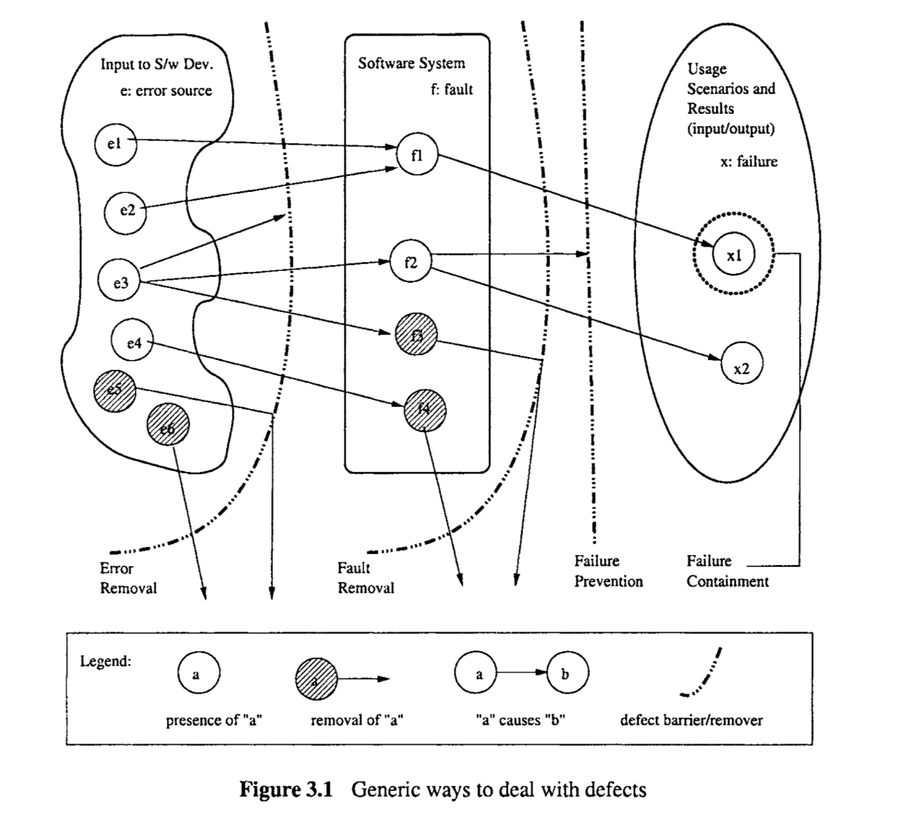

# Chapter 3 QUALITY ASSURANCE

质量保证

With the correctness-centered quality definitions adopted in the previous chapter for this book, the central activities for quality assurance (QA) can be viewed as to ensure that few, if any, defects remain in the software system when it is delivered to its customers or released to the market. Furthermore, we want to ensure that these remaining defects will cause minimal disruptions or damages. In this chapter, we survey existing QA alternatives and related techniques, and examine the specific ways they employ to deal with defects. 

> 在之前章节为本书采纳的以正确性为中心的质量定义中，质量保证（QA）的核心活动可以被视为确保在软件系统交付给客户或发布到市场时，留在系统中的缺陷少之又少，如果有的话。此外，我们想确保这些剩余的缺陷会造成最小的干扰或损害。在本章中，我们调查现有的QA替代方案和相关技术，并检查它们处理缺陷的具体方法。

Through this examination, we can abstract out several generic ways to deal with defects, which can then be used to classify these QA alternatives. Detailed descriptions and a general comparison of the related QA activities and techniques are presented in Part II and Part III.

> 通过这次检查，我们可以抽象出几种处理缺陷的通用方法，然后可以用这些方法来分类这些QA替代方案。第二部分和第三部分将提供相关QA活动和技术的详细描述和一般比较。

### 3.1 CLASSIFICATION: QA AS DEALING WITH DEFECTS

>  3.1 分类：QA作为处理缺陷

A close examination of how different QA alternatives deal with defects can yield a generic classification scheme that can be used to help us better select, adapt and use different QA alternatives and related techniques for specific applications. We next describe a classification scheme initially proposed in Tian (2001) and illustrate it with examples.

> 仔细检查不同QA替代方案处理缺陷的方式，可以产生一个通用的分类方案，帮助我们更好地选择、适应和使用特定应用的不同QA替代方案和相关技术。接下来我们描述一个最初在Tian（2001）中提出的分类方案，并用例子说明。

### A classification scheme

> 分类方案

With the defect definitions given in the previous chapter, we can view different QA activities as attempting to prevent, eliminate, reduce, or contain various specific problems associated with different aspects of defects. We can classify these QA alternatives into the following three generic categories:

> 根据前一章给出的缺陷定义，我们可以将不同的QA活动视为尝试通过错误阻止或错误源移除来预防、消除、减少或控制与不同缺陷方面相关的各种特定问题。我们可以将这些QA替代方案分类为以下三个通用类别：

* Defect prevention through error blocking or error source removal: These QA activities prevent certain types of faults from being injected into the software. Since errors are the missing or incorrect human actions that lead to the injection of faults into software systems, we can directly correct or block these actions, or remove the underlying causes for them. Therefore, defect prevention can be done in two generic ways:

  > **通过错误阻止或错误源移除进行缺陷预防**：这些QA活动防止某些类型的故障被注入到软件中。由于错误是导致故障注入软件系统的缺失或不正确的人为行为，我们可以直接纠正或阻止这些行为，或移除它们的潜在原因。因此，缺陷预防可以以两种通用方式进行：

  * Eliminating certain error sources, such as eliminating ambiguities or correcting human misconceptions, which are the root causes for the errors.

    > 消除某些错误源，例如消除模糊性或纠正人类的误解，这些是错误的根本原因。

  * Faultprevention or blocking by directly correcting or blocking these missing or incorrect human actions. This group of techniques breaks the causal relation between error sources and faults through the use of certain tools and technologies, enforcement of certain process and product standards, etc.

    > 通过直接纠正或阻止这些缺失或不正确的人为行为来进行故障预防或阻止。这组技术通过使用某些工具和技术，执行某些过程和产品标准等，打破错误源和故障之间的因果关系。

* Defect reduction through fault detection and removal: These QA alternatives detect and remove certain faults once they have been injected into the software systems. In fact, most traditional QA activities fall into this category. For example,

  * Inspection directly detects and removes faults from the software code, design, 
  * Testing removes faults based on related failure observations during program etc. 
    execution

  Various other means, based on either static analyses or observations of dynamic executions, can be applied to reduce the number of faults in a software system.

> **通过故障检测和移除进行缺陷减少**：这些QA替代方案在故障被注入到软件系统后检测并移除特定故障。事实上，大多数传统的QA活动都属于这一类。例如，
>
> - 检查直接从软件代码、设计中检测并移除故障，
> - 测试基于程序执行期间相关的失败观察来移除故障。
>
> 基于静态分析或动态执行的观察的其他各种方法，可以应用于减少软件系统中的故障数量。

Defect containment through failure prevention and containment: These containment measures focus on the failures by either containing them to local areas so that there are no global failures observable to users, or limiting the damage caused by software system failures. Therefore, defect containment can be done in two generic ways: 

* Some QA alternatives, such as the use of fault-tolerance techniques, break the causal relation between faults and failures so that local faults will not cause global failures, thus “tolerating” these local faults. 

- A related extension to fault-tolerance is containment measures to avoid catastrophic consequences, such as death, personal injury, and severe property or environmental damages, in case of failures. For example, failure containment for real-time control software used in nuclear reactors may include concrete walls to encircle and contain radioactive material in case of reactor melt-down due to software failures, in order to prevent damage to environment and people’s health.

> **通过失败预防和控制进行缺陷容忍**：这些控制措施关注失败，通过将它们限制在局部区域以便用户无法观察到全局失败，或限制软件系统失败造成的损害。因此，缺陷容忍可以以两种通用方式进行：
>
> - 一些QA替代方案，如使用容错技术，打破故障和失败之间的因果关系，使得局部故障不会导致全局失败，从而“容忍”这些局部故障。
> - 与容错相关的扩展是控制措施，以避免失败导致的灾难性后果，例如死亡、人身伤害和严重的财产或环境损害。例如，对于使用在核反应堆中的实时控制软件的失败控制可能包括混凝土墙围绕和控制放射性物质，以防软件失败导致的反应堆熔毁，以防止对环境和人类健康造成损害。

### Dealing with pre-/post-release defects

> 处理发布前/发布后的缺陷

Different QA alternatives can be viewed as a concerted effort to deal with errors, faults, or failures, in order to achieve the common goal of quality assurance and improvement.  Defect prevention and defect reduction activities directly deal with the competing processes of defect injection and removal during the software development process (Humphrey, 1995). 

> 不同的QA替代方案可以被视为协同努力处理错误、故障或失败，以实现质量保证和改进的共同目标。缺陷预防和缺陷减少活动直接处理软件开发过程中的缺陷注入和移除的竞争过程（Humphrey，1995）

They affect the defect contents, or the number of faults, in the finished software products by working to reduce the pre-release defect injections or to remove as many such defects as possible before product release. The faults left in the finished software products are often called “dormant defects”, which may stay dormant for some time, but have the potential of causing problems to customers and users of the products a situation that we would like to alleviate or avoid. Further analyses of different types of defects can be found in Chapter 20. Related techniques to identify high-risk areas for focused defect reduction and QA can be found in Chapter 21. 

> 它们通过在发布前减少缺陷注入或在产品发布前尽可能多地移除这些缺陷，影响完成的软件产品中的缺陷内容，即故障数量。在完成的软件产品中留下的故障通常被称为“休眠缺陷”，这些缺陷可能会休眠一段时间，但有可能给产品的客户和用户带来问题，这是我们希望缓解或避免的情况。第20章将进一步分析不同类型的缺陷。第21章将介绍识别高风险区域以聚焦缺陷减少和QA的相关技术。

After product release, the failures observed and problems reported by customers and users also need to be fixed, which in turn, could lead to reduced defects and improved product quality. However, one cannot rely on these post-release problem reports and give up pre-release defect prevention and reduction activities, because the cost of fixing defects after product release is significantly higher than before product release due to the numerous installations. In addition, the damage to software vendors’ reputation can be devastating. Controlled field testing, commonly referred to as “beta testing”, and similar techniques discussed further in Chapter 12 have been suggested and used to complement pre-release QA activities. Related process issues are discussed in Chapter 4. 

> 产品发布后，客户和用户观察到的失败和报告的问题也需要被修复，这反过来，可以导致减少缺陷和提高产品质量。然而，人们不能依赖这些发布后的问题报告，并放弃发布前的缺陷预防和减少活动，因为产品发布后修复缺陷的成本由于众多安装显著高于发布前。此外，对软件供应商声誉的损害可能是毁灭性的。常见的受控场测试，通常称为“beta测试”，以及第12章进一步讨论的类似技术已被建议和使用以补充发布前的QA活动。相关的过程问题在第4章中讨论。

On the other hand, defect containment activities aim at minimizing the negative impact of these remaining faults during operational use after product release. However, most of the defect containment techniques involve redundancies or duplications, and require significantly more development effort to design and implement related features. Therefore, they are typically limited to the situations where in-field failures are associated with substantial damage, such as in corporate-wide database for critical data, global telecommunication networks, and various computer-controlled safety critical systems such as medical devices and nuclear reactors. The details about these issues can be found in Chapter 16.

> 另一方面，缺陷容忍活动旨在最小化这些剩余故障在产品发布后操作使用期间的负面影响。然而，大多数缺陷容忍技术涉及冗余或重复，并且需要显著更多的开发努力来设计和实现相关特性。因此，它们通常限于在现场失败与严重损害相关联的情况，例如在关键数据的企业级数据库、全球电信网络以及医疗设备和核反应堆等各种计算机控制的安全关键系统中。这些问题的细节可以在第16章中找到。

### Graphical depiction of  the classification scheme

The above QA activity classification can be illustrated in Figure 3.1, forming a series of barriers represented by dotted broken lines. Each barrier removes or blocks defect sources, or prevents undesirable consequences. Specific information depicted includes:

> 上述QA活动分类可以用图3.1来示意，形成一系列由点状虚线表示的屏障。每个屏障移除或阻止缺陷源，或防止不希望的后果。具体描绘的信息包括：

* The barrier between the input to software development activities (left box) and the software system (middle box) represents defect prevention activities. 
* The curved barrier between the software system (middle box) and the usage scenario and observed behavior (right box) represents defect or fault removal activities such as inspection and testing. 
* The straight barrier to the right of and close to the above fault removal barrier represents failure prevention activities such as fault tolerance. 
* The last barrier, surrounding selected failure instances,represents failure containment activities.

> - 软件开发活动输入（左框）和软件系统（中框）之间的屏障代表缺陷预防活动。
> - 软件系统（中框）和使用场景及观察到的行为（右框）之间的曲线屏障代表缺陷或故障移除活动，如检查和测试。
> - 上述故障移除屏障右侧且靠近的直线屏障代表失败预防活动，如容错。
> - 最后的屏障，围绕选定的失败实例，代表失败容纳活动。

In Figure 3.1, faults are depicted as circled entities within the middle box for the software system. Error sources are depicted as circled entities within the left box for the input to the software development activities. Failures are depicted as the circled instances within the right box for usage scenarios and execution results. Figure 3.1 also shows the relationship between these QA activities and related errors, faults, and failures through some specific examples, as follows:

> 在图3.1中，故障被描绘为软件系统中框内的带圈实体。错误源被描绘为软件开发活动输入左框内的带圈实体。失败被描绘为使用场景和执行结果右框内的带圈实例。图3.1还通过一些具体示例展示了这些QA活动与相关错误、故障和失败之间的关系，如下：

* Some of the human conceptual errors, such as error source e6, are directly removed by error source removal activities, such as through better education to correct the specific human conceptual mistakes. 
* Other incorrect actions or errors, such as some of those caused by error source e3 and e5, are blocked. If an error source can be consistently blocked, such as e5, it is equivalent to being removed. On the other hand, if an error source is blocked sometimes, such as e3, additional or alternative defect prevention techniques need to be used, similar to the situation for other error sources such as e l ,  e2, and e4, where faults are likely to be injected into the software system because of these error sources. 
* Some faults, such as f4, are detected directly through inspection or other static analysis and removed as a part of or as follow-up to these activities, without involving the observation of failures. 
* Other faults, such as f3, are detected through testing or other execution-based QA alternatives by observing their dynamic behavior. If a failure is observed in these QA activities, the related faults are located by examining the execution record and removed as a part of or as follow-up to these activities. Consequently, no operational failures after product release will be caused by these faults.
* Still other faults, such asfl, are blocked through fault tolerance for some execution instances. However, fault-tolerance techniques typically do not identify and fix the underlying faults. Therefore, these faults could still lead to operational failures under different dynamic environments, such as f2  leading to x2. 
* Among the failure instances, failure containment strategy may be applied for those with severe consequences. For example, x1 is such an instance, where ==failure containment== is applied to it, as shown by the surrounding dotted circle.

We next survey different QA alternatives, organized in the above classification scheme, and provide pointers to related chapters where they are described in detail.

> - 一些人类概念性错误，如错误源e6，直接通过错误源移除活动被移除，例如通过更好的教育来纠正特定的人类概念错误。
> - 其他不正确的行为或错误，如一些由错误源e3和e5引起的，被阻止。如果一个错误源可以被一致地阻止，如e5，这相当于被移除。另一方面，如果一个错误源有时被阻止，如e3，则需要使用额外的或替代的缺陷预防技术，类似于其他错误源如e1、e2和e4的情况，这些错误源可能导致故障注入软件系统。
> - 一些故障，如f4，通过检查或其他静态分析直接被检测并作为这些活动的一部分或后续活动被移除，而不涉及失败的观察。
> - 其他故障，如f3，通过测试或其他基于执行的QA替代方案通过观察它们的动态行为被检测。如果在这些QA活动中观察到失败，相关故障通过检查执行记录被定位并作为这些活动的一部分或后续活动被移除。因此，这些故障不会导致产品发布后的运营失败。
> - 还有其他故障，如f1，通过容错为一些执行实例被阻止。然而，容错技术通常不识别并修复潜在的故障。因此，这些故障在不同的动态环境下仍然可能导致运营失败，例如f2导致x2。
> - 在失败实例中，对于那些有严重后果的，可以应用失败容纳策略。例如，x1就是这样一个实例，在它上应用了失败容纳，如周围的点状圆圈所示。
>
> 接下来，我们将调查在上述分类方案中组织的不同QA替代方案，并提供指向详细描述它们的相关章节的指针。

## 3.2 DEFECT PREVENTION

The QA alternatives commonly referred to as defect prevention activities can be used for most software systems to reduce the chance for defect injections and the subsequent cost to deal with these injected defects. Most of the defect prevention activities assume that there are known error sources or missinghncorrect actions that result in fault injections, as follows:

* If human misconceptions are the error sources, education and training can help us remove these error sources. 
* If imprecise designs and implementations that deviate from product specifications or design intentions are the causes for faults, formal methods can help us prevent such deviations. 
* If non-conformance to selected processes or standards is the problem that leads to fault injections, then process conformance or standard enforcement can help use prevent the injection of related faults. 
* If certain tools or technologies can reduce fault injections under similar environments, they should be adopted.

Therefore, root cause analyses described in Chapter 21 are needed to establish these preconditions, or root causes, for injected or potential faults, so that appropriate defect prevention activities can be applied to prevent injection of similar faults in the future. Once such causal relations are established, appropriate QA activities can then be selected and applied for defect prevention.

> 常见的作为缺陷预防活动的QA替代方案可以用于大多数软件系统，以减少缺陷注入的机会和随后处理这些注入缺陷的成本。大多数缺陷预防活动假设存在已知的错误源或缺失/不正确的行为，这些导致了故障注入，如下所示：
>
> - 如果人类的误解是错误源，教育和培训可以帮助我们消除这些错误源。
> - 如果不精确的设计和实现偏离了产品规范或设计意图是导致故障的原因，正式方法可以帮助我们防止此类偏差。
> - 如果不符合选定过程或标准是导致故障注入的问题，那么过程符合性或标准执行可以帮助我们防止相关故障的注入。
> - 如果某些工具或技术可以在类似环境下减少故障注入，那么应该采用这些工具或技术。
>
> 因此，需要进行第21章中描述的根本原因分析，以建立这些注入或潜在故障的前提条件或根本原因，从而可以应用适当的缺陷预防活动来预防未来类似故障的注入。一旦建立了这种因果关系，就可以选择和应用适当的QA活动进行缺陷预防。

### 3.2.1 Education and training

Education and training provide people-based solutions for error source elimination. It has long been observed by software practitioners that the people factor is the most important factor that determines the quality and, ultimately, the success or failure of most software projects. Education and training of software professionals can help them control, manage, and improve the way they work. Such activities can also help ensure that they have few, if any, misconceptions related to the product and the product development. The elimination of these human misconceptions will help prevent certain types of faults from being injected into software products. The education and training effort for error source elimination should focus on the following areas:

* Product and domain-specific knowledge. If the people involved are not familiar with the product type or application domain, there is a good chance that wrong solutions will be implemented. For example, developers unfamiliar with embedded software may design software without considering its environmental constraints, thus leading to various interface and interaction problems between software and its physical surroundings. 
* Software development knowledge and expertise plays an important role in developing high-quality software products. For example, lack of expertise with requirement analysis and product specification usually leads to many problems and rework in subsequent design, coding, and testing activities.
* Knowledge about Development methodology, technology, and tools also plays an important role in developing high-quality software products. For example, in an implementation of Cleanroom technology (Mills et al., 1987b), if the developers are not familiar with the key components of formal verification or statistical testing, there is little chance for producing high-quality products. 
* Development process knowledge. If the project personnel do not have a good understanding of the development process involved, there is little chance that the process can be implemented correctly. For example, if the people involved in incremental software development do not know how the individual development efforts for different increments fit together, the uncoordinated development may lead to many interface or interaction problems.

> 教育和培训为错误源的消除提供了基于人的解决方案。长期以来，软件实践者已经观察到，人的因素是决定大多数软件项目的质量和最终成功或失败的最重要因素。对软件专业人员的教育和培训可以帮助他们控制、管理和改善他们的工作方式。这样的活动也可以帮助确保他们很少或根本没有与产品和产品开发相关的误解。消除这些人类的误解将有助于防止特定类型的故障被注入到软件产品中。为错误源消除的教育和培训工作应该关注以下领域：
>
> - 产品和特定领域的知识。如果涉及的人不熟悉产品类型或应用领域，很有可能会实施错误的解决方案。例如，不熟悉嵌入式软件的开发人员可能在设计软件时未考虑其环境约束，从而导致软件与其物理环境之间的各种接口和交互问题。
> - 软件开发知识和专长在开发高质量软件产品中起着重要作用。例如，缺乏需求分析和产品规范的专业知识通常会导致后续设计、编码和测试活动中的许多问题和返工。
> - 关于开发方法、技术和工具的知识也在开发高质量软件产品中起着重要作用。例如，在实施Cleanroom技术时（Mills等，1987b），如果开发人员不熟悉正式验证或统计测试的关键组成部分，生产高质量产品的可能性就很小。
> - 开发过程知识。如果项目人员对所涉及的开发过程理解不足，那么正确实施该过程的可能性就很小。例如，如果参与增量软件开发的人不知道不同增量的个别开发工作如何组合在一起，不协调的开发可能会导致许多接口或交互问题。

### 3.2.2  Formal method

> 3.2.2 正式方法

==Formal methods provide a way to eliminate certain error sources and to verify the absence of related faults. Formal development methods, or formal methods in short, include formal specification and formal verification.== Formal specification is concerned with producing an unambiguous set of product specifications so that customer requirements, as well as environmental constraints and design intentions, are correctly reflected, thus reducing the chances of accidental fault injections. Formal verification checks the conformance of software design or code against these formal specifications, thus ensuring that the software is fault-free with respect to its formal specifications.

> 正式方法提供了一种消除特定错误源和验证相关故障不存在的方法。简而言之，正式开发方法或正式方法包括正式规范和正式验证。正式规范关注于生成一套明确无误的产品规范，以正确反映客户需求、环境约束和设计意图，从而减少意外故障注入的机会。正式验证检查软件设计或代码与这些正式规范的一致性，从而确保软件相对于其正式规范无故障。

Various techniques exist to specify and verify the “correctness” of software systems, namely, to answer the questions: “What is the correct behavior?”, and “How to verify it?’ We will describe some of these techniques in Chapter 15, with the basic ideas briefly introduced below.

> 存在各种技术来指定和验证软件系统的“正确性”，即回答“什么是正确的行为？”和“如何验证它？”的问题。我们将在第15章描述其中的一些技术，以下是基本思想简要介绍。

* The oldest and most influential formal method is the so-call axiomatic approach (Hoare, 1969; Zelkowitz, 1993). In this approach, the “meaning” of a program element or the formal interpretation of the effect of its execution is abstracted into an axiom. Additional axioms and rules are used to connect different pieces together.  A set of formal conditions describing the program state before the execution of a program is called its pre-conditions, and the set after program execution the postconditions. This approach verifies that a given program satisfies its prescribed preand post-conditions.
* Other influential formal verification techniques include the predicate transformer based on weakest precondition ideas (Dijkstra, 1975; Gries, 1987), and program calculus or functional approach heavily based on mathematical functions and symbolic executions (Mills et al., 1987a). The basic ideas are similar to the axiomatic approach, but the proof procedures are somewhat different.
* Various other limited scope or semi-formal techniques also exist, which check for certain properties instead of proving the full correctness of programs. For example, model checking techniques are gaining popularity in the software engineering research community (Ghezzi et al., 2003). Various semi-formal methods based on forms or tables, such as (Parnas and Madey, 1995), instead of formal logic or mathematical functions, have found important applications as well.

==So far, the biggest obstacle to formal methods is the high cost associated with the difficult task of performing these human intensive activities correctly without adequate automated support. This fact also explains, to a degree, the increasing popularity of limited scope and semi-formal approaches.==

> - 最古老和最有影响力的正式方法是所谓的公理方法（Hoare，1969；Zelkowitz，1993）。在这种方法中，程序元素的“含义”或其执行效果的正式解释被抽象成一个公理。使用额外的公理和规则将不同的部分连接在一起。描述程序执行前状态的一组正式条件称为其前置条件，程序执行后的状态集称为后置条件。这种方法验证给定程序满足其规定的前置和后置条件。
> - 其他有影响的正式验证技术包括基于最弱前提条件思想的谓词变换器（Dijkstra，1975；Gries，1987），以及基于数学函数和符号执行的程序演算或功能方法（Mills等，1987a）。基本思想类似于公理方法，但证明程序稍有不同。
> - 还存在各种有限范围或半正式技术，这些技术检查某些属性而不是证明程序的完全正确性。例如，模型检查技术在软件工程研究社区中越来越受欢迎（Ghezzi等，2003）。基于表格或表格的各种半正式方法，如（Parnas和Madey，1995），而不是正式逻辑或数学函数，也发现了重要应用。
>
> 到目前为止，正式方法的最大障碍是与执行这些人力密集型活动的艰难任务相关的高成本，没有足够的自动化支持。这也在一定程度上解释了有限范围和半正式方法日益增长的受欢迎程度。

### 3.2.3 Other defect prevention techniques

Other defect prevention techniques, to be described in Chapter 13, including those based on technologies, tools, processes, and standards, are briefly introduced below:

* Besides the formal methods surveyed above, appropriate use of other software methodologies or technologies can also help reduce the chances of fault injections. Many of the problems with low quality “fat software” could be addressed by disciplined methodologies and return to essentials for high-quality “lean software” (Wirth, 1995). Similarly, the use of the information hiding principle (Parnas, 1972) can help reduce the complexity of program interfaces and interactions among different components, thus reducing the possibility of related problems.
* A better managed process can also eliminate many systematic problems. For example, not having a defined process or not following it for system configuration management may lead to inconsistencies or interface problems among different software components. Therefore, ensuring appropriate process definition and conformance helps eliminate some such error sources. Similarly, enforcement of selected standards for certain types of products and development activities also reduces fault injections.
* Sometimes, specific software tools can also help reduce the chances of fault injections. For example, a syntax-directed editor that automatically balances out each open parenthesis, “{”, with a close parenthesis, “}”, can help reduce syntactical problems in programs written in the C language.

Additional work is needed to guide the selection of appropriate processes, standards, tools, and technologies, or to tailor existing ones to fit the specific application environment. 
Effective monitoring and enforceqent systems are also needed to ensure that the selected processes or standards are followed, or the selected tools or technologies are used properly, to reduce the chance of fault injections.

> 其他缺陷预防技术，将在第13章中描述，包括基于技术、工具、流程和标准的方法，以下简要介绍：
>
> - 除了上述的正式方法，适当使用其他软件方法学或技术也可以帮助减少故障注入的机会。许多低质量“臃肿软件”的问题可以通过有纪律的方法学和回归到高质量“精简软件”的基本要素来解决（Wirth，1995）。同样，使用信息隐藏原则（Parnas，1972）可以帮助减少程序接口和不同组件之间交互的复杂性，从而减少相关问题的可能性。
> - 更好的管理流程也可以消除许多系统性问题。例如，没有定义流程或不遵循系统配置管理的流程可能会导致不同软件组件之间的不一致性或接口问题。因此，确保适当的流程定义和符合性有助于消除一些此类错误源。同样，对某些类型的产品和开发活动执行选定的标准也可以减少故障注入。
> - 有时，特定的软件工具也可以帮助减少故障注入的机会。例如，一个自动平衡每个开括号“{”和闭括号“}”的语法指导编辑器可以帮助减少用C语言编写的程序中的语法问题。
>
> 需要额外的工作来指导选择适当的流程、标准、工具和技术，或者根据特定的应用环境调整现有的方法。 还需要有效的监控和执行系统，以确保遵循选定的流程或标准，或者正确使用选定的工具或技术，以减少故障注入的机会。

## 3.3 DEFECT REDUCTION

For most large software systems in use today, it is unrealistic to expect the defect prevention activities surveyed above to be 100% effective in preventing accidental fault injections.  Therefore, we need effective techniques to remove as many of the injected faults as possible under project constraints.

> 对于当今使用的大多数大型软件系统，期望上述缺陷预防活动能够100%有效地防止意外故障注入是不现实的。因此，我们需要有效的技术在项目约束下尽可能多地移除注入的故障

### 3.3.1 Inspection: Direct fault detection and removal

> 3.3.1 检查：直接故障检测和移除

Software inspections are critical examinations of software artifacts by human inspectors aimed at discovering and fixing faults in the software systems. Inspection is a well-known QA alternative familiar to most experienced software quality professionals. The earliest and most influential work in software inspection is Fagan inspection (Fagan, 1976). Various other variations have been proposed and used to effectively conduct inspection under different environments. A detailed discussion about inspection processes and techniques, applications and results, and many related topics can be found in Chapter 14. The basic ideas of inspection are outlined below: 

> 软件检查是由人类检查员对软件构件进行的关键性检查，旨在发现并修复软件系统中的故障。检查是一种众所周知的QA替代方案，大多数有经验的软件质量专业人士都熟悉。软件检查中最早和最有影响的工作是Fagan检查（Fagan，1976）。已经提出并使用了各种其他变体来在不同环境下有效进行检查。第14章将详细讨论检查过程和技术、应用和结果以及许多相关主题。检查的基本思想概述如下：

* Inspections are critical reading and analysis of software code or other software artifacts, such as designs, product specifications, test plans, etc. 
* Inspections are typically conducted by multiple human inspectors, through some coordination process. Multiple inspection phases or sessions might be used. 
* Faults are detected directly in inspection by human inspectors, either during their individual inspections or various types of group sessions. 
* Identified faults need to be removed as a result of the inspection process, and their removal also needs to be verified. 
* The inspection processes vary, but typically include some planning and follow-up activities in addition to the core inspection activity. 
* The formality and structure of inspections may vary, from very informal reviews and walkthroughs, to fairly formal variations of Fagan inspection, to correctness inspections approaching the rigor and formality of formal methods.

==Inspection is most commonly applied to code, but it could also be applied to requirement specifications, designs, test plans and test cases, user manuals, and other documents or software artifacts. Therefore, inspection can be used throughout the development process, particularly early in the software development before anything can be tested. Consequently, inspection can be an effective and economical QA alternative because of the much increased cost of fixing late defects as compared to fixing early ones.==

Another important potential benefit of inspection is the opportunity to conduct causal analysis during the inspection process, for example, as an added step in Gilb inspection (Gilb and Graham, 1993). These causal analysis results can be used to guide defect prevention activities by removing identified error sources or correcting identified missing/incorrect human actions. These advantages of inspection will be covered in more detail in Chapter 14 and compared to other QA alternatives in Chapter 17.

> - 检查是对软件代码或其他软件构件（如设计、产品规范、测试计划等）的关键阅读和分析。
> - 检查通常由多名人类检查员通过某种协调过程进行。可能使用多个检查阶段或会议。
> - 故障是在检查中由人类检查员直接检测到的，无论是在他们的个别检查中还是在各种类型的小组会议中。
> - 检查过程中确定的故障需要被移除，且其移除也需要被验证。
> - 检查过程各不相同，但通常除了核心检查活动外，还包括一些规划和后续活动。
> - 检查的形式和结构可能不同，从非常非正式的审查和走查，到相当正式的Fagan检查的变体，再到接近正式方法的严格和形式性的正确性检查。
>
> 检查最常应用于代码，但也可以应用于需求规范、设计、测试计划和测试用例、用户手册以及其他文档或软件构件。因此，检查可以在整个开发过程中使用，特别是在软件开发的早期，当任何东西都还不能被测试时。因此，由于修复晚期缺陷的成本远高于早期缺陷，检查可以是一种有效且经济的QA替代方案。
>
> 检查的另一个重要潜在好处是在检查过程中进行因果分析的机会，例如，在Gilb检查（Gilb和Graham，1993）中作为一个额外步骤。这些因果分析结果可以用来指导缺陷预防活动，通过移除已识别的错误源或纠正已识别的缺失/不正确的人为行为。第14章将更详细地讨论检查的这些优势，并在第17章与其他QA替代方案进行比较。

### 3.3.2 Testing: Failure observation and fault removal

Testing is one of the most important parts of QA and the most commonly performed QA activity. Testing involves the execution of software and the observation of the program behavior or outcome. If a failure is observed, the execution record is then analyzed to locate and fix the fault(s) that caused the failure. As a major part of this book, various issues related to testing and commonly used testing techniques are covered in Part I1 (Chapters 6 through 12). 

Individual testing activities and techniques can be classified using various criteria and examined accordingly, as discussed below. Here we pay special attention to how they deal with defects. A more comprehensive classification scheme is presented in Chapter 6.

> 测试是QA中最重要的部分之一，也是最常进行的QA活动。测试涉及软件的执行和程序行为或结果的观察。如果观察到失败，然后分析执行记录以定位和修复导致失败的故障。作为本书的主要部分，各种与测试相关的问题和常用的测试技术覆盖在第二部分（第6章至第12章）。
>
> 可以使用各种标准对单个测试活动和技术进行分类并相应进行检查，如下所讨论。这里我们特别关注它们如何处理缺陷。更全面的分类方案在第6章中呈现。

#### When can a specific testing activity be performed and related faults be detected?

>  特定测试活动何时可以进行以及相关的故障何时可以被检测到？

Because testing is an execution-based QA activity, a prerequisite to actual testing is the existence of the implemented software units, components, or system to be tested, although preparation for testing can be carried out in earlier phases of software development. As a result, actual testing can be divided into various sub-phases starting from the coding phase up to post-release product support, including: unit testing, component testing, integration testing, system testing, acceptance testing, beta testing, etc. The observation of failures can be associated with these individual sub-phases, and the identification and removal of related faults can be associated with corresponding individual units, components, or the complete system. 

> 由于测试是基于执行的QA活动，实际测试的前提条件是要测试的已实现的软件单元、组件或系统的存在，尽管测试的准备工作可以在软件开发的早期阶段进行。因此，实际测试可以分为从编码阶段开始直到产品发布后支持的各种子阶段，包括：单元测试、组件测试、集成测试、系统测试、验收测试、Beta测试等。失败的观察可以与这些单独的子阶段相关联，相关故障的识别和移除可以与相应的单个单元、组件或完整系统相关联。

If software prototypes are used, such as in the spiral process, or if a software system is developed using an incremental or iterative process, testing can usually get started much earlier. Later on, integration testing plays a much more important role in detecting interoperability problems among different software components. This issue is discussed further in Chapter 4, in connection to the distribution of QA activities in the software processes.

> 如果使用软件原型，如在螺旋过程中，或者如果使用增量或迭代过程开发软件系统，测试通常可以更早开始。后来，集成测试在检测不同软件组件之间的互操作性问题中扮演了更重要的角色。这个问题在第4章中进一步讨论，与软件过程中QA活动的分布有关。

#### What to test, and what kind of faults are found?

> 测试什么，以及发现什么类型的故障？

Black-box (or functional) testing verifies the correct handling of the external functions provided by the software, or whether the observed behavior conforms to user expectations or product specifications. White-box (or structural) testing verifies the correct implementation of internal units, structures, and relations among them. Various techniques can be used to build models and generate test cases to perform systematic black-box or white-box testing. 

When black-box testing is performed, failures related to specific external functions can be observed, leading to corresponding faults being detected and removed. The emphasis is on reducing the chances of encountering functional problems by target customers. On the other hand, when white-box testing is, performed, failures related to internal implementations can be observed, leading to corresponding faults being detected and removed. The emphasis is on reducing internal faults so that there is less chance for failures later on no matter what kind of application environment the software is subjected to.

> 黑盒测试（或功能测试）验证软件提供的外部功能的正确处理，或观察到的行为是否符合用户期望或产品规范。白盒测试（或结构测试）验证内部单元、结构及其之间关系的正确实现。可以使用各种技术构建模型和生成测试用例以执行系统化的黑盒或白盒测试。
>
> 当执行黑盒测试时，可以观察到与特定外部功能相关的失败，从而检测和移除相应的故障。重点是减少目标客户遇到功能问题的机会。另一方面，当执行白盒测试时，可以观察到与内部实现相关的失败，从而检测和移除相应的故障。重点是减少内部故障，以便无论软件面临什么样的应用环境，以后失败的机会都更少。

### When, or at what defect level, to stop testing?

> 何时或在什么缺陷水平停止测试？

Most of the traditional testing techniques and testing sub-phases use some kind of coverage information as the stopping criteria, with the implicit assumption that higher coverage means higher quality or lower levels of defects. For example, checklists are often used to make sure major functions and usage scenarios are tested before product release. Every statement or unit in a component must be covered before subsequent integration testing can proceed. More formal testing techniques include control flow testing that attempts to cover execution paths and domain testing that attempts to cover boundaries between different input sub-domains. Such formal coverage information can only be obtained by using expensive coverage analysis and testing tools. However, rough coverage measurement can be obtained easily by examining the proportion of tested items in various checklists. 

On the other hand, product reliability goals can be used as a more objective criterion to stop testing. The use of this criterion requires the testing to be performed under an environment that resembles actual usage by target customers so that realistic reliability assessment can be obtained, resulting in the so-called usage-based statistical testing. 

The coverage criterion ensures that certain types of faults are detected and removed, thus reducing the number of defects to a lower level, although quality is not directly assessed. 
The usage-based testing and the related reliability criterion ensure that the faults that are most likely to cause problems to customers are more likely to be detected and removed, and the reliability of the software reaches certain targets before testing stops.

> 大多数传统测试技术和测试子阶段使用某种覆盖率信息作为停止标准，隐含假设更高的覆盖率意味着更高的质量或更低水平的缺陷。例如，常用清单确保产品发布前测试了主要功能和使用场景。组件中的每个声明或单元必须被覆盖，然后才能进行后续的集成测试。更正式的测试技术包括尝试覆盖执行路径的控制流测试和尝试覆盖不同输入子域之间边界的域测试。这种正式的覆盖率信息只能通过使用昂贵的覆盖率分析和测试工具获得。然而，通过检查各种清单中测试项目的比例，可以容易地获得大致的覆盖率测量。
>
> 另一方面，产品可靠性目标可以用作停止测试的更客观标准。使用这个标准需要在类似目标客户的实际使用环境下进行测试，以便获得现实的可靠性评估，从而实现所谓的基于使用的统计测试。
>
> 覆盖率标准确保检测并移除了某些类型的故障，从而将缺陷数量降低到较低水平，尽管质量没有直接评估。 基于使用的测试和相关的可靠性标准确保最有可能给客户造成问题的故障更有可能被检测和移除，并且在测试停止前软件的可靠性达到某些目标。

### 3.3.3 Other techniques and risk identification

> 其他技术和风险识别

Inspection is the most commonly used static techniques for defect detection and removal. Various other static techniques are available, including various formal model based analyses such as algorithm analysis, decision table analysis, boundary value analysis, finite-state machine and Petri-net modeling, control and data flow analyses, software fault trees, etc.

> 检查是最常用的静态缺陷检测和移除技术。还有其他静态技术可用，包括各种基于正式模型的分析，如算法分析、决策表分析、边界值分析、有限状态机和Petri网建模、控制和数据流分析、软件故障树等。

Similarly, in addition to testing, other dynamic, execution-based, techniques also exist for fault detection and removal. For example, symbolic execution, simulation, and prototyping can help us detect and remove various defects early in the software development process, before large-scale testing becomes a viable alternative.

> 同样，除了测试之外，还存在其他动态的、基于执行的技术，用于故障检测和移除。例如，符号执行、仿真和原型设计可以帮助我们在软件开发过程的早期发现和移除各种缺陷，这是在大规模测试成为可行替代方案之前。

On the other hand, in-field measurement and related analyses, such as timing and performance analysis for real-time systems, and accident analysis and reconstruction using software fault trees and event trees for safety-critical systems, can also help us locate and remove related defects. Although these activities are an important part of product support, they are not generally considered as a part of the traditional QA activities because of the damages already done to the customers’ applications and to the software vendors’ reputation. As mentioned in Section 3.1, because of the benefits of dealing with problems before product release instead of after product release, the focus of these activities is to provide useful information for future QA activities.

> 一方面，现场测量和相关分析，如实时系统的时间和性能分析，以及使用软件故障树和事件树进行安全关键系统的事故分析和重建，也可以帮助我们定位和移除相关缺陷。尽管这些活动是产品支持的重要部分，但由于它们对客户应用程序和软件供应商声誉已造成的损害，通常不被视为传统QA活动的一部分。如第3.1节所述，由于在产品发布前而非发布后处理问题的好处，这些活动的重点是为未来的QA活动提供有用信息。

A comprehensive survey of techniques for fault detection and removal can be found in Chapters 6 and 14, in connection with testing and inspection techniques. Related techniques for dealing with post-release defects are covered in Chapter 16 in connection with fault tolerance and failure containment techniques.

> 第6章和第14章提供了用于故障检测和移除的技术综述，涉及测试和检查技术。第16章涵盖了处理发布后缺陷的相关技术，与容错和失败控制技术相关。

Fault distribution is highly uneven for most software products, regardless of their size, functionality, implementation language, and other characteristics. Much empirical evidence has accumulated over the years to support the so-called 80:20 rule, which states that 20% of the software components are responsible for 80% of the problems. These problematic components can generally be characterized by specific measurement properties about their design, size, complexity, change history, and other product or process characteristics. Because of the uneven fault distribution among software components, there is a great need for risk identification techniques to analyze these measurement data so that inspection, testing, and other QA activities can be more ettectively focused on those potentially high-defect components.

> 大多数软件产品的故障分布高度不均匀，无论其大小、功能、实现语言和其他特性如何。多年来积累了大量经验证据支持所谓的80:20规则，即20%的软件组件负责80%的问题。这些问题组件通常可以通过其设计、大小、复杂性、变更历史和其他产品或过程特性的特定测量属性来表征。由于软件组件间故障分布的不均匀性，急需风险识别技术来分析这些测量数据，以便检查、测试和其他QA活动可以更有效地聚焦于那些潜在的高缺陷组件。

These risk identification techniques are described in Chapter 2 1 ,  including: traditional statistical analysis techniques, principal component analysis and discriminant analysis, neural networks, tree-based modeling, pattern matching techniques, and learning algorithms. These techniques are compared according to several criteria, including: accuracy, simplicity, early availability and stability, ease of result interpretation, constructive information and guidance for quality improvement, and availability of tool support. Appropriate risk identification techniques can be selected to fit specific application environments in order to identify high-risk software components for focused inspection and testing.

> 第21章描述了这些风险识别技术，包括：传统的统计分析技术、主成分分析和判别分析、神经网络、基于树的建模、模式匹配技术和学习算法。这些技术根据几个标准进行比较，包括：准确性、简单性、早期可用性和稳定性、结果解释的容易性、对质量改进的建设性信息和指导以及工具支持的可用性。可以选择适当的风险识别技术以适应特定的应用环境，以识别高风险软件组件以进行聚焦的检查和测试。

### 3.4 DEFECT CONTAINMENT

Because of the large size and high complexity of most software systems in use today, the above defect reduction activities can only reduce the number of faults to a fairly low level, but not completely eliminate them. For software systems where failure impact is substantial, such as many real-time control software sub-systems used in medical, nuclear, transportation, and other embedded systems, this low defect level and failure risk may still be inadequate. Some additional QA alternatives are needed. 

On the other hand, these few remaining faults may be triggered under rare conditions or unusual dynamic scenarios, making it unrealistic to attempt to generate the huge number of test cases to cover all these conditions or to perform exhaustive inspection based on all possible scenarios. Instead, some other means need to be used to prevent failures by breaking the causal relations between these faults and the resulting failures, thus “tolerating” these faults, or to contain the failures by reducing the resulting damage.

> 缺陷控制
>
> 由于当今使用的大多数软件系统的规模大且复杂度高，上述缺陷减少活动只能将故障数量降低到相当低的水平，但不能完全消除它们。对于失败影响显著的软件系统，如许多用于医疗、核能、交通和其他嵌入式系统的实时控制软件子系统，这一低缺陷水平和失败风险可能仍然不足。需要一些额外的QA替代方案。
>
> 另一方面，这些少数剩余的故障可能在罕见的条件或不寻常的动态场景下被触发，试图生成巨大数量的测试用例来覆盖所有这些条件或基于所有可能的场景进行详尽的检查是不现实的。相反，需要使用其他手段通过打破这些故障与结果失败之间的因果关系来防止失败，从而“容忍”这些故障，或通过减少结果损害来控制失败。

### 3.4.1 Software fault tolerance

Software fault tolerance ideas originate from fault tolerance designs in traditional hardware systems that require higher levels of reliability, availability, or dependability. In such systems, spare parts and backup units are commonly used to keep the systems in operational conditions, maybe at a reduced capability, at the presence of unit or part failures. The primary software fault tolerance techniques include recovery blocks, N-version programming (NVP), and their variations (Lyu, 1995b). We will describe these techniques and examine how they deal with failures and related faults in Chapter 16, with the basic ideas summarized below:

* Recovery blocks use repeated executions (or redundancy over time) as the basic mechanism for fault tolerance. If dynamic failures in some local areas are detected, a portion of the latest execution is repeated, in the hope that this repeated execution will not lead to the same failure. Therefore, local failures will not propagate to global failures, although some time-delay may be involved. 
* NVP uses parallel redundancy, where N copies, each of a different version, of programs fulfilling the same functionality are running in parallel. The decision algorithm in NVP makes sure that local failures in limited number of these parallel versions will not compromise global execution results.

One fact worth noting is that in most fault tolerance techniques, faults are not typically identified, therefore not removed, but only tolerated dynamically. This is in sharp contrast to defect detection and removal activities such as inspection and testing.

> 软件容错的概念来源于传统硬件系统中需要更高水平的可靠性、可用性或依赖性的容错设计。在这些系统中，通常使用备用零件和备份单元来保持系统在部件或部分故障时仍处于运行状态，可能是以降低的能力。主要的软件容错技术包括恢复块、N版本编程（NVP）及其变体（Lyu, 1995b）。我们将在第16章描述这些技术，并检查它们如何处理失败和相关故障，以下是基本思想的总结：
>
> - 恢复块使用重复执行（或随时间的冗余）作为容错的基本机制。如果在一些局部区域检测到动态失败，就会重复执行最新的部分执行，希望这种重复执行不会导致相同的失败。因此，局部失败不会传播到全局失败，尽管可能涉及一些时间延迟。
> - N版本编程（NVP）使用并行冗余，其中N个不同版本的程序并行运行，这些程序完成相同的功能。NVP中的决策算法确保这些并行版本中有限数量的局部失败不会影响全局执行结果。
>
> 值得注意的一个事实是，在大多数容错技术中，故障通常不会被识别，因此不会被移除，而只是被动态容忍。这与检查和测试等缺陷检测和移除活动形成鲜明对比。

### 3.4.2 Safety assurance and failure containment

For safety critical systems, the primary concern is our ability to prevent accidents from happening, where an accident is a failure with a severe consequence. Even low failure probabilities for software are not tolerable in such systems if these failures may still likely lead to accidents. Therefore, in addition to the above QA techniques, various specific techniques are also used for safety critical systems based on analysis of hazards, or logical pre-conditions for accidents (Leveson, 1995). These safety assurance and improvement techniques are covered in Chapter 16. A brief analysis of how each of them deals with defects is given below:

* Hazard elimination through substitution, simplification, decoupling, elimination of specific human errors, and reduction of hazardous materials or conditions. These techniques reduce certain defect injections or substitute non-hazardous ones for hazardous ones. The general approach is similar to the defect prevention and defect reduction techniques surveyed earlier, but with a focus on those problems involved in hazardous situations.
* Hazard reduction through design for controllability (for example, automatic pressure release in boilers), use of locking devices (for example, hardwarehoftware interlocks), and failure minimization using safety margins and redundancy. These techniques are similar to the fault tolerance techniques surveyed above, where local failures are contained without leading to system failures.
* Hazard control through reducing exposure, isolation and containment (for example, barriers between the system and the environment), protection systems (active protection activated in case of hazard), and fail-safe design (passive protection, fail in a safe state without causing further damages). These techniques reduce the severity of failures, therefore weakening the link between failures and accidents.
* Damage control through escape routes, safe abandonment of products and materials, and devices for limiting physical damages to equipments or people. These techniques reduce the severity of accidents, thus limiting the damage caused by these accidents and related software failures.

Notice that both hazard control and damage control above are post-failure activities that attempt to “contain” the failures so that they will not lead to accidents or the accident damage can be controlled or minimized. These activities are specific to safety critical systems, which are not generally covered in the QA activities for other systems. On the other hand, many techniques for defect prevention, reduction, and tolerance can also be used in safety-critical systems for hazard elimination and reductions through focused activities on safety-critical product components or features.

> 对于安全关键系统而言，主要关注的是我们防止事故发生的能力，其中事故是指具有严重后果的失败。即使软件的失败概率很低，在这些失败可能仍然导致事故的系统中也是不可接受的。因此，除了上述QA技术之外，还基于危害分析或事故的逻辑前提条件（Leveson, 1995）使用了各种特定技术用于安全关键系统。这些安全保证和改进技术将在第16章中介绍。以下简要分析了它们各自如何处理缺陷：
>
> - **通过替代、简化、解耦、消除特定人为错误和减少危险物质或条件进行危害消除**。这些技术减少了特定的缺陷注入或用非危险的替代品替换危险的。这种通用方法类似于之前调查的缺陷预防和缺陷减少技术，但重点关注危险情况下涉及的问题。
> - **通过设计可控性（例如，锅炉中的自动压力释放）、使用锁定装置（例如，硬件/软件互锁）和使用安全裕度及冗余来最小化失败进行危害减少**。这些技术与上述的容错技术类似，在那里局部失败被控制而不导致系统故障。
> - **通过减少暴露、隔离和控制（例如，系统与环境之间的障碍）、保护系统（在危险情况下激活的主动保护）和故障安全设计（被动保护，在安全状态下失败而不造成进一步损害）进行危害控制**。这些技术减少了失败的严重性，从而削弱了失败与事故之间的联系。
> - **通过逃生路线、安全放弃产品和材料以及限制对设备或人员造成的物理损害的设备进行损害控制**。这些技术减少了事故的严重性，从而限制了这些事故及相关软件失败造成的损害。
>
> 值得注意的是，上述的危害控制和损害控制都是失败后的活动，试图“控制”失败，以便它们不会导致事故或可以控制或最小化事故损害。这些活动特定于安全关键系统，通常不在其他系统的QA活动中覆盖。另一方面，许多用于缺陷预防、减少和容忍的技术也可以用于安全关键系统的危害消除和减少，通过聚焦于安全关键产品组件或特性的活动。

## ==3.5 CONCLUDING REMARKS==

According to the different ways different QA alternatives deal with defects, they can be classified into three general categories:

* Defect prevention through error source elimination and error blocking activities, such as education and training, formal specification and verification, and proper selection and application of appropriate technologies, tools, processes, or standards. The detailed descriptions of these specific techniques and related activities are given in Chapter 15 for formal verification techniques and in Chapter 13 for the rest. 
* Defect reduction through inspection, testing, and other static analyses or dynamic activities, to detect and remove faults from software. As one of the most important and widely used alternatives, testing is described in Part I1 (Chapters 6 through 12). 
  Related dynamic analysis is also described in Chapter 12. The other important alternative, inspection, is described in Chapter 14, where a brief description of related static analysis techniques is also included. 
* Defect containment through fault tolerance, failure prevention, or failure impact minimization, to assure software reliability and safety. The detailed description of these specific techniques and related activities is given in Chapter 16.

Existing software quality literature generally covers defect reduction techniques such as testing and inspection in more details than defect prevention activities, while largely ignore the role of defect containment in QA. This chapter brings together information from diverse sources to offer a common starting point and information base for software quality professionals and software engineering students. Follow-up chapters describe each specific alternative in much more detail and offer a comprehensive coverage of important techniques for QA as well as integration of QA activities into the overall software development and maintenance process.

> 根据不同QA替代方案处理缺陷的不同方式，它们可以被分类为三个一般类别：
>
> - **缺陷预防**：通过错误源消除和错误阻止活动，如教育和培训、正式规范和验证，以及适当选择和应用适当的技术、工具、流程或标准。这些具体技术和相关活动的详细描述在第15章中给出，用于正式验证技术，在第13章中给出，用于其余技术。
> - **缺陷减少**：通过检查、测试和其他静态分析或动态活动，来检测和移除软件中的故障。作为最重要和广泛使用的替代方案之一，测试在第二部分（第6章至第12章）中描述。相关的动态分析也在第12章中描述。另一个重要的替代方案，检查，在第14章中描述，其中也包括了相关静态分析技术的简要描述。
> - **缺陷控制**：通过容错、失败预防或失败影响最小化，以确保软件的可靠性和安全性。这些具体技术和相关活动的详细描述在第16章中给出。
>
> 现有的软件质量文献通常比缺陷预防活动更详细地涵盖了缺陷减少技术，如测试和检查，而大大忽略了缺陷控制在QA中的作用。本章汇集了来自不同来源的信息，为软件质量专业人员和软件工程学生提供了一个共同的起点和信息基础。后续章节将更详细地描述每个具体的替代方案，并提供重要的QA技术的全面覆盖，以及将QA活动整合到整个软件开发和维护过程中。

