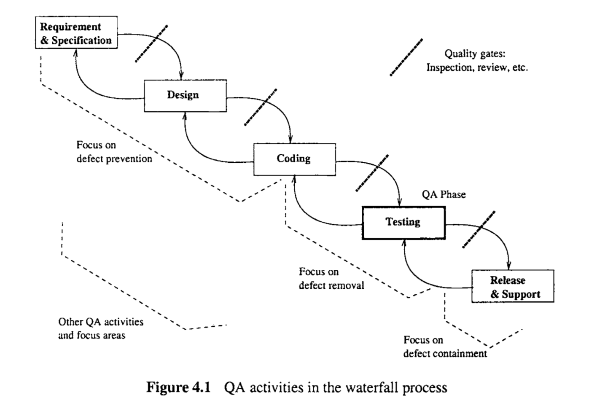
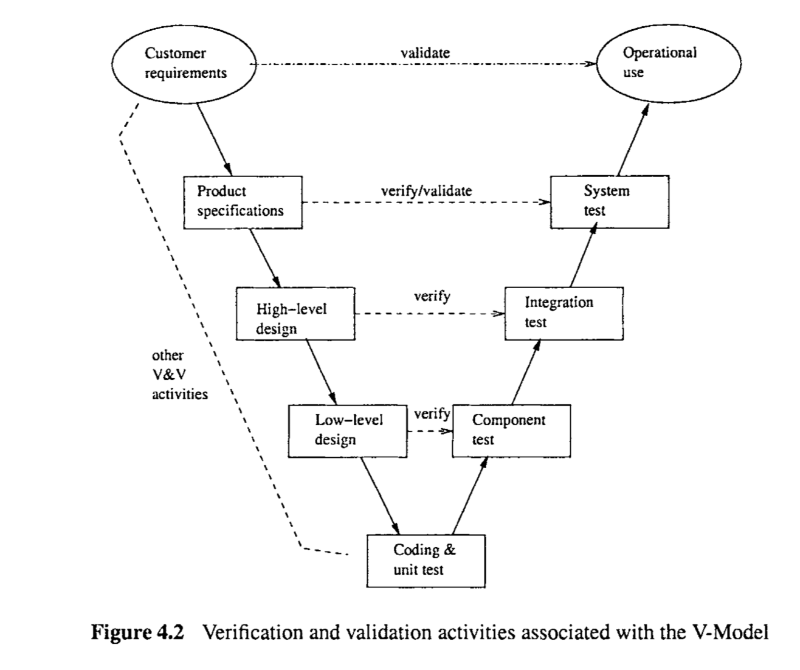
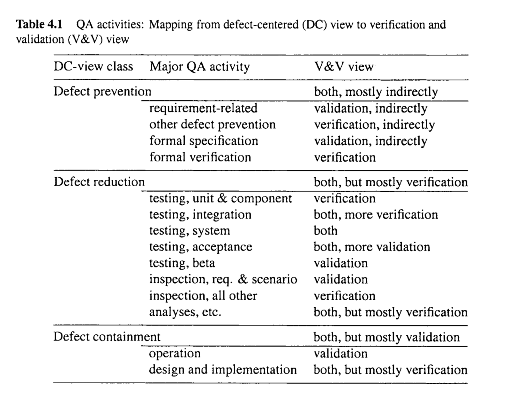

# Chapter 4 QUALITY ASSURANCE IN CONTEXT

With the interpretation of quality assurance (QA) as dealing with defects adopted in the previous chapter, we implicitly assumed that all discovered defects will be resolved within the software development process before product release. In this chapter, we describe defect handling during the execution of specific QA activities and examine how different QA activities fit into different software processes. In addition, we also examine the QA activities from the perspective of verification and validation (V&V), and try to reconcile this V&V view with our view of QA as different ways of dealing with defects.

> 在上一章中采纳的将质量保证（QA）视为处理缺陷的解释下，我们隐含地假设所有发现的缺陷都将在产品发布前的软件开发过程中得到解决。在本章中，我们将描述在执行特定QA活动期间的缺陷处理，并检查不同QA活动如何适应不同的软件过程。此外，我们还从验证和确认（V&V）的角度检查QA活动，并尝试将这种V&V视角与我们将QA视为处理缺陷的不同方式的观点协调一致。

## 4.1 HANDLING DISCOVERED DEFECT DURING QA ACTIVITIES

An important part of the normal execution of various QA activities is dealing with the discovered problems, or handling defect. At the minimum, each discovered defect needs to be resolved. To ensure its resolution, some records must be kept and tracked. The exact way used to handle defects is also influenced by the specific QA activities that led to their initial discovery, the project environment, and other factors.

> 在各种QA活动的正常执行中处理发现的问题或处理缺陷是一个重要部分。至少，每个发现的缺陷都需要得到解决。为了确保其解决，必须保留并跟踪一些记录。用于处理缺陷的确切方式也受到导致其最初发现的特定QA活动、项目环境和其他因素的影响。

### Defect handling and related activities

The most important activity associated with defect handling is defect resolution, which ensures that each discovered defect is corrected or taken care of through appropriate actions. Each corrected or fixed defect needs to be re-verified to ensure failure-free executions under the same execution conditions.

> 与缺陷处理相关的最重要活动是缺陷解决，它确保每个发现的缺陷通过适当的行动得到纠正或处理。每个纠正或修复的缺陷都需要重新验证，以确保在相同的执行条件下无故障执行。

In the case that a discovered defect is not corrected, all the parties involved must agree on the specific decisions or actions. For example, if a defect from testing is later re-classified as not to be a defect, a justification needs to be given and the decision agreed upon by the person who did the re-classification, the tester who reported it in the first place, and all other people involved. Similarly, if a defect is deferred because it is considered to be a minor problem that can be fixed in a future release, everyone involved must agree to this decision, and appropriate planning for future actions is needed. In addition to the planned future fix, other actions that need to be planned include relevant product support activities to deal with the possible problems. 

> 如果一个发现的缺陷没有得到纠正，所有涉及的各方必须同意具体的决定或行动。例如，如果测试中的缺陷后来被重新分类为非缺陷，则需要给出理由，并且由重新分类的人、首次报告它的测试人员以及所有其他涉及的人员达成一致。同样，如果一个缺陷因为被认为是一个可以在未来版本中修复的小问题而被推迟，所有涉及的人都必须同意这一决定，并需要对未来的行动进行适当规划。除了计划的未来修复外，还需要规划的其他行动包括处理可能问题的相关产品支持活动。

To support defect resolution, two other important activities associated with defect handling are also needed:

* Defect logging, or the initial reporting and recording of a discovered defect. This ensures that a record will be kept for every discovered defect. 
* Defect tracking, which monitors and records what happened to each defect after its initial discovery, up until its final resolution.

Various specific information about the discovered defects can be recorded and updated through the defect handling process. Details about such information and its usage in quality assessment and improvement are included in Chapter 20. To ensure proper collection and usage of defect data, we need to pay special attention to the following in the defect discovery and resolution activities: 

* Consistent defect interpretation and tracking: We need to distinguish execution failures, internal faults, and human errors. The specific problems need to be counted and tracked consistently. 
* Timely defect reporting: Because defect measurements are used to monitor and control software projects, we must ensure timely defect reporting to keep the information current.

> 为支持缺陷解决，还需要两个与缺陷处理相关的其他重要活动：
>
> - 缺陷记录，或发现缺陷的最初报告和记录。这确保将为每个发现的缺陷保留记录。
> - 缺陷跟踪，监控并记录每个缺陷从最初发现到最终解决后发生的情况。
>
> 通过缺陷处理过程可以记录和更新有关发现的缺陷的各种特定信息。有关此类信息及其在质量评估和改进中的使用的详细信息包含在第20章中。为了确保正确收集和使用缺陷数据，我们需要在缺陷发现和解决活动中特别注意以下几点：
>
> - 一致的缺陷解释和跟踪：我们需要区分执行失败、内部故障和人为错误。需要一致地计数和跟踪特定问题。
> - 及时的缺陷报告：因为缺陷测量用于监控和控制软件项目，我们必须确保及时报告缺陷以保持信息的当前性。

### Defect handling process and tools

Defect handling is an important part of QA that involves multiple parties. For example, during testing, the developers who fix discovered defects are typically not the same as the testers who observed and reported the problems in the first place. The exception is unit testing, which is usually carried out parallel to coding by the same person. However, most defects from unit testing are not formally tracked because they are considered as part of the implementation activities. 

In many organizations, defect handling is implicitly assumed to be part of the project management activities, which is handled in similar ways as configuration management. A formalized defect handling process highlights important activities and associated rules, parties involved, and their responsibilities. It is typically defined by the different states associated with individual defect status and transitions among these states due to status changes.  Such status changes follow certain rules defined by project management. For example, a newly reported defect has the “new” status, which may go through various different status changes, such as “working”, “re-verify”, etc., until it is “closed”. Different defect handling processes may include different collections of defect status and other possible attributes. 

The implementation of the defect handling process and enforcement of various related rules typically need the support of software tools, commonly referred to as defect tracking tools or defect handling tools. For example, during the testing of various large software systems in IBM, two defect tracking tools CMVC, an IBM product for configuration management and version control, and IDSS, an IBM internal tool, were used for defect tracking (Tian et al., 1997). Similarly, in many organizations, various software project management tools are also used for version control and defect tracking. The same trend is also carried over to the open source world. According to some recent studies (Zhao and Elbaum, 2003; Koru and Tian, 2004), tools such as Bugzilla (online at www . bugzilla . org) and Issuezilla (online at www . issuezilla . org) are typically employed to handling defects for medium and large open source projects.

> 缺陷处理是QA的重要部分，涉及多方。例如，在测试期间，修复发现缺陷的开发人员通常不同于最初观察并报告问题的测试人员。唯一的例外是单元测试，通常由同一个人并行于编码进行。然而，大多数来自单元测试的缺陷并未正式跟踪，因为它们被视为实现活动的一部分。
>
> 在许多组织中，缺陷处理隐含地被假定为项目管理活动的一部分，其处理方式与配置管理类似。正式化的缺陷处理流程突出了重要活动及相关规则、涉及方及其责任。它通常由与个别缺陷状态相关的不同状态和这些状态之间由于状态变更而发生的转换定义。此类状态变更遵循项目管理定义的某些规则。例如，新报告的缺陷有“新”状态，它可能经历各种不同的状态变更，如“处理中”、“重新验证”等，直到它被“关闭”。不同的缺陷处理流程可能包括不同的缺陷状态集合和其他可能的属性。
>
> 缺陷处理流程的实施和各种相关规则的执行通常需要软件工具的支持，这些工具通常称为缺陷跟踪工具或缺陷处理工具。例如，在IBM的各种大型软件系统的测试中，使用了两个缺陷跟踪工具CMVC（IBM的配置管理和版本控制产品）和IDSS（IBM内部工具）进行缺陷跟踪（Tian等，1997）。同样，在许多组织中，各种软件项目管理工具也用于版本控制和缺陷跟踪。同样的趋势也延续到了开源世界。根据一些最近的研究（Zhao和Elbaum，2003; Koru和Tian，2004），工具如Bugzilla（在线于www.bugzilla.org）和Issuezilla（在线于www.issuezilla.org）通常用于处理中等和大型开源项目的缺陷。

### Defect handling in different QA activities

Defect handling is normally implicitly assumed but not emphasized in various QA activities. 
==For example, during testing, we typically assume that discovered defects will be fixed, reverified, and eventually closed. However, we often do not treat this as part of the testing activities but as something carried out parallel to testing, because defect fixing is typically done by developers or “code owners” instead of testers.== 

Among the three classes of the QA activities described in Chapter 3, defect detection and removal activities, such as testing and inspection, are more closely associated with defect handling. For example, the inspector of a program may make an initial note about a possible problem in the program code. When it is confirmed during the inspection meeting, it is formally recorded as a defect, which needs to be fixed and re-verified later in the later stages of the inspection process. 

On the other hand, various defect prevention activities do not directly deal with defects or the discovered faults, but rather deal with various ways to prevent the injection of faults into the software systems. Consequently, there are little or no discovered faults during these QA activities. As a result, defect handling is not closely associated with defect prevention. 

In defect containment activities, the focus is not on the discovery of underlying faults that cause failures and possible accidents. In fact, in these techniques, such as fault tolerance, faults are not typically identified, while their dynamic impact was tolerated or corrected. Consequently, there are little or no discovered faults. As a result, defect handling is not closely associated with failure prevention and containment activities either.

> 在不同的QA活动中，缺陷处理通常被隐含地假设，但并未强调。例如，在测试期间，我们通常假设发现的缺陷将被修复、重新验证，并最终关闭。然而，我们经常不将这视为测试活动的一部分，而是作为与测试平行进行的活动，因为缺陷修复通常由开发者或“代码所有者”而不是测试人员完成。
>
> 在第3章描述的三类QA活动中，缺陷检测和移除活动，如测试和检查，与缺陷处理更密切相关。例如，程序的检查员可能会初步记录程序代码中可能的问题。当在检查会议中确认时，它被正式记录为一个缺陷，需要在检查过程的后期阶段修复和重新验证。
>
> 另一方面，各种缺陷预防活动并不直接处理缺陷或发现的故障，而是处理各种防止故障注入软件系统的方式。因此，在这些QA活动期间几乎没有或根本没有发现故障。结果，缺陷处理与缺陷预防不紧密相关。
>
> 在缺陷控制活动中，焦点不在于发现导致失败和可能事故的底层故障。实际上，在这些技术中，如容错，故障通常不被识别，而它们的动态影响被容忍或纠正。因此，几乎没有或根本没有发现故障。结果，缺陷处理也不与失败预防和控制活动紧密相关。

## 4.2 QA ACTIVITIES IN SOFTWARE PROCESSES

QA activities form an integral part of the overall software process. We next examine the different ways that software QA activities can be carried out and integrated into different types of software development and maintenance processes.

> QA活动是整个软件过程的一个不可分割的部分。接下来，我们将探讨软件QA活动可以如何执行并整合到不同类型的软件开发和维护过程中。

### QA in software development and maintenance processes

In the software maintenance process, the focus of QA is on defect handling, to make sure that each problem reported by customers from field operations is logged, analyzed, and resolved, and a complete tracking record is kept so that we can learn from past problems for future quality improvement. In addition, such defect information can be used as additional input in planning for future releases of the same product or for replacement products. Among the different QA activities, defect containment activities play an important role in post-release product operations and maintenance support. For example, fault tolerance using recovery blocks can keep systems operational even in face of problems caused by environmental disturbances. However, repeated use of recovery blocks for the same situations may be an indication of software problems instead of environments1 rlist~~rhance as the primary cause of some dynamic problems. Therefore, the systems need to be taken off-line and fixed in order for recovery blocks to work consistently in the future. Even for these techniques, most of the implementation activities need to be carried out during software development, not after product release, similar to the implementation of other product functions or features. 

Most of the core QA activities, including defect prevention and defect reduction, are performed during software development instead of during in-field software support after product release. Therefore, we focus on the software development processes in our examination of how different QA activities fit into software processes. In what follows, we examine different QA activities in the general context of several commonly used software development processes, including waterfall, spiral, incremental and iterative development processes. We first examine the process characteristics and the organization of different development activities, and then relate these activities in the process to specific QA activities.

> 软件开发和维护过程中的QA
>
> 在软件维护过程中，QA的重点是缺陷处理，以确保客户从现场操作报告的每个问题都被记录、分析和解决，并保持完整的跟踪记录，以便我们可以从过去的问题中学习，以改进未来的质量。此外，这种缺陷信息可以作为未来版本的同一产品或替代产品的计划的额外输入。在不同的QA活动中，缺陷控制活动在产品发布后的操作和维护支持中扮演重要角色。例如，使用恢复块的容错可以在环境干扰引起问题的情况下保持系统的运行。然而，对于同一情况反复使用恢复块可能是软件问题而不是环境作为一些动态问题的主要原因的指示。因此，需要将系统脱机并修复，以便恢复块未来能够一致地工作。即使对于这些技术，大部分的实施活动也需要在软件开发期间进行，而不是在产品发布后，类似于其他产品功能或特性的实现。
>
> 大多数核心QA活动，包括缺陷预防和缺陷减少，都是在软件开发期间而不是在产品发布后的现场软件支持期间进行的。因此，我们专注于软件开发过程，在我们检查不同QA活动如何适应软件过程中。接下来，我们将在几个常用的软件开发过程的一般背景下检查不同的QA活动，包括瀑布式、螺旋式、增量式和迭代式开发过程。我们首先检查过程特征和不同开发活动的组织，然后将这些过程中的活动与特定的QA活动相关联。

### QA in the waterfall process

In the most commonly used waterfall process for many large software projects, development activities are typically grouped into different sequential stages to form a waterfall, although overlaps are common among successive pairs of stages (Zelkowitz, 1988). A typical sequence includes, in chronological order: product planning, requirement analysis, specification, design, coding, testing, release, and post-release product support. As a central part of QA activities, testing is an integral part of the waterfall development process, forming an important link in the overall development chain. Other QA activities, although not explicitly stated in the process description, can be carried out throughout other phases and in the transition from one phase to another. For example, part of the criteria to move on from each phase to the next is quality, typically in the form of checking to see if certain quality plans or standards have been completed or followed, as demonstrated by the results from various forms or reviews or inspections.

> 在许多大型软件项目中最常用的瀑布式过程中，开发活动通常被分组为不同的顺序阶段以形成瀑布，尽管在连续的阶段对中常见重叠（Zelkowitz, 1988）。一个典型的顺序包括按时间顺序：产品计划、需求分析、规范、设计、编码、测试、发布和发布后产品支持。作为QA活动的核心部分，测试是瀑布式开发过程的一个组成部分，形成了整个开发链中的一个重要环节。其他QA活动，虽然在过程描述中没有明确说明，但可以在其他阶段以及从一个阶段过渡到另一个阶段期间进行。例如，从每个阶段过渡到下一个阶段的部分标准是质量，通常以检查是否完成或遵循了某些质量计划或标准的形式出现，如通过各种形式的审查或检查的结果所示。

Various defect prevention activities are typically concentrated in the earlier phases of software development, before actual faults have been injected into the software systems. There are several important reasons for this focus on early development phases: 

> 各种缺陷预防活动通常集中在软件开发的早期阶段，在实际故障注入软件系统之前。 这种关注早期开发阶段的几个重要原因是：

* The error sources are typically associated with activities in these early phases, such as conceptual mistakes by designers and programmers, unfamiliarity with the product domain, inexperience with the specific development methodologies, etc. Therefore, error source removal, a primary method of defect preventions, is closely associated with these early development phases. 
* Although some faults could be injected into the software systems during testing and other late development phases, the experience tells us that the vast majority of faults are injected in the early development phases, particularly in detailed design and implementation phases. Therefore, effective defect prevention through error blocking needs to be carried out during these phases. 

> - 错误源通常与这些早期阶段的活动相关联，例如设计师和程序员的概念错误、对产品领域的不熟悉、对特定开发方法论的经验不足等。因此，错误源移除，作为缺陷预防的主要方法，与这些早期开发阶段密切相关。
> - 虽然一些故障可能在测试和其他后期开发阶段注入软件系统，但经验告诉我们，绝大多数故障是在早期开发阶段注入的，特别是在详细设计和实现阶段。因此，有效的缺陷预防通过错误阻止需要在这些阶段进行。

Because of the possibilities of defect propagations and the increasing cost over time or successive development phases to fix defects once they are injected into the system, we need to reduce the number of faults in software systems by the combination of defect prevention and application of QA techniques that can help remove software faults early. Some defect detection and removal techniques, such as inspection, can be applied to early phases, such as inspecting requirement documents, product specifications, and different levels of product designs. On the other hand, there are practical obstacles to the early fixing of injected defects. For example, dynamic problems may only become apparent during execution; and inter-dependency only becomes apparent with the implementation of related components or modules. Because of these reasons, other fault detection and removal activities, such as testing, are typically concentrated in the middle to late phases of software development. 

> 由于缺陷传播的可能性以及一旦故障注入系统，随着时间或连续开发阶段修复缺陷的成本增加，我们需要通过缺陷预防和应用可以帮助早期移除软件故障的QA技术组合来减少软件系统中的故障数量。一些缺陷检测和移除技术，如检查，可以应用于早期阶段，例如检查需求文件、产品规范和不同级别的产品设计。另一方面，早期修复注入的缺陷存在实际障碍。例如，动态问题可能只在执行期间变得明显；和相关组件或模块的实现只有在实现时才变得明显。由于这些原因，其他故障检测和移除活动，如测试，通常集中在软件开发的中期到后期阶段。

Finally, failure prevention and containment activities, such as fault tolerance and safety assurance, are typically the focus of operational phases. However, their planning, design, and implementation need to be carried out throughout the software development process. In some sense, they are equivalent to adding some necessary functions or features into the existing product to make them safe or fault tolerant.

> 最后，失败预防和控制活动，如容错和安全保证，通常是操作阶段的重点。然而，它们的计划、设计和实施需要在整个软件开发过程中进行。 在某种意义上，它们相当于在现有产品中添加一些必要的功能或特性，使它们安全或容错。

 

Figure 4.1 illustrate how the different QA activities fit into the waterfall process. Three key characteristics of this activity distribution are illustrated:

> 图4.1说明了不同的QA活动是如何融入瀑布流程的。说明了这种活动分布的三个关键特征:

* The phase with QA as the focus: Testing phase. 
* QA activities, typically inspections and reviews, carried out at the transitions from one phase to the next are shown as barriers or gates to pass. The exception to this is between testing and release, where the reviews are typically accompanied by acceptance testing. 
* Other QA activities scatter over all other development phases: The general distribution scope is shown by the dotted bracket, with a focus on defect prevention in the early phases, a focus on defect removal during coding and testing phases, and a focus on defect containment in operational support.

> * 关注QA的阶段: 测试阶段。
>
> * QA活动，通常是在从一个阶段过渡到下一个阶段时进行的检查和审查，显示为要通过的障碍或大门。例外情况是在测试和发布之间，其中审查通常伴随着验收测试。
> * 其他QA活动分散在所有其他开发阶段: 一般分布范围由虚线括号表示，在早期阶段侧重于缺陷预防，在编码和测试阶段侧重于缺陷移除，在操作支持阶段侧重于缺陷遏制。

### QA in other software processes

In incremental and iterative processes, the overall process can be viewed as consisting of several increments or iterations, with each of them following more or less the same ministages corresponding to those in the waterfall process. What is more, at the end of each increment or each iteration, the newly developed part needs to be integrated into the existing part. Therefore, integration testing plays a very important role, to make sure that different parts can inter-operate seamlessly to fulfill the intended functionalities correctly together. 

The QA activities performed in the spiral process are similar to those performed in incremental and iterative processes. The minor difference is typically in the risk focus adopted in spiral process, where risk identification and analysis play an important role on the decision as to which part to work on next in the subsequent spiral iteration. This risk focus leads naturally to selective QA with a non-uniform effort applied to different parts of the software systems, with high-risk parts receiving more attention than other parts. In terms of testing techniques, usage-based statistical testing according to user operational profiles may fit this process better than other testing techniques. 

The agile development method and extreme programming that have become popular recently, especially in the Internet-based and open-source development projects, can be treated as special cases of incremental, iterative, or spiral process models where many of their elements are used or adapted. In fact, QA activities, particularly testing and inspection, play an even more important role than in the traditional software development processes. For example, test-driven development is an integral part of extreme programming (Beck, 2003), and inspection in the form of two person inspection, or programmer pairs, is extensively used (Beck, 1999). 

The details about the application of different QA activities and related techniques to different software processes, phases, and activities will be covered when we describe each specific QA technique in Part II and Part III.

> 在增量和迭代过程中，整个过程可以被视为由几个增量或迭代组成，其中每个增量或迭代或多或少地遵循与瀑布过程中相应的相同管理。此外，在每次增量或每次迭代结束时，新开发的部分需要集成到现有部分中。因此，集成测试扮演着非常重要的角色，以确保不同的部分可以无缝地互操作，以正确地一起实现预期的功能。
>
> 在螺旋过程中执行的QA活动类似于在增量和迭代过程中执行的活动。较小的区别通常是在螺旋过程中采用的风险焦点，其中风险识别和分析在决定在随后的螺旋迭代中下一步要处理哪一部分方面起着重要的作用。这种对风险的关注自然会导致选择性QA，将不统一的努力应用于软件系统的不同部分，高风险部分比其他部分得到更多的关注。就测试技术而言，根据用户操作概要进行基于使用情况的统计测试可能比其他测试技术更适合这个过程。
>
> 最近流行起来的敏捷开发方法和极限编程，特别是在基于internet和开源的开发项目中，可以被视为增量、迭代或螺旋过程模型的特殊情况，其中使用或调整了许多元素。事实上，QA活动，特别是测试和检查，比在传统的软件开发过程中扮演更重要的角色。例如，测试驱动开发是极限编程的一个组成部分(Beck, 2003)，并且以两人检查或程序员对的形式进行的检查被广泛使用(Beck, 1999)。
>
> 当我们在第2部分和第3部分描述每个特定的QA技术时，将详细介绍不同QA活动和相关技术在不同软件过程、阶段和活动中的应用。

## 4.3 VERIFICATION AND VALIDATION PERSPECTIVES

As described in Chapter 1, the basic quality expectations of a user are that a software performs the right functions as specified, and performs these specified functions correctly over repeated use or over a long period of time. The related QA activities to ensure that the right functions are performed are typically grouped as validation activities; while the ones to ensure the correct or reliable performance of these specified functions are typically grouped as verification activities. The QA activity classification we used in Chapter 3 can be mapped into this binary partition of validation and verification activities using the related defects as the middle link between the two classification schemes.

> 如第1章所述，用户的基本质量期望是软件按照规定执行正确的功能，并且在重复使用或长时间内正确执行这些规定的功能。确保执行正确功能的相关QA活动通常被归类为验证活动;而那些确保正确或可靠地执行这些指定功能的活动通常被归类为验证活动。我们在第3章中使用的QA活动分类可以映射到确认和验证活动的二元划分中，使用相关缺陷作为两个分类方案之间的中间链接。

### Validation, failures, and QA activities

Validation activities check whether a function needed and expected by the customers is present in a software product. An absence of an expected function or feature is clearly linked to a deviation of expected behavior, or linked to a software failure. However, this is a special sub-class of failures, where an expected function is absent. By extension, when an unexpected function is present, it can be considered as a failure of this kind as well, because a customer is not likely willing to pay for something not needed. Even if it is free, the customer might be worried about possible interference with other critical needs.  Therefore, various QA activities linked with such kind of failures directly observable by software users can be viewed as validation activities. Examples of QA activities that can be classified as validation activities include: 

* System testing, where the focus is the overall set of system functions to be provided to users;
* Acceptance testing and beta testing, where the focus is the assessment of software acceptance or performance by users; 
* Usage-based statistical testing, where the operational environment by target users is simulated during software testing before product release; 
* Software fault tolerance, which focuses on providing continued service expected by customers even when local problems exist; 
* Software safety assurance activities, which focus on providing the expected accidentfree operations or reducing accident damage when an accident is unavoidable. 

Even in the case where a specific software QA activity is not directly dealing with the above type of failures, if the intention is to detect or prevent faults that are linked to such failures, the specific activity in question can also be classified as a validation activity. For example, in inspections based on usage scenarios, faults that are likely to lead to failures under usage scenarios by target customers are the focus of the inspect effort. Therefore, this specific inspection activity can be viewed as a validation activity. In addition, if a preventive action is aimed at preventing specific problems for specific operational environments by customers, it can be classified as a validation activity as well.

> 验证活动检查软件产品中是否存在客户需要和期望的功能。预期功能或特性的缺失显然与预期行为的偏差有关，或者与软件故障有关。然而，这是一种特殊的故障子类，其中缺少预期的功能。通过扩展，当出现意想不到的功能时，也可以将其视为此类失败，因为客户不太可能愿意为不需要的东西付费。即使它是免费的，客户也可能担心可能干扰其他关键需求。因此，与软件用户直接观察到的这类故障相关联的各种QA活动可以被视为验证活动。可归类为验证活动的QA活动示例包括:
>
> * 系统测试，重点是提供给用户的整套系统功能;
> * 验收测试和beta测试，其重点是评估用户对软件的接受程度或性能;
> * 基于使用情况的统计测试，即在产品发布前的软件测试期间模拟目标用户的操作环境;
> * 软件容错，侧重于在局部出现问题的情况下，提供客户期望的持续服务;
> * 软件安全保证活动，侧重于提供预期的无事故操作或在不可避免的事故时减少事故损害。
>
> 即使在特定的软件QA活动不直接处理上述类型的故障的情况下，如果目的是检测或防止与此类故障相关的错误，则所讨论的特定活动也可以归类为验证活动。例如，在基于使用场景的检查中，在目标客户的使用场景下可能导致故障的故障是检查工作的重点。因此，这个特定的检查活动可以看作是一个验证活动。另外，如果预防措施的目的是防止客户针对特定操作环境的特定问题，那么它也可以被归类为验证活动。

### Verification, conformance, and QA activities

> 验证、一致性和QA活动

Software verification activities check the conformance of a software system to its specifications. In performing verification activities, we assume that we have a well defined set of specifications. A deviation from the specification is either a fault or a failure, depending on whether the behavior is specified or other software related entities are specific, such as through coding standards, design patterns, etc. 

When failures are involved in verification activities, we are typically dealing with internal system failures and overall system failures in the form of incorrect behavior, instead of the evidence of presence or absence of certain functions or feature directly observable by customers. For example, checking how one component works with another component is a verification activities, because it tries to eliminate internal failures related to interoperability among internal components, while customers only care if the overall functions are implemented and implemented correctly. 

When a function or feature expected by the customers is present, the activity to determine whether it performs or behaves expectedly is then a verification activity. Therefore, connected to validation activities, there are almost always accompanying verification activities as well. In the above examples of various forms of testing as primarily validation activities, they all include corresponding verification components. They are also used to verify the correct implementation of various functions visible to customers. The testing environment for these activities needs to be similar to that will be subjected to by the product after it is purchased by the customers and put into operational use.

When we are checking non-behavioral specifications, non-conformance indicates the presence of faults or errors. For example, a wrong algorithm or an inappropriate data structure is used, some coding standard is violated, etc. These problems are typically associated with various types of software faults. These faults, when triggered, may cause system failures. Similarly, not following prescribed processes or selected methodologies, or misunderstanding of needed algorithms and data structures, is associated with errors or error sources that cause injection of faults. Therefore, all the QA activities we classified as dealing directly with faults, errors, or error sources can be classified as verification activities.

> 软件验证活动检查软件系统是否符合其规范。在执行验证活动时，我们假设我们有一组定义良好的规范。对规范的偏离要么是错误，要么是失败，这取决于行为是指定的，还是其他软件相关实体是特定的，比如通过编码标准、设计模式等。
>
> 当故障涉及到验证活动时，我们通常处理的是以不正确行为形式出现的内部系统故障和整体系统故障，而不是客户直接观察到的存在或不存在某些功能或特征的证据。例如，检查一个组件如何与另一个组件一起工作是一项验证活动，因为它试图消除与内部组件之间的互操作性相关的内部故障，而客户只关心整体功能是否被正确实现。
>
> 当客户期望的功能或特性出现时，确定其是否按照预期执行或表现的活动就是验证活动。因此，连接到验证活动，几乎总是伴随着验证活动。在上述各种形式的测试作为主要验证活动的例子中，它们都包括相应的验证组件。它们还用于验证客户可见的各种功能的正确实现。这些活动的测试环境需要与客户购买产品并投入实际使用后产品所经受的测试环境相似。
>
> 当我们检查非行为规范时，不一致性表明存在错误或错误。例如，使用了错误的算法或不适当的数据结构，违反了某些编码标准等。这些问题通常与各种类型的软件故障相关联。这些故障触发后，可能会导致系统故障。类似地，不遵循规定的流程或选定的方法，或误解所需的算法和数据结构，都与导致注入错误的错误或错误源有关。因此，我们归类为直接处理故障、错误或错误源的所有QA活动都可以归类为验证活动。

### ==Verification and validation in software processes==

QA activities can also be classified by the binary grouping of verification vs. validation activities. Validation checks the conformance to quality expectations of customers and users in the form of whether the expected functions or features are present or not. On the other hand, verification checks the conformance of software product implementation against its specifications to see if it is implemented correctly. Therefore, validation deals directly with users and their requirements; while verification deals with internal product specifications. In the software development process perspective, different processes may involve customers and users in different ways. Therefore, verification and validation activities may be distributed in these different processes differently. 

In the waterfall process, direct involvement of users and user requirement is at the very beginning and the very end of the development process. These phases include project planning, market analysis, requirement analysis, specification, acceptance testing, product release, and post-release product support and maintenance. Therefore, these are the phases where validation activities may be the focus. For example, overall product specifications need to be validated through inspections or reviews to make sure they conform to customer requirements. Various user-oriented testing, such as system, integration, and acceptance testing focus on the validation of user requirement in the form of checking if the functions and features expected by users are present in the software product scheduled to be delivered. Similarly, beta testing and operational support make sure the software product is validated, that is, it is doing what it is supposed to do under the application environment of the target customers. 

On the other hand, many development activities in the middle part of the waterfall process do not involve customers and users directly. A set of internal specifications needs to be followed or other rules or criteria need to be satisfied. For example, the product designs must satisfy the product specifications; lower-level designs must conform to the constraints imposed by the high-level designs; and the final product implementation must follow the design decisions made earlier. The satisfactory conformance of these specifications, designs, and rules is the focus of various verification activities. For example, through inspections of design documents, satisfaction of design constraints and product specifications can be verified. Program correctness with respect to its formal specifications can be formally verified using various formal verification techniques. Unit and component testing can be used to verify the unit or the component against its specifications in the form of detailed designs for them. 

These verification and validation activities can be best illustrated by the V-model in Figure4.2, a variation of the waterfall process model where the different development phases are presented in a V-shaped graph, relating specific verification or validation activities to their corresponding requirements or specifications. For example, customer requirements are validated by operational use; while product specification, high-level design, and lowlevel design are verijied by system test, integration test, and component test, respectively. In addition, system test also validates the product by focusing on how the overall operations under an environment that resembles that for target customers. In a sense, the users' operational environment is captured as part of the product specification or as part of the testing model. At the bottom, coding and unit testing are typically grouped in a single phase, where the code itself specifies the expected behavior and needs to be verified through unit test. Sometimes, various other QA activities, such as inspections, reviews, walkthroughs, analyses, formal verification, etc., are also associated with the left arm of the V-model and illustrated by additional dotted lines pointed to the specific phases.

> 软件过程中的验证和确认
>
> QA活动也可以通过验证与确认活动的二元分组进行分类。验证以是否存在预期的功能或特性的形式检查客户和用户的质量期望的一致性。另一方面，验证根据软件产品的规范检查软件产品实现的一致性，以查看它是否被正确实现。因此，验证直接处理用户和他们的需求;而验证处理内部产品规范。从软件研制过程的角度来看，不同的过程可能以不同的方式涉及客户和用户。因此，验证和确认活动可能以不同的方式分布在这些不同的过程中。
>
> 在瀑布过程中，用户和用户需求的直接参与是在开发过程的最开始和最结束。这些阶段包括项目计划、市场分析、需求分析、规范、验收测试、产品发布，以及发布后的产品支持和维护。因此，在这些阶段，验证活动可能是重点。例如，需要通过检查或评审来验证整体产品规格，以确保它们符合客户需求。各种面向用户的测试，如系统测试、集成测试和验收测试，以检查用户期望的功能和特性是否出现在计划交付的软件产品中的形式，关注用户需求的验证。类似地，beta测试和操作支持确保软件产品是经过验证的，也就是说，它在目标客户的应用程序环境下正在做它应该做的事情。
>
> 另一方面，瀑布过程中间部分的许多开发活动并不直接涉及客户和用户。需要遵循一组内部规范，或者需要满足其他规则或标准。例如，产品设计必须满足产品规格;下级设计必须符合高级设计的约束条件;最终的产品实现必须遵循之前做出的设计决策。这些规范、设计和规则的令人满意的一致性是各种验证活动的焦点。例如，通过对设计文件的检查，可以验证设计约束和产品规范是否得到满足。程序的正规化规范的正确性可以使用各种正规化验证技术进行正规化验证。单元和部件测试可用于以详细设计的形式验证单元或部件是否符合其规格。
>
> 这些验证和确认活动可以通过图4.2中的v型模型得到最好的说明，v型模型是瀑布过程模型的一个变体，其中不同的开发阶段以v型图表示，将特定的验证或确认活动与其相应的需求或规范联系起来。例如，客户需求通过操作使用得到验证;而产品规范、高层设计和低层设计分别通过系统测试、集成测试和组件测试进行验证。此外，系统测试还通过关注与目标客户相似的环境下的整体操作来验证产品。在某种意义上，用户的操作环境作为产品规范的一部分或测试模型的一部分被捕获。在底层，编码和单元测试通常被分组在一个阶段中，在这个阶段中，代码本身指定了预期的行为，并且需要通过单元测试进行验证。有时，各种其他QA活动，如检查、评审、遍历、分析、正式验证等，也与v模型的左臂相关联，并通过指向特定阶段的附加虚线加以说明。

Similar to the mapping of QA activities to other process models above, validation and verification activities can be mapped into non-sequential processes such as incremental, iterative, spiral, and extreme programming processes. Typically, there is some level of user involvement in each part or iteration. Therefore, validation plays a more important role in these processes than in the waterfall process or the V-model.

> 与上述QA活动到其他过程模型的映射类似，确认和验证活动可以映射到非顺序过程中，例如增量、迭代、螺旋和极限编程过程。通常，在每个部分或迭代中都有一定程度的用户参与。因此，验证在这些过程中扮演着比瀑布过程或v模型更重要的角色。

##4.4 RECONCILING THE TWO VIEWS

The above descriptions of verification and validation activities included examples of specific QA activities. These specific QA activities were also classified using our scheme according to the generic ways of dealing with defects. Through this connection and the inter-relations represented therein, we can establish the relationship and the mapping between the verification and validation (V&V) view on the one hand and our defect-centered (DC) view and classification on the other hand. In addition, we can use the process information as presented in Figure 4.1, Figure 4.2, and related discussions to help us with this mapping, as discussed below.

> 上面对验证和确认活动的描述包括特定QA活动的示例。这些特定的QA活动也根据处理缺陷的一般方法使用我们的方案进行分类。通过这种联系和其中所表示的相互关系，我们可以建立一方面验证和确认(V&V)视图与另一方面以缺陷为中心(DC)视图和分类之间的关系和映射。此外，我们可以使用图4.1、图4.2所示的流程信息，以及相关的讨论来帮助我们完成这个映射，如下所示。

As described in Section 4.3 and illustrated in Figure 4.2, most QA activities carried within the software development process can be classified as verification activities, while only those directly dealing with user requirements, typically near the very beginning or the very end of software development process, are associated with validation activities. On the other hand, as described in Section 4.2 and illustrated in Figure 4.1, various defect prevention activities are typically concentrated in the earlier phases of software development; defect reduction is typically concentrated in the middle to late phases of software development; while defect containment activities are typically the focus of operational phases, with its planning, design, and implementation carried out earlier during software development.

> 如第4.3节所述和图4.2所示，软件研制过程中进行的大多数QA活动可以归类为验证活动，而只有那些直接处理用户需求的活动，通常是在软件研制过程的最开始或最结束时，才与验证活动相关联。另一方面，正如第4.2节所描述和图4.1所示，各种缺陷预防活动通常集中在软件开发的早期阶段;缺陷减少通常集中在软件开发的中后期阶段;而缺陷控制活动通常是操作阶段的焦点，在软件开发的早期，它的计划、设计和实现被执行。

Based on this comparison, we could draw some tentative connections to link verification with defect reduction activities, and validation with defect prevention and defect tolerance. However, there are complications and adjustments due to the following:

> 基于这种比较，我们可以画出一些试探性的联系，将验证与缺陷减少活动，以及与缺陷预防和缺陷容忍联系起来。然而，由于以下原因，会出现并发症和调整:

* Many specific QA activities deal with both the verification and the validation aspects. 
  For example, different types of testing in the V-model in Figure 4.2 can be classified either as verification test or validation test or contain both elements: The focus of the acceptance test is clearly validation, while that for unit test is verification, however, system test contains both the verification and validation components. 
* The situation with inspection as an important defect reduction activity is similar to testing above. However, due to the absence of execution and direct observations of failures, inspection is more closely connected to verification than to validation. For example, most of the inspection activities are performed on software code or design, which are classical verification activities. The less used requirement inspections and usage scenarios based inspections are closer to validation. 
* Defect prevention deals with error source elimination and error blocking, while both verification and validation deal with failures and faults. Therefore, there is no direct connection between defect prevention and the V&V view of QA activities, but only indirectly through the target of preventive actions. For example, if the target is eliminating ambiguity in the requirement or the product domain knowledge, it is indirectly connected to validation. If the target is to block syntactic faults or other faults due to the proper selection and usage of processes, methodologies, technologies, or tools, it is indirectly connected to verification. 
* Closely related to both defect prevention and formalized inspection is the use of formal method as a QA activity. The formal specification part is close to validation, but indirectly, much like the defect prevention activities above. The formal verification part naturally falls into verification activities, verifying the program or design correctness with respect to its formal specifications. 
* Defect containment activities, such as through fault tolerance and safety assurance, are more closely related to validation activities than verification due to their focus on avoiding global failures or minimizing failure damages under actual operational environments. However, when such defect containment features are specific for a software system or an embedded system, the conformance to this part of the specification can be treated much the same as other verification activities to check the general conformance to specifications.

> * 许多特定的QA活动涉及验证和确认两个方面。例如，在图4.2的v模型中，不同类型的测试可以分为验证测试或确认测试，或者两者都包含:验收测试的重点显然是验证，而单元测试的重点是验证，然而，系统测试同时包含验证和确认组件。
>
> * 将检查作为减少缺陷的重要活动的情况与上述测试类似。然而，由于缺乏执行和对失败的直接观察，检查与验证的关系比确认的关系更紧密。例如，大多数检查活动是在软件代码或设计上执行的，这是经典的验证活动。较少使用的需求检查和基于检查的使用场景更接近于验证。
> * 缺陷预防处理错误源消除和错误阻塞，而验证和确认处理失败和错误。因此，在缺陷预防和QA活动的V&V视图之间没有直接的联系，而只是间接地通过预防行动的目标。例如，如果目标是消除需求或产品领域知识中的模糊性，则它与验证间接相关。如果目标是阻止由于正确选择和使用过程、方法、技术或工具而导致的语法错误或其他错误，则与验证间接相关。
> * 与缺陷预防和形式化检查密切相关的是形式化方法作为QA活动的使用。正式的规范部分接近于验证，但是是间接的，很像上面的缺陷预防活动。形式验证部分自然属于验证活动，根据其形式规范验证程序或设计的正确性。
> * 缺陷控制活动，例如通过容错和安全保证，与确认活动的关系比验证更密切，因为它们的重点是避免在实际操作环境下的全局故障或最小化故障损害。然而，当这样的缺陷包含特征是特定于软件系统或嵌入式系统时，对规范的这一部分的一致性可以与检查规范的一般一致性的其他验证活动一样对待。

This relationship between the two views can be summarized in Table 4.1, for each of the DC view categories and related major QA activities, we point out whether it is related to verification, validation, or both, directly (unless specified otherwise) or indirectly. Therefore, we can follow the three-part classification outlined in Chapter 3 without losing the general perspectives of validation and verification.

> 这两个视图之间的关系可以在表4.1中总结，对于每个DC视图类别和相关的主要QA活动，我们指出它是直接(除非另有说明)还是间接地与验证、确认或两者相关。因此，我们可以遵循第3章中概述的三部分分类，而不会失去验证和验证的一般视角。

## 4.5 CONCLUDING REMARKS

To summarize, defect handling is an integral part of QA activities, and different QA alternatives and related activities can be viewed as a concerted effort to ensure software quality. These activities can be integrated into software development and maintenance processes as an integral part of the overall process activities, typically in the following fashion:

* Testing is an integral part of any development process, forming an important link in the overall development chain. 
* Quality reviews or inspections often accompany the transition from one phase or development activity to another. 
* Various defect prevention activities are typically carried out in the early stages. 
* Defect containment activities typically focus on the later, operational part of the development process, although their planning and implementation need to be carried out throughout the development process.

These QA activities can also be partitioned into verification and validation (V&V) activities using a bi-partite classification scheme in the so-called V&V view. Similarly, they can be partitioned by the generic way they employ to deal with errors, faults, or failures as different defect-centered (DC) activities using our tri-partite classification scheme in the so-call DC view. Both views and both classification schemes have their useful purposes and implications. Our tri-partite classification provides a balanced and systematic scheme to organize and classify existing software QA activities. It can also be easily mapped to the commonly used bi-partite scheme of validation and verification activities. Consequently, we will follow this classification in the rest of the book without losing the generality associated with the other commonly used views of QA activities.

> 总之，缺陷处理是QA活动的一个组成部分，不同的QA选择和相关的活动可以被看作是确保软件质量的一致努力。这些活动可以作为整个过程活动的组成部分集成到软件开发和维护过程中，通常采用以下方式:
>
> * 测试是任何开发过程中不可或缺的一部分，是整个开发链中的重要一环。
> * 质量审查或检查通常伴随着从一个阶段或开发活动到另一个阶段或开发活动的过渡。
> * 各种缺陷预防活动通常在早期阶段进行。
> * 缺陷控制活动通常侧重于开发过程的后期操作部分，尽管它们的计划和实施需要在整个开发过程中进行。
>
> 这些QA活动也可以使用所谓的V&V视图中的双部分分类方案划分为验证和确认(V&V)活动。类似地，它们可以通过它们用来处理错误、故障或失败的通用方式进行划分，这些错误、故障或失败是不同的以缺陷为中心(DC)的活动，使用我们在所谓的DC视图中的三方分类方案。这两种观点和两种分类方案都有其有用的目的和含义。我们的三方分类提供了一个平衡和系统的方案来组织和分类现有的软件QA活动。它也可以很容易地映射到常用的验证和验证活动的双向方案。因此，在本书的其余部分中，我们将遵循这种分类，而不会失去与QA活动的其他常用视图相关的通用性。