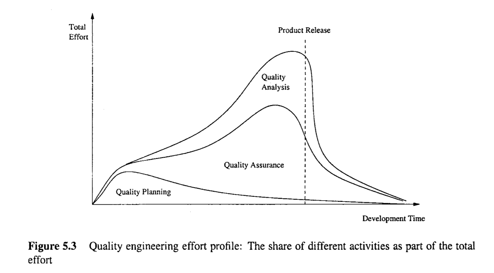

# Chapter 5 QUALITY ENGlNEERlNG

In this chapter, we enlarge the scope of our discussion to include other major activities associated with quality assurance (QA) for software systems, primarily in the areas of setting quality goals, planning for QA, monitoring QA activities, and providing feedback for project management and quality improvement.

> 在本章中，我们扩大了讨论的范围，包括与软件系统的质量保证(QA)相关的其他主要活动，主要是在设置质量目标、QA计划、监控QA活动以及为项目管理和质量改进提供反馈的领域。

## 5.1 QUALITY ENGINEERING: ACTIVITIES AND PROCESS

As stated in Chapter 2, different customers and users have different quality expectations under different market environments. Therefore, we need to move beyond just performing QA activities toward quality engineering by managing these quality expectations as an engineering problem: Our goal is to meet or exceed these quality expectations through the selection and execution of appropriate QA activities while minimizing the cost and other project risks under the project constraints. 

> 如第2章所述，在不同的市场环境下，不同的客户和用户有不同的质量期望。因此，我们需要通过将这些质量期望作为一个工程问题来管理，从而从仅仅执行QA活动转向质量工程:我们的目标是通过选择和执行适当的QA活动来满足或超越这些质量期望，同时在项目约束下最小化成本和其他项目风险。

In order to ensure that these quality goals are met through the selected QA activities, various measurements need to be taken parallel to the QA activities themselves. Postmortem data often need to be collected as well. Both in-process and post-mortem data need to be analyzed using various models to provide an objective quality assessment. Such quality assessments not only help us determine if the preset quality goals have been achieved, but also provide us with information to improve the overall product quality. 

> 为了确保通过所选择的QA活动来满足这些质量目标，需要在QA活动本身的同时采取各种度量。通常还需要收集死后数据。过程中和事后数据都需要使用各种模型进行分析，以提供客观的质量评估。这样的质量评估不仅帮助我们确定是否达到了预定的质量目标，而且还为我们提供了提高整体产品质量的信息。

To summarize, there are three major groups of activities in the quality engineering process, as depicted in Figure 5.1. They are labeled in roughly chronological order as pre-QA activities, in-QA activities, and post-QA activities:

> 总之，在质量工程过程中有三组主要的活动，如图5.1所示。它们大致按时间顺序分为qa前活动、qa中活动和qa后活动:

1. Pre-QA activities: Quality planning. These are the activities that should be carried out before carrying out the regular QA activities. There are two major types of pre-QA activities in quality planning, including: 

   (a) Set specific quality goals. 
   (b) Form an overall QA strategy, which includes two sub-activities: 

   ​	i. Select appropriate QA activities to perform. 

   ​	ii. Choose appropriate quality measurements and models to provide feedback, quality assessment 	and improvement. 
   A detailed description of these pre-QA activities is presented in Section 5.2.

2. In-QA activities: Executing planned QA activities and handling discovered defects. 
  In addition to performing selected QA activities, an important part of this normal execution is to deal with the discovered problems. These activities were described in the previous two chapters. 
3. Post-QA activities: Quality measurement, assessment and improvement These are the activities that are carried out after normal QA activities have started but not as part of these normal activities. The primary purpose of these activities is to provide quality assessment and feedback so that various management decisions can be made and possible quality improvement initiatives can be carried out. These activities are described in Section 5.3.

>1. qa前活动:质量计划。这些是在进行常规QA活动之前应该进行的活动。在质量策划中，有两种主要的qa前活动，包括:
>
>(a)制订具体的质量目标。
>
>(b)形成一个全面的质量保证策略，其中包括两个次级活动:
>
>i.选择适当的QA活动来执行。
>
>ii选择适当的质量度量和模型来提供反馈、质量评估和改进。
>
>这些qa前活动的详细描述见第5.2节。
>
>2. QA内部活动:执行计划的QA活动并处理发现的缺陷。
>
>除了执行选定的QA活动外，正常执行的一个重要部分是处理发现的问题。前两章描述了这些活动。
>
>3. QA后活动:质量测量、评估和改进这些活动是在正常QA活动开始之后进行的，但不是这些正常活动的一部分。这些活动的主要目的是提供质量评估和反馈，以便作出各种管理决策，并采取可能的质量改进措施。这些活动将在第5.3节中描述。

Notice here that “post-QA”does not mean after the finish of QA activities. In fact, many of the measurement and analysis activities are carried out parallel to QA activities after they are started. In addition, pre-QA activities may overlap with the normal QA activities as well. 

Pre-QA quality planning activities play a leading role in this quality engineering process, although the execution of selected QA activities usually consumes the most resources. Quality goals need to be set so that we can manage the QA activities and stop them when the quality goals are met. QA strategies need to be selected, before we can carry out specific QA activities, collect data, perform analysis, and provide feedback.

There are two kinds of feedback in this quality engineering process, both the short term direct feedback to the QA activities and the long-term feedback to the overall quality engineering process. The short term feedback to QA activities typically provides information for progress tracking, activity scheduling, and identification of areas that need special attentions. For example, various models and tools were used to provide test effort tracking, reliability monitoring, and identification of low-reliability areas for various software products developed in the IBM Software Solutions Toronto Lab to manage their testing process (Tian, 1996). 

> 注意这里的“后QA”并不意味着在QA活动完成之后。事实上，许多度量和分析活动在开始后与QA活动并行进行。此外，QA前活动也可能与正常的QA活动重叠。
>
> 虽然选定的QA活动的执行通常消耗最多的资源，但QA前质量计划活动在质量工程过程中起着主导作用。需要设定质量目标，以便我们能够管理QA活动，并在达到质量目标时停止它们。在我们能够执行特定的QA活动、收集数据、执行分析和提供反馈之前，需要选择QA策略。
>
> 在这个质量工程过程中有两种反馈，一种是对QA活动的短期直接反馈，另一种是对整个质量工程过程的长期反馈。对QA活动的短期反馈通常为进度跟踪、活动安排和需要特别注意的区域的识别提供信息。例如，各种模型和工具被用于提供测试工作跟踪、可靠性监控，以及在IBM software Solutions Toronto Lab中开发的各种软件产品的低可靠性区域的识别，以管理它们的测试过程(Tian, 1996)。

The long-term feedback to the overall quality engineering process comes in two forms: 

* Feedback to quality planning so that necessary adjustment can be made to quality goals and QA strategies. For example, if the current quality goals are unachievable, alternative goals need to be negotiated. If the selected QA strategy is inappropriate, a new or modified strategy needs to be selected. Similarly, such adjustments may also be applied to future projects instead of the current project. 

* Feedback to the quality assessment and improvement activities. For example, the modeling results may be highly unstable, which may well be an indication of the model inappropriateness. In this case, new or modified models need to be used, probably on screened or pre-processed data.

> 对整体质量工程过程的长期反馈有两种形式:
>
> * 对质量计划进行反馈，以便对质量目标和质量保证策略进行必要的调整。例如，如果当前的质量目标无法实现，则需要协商替代目标。如果选择的QA策略不合适，则需要选择新的或经过修改的策略。同样，这种调整也可以应用于未来的项目，而不是当前的项目。
>
> * 对质量评估和改进活动提供反馈。例如，建模结果可能非常不稳定，这很可能是模型不适当的指示。在这种情况下，可能需要在筛选或预处理的数据上使用新的或修改的模型

### Quality engineering and QIP

In the TAME project and related work (Basili and Rombach, 1988; Oivo and Basili, 1992; Basili, 1995; van Solingen and Berghout, 1999), quality improvement was achieved through measurement, analysis, feedback, and organizational support. The overall framework is called QIP, or quality improvement paradigm. QIP includes three interconnected steps: understanding, assessing, and packaging, which form a feedback and improvement loop, as briefly described below:

1. The first step is to understand the baseline so that improvement opportunities can be identified and clear, measurable goals can be set. All future process changes are measured against this baseline. 
2. The second step is to introduce process changes through experiments, pilot projects, assess their impact, and fine tune these process changes. 
3. The last step is to package baseline data, experiment results, local experience, and updated process as the way to infuse the findings of the improvement program into the development organization.

QIP and related work on measurement selection and organizational support are described further in connection to defect prevention in Chapter 13 and in connection to quality assessment and improvement in Part IV. 
Our approach to quality engineering can be considered as an adaptation of QIP to assure and measure quality, and to manage quality expectations of target customers. Some specific correspondences are noted below: 

* Our pre-QA activities roughly correspond to the understand step in QIP. 
* The execution of our selected QA strategies correspond to the “changes” introduced in the assess step in QIP. However, we are focusing on the execution of normal QA activities and the related measurement activities selected previously in our planning step, instead of specific changes.
* Our analysis and feedback (or post-QA) activities overlap with both the assess and package steps in QIP, with the analysis part roughly corresponding to the QIP-assess step and the longer term feedback roughly corresponding to the QIP-package step.

> 质量工程和QIP
>
> 在TAME项目及相关工作中(Basili and Rombach, 1988;Oivo和Basili, 1992;Basili, 1995;van Solingen和Berghout, 1999)，质量改进是通过测量、分析、反馈和组织支持来实现的。整个框架被称为QIP，或质量改进范例。QIP包括三个相互关联的步骤:理解、评估和包装，它们形成了一个反馈和改进循环，如下所述:
>
> 1. 第一步是了解基线，这样可以识别改进机会，并设置清晰、可测量的目标。所有未来的流程变更都是根据这个基线进行测量的。
> 2. 第二步是通过实验、试验项目引入过程变更，评估它们的影响，并对这些过程变更进行微调。
> 3. 最后一步是打包基线数据、实验结果、本地经验和更新的过程，作为将改进计划的发现注入开发组织的方法。
>
> QIP和有关度量选择和组织支持的相关工作在第13章中与缺陷预防有关，在第4部分中与质量评估和改进有关。
> 我们的质量工程方法可以看作是QIP的一种改编，以保证和测量质量，并管理目标客户的质量期望。以下是一些具体的信件:
>
> * 我们的qa前活动大致对应于QIP中的理解步骤。
> * 我们所选择的质量保证策略的执行与质量保证计划评估步骤中引入的“变化”相对应。然而，我们关注的是正常QA活动的执行，以及之前在计划步骤中选择的相关度量活动，而不是具体的更改。
> * 我们的分析和反馈(或qa后)活动与QIP中的评估和包装步骤重叠，分析部分大致对应于QIP-评估步骤，长期反馈大致对应于QIP-包装步骤。

## 5.2 QUALITY PLANNING: GOAL SETTING AND STRATEGY FORMATION

As mentioned above, pre-QA quality planning includes setting quality goals and forming a QA strategy. The general steps include: 

1. Setting quality goals by matching customer’s quality expectations with what can be economically achieved by the software development organizations in the following sub-steps: 

   (a) Identify quality views and attributes meaningful to target customers and users. 
   (b) Select direct quality measures that can be used to measure the selected quality 

   (c) Quantify these quality measures to set quality goals while considering the marattributes from customer’s perspective. 
   ket environment and the cost of achieving different quality goals. 

2. In forming a QA strategy, we need to plan for its two basic elements: 

  (a) Map the above quality views, attributes, and quantitative goals to select a specific set of QA alternatives. 
  (b) Map the above external direct quality measures into internal indirect ones via selected quality models. This step selects indirect quality measures as well as usable models for quality assessment and analysis. 

We next examine these steps and associated pre-QA activities in detail.

> 如上所述，QA前的质量计划包括设定质量目标和形成QA策略。一般步骤包括:
>
> 1. 通过将客户的质量期望与软件开发组织在以下子步骤中可以经济地实现的目标相匹配来设定质量目标:
>
> (a)确定对目标顾客和用户有意义的质量观点和属性。
> (b)选择可用于测量所选质量的直接质量度量
>
> (c)从顾客的角度考虑因素，量化这些质量措施，设定质量目标。
> 实现不同质量目标的环境和成本。
>
> 2. 在制定QA策略时，我们需要规划它的两个基本元素:
>
> (a)映射上述质量视图、属性和定量目标，以选择一组特定的QA备选方案。
> (b)通过选定的质量模型将上述外部直接质量度量映射到内部间接质量度量。这一步选择间接的质量度量以及可用的模型进行质量评估和分析。
>
> 接下来，我们详细检查这些步骤和相关的qa前活动。

### Setting quality goals

One important fact in managing customer’s quality expectations is that different quality attributes may have different levels of importance to different customers and users. Relevant quality views and attributes need to be identified first. For example, reliability is typically the primary concern for various business and commercial software systems because of people’s reliance on such systems and the substantial financial loss if they are malfunctioning. 

Similarly, if a software is used in various real-time control situations, such as air traffic control software and embedded software in automobile, medical devices, etc., accidents due to failures may be catastrophic. Therefore, safety is the major concern. On the other hand, for mass market software packages, such as various auxiliary utilities for personal computers, usability, instead of reliability or safety, is the primary concern. 

Even in the narrower interpretation of quality we adopted in this book to be the correctnesscentered quality attributes associated with errors, faults, failures, and accidents, there are different types of problems and defects that may mean different things to different customers. 
For example, for a software product that is intended for diverse operational environments, inter-operability problems may be a major concern to its customers and users; while the same problems may not be a major concern for software products with a standard operational environment. Therefore, specific quality expectations by the customers require us to identify relevant quality views and attributes prior to setting appropriate quality goals. This needs to be done in close consultation with the customers and users, or those who represents their interests, such as requirement analysts, marketing personnel, etc.

Once we obtained qualitative knowledge about customers’ quality expectations, we need to quantify these quality expectations to set appropriate quality goals in two steps:

1. We need to select or dejne the quality measurements and models commonly accepted by the customers and in the software engineering community. For example, as pointed out in Chapter 2, reliability and safety are examples of correctness-centered quality measures that are meaningful to customers and users, which can be related to various internal measures of faults commonly used within software development organizations. 
2. We need tofind out the expected values or ranges of the corresponding quality measurements. For example, different market segments might have different reliability expectations. Such quality expectations are also influenced by the general market conditions and competitive pressure.

> 设定质量目标
>
> 管理客户质量期望的一个重要事实是，不同的质量属性对不同的客户和用户可能具有不同的重要程度。首先需要确定相关的质量视图和属性。例如，可靠性通常是各种商业和商业软件系统的主要关注点，因为人们依赖于这些系统，如果它们发生故障，会造成大量的经济损失。
>
> 同样，如果一个软件被用于各种实时控制场合，如空中交通管制软件和汽车、医疗设备中的嵌入式软件等，由于故障而导致的事故可能是灾难性的。因此，安全是主要关注的问题。另一方面，对于大众市场的软件包，例如个人电脑的各种辅助工具，主要关注的是可用性，而不是可靠性或安全性。
>
> 即使我们在本书中对质量的狭义解释是与错误、故障、失败和事故相关的以正确性为中心的质量属性，对不同的客户来说，不同类型的问题和缺陷可能意味着不同的东西。
>
> 例如，对于用于多种操作环境的软件产品，互操作性问题可能是其客户和用户关注的主要问题;而对于具有标准操作环境的软件产品来说，同样的问题可能不是主要关注的问题。因此，客户的特定质量期望要求我们在设定适当的质量目标之前识别相关的质量视图和属性。这需要在与客户和用户，或者那些代表他们利益的人，如需求分析师、市场人员等密切协商的情况下完成。
>
> 一旦我们获得了关于客户质量期望的定性知识，我们需要通过两个步骤量化这些质量期望来设定适当的质量目标:
>
> 1. 我们需要选择或确定客户和软件工程社区普遍接受的质量度量和模型。例如，正如第2章所指出的，可靠性和安全性是对客户和用户有意义的以正确性为中心的质量度量的例子，它们可以与软件开发组织中常用的各种内部错误度量相关。
> 2. 我们需要找出相应质量测量的期望值或范围。例如，不同的细分市场可能有不同的可靠性期望。这种质量预期也受到一般市场状况和竞争压力的影响。

Software vendors not only compete on quality alone, but also on cost, schedule, innovation, flexibility, overall user experience, and other features and properties as well. Zero defect is not an achievable goal under most circumstances, and should not be the goal. Instead, zero defection and positive flow of new customers and users based on quality expectation management should be a goal (Reichheld Jr. and Sasser, 1990). In a sense, this activity determines to a large extent the product positioning vs. competitors in the marketplace and potential customers and users. 

> 软件供应商不仅在质量上竞争，还在成本、进度、创新、灵活性、整体用户体验以及其他特性和属性上竞争。在大多数情况下，零缺陷不是一个可以实现的目标，也不应该是目标。相反，基于质量期望管理的零流失和新客户和用户的积极流动应该是一个目标(Reichheld Jr.和Sasser, 1990)。从某种意义上说，这种活动在很大程度上决定了产品在市场上与竞争对手的定位，以及潜在的客户和用户。

Another practical concern with the proper setting of quality goals is the cost associated with different levels of quality. This cost can be divided into two major components, the failure cost and the development cost. The customers typically care more about the total failure cost, $C_f$ ,  which can be estimated by the average single failure cost, $C_f$ ,  and failure probability, $p_f$ ,  over a pre-defined duration of operation as:
$$
C_f = c_f \times p_f
$$
As we will see later in Chapter 22, this failure probability can be expressed in terms of reliability, R, as p f  = 1 - R, where R is defined to be the probability of failure-free operations for a specific period of given set of input. 

To minimize Cf ,  one can either try to minimize cf or pf .  However, cf is typically determined by the nature of software applications and the overall environment the software is used in. Consequently, not much can be done about cf reduction without incurring substantial amount of other cost. One exception to this is in the safety critical systems, where much additional cost was incurred to establish barriers and containment in order to reduce failure impact, as described in Chapter 16. On the other hand, minimizing pf ,  or improving reliability, typically requires additional development cost, in the form of additional testing time, use of additional QA techniques, etc. 

Therefore, an engineering decision need to be made to match the quantified customer’s quality expectations above with their willingness to pay for the quality. Such quantitative cost-of-quality analyses should help us reach a set of quality goals.

> 另一个与正确设置质量目标有关的实际问题是与不同质量水平相关的成本。这个成本可以分为两个主要部分，失效成本和开发成本。客户通常更关心总故障成本$C_f$，这可以通过平均单次故障成本$C_f$和故障概率$p_f$在预定义的运行时间内估计为:
> $$
> C_f = c_f \times p_f
> $$
> 正如我们将在后面的第22章中看到的那样，这个故障概率可以用可靠性R表示为p f = 1 - R，其中R被定义为给定输入集在特定时期内无故障运行的概率。 
>
> 为了最小化Cf，可以尝试最小化Cf或pf。然而，cf通常是由软件应用程序的性质和使用软件的总体环境决定的。因此，在不产生大量其他成本的情况下，减少碳排放是不可能的。一个例外是在安全关键系统中，如第16章所述，在这些系统中，为了减少故障影响，需要花费大量额外的成本来建立屏障和遏制。另一方面，最小化pf或提高可靠性通常需要额外的开发成本，以额外的测试时间、使用额外的QA技术等形式。 
>
> 因此，需要制定一个工程决策来匹配量化客户的质量期望和他们为质量支付的意愿。这种定量的质量成本分析应该帮助我们达到一组质量目标。

### Forming a QA strategy

Once specific quality goals were set, we can select appropriate QA alternatives as part of a QA strategy to achieve these goals. Several important factors need to be considered: 

* The influence of qualityperspectives and attributes: For different kinds of customers, users, and market segments, different QA alternatives might be appropriate, because they focus on the assurance of quality attributes based on this specific perspective. For example, various usability testing techniques may be useful for ensuring the usability of a software product, but may not be effective for ensuring its functional correctness. 
* The influence of different quality Levels: Quantitative quality levels as specified in the quality goals may also affect the choice of appropriate QA techniques. For example, systems with various software fault tolerance features may incur substantially more additional cost than the ones without them. Therefore, they may be usable for highly dependable systems or safety critical systems, where large business operations and people’s lives may depend on the correct operations of software systems, but may not be suitable for less critical software systems that only provide non-essential information to the users.

> 一旦设定了特定的质量目标，我们就可以选择适当的QA替代方案，作为QA策略的一部分来实现这些目标。需要考虑几个重要因素:
>
> * 质量视角和属性的影响:对于不同类型的客户、用户和细分市场，不同的QA替代方案可能是合适的，因为它们关注的是基于这种特定视角的质量属性的保证。例如，各种可用性测试技术对于确保软件产品的可用性可能是有用的，但是对于确保其功能的正确性可能不是有效的。
> * 不同质量水平的影响:质量目标中规定的定量质量水平也可能影响适当质量保证技术的选择。例如，具有各种软件容错功能的系统可能比没有这些功能的系统产生更多的额外成本。因此，它们可能适用于高度可靠的系统或安全关键系统，在这些系统中，大型业务操作和人们的生活可能依赖于软件系统的正确操作，但可能不适用于只向用户提供非必要信息的不那么关键的软件系统。

Notice that in dealing with both of the above factors, we assume that there is a certain relationship between these factors and specific QA alternatives. Therefore, specific QA alternatives need to be selected to fulfill specific quality goals based on the quality perspectives and attributes of concern to the customers and users. 

Implicitly assumed in this selection process is a good understanding of the advantages and disadvantages of different QA alternatives under different application environments. These comparative advantages and disadvantages are the other factors that also need to be considered in selecting different QA afternatives and related techniques and activities. These factors include cost, applicability to different environments, effectiveness in dealing with different kinds of problems, etc. discussed in Chapter 17. 

In order to achieve the quality goals, we also need to know where we are and how far away we are from the preset quality goals. To gain this knowledge, objective assessment using some quality models on collected data from the QA activities is necessary. As we will discuss in more detail in Chapter 18, there are direct quality measures and indirect quality measures. The direct quality measures need to be defined as part of the activities to set quality goals, when such goals are quantified. 

Under many situations, direct quality measures cannot be obtained until it is already too late. For example, for safety critical systems, post-accident measurements provide a direct measure of safety. But due to the enormous damage associated with such accidents, we are trying to do everything to avoid such accidents. To control and monitor these safety assurance activities, various indirect measurements and indicators can be used. For all software systems there is also an increasing cost of fixing problems late instead of doing so early in general, because a hidden problem may lead to other related problems, and the longer it stays undiscovered in the system, the further removed it is from its root causes, thus making the discovery of it even more difficult. Therefore, there is a strong incentive for early indicators of quality that usually measure quality indirectly. 

Indirect quality measures are those which can be used in various quality models to assess and predict quality, through their established relations to direct quality measures based on historical data or data from other sources. Therefore, we also need to choose appropriate measurements, both direct and indirect quality measurement, and models to provide quality assessment and feedback. The actual measurement and analysis activities and related usage of analysis results are discussed in Chapter 18.

> 注意，在处理上述两个因素时，我们假设这些因素与特定的QA选择之间存在一定的关系。因此，需要选择特定的QA替代方案，以实现基于客户和用户关注的质量视角和属性的特定质量目标。
>
> 在此选择过程中隐含地假设对不同应用程序环境下不同QA替代方案的优缺点有很好的理解。这些相对优势和劣势是在选择不同的QA替代方案和相关技术和活动时需要考虑的其他因素。这些因素包括成本，对不同环境的适用性，处理不同类型问题的有效性等，在第17章中讨论过。
>
> 为了实现质量目标，我们还需要知道我们所处的位置，以及我们离预设的质量目标有多远。为了获得这些知识，使用一些质量模型对从QA活动中收集的数据进行客观评估是必要的。正如我们将在第18章更详细地讨论的那样，有直接质量度量和间接质量度量。当这些目标被量化时，直接的质量度量需要被定义为设定质量目标的活动的一部分。
>
> 在许多情况下，无法获得直接的质量措施，直到为时已晚。例如，对于安全关键系统，事故后测量提供了直接的安全度量。但由于这类事故造成的巨大损失，我们正在尽一切努力避免这类事故的发生。为了控制和监视这些安全保证活动，可以使用各种间接测量和指标。对于所有的软件系统来说，通常较晚而不是较早地修复问题的成本也在增加，因为一个隐藏的问题可能会导致其他相关的问题，并且它在系统中未被发现的时间越长，它就离其根本原因越远，从而使发现它变得更加困难。因此，对于通常间接度量质量的早期质量指标有强烈的动机。
>
> 间接质量度量是那些可以在各种质量模型中使用的，通过它们与基于历史数据或其他来源的数据的直接质量度量之间建立的关系来评估和预测质量。因此，我们还需要选择适当的度量，包括直接的和间接的质量度量，以及提供质量评估和反馈的模型。实际的测量和分析活动以及分析结果的相关用法将在第18章中讨论。

## 5.3 QUALITY ASSESSMENT AND IMPROVEMENT

Various parallel and post-QA activities are carried out to close the quality engineering loop. 
The primary purpose of these activities is to provide quality assessment and feedback so that various management decisions, such as product release, can be made and possible quality and process improvement initiatives can be carried out. The major activities in this category include: 

* Measurement: Besides defect measurements collected during defect handling, which is typically carried out as part of the normal QA activities, various other measurements are typically needed for us to track the QA activities as well as for project management and various other purposes. These measurements provide the data input to subsequent analysis and modeling activities that provide feedback and useful information to manage software project and quality. 

* Analysis and modeling: These activities analyze measurement data from software projects and fit them to analytical models that provide quantitative assessment of selected quality characteristics or sub-characteristics. Such models can help us obtain an objective assessment of the current product quality, accurate prediction of the future quality, and some models can also help us identify problematic areas. 
* Providing feedback and identifying improvement potentials: Results from the above analysis and modeling activities can provide feedback to the quality engineering process to help us make project scheduling, resource allocation, and other management decisions. When problematic areas are identified by related models, appropriate remedial actions can be applied for quality and process improvement. 
* Follow-up activities: Besides the immediate use of analysis and modeling results described above, various follow-up activities can be carried out to affect the longterm quality and organizational performance. For example, if major changes are suggested for the quality engineering process or the software development process, they typically need to wait until the current process is finished to avoid unnecessary disturbance and risk to the current project. 

The details about these activities are described in Part IV.

> 进行各种并行和后qa活动，以关闭质量工程循环。这些活动的主要目的是提供质量评估和反馈，以便可以做出各种管理决策，例如产品发布，并且可以执行可能的质量和过程改进计划。这一类的主要活动包括:
>
> * 度量: 除了在缺陷处理期间收集的缺陷度量(通常作为正常QA活动的一部分执行)之外，我们通常还需要各种其他度量来跟踪QA活动，以及用于项目管理和各种其他目的。这些度量为后续的分析和建模活动提供了数据输入，这些活动为管理软件项目和质量提供了反馈和有用的信息。
>
> * 分析和建模: 这些活动分析来自软件项目的测量数据，并将它们与分析模型相匹配，从而对选定的质量特征或子特征进行定量评估。这样的模型可以帮助我们获得对当前产品质量的客观评价，对未来质量的准确预测，有些模型还可以帮助我们识别问题区域。
> * 提供反馈和识别改进潜力: 上述分析和建模活动的结果可以为质量工程过程提供反馈，以帮助我们制定项目进度、资源分配和其他管理决策。当相关模型识别出问题区域时，可以应用适当的补救措施进行质量和过程改进。
> * 后续活动: 除了上述分析和建模结果的即时使用外，还可以开展各种后续活动，以影响长期质量和组织绩效。例如，如果建议对质量工程过程或软件研制过程进行重大变更，则通常需要等到当前过程完成，以避免对当前项目造成不必要的干扰和风险。
>
> 这些活动的细节在第四部分描述。

## 5.4 QUALITY ENGINEERING IN SOFTWARE PROCESSES

The quality engineering process forms an integral part of the overall software engineering process, where other concerns, such as cost and schedule, are also considered and managed. As described in Chapter 4, individual QA activities can be carried out and integrated into the software process. When we broaden our scope to quality engineering, it also covers preQA quality planning as well as the post-QA measurement and analysis activities carried out parallel to and after QA activities to provide feedback and other useful information. All these activities and the quality engineering process can be integrated into the overall software process as well, as described below.

> 质量工程过程构成了整个软件工程过程的一个组成部分，在这个过程中，其他的关注点，如成本和进度，也被考虑和管理。如第4章所述，单个QA活动可以执行并集成到软件过程中。当我们将范围扩大到质量工程时，它也涵盖了QA前的质量计划，以及与QA活动并行或之后进行的QA后测量和分析活动，以提供反馈和其他有用的信息。所有这些活动和质量工程过程都可以集成到整个软件过程中，如下所述。

### Activity distribution and integration

Pre-QA quality planning can be an integral part of any project planning. For example, in the waterfall process, this is typically carried out in the phase for market analysis, requirement gathering, and product specification. Such activities also provide us with valuable information about quality expectations by target customers and users in the specific market segment a software vendor is prepared to compete in. Quality goals can be planned and set accordingly. Project planning typically includes decisions on languages, tools, and technologies to be used for the intended software product. It should be expanded to include 1) choices of specific QA strategies and 2) measurement and models to be used for monitoring the project progress and for providing feedback. 

In alternative software processes other than waterfall, such as in incremental, iterative, spiral, and extreme programming processes, pre-QA activities play an even more active role, because they are not only carried out at the beginning of the whole project, but also at the beginning of each subpart or iteration due to the nature that each subpart includes more or less all the elements in the waterfall phases. Therefore, we need to set specific quality goals for each subpart, and choose appropriate QA activities, techniques, measurement, and models for each subpart. The overall quality goal may evolve from these sub-goals in an iterative fashion. 

For normal project monitoring and management under any process, appropriate measurement activities need to be carried out to collect or extract data from the software process and related artifacts; analyses need to be performed on these data; and management decision can be made accordingly. On the one hand, the measurement activity cannot be carried out without the involvement of the software development team, either as part of the normal defect handling and project tracking activities, or as added activity to provide specific input to related analysis and modeling. Therefore, the measurement activities have to be handled “on-line” during the software development process, with some additional activities in information or measurement extraction carried out after the data collection and recording are completed. 

On the other hand, much of the analysis and modeling activities could be done “off-line”, to minimize the possible disruption or disturbance to the normal software development process. However, timely feedback based on the results from such analyses and models is needed to make adjustments to the QA and to the development activities. Consequently, even such “off-line” activities need to be carried out in a timely fashion, but may be at a lower frequency. For example, in the implementation of testing tracking, measurement, reliability analysis, and feedback for IBM’s software products (Tian, 1996), dedicated quality analyst performed such analyses and modeling and provided weekly feedback to the testing team, while the data measurement and recording were carried out on a daily basis. 

The specific analysis, feedback, and follow-up activities in the software quality engineering process fit well into the normal software management activities. Therefore, they can be considered as an integral part of software project management. Of course, the focus of these quality engineering activities is on the quality management, as compared to the overall project management that also includes managing project features, cost, schedule, and so on. 

The integration of the quality engineering process into the waterfall software development process can be illustrated by Figure 5.2. The horizontal activities roughly illustrate the timeline correspondence to software development activities. For example, quality planning starts right at the start of the requirement analysis phase, followed by the execution of the selected QA activities, and finally followed by the measurement and analysis activities.

> qa前的质量计划是任何项目计划中不可或缺的一部分。例如，在瀑布过程中，这通常在市场分析、需求收集和产品规格说明阶段进行。这些活动还为我们提供了有价值的信息，这些信息是关于软件供应商准备参与竞争的特定市场细分中的目标客户和用户的质量期望。质量目标可以计划和设定。项目计划通常包括对用于预期软件产品的语言、工具和技术的决策。它应该扩展到包括1)特定QA策略的选择和2)用于监控项目进度和提供反馈的度量和模型。
>
> 在瀑布式开发过程之外的可选软件过程中，例如增量式、迭代式、螺旋式和极限编程过程中，预qa活动扮演着更加积极的角色，因为它们不仅在整个项目的开始执行，而且在每个子部分或迭代的开始执行，因为每个子部分或多或少包含瀑布式开发阶段中的所有元素。因此，我们需要为每个子部分设置特定的质量目标，并为每个子部分选择适当的QA活动、技术、度量和模型。总体质量目标可能以迭代的方式从这些子目标演化而来。
>
> 对于任何过程下的正常项目监视和管理，需要执行适当的度量活动，以从软件过程和相关工件中收集或提取数据;需要对这些数据进行分析;并据此进行管理决策。一方面，度量活动不能在没有软件开发团队参与的情况下进行，或者作为正常缺陷处理和项目跟踪活动的一部分，或者作为为相关分析和建模提供特定输入的附加活动。因此，测量活动必须在软件研制过程中“在线”处理，并在数据收集和记录完成后执行一些额外的信息或测量提取活动。
>
> 另一方面，许多分析和建模活动可以“离线”完成，以尽量减少对正常软件研制过程的可能中断或干扰。然而，需要基于这些分析和模型的结果的及时反馈来对QA和开发活动进行调整。因此，即使这种“离线”活动也需要及时进行，但可能频率较低。例如，在IBM软件产品的测试跟踪、测量、可靠性分析和反馈的实施中(Tian, 1996)，专门的质量分析人员执行这些分析和建模，并每周向测试团队提供反馈，而数据测量和记录则是每天进行的。
>
> 软件质量工程过程中的具体分析、反馈和后续活动非常适合于正常的软件管理活动。因此，它们可以被视为软件项目管理的一个组成部分。当然，这些质量工程活动的焦点是在质量管理上，与包括管理项目特性、成本、进度等等的整体项目管理相比。
>
> 将质量工程过程集成到瀑布式软件研制过程中，如图5.2所示。水平活动大致说明了软件开发活动的时间轴对应关系。例如，质量计划在需求分析阶段开始时就开始了，接着是选定的QA活动的执行，最后是度量和分析活动。

All these activities typically last over the whole development process, with different subactivities carried out in different phases. This is particularly true for the QA activities, with testing in the test phase, various reviews or inspections at the transition from one phase to its successor phase, and other QA activities scattered over other phases. 

Minor modifications are needed to integrate quality engineering activities into other development processes. However, the distribution of these activities and related effort is by no means uniform over the activities or over time, which is examined next.

> 所有这些活动通常持续整个开发过程，在不同阶段执行不同的子活动。对于QA活动来说尤其如此，在测试阶段进行测试，在从一个阶段到后续阶段的转换中进行各种审查或检查，以及分散在其他阶段的其他QA活动。
>
> 为了将质量工程活动集成到其他开发过程中，需要进行少量的修改。然而，这些活动和相关工作的分布在这些活动或时间上绝不是统一的，这一点将在下面进行检查。

### Effort profile

Among the three major types of activities in the quality engineering process, the execution of specific QA activities is central to dealing with defects and assuring quality for the software products. Therefore, they should and normally do consume the most resources in terms of human effort as well as utilization of computing and other related resources. However, the effort distribution among the three is not constant over time because of the process characteristics described above and the shifting focus over time. Some key factors that affect and characterize the effort profile, or the effort distribution over time, include:

* Quality planning drives and should precede the other two groups of activities. Therefore, at the beginning part of product development, quality planning should be the dominant part of quality engineering activities. Thereafter, occasional adjustments to the quality goals and selected quality strategies might be applied, but only a small share of effort is needed.

* The collective effort of selected QA activities generally demonstrates the following pattern: - There is a gradual build-up process for individual QA activities, and for them collectively. 
  - The collective effort normally peaks off a little bit before product release, when development activities wind down and testing activities are the dominant activities. 

  - Around product release and thereafter, the effort tapers off, typically with a sudden drop at product release. 

  Of course, the specific mix of selected QA activities as well as the specific development process used would affect the shape of this effort profile as well. But the general pattern is expected to hold.

* Measurement and quality assessment activities start after selected QA activities are well underway. Typically, at the early part of the development process, small amounts of such activities are carried out to monitor quality progress. But they are not expected to be used to make major management decisions such as product release. These activities peak off right before or at the product release, and lower gradually after that. In the overall shape and pattern, the effort profile for these activities follows that for the collective QA activities above, but with a time delay and a heavier load at the tail-end.

> 在质量工程过程中的三种主要类型的活动中，特定的QA活动的执行是处理缺陷和保证软件产品质量的核心。因此，就人力资源以及计算和其他相关资源的利用而言，它们应该而且通常确实消耗了最多的资源。然而，由于上述过程特征和焦点随时间的变化，三者之间的努力分配并不是恒定的。影响和描述工作概况或工作随时间分布的一些关键因素包括:
>
> * 质量计划推动并应先于其他两组活动。因此，在产品开发的开始阶段，质量策划应是质量工程活动的主导部分。此后，对质量目标和所选质量策略的偶尔调整可能会被应用，但是只需要一小部分的努力。
>
> * 选定的QA活动的集体努力通常显示以下模式:-个别QA活动和集体QA活动有一个逐渐建立的过程。
>   * 集体努力通常在产品发布前达到峰值，此时开发活动逐渐减少，测试活动占主导地位。
>   * 在产品发布前后及之后，工作量逐渐减少，通常在产品发布时突然下降。
>
> 当然，所选择的QA活动的特定组合以及所使用的特定开发过程也会影响此工作概要的形状。但总体格局预计将保持不变。
>
> * 在选定的质量保证活动顺利进行后，开始测量和质量评估活动。通常，在开发过程的早期阶段，执行少量此类活动以监视质量进展。但是它们并不会被用来做重大的管理决策，比如产品发布。这些活动在产品发布之前或发布时达到顶峰，之后逐渐降低。在整体形状和模式中，这些活动的工作概况遵循上述集体QA活动的工作概况，但是在尾端具有时间延迟和更重的负载。

One common adjustment to the above pattern is the time period after product release. Immediately after product release or after a time delay for market penetration, the initial wave of operational use by customers is typically accompanied by many user-reported problems, which include both legitimate failures and user errors. Consequently, there is typically an upswing of overall QA effort. New data and models are also called for, resulting in an upswing of measurement and analysis activities as well. The main reason for this upswing is the difference between the environment where the product is tested under and the actual operational environment the product is subjected to. The use of usage-based testing described in Chapters 8 and 10 would help make this bump smoother.

> 对上述模式的一个常见调整是产品发布后的时间周期。在产品发布后或在市场渗透的一段时间延迟之后，客户操作使用的最初浪潮通常伴随着许多用户报告的问题，其中包括合法故障和用户错误。因此，总体QA工作通常会有所增加。还需要新的数据和模型，从而导致测量和分析活动的增加。这种上升的主要原因是产品测试的环境与产品所处的实际操作环境之间的差异。使用第8章和第10章中描述的基于使用的测试将有助于使这个凹凸更平滑。

This general profile can be graphically illustrated in Figure 5.3. The overall quality engineering effort over time is divided into three parts: 

* The bottom part represents the share of total effort by quality planning activities; 
* The middle part represents the share of total effort for the execution of selected QA activities; 
* The upper part represents the share of total effort for the measurement and quality assessment activities. 

> 这个概要图可以在图5.3中图形化地说明。随着时间的推移，整体质量工程工作分为三个部分:
>
> * 底部部分表示质量策划活动所占总努力的份额;
> * 中间部分表示执行选定的QA活动的总工作量份额;
> * 上半部分表示度量和质量评价活动的总工作量份额。

Notice that this figure is for illustration purposes only. The exact profile based on real data would not be as smooth and would naturally show large amount of variability, with many small peaks and valleys. But the general shape and pattern should preserve.

> 请注意，此图仅用于说明目的。基于真实数据的精确轮廓不会那么平滑，自然会显示出大量的变化，有许多小的峰值和低谷。但总体形状和格局应该保持不变。

In addition, the general shape and pattern of the profile such as in Figure 5.3 should preserve regardless of the specific development process used. Waterfall process would see more dominance of quality planning in the beginning, and dominance of testing near product release, and measurement and quality assessment activities peak right before product release. 

Other development processes, such as incremental, iterative, spiral, and extreme programming processes, would be associated with curves that vary less between the peaks and valleys. QA is spread out more evenly in these processes than in the waterfall process, although it is still expected to peak a little bit before product release. Similarly, measurement and analysis activities are also spread out more evenly to monitor and assess each part or increment, with the cumulative modeling results used in product release decisions. There are also more adjustments and small-scale planning activities involved in quality planning, which also makes the corresponding profiles less variable as well.

> 此外，无论所采用的具体开发过程如何，轮廓的一般形状和模式(如图5.3)都应保持不变。瀑布过程将在开始时看到质量计划的主导地位，在产品发布前测试的主导地位，以及在产品发布前测量和质量评估活动的顶峰。
>
> 其他开发过程，如增量、迭代、螺旋和极限编程过程，将与峰值和低谷之间变化较小的曲线相关联。在这些过程中，QA的分布比瀑布过程更加均匀，尽管在产品发布之前QA仍有望达到峰值。类似地，度量和分析活动也更均匀地分布，以监视和评估每个部分或增量，并在产品发布决策中使用累积的建模结果。在质量规划中也有更多的调整和小规模的规划活动，这也使得相应的概况变化较小。

## 5.5 CONCLUDING REMARKS

To manage the quality assurance (QA) activities and to provide realistic opportunities of quantifiable quality improvement, we need to go beyond QA to perform the following:

* Qualityplanning before specific QA activities are carried out, in the so-called pre-QA activities in software quality engineering. We need to set the overall quality goal by managing customer’s quality expectations under the project cost and budgetary constraints. We also need to select specific QA alternatives and techniques to implement as well as measurement and models to provide project monitoring and qualitative feedback.
* Qualily quantijkation and improvement through measurement, analysis, feedback, and follow-up activities. These activities need to be carried out after the start of specific QA activities, in the so-called post-QA activities in software quality engineering. The analyses would provide us with quantitative assessment of product quality, and identification of improvement opportunities. The follow-up actions would implement these quality and process improvement initiatives and help us achieve quantifiable quality improvement.

The integration of these activities with the QA activities forms our software quality engineering process depicted in Figure 5.1, which can also be integrated into the overall software development and maintenance process. Following this general framework and with a detailed description of pre-QA quality planning in this chapter, we can start our examination of the specific QA techniques and post-QA activities in the rest of this book.

> 为了管理品质保证活动，并提供可量化的品质改善机会，我们需要超越品质保证，执行以下工作:
>
> * 在进行特定的QA活动之前进行质量规划，即软件质量工程中所谓的QA前活动。我们需要在项目成本和预算的约束下，通过管理客户的质量期望来设定总体的质量目标。我们还需要选择特定的QA替代方案和技术来实现，以及度量和模型来提供项目监控和定性反馈。
> * 通过测量、分析、反馈和跟踪活动进行质量量化和改进。这些活动需要在特定的QA活动开始之后执行，在软件质量工程中所谓的QA后活动中。分析将为我们提供产品质量的定量评估，并识别改进机会。后续行动将实施这些质量和过程改进计划，并帮助我们实现可量化的质量改进。
>
> 这些活动与QA活动的集成形成了如图5.1所示的软件质量工程过程，它也可以集成到整个软件开发和维护过程中。遵循这个总体框架，并在本章中详细描述QA前质量计划，我们可以在本书的其余部分开始检查特定的QA技术和QA后活动。