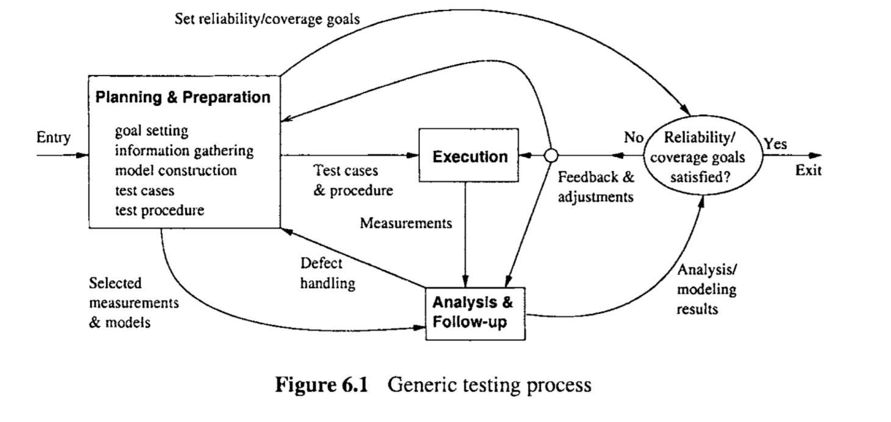

# Chapter 6 TESTING: CONCEPTS, ISSUES, AND TECHNIQUES

The basic idea of testing involves the execution of software and the observation of its behavior or outcome. If a failure is observed, the execution record is analyzed to locate and fix the fault(s) that caused the failure. Otherwise, we gain some confidence that the software under testing is more likely to fulfill its designated functions. We cover basic concepts, issues, and techniques related to testing in this chapter. 

> 测试的基本思想包括软件的执行和对其行为或结果的观察。如果观察到故障，则分析执行记录，定位并解决导致故障的原因。否则，我们获得了一些信心，即测试中的软件更有可能实现其指定的功能。我们将在本章中介绍与测试相关的基本概念、问题和技术。

## 6.1 PURPOSES, ACTIVITIES, PROCESSES, AND CONTEXT 

We first present an overview of testing in this section by examining the motivation for testing, the basic activities and process involved in testing, and how testing fits into the overall software quality assurance (QA) activities. 

> 我们首先通过检查测试的动机、测试中涉及的基本活动和过程，以及测试如何适应整个软件质量保障(QA)活动，在本节中概述了测试。

### Testing: Why? 

Similar to the situation for many physical systems and products, the purpose of software testing is to ensure that the software systems would work as expected when they are used by their target customers and users. The most natural way to show this fulfillment of expectations is to demonstrate their operation through some “dry-runs” or controlled experimentation in laboratory settings before the products are released or delivered. In the case of software products, such controlled experimentation through program execution is generally called testing.

> 与许多物理系统和产品的情况类似，软件测试的目的是确保软件系统在被目标客户和用户使用时能够按预期工作。在产品发布或交付之前，最自然的方式是通过一些“干跑”或实验室环境中的受控实验来演示它们的操作。在软件产品的情况下，这种通过程序执行的受控实验通常被称为测试。

Because of the relatively defect-free manufacturing process for software as compared to the development process, we focus on testing in the development process. We run or execute the implemented software systems or components to demonstrate that they work as expected. Therefore, “demonstration of proper behavior” is a primary purpose of testing, which can also be interpreted as providing evidence of quality in the context of software QA, or as meeting certain quality goals. 

> 由于与开发过程相比，软件的制造过程相对没有缺陷，我们将重点放在开发过程中的测试上。我们运行或执行已实现的软件系统或组件，以证明它们按预期工作。因此，“适当行为的演示”是测试的主要目的，它也可以被解释为在软件QA上下文中提供质量证据，或者满足某些质量目标。

However, because of the ultimate flexibility of software, where problems can be corrected and fixed much more easily than traditional manufacturing of physical products and systems, we can benefit much more from testing by fixing the observed problems within the development process and deliver software products that are as defect-free as our budget or environment allows. As a result, testing has become a primary means to detect and fix software defects under most development environments, to the degree that ==“detecting and fixing defects”== has eclipsed quality demonstration as the primary purpose of testing for many people and organizations. 

To summarize, testing fulfills two primary purposes: 

* to demonstrate quality or proper behavior; 
* to detect and fix problems. 

I==n this book, we examine testing and describe related activities and techniques with both these purposes in mind, and provide a balanced view of testing. For example, when we analyze the testing results, we focus more on the quality or reliability demonstration aspect.== 

On the other hand, when we test the internal implementations to detect and remove faults that were injected into the software systems in the development process, ==we focus more on the defect detection and removal aspect.==

> 然而，由于软件的最终灵活性，问题可以比物理产品和系统的传统制造更容易地纠正和修复，我们可以通过在开发过程中修复观察到的问题，并在我们的预算或环境允许的情况下交付无缺陷的软件产品，从而从测试中获益更多。因此，在大多数开发环境下，测试已经成为检测和修复软件缺陷的主要手段，在某种程度上，“检测和修复缺陷”已经取代了质量演示，成为许多人和组织测试的主要目的。
>
> 总而言之，测试实现了两个主要目的:
>
> * 展示品质或适当的行为;
> * 检测和解决问题。
>
> 在这本书中，我们考察了测试，描述了相关的活动和技术，并提供了一个平衡的测试视图。例如，当我们分析测试结果时，我们更多地关注质量或可靠性论证方面。
>
> 另一方面，当我们测试内部实现以检测和移除在开发过程中注入到软件系统中的错误时，我们更多地关注缺陷检测和移除方面。

### Major activities and the generic testing process

The basic concepts of testing can be best described in the context of the major activities involved in testing. Although there are different ways to group them (Musa, 1998; Burnstein, 2003; Black, 2004), the major test activities include the following in roughly chronological order: 

* Testplanning andpreparation, which set the goals for testing, select an overall testing strategy, and prepare specific test cases and the general test procedure. 

* Test execution and related activities, which also include related observation and measurement of product behavior. 
* Analysis and follow-up, which include result checking and analysis to determine if a failure has been observed, and if so, follow-up activities are initiated and monitored to ensure removal of the underlying causes, or faults, that led to the observed failures in the first place. 

The overall organization of these activities can be described by the generic testing process illustrated in Figure 6.1. A brief comparison of it with the generic quality engineering process in Figure 5.1 reveals many similarities. In fact, we can consider this generic testing process as an instantiation of the generic quality engineering process to testing. 

The major test activities are centered around test execution,orperforming the actual tests. At a minimum, testing involves executing the software and communicating the related observations. In fact, many forms of informal testing include just this middle group of activities related to test execution, with some informal ways to communicate the results and fix the defects, but without much planning and preparation. However, as we will see in the rest of Part 11, in all forms of systematic testing, the other two activity groups, particularly test planning and preparation activities, play a much more important role in the overall testing process and activities.

The execution of a specific test case, or a sub-division of the overall test execution sequence for some systems that require continuous operation, is often referred to as a “test run”. One of the key component to effective test execution is the handling of problems to ensure that failed runs will not block the executions of other test cases. This is particularly important for systems that require continuous operation. To many people, defect fixing is not considered to be a part of testing, but rather a part of the development activities. 

However, re-verification of problem fixes is considered as a part of testing. In this book, we consider all of these activities as a part of testing. 

Data captured during execution and other related measurements can be used to locate and fix the underlying faults that led to the observed failures. After we have determined if a test run is a success or failure, appropriate actions can be initiated for failed runs to locate and fix the underlying faults. In addition, further analyses can be performed to provide valuable feedback to the testing process and to the overall development process in general. These analysis results provide us with assessments of the current status with respect to progress, effort, defect, and product quality, so that decisions, such as when to stop testing, can be made based on facts instead of on people’s gut feelings. In addition, some analyses can also help us identify opportunities for long-term product quality improvement. Therefore, various other activities, such as measurement, analysis, and follow-up activities, also need to be supported.

> 主要活动和通用测试过程
>
> 测试的基本概念可以在测试中涉及的主要活动的上下文中得到最好的描述。尽管有不同的方法来对它们进行分组(Musa, 1998;伯恩斯坦,2003;Black, 2004)，主要的测试活动大致按时间顺序排列如下:
>
> * 测试计划和准备，设定测试目标，选择整体测试策略，准备具体的测试用例和一般测试过程。
>
> * 测试执行和相关活动，包括对产品行为的相关观察和测量。
> * 分析和跟踪，包括结果检查和分析，以确定是否观察到故障，如果是，则启动和监视跟踪活动，以确保首先消除导致观察到的故障的根本原因或故障。
>
> 这些活动的总体组织可以用图6.1所示的通用测试过程来描述。将其与图5.1中的一般质量工程过程进行简要比较，可以发现许多相似之处。事实上，我们可以把这个通用的测试过程看作是测试的通用质量工程过程的一个实例。
>
> 主要的测试活动以测试执行为中心，或者执行实际的测试。至少，测试包括执行软件和交流相关的观察结果。事实上，许多形式的非正式测试只包括与测试执行相关的中间活动组，使用一些非正式的方法来交流结果和修复缺陷，但是没有太多的计划和准备。然而，正如我们将在第11部分的其余部分中看到的，在所有形式的系统测试中，其他两个活动组，特别是测试计划和准备活动，在整个测试过程和活动中扮演着更重要的角色。
>
> 一个特定测试用例的执行，或者一些需要连续操作的系统的整体测试执行序列的一个细分，通常被称为“测试运行”。有效测试执行的关键组件之一是处理问题，以确保失败的运行不会阻塞其他测试用例的执行。这对于需要连续运行的系统尤为重要。对许多人来说，缺陷修复不被认为是测试的一部分，而是开发活动的一部分。
>
> 但是，问题修复的重新验证被认为是测试的一部分。在本书中，我们认为所有这些活动都是测试的一部分。
>
> 在执行期间捕获的数据和其他相关测量可用于定位和修复导致观察到的故障的潜在错误。在确定测试运行是成功还是失败之后，可以为失败的运行启动适当的操作，以定位和修复底层错误。此外，还可以执行进一步的分析，为测试过程和总体开发过程提供有价值的反馈。这些分析结果为我们提供了关于进度、努力、缺陷和产品质量的当前状态的评估，以便决策，例如何时停止测试，可以基于事实而不是人们的直觉来做出。此外，一些分析还可以帮助我们识别长期产品质量改进的机会。因此，各种其他活动，如度量、分析和后续活动，也需要得到支持。

### Sub-activities in test planning and preparation

Because of the increasing size and complexity of today’s software products, informal testing without much planning and preparation becomes inadequate. Important functions, features, and related software components and implementation details could be easily overlooked in such informal testing. Therefore, there is a strong need for planned, monitored, managed and optimized testing strategies based o n 1  systematic considerations for quality, formal models, and related techniques. Test cases can be planned and prepared using such testing strategies, and test procedures need to be prepared and followed. The pre-eminent role of test planning and preparation in overall testing is also illustrated in Figure 6.1, by the much bigger box for related activities than those for other activities. Test planning and preparation include the following sub-activities:

* Goal setting: This is similar to the goal setting for the overall quality engineering process described in Chapter 5. However, it is generally more concrete here, because the quality views and attributes have been decided by the overall quality engineering process. What remains to be done is the specific testing goals, such as reliability or coverage goals, to be used as the exit criteria. This topic will be discussed further in Section 6.4 in connection to the question: “When to stop testing?”. 
* Test case preparation: This is the activity most people naturally associate with test preparation. It includes constructing new test cases or generating them automatically, selecting from existing ones for legacy products, and organizing them in some systematic ways for easy execution and management. In most systematic testing, these test cases need to be constructed, generated, or selected based on some formal models associated with formal testing techniques covered in Chapters 8 through 11. 
* Test procedure preparation: This is an important activity for test preparation. For systematic testing on a large scale for most of today’s software products and softwareintensive systems, a formal procedure is more of a necessity than a luxury. It can be defined and followed to ensure effective test execution, problem handling and resolution, and the overall test process management.

> 由于当今软件产品的规模和复杂性不断增加，没有太多计划和准备的非正式测试变得不充分。在这种非正式的测试中，重要的功能、特性和相关的软件组件和实现细节很容易被忽略。因此，非常需要基于对质量、正式模型和相关技术的系统考虑的计划、监视、管理和优化的测试策略。可以使用这样的测试策略来计划和准备测试用例，并且需要准备和遵循测试过程。测试计划和准备在整体测试中的突出作用也在图6.1中得到说明，相关活动的方框比其他活动的方框大得多。测试计划和准备包括以下子活动:
>
> * 目标设定: 这类似于第5章中描述的整体质量工程过程的目标设定。然而，这里通常更具体，因为质量视图和属性是由整个质量工程过程决定的。剩下要做的是特定的测试目标，如可靠性或覆盖率目标，将被用作退出标准。这个主题将在第6.4节中进一步讨论:“何时停止测试?”
> * 测试用例准备: 这是大多数人自然地与测试准备联系在一起的活动。它包括构建新的测试用例或自动生成它们，从现有的遗留产品中选择，并以一些系统的方式组织它们，以便于执行和管理。在大多数系统测试中，这些测试用例需要根据与第8章到第11章所述的正式测试技术相关的一些正式模型来构建、生成或选择。
> * 测试程序准备: 这是测试准备的重要活动。对于当今大多数软件产品和软件密集型系统的大规模系统测试来说，正式的过程与其说是奢侈品，不如说是必需品。它可以被定义和遵循，以确保有效的测试执行、问题处理和解决，以及整体的测试过程管理。

### Testing as a part of  QA in the overall software process

In the overall framework of software quality engineering, testing is an integral part of the QA activities. In our classification scheme based on different ways of dealing with defects in Chapter 3, testing falls into the category of defect reduction alternatives that also include inspection and various static and dynamic analyses. Unlike inspection, testing detects faults indirectly through the execution of software instead of critical examination used in inspection. However, testing and inspection often finds different kinds of problems, and may be more effective under different circumstances. Therefore, inspection and testing should be viewed more as complementary QA alternatives instead of competing ones. 

Similarly, other QA alternatives introduced in Chapter 3 and described in Part I11 may be used to complement testing as well. For example, defect prevention may effectively reduce defect injections during software development, resulting in fewer faults to be detected and removed through testing, thus reducing the required testing effort and expenditure. Formal verification can be used to verify the correctness of some core functions in a product instead of applying exhaustive testing to them. Fault tolerance and failure containment strategies might be appropriate for critical systems where the usage environment may involve many unanticipated events that are hard or impossible to test during development. As we will examine later in Chapter 17, different QA alternatives have different strengths and weaknesses, and a concerted effort and a combined strategy involving testing and other QA techniques are usually needed for effective QA. 

As an important part of QA activities, testing also fits into various software development processes as an important phase of development or as important activities accompanying other development activities. In the waterfall process, testing is concentrated in the dedicated testing phase, with some unit testing spread over to the implementation phases and some late testing spread over to the product release and support phase (Zelkowitz, 1988). 

However, test preparation should be started in the early phases. In addition, test result analyses and follow-up activities should be carried out in parallel to testing, and should not stop even after extensive test activities have stopped, to ensure discovered problems are all resolved and long-term improvement initiatives are planned and carried out. 

Although test activities may fit into other development processes somewhat differently, they still play a similarly important role. In some specific development processes, testing plays an even more important role. For example, test-driven development plays a central role in extreme programming (Beck, 2003). Various maintenance activities also need the active support of software testing. All these issues will be examined further in Chapter 12 in connection to testing sub-phases and specialized test tasks.

> 在软件质量工程的整体框架中，测试是QA活动的一个组成部分。在我们的分类方案中，基于第3章中处理缺陷的不同方法，测试属于减少缺陷的替代方法的范畴，还包括检查和各种静态和动态分析。与检查不同，测试通过软件的执行间接地检测故障，而不是在检查中使用关键检查。然而，测试和检查经常发现不同种类的问题，并且在不同的情况下可能更有效。因此，检查和测试应该更多地被视为QA的补充选择，而不是相互竞争。
>
> 同样，在第3章中介绍和第11部分中描述的其他QA替代方法也可以用于补充测试。例如，缺陷预防可以有效地减少软件开发期间的缺陷注入，从而减少需要通过测试检测和移除的错误，从而减少所需的测试工作和支出。形式验证可以用来验证产品中某些核心功能的正确性，而不是对它们进行详尽的测试。容错和故障遏制策略可能适用于使用环境可能涉及许多在开发期间难以或不可能测试的意外事件的关键系统。正如我们将在后面的第17章中讨论的那样，不同的QA选择有不同的优点和缺点，有效的QA通常需要协调一致的努力和包含测试和其他QA技术的组合策略。
>
> 作为QA活动的重要组成部分，测试也适合作为开发的重要阶段或作为伴随其他开发活动的重要活动的各种软件开发过程。在瀑布过程中，测试集中在专门的测试阶段，一些单元测试扩展到实现阶段，一些后期测试扩展到产品发布和支持阶段(Zelkowitz, 1988)。
>
> 然而，测试准备应该在早期阶段就开始。此外，测试结果分析和后续活动应与测试并行进行，即使在广泛的测试活动停止后也不应停止，以确保发现的问题全部得到解决，并计划和执行长期改进计划。
>
> 尽管测试活动可能以不同的方式适合于其他开发过程，但它们仍然扮演着类似的重要角色。在某些特定的开发过程中，测试扮演着更重要的角色。例如，测试驱动开发在极限编程中起着核心作用(Beck, 2003)。各种维护活动也需要软件测试的积极支持。所有这些问题将在第12章中与测试子阶段和专门的测试任务相关的部分进一步研究。

## 6.2 QUESTIONS ABOUT TESTING

We next discuss the similarities and differences among different test activities and techniques by examining some systematic questions about testing.

> 接下来，我们将通过考察一些关于测试的系统问题来讨论不同测试活动和技术之间的异同。

### ==Basic questions about testing==

Our basic questions about testing are related to the objects being tested, perspectives and views used in testing, and overall management and organization of test activities, as described below: 

* What artifacts are tested? The primary types of objects or software artifacts to be tested are software programs or code written in different programming languages. Program code is the focus of our testing effort and related testing techniques and activities. A related question, “What other artifacts can also be tested?”, is answered in Chapter 12 in connection to specialized testing. 
* What to test, and what kind o f  faults i s  found? Black-box (or functional) testing verifies the correct handling of the external functions provided or supported by the software, or whether the observed behavior conforms to user expectations or product specifications. White-box (or structural) testing verifies the correct implementation of internal units, structures, and relations among them. 
  When black-box testing is performed, failures related to specific external functions can be observed, leading to corresponding faults being detected and removed. The emphasis is on reducing the chances of encountering functional problems by target customers. On the other hand, when white-box testing is performed, failures related to internal implementations can be observed, leading to corresponding faults being detected and removed. The emphasis is on reducing internal faults so that there is less chance for failures later on no matter what kind of application environment the software is subjected to. Related issues are examined in Section 6.3. 
* When, or at what defect level, to stop testing? Most of the traditional testing techniques and testing sub-phases use some coverage information as the stopping criterion, with the implicit assumption that higher coverage means higher quality or lower levels of defects. On the other hand, product reliability goals can be used as a more objective criterion to stop testing. The coverage criterion ensures that certain types of faults are detected and removed, thus reducing the number of defects to a lower level, although quality is not directly assessed. The usage-based testing and the related reliability criterion ensure that the faults that are most likely to cause problems to customers are detected and removed, and the reliability of the software reaches certain targets before testing stops. Related issues are examined in Section 6.4.

> 关于测试的基本问题
>
> 我们关于测试的基本问题与被测试的对象、测试中使用的透视图和视图，以及测试活动的整体管理和组织有关，如下所述:
>
> * 测试哪些工件?要测试的对象或软件工件的主要类型是用不同编程语言编写的软件程序或代码。程序代码是我们测试工作以及相关测试技术和活动的焦点。一个相关的问题是，“还可以测试哪些其他工件?”的问题在第12章的专门测试中得到了回答。
> * 测试什么，发现了什么样的故障?黑盒(或功能)测试验证软件提供或支持的外部功能的正确处理，或者观察到的行为是否符合用户期望或产品规格。白盒(或结构)测试验证内部单元、结构和它们之间关系的正确实现。
>   当执行黑盒测试时，可以观察到与特定外部功能相关的故障，从而检测并消除相应的故障。重点是减少目标客户遇到功能问题的机会。另一方面，当执行白盒测试时，可以观察到与内部实现相关的失败，从而检测和删除相应的错误。重点是减少内部故障，以便无论软件处于哪种应用程序环境中，以后发生故障的机会都更少。相关问题将在第6.3节中讨论。
>   什么时候，或者在什么缺陷级别停止测试?大多数传统的测试技术和测试子阶段使用一些覆盖率信息作为停止标准，隐含的假设是更高的覆盖率意味着更高的质量或更低的缺陷级别。另一方面，产品可靠性目标可以作为一个更客观的停止测试的标准。覆盖标准确保某些类型的错误被检测和移除，从而将缺陷的数量减少到一个较低的水平，尽管质量不是直接评估的。基于使用的测试和相关的可靠性准则确保在测试停止之前，软件的可靠性达到一定的目标，从而检测和消除最可能给客户带来问题的故障。相关问题将在第6.4节中讨论。

### Questions about testing techniques

Many different testing techniques can be applied to perform testing in different sub-phases, for different types of products, and under different environments. Various questions regarding these testing techniques can help us get a better understanding of many related issues, including:

* What is the specific testing technique used? 

  This question is answered in connection with the what-to-test and stopping-criteria in Sections 6.3 and 6.4. Many commonly used testing techniques are described in detail in Chapters 8 through 11.

* What is the underlying model used in a specific testing technique?

  Since most of the systematic techniques for software testing are based on some formalized models, we need to examine the types and characteristics of these models to get a better understanding of the related techniques. In fact, the coverage of major testing techniques in Chapters 8 through 11 is organized by the different testing models used, as follows:

  * There are two basic types of models: those based on simple structures such as checklists and partitions in Chapter 8, and those based on finite-state machines (FSMs) in Chapter 10.
  * The above models can be directly used for testing basic coverage defined accordingly, such as coverage of checklists and partitions in Chapter 8 and coverage of FSM states and transitions in Chapter 10.
  * For usage-based testing, minor modifications to these models are made to associate usage probabilities to partition items as in Musa’s operational profiles in Chapter 8 and to make state transitions probabilistic as in Markov chain based statistical testing in Chapter 10.
  * Some specialized extensions to the two basic models can be used to support several commonly used testing techniques, such as input domain testing that extends partition ideas to input sub-domains and focuses on testing related boundary conditions in Chapter 9, and control flow and data flow testing (CFT & DFT) that extends FSMs to test complete execution paths or to test data dependencies in execution and interactions in Chapter 11.

* Are techniques for testing in other domains applicable to software testing? 

  Examples include errorlfault seeding, mutation, immunization and other techniques used in physical, biological, social, and other systems and environments. These questions are examined in Chapter 12, in connection to specialized testing.

* If multiple testing techniques are available, can they be combined or integrated for better effectiveness or eflciency? 

  This question is the central theme of our test integration discussions in Chapter 12. 
  Different techniques have their own advantages and disadvantages, different applicability and effectiveness under different environments. They may share many common ideas, models, and other artifacts. Therefore, it makes sense to combine or integrate different testing techniques and related activities to maximize product quality or other objectives while minimizing total cost or effort.

> 关于测试技术的问题
>
> 可以应用许多不同的测试技术，在不同的子阶段、不同类型的产品和不同的环境下执行测试。关于这些测试技术的各种问题可以帮助我们更好地理解许多相关问题，包括:
>
> * 使用的具体测试技术是什么?
>
> 这个问题的答案与第6.3节和第6.4节中的测试内容和停止标准有关。在第8章到第11章中详细描述了许多常用的测试技术。
>
> * 在特定测试技术中使用的底层模型是什么?
>
> 由于大多数软件测试的系统技术都是基于一些形式化的模型，我们需要检查这些模型的类型和特征，以便更好地理解相关技术。事实上，第8章到第11章中主要测试技术的覆盖范围是按照所使用的不同测试模型组织的，如下所示:
>
> 有两种基本类型的模型:第8章中基于简单结构的模型，如检查表和分区，以及第10章中基于有限状态机的模型。
>
> * 以上模型可以直接用于测试相应定义的基本覆盖，例如第8章中检查列表和分区的覆盖以及第10章中FSM状态和转换的覆盖。
>
> * 对于基于使用的测试，对这些模型进行了微小的修改，将使用概率与分区项关联起来，如第8章中Musa的操作配置文件，并使状态转移概率如第10章中基于马尔可夫链的统计测试。
>
> * 这两个基本模型的一些特殊扩展可以用来支持几种常用的测试技术，比如输入域测试，它将分区思想扩展到输入子域，并在第9章中重点测试相关的边界条件，以及控制流和数据流测试(CFT & DFT)，它扩展了fsm，以测试完整的执行路径或测试执行和交互中的数据依赖关系。
>
> * 其他领域的测试技术是否适用于软件测试?
>
>   例子包括在物理、生物、社会和其他系统和环境中使用的错误、错误播种、突变、免疫和其他技术。这些问题将在第12章中与专门的测试联系起来进行检查。
>
> * 如果有多种测试技术可用，它们是否可以组合或集成以获得更好的效果或效率?
>
> 这个问题是我们在第12章中测试集成讨论的中心主题。
> 不同的技术有自己的优缺点，在不同的环境下有不同的适用性和有效性。它们可能共享许多共同的想法、模型和其他工件。因此，结合或集成不同的测试技术和相关活动以最大化产品质量或其他目标，同时最小化总成本或工作量是有意义的。

### Questions about test activities and management

Besides the questions above, various other questions can also be used to help us analyze and classify different test activities. Some key questions are about initiators and participants of these activities, organization, and management of specific activities, etc., as follows:

* Who performs which specific activities? 

  Different people may be involved in different roles. This issue is examined in Chapter 7 in connection to the detailed description of major test activities. A related issue is the automation of some of these manual tasks performed by people, also discussed in Chapter 7. 

* When can specific test activities be performed? 

  Because testing is an execution-based QA activity, a prerequisite to actual testing is the existence of the implemented software units, components, or systems to be tested, although preparation for testing can be carried out in earlier phases of software development. As a result, actual testing of large software systems is typically organized and divided into various sub-phases starting from the coding phase up to post-release product support. A related question is the possibility of specialized testing activities that are more applicable to specific products or specific situations instead of to specific sub-phases. Issues related to these questions are examined in Chapter 12. 

* What process is followed for these test activities? 

  We have answered this question in Section 6.1. Some related management issues are also discussed in Chapter 7 

* Is test automation possible? And if so, what kind of automated testing tools are available and usable for specific applications? 

  These questions and related issues are examined in Chapter 7 in connection with major test activities and people’s roles and responsibilities in them. 

* What artifacts are used to manage the testing process and related activities? 

  This question is answered in Chapter 7 in connection with test activities management issues. 

* What is the relationship between testing and various defect-related concepts? 

  This question has been answered above and in Chapter 3. 

* What is the general hardware/software/organizational environment for testing?

  This questions is addressed in Chapter 7, in connection with major test activities management issues.

* What is the product type or market segment for the product under testing?

  Most of the testing techniques we describe are generally applicable to most application domains. Some testing techniques that are particularly applicable or suitable to specific application domains or specific types of products are also included in Chapter 12. We also attempt to cover diverse product domains in our examples throughout the book.

The above lists may not be all-inclusive lists of questions and issues that can be used to classify and examine testing techniques and related activities. However, they should include most of the important questions people ask regarding testing and important issues discussed in testing literature (Howden, 1980; Myers, 1979; Miller and Howden, 1981; Beizer, 1990; Burnstein, 2003; Black, 2004; Huo et al., 2003). We use the answers to these questions as the basis for test classification and examination, and to organize our chapters on testing.

> 关于测试活动和管理的问题
>
> 除了上述问题之外，还可以使用其他各种问题来帮助我们分析和分类不同的测试活动。一些关键问题是关于这些活动的发起者和参与者，具体活动的组织和管理等。
>
> * 谁执行哪些具体活动?
>
> 不同的人可能扮演不同的角色。这个问题将在第7章中与主要测试活动的详细描述联系起来进行检查。一个相关的问题是由人执行的一些手工任务的自动化，也在第7章中讨论。
>
> * 何时可以执行特定的测试活动?
>
> 因为测试是基于执行的QA活动，所以实际测试的先决条件是要测试的已实现的软件单元、组件或系统的存在，尽管测试的准备工作可以在软件开发的早期阶段进行。因此，大型软件系统的实际测试通常被组织并划分为各种子阶段，从编码阶段一直到发布后的产品支持。一个相关的问题是专门的测试活动的可能性，它更适用于特定的产品或特定的情况，而不是特定的子阶段。与这些问题相关的问题将在第12章中进行讨论。
>
> * 这些测试活动遵循什么流程?
>
> 我们已经在6.1节中回答了这个问题。第七章还讨论了一些相关的管理问题
>
> 测试自动化是可能的吗?如果是的话，对于特定的应用程序，什么样的自动化测试工具是可用的和可用的?
>
> 这些问题和相关的问题将在第7章中与主要的测试活动以及人们在其中的角色和责任联系起来进行检查。
>
> * 使用哪些工件来管理测试过程和相关活动?
>
> 这个问题将在第7章与测试活动管理相关的问题中得到解答。
>
> * 测试与各种缺陷相关概念之间的关系是什么?
>
> 这个问题已经在上面和第三章中得到了回答。
>
> * 测试的一般硬件/软件/组织环境是什么?
>
> 这个问题将在第7章中讨论，与主要的测试活动管理问题相关。
>
> * 测试产品的产品类型或市场细分是什么?
>
> 我们描述的大多数测试技术通常适用于大多数应用程序领域。一些特别适用或适合于特定应用领域或特定类型产品的测试技术也包括在第12章中。我们还试图在本书的示例中涵盖不同的产品领域。
>
> 上述列表可能不是用于分类和检查测试技术及相关活动的所有问题和事项的列表。然而，它们应该包括人们对测试提出的大多数重要问题以及测试文献中讨论的重要问题(Howden, 1980;迈尔斯,1979;Miller and Howden, 1981;贝泽尔,1990;伯恩斯坦,2003;黑色,2004;霍等人，2003)。我们使用这些问题的答案作为测试分类和考试的基础，并组织我们关于测试的章节。

## 6.3 FUNCTIONAL VS. STRUCTURAL TESTING: WHAT TO TEST?

The main difference between functional and structural testing is the perspective and the related focus: Functional testing focus on the external behavior of a software system or its various components, while viewing the object to be tested as a black-box that prevents us from seeing the contents inside. On the other hand, structural testing focus on the internal implementation, while viewing the object to be tested as a white-box that allows us to see the contents inside. Therefore, we start further discussion about these two basic types of testing by examining the objects to be tested and the perspectives taken to test them.

> 功能测试与结构测试:测试什么?
>
> 功能测试和结构测试之间的主要区别在于视角和相关焦点:功能测试关注软件系统或其各种组件的外部行为，而将要测试的对象视为阻止我们看到内部内容的黑盒。另一方面，结构测试侧重于内部实现，同时将要测试的对象视为允许我们查看其内部内容的白盒。因此，我们通过检查要测试的对象和用于测试它们的透视图，开始进一步讨论这两种基本类型的测试。

### Objects and perspectives

As the primary type of objects to be tested, software programs or code exists in various forms and is written in different programming languages. They can be viewed either as individual pieces or as an integrated whole. Consequently, there are different levels of testing corresponding to different views of the code and different levels of abstraction, as follows:

* At the most detailed level, individual program elements can be tested. This includes testing of individual statements, decisions, and data items, typically in a small scale by focusing on an individual program unit or a small component. Depending on the different programming languages used, this unit may correspond to a function, a procedure, a subroutine or a method. As for the components, concepts may vary, but generally include a collection of smaller units that together accomplish something or form an object.
* At the intermediate level, various program elements or program components may be treated as an interconnected group, and tested accordingly. This could be done at component, sub-system, or system levels, with the help of some models to capture the interconnection and other relations among different elements or components.
* At the most abstract level, the whole software systems can be treated as a “blackbox”, while we focus on the functions or input-output relations instead of the internal implementation.

In each of the above abstraction levels, we may choose to focus on either the overall behavior or the individual elements that make up the objects of testing, resulting in the difference between functional testing and structural testing. The tendency is that at higher levels of abstraction, functional testing is more likely to be used; while at lower levels of abstraction, structural testing is more likely to be used. However, the other pairing is also possible, as we will see in some specific examples later. 

Corresponding to these different levels of abstraction, actual testing for large software systems is typically organized and divided into various sub-phases starting from the coding phase up to post-release product support, including unit testing, component testing, integration testing, system testing, acceptance testing, beta testing, etc. Unit testing and component testing typically focus on individual program elements that are present in the unit or component. System testing and acceptance testing typically focus on the overall operations of the software system as a whole. These testing sub-phases are described in Chapter 12.

> 对象和透视图
>
> 作为被测试对象的主要类型，软件程序或代码以各种形式存在，并用不同的编程语言编写。它们既可以被视为单独的部分，也可以被视为一个整体。因此，有不同的测试级别对应于不同的代码视图和不同的抽象级别，如下所示:
>
> * 在最详细的层面上，可以测试单个程序元素。这包括对单个语句、决策和数据项的测试，通常是通过关注单个程序单元或小组件来进行小规模的测试。根据所使用的不同编程语言，这个单元可以对应于一个函数、一个过程、一个子程序或一个方法。至于组件，概念可能会有所不同，但通常包括一组较小的单元，它们一起完成某些事情或形成一个对象。
> * 在中间层次，各种程序元素或程序组件可以作为一个相互关联的组来处理，并相应地进行测试。这可以在组件、子系统或系统级别上完成，借助一些模型来捕获不同元素或组件之间的互连和其他关系。
> * 在最抽象的层面上，整个软件系统可以被视为一个“黑盒子”，而我们关注的是功能或输入输出关系，而不是内部实现。
>
> 在上面的每个抽象级别中，我们可以选择关注整体行为或组成测试对象的单个元素，从而导致功能测试和结构测试之间的差异。趋势是，在更高的抽象层次上，功能测试更有可能被使用;在较低的抽象层次上，更有可能使用结构测试。然而，另一种配对也是可能的，我们将在后面的一些具体示例中看到。
>
> 与这些不同的抽象层次相对应，大型软件系统的实际测试通常被组织并划分为各种子阶段，从编码阶段一直到发布后的产品支持，包括单元测试、组件测试、集成测试、系统测试、验收测试、beta测试等。单元测试和组件测试通常关注出现在单元或组件中的单个程序元素。系统测试和验收测试通常关注软件系统作为一个整体的整体操作。这些测试子阶段将在第12章中描述。

### Functional o r  black-box testing (BBT)

Functional testing verifies the correct handling of the external functions provided by the software, through the observation of the program external behavior during execution. Because the software is treated as a black-box, with the external behavior observed through its input, output, and other observable characteristics, it is also commonly referred to as black-box testing (BBT). In this book, we use these two terms interchangeably. 

The simplest form of BBT is to start running the software and make observations in the hope that it is easy to distinguish between expected and unexpected behavior. This form of testing is also referred to as “ad hoc” testing. Some unexpected behavior, such as a crash, is easy to detect. Once we determine that it is caused by software through repeated execution to eliminate the possibilities of hardware problems, we can pass the information to responsible parties to have the problem fixed. In fact, this is the common way through which problems experienced by actual customers are reported and fixed. 

> 功能测试通过观察程序在执行过程中的外部行为来验证软件所提供的外部功能的正确处理。因为软件被视为一个黑盒，通过它的输入、输出和其他可观察的特征来观察外部行为，所以它通常也被称为黑盒测试(BBT)。在本书中，我们交替使用这两个术语。
>
> BBT最简单的形式是开始运行软件并进行观察，希望能够很容易地区分预期和意外的行为。这种形式的测试也被称为“特别”测试。一些意想不到的行为，比如崩溃，很容易被检测到。一旦我们通过重复执行确定是由软件引起的，以消除硬件问题的可能性，我们就可以将信息传递给责任方进行问题修复。事实上，这是报告和修复实际客户遇到的问题的常用方法。

Another common form of BBT is the use of specification checklists, which list the external functions that are supposed to be present, as well as some information about the expected behavior or input-output pairing. Notice here that we used the term input to mean any action, artifact, or resource provided in the process of running a program, either at the beginning or at any time during the program execution. Similarly, we use the term output to mean any action, artifact, or result produced by the running program, either at the end or at any time during the program execution. Concrete examples of input to a calculator program might include the specific numbers entered and the action requested, such as the division operation of two numbers. The output could be the actual division result, or some error message, such as when attempting to divide by zero. When problems are observed, specific follow-up actions are carried out to fix them. 

More formalized and systematic BBT can be based on some formal models. These formal testing models are derived from system requirements or functional specifications. Some traditional white-box testing techniques can also be adapted to perform BBT, such as control-flow and data-flow testing for external functional units instead of for internal implementations.

BBT can follow the generic testing process described in Section 6.1 to carry out the major test activities of planning, execution, and follow-up. In test planning, the focus is on identifying the external functions to test, and deriving input conditions to test these functions. The identified external functions are usually associated with some user expectations, from which both the input and the expected output can be derived to form the test cases. For example, for a compiler, the input is source code to be compiled, and the output is the resulting object or executable code. Part of the expected behavior is system termination, that is, the compiler should produce some output within a limited amount of time. Another part of the expected behavior is that if illegal programs are provided as input, object or executable code will not be generated, and the reason should be given. Therefore, a collection of programs to be compiled constitutes the test suite, or the collection of test cases. This test suite should typically consist of both legal and illegal programs to cover the expected spectrum of input. The testing goals may be stated explicitly as exit quality levels or implicitly as the completion of planned test cases. 

> BBT的另一种常见形式是使用规范检查表，它列出了应该存在的外部函数，以及关于预期行为或输入输出配对的一些信息。注意，在这里，我们使用术语“输入”来表示在运行程序的过程中提供的任何操作、工件或资源，无论是在开始时还是在程序执行期间的任何时候。类似地，我们使用术语输出来表示运行的程序在结束时或在程序执行期间的任何时间产生的任何操作、工件或结果。计算器程序输入的具体示例可能包括输入的特定数字和请求的操作，例如两个数字的除法运算。输出可以是实际的除法结果，也可以是一些错误消息，比如试图除以0时的错误消息。当观察到问题时，执行具体的后续行动来解决问题。
>
> 更形式化和系统化的BBT可以基于一些形式化模型。这些正式的测试模型来源于系统需求或功能规范。
> 一些传统的白盒测试技术也可以用于执行BBT，例如对外部功能单元而不是内部实现进行控制流和数据流测试。
>
> BBT可以按照6.1节描述的通用测试流程进行主要测试活动的计划、执行和跟踪。在测试计划中，重点是识别要测试的外部功能，并推导测试这些功能的输入条件。确定的外部功能通常与一些用户期望相关联，从中可以导出输入和预期输出，以形成测试用例。例如，对于编译器，输入是要编译的源代码，输出是结果对象或可执行代码。预期行为的一部分是系统终止，也就是说，编译器应该在有限的时间内产生一些输出。期望行为的另一部分是，如果提供非法程序作为输入，则不会生成目标代码或可执行代码，并应给出原因。因此，要编译的程序的集合构成了测试套件，或者测试用例的集合。这个测试套件通常应该包括合法和非法的程序，以覆盖预期的输入范围。测试目标可以被明确地描述为退出质量级别，或者被隐式地描述为计划测试用例的完成。

The focus of test execution during BBT is to observe the external behavior, to ensure orderly execution of all the test cases, and to record execution information for analysis and follow-up activities. If the observed behavior patterns cannot be immediately identified as failures, information needs to be recorded for further analysis. In the above example of the compiler, the output produced and the execution trace should be recorded, as well as the exact set-up under which the compiler operated. 

Once the execution result is obtained, either individually or as a set, analyses can be carried out to compare the specific behavior and output with the expected ones. This comparison to determine if it is expected behavior or if a failure occurred is called the testing oracle problem. Thus BBT checks whether the observed behavior conforms to user expectations or product specifications. Failures related to specific external functions can be observed, leading to follow-up activities where corresponding faults are detected and removed. The emphasis is on reducing the chances of encountering functional problems by target customers. Information recorded at test execution is used in these follow-up activities to recreate failure scenarios, to diagnose problems, to locate failure causes and identify specific faults in software design and code, and to fix them. An important followup decision, when to stop testing, can be determined either using the traditional functional coverage criteria or reliability criteria, as further elaborated in Section 6.4.

> BBT期间测试执行的重点是观察外部行为，确保所有测试用例有序执行，并记录执行信息，以便分析和后续活动。如果观察到的行为模式不能立即识别为故障，则需要记录信息以供进一步分析。在上面的编译器示例中，应该记录生成的输出和执行跟踪，以及编译器运行的确切设置。
>
> 一旦获得执行结果，无论是单独的还是作为一个集合，都可以进行分析，将特定的行为和输出与预期的行为和输出进行比较。这种比较，以确定是否预期的行为或是否发生了失败被称为测试oracle问题。因此，BBT检查观察到的行为是否符合用户期望或产品规格。可以观察到与特定外部功能相关的故障，从而导致检测和消除相应故障的后续活动。重点是减少目标客户遇到功能问题的机会。在测试执行时记录的信息用于这些后续活动中，以重新创建失败场景，诊断问题，定位失败原因，识别软件设计和代码中的特定错误，并修复它们。一个重要的后续决策，即何时停止测试，可以使用传统的功能覆盖标准或可靠性标准来确定，如6.4节中进一步阐述的那样。

### Structural or white-box testing (WBT)

Structural testing verifies the correct implementation of internal units, such as program statements, data structures, blocks, etc., and relations among them. This is done through test execution by observing the program behavior related to these specific units. Because the software is treated as a white-box, or more appropriately a glass-box or a transparentbox, where one can see through to view the internal units and their interconnections, it is also commonly referred to as white-box testing (WBT) in literature. In keeping with this convention, we also label this as WBT, with the understanding that this “white-box’’ is really transparent so that the tester can see through it. In this book, we also use the two terms, structural testing and WBT, interchangeably. 

Because the connection between execution behavior and internal units needs to be made in WBT, various software tools are typically used. The simplest form of WBT is statement coverage testing through the use of various debugging tools, or debuggers, which help us in tracing through program executions. By doing so, the tester can see if a specific statement has been executed, and if the result or behavior is expected. One of the advantages is that once a problem is detected, it is also located. However, problems of omission or design problems cannot be easily detected through WBT, because only what is present in the code is tested. Another important point worth noting is that the tester needs to be very familiar with the code under testing to trace through its executions. Consequently, WBT and related activities are typically performed by the programmers themselves because of their intimate knowledge of the specific program unit under testing. This dual role also makes defect fixing easy. 

> 结构或白盒测试(WBT)
>
> 结构测试验证内部单元的正确实现，如程序语句、数据结构、块等，以及它们之间的关系。这是通过观察与这些特定单元相关的程序行为的测试执行来完成的。因为软件被看作是一个白盒，或者更恰当地说是一个玻璃盒或者透明盒，在那里人们可以看到内部单元和它们的相互连接，在文献中它也通常被称为白盒测试(WBT)。为了保持这个惯例，我们也将其标记为WBT，理解这个“白盒”是真正透明的，因此测试人员可以看穿它。在本书中，我们也可以互换地使用这两个术语:结构测试和WBT。
>
> 因为需要在WBT中建立执行行为和内部单元之间的连接，所以通常使用各种软件工具。WBT最简单的形式是通过使用各种调试工具或调试器进行语句覆盖率测试，这些工具或调试器帮助我们跟踪程序的执行。通过这样做，测试人员可以看到是否执行了特定的语句，以及结果或行为是否符合预期。其优点之一是，一旦检测到问题，就可以对其进行定位。然而，遗漏问题或设计问题不能通过WBT轻松检测到，因为只测试代码中存在的问题。另一个值得注意的要点是，测试人员需要非常熟悉正在测试的代码，以便跟踪其执行。因此，WBT和相关活动通常由程序员自己执行，因为他们对测试中的特定程序单元有深入的了解。这种双重作用也使缺陷修复变得容易。

Similar to the situation for BBT, more formalized and systematic WBT can be based on some formal models. These formal testing models are typically derived from system implementation details. In fact, the majority of the traditional testing techniques is based on program analyses and program models, and therefore is white-box in nature. 

==WBT can also follow the generic testing process described in Section 6.1, to carry out the major test activities of planning, execution, and follow-up.== However, because of the extensive amount of implementation knowledge required, and due to the possibility of combinatorial explosions to cover these implementation details, WBT is typically limited to a small scale. For small products, not much formal testing process is needed to plan and execute test cases, and to follow up on execution results. For unit testing of large products, the WBT activities are carried out in the encompassing framework where most of the planning is subject to the environment; and the environmental constraints pretty much determine what can be done. Therefore, test planning plays a much less important role in WBT than in BBT. In addition, defect fixing is made easy by the tight connection between program behavior and program units, and through the dual role played by the programmers as testers. Consequently, not much formal testing process is needed. The stopping criteria are also relatively simple: ==Once planned coverage has been achieved, such as exercising all statements, all paths, etc., testing can stop. Sometimes, internal quality measures, such as defect levels, can also be used as a stopping criterion.==

> 与BBT的情况类似，更形式化和系统化的WBT可以基于一些形式化模型。这些正式的测试模型通常来源于系统实现细节。事实上，大多数传统的测试技术是基于程序分析和程序模型的，因此本质上是白盒的。
>
> WBT还可以按照6.1节中描述的通用测试过程，进行主要测试活动的计划、执行和跟踪。然而，由于需要大量的实现知识，并且由于需要组合爆炸来覆盖这些实现细节的可能性，WBT通常限于小范围。对于小型产品，不需要太多正式的测试过程来计划和执行测试用例，并跟踪执行结果。对于大型产品的单元测试，WBT活动是在包含的框架中进行的，其中大部分计划受环境影响;环境限制很大程度上决定了我们能做什么。因此，测试计划在WBT中扮演的角色远不如在BBT中重要。此外，由于程序行为和程序单元之间的紧密联系，以及程序员作为测试人员所扮演的双重角色，缺陷修复变得容易。因此，不需要太多的正式测试过程。停止标准也相对简单:一旦计划的覆盖已经实现，例如执行所有语句、所有路径等，测试就可以停止。有时，内部质量度量，如缺陷水平，也可以用作停止标准。

### Comparing BBT with WBT

To summarize, the key question that distinguishes black-box testing (BBT) from white-box testing (WBT) is the “perspective” question:

* Perspective: BBT views the objects of testing as a black-box while focusing on testing the input-output relations or external functional behavior; while WBT views the objects as a glass-box where internal implementation details are visible and tested.

BBT and WBT can also be compared by the way in which they address the following questions:

* Objects: Although the objects tested may overlap occasionally, WBT is generally used to test small objects, such as small software products or small units of large software products; while BBT is generally more suitable for large software systems or substantial parts of them as a whole. 
* Timeline: WBT is used more in early sub-phases of testing for large software systems, such as unit and component testing, while BBT is used more in late sub-phases, such as system and acceptance testing. 
* Defect focus: In BBT, failures related to specific external functions can be observed, leading to corresponding faults being detected and removed. The emphasis is on reducing the chances of encountering functional problems by target customers. In WBT, failures related to internal implementations can be observed, leading to corresponding faults being detected and removed directly. The emphasis is on reducing internal faults so that there is less chance for failures later on no matter what kind of application environment the software is subjected to.
* Defect detection andfiing: Defects detected through WBT are easier to fix than those through BBT because of the direct connection between the observed failures and program units and implementation details in WBT. However, WBT may miss certain types of defects, such as omission and design problems, which could be detected by BBT. In general BBT is effective in detecting and fixing problems of interfaces and interactions, while WBT is effective for problems localized within a small unit. 
* Techniques: Various techniques can be used to build models and generate test cases to perform systematic BBT, and others can be used for WBT, with some of the same techniques being able to be used for both WBT and BBT. A specific technique is a BBT one if external functions are modeled; while the same technique can be a WBT one if internal implementations are modeled. 
* Tester: BBT is typically performed by dedicated professional testers, and could also be performed by third-party personnel in a setting of IV&V (independent verification and validation); while WBT is often performed by developers themselves.

> 比较BBT和WBT
>
> 总而言之，区分黑盒测试(BBT)和白盒测试(WBT)的关键问题是“透视”问题:
>
> * 视角:BBT将测试对象视为黑盒，侧重于测试输入输出关系或外部功能行为;而WBT将对象视为一个玻璃盒，在其中可以看到内部实现细节并对其进行测试。
>
> BBT和WBT还可以通过解决以下问题的方式进行比较:
>
> * 对象:虽然测试的对象偶尔会重叠，但WBT通常用于测试小对象，例如小型软件产品或大型软件产品的小单元;而BBT通常更适合大型软件系统或它们的大部分作为一个整体。
> * 时间轴:WBT更多地用于大型软件系统测试的早期子阶段，如单元和组件测试，而BBT更多地用于后期的子阶段，如系统和验收测试。
> * 缺陷焦点:在BBT中，可以观察到与特定外部功能相关的故障，从而发现并消除相应的故障。重点是减少目标客户遇到功能问题的机会。在WBT中，可以观察到与内部实现相关的故障，从而直接检测和消除相应的故障。重点是减少内部故障，以便无论软件处于哪种应用程序环境中，以后发生故障的机会都更少
> * 缺陷检测和修正:由于观察到的故障与WBT中的程序单元和实现细节有直接联系，因此通过WBT检测到的缺陷比通过BBT更容易修复。然而，WBT可能会遗漏某些类型的缺陷，例如遗漏和设计问题，而这些缺陷是可以被BBT检测到的。一般来说，BBT在检测和修复接口和交互问题上是有效的，而WBT在局部小单元的问题上是有效的。
> * 技术:各种技术可用于构建模型和生成测试用例，以执行系统的BBT，其他技术可用于WBT，其中一些相同的技术可用于WBT和BBT。如果外部功能建模，则特定技术是BBT技术;如果对内部实现进行了建模，同样的技术也可以是WBT技术。
> * 测试人员:BBT通常由专门的专业测试人员进行，也可以由第三方人员在IV&V(独立验证及确认)的设置中进行;而WBT通常由开发人员自己执行。

## 6.4 COVERAGE-BASED VS. USAGE-BASED TESTING: WHEN TO STOP TESTING?

For most of the testing situations, the answer to the question “when to stop testing?’ depends on the completion of some pre-planned activities, coverage of certain entities, or whether a pre-set goal has been achieved. We next describe the use of different exit criteria and the corresponding testing techniques.

> 基于覆盖率的测试vs.基于使用的测试:何时停止测试?
>
> 对于大多数测试情况，“何时停止测试?”取决于一些预先计划的活动的完成情况、某些实体的覆盖情况或是否达到了预先设定的目标。接下来我们将描述不同的退出标准和相应的测试技术的使用。

### When to stop testing?

The question, “when to stop testing”, can be refined into two different questions:

* On a small or a local scale, we can ask: “When to stop testing for a specific test activity?’ This question is also commonly associated with different testing subphases.
* On a global scale, we can ask: “When to stop all the major test activities?” Because the testing phase is usually the last major development phase before product release, this question is equivalent to: “When to stop testing and release the product?’

These questions may yield different answers, leading us to different testing techniques and related activities. Without a formal assessment for decision making, decision to stop testing can usually be made in two general forms:

* Resource-based criteria, where decision is made based on resource consumptions. 
  The most commonly used such stopping criteria are

  * “Stop when you run out of time.” 
  * “Stop when you run out of money.”

  Such criteria are irresponsible, as far as product quality is concerned, although they may be employed if product schedule or cost are the dominant concerns for the product in question.

* Activity-based criteria, commonly in the form:

  * “Stop when you complete planned test activities.”

  This criterion implicitly assumes the effectiveness of the test activities in ensuring the quality of the software product. However, this assumption could be questionable without strong historical evidence based on actual data from the project concerned.

> 何时停止测试?
>
> “何时停止测试”这个问题可以提炼成两个不同的问题:
>
> * 在小规模或局部范围内，我们可以问:“何时停止特定测试活动的测试?”这个问题通常也与不同的测试子阶段有关。
> * 在全球范围内，我们可以问:“何时停止所有主要的测试活动?”因为测试阶段通常是产品发布前的最后一个主要开发阶段，所以这个问题相当于:“何时停止测试并发布产品?””
>
> 这些问题可能产生不同的答案，导致我们使用不同的测试技术和相关活动。在没有正式评估的情况下，停止检测的决定通常有两种形式:
>
> * 以资源为基础的准则，即根据资源消耗情况作出决策。
>   最常用的停止标准是
>
> * “时间不够的时候就停下来。”
>   “当你没钱的时候就停下来。”
>
> 就产品质量而言，这些标准是不负责任的，尽管如果产品进度或成本是相关产品的主要关注点，它们可能被采用。
>
> * 以活动为本的准则，通常为:
>
> * “当您完成计划的测试活动时停止。”
>
> 这个标准隐含地假设了测试活动在确保软件产品质量方面的有效性。然而，如果没有基于有关项目实际数据的强有力的历史证据，这种假设可能会受到质疑。

Because of these shortcomings, informal decisions without using formal assessments have very limited use in managing the testing process and activities for large software systems. We next examine exit criteria based on formal analyses and assessments.

On the global level, the exit from testing is associated with product release, which determined the level of quality that a customer or a user could expect. In our overall software quality engineering process, this decision is associated with achieving quality goals, as well as achieving other project goals in the overall software development process. Therefore, the most direct and obvious way to make such product release decisions is the use of various reliability assessments. When the assessment environment is similar to the actual usage environment for customers. the resulting reliability measurement would be directly meaningful to these customers.

==The basic idea in using reliability criterion is to set a reliability goal in the quality planning activity during product planning and requirement analysis, and later on to compare the reliability assessment based on testing data to see if this pre-set goal has been reached. If so, the product can be released.== Otherwise, testing needs to continue and product release needs to be deferred. Various models exist today to provide reliability assessments and improvement based on data from testing, as described in Chapter 22.

One important implication of using this criterion for stopping testing is that the reliability assessments should be close to what actual users would expect, which requires that the testing right before product release resembles actual usages by target customers. This requirement resulted in the so-called usage-based testing. On the other hand, because of the large number of customers and usage situations, exhaustive coverage of all the customer usage scenarios, sequences, and patterns is infeasible. ==Therefore, an unbiased statistical sampling is the best that we can hope for, which results in usage-based statistical testing (UBST) that we will describe later in this section. Some specific techniques for such testing are described in Chapters 8 and 10.==

> 由于这些缺点，不使用正式评估的非正式决策在管理大型软件系统的测试过程和活动方面的作用非常有限。接下来，我们将根据正式分析和评估来检查退出标准。
>
> 在全局层面上，测试的退出与产品发布相关联，产品发布决定了客户或用户所期望的质量水平。在我们的整个软件质量工程过程中，这个决策与实现质量目标，以及在整个软件研制过程中实现其他项目目标相关联。因此，做出此类产品发布决策的最直接和最明显的方法是使用各种可靠性评估。当评估环境与客户的实际使用环境相似时。由此产生的可靠性测量对这些客户将有直接意义。
>
> 可靠性准则的基本思想是在产品规划和需求分析过程中，在质量计划活动中设定一个可靠性目标，然后根据测试数据对可靠性评估结果进行比较，以确定是否达到了预定的目标。如果是这样，则可以发布产品。否则，测试需要继续，产品发布需要推迟。如第22章所述，目前存在各种模型来提供基于测试数据的可靠性评估和改进。
>
> 使用此停止测试标准的一个重要含义是，可靠性评估应该接近实际用户的期望，这要求在产品发布之前的测试与目标客户的实际使用相似。这个需求导致了所谓的基于使用的测试。另一方面，由于有大量的客户和使用情况，对所有客户使用场景、序列和模式进行详尽的覆盖是不可行的。因此，无偏统计抽样是我们所能期望的最好结果，这将导致基于使用的统计测试(UBST)，我们将在本节后面介绍。第8章和第10章描述了这种测试的一些具体技术。

For earlier sub-phases of testing, or for stopping criteria related to localized test activities, reliability definition based on customer usage scenarios and frequencies may not be meaningful. For example, many of the internal components are never directly used by actual users, and some components associated with low usage frequencies may be critical for various situations. Under these situations, the use of reliability criterion may not be meaningful or may lead to inadequate testing of some specific components. Alternative exit criteria are needed. For example, as a rule of thumb: 

“Products should not be released unless every component has been tested.”

Criteria similar to this have been adopted in many organizations to test their products and related components. We call these criteria coverage criteria, which involve coverage of some specific entities, such as components, execution paths, statements, etc. The use of coverage criteria is associated with defining appropriate coverage for different testing techniques, linking what was tested with what was covered in some formal assessments.

One implicit assumption in using coverage as the stopping criterion is that everything covered is defect free with respect to this specific coverage aspect, because all defects discovered by the suite of test cases that achieved this coverage goal would have been fixed or removed before product release. This assumption is similar to the one above regarding the effectiveness of test activities, when we use the completion of planned test activities as the exit criterion. However, this assumption is more likely to be enforced because specific coverage is closely linked to specific test cases.

From the quality perspective, the coverage criteria are based on the assumption that higher levels of coverage mean higher quality, and a specific quality goal can be translated into a specific coverage goal. However, we must realize that although there is a general positive correlation between coverage and quality, the relationship between the two is not a simple one. Many other factors need to be considered before an accurate quality assessment can be made based on coverage. For example, different testing techniques and sub-phases may be effective in detecting and removing different types of defects, leading to multistage reliability growth and saturation patterns (Horgan and Mathur, 1995). Nevertheless, coverage information gives us an approximate quality estimate, and can be used as the exit criterion when actual reliability assessment is unavailable, such as in the early sub-phases of testing.

> 对于测试的早期子阶段，或者对于与本地化测试活动相关的停止标准，基于客户使用场景和频率的可靠性定义可能没有意义。例如，许多内部组件从未被实际用户直接使用，而一些使用频率较低的组件可能对各种情况至关重要。在这种情况下，可靠性准则的使用可能没有意义，或者可能导致某些特定部件的测试不充分。需要其他退出标准。例如，作为经验法则:
>
> 
 "除非每个部件都经过测试，否则产品不应放行。" 

>
> 许多组织已经采用了类似的标准来测试他们的产品和相关组件。我们称这些标准为覆盖标准，它涉及到一些特定实体的覆盖，比如组件、执行路径、语句等等。覆盖标准的使用与为不同的测试技术定义适当的覆盖相关，将测试的内容与一些正式评估中覆盖的内容联系起来。
>
> 使用覆盖作为停止标准的一个隐含的假设是，对于这个特定的覆盖方面，所有被覆盖的东西都是没有缺陷的，因为所有由达到这个覆盖目标的测试用例套件发现的缺陷都将在产品发布之前被修复或移除。当我们使用计划测试活动的完成作为退出标准时，这个假设类似于上面关于测试活动有效性的假设。然而，这个假设更有可能被执行，因为特定的覆盖与特定的测试用例紧密相连。
>
> 从质量的角度来看，覆盖标准是基于这样的假设:更高的覆盖水平意味着更高的质量，并且一个特定的质量目标可以转化为一个特定的覆盖目标。然而，我们必须认识到，尽管覆盖率和质量之间存在普遍的正相关关系，但两者之间的关系并不是简单的。在基于覆盖率进行准确的质量评估之前，需要考虑许多其他因素。例如，不同的测试技术和子阶段可以有效地检测和消除不同类型的缺陷，从而导致多级可靠性增长和饱和模式(Horgan和Mathur, 1995)。然而，覆盖率信息给了我们一个近似的质量估计，并且可以在实际可靠性评估不可用时作为退出标准，例如在测试的早期子阶段。

### Usage-based statistical testing (UBST) and operational profiles (OPs)

> 基于使用的统计测试(UBST)和操作概要(OPs)

At one extreme, actual customer usage of software products can be viewed as a form of usage-based testing. When problems are experienced by these customers, some information about the problems, can be reported to software vendors, and integrated fixes can be constructed and delivered to all the customers to prevent similar problems from occurring. However, these post-product-release defect fixing activities could be very expensive because of the massive numbers of software installations. Frequent fixes could also damage the software vendor’s reputation and long-term business viability. The so-called beta test makes use of this usage-and-fix to the advantage of software vendors, through controlled software release so that these beta customers help software development organizations improve their software quality.

In general, if the actual usage, or anticipated usage for a new product, can be captured and used in testing, product reliability could be most directly assured. In usage-based statistical testing (UBST), the overall testing environment resembles the actual operational environment for the software product in the field, and the overall testing sequence, as represented by the orderly execution of specific test cases in a test suite, resembles the usage scenarios, sequences, and patterns of actual software usage by the target customers. Because the massive number of customers and diverse usage patterns cannot be captured in an exhaustive set of test cases, statistical sampling is needed, thus the term “statistical” in the descriptive title of this strategy. For the same reason, “random testing” and “usage-based random testing” are also used in literature. However, we prefer to use the term “usage-based statistical testing” in this book to avoid the confusion between random testing and “ad hoc” testing, where no systematic strategy is implied in “ad hoc” testing.

> 在一个极端情况下，实际客户对软件产品的使用可以被看作是一种基于使用的测试形式。当这些客户遇到问题时，可以将有关问题的一些信息报告给软件供应商，并且可以构建集成的修复程序并将其交付给所有客户，以防止发生类似的问题。然而，由于大量的软件安装，这些产品发布后的缺陷修复活动可能非常昂贵。频繁的修复还可能损害软件供应商的声誉和长期业务生存能力。所谓的beta测试利用了软件供应商的这种使用和修复优势，通过控制软件发布，以便这些beta客户帮助软件开发组织提高他们的软件质量。
>
> 一般来说，如果新产品的实际使用情况或预期使用情况能够被捕获并用于测试，则可以最直接地保证产品的可靠性。在基于使用的统计测试(UBST)中，整体的测试环境类似于该领域中软件产品的实际操作环境，并且整体的测试序列，由测试套件中特定测试用例的有序执行所表示，类似于目标客户实际软件使用的使用场景、序列和模式。由于不能在一组详尽的测试用例中捕获大量的客户和不同的使用模式，因此需要统计抽样，因此在该策略的描述性标题中使用术语“统计”。出于同样的原因，“随机测试”和“基于用法的随机测试”也在文献中使用。然而，我们更喜欢在本书中使用术语“基于使用的统计测试”，以避免随机测试和“特别”测试之间的混淆，在“特别”测试中没有隐含的系统策略。

For practical implementation of such a testing strategy, actual usage information needs to be captured in various models, commonly referred to as “operational profiles” or OPs. For practical implementation of such a testing strategy, actual usage information needs to be captured in various models, commonly referred to as “operational profiles” or OPs.

* Flat OPs, or Musa OPs (Musa, 1993; Musa, 1998), which present commonly used operations in a list, a histogram, or a tree-structure, together with the associated occurrence probabilities. The main advantage of the flat OP is its simplicity, both in model construction and usage. This testing technique is described in Chapter 8. 
* Markov chain based usage models, or Markov OPs (Mills, 1972; Mills et al., 1987b; Whittaker and Thomason, 1994; Kallepalli and Tian, 2001; Tian et al., 2003), which present commonly used operational units in Markov chains, where the state transition probabilities are history independent (Karlin and Taylor, 1975). Complete operations can be constructed by linking various states together following the state transitions, and the probability for the whole path is the product of its individual transition probabilities. Markov models based on state transitions can generally capture navigation patterns better than flat OPs, but are more expensive to maintain and to use. This testing technique is described in Chapter 10.

Usage-based statistical testing (UBST) is generally applicable to the final stage of testing, typically referred to as acceptance testing right before product release, so that stopping testing is equivalent to releasing the product. Other late sub-phases of testing, such as integration and system testing, could also benefit from the knowledge of actual customer usage situations to drive effective reliability improvement before product release, as demonstrated in some case studies in Chapter 22. Naturally, the termination criterion used to stop such testing is achievement of reliability goals.

> 对于这种测试策略的实际实现，需要在各种模型中捕获实际使用信息，通常称为“操作概要文件”或OPs。对于这种测试策略的实际实现，需要在各种模型中捕获实际使用信息，通常称为“操作概要文件”或OPs。
>
> * 扁平OPs，或Musa OPs (Musa, 1993;Musa, 1998)，它以列表、直方图或树状结构的形式呈现常用的操作，以及相关的发生概率。平面OP的主要优点是它在模型构造和使用方面都很简单。第8章描述了这种测试技术。
> * 基于马尔可夫链的使用模型，或马尔可夫OPs (Mills, 1972;Mills等人，1987b;惠特克和托马森，1994;Kallepalli and Tian, 2001;Tian et al.， 2003)，其中提出了马尔可夫链中常用的操作单元，其中状态转移概率与历史无关(Karlin and Taylor, 1975)。完整的操作可以通过将状态转移后的各种状态连接在一起来构造，整个路径的概率是其单个转移概率的乘积。基于状态转换的马尔可夫模型通常可以比平面OPs更好地捕获导航模式，但维护和使用成本更高。第10章描述了这种测试技术。
>
> 基于使用的统计测试(UBST)通常适用于测试的最后阶段，通常指的是产品发布之前的验收测试，因此停止测试等同于发布产品。测试的其他后期子阶段，例如集成和系统测试，也可以从实际客户使用情况的知识中受益，从而在产品发布之前驱动有效的可靠性改进，如第22章中的一些案例研究所演示的那样。当然，用于停止此类测试的终止准则是实现可靠性目标。

### Coverage and coverage-based testing (CBT)

> 覆盖率和基于覆盖率的测试(CBT)

As mentioned above, most traditional testing techniques, either functional testing (BBT) or structural testing (WBT), use various forms of test coverage as the stopping criteria. The simplest such criterion is in the form of completing various checklists, such as a checklist of major functions based on product specifications when BBT is used, or a checklist of all the product components or all the statements when WBT is used. Testing can be performed until all the items on the respective checklist have been checked off or exhausted. For most of the systematic testing techniques, some formal models beyond simple checklists are used. Some specific examples of such models and related coverage include:

* Formally defined partitions can be used as the basis for various testing techniques in Chapter 8, which are similar to checklists but ensure: 
  * mutual exclusion of checklist items to avoid unnecessary repetition, 
  * complete coverage defined accordingly.

* A specialized type of partitions, input domain partitions into sub-domains, can also be used to test these sub-domains and related boundary conditions, as described in Chapter 11.
* Various programming or functional states can be defined and linked together to form finite-state machines (FSMs) to model the system as the basis for various testing techniques in Chapter 10 to ensure state coverage and coverage of related state transitions and execution sequences.

* The above FSMs can also be extended to analyze and cover execution paths and data dependencies through various testing techniques in Chapter 11.

> 如上所述，大多数传统的测试技术，无论是功能测试(BBT)还是结构测试(WBT)，都使用各种形式的测试覆盖率作为停止标准。这种标准最简单的形式是完成各种核对表，例如使用BBT时根据产品规格列出主要功能的核对表，或者使用WBT时列出所有产品组件或所有报表的核对表。可以执行测试，直到各自检查表上的所有项目都被检查掉或用尽。对于大多数系统测试技术，使用了一些超越简单检查表的正式模型。这些模型和相关覆盖范围的一些具体例子包括:
>
> * 正式定义的分区可以用作第8章中各种测试技术的基础，这些技术类似于检查表，但确保:
> * 相互排除清单项目，以避免不必要的重复;
> * 相应的完整覆盖范围。
>
> 一种特殊类型的分区，输入域分区到子域，也可以用来测试这些子域和相关的边界条件，如第11章所述。
>
> * 各种编程或功能状态可以被定义并连接在一起，形成有限状态机(fsm)，作为第10章中各种测试技术的基础，以确保状态覆盖和相关状态转换和执行序列的覆盖。
>
> * 上述fsm也可以通过第11章中的各种测试技术来扩展，以分析和涵盖执行路径和数据依赖性。

The generic steps and major sub-activities for CBT model construction and test preparation are described below:

* Defining the model: These models are often represented by some graphs, with individual nodes representing the basic model elements and links representing the interconnections. Some additional information may be attached to the graph as link or node properties (commonly referred to as weights in graph theory).
* Checking individual model elements to make sure the individual elements, such as links, nodes, and related properties, have been tested individually, typically in isolation, prior to testing using the whole model. This step also represents the self-checking of the model, to make sure that the model captures what is to be tested.
* Dejning coverage criteria: Besides covering the basic model elements above, some other coverage criteria are typically used to cover the overall execution and interactions. For example, with the partition-based testing, we might want to cover the boundaries in addition to individual partitions; and for FSM-based testing, we might want to cover state transition sequences and execution paths.
* Derive test cases: Once the coverage criteria are defined, we can design our test cases to achieve them. The test cases need to be sensitized, that is, with its input values selected to realize specific tests, anticipated results defined, and ways to check the outcomes planned ahead of time.

Model construction and test preparation are more closely linked to individual testing techniques, which are described when each testing technique is introduced in Chapters 8 through 11. The other major testing related activities, including test execution, measurement, analysis, and follow-up activities, are typically similar for all testing techniques. Therefore, they are covered together in Chapter 7. Coverage analysis plays an important role in guiding testing and coverage criterion is used to determine when to stop testing. 
Automated tool support by for this analysis and related data collection is also discussed in Chapter 7.

> CBT模型构建和测试准备的一般步骤和主要子活动如下:
>
> * 定义模型:这些模型通常用一些图来表示，单个节点代表基本模型元素，链接代表相互连接。一些附加信息可能作为链接或节点属性附加到图上(在图论中通常称为权重)。
> * 检查单个模型元素，以确保在使用整个模型进行测试之前，单个元素(如链接、节点和相关属性)已经单独测试，通常是隔离的。此步骤还表示模型的自检，以确保模型捕获要测试的内容。
> * 设计覆盖标准:除了覆盖上面的基本模型元素，一些其他的覆盖标准通常用于覆盖整体的执行和交互。例如，对于基于分区的测试，我们可能想要覆盖各个分区之外的边界;对于基于fsm的测试，我们可能想要涵盖状态转换序列和执行路径。
> * 导出测试用例:一旦定义了覆盖标准，我们就可以设计我们的测试用例来实现它们。测试用例需要敏感化，也就是说，选择它的输入值来实现特定的测试，定义预期的结果，以及提前计划的检查结果的方法。
>
> 模型构建和测试准备与个别测试技术更紧密地联系在一起，在第8章到第11章中介绍每种测试技术时对其进行了描述。其他主要的测试相关活动，包括测试执行、度量、分析和后续活动，对于所有的测试技术来说都是典型的相似。因此，它们将在第7章中一起讨论。覆盖分析在指导测试中起着重要的作用，覆盖准则用于决定何时停止测试。
> 自动化工具支持的分析和相关的数据收集也将在第7章讨论。

### Comparing CBT with UBST

To summarize, the key questions that distinguish coverage-based testing (CBT) from usagebased statistical testing (UBST) are the “perspective” question and the related stopping criteria:

* Perspective: UBST views the objects of testing from a user’s perspective and focuses on the usage scenarios, sequences, patterns, and associated frequencies or probabilities; while CBT views the objects from a developer’s perspective and focuses covering functional or implementation units and related entities.
* Stopping criteria: UBST use product reliability goals as the exit criterion; and CBT using coverage goals surrogates or approximations of reliability goals as the exit criterion.

CBT and UBST can also be compared by the way in which they address the following questions:

* Objects: Although the objects tested may overlap, CBT is generally used to test and cover small objects, such as small software products, small units of large software products, or large systems at a high level of abstraction, such major functions or components; while UBST is generally more suitable for large software systems as a whole. 
* Verification vs. validation: Although both CBT and UBST can be used for both verification test and validation test, UBST is more likely to be used for validation test because of their relationship to customers and users. 
* Timeline: For large software systems, CBT is often used in early sub-phases of testing, such as unit and component testing, while UBST is often used in late sub-phases of testing, such as system and acceptance testing. 
* Defect detection: In UBST, failures that are more likely to be experienced by users are also more likely to be observed in testing, leading to corresponding faults being detected and removed for reliability improvement. In CBT, failures are more closely related to things tested, which may lead to effective fault removal but may not be directly linked to improved reliability due to different exposure ratios for software faults. 
* Testing environment: UBST uses testing environment similar to that for in-field operation at customer installations; while CBT uses environment specifically set up for testing. 
* Techniques: Various techniques can be used to build models and generate test cases to perform systematic CBT. When these models are augmented with usage information, typically as the probabilities associated with checklist items, partitions, states, and state transitions, they can be used as models for UBST also. This is why we cover UBST models and techniques together with corresponding basic CBT models and techniques in Chapter 8 and Chapter 10. 
* Customer and user roles: UBST models are constructed with extensive customer and user input; while CBT models are usually constructed without active customer or user input. UBST is also more compatible with the customer and user focus in today’s competitive market. 
* Tester: Dedicated professional testers typically perform UBST; while CBT can be performed by either professional testers or by developers themselves.

> 比较CBT和UBST
>
> 总之，区分基于覆盖率的测试(CBT)和基于使用的统计测试(UBST)的关键问题是“透视”问题和相关的停止标准:
>
> * 视角:UBST从用户的角度观察测试对象，并关注使用场景、序列、模式和相关频率或概率;而CBT则是从开发者的角度来看待对象，重点关注功能或实现单元以及相关实体。
> * 停止准则:UBST使用产品可靠性目标作为退出准则;CBT使用覆盖率目标替代或可靠性目标近似值作为退出标准。
>
> CBT和UBST也可以通过解决以下问题的方式进行比较:
>
> * 对象:虽然测试的对象可能重叠，但CBT通常用于测试和覆盖小对象，例如小型软件产品，大型软件产品的小单元，或高层抽象的大型系统，例如主要功能或组件;而UBST通常更适合作为一个整体的大型软件系统。
> * 验证与验证:虽然CBT和UBST都可以用于验证测试和验证测试，但由于它们与客户和用户的关系，UBST更有可能用于验证测试。
> * 时间轴:对于大型软件系统，CBT通常用于测试的早期子阶段，例如单元和组件测试，而UBST通常用于测试的后期子阶段，例如系统和验收测试。
> * 缺陷检测:在UBST中，更容易被用户体验到的故障也更容易在测试中被观察到，从而导致相应的故障被检测和消除，以提高可靠性。在CBT中，故障与被测试的事物关系更密切，这可能导致有效的故障清除，但由于软件故障的不同暴露比例，可能与可靠性的提高没有直接联系。
> * 测试环境:UBST使用与客户安装的现场操作类似的测试环境;而CBT使用专门为测试设置的环境。
> * 技术:可以使用各种技术来构建模型和生成测试用例来执行系统CBT。当这些模型添加了使用信息(通常是与检查表项、分区、状态和状态转换相关的概率)时，它们也可以用作UBST的模型。这就是为什么我们将在第8章和第10章中介绍UBST模型和技术以及相应的基本CBT模型和技术。
> * 客户和用户角色:基于广泛的客户和用户输入构建UBST模型;而CBT模型通常在没有主动客户或用户输入的情况下构建。在当今竞争激烈的市场中，UBST也更符合以客户和用户为中心的需求。
> * 测试人员:专门的专业测试人员通常执行UBST;而CBT既可以由专业测试人员执行，也可以由开发人员自己执行。

## 6.5 CONCLUDING REMARKS

In this chapter, we described basic concepts of testing and examined various questions and issues related to testing. In addition, we classified the major testing techniques by two important criteria:

* Functional vs. structural testing techniques, with the former focusing on external functional behavior, the latter on internal implementations. Alternatively, they can be characterized by the ignorance or knowledge of implementation details: Functional testing is also referred to as black-box testing (BBT) because it ignores all irnplementation details, while structural testing is also referred to as white-box testing (WBT) because the transparent system boundary allows implementation details to be visible and to be used in testing.
* Usage-based vs. coverage-based stopping criteria and corresponding testing techniques, with the former attempting to reach certain reliability goals by focusing on functions and feature frequently used by target customers, and the latter focusing on attaining certain coverage levels defined internally.

Based on this examination, we will focus on two major items related to testing in subsequent chapters in Part I1 of this book:

* Test activities, organization, management, and related issues. We will examine in detail the major activities related to testing, their management, and automation in Chapter 7. These issues are common to different testing techniques and therefore covered before we cover specific techniques. 
* Testing techniques and related issues. We will examine in detail the major testing techniques in Chapters 8 through 11. The adaptation and integration of different testing techniques for different testing sub-phases or specialized tasks are covered in Chapter 12.

> 在本章中，我们描述了测试的基本概念，并研究了与测试相关的各种问题和问题。此外，我们根据两个重要标准对主要测试技术进行了分类:
>
> * 功能与结构测试技术，前者关注外部功能行为，后者关注内部实现。另外，它们可以被描述为对实现细节的无知或了解:功能测试也被称为黑盒测试(BBT)，因为它忽略了所有的实现细节，而结构测试也被称为白盒测试(WBT)，因为透明的系统边界允许实现细节可见并在测试中使用。
> * 基于使用的与基于覆盖的停止标准和相应的测试技术，前者试图通过关注目标客户经常使用的功能和特性来达到某些可靠性目标，后者侧重于获得内部定义的某些覆盖级别。
>
> 
>
> 在此基础上，我们将重点关注本书第11部分后续章节中与测试相关的两个主要项目:
>
> * 测试活动、组织、管理和相关问题。我们将在第7章详细检查与测试相关的主要活动、它们的管理和自动化。这些问题对于不同的测试技术来说是常见的，因此在我们讨论特定的技术之前会先讨论这些问题。
> * 测试技术及相关问题。我们将在第8章到第11章详细研究主要的测试技术。针对不同测试子阶段或专门任务的不同测试技术的适应和集成将在第12章中讨论。