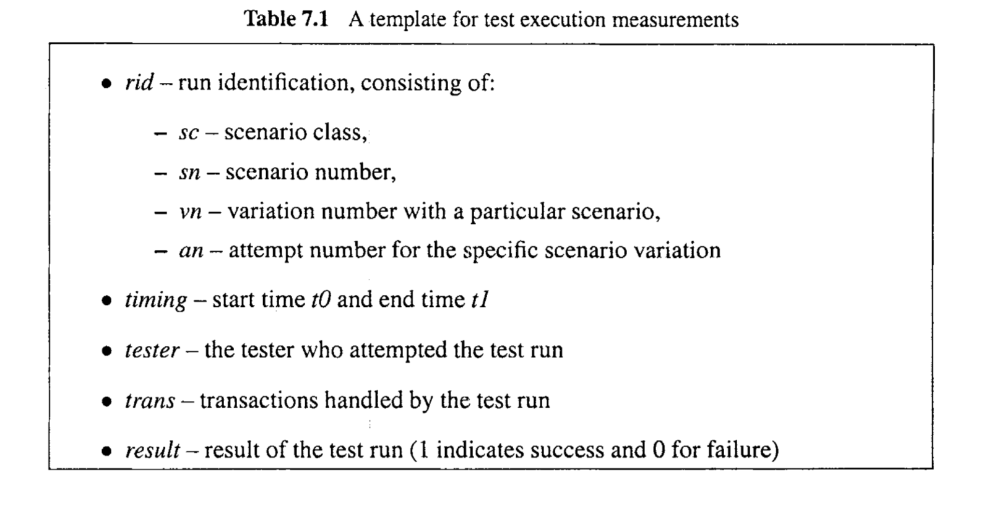

# Chapter 7 TEST ACTIVITIES, MANAGEMENT, AND AUTOMATION

In the previous chapter, we introduced major test activities and the generic testing process as part of the overall quality assurance (QA) activities. We expand on these topics in this chapter to take a detailed look of all the major test activities individually, including test planning and preparation in Section 7.1, test execution and measurement in Section 7.2, and test results analysis and follow-up in Section 7.3. We also examine the roles and responsibilities of different people in carrying out these activities and the related management issues in Section 7.4. Test automation issues are covered in Section 7.5.

> 在前一章中，我们介绍了作为整体质量保证(QA)活动的一部分的主要测试活动和一般测试过程。在本章中，我们将对这些主题进行扩展，以详细了解所有主要的测试活动，包括第7.1节中的测试计划和准备，第7.2节中的测试执行和度量，以及第7.3节中的测试结果分析和跟踪。我们亦会在第7.4节检视不同人员在执行这些活动时的角色和责任，以及相关的管理问题。测试自动化问题将在第7.5节中讨论。

## 7.1 TEST PLANNING AND PREPARATION

As illustrated in Figure 6.1, test planning and preparation is the most important activity in the generic testing process for systematic testing based on formal models. Most of the key decisions about testing are made during this stage. In this section, we first examine what key questions need to be answered in the high-level test planning, and then examine individual low-level activities related to test preparation. Test planning and test preparation are sometimes treated as separate groups of activities (Black, 2004).

> 如图6.1所示，对于基于正式模型的系统测试，测试计划和准备是通用测试过程中最重要的活动。大多数关于测试的关键决策都是在这个阶段做出的。在这一部分中，我们首先检查在高级测试计划中需要回答的关键问题，然后检查与测试准备相关的单个低级活动。测试计划和测试准备有时被视为独立的活动组(Black, 2004)。

### 7.1.1 Test planning: Goals, strategies, and techniques

The high-level task for test planning is to set goals and to determine a general testing strategy. 
This high-level decision should be based on answers to several key questions we examined in Chapter 6, particularly the objectives or goals of testing under a specific environment. The answers to these questions not only determine the general types of testing to perform, but also determine the test termination or exit criteria. Overall environment needs to be considered because the environmental constraints imposed on testing also affect the choice of testing strategies.

> 测试计划的高级任务是设置目标并确定一般的测试策略。这个高级决策应该基于我们在第6章中讨论的几个关键问题的答案，特别是在特定环境下测试的目标或目标。这些问题的答案不仅决定了要执行的测试的一般类型，而且还决定了测试终止或退出标准。需要考虑整体环境，因为强加于测试的环境约束也会影响测试策略的选择。

Most of the testing we cover in this book focuses on the correctness aspect of quality. If the software is complete or nearly complete, then the above correctness-centered quality goals can be directly translated into reliability goals, which, in turn, requires us to use usage-based statistical testing. Sometimes, these quality goals can be translated indirectly into coverage goals, which can be achieved by black-box testing for the whole system. However, if only individual units and pieces are available, we might choose to focus on the implementation details and perform coverage-based white-box testing.

> 本书中涉及的大多数测试都集中在质量的正确性方面。如果软件完成或接近完成，那么上述以正确性为中心的质量目标可以直接转换为可靠性目标，这反过来又要求我们使用基于使用情况的统计测试。有时，这些质量目标可以间接地转化为覆盖目标，这可以通过对整个系统进行黑盒测试来实现。然而，如果只有单独的单元和部件可用，我们可能会选择关注实现细节并执行基于覆盖率的白盒测试。

Therefore, we set an overall testing strategy by making the following decisions:

* Overall objectives and goals, which can be refined into specific goals for specific testing. Some specific goals include reliability for usage-based statistical testing or coverage for various traditional testing techniques. 

* Objects to be tested and the specific focus: Functional testing views the software product as a black-box and focuses on testing the external functional behavior; while structural testing views the software product or component as a (transparent) whitebox and focuses on testing the internal implementation details. 

Once the overall testing strategy has be selected, we can plan to allocate resources and staff to implement it. The available staff and resources also affect the specific models and techniques that can be used to implement the strategy. For example, simple models based on checklists and partitions generally require less resources and prior knowledge by the testing staff, while more complex formal models and related testing techniques may require more resources and expertise. Different models and techniques are also associated with different effectiveness levels or different applicability to different types of problems and situations. Consequently, appropriate testing models and related techniques can be selected to optimize some form of cost-benefit measure. 

Sometimes, existing models or test suites can be used with some minor modifications or adaptations, which would require minimal additional effort in test planning and preparation. Nevertheless, the above high-level activities still need to be carried out to arrive at this decision, because indiscriminately using exitisng testing strategies, techniques, models, and test suites may not fulfill the need for the new situation and end up merely wasting valuable time and resources. In what follows, we focus on the situation where new models, procedures, and test cases need to be considered in testing planning and preparation. The situation of minor adaptations is dealt with in Chapter 12 in connection with regression testing as a specialized type or testing.

> 因此，我们制定了一个全面的测试策略，并做出以下决定:
>
> * 总体目标和目标，可细化为具体测试的具体目标。一些特定的目标包括基于使用的统计测试的可靠性或各种传统测试技术的覆盖率。
>
> * 测试对象和具体焦点:功能测试将软件产品视为一个黑盒，侧重于测试外部功能行为;而结构测试将软件产品或组件视为一个(透明的)白盒，并专注于测试内部实现细节。
>
> 一旦选择了整体的测试策略，我们就可以计划分配资源和人员来实现它。可用的人员和资源也会影响可用于实施战略的特定模型和技术。例如，基于检查表和分区的简单模型通常需要较少的资源和测试人员的先验知识，而更复杂的正式模型和相关的测试技术可能需要更多的资源和专业知识。不同的模型和技术也与不同的有效性水平或对不同类型的问题和情况的不同适用性相关联。因此，可以选择适当的测试模型和相关技术来优化某种形式的成本效益度量。
>
> 有时，现有的模型或测试套件可以通过一些小的修改或调整来使用，这将在测试计划和准备中需要最小的额外工作。尽管如此，仍然需要执行上面的高级活动来达到这个决定，因为不加选择地使用现有的测试策略、技术、模型和测试套件可能无法满足新情况的需要，并且最终只是浪费宝贵的时间和资源。在接下来的内容中，我们将关注在测试计划和准备中需要考虑新模型、过程和测试用例的情况。作为一种特殊的测试类型，回归测试在第12章中讨论了小的调整的情况。

### 7.1.2 Testing models and test cases

Different models are closely linked to different testing techniques, and the modeling details can only be described together with their corresponding techniques, as we will do in Chapters 8 through 11. However, some generic steps and activities are involved in test model construction. as follows:

1. Information source identification and data collection: The information and data are generally affected by both what is required by specific models and what is available in the project environment. For example, in usage-based statistical testing, information about actual in-field or anticipated usage by target customers needs to be gathered to construct operational profiles as the basis of testing; while in white-box unit testing, the tested unit provides the information source which can be analyzed to construct our testing models.
1. Analysis and initial model construction: The information and data collected above are analyzed to construct testing models. Expertise and familiarity with the specific testing techniques and models are required for people who perform this task. This step is typically the hardest to automate because of the human intelligence and expertise required.
1. Model validation and incremental improvement: This is an important step, particularly for large objects or for functions or usages associated with external customers. Iterative procedure might be necessary to fix inaccuracies and other problems found in the initial model or early versions of the candidate models.

> 不同的模型与不同的测试技术紧密相连，并且建模细节只能与相应的技术一起描述，正如我们将在第8至11章中所做的那样。然而，在测试模型构建中涉及到一些通用的步骤和活动。如下:
>
> 1. 信息源识别和数据收集: 信息和数据通常受到特定模型所需的信息和项目环境中可用的信息的影响。例如，在基于使用的统计测试中，需要收集有关目标客户的实际现场或预期使用情况的信息，以构建操作概况作为测试的基础; 而在白盒单元测试中，被测试单元提供了信息源，可以通过分析信息源来构建我们的测试模型。
> 2. 分析和初始模型构建: 对上述收集到的信息和数据进行分析，构建测试模型。执行此任务的人员需要具有特定测试技术和模型的专业知识和熟悉程度。这一步通常是最难实现自动化的，因为需要人工智能和专业知识。
> 3. 模型验证和增量改进: 这是一个重要的步骤，特别是对于大型对象或与外部客户相关的功能或用法。可能需要迭代过程来修复在初始模型或候选模型的早期版本中发现的不准确性和其他问题。

Once the testing models have been constructed and validated, they can be used to generate test cases, which can then be executed by following some planned test procedure. First, we need to define and distinguish the static test cases and the dynamic test runs, as follows:

* A test case is a collection of entities and related information that allows a test to be executed or a test run to be performed. 
* A test run, is a dynamic unit of specific test activities in the overall testing sequence on a selected testing object.

Each time a static test case is invoked, we have an individual dynamic test run. Therefore, each test case can correspond to multiple test runs. In some literature and organizations, each test run is also called an attempt. 

The information included for a test case must enable the related test run to start, continue, and finish. For most of the testing situations, the starting and finishing points correspond to the initiation and termination of the operations for the whole software system, such as the compilation of a program when the compiler is tested. But there are exceptions, such as in operating systems and telecommunication systems, where continuous operation without stopping is the expected norm. In these cases, because the specific test is an activity associated with finite time for practical purposes, the starting and finishing points need to be artificially inserted, resulting in a subsection of the system execution as a test run. 

Essential among the test case information is the specific input to the software object in operation, which includes both the initial input at the start of the test run and the input to allow it to continue and to finish. In addition, the test case often includes information about the expected output throughout the test run, which, together with the specific input and timing information, defines the program behavior under this test run. Such input, output, and timing information can be captured by the set of input variables, the set of output variables, and their values over time. 

With the above understanding, we can view the construction of a specific test case as assigning its input values over a planned test run, which is referred to as test sensitization in testing literature. This assignment is typically derived from testing models we constructed in the previous step of test planning and preparation. Different criteria and steps may be involved in test sensitization when different testing techniques are used, as we will illustrate when individual testing techniques are covered in Chapters 8 through 11.

In addition to obtaining test cases from the sensitization step based on formal testing models, test cases can sometimes be derived from other sources directly. For example, actual runs from in-field operations of software products can sometimes be used to perform test runs. In this case, a simple strategy of “record-and-replay“ is used. For some systems, if the required information is easy to obtain, this strategy might be an effective one. However, for most large systems, too much information might need to be recorded, making this strategy impractical. In addition, systematic analysis of recorded information may provide valuable insight into the usage situations of the product. Systematic models constructed using such recorded information may provide more efficient or more effective ways to test the software products than simply playing back the recorded runs.

> 一旦测试模型被构建和验证，它们就可以用来生成测试用例，然后可以通过遵循一些计划的测试过程来执行测试用例。首先，我们需要定义和区分静态测试用例和动态测试运行，如下所示:
>
> * 测试用例是允许执行测试或执行测试运行的实体和相关信息的集合。
> * 一个测试运行，是在一个选定的测试对象上的整个测试序列中特定测试活动的动态单元。
>
> 每次调用一个静态测试用例时，我们都有一个单独的动态测试运行。因此，每个测试用例可以对应多个测试运行。在一些文献和组织中，每次测试运行也被称为一次尝试。
>
> 测试用例包含的信息必须允许相关的测试运行开始、继续和结束。对于大多数测试情况，起始点和结束点对应于整个软件系统操作的开始和结束，例如测试编译器时对程序的编译。但也有例外，例如在操作系统和电信系统中，连续运行而不停止是预期的标准。在这些情况下，由于特定的测试是与有限时间相关的活动，因此需要人为地插入起始点和结束点，从而导致系统执行的一部分作为测试运行。
>
> 测试用例信息中最重要的是运行中的软件对象的特定输入，它既包括测试运行开始时的初始输入，也包括允许测试运行继续并完成的输入。另外，测试用例通常包括关于整个测试运行的预期输出的信息，它与特定的输入和定时信息一起定义了该测试运行下的程序行为。这样的输入、输出和定时信息可以通过一组输入变量、一组输出变量及其随时间的值来捕获。
>
> 有了以上的理解，我们可以将一个特定测试用例的构建看作是在一个计划的测试运行中分配它的输入值，这在测试文献中被称为测试敏感化。这个任务通常来源于我们在测试计划和准备的前一步中构建的测试模型。当使用不同的测试技术时，测试敏化可能涉及不同的标准和步骤，正如我们将在第8至11章中介绍的单个测试技术时所说明的那样。
>
> 除了从基于正式测试模型的敏化步骤获得测试用例之外，测试用例有时可以直接从其他来源获得。例如，软件产品的现场操作的实际运行有时可以用于执行测试运行。在这种情况下，使用了一种简单的“记录-重播”策略。对于某些系统，如果所需的信息很容易获得，则此策略可能是有效的策略。然而，对于大多数大型系统，可能需要记录太多的信息，从而使此策略不切实际。此外，对记录信息的系统分析可以为产品的使用情况提供有价值的见解。使用这些记录的信息构建的系统模型可以提供比简单地回放记录的运行更有效或更有效的方法来测试软件产品。

### 7.1.3 Test suite preparation and management

The collection of individual test cases that will be run in a test sequence until some stopping criteria are satisfied is called a test suite. Test suite preparation involves the construction and allocation of individual test cases in some systematic way based on the specific testing techniques used. For example, when usage-based statistical testing is planned, the test case allocation will be determined by the operational profiles (OPs) constructed as the testing models, in proportion to individual usage probabilities. Similarly, when coverage-based testing is planned, the specific coverage criteria would dictate the allocation of test cases. 
For example, in control flow testing not involving loops, the exact number of test cases is determined by the number of paths for all-path coverage. 

Another way to obtain a test suite is through reuse of test cases for earlier versions of the same product. This kind of testing is commonly referred to as regression testing. It ensures that common functionalities are still supported satisfactorily in addition to satisfactory performance of new functionalities. Special types of formal models are typically used to make the selection from existing test cases, as we will discuss in Chapter 12 in connection to regression testing. 

In general, all the test cases should form an integrated suite, regardless of their origins, how they are derived, and what models are used to derive them. Sometimes, the test suite may evolve over time and its formation may overlap with the actual testing. In fact, in some testing techniques, test cases can be constructed dynamically, or “on-the-fly”, during test execution. But even for such testing, some planning of the test cases and test suite is still necessary, at least to determine the specific method for dynamic test case construction and the precise stopping criteria. For most of the testing techniques we cover in this book, a significant part of test preparation must be done before actual testing starts. 

In general, test cases cost time, effort, and expertise to be obtained, and are too valuable to be thrown away. It is worthwhile to spend some addition effort and resource to save them, organize them, and manage them as a test suite for easy reuse in the future. Test suite management includes managing the collection of both the existing test cases and the newly constructed ones. At a minimum, some consistent database for the test suite needs to be kept and shared by people who are working on similar areas. Some personnel information can also be kept in the test suite, such as the testers who designed specific test cases, to better supported future use of this test suite. The information contained in the test suite constitutes an indexed database with important information about individual test cases in the test suite, as well as pointers to actual test cases. The actual test cases, in turn, contains more detailed information about the exact scenario, test input, expected output and behavior, etc.

There are many ways to organize the test suite or test suites. The most common way is to organize them by sub-phases, because of the different objects, objectives, concerns, perspectives, priorities, and the testing techniques used. Various attributes can be used to describe, classify, and organize individual test cases in the suite. One concrete example is the use of the following attributes for an IBM product in its system testing phase (Tian, 1998):

* sc - scenario class 
* sn - scenario number 
* vn - variation number with a particular scenario 

The scenario class sc corresponds to high-level functional areas or groups of functions. Within each sc, the scenario number sn, and the variation number vn within each sn, form a three-layer hierarchical organization of test cases in the suite. In addition, sn and vn are generally ordered in rough correspondence to the expected execution order, ranging from 1 to 99, with consecutive numbers used up to a point and then skipping to 99 to indicate some ad hoc test cases those do not fall into some systematic sequence. Therefore, less than 99 scenarios or variations within scenarios are allowed, which was more than adequate for the product tested.

> 7.1.3 测试套件的准备和管理
>
> 将在测试序列中运行的单个测试用例的集合称为测试套件，直到满足某些停止标准为止。测试套件的准备包括基于所使用的特定测试技术，以某种系统的方式构建和分配单个测试用例。例如，当计划基于使用的统计测试时，测试用例的分配将由作为测试模型构造的操作概要文件(OPs)决定，与单个使用概率成比例。类似地，当计划基于覆盖的测试时，特定的覆盖标准将决定测试用例的分配。
>
> 例如，在不涉及循环的控制流测试中，测试用例的确切数量由全路径覆盖的路径数量决定。
>
> 获得测试套件的另一种方法是通过重用同一产品的早期版本的测试用例。这种测试通常被称为回归测试。它确保除了新功能的令人满意的性能外，还能令人满意地支持常见功能。特殊类型的正式模型通常用于从现有的测试用例中进行选择，正如我们将在第12章中讨论的回归测试。
>
> 一般来说，所有的测试用例都应该形成一个集成的套件，而不管它们的起源、它们是如何派生的，以及使用什么模型来派生它们。有时，测试套件可能随着时间的推移而发展，并且它的形成可能与实际测试重叠。事实上，在一些测试技术中，测试用例可以在测试执行期间动态地或“即时”地构建。但是即使对于这样的测试，一些测试用例和测试套件的计划仍然是必要的，至少要确定动态测试用例构建的具体方法和精确的停止标准。对于我们在本书中介绍的大多数测试技术，测试准备的重要部分必须在实际测试开始之前完成。
>
> 一般来说，测试用例需要花费时间、精力和专业知识来获得，并且太有价值而不能丢弃。花费一些额外的精力和资源来保存它们、组织它们，并将它们作为测试套件进行管理，以便在将来易于重用，这是值得的。测试套件管理包括管理现有测试用例和新构建的测试用例的集合。至少，需要为测试套件保留一些一致的数据库，并由从事类似领域工作的人员共享。一些人员信息也可以保存在测试套件中，例如设计特定测试用例的测试人员，以更好地支持该测试套件的未来使用。测试套件中包含的信息构成了一个索引数据库，其中包含关于测试套件中单个测试用例的重要信息，以及指向实际测试用例的指针。实际的测试用例，依次包含了关于确切场景、测试输入、预期输出和行为等更详细的信息。
>
> 有许多方法可以组织测试套件或测试套件。最常见的方法是按子阶段组织它们，因为有不同的对象、目标、关注点、透视图、优先级和使用的测试技术。可以使用各种属性来描述、分类和组织套件中的单个测试用例。一个具体的例子是在系统测试阶段对IBM产品使用以下属性(Tian, 1998):
>
> * sc -场景类
> * sn -场景号
> * vn -特定场景的变异数
>
> 场景类sc对应于高级功能区域或功能组。在每个sc中，场景编号sn，以及每个sn中的变化编号vn，形成套件中测试用例的三层分层组织。此外，sn和vn通常以与预期执行顺序大致对应的方式排序，范围从1到99，使用连续的数字直到一个点，然后跳到99，以指示一些不属于某些系统序列的特殊测试用例。因此，允许的场景或场景中的变化少于99个，这对于测试的产品来说已经足够了。

### 7.1.4 Preparation of test procedure

In addition to preparation of individual test cases and the overall test suite, the test procedure also needs to be prepared for effective testing. The basic question is the sequencing of the individual test cases and the switch-over from one test run to another. Several concerns affect the specific test procedure to be used, including:

* Dependencies among individual test cases. Some test cases can only be run after others because one is used to set up another. This is particularly true for systems that operate continuously, where the later test run may need to start at a state set up by the earlier one. 
* Defect detection related sequencing. Many problems can only be effectively detected after others have been discovered and fixed. For example, integration of several components and related testing typically focus on interface and interaction problems, which can be masked by problems in individual components. Therefore, these components need to be individually tested before integration testing starts. 
* Sequences to avoid accidents. For some systems, possibly severe problems and damages may incur during testing if certain areas were not checked through related test runs prior to the current test run. For example, in embedded software for safety critical systems, one does not want to start testing safety features before testing other related functions first. This can be considered as a special case of the problem or defect related sequencing where there is a very strong economical incentive for preferring certain sequencing to others. 
* Problem diagnosis related sequencing. Some execution problems observed during testing may involve complicated scenarios and many possible sources of problems. 
  Under this situation, related test runs focused on a single aspect or limited areas can be used to help with the problem diagnosis. Better yet, if such complicated problems are expected, we should run related simpler test cases first to eliminate certain possibilities and narrow down the problem areas. Therefore, one natural sequence for test case execution commonly used in practical testing procedures is to progress from simple and easy ones to complicated and difficult ones. The same idea has been used in defining coverage hierarchies.
* Natural grouping of test cases, such as by functional and structural areas or by usage frequencies, can also be used for test sequencing and to manage parallel testing. However, among areas where no such order exists, or when the incentive for following a certain order is not strong, we can carry out testing for them in parallel to speed up the testing process. In fact, this is what people do all the time for large-scale software testing, where parallelism and interleaving are common.

The key to test run transition in the test procedure preparation is to make sure that the next test run can start right after the current one is finished for each software installment. This consideration may place some additional requirements on individual test cases, either requiring them to leave the system in the same initial condition or in some specified final condition. In fact, the initial and final states of specific test cases can also be used to group individual test cases in the test suite. This is similar to the grouping of test cases when system configuration and environmental setup are considered in defining the operational mode in usage-based testing using Musa’s operational profiles (Musa, 1998). 

When test cases are derived dynamically, test procedure would naturally involve much more dynamic elements. However, the above considerations for test procedure preparation should still be incorporated in the corresponding test procedure. In this case, not only the execution but also the generation of dynamic test cases is affected by the dependency, effectiveness and efficiency concerns. 

A related topic to test procedure preparation is the assignment of people to perform certain tests. Their roles and responsibilities need to be clearly specified, such’as in Section 7.4. 
In addition, allocation of time and other resources also needs to be planned ahead of time before test execution starts, in accordance with test case grouping and allocation within a test suite. One specific type of resources is the test automation tools examined in Section 7.5, which could significantly reduce the time, staffing, and other resources required for test execution.

> 除了准备单个测试用例和整体测试套件之外，测试过程还需要为有效的测试做好准备。基本的问题是单个测试用例的顺序，以及从一个测试运行到另一个测试运行的切换。有几个问题会影响要使用的具体检测程序，包括:
>
> * 独立测试用例之间的依赖关系。一些测试用例只能在其他测试用例之后运行，因为一个测试用例用于设置另一个测试用例。对于连续运行的系统尤其如此，其中后面的测试运行可能需要在前面的测试运行设置的状态下启动。
> * 缺陷检测相关排序。许多问题只有在其他问题被发现并修复后才能有效地发现。例如，几个组件的集成和相关测试通常关注于接口和交互问题，这些问题可能被单个组件中的问题所掩盖。因此，在开始集成测试之前，需要对这些组件进行单独测试。
> * 避免事故的顺序。对于某些系统，如果在当前测试运行之前没有通过相关测试运行检查某些区域，则可能在测试期间产生严重的问题和损坏。例如，在安全关键系统的嵌入式软件中，人们不希望在测试其他相关功能之前开始测试安全特性。这可以被认为是与排序相关的问题或缺陷的特殊情况，其中存在非常强的经济动机来选择某些排序而不是其他排序。
> * 问题诊断相关测序。在测试期间观察到的一些执行问题可能涉及复杂的场景和许多可能的问题来源。
>   在这种情况下，专注于单个方面或有限区域的相关测试运行可用于帮助进行问题诊断。更好的是，如果预期会出现这样复杂的问题，我们应该首先运行相关的更简单的测试用例，以消除某些可能性并缩小问题范围。因此，在实际测试过程中通常使用的测试用例执行的自然顺序是从简单和容易的到复杂和困难的。在定义覆盖率层次结构时也使用了相同的思想。
> * 测试用例的自然分组，例如按功能和结构区域或按使用频率分组，也可用于测试排序和管理并行测试。但是，在不存在这种顺序的区域中，或者在遵循某种顺序的动机不强的情况下，我们可以对它们并行进行测试，以加快测试过程。事实上，这就是人们在大规模软件测试中一直在做的事情，并行和交错是很常见的。
>
> 测试过程准备中测试运行转换的关键是确保下一个测试运行可以在每个软件安装的当前测试运行完成后立即开始。这种考虑可能会对单个测试用例提出一些额外的要求，要么要求它们在相同的初始条件下离开系统，要么在某些指定的最终条件下离开系统。事实上，特定测试用例的初始和最终状态也可以用于对测试套件中的单个测试用例进行分组。这类似于在使用Musa的操作配置文件定义基于使用的测试的操作模式时考虑系统配置和环境设置时对测试用例的分组(Musa, 1998)。
>
> 当测试用例是动态派生的，测试过程自然会包含更多的动态元素。然而，上述测试程序准备的考虑仍应纳入相应的测试程序。在这种情况下，不仅执行，而且动态测试用例的生成都受到依赖性、有效性和效率问题的影响。
>
> 与测试程序准备相关的一个主题是分配人员执行某些测试。他们的角色和职责需要明确规定，如第7.4节所示。
> 另外，在测试执行开始之前，时间和其他资源的分配也需要按照测试套件中的测试用例分组和分配来提前计划。一种特定类型的资源是第7.5节中讨论的测试自动化工具，它可以显著地减少测试执行所需的时间、人员配置和其他资源。

## 7.2 TEST EXECUTION, RESULT CHECKING, AND MEASUREMENT

==The key to the overall test execution is the smooth transition from one test run to another, which also requires us to allocate all the required resources to ensure that individual test runs can be started, executed, and finished, and related problems can be handled seamlessly.== 
General steps in test execution include:

1. Allocating test time and resources; 
2. Invoking and running tests, and collecting execution information and measurements; 
3. Checking testing results and identifying system failures. 

The step to invoke and run tests is fairly straightforward with well-prepared test cases or already sensitized test cases. We can simply provide the input variable values over the whole execution duration as required and as already precisely specified in these test cases. The sequence of test runs can follow the pre-planned sequence we described in test procedure preparation in Section 7.1. In the case where test cases are generated dynamically, such as in various usage-based statistical testing approaches described in Chapter 8 and Chapter 10, much of the work we described in terms of test sensitization needs to be done at this stage. 

The key in handling failed test runs is to ensure that they will not block the execution of other test cases. In addition, there will be test runs related to the re-verification of fixed problems, which can be treated much the same way as other planned test cases except the newly added dependency and its impact on test sequencing: Before an integrated fix becomes available, the test case that triggered the failure observation in the first place and other closely related test cases should be suspended to avoid repeatedly observing the same failure, which adds little new information to what is already known. The same test case can be re-run after the fix is in, and closely related test cases can also continue at this point. 

By doing so, we avoided unnecessary repetitions/re-runs, thus improving the overall test efficiency. 
Test time and resources allocation is most closely related to the test planning and preparation activities described in the previous section. Although the allocation could be planned or even carried out at the previous stage, the monitoring, adjustment, and management of these resources need to be carried out during test execution. Test time allocation and management are closely related to people’s roles and responsibility in carrying out specific testing activities, thus they are described in Section 7.4. Managing other test resources primarily involves the environmental set up and related facility management. ==For pure software systems, this is fairly straightforward, with the environment setup to include the hardware configuration and software environment that the finished product will operate within.== Sometimes, limited number of simulation programs or hardware simulators can be used for testing some product components, but the overall system testing would very much resemble the actual operational environment. Once the general system configuration is decided, the facility management is mainly the allocation and monitoring of testing time on these facilities. 

For embedded software systems or for heterogeneous systems with important software components, the environment and facility management issues involve the so-called “supersystem”. Coordination between different branches is a major issue where people have different perspectives and concerns. In addition, various techniques, such as simulation and prototyping techniques described in Chapter 12, will be used to aid testing or sometimes to replace part of the testing. We will also see some specific techniques to deal with interface, interaction, and interoperability problems among different sub-systems as part of the safety assurance program in Chapter 16.

> 测试执行、结果检查和度量
>
> 整体测试执行的关键是从一个测试运行到另一个测试运行的平滑过渡，这也要求我们分配所有所需的资源，以确保单个测试运行可以开始、执行和完成，并且相关的问题可以无缝地处理。
> 测试执行的一般步骤包括:
>
> 1. 分配测试时间和资源;
> 2. 调用和运行测试，收集执行信息和度量;
> 3. 检查测试结果，识别系统故障。
>
> 调用和运行测试的步骤对于准备充分的测试用例或已经敏感的测试用例是相当直接的。我们可以简单地在整个执行期间提供所需的输入变量值，并且在这些测试用例中已经精确地指定了这些值。测试运行的顺序可以按照我们在第7.1节的测试程序准备中描述的预先计划的顺序进行。在动态生成测试用例的情况下，例如在第8章和第10章中描述的各种基于使用的统计测试方法中，我们在测试敏感化方面描述的许多工作需要在这个阶段完成。
>
> 处理失败的测试运行的关键是确保它们不会阻塞其他测试用例的执行。此外，将会有与修复问题的重新验证相关的测试运行，除了新添加的依赖项及其对测试顺序的影响之外，它可以与其他计划的测试用例以相同的方式处理:在集成修复变得可用之前，首先触发失败观察的测试用例和其他密切相关的测试用例应该被挂起，以避免重复观察相同的失败，这对已知的内容添加了很少的新信息。相同的测试用例可以在修复后重新运行，并且密切相关的测试用例也可以在此时继续运行。
>
> 通过这样做，我们避免了不必要的重复/重新运行，从而提高了整体测试效率。
>
> 测试时间和资源分配与前面章节中描述的测试计划和准备活动密切相关。尽管分配可以在前一阶段进行计划甚至执行，但是这些资源的监视、调整和管理需要在测试执行期间进行。测试时间的分配和管理与人们在进行具体测试活动中的角色和职责密切相关，因此在7.4节中进行了描述。管理其他测试资源主要涉及环境设置和相关设施管理。对于纯软件系统，这是相当简单的，环境设置包括硬件配置和最终产品将在其中运行的软件环境。有时，有限数量的仿真程序或硬件模拟器可以用于测试某些产品组件，但整个系统测试将非常类似于实际操作环境。一旦确定了总体系统配置，设备管理主要是对这些设备的测试时间进行分配和监控。
>
> 对于嵌入式软件系统或具有重要软件组件的异构系统，环境和设备管理问题涉及所谓的“超系统”。不同部门之间的协调是一个主要问题，因为人们有不同的观点和关注点。此外，各种技术，如第12章中描述的模拟和原型技术，将用于辅助测试或有时替代部分测试。作为第16章安全保证程序的一部分，我们还将看到处理不同子系统之间的接口、交互和互操作性问题的一些具体技术。

### Result checking: The oracle problem

Result checking, or the oracle problem, and the related failure identification is a difficult task, because of both the theoretical difficulties and practical limitations. In this book, we use the term test oracle to indicate any means to check the testing result. Long standing theoretical results state that result checking for testing in general is an undecidable problem. In other words, there is no hope for algorithmic or fully automated solution to the general test oracle problem. On the practical side, the expected behavior can hardly be precisely described so that the observed behavior can be compared against. Combined with the fact that software can fail in innumerable variations, the unexpected behavior can happen in truly unexpected ways, thus making result checking difficult or nearly impossible.

However, there are cases where specific types of system failures, such as irresponsive behavior or system crash, are easy to identify. In other cases, various other means, such as heuristic guesses, possible cross-checking, sampling of product internal information and/or execution states, etc., can be used to help us find approximate solutions to the oracle problem, as described below: 

* Sometimes heuristics guesses can be used based on product domain knowledge, for example, what other similar products would do under similar situations. Consequently, similar products, such as previous releases of the same product or competitors’ products with similar functionality, can often be used as the test oracle, to check execution results and to identify system failures. 
* Knowledge of implementation details can also be used to link specific behavior to specific program units. We can also examine various product internal information and dynamic execution state to help solve the oracle problem. For example, if an external function is supported by some internal components, and these internal components were not invoked when we test for this external function, we can be almost certain there is something wrong with this test run. In addition, product experts or developers themselves can also help testers to perform this difficult task when some important problem is suspected, making effective use of these people’s product knowledge. 
* Various types of consistency checking during execution, such as checking for the database consistency, can also help us determine the execution failures. Such consistency checking can usually be done through sampling of some dynamic states and related product internal information, which could be analyzed either on-line during the test execution, or off-line with the detailed dynamic execution information.

> 结果检查:oracle问题
>
> 由于理论上的困难和实践上的限制，结果检查，或oracle问题，以及相关的故障识别是一项艰巨的任务。在本书中，我们使用术语test oracle来表示检查测试结果的任何方法。长期存在的理论结果表明，测试的结果检查通常是一个无法确定的问题。换句话说，对于一般的测试oracle问题，算法或完全自动化的解决方案是没有希望的。在实际方面，预期的行为很难被精确地描述，以便与观察到的行为进行比较。结合软件可能在无数变化中失败的事实，意外行为可能以真正意想不到的方式发生，从而使结果检查变得困难或几乎不可能。
>
> 然而，在某些情况下，特定类型的系统故障(如无响应行为或系统崩溃)很容易识别。在其他情况下，可以使用各种其他方法，例如启发式猜测，可能的交叉检查，产品内部信息和/或执行状态的抽样等，来帮助我们找到oracle问题的近似解决方案，如下所述:
>
> * 有时启发式猜测可以基于产品领域的知识，例如，其他类似的产品在类似的情况下会做什么。因此，类似的产品，例如相同产品的先前版本或具有类似功能的竞争对手的产品，通常可以用作测试oracle，以检查执行结果并识别系统故障。
> * 实现细节的知识也可以用来将特定的行为与特定的程序单元联系起来。我们还可以检查各种产品内部信息和动态执行状态，以帮助解决oracle问题。例如，如果某个外部函数得到一些内部组件的支持，而当我们测试这个外部函数时，这些内部组件没有被调用，那么我们几乎可以肯定这个测试运行出了问题。此外，产品专家或开发人员自己也可以在怀疑某些重要问题时帮助测试人员执行这项困难的任务，从而有效地利用这些人的产品知识。
> * 执行过程中各种类型的一致性检查，例如数据库一致性检查，也可以帮助我们确定执行失败。这种一致性检查通常可以通过对一些动态状态和相关产品内部信息的抽样来完成，这些信息可以在测试执行期间在线分析，也可以离线分析详细的动态执行信息。

### Test measurement

Observed failures need to be recorded and tracked until their resolution. This defect handling or defect tracking process is typically considered part of the testing process itself, and the reporting of the observed failures is consider part the test execution activity. However, the handling of defects discovered during testing is not fundamentally different from that of defects discovered during other QA activities, as we described in the general context of QA activities in Chapter 4.

Detailed information about failure observations and the related activities is needed for problem diagnosis and defect fixing. Some specific information for failures and faults also includes various generic information about defects we will describe in Chapter 20, covering defect type, severity, impact areas, possible cause, when-injected, etc. This information could be collected either when the failure were observed and recorded or when the faults were fixed, or even afterward. When failures are not observed, the measurement of related test runs can be used to demonstrate product reliability or correct handling of input and dynamic situations.

Various other measurements can be taken during test execution for further analysis and follow-up actions. Successful executions also need to be recorded for various purposes, including documentation of test activities, possible use as oracle to check future execution results, etc. This is particularly important for regression testing to be described in Chapter 12 and for legacy products that are expected to change and evolve over the whole product lifespan. The timing and other related information can be important, when it can be used as input in analysis and follow-up activities described in Section 7.3 and in reliability analysis described in Chapter 22. In addition to the “on-line” measurement of the dynamic test runs and related failure information, the corresponding static test cases can be measured “off-line” to avoid interference with normal test execution. Various other information could also be collected, such as testing personnel, environment, configuration, test object, etc.

Table 7.1 is an example template for test execution information collected for an IBM product during system testing (Tian, 1995). Notice that a test run here corresponds to a specific attempt in the hierarchically organized test suite we described in Section 7.1: Each attempt or test run, numbered an, is drawn from a specific variation, with variation number vn, of a scenario numbered as sn that belong to a specific scenario class sc. Other information about individual test runs, such as timing, tester, workload measured in transactions, and the run result, is also recorded.

> 观察到的故障需要被记录和跟踪，直到它们被解决。这个缺陷处理或缺陷跟踪过程通常被认为是测试过程本身的一部分，而观察到的失败的报告被认为是测试执行活动的一部分。然而，在测试过程中发现的缺陷的处理与在其他QA活动中发现的缺陷的处理并没有根本的不同，正如我们在第4章QA活动的一般背景中所描述的那样。
>
> 关于故障观察和相关活动的详细信息对于问题诊断和缺陷修复是必需的。关于失败和故障的一些具体信息还包括我们将在第20章中描述的关于缺陷的各种通用信息，包括缺陷类型、严重性、影响区域、可能的原因、何时注入等。这些信息可以在观察和记录故障时收集，也可以在修复故障时收集，甚至可以在故障发生后收集。当没有观察到故障时，相关测试运行的测量可用于证明产品的可靠性或对输入和动态情况的正确处理。
>
> 在测试执行期间可以采取各种其他度量，以进行进一步的分析和后续行动。成功的执行也需要被记录用于各种目的，包括测试活动的文档化，可能用作oracle来检查未来的执行结果，等等。这对于在第12章中描述的回归测试以及在整个产品生命周期中预期会发生变化和发展的遗留产品来说尤其重要。当时间和其他相关信息可以作为7.3节所述的分析和后续活动以及22章所述的可靠性分析的输入时，时间和其他相关信息可能是重要的。除了对动态测试运行和相关失败信息的“在线”度量之外，还可以“离线”度量相应的静态测试用例，以避免干扰正常的测试执行。还可以收集其他各种信息，如测试人员、环境、配置、测试对象等。
>
> 表7.1是在系统测试期间为IBM产品收集的测试执行信息的示例模板(Tian, 1995)。注意，这里的一个测试运行对应于我们在7.1节中描述的分层组织的测试套件中的一个特定的尝试:每个尝试或测试运行，编号为an，是从一个特定的变化中绘制的，变化编号为vn，一个场景编号为sn，属于一个特定的场景类sc。关于单个测试运行的其他信息，如时间、测试人员、事务中测量的工作负载，以及运行结果，也被记录下来。

## 7.3 ANALYSIS AND FOLLOW-UP

The third group of major test activities is analysis and follow-up after test execution. The measurement data collected during test execution, together with other data about the testing and the overall environment, form the data input to these analyses, which, in turn, provide valuable feedback to test execution and other testing and development activities. Direct follow-up includes defect fixing and making other management decisions, such as product release and transition from one development phase or sub-phase to another. We examine these issues in this section.

> 第三组主要的测试活动是测试执行后的分析和跟踪。在测试执行期间收集的度量数据，以及关于测试和整体环境的其他数据，形成了这些分析的数据输入，这些分析反过来为测试执行和其他测试和开发活动提供了有价值的反馈。直接跟踪包括缺陷修复和制定其他管理决策，例如产品发布和从一个开发阶段或子阶段到另一个开发阶段的转换。我们将在本节中研究这些问题。

### Analysis and follow-up based on individual testing runs

Analysis of individual test runs includes result checking and failure identification we covered in the previous section as part of the test execution activities. When failures are identified, additional analyses are normally performed by software developers or “code owners” to diagnose the problem and locate the faults that caused the failures for defect removal. This activity may involve the following steps:

* Understanding the problem by studying the execution record, particularly those involving failures.
* Being able to recreate the same problem scenario and observe the same problem. This is important to confirm the problem and rule out possibilities of transient problems due to environmental disturbances or user errors. It also provides input to diagnose the problem causes. 
* Problem diagnosis to examine what kind of problem it is, where, when, and possible causes. This may involve analyzing the above records and using some diagnostic tools or addition test runs to zoom in on possible causes or to eliminate other possibilities. 
* Fault locating, to identify the exact location(s) of fault(s) based on information from the previous steps and product knowledge. 
* Defect Jixing, to fix the located fault(s) by adding, removing, or correcting certain parts of the code. Sometimes, design and requirement changes could also be triggered or propagated from the above changes due to logical linkage among the different software components.

As mentioned in Section 7.2, once an integrated fix is available, the failed test cases were re-run to verify the fix. If successful, the normal test execution continues; otherwise, another round of defect fixing as described above is again initiated.

> 基于单个测试运行的分析和跟踪
>
> 单个测试运行的分析包括我们在前一节中作为测试执行活动的一部分讨论的结果检查和失败识别。当识别出故障时，软件开发人员或“代码所有者”通常会执行额外的分析，以诊断问题并定位导致故障的错误，以消除缺陷。这项活动可能涉及以下步骤:
>
> * 通过研究执行记录来了解问题，特别是那些涉及失败的记录。
> * 能够重现相同的问题场景并观察相同的问题。这对于确认问题和排除由于环境干扰或用户错误造成的暂时问题的可能性非常重要。它还提供了诊断问题原因的输入。
> * 问题诊断:检查问题的类型、地点、时间和可能的原因。这可能涉及分析上述记录，并使用一些诊断工具或额外的测试运行来放大可能的原因或消除其他可能性。
> * 故障定位，根据前面步骤的信息和产品知识，确定故障的准确位置。
> * 缺陷修补，通过添加、删除或纠正代码的某些部分来修复已定位的错误。有时，由于不同软件组件之间的逻辑链接，设计和需求变更也可以从上述变更中触发或传播。
>
> 如第7.2节所述，一旦集成修复可用，将重新运行失败的测试用例以验证修复。如果成功，则继续执行正常的测试; 否则，将再次启动如上所述的另一轮缺陷修复。

### Analysis and follow-up for overall testing results

Various analyses can be performed on the overall testing results and related data to provide various assessments about testing, and to drive follow-up activities, including:

* Reliability analysis for usage-based testing, which can be used to assess current product reliability and as input to determine if the pre-set reliability goal has been achieved. If so, product release or test termination decisions can be made. If not, future reliability as well as time and resources needed to reach the reliability goal can be estimated. Sometimes, low reliability areas can be identified for focused testing and reliability improvement. This analysis and its many uses in follow-up activities are described in Chapter 22.
* Coverage analysis for coverage-based testing, which can be used as a surrogate for reliability and used as the stopping criterion or as input to various decisions related to testing management. Specifics about this are presented when specific testing techniques and coverage hierarchies are introduced in Chapters 8 through 11
* Overall defect analysis, which can be used to examine defect distribution and to identify high-defect areas for focused remedial actions. In addition, some productinternal measurements, such as size and complexity of individual components, and other measurements can also be used together with defect data to identify high-defect areas for focused quality improvement. These topics are covered in Chapters 20 and 21.

These analyses about overall testing results and related follow-up activities are described in Part IV, in connection with the overall analysis and feedback for all QA alternatives. 
Possible test process and overall development process improvement based on these and other analyses and feedback is also described therein.

> 对整体测试结果进行分析和跟踪
>
> 可以对总体测试结果和相关数据进行各种分析，以提供关于测试的各种评估，并推动后续活动，包括:
>
> * 基于使用测试的可靠性分析，可用于评估当前产品的可靠性，并作为确定是否达到预设可靠性目标的输入。如果是这样，就可以做出产品发布或测试终止的决定。如果没有，则可以估计未来的可靠性以及达到可靠性目标所需的时间和资源。有时，可以识别低可靠性区域，以便进行重点测试和可靠性改进。第22章描述了这种分析及其在后续活动中的许多用途。
> * 基于覆盖率的测试的覆盖率分析，可用作可靠性的替代，并用作停止标准或与测试管理相关的各种决策的输入。在第8章到第11章中介绍具体的测试技术和覆盖层次时，将详细介绍这一点
> * 全面的缺陷分析，可用于检查缺陷分布，并为集中的补救行动确定高缺陷区域。另外，一些产品内部测量，例如单个组件的尺寸和复杂性，以及其他测量也可以与缺陷数据一起使用，以识别高缺陷区域，以集中质量改进。这些主题将在第20章和第21章中讨论。
>
> 这些关于整体测试结果和相关后续活动的分析在第四部分中描述，与所有QA替代方案的整体分析和反馈有关。
> 文中还描述了基于这些分析和其他反馈的可能的测试过程和整体开发过程改进。

## 7.4 ACTIVITIES, PEOPLE, AND MANAGEMENT

In this section, we examine people’s roles and responsibilities in specific test activities as well as the related management issues.

> 在本节中，我们将检查人们在特定测试活动中的角色和职责，以及相关的管理问题。

### People’s role in informal vs. formal ,testing

Informal software testing and some types of formal testing could involve minimal prior knowledge of the software products or systems. One simple way to test the software is to just run it and observe its behavior. Some obvious problems can be easily recognized by people with almost no prior knowledge of computer software and software products. Some formal forms of testing, such as usability testing, can be performed with little prior knowledge as well. For example, to test some user-friendly, “plug-and-play” software products, novice users are often asked to start using the products. Their behavior and their difficulties in using the products are observed and related information is recorded for usability assessment and improvement. In this scenario, the testing involves the actual novice users as testers, but it may also involve experienced testers who observe and record the testing information. With automated information recording, the role of the experienced tester in this situation can be eliminated.

Because of the above situations, many people have the wrong perception that testing is “easy”, and any “warm body” can perform testing. This misconception also contributes to various problems related to software management, where the least experienced and skilled people are assigned to testing groups. This problem can be corrected by a good knowledge of the technical skills and experience involved in testing, such as conveyed in this book, and through some organizational initiatives, such as creating a well-established and wellrespected career path for testers (Weyuker et al., 2000).

For the large and complex software systems used in society today, any hope of assured quality needs to be supported by testing beyond informal ad hoc testing. We need to model the software systems, their operational environment, their users and usage scenarios, sequences, and patterns, so that systematic testing can be performed to ensure that these systems satisfy their customers’ quality expectations. Test cases can be derived from these models and used systematically to detect and fix defects and to ensure software quality and reliability. All these activities are performed by individual testers or testing teams.

Various other development personnel also need to be involved in testing activities. For example, as part of the follow-up activity to testing, problems detected during testing need to be resolved by the people who are responsible for the creation of the product design or code. Therefore, software developers, particularly those designers and programmers whose code is tested, also need to be involved in testing, although mostly indirectly to follow up on failure observations and defect fixing.

Sometimes, people can play the dual role of developers and testers, when they test their own code, such as in the unit or component testing sub-phases. However, for the overall system, professional testers are typically employed to testing the integration of different components and the overall operation of the system as a whole in the integration, system, and acceptance testing sub-phases.

> 非正式的软件测试和某些类型的正式测试可能涉及最少的软件产品或系统的先验知识。测试软件的一个简单方法就是运行它并观察它的行为。一些明显的问题可以很容易地被几乎没有计算机软件和软件产品先验知识的人识别出来。一些正式形式的测试，如可用性测试，也可以在很少的先验知识的情况下进行。例如，为了测试一些用户友好的“即插即用”软件产品，通常要求新手用户开始使用这些产品。观察他们在使用产品时的行为和困难，并记录相关信息，以进行可用性评估和改进。在这种情况下，测试涉及到实际的新手用户作为测试人员，但也可能涉及到观察和记录测试信息的有经验的测试人员。有了自动化的信息记录，在这种情况下，有经验的测试人员的角色可以被消除。
>
> 由于上述情况，很多人有一种错误的认知，认为检测很“容易”，任何“暖身”都可以进行检测。这种误解也导致了与软件管理相关的各种问题，其中最缺乏经验和技术的人员被分配到测试组。这个问题可以通过对测试中涉及的技术技能和经验的良好了解来纠正，例如在本书中所传达的，以及通过一些组织计划，例如为测试人员创建一个完善的和受人尊敬的职业道路(Weyuker et al.， 2000)。
>
> 对于当今社会中使用的大型和复杂的软件系统，任何保证质量的希望都需要通过非正式的临时测试来支持。我们需要对软件系统、它们的操作环境、它们的用户和使用场景、序列和模式进行建模，以便可以执行系统测试，以确保这些系统满足客户的质量期望。测试用例可以从这些模型中导出，并系统地用于检测和修复缺陷，并确保软件质量和可靠性。所有这些活动都是由单个测试人员或测试团队执行的。
>
> 其他各种开发人员也需要参与测试活动。例如，作为测试后续活动的一部分，在测试期间检测到的问题需要由负责创建产品设计或代码的人员来解决。因此，软件开发人员，特别是那些代码被测试的设计人员和程序员，也需要参与到测试中，尽管大部分是间接地跟踪失败观察和缺陷修复。
>
> 有时，当人们测试他们自己的代码时，比如在单元或组件测试子阶段，人们可以扮演开发人员和测试人员的双重角色。然而，对于整个系统，专业测试人员通常在集成、系统和验收测试子阶段中测试不同组件的集成以及系统作为一个整体的整体操作。

### Testing teams: Organization and management

The test activities need to be managed by people with a good understanding of the testing techniques and processes. The feedback derived from analyses of measurement data needs to be used to help with various management decisions, such as product release, and to help quality improvement. Test managers are involved in these activities. 

Testers and testing teams can be organized into various different structures, but basically following either a horizontal or a vertical model:

* A vertical model would organize around a product, where dedicated people perform one or more testing tasks for the product. For example, one or more teams can perform all the different types of testing for the product, from unit testing up to acceptance testing. 
* A horizontal model is used in some large organizations so that a testing team only performs one kind of testing for many different products within the organization. For example, different products may share the same system testing team.

Depending on the demand for testers by different projects, staffing level may vary over time. In the vertical model, as the product development shifts from one phase to another or as the development focus shifts from one area to another, project personnel could be reassigned to perform different tasks. One common practice in industry is to use programmers to perform various testing tasks when testing phase peaks. This practice may create various problems related to staffing management: If not done carefully, it may also lead to project delays, as in Brooks’ famous observation that adding people to a late project will make it later (Brooks, 1995). The mismatch between people’s expertise and their assignments may also result in more defects passing through the testing phase to cause additional in-field problems. This fact is part of the reason for people to adopt the horizontal model where staffing level variations can generally be better managed due to the different schedules and demands by different projects. 

In reality, a mixture of the two is often used in large software organizations (Tian, 1998), with low-level testing performed by dedicated testers or testing teams, system testing shared across similar products, and general project support provided by a centralized support unit for the entire organization. The general project support includes process, technology, and tool support necessary for formal development and testing. This centralized support unit resembles the so-called experience factory that also packages experience and lessons learned from development for more effective future use (Basili, 1995). The idea of experience factory is described further in Chapter 13 in connection to defect prevention based on process improvement.

> 测试团队:组织和管理
>
> 测试活动需要由对测试技术和过程有很好理解的人来管理。来自度量数据分析的反馈需要用于帮助各种管理决策，例如产品发布，以及帮助质量改进。测试经理参与到这些活动中。
>
> 测试人员和测试团队可以组织成各种不同的结构，但基本上遵循水平或垂直模型:
>
> * 垂直模型将围绕产品进行组织，其中专门的人员为产品执行一个或多个测试任务。例如，一个或多个团队可以为产品执行所有不同类型的测试，从单元测试到验收测试。
> * 在一些大型组织中使用水平模型，以便测试团队只对组织内的许多不同产品执行一种测试。例如，不同的产品可能共享相同的系统测试团队。
>
> 根据不同项目对测试人员的需求，人员配备水平可能随时间变化。在垂直模型中，随着产品开发从一个阶段转移到另一个阶段，或者随着开发重点从一个领域转移到另一个领域，项目人员可以被重新分配执行不同的任务。工业中的一个常见做法是在测试阶段达到高峰时使用程序员执行各种测试任务。这种做法可能会产生与人员配置管理相关的各种问题:如果做得不仔细，它也可能导致项目延迟，正如布鲁克斯著名的观察，在一个迟到的项目中增加人员将使它更晚(布鲁克斯，1995)。人们的专业知识和他们的任务之间的不匹配也可能导致更多的缺陷通过测试阶段，从而导致额外的现场问题。这一事实是人们采用水平模型的部分原因，由于不同项目的不同时间表和需求，人员配置水平的变化通常可以更好地管理。
>
> 实际上，在大型软件组织中经常使用两者的混合(Tian, 1998)，由专门的测试人员或测试团队执行低级测试，跨类似产品共享系统测试，以及由整个组织的集中支持单元提供一般项目支持。一般的项目支持包括正式开发和测试所必需的过程、技术和工具支持。这个集中的支持单元类似于所谓的经验工厂，它也打包了从开发中获得的经验和教训，以便将来更有效地使用(Basili, 1995)。体验工厂的概念将在第13章与基于过程改进的缺陷预防相关的部分中进一步描述。

### External participants: Users and third-party testers

Besides the above internal participants, external participants or users may also be involved in testing. The concept of users can also be expanded to include non-human users of software as well, such as other software and hardware environments that the software product in question interacts with (Whittaker, 2001). This extended user concept is particularly relevant to embedded systems or heterogeneous systems with extensive software components. 

In general, the users’ views and perspectives, their usage scenarios, sequences, and patterns, and the overall operational environment need to be captured in some models and used in testing to ensure satisfactory performance and reliability for the software products.  This is particularly true for usage-based statistical testing, where active user participant is essential in model construction. Sometimes, the users can even serve informally as testers, such as in the usability testing example earlier.

For certain types of software systems, such as those used in defense industry or government, independent verification and validation (IV&V) model is extensively used, where software systems are independently tested or verified and validated using various techniques by third-party participants. This model has gained popularity for various other types of high-assurance software systems, where high reliability, high integrity, or other properties are required, resulting in the so-called certification model or certification pipeline (Voas, 1999). 

Another reason for IV&V’s popularity is the increasing use and focus on software development using COTS (commercial-off-lhe shelf) components and CBSE (component based software engineering, or CBSD - component-based software development). In such paradigms, independent testing and certification of software components or reusable parts are key to the possible selection, use, and adoption of software components, parts, or subsystems.

> 外部参与者:用户和第三方测试人员
>
> 除了上述内部参与者外，外部参与者或用户也可能参与测试。用户的概念也可以扩展到包括软件的非人类用户，例如与该软件产品交互的其他软件和硬件环境(Whittaker, 2001)。这种扩展的用户概念与嵌入式系统或具有大量软件组件的异构系统特别相关。
>
> 一般来说，需要在某些模型中捕获用户的视图和透视图、它们的使用场景、序列和模式，以及整个操作环境，并在测试中使用，以确保软件产品的令人满意的性能和可靠性。这对于基于使用的统计测试来说尤其如此，因为活跃的用户参与者在模型构建中是必不可少的。有时，用户甚至可以非正式地充当测试人员，例如在前面的可用性测试示例中。
>
> 对于某些类型的软件系统，例如国防工业或政府中使用的软件系统，独立验证及确认(IV&V)模型被广泛使用，其中软件系统由第三方参与者使用各种技术独立测试或验证和验证。该模型在其他各种类型的高保证软件系统中得到了普及，这些系统需要高可靠性、高完整性或其他属性，从而产生了所谓的认证模型或认证管道(Voas, 1999)。
>
> IV&V受欢迎的另一个原因是越来越多地使用和关注使用COTS(现成的商业)组件和CBSE(基于组件的软件工程，或CBSD -基于组件的软件开发)的软件开发。在这样的范例中，软件组件或可重用部件的独立测试和认证是可能选择、使用和采用软件组件、部件或子系统的关键。

## 7.5 TEST AUTOMATION

Test automation aims to automate some manual tasks with the use of some software tools. 
The demand for test automation is strong, because purely manual testing from start to finish can be tedious and error-prone. On the other hand, long standing theoretical results tell us that no fully automated testing is possible. Even most of the major sub-activities, such as result checking or the oracle problem we discussed in Section 7.2, are undecidable. However, some level of automation for individual activities is possible, and can be supported by various commercial tools or tools developed within large organizations. The key in the use of test automation to relieve people of tedious and repetitive tasks and to improve overall testing productivity is to first examine what is possible, feasible, and economical, and then to set the right expectations and goals. Various issues related to test automation include:

* specific needs and potential for autornation;
* selection of existing testing tools, if available;
* possibility and cost of constructing specific test automation tools;
* availability of user training for these tools and time/effort needed;
* overall cost, including costs for tool acquisition, support, training, and usage;
* impact on resource, schedule, and project management.

We next examine test automation in connection with the major test activities and people’s roles and responsibilities in them.

> 测试自动化
>
> 测试自动化的目的是通过使用一些软件工具来自动化一些手工任务。
> 对测试自动化的需求是强烈的，因为从开始到结束的纯手工测试可能是乏味且容易出错的。另一方面，长期存在的理论结果告诉我们没有完全自动化的测试是可能的。甚至大多数主要的子活动，如结果检查或我们在7.2节中讨论的oracle问题，都是不可判定的。然而，个别活动的某种程度的自动化是可能的，并且可以由各种商业工具或大型组织内开发的工具来支持。使用测试自动化将人们从乏味和重复的任务中解脱出来，并提高整体测试效率的关键是首先检查什么是可能的、可行的和经济的，然后设置正确的期望和目标。与测试自动化相关的各种问题包括:
>
> * 特定的需要和潜在的授权;
> * 选择现有的测试工具(如有);
> * 构建特定测试自动化工具的可能性和成本;
> * 提供这些工具的用户培训和所需的时间/精力;
> * 总成本，包括工具购置、支持、培训和使用的成本;
> * 对资源、进度和项目管理的影响。
>
> 接下来我们将检查与主要测试活动以及人们在其中的角色和职责相关的测试自动化。

### Automation for test execution

Among the three major test activities, preparation, execution, and follow-up, execution i s  a prime candidate for automation. In fact, this is the area in which the earliest test automation tools found some unequivocal successes. For example, various semi-automatic debugging tools or debuggers allow testers to set and reset variable values and execution states during execution and observe the dynamic execution behavior at different observation points. These tools are semi-automatic because testers are still involved in test execution intervention.

Many of the modern test automation tools can be considered as enhanced debuggers that work for larger products, automate more individual testing activities, and are generally more flexible and more tailorable than earlier debuggers. Various automated task sequencing tools for job transfer from one test run to another work in much the same way as job dispatcher/scheduler in various operating systems. In fact, most such test run sequencing tools are platform-specific, and are often constructed within testing organizations using some system utilities or APIs (application program interfaces). 

An additional functionality for many of the test automation tools is to allow information recording and collection. For example, in the testing of some commercial software product in IBM (Tian et al., 1995; Tian, 1998), an internal test automation tool called T3 was used to generate workload, monitor the execution, and record various execution details for a subset of test scenario classes listed in Table 7.1. The specific measurement data that need to be collected are dictated by the specific analyses to be performed. Therefore, we cover test measurement tools in conjunction with analysis tools later.

> 测试执行的自动化
>
> 在三个主要的测试活动中，准备、执行和跟踪，执行是自动化的主要候选。事实上，这是最早的测试自动化工具获得一些明确成功的领域。例如，各种半自动调试工具或调试器允许测试人员在执行过程中设置和重置变量值和执行状态，并在不同观察点观察动态执行行为。这些工具是半自动的，因为测试人员仍然参与测试执行干预。
>
> 许多现代测试自动化工具可以被视为增强的调试器，它们适用于更大的产品，自动化更独立的测试活动，并且通常比早期的调试器更灵活，更可定制。用于将作业从一个测试运行转移到另一个测试运行的各种自动化任务排序工具，其工作方式与各种操作系统中的作业调度器/调度器非常相似。事实上，大多数这样的测试运行排序工具都是特定于平台的，并且通常是在使用一些系统实用程序或api(应用程序编程接口)的测试组织中构建的。
>
> 许多测试自动化工具的附加功能是允许信息记录和收集。例如，在IBM对某些商业软件产品的测试中(Tian et al.， 1995;Tian, 1998)，一个名为T3的内部测试自动化工具被用于生成工作负载，监视执行，并记录表7.1中列出的测试场景类子集的各种执行细节。需要收集的具体测量数据由要执行的具体分析决定。因此，我们稍后将讨论测试测量工具与分析工具的结合。

### Automation for test planning and preparation

In test planning and preparation, the potential for automation is different for different subactivities. The overall planning part can only be carried out by experienced personal with expertise in planning and management as well as a good understanding of testing and development technologies. Not much automation can be achieved in these sub-activities, nor is there a high demand for automation here. Similarly, test procedure planning is primarily done by experts, although the planned procedure can be later enforced and automated during actual test execution with the help of various test execution automation tools we discussed above. 

Test case preparation is the area where there is some realistic potential for automation. For example, in testing of legacy products, various automated analysis can be performed to compare the current version of the product with its previous versions, and to screen the existing test suites to select the ones for regression testing. For construction of new test cases, automation is also possible. For example, in the T3 tool we mentioned above for test execution support, a script can be provided to generate different workload for testing, which effectively generates test cases and related test runs dynamically from test script.  However, the test scripts, which are high-level descriptions of what to test, need to be constructed in the first place by the experienced testers. These test scripts are usually much simpler and shorter, thus much less costly to generate than actual test cases. Consequently, a semi-automated test case generation is supported in this case. 

In general, test scripts or test cases are based on some formal models. The model construction for different test techniques requires high levels of human intelligence and expertise, and is therefore not easily automated. However, some individual steps in model construction can be automated, such as some automated data gathering, graphical or other aids for modeling, etc. For small-scale programs, some tools can be used to generate certain models and test cases directly, much like using compilers to generate object code from source code. However, these tools cannot scale up to large software systems. In addition, in most of the models, various decisions need to be made and parameters need to be selected for specific model variations, which can only be carried out by people with proper expertise. 

Once such a model is constructed, various tools can be used to generate test cases automatically. Sometimes, even if a tool is not directly available, the testing model is typically associated with some algorithms that can be at least partially implemented for automatic generation of at least some test cases. For example, once an underlying usage model in the form of a Markov chain is constructed,several algorithms can be used for usagebased statistical testing to cover frequently used usage patterns, frequently visited states, and call-pairs (Avritzer and Weyuker, 1995). If there is a commercial tool or an existing tool within the organization available, the key in its adoption for test case generation is to understand what kind of model is supported and how difficult it is to construct models of this type, in order to match it with our purpose of testing.

> 自动化测试计划和准备
>
> 在测试计划和准备中，对于不同的子活动，自动化的潜力是不同的。总体规划部分只能由具有规划和管理专业知识以及对测试和开发技术有良好理解的经验丰富的人员执行。在这些子活动中没有多少自动化可以实现，也没有很高的自动化需求。类似地，测试过程计划主要是由专家完成的，尽管计划好的过程可以在我们上面讨论的各种测试执行自动化工具的帮助下，在实际的测试执行过程中被执行和自动化。
>
> 测试用例准备是存在一些实际自动化潜力的领域。例如，在遗留产品的测试中，可以执行各种自动化分析来比较产品的当前版本与以前的版本，并筛选现有的测试套件以选择用于回归测试的测试套件。对于新的测试用例的构建，自动化也是可能的。例如，在我们上面提到的用于测试执行支持的T3工具中，可以提供一个脚本来生成不同的测试工作负载，它可以有效地从测试脚本中动态生成测试用例和相关的测试运行。然而，测试脚本是测试内容的高级描述，需要由经验丰富的测试人员首先构建。这些测试脚本通常更简单、更短，因此比实际的测试用例生成成本更低。因此，在这种情况下支持半自动化的测试用例生成。
>
> 一般来说，测试脚本或测试用例是基于一些正式的模型。不同测试技术的模型构建需要高水平的人类智能和专业知识，因此不容易自动化。然而，模型构建中的一些单独的步骤可以自动化，例如一些自动化的数据收集、图形化或其他建模辅助，等等。对于小规模的程序，可以使用一些工具直接生成特定的模型和测试用例，就像使用编译器从源代码生成目标代码一样。然而，这些工具不能扩展到大型软件系统。此外，在大多数模型中，需要做出各种决策，需要为特定的模型变化选择参数，这只能由具有适当专业知识的人来执行。
>
> 一旦构建了这样的模型，就可以使用各种工具来自动生成测试用例。有时，即使一个工具不是直接可用的，测试模型通常与一些算法相关联，这些算法至少可以部分地实现至少一些测试用例的自动生成。例如，一旦以马尔可夫链的形式构建了底层使用模型，就可以使用几种算法进行基于使用的统计测试，以涵盖经常使用的使用模式、经常访问的状态和调用对(Avritzer和Weyuker, 1995)。如果在组织中有一个商业工具或现有的工具可用，那么采用它来生成测试用例的关键是理解支持什么样的模型，以及构造这种类型的模型有多困难，以便将其与我们的测试目的相匹配。

### Automation for test measurement, analysis, and follow-up

In terms of analyses of test results and follow-up actions, the situation is similar to test planning and preparation. Most of the follow-up actions involve problem fixing and various other remedial and improvement initiatives, very little of which can be automated. However, specific analysis activities can be supported by various analysis and modeling tools. For example, many of the reliability analysis activities described in Tian (1998) were automated. This was achieved after many rounds of studies that converged on the appropriate models and data to use. Many popular tools were discarded because they were found to be unsuitable for the type of commercial products froni IBM. This experience told us that automated analysis tools should not be indiscriminately applied, but rather based on intelligent choice based on one's own specific environment and experience. A general tool support strategy for QA and development process measurement, data analysis, and follow-up is described in Chapter 18. 

Closely related to test result analyses a.re coverage analysis for coverage-based testing and reliability analysis for usage-based testing. For traditional reliability analysis, we typically need results for individual test ru.ns and related timing information (Lyu, 1995a). Sometimes, some additional information, such as test input, environment, and personnel information can also be used to link input states to reliability or to identify problematic areas for focused reliability improvement (Tian, 1995). These data can usually be automatically collected using various test execution tools or dedicated data collection tools. 

Coverage analysis usually involves the use of more detailed information and measurement data than that for reliability analysis. But, fortunately, various coverage analysis tools exist to collect coverage information during test execution. For example, several popular commercial test tools collect and analyze coverage information to provide feedback and quality assessments to the testing process or the overall development process, including:

* McCabe Test from McCabe and Associates provides control flow coverage related information and analysis. 
* S-TCAT (System Test Coverage Analysis Tool) from SRI (Software Research, Inc.) provides function-level coverage and call-pair information. S-TCAT can also be integrated into a tool suite called Testworks from SRI for various other testing purposes. 
* ATAC (Automatic Test Analysis for C) from Telecodia is a data flow coverage analysis tool for white-box testing.

To use these tools for coverage analysis, the source code is usually instrumented to build an instrumented test driver. When this instrumented code is run in testing, information related to coverage in the form of raw data is collected. Later on, the raw data are analyzed for coverage. Figure 7.1 illustrates these steps with the use of S-TCAT for test coverage analysis. Each of these steps is usually automated by the tools themselves. One interesting fact to notice is that, although these tools are designed for coverage-based testing, they can also be used sometimes to support usage-based testing, such as the use of S-TCAT to collect customer usage information for some IBM products (Lu and Tian, 1993b).

> 自动化测试测量、分析和跟踪
>
> 就测试结果的分析和后续行动而言，情况类似于测试计划和准备。大多数后续行动涉及问题修复和各种其他补救和改进计划，其中很少能够自动化。然而，各种分析和建模工具可以支持特定的分析活动。例如，Tian(1998)中描述的许多可靠性分析活动都是自动化的。这是在经过多轮的研究之后实现的，这些研究集中在合适的模型和数据上。许多流行的工具被丢弃，因为它们被发现不适合IBM的商业产品类型。这个经验告诉我们，自动化分析工具不应该不加选择地应用，而应该基于个人特定环境和经验的智能选择。第18章描述了用于QA和开发过程度量、数据分析和后续工作的通用工具支持策略。
>
> 与测试结果分析密切相关的是基于覆盖率的测试的覆盖率分析和基于使用的测试的可靠性分析。对于传统的可靠性分析，我们通常需要单个测试运行的结果。ns及相关时序信息(Lyu, 1995a)。有时，一些额外的信息，如测试输入、环境和人员信息，也可以用来将输入状态与可靠性联系起来，或识别有问题的领域，以重点提高可靠性(Tian, 1995)。这些数据通常可以使用各种测试执行工具或专用数据收集工具自动收集。
>
> 覆盖率分析通常涉及使用比可靠性分析更详细的信息和测量数据。但是，幸运的是，存在各种覆盖分析工具来收集测试执行期间的覆盖信息。例如，一些流行的商业测试工具收集和分析覆盖信息，为测试过程或整个开发过程提供反馈和质量评估，包括:
>
> * 来自McCabe and Associates的McCabe Test提供控制流覆盖相关信息和分析。
> * 来自SRI(软件研究公司)的S-TCAT(系统测试覆盖率分析工具)提供功能级覆盖率和调用对信息。S-TCAT还可以集成到SRI的一个名为Testworks的工具套件中，用于各种其他测试目的。
>   来自Telecodia的ATAC (Automatic Test Analysis for C)是一个用于白盒测试的数据流覆盖率分析工具。
>
> 为了使用这些工具进行覆盖率分析，源代码通常被用来构建一个测试驱动程序。当这个工具化的代码在测试中运行时，以原始数据的形式收集与覆盖率相关的信息。稍后，分析原始数据的覆盖率。图7.1演示了使用S-TCAT进行测试覆盖率分析的这些步骤。这些步骤通常都是由工具本身自动完成的。值得注意的一个有趣的事实是，尽管这些工具是为基于覆盖的测试而设计的，但它们有时也可以用于支持基于使用的测试，例如使用S-TCAT来收集一些IBM产品的客户使用信息(Lu和Tian, 1993b)。

## 7.6 CONCLUDING REMARKS

To summarize, there are three major types of activities for testing, including: 

1. Test planning andpreparation: which include the following important sub-activities: 

   * setting goals, 
   * selecting overall strategies and techniques, 
   * gathering information, 
   * constructing testing models, 
   * preparing individual test cases, 
   * preparing the overall test suite , 
   * preparing the test procedure. 

   Additional details about model construction and test case preparation will be included in Chapters 8 through 11, when specific testing techniques are introduced. 

2. Test execution and measurement, which include three steps: 

  * allocating and adjusting test time and resources, 
  * invoking and running tests, and taking appropriate measurements, 
  * checking testing results and identifying system failures. 

  The important test oracle problem in connection to the last step above was discussed. We use the term test oracle to indicate any means to check the testing result. 

3. Test result analysis andfollow-up activities, including possible problem diagnosis and defect fixing as follow-up to individual test runs, and analyses of overall or cumulative test results for management decisions and quality improvement initiatives. 
  These activities for large-scale testing can generally be performed and managed with the involvement of many people who have different roles and responsibilities, including:

  * dedicated professional testers and testing managers, 
  * developers who are responsible for fixing problems, who may also play the dual role of testers, 
  * customers and users, who may also serve as testers informally for usability or beta testing, 0
  * independent professional testing organizations as trusted intermediary between software vendors and customers.

The important issue of test automation was also examined. We conclude this chapter with the following general observation: Although fully automated support are not possible, some automated support, combined with a good understanding of the specific test activities and related techniques by the testers and other people involved in testing, can help us carry out planned test activities to effectively detect many software problems and ensure product quality.

> ## 7.6 结束语
>
> 总的来说，有三种主要类型的测试活动，包括:
>
> 1. 测试计划和准备:包括以下重要的子活动:
>
> * 设定目标;
> * 选择整体策略和技术;
> * 收集资料;
> * 构建测试模型;
> * 准备个别测试用例;
> * 准备整个测试套件;
> * 准备测试程序。
>
> 关于模型构建和测试用例准备的额外细节将包括在第8章到第11章，当具体的测试技术被介绍时。
>
> 2. 测试执行和测量，包括三个步骤:
>
> * 分配和调整测试时间和资源;
> * 调用和运行测试，并采取适当的度量;
> * 检查测试结果和识别系统故障。
>
> 讨论了与上面最后一步相关的重要测试oracle问题。我们使用术语test oracle来表示检查测试结果的任何方法。
>
> 3. 测试结果分析和跟踪活动，包括可能的问题诊断和缺陷修复，作为对单个测试运行的跟踪，以及对管理决策和质量改进计划的总体或累积测试结果的分析。
> 这些大规模测试的活动通常可以在具有不同角色和职责的许多人的参与下执行和管理，包括:
>
> * 专门的专业测试人员和测试经理;
> * 负责修复问题的开发人员，他们也可能扮演测试人员的双重角色;
> * 客户和用户，他们也可能非正式地充当可用性或beta测试的测试者
> * 独立的专业测试机构作为软件供应商和客户之间可信的中介。
>
> 本文还研究了测试自动化的重要问题。我们用以下的一般性观察来总结这一章:虽然完全自动化的支持是不可能的，但是一些自动化的支持，结合测试人员和其他参与测试的人对具体测试活动和相关技术的良好理解，可以帮助我们执行计划好的测试活动，从而有效地检测许多软件问题并确保产品质量。