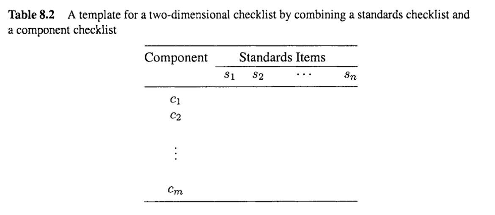

# Chapter 8 Coverage and Usage Testing Based on Checklists and Partitions

In this chapter, we describe several formal test techniques whose models are based on simple structures such as lists and partitions. In particular, the following topics are covered: 0 We start with informal and semi-formal testing with the use of various checklists in Section 8.1. 

* These checklists are formalized into partitions in Section 8.2 to perform basic coveragebased testing.
* The basic usage-based testing for partitions using a similar testing model called Musa's operational profiles (OPs) is described in Section 8.3. 
* We also cover the procedure for developing OPs in Section 8.4 and present a comprehensive case study in Section 8.5. 

Additional testing techniques based on similar underlying models are covered in Chapter 9 for testing boundary conditions between partitioned input sub-domains.

> 在本章中，我们描述了几种正式的测试技术，它们的模型基于简单的结构，如列表和分区。特别地，以下主题被涵盖:
>
> * 我们从非正式和半正式的测试开始，在8.1节中使用各种检查表。
>
> * 这些检查表在8.2节中被形式化为分区，以执行基本的基于覆盖率的测试。
> * 使用类似的测试模型(称为Musa的操作配置文件(OPs))对分区进行基本的基于使用情况的测试，详见章节8.3。
> * 我们亦会在第8.4节介绍发展项目的程序，并在第8.5节提供全面的个案研究。
>
> 基于类似底层模型的其他测试技术将在第9章中介绍，用于测试划分的输入子域之间的边界条件。

## 8.1 CHECKLIST-BASED TESTING AND ITS LIMITATIONS

As already mentioned in Chapter 6, the simplest form of testing is to start running the software and make observations, in the hope that it is easy to distinguish between expected and unexpected behavior. Along the same line, software systems are sometimes tested in a similar way to see if some specific problems can be observed or if specific operational condition and input can be handled without resorting to some systematic method. We call these forms of simple and informal testing ad hoc testing. Ad hoc testing is also called random testing in some literature. However, we will avoid this use of the term random testing because of the possible confusion between it and usage-based statistical testing that is random testing based on specific operational profiles or distributions of likely operations or operational sequences. 

When ad hoc testing is used repeatedly to test a software system, the testers then need to keep track of what has been done, in order to avoid wasting their time repeating the same tests. In addition, an informal “to-do” list is commonly used to track what needs to be done. Such to-do lists can be a physical list, an online list, or just a mental list. The use of these informal lists forms the rudimentary and implicit checklists, where each item can be checked off when corresponding testing was performed, until every item on the lists is checked off.

> 正如在第6章中已经提到的，最简单的测试形式是开始运行软件并进行观察，希望能够很容易地区分预期的和意外的行为。沿着同样的思路，软件系统有时以类似的方式进行测试，以查看是否可以观察到某些特定的问题，或者是否可以处理特定的操作条件和输入，而无需诉诸某些系统方法。我们把这些形式的简单和非正式的测试称为临时测试。在一些文献中，特设检验也被称为随机检验。然而，我们将避免使用术语随机测试，因为它可能与基于使用的统计测试混淆，后者是基于特定操作概况或可能操作或操作序列的分布的随机测试。
>
> 当使用临时测试来重复测试软件系统时，测试人员需要跟踪已经完成的工作，以避免浪费时间重复相同的测试。此外，非正式的“待办事项”列表通常用于跟踪需要完成的工作。这样的待办事项列表可以是一个实体列表，一个在线列表，或者只是一个心理列表。这些非正式列表的使用形成了基本的和隐式的检查列表，当执行相应的测试时，每个项目都可以被检查掉，直到列表上的每个项目都被检查掉。

### Testing with checklists

The idea of checklists can be and has been generalized to perform systematic testing for many software systems (DeMillo et al., 1987; Kaner et al., 1999; Binder, 2000). For example, a specification checklist, or a checklist based on product specifications with each major specification item as a checklist item, can be used to perform black-box testing. Similarly, checklists of expected programming features that are supposed to be implemented in a software product, or coding standards that are supposed to be followed in implementation, are examples of white-box checklists, which can be used to support various types of white-box testing. In fact, the commonly used testing strategy of statement coverage in unit and component testing, or component coverage in integration and system testing, is also white-box checklist based testing, where each element in the checklists corresponds to a specific statement or a specific component, respectively. As we will also see in Section 8.3, usage-based statistical testing can also be supported by a special form of checklists called operational profiles (OPs), in which each item is associated with an operation to be performed together with its probability of usage.

In using these checklists, a specific testing based on a specific checklist can stop when every item on it has been tested (or “checked off”). By been “tested” or “checked off’, we mean that the corresponding test case has been executed, and follow-up activities, such as fixing discovered problems, have been carried out and completed, which may also include rerunning the test case to verify that the problems have indeed been fixed. Some commonly used checklists for black-box or white-box coverage testing are listed below:

* Functional (black-box) checklists at different levels of abstraction and granularity, ranging from major high-level functions for the overall system to specific low-level functions of an individual unit or components.
* Checklists of system elements (white-box) at different levels of granularity, ranging from sub-systems and modules at the high level to individual statements or data items at the low level.
* Checklists of various structures or features that cut through different elements, such as list of call-pairs, consumers-and-producers for certain resources, modules sharing some common data, etc. These lists are concerned with implementation structures, therefore can be classified as white-box checklists as well.
* Checklists about certain properties, such as coding standard, specific specification items, etc., which can be either black-box or white-box.

Other basic types of checklists are also possible. A common way to obtain usable checklists is to select items from several exhaustive checklists based on some criteria and to combine them. Many checklists can also be used together, to form some linked set of things to check during testing, as discussed below. 

Table 8.1 gives a sample high-level checklist for some relational database products (Tian et al., 1995; Tian, 1998). In fact, each item corresponds to a specific high-level functional area or aspect important to the products as perceived by their users, which can be and was further refined into sub-areas using other checklists.

> 检查表的概念可以并且已经被推广到对许多软件系统进行系统测试(DeMillo等人，1987;Kaner et al.， 1999;粘结剂,2000)。例如，一个规格检查表，或者一个基于产品规格的检查表，每个主要的规格项作为一个检查表项，可以用来执行黑盒测试。类似地，期望在软件产品中实现的编程特性的检查表，或者期望在实现中遵循的编码标准的检查表，都是白盒检查表的示例，它可以用于支持各种类型的白盒测试。事实上，在单元和组件测试中语句覆盖率的常用测试策略，或者在集成和系统测试中组件覆盖率的常用测试策略，也是基于白盒检查表的测试，其中检查表中的每个元素分别对应于特定的语句或特定的组件。正如我们将在8.3节中看到的那样，基于使用情况的统计测试也可以通过称为操作概要(OPs)的特殊形式的检查表来支持，其中每个项目都与要执行的操作及其使用概率相关联。
>
> 在使用这些检查清单时，基于特定检查清单的特定测试可以在每个项目都被测试(或“勾选”)时停止。通过“测试”或“检查”，我们的意思是相应的测试用例已经被执行，并且后续的活动，例如修复发现的问题，已经被执行并完成，这也可能包括重新运行测试用例来验证问题确实已经被修复。下面列出了一些常用的黑盒或白盒覆盖率测试检查表:
>
> * 不同抽象层次和粒度的功能(黑盒)检查表，范围从整个系统的主要高级功能到单个单元或组件的特定低级功能。
> * 不同粒度级别的系统元素(白盒)清单，从高层的子系统和模块到低层的单个语句或数据项。
> * 通过不同元素切割的各种结构或特征的检查列表，例如调用对列表，某些资源的消费者和生产者，共享一些公共数据的模块等。这些列表与实现结构有关，因此也可以归类为白盒检查列表。
> * 有关某些属性的核对表，例如编码标准、特定规范项目等，可以是黑盒或白盒。
>
> 其他基本类型的清单也是可能的。获得可用的检查清单的一种常见方法是根据某些标准从几个详尽的检查清单中选择项目并将它们组合起来。许多检查表也可以一起使用，形成一些在测试期间要检查的东西的链接集，如下所述。
>
> 表8.1给出了一些关系数据库产品的高级清单示例(Tian et al.， 1995;田,1998)。事实上，每个项目都对应于一个特定的高级功能区域或用户认为对产品很重要的方面，可以使用其他检查表进一步细化到子区域。

### From basic checklists to hierarchical and combined checklists

The most commonly used form of multiple checklists is the hierarchical checklist, with each item in a higher-level checklist expandable to a full checklist at a lower level until we stop at a level of detail deemed enough by some criteria. In the checklist in Table 8.1, each high-level functional area represented by a n  individual item can be divided into sub-areas, and each sub-areas can be divided further. In fact, they form the hierarchical test suite we described in Chapter 7. Table 8.1 and its associated checklists form a set of hierarchical checklists that can be used as the basis for coverage based testing for these large software systems. 

In addition to the use of individual checklists and hierarchical sets of checklists above, various checklists can also be combined in other forms. For example, a coding standard checklist can be combined with a component or unit checklist to make sure that each component follows all the recommended practice in the coding standards. This combination of two checklists forms a two dimensional checklist, or a table with each of its entries to be checked off, as illustrated in Table 8.2. Similarly, higher dimensional checklists can also be used. In addition, mixed checklists that mix the direct list combinations and hierarchies are also possible, but such mixed checklists should be used with care because of the possible confusion involved.

> 从基本清单到分层和组合清单
>
> 多重检查表最常用的形式是分层检查表，在较高级别的检查表中，每个项目都可以扩展到较低级别的完整检查表，直到我们停止在被某些标准认为足够详细的级别。在表8.1的核对表中，每个由n个单独项目表示的高级功能区可以划分为子区域，每个子区域可以进一步划分。事实上，它们构成了我们在第7章中描述的分层测试套件。表8.1及其相关的检查表形成了一组分层检查表，可以用作这些大型软件系统的基于覆盖率的测试的基础。
>
> 除了使用上述单独的检查清单和分层的检查清单外，各种检查清单还可以以其他形式组合。例如，可以将编码标准检查表与组件或单元检查表结合起来，以确保每个组件遵循编码标准中的所有推荐实践。这两个检查表的组合形成了一个二维检查表，或者一个表，其中每个条目都要被检查掉，如表8.2所示。类似地，也可以使用更高维度的检查表。此外，混合直接列表组合和层次结构的混合检查列表也是可能的，但是应该小心使用这种混合检查列表，因为可能会引起混淆。

### Problems and limitations of  general checklists

One of the important characteristics of these checklists is that they are typically not very specific, particularly those high-level ones. For example, a high-level functional checklist typically lists the major functions to be performed by a software product, but the list items are hardly detailed enough for testers to start a specific test run. The translation from this testing model to the test cases and then to test runs is not a simple matter. It usually involves experienced testers setting up the system and testing environment to execute specific test cases. In addition, repetition of the same test case in a later test run can only be guaranteed with this additional information about setup and environment, but not deduced from the checklist item itself. This would lead to difficulties when we try to rerun the failing execution to recreate the failure scenario for problem diagnosis, or when we need to re-verify the problem fixes. Therefore, additional information needs to be kept for these purposes. 

With the increased demand for more automation, service, and functionality, modern software systems also become larger and more complex. Such systems consist of many components that are interconnected and interact with one another. There are also many different functions provided or supported by the systems for many different users. Both the structural complexity and functional complexity make it hard to effectively use checklists for testing and quality assurance, because of reasons below:

* It would be hard to come up with checklists that cover all the functional (black-box) or structural (white-box) components from different perspectives and at different levels of granularity, resulting in missed areas of coverage. These areas are the “holes” in coverage commonly referred to by practitioners. 
* In an attempt to provide good coverage, a lot of overlaps between different items in the checklists may be introduced, resulting in redundant testing effort when such checklists are used. 
* Some complex interactions of different system components or among major system functions are hard or impossible to describe using checklists.

To deal with the third problem, we will introduced finite-state machines (FSMs) and other related models as the basis for formal and systematic testing in Chapters 10 and 11. The first two problems can be resolved if we can derive a special type of checklists, called partitions, that can both achieve full coverage of some specifically defined entities or relationships and avoid overlaps. The formality and precision involved in defining these partitions would also help us obtain a more precisely defined set of test cases as compared to general checklist, thus making problem diagnosis, fix re-verification, and other tasks easier to perform.

> 通用清单的问题和局限性
>
> 这些清单的一个重要特征是它们通常不是非常具体，特别是那些高级清单。例如，一个高级的功能检查表通常列出了软件产品要执行的主要功能，但是列表项几乎不够详细，测试人员无法开始一个特定的测试运行。从这个测试模型到测试用例，再到测试运行的转换并不是一件简单的事情。它通常需要有经验的测试人员建立系统和测试环境来执行特定的测试用例。此外，在以后的测试运行中，相同测试用例的重复只能通过有关设置和环境的附加信息来保证，而不能从检查表项本身推断出来。当我们试图重新运行失败执行以重新创建故障场景以进行问题诊断时，或者当我们需要重新验证问题修复时，这将导致困难。因此，需要为这些目的保留额外的信息。
>
> 随着对更多自动化、服务和功能的需求增加，现代软件系统也变得更大、更复杂。这样的系统由许多相互连接和相互作用的组件组成。系统还为许多不同的用户提供或支持许多不同的功能。结构的复杂性和功能的复杂性都使检查表难以有效地用于测试和质量保证，原因如下:
>
> * 很难从不同的角度和不同的粒度级别提出涵盖所有功能(黑盒)或结构(白盒)组件的检查清单，从而导致错过覆盖区域。这些区域是从业人员通常提到的覆盖范围中的“漏洞”。
> * 为了提供良好的覆盖率，可能会引入检查表中不同项目之间的许多重叠，从而导致使用此类检查表时的冗余测试工作。
> * 不同系统组件或主要系统功能之间的一些复杂的相互作用很难或不可能使用清单来描述。
>
> 为了解决第三个问题，我们将在第10章和第11章中介绍有限状态机(FSMs)和其他相关模型，作为正式和系统测试的基础。如果我们能够派生出一种特殊类型的检查表(称为分区)，那么前两个问题就可以得到解决，它既可以实现对某些特定定义的实体或关系的完全覆盖，又可以避免重叠。与一般的检查表相比，定义这些分区所涉及的正式性和精确性也将帮助我们获得更精确定义的测试用例集，从而使问题诊断、修复重新验证和其他任务更容易执行。

## 8.2 TESTING FOR PARTITION COVERAGE

In the software testing context, partitions and partition-based testing are a special type of checklists and checklist-based testing. Partitions possess some desirable properties that set them apart from general checklists. Therefore, they can be used to better support testing and address some specific problems associated with general checklists in two areas: Better coverage because a partition is collectively exhaustive, and better efficiency because of the use of mutually exclusive partitions.

> 在软件测试上下文中，分区和基于分区的测试是一种特殊类型的检查表和基于检查表的测试。分区拥有一些理想的属性，使它们有别于一般的检查表。因此，它们可以用于更好地支持测试，并在两个方面解决与一般检查表相关的一些特定问题: 更好的覆盖率(因为分区是全面详尽的)和更好的效率(因为使用互斥分区)。

### 8.2.1 Some motivational examples

As described in the previous chapter, one essential step in testing is to sensitize test cases, or defining specific input variables and associated values to exercise certain parts of the program in the white-box view or to perform certain functions in the black-box view. If the input-output relation is a simple one, then test cases can be directly constructed by selecting corresponding input variable values through some systematic sampling. If the sample space is relatively small, exhaustive testing might be possible. Example of such cases include a decision based on a few input variables of the logical type, each can take a true (T) or false (F) value. Then the number of input combinations would be $2^n$ for n such input variables. Complete coverage of input combinations are possible as long as n remains small. However, even for simple input-output relations, such as a simple program calculating the root of quadratic equations in the form of:
$$
ax^2 + bx + c = 0
$$
with the solution for the root r to be:
$$
r = \frac{-b \pm \sqrt{b^2 - 4ac}}{2a}
$$
The number of input combinations between the three input variables a, b, and c could be huge. For example, if each of these three variables is represented by a 32 bit floating point number, the number of all possible input value combinations is then
$$
2^{32}\times 2^{32} \times 2^{32} = 2 ^{96}
$$
Even for this fairly simple program, the number of test cases to cover all the input value combinations is beyond the testing resource for any organization.

However, the above example can also be used to illustrate the basic idea of partitionbased testing. Notice that in our algebra classes, we all learned to distinguish the different cases for the root associated with different values for the part $d = b^2 - 4ac$. We know that the equation has two different roots if d > 0, two identical roots if d = 0, and no real root if d < 0. This relationship between d and r can be used in testing to see if the programs handles all three of these different situations correctly. In doing this, we effectively grouped the set of all possible input value combinations or test cases into three equivalent classes, or a partition into three subsets defined by the three conditions on d. Such partitioned subsets of input domains, or the set of possible input values, are called input sub-domains.

In this case, three test cases can be used, as illustrated in Table 8.3. Notice that the choice of specific test cases for each sub-domain that satisfy specific conditions is not unique. However, if simple sub-domain coverage is the goal, then it doesn’t matter which one we choose, because every point in a given sub-domain receives the same kind of treatment, or belongs to the same equivalent class. In fact, this testing strategy directly corresponds to the checklist-based testing, with the domain partition as the checklist, and each sub-domain corresponding to a single element in the checklist. 

This idea can be generalized to support partition-based testing for the general case: We can sample one test case from inside each subset in the partition, thus achieving complete coverage of all the subsets of corresponding equivalence classes. As illustrated in this example, the key to partition-based testing is to define the partitions first and then try to sensitize the test cases to achieve partition coverage.

> 8.2.1一些励志的例子
>
> 正如前一章所描述的，测试中的一个重要步骤是敏感化测试用例，或者定义特定的输入变量和相关的值，以在白盒视图中执行程序的某些部分，或者在黑盒视图中执行某些功能。如果是简单的输入输出关系，则可以通过系统采样选择相应的输入变量值，直接构建测试用例。如果样本空间相对较小，则可能进行穷举测试。这种情况的示例包括基于逻辑类型的几个输入变量的决策，每个变量可以取真(T)或假(F)值。那么对于n个这样的输入变量，输入组合的个数就是$2^n$。只要n保持较小，完全覆盖输入组合是可能的。然而，即使对于简单的输入-输出关系，例如计算二次方程根的简单程序，其形式为:
> $$
> ax^2 + bx + c = 0
> $$
> 根号r的解为:
> $$
> r = \frac{-b \pm \sqrt{b^2 - 4ac}}{2a}
> $$
> 三个输入变量a, b和c之间的输入组合的数量可能非常大。例如，如果这三个变量中的每一个都用一个32位浮点数表示，则所有可能的输入值组合的数量为
> $$
> 2^{32}\times 2^{32} \times 2^{32} = 2 ^{96}
> $$
> 即使对于这个相当简单的程序，覆盖所有输入值组合的测试用例的数量也超出了任何组织的测试资源。
>
> 然而，上面的例子也可以用来说明基于分区的测试的基本思想。注意，在我们的代数课上，我们都学习了区分与部分$d = b^2 - 4ac$的不同值相关的根的不同情况。我们知道方程有两个不同的根如果$d \gt 0$，如果d = 0有两个同根，如果$d \lt 0$. d和r之间的关系可以用于测试，看看程序是否正确地处理了这三种不同的情况。在这样做的过程中，我们有效地将所有可能的输入值组合或测试用例的集合分组到三个等效的类中，或者将其划分为由d上的三个条件定义的三个子集。输入域的这种划分的子集，或可能的输入值的集合，称为输入子域。
>
> 在这种情况下，可以使用三个测试用例，如表8.3所示。注意，为满足特定条件的每个子域选择特定的测试用例并不是唯一的。然而，如果目标是简单的子域覆盖，那么我们选择哪一个并不重要，因为给定子域中的每个点都接受相同的处理，或者属于相同的等效类。事实上，这种测试策略直接对应于基于检查表的测试，将域分区作为检查表，并且每个子域对应于检查表中的单个元素。
>
> 这个想法可以推广到支持一般情况下基于分区的测试:我们可以从分区中的每个子集中采样一个测试用例，从而实现相应等价类的所有子集的完全覆盖。如本例所示，基于分区的测试的关键是首先定义分区，然后尝试敏感化测试用例以实现分区覆盖。

### 8.2.2 Partition: Concepts and definitions

Partition is a basic mathematical concept, generally associated with set theory. Formally, a partition of a set S is a division of a set into a collection of subsets G1,  G2, . . . , Gn, that satisfies the following properties:

* The subsets are mutually exclusive, that is, no two subsets share any common members, or formally,
  $$
  \forall i, j, i \neq j \Rightarrow G_i \cap G_j = \varnothing
  $$
  That is, the intersection of any such two subsets must necessarily be empty.

* The subsets are collectively exhaustive, that is, they collectively cover or include all the elements in the original set, or formally,
  $$
  \bigcup_{n}^{i=1}G_i = S
  $$
  That is, the union of all subsets ($G_i$’s) is the set $S$.

Each of these subsets in a partition is called an equivalent class (or equivalence class), where each member is the same with respect to some specific property or relation used to define the subset. Formally, the specific relation for the members in an equivalent class is symmetric, transitive, and reflexive, where

* A symmetric relation is one that still holds if the order is changed. For a binary relation R defined on two elements a and b, R is symmetric if $R(a, b) \Rightarrow  R(b, a)$. For example, “$=$” is symmetric; but "$>$"   is not.
* A transitive relation is one that holds in a relation chain. A transitive binary relation R is one that $R(a,b) \wedge R(b,c) \Rightarrow R(a,c)$. For example, “>” is transitive; but “is-mother-of” is not.
* A reflexive relation is one that holds on every member by itself. A reflexive binary relation R is one that $R(a, a)$. For example, “=” is reflexive; but “>” is not.

Similarly, if a relation is not symmetric, not transitive, or not reflexive, we call it asymmetric, intransitive, or irreflexive, respectively. 

With these formal definitions and descriptions of partition in mind, we next examine various uses of partitions and related ideas for software testing (White and Cohen, 1980; Clarke et al., 1982; Weyuker and Jeng, 1991; Beizer, 1990).

> 8.2.2分区:概念和定义
>
> 划分是一个基本的数学概念，通常与集合论有关。形式上，对集合S的划分是将一个集合划分为子集G1, G2，…的集合。， Gn，满足以下性质:
>
> * 子集是互斥的，也就是说，没有两个子集有任何共同的成员，或者正式地说，
>
> $$
> \forall i, j, i \neq j \Rightarrow G_i \cap G_j = \varnothing
> $$
> 也就是说，任意两个子集的交集必须是空的。
>
> 这些子集是集体穷举的，也就是说，它们共同覆盖或包含原始集合中的所有元素，或者正式地说，
> $$
>   \bigcup_{n}^{i=1}G_i = S
> $$
> 也就是说，所有子集($G_i$’s)的并集是集合$S$。
>
> 划分中的每一个子集都称为等价类(或等价类)，其中每个成员对于用于定义子集的某些特定属性或关系都是相同的。形式上，等价类中成员的特定关系是对称的、传递的和自反的，其中
>
> 对称关系是指改变顺序后仍然保持不变的关系。对于定义在两个元素a和b上的二元关系R，如果$R(a, b) \Rightarrow  R(b, a)$, R是对称的。例如，“$=$”是对称的; 但“$\gt$不是。
> 传递关系是关系链中的关系。传递二元关系R是$R(a,b) \wedge R(b,c) \Rightarrow R(a,c)$。例如，“$\gt$”是传递物;但“is-mother-of”不是。
>
> * 自反关系是一种单独适用于每个成员的关系。自反二元关系R是$R(a, a)$。例如，" = "是自反的;但“$\gt$”不是。
>
> 类似地，如果一个关系不是对称的、不是及物的或不是自反的，我们分别称之为非对称的、非及物的或非自反的。 
>
> 有了这些对分区的正式定义和描述，我们接下来将研究分区的各种用途以及软件测试中的相关思想(White and Cohen, 1980;Clarke et al.， 1982;Weyuker and Jeng, 1991;Beizer, 1990)。

### 8.2.3 Testing decisions and predicates for partition coverage

Since partitions are a special subclass of checklists, the types of partitions can closely resemble the type of checklists we described in Section 8.1. However, we group them in a different way according to the specific decisions associated use in defining different types of partitions, as follows:

* Partitions of some product entities, such as external functions (black-box view), system components (white-box view), etc. The definition of such partitions are typically a simple “member” relation in sets, that is, $x\in S$ for z as a member of the set S. As a concrete example, whether a component belongs to a sub-system or not is easy to decide. The key is to ensure the partitioned subsets truly form a partition of the original set of all entities. That is, they are mutually exclusive and collectively exhaustive.
* Partitions based on certain properties, relations, and related logical conditions. These partitions can be further divided into two sub-groups:
  * Direct use of logical predicates, through logical variables (those take T/F or True/False values) and connected through logical operators AND ($\and$), OR ($\or$), or NOT ($\neg$)
  * Comparison of numerical variables using some comparison operators, such as "<", "=", "≤", "≥", ">", and "$\ne$". For example, all possible values (a property) of a variable x can be partitions into two subsets S1, and S2 definedby S1 = {x: x < 0} and S2 = {x: x > 0}.
* Combinations of the above basic types are also commonly used in decision making. 
  For example, the sub-domain of non-negative integers less than 2 1 can be specified as $(x \in I) \and (x \geq 0) \and(x < 21)$ , where I denote the set of integers. The values range is also conveniently represented as [0, 21), as we see in the mathematical literature.

For the first type of partitions, the testing would be essentially the same as for checklistbased testing: we simply select one item for testing at a time from the subset as a representative of the corresponding equivalent class until we have exhausted all the subsets.

For the other types of partitions above, testing would involve some sensitization in determining the input variables and their values in consultation with the specific conditions or logical predicates used to define each partitioned subset. For example, to satisfy both conditions $(x\geq 0)$ and (x < 21) for the subset [0, 21) above, we might as well select x = 10. Notice that in each subset, there might be many elements. Partition-based testing selects one from each subset as the representative for the subset based on the equivalence relations defined. 

In addition, the conditions for partitions, or the logical predicate values, are often closely related to either the product specifications (black-box view) or actual implementations (white-box view). For example, we might specify that a function works for certain data types, such as the distinction between integer arithmetic operations and floating point ones in most numerical computing systems. Similarly, many conditional statements in programs may be related to some partitioning conditions, such as those used to guard unexpected input. For example, most arithmetic software packages would not accept divide by 0 as legitimate input. In general, such domain partitions can be represented by simple decisions in product specification or multiple decisions in program code. When multiple decisions are involved, decision trees or decision tables can be used. Therefore, we can consider decision testing and related predicate testing as part of the general partition-based testing. 

The above combinations of partition definitions can often be mapped to a series of decisions made along the way of program execution. These decisions in a sequence can be represented by a decision tree, starting from the initial decision, progressing through intermediate decisions, until we finish with a final decision and program termination. Sometimes, the decision can be organized into stages, with the same question asked at each stage regardless of the previous decisions. This would result in a uniform decision tree. Alternatively, some of the later decisions and questions asked may be dependent on the earlier ones, resulting in a non-uniform decision tree. 

In either case, we can use the unique path property, from the initial decision node to the last decision outcome to enumerate all the series of decisions, and treat each unique path as a sub-domain and derive test cases to cover each sub-domain. In this way, a decision tree is equivalent to a hierarchical checklist, but with the items of each checklist at each decision point form a partition. For example, in the hierarchical checklist using test scenario classes, scenario numbers, and variation numbers in Section 8.1 can be interpreted as a three-level decision tree, and test cases can be selected to cover these individual variations from specific scenarios in different scenario classes. 

The key to deriving coverage based testing for such decisions is to select values to make the test execution follow specific decision paths. For example, if we have decisions using logical variables P and Q in two stages, then we can realize the four combinations:

* $P\and Q$ or TT, that is, P = True and Q = True. 
* $P \and \neg Q$ or TF, that is, P = True and Q = False. 
* $\neg P \and Q$ or FT, that is, P = False and Q = True. 
* $\neg P \and \neg Q$ or FF, that is, P = False and Q = False.

For a specific combination, if other numerical variables are involved, we need to select the numerical variable values to make them satisfy the conditions. For example, to select a test for $(x \leq 0) \and (x < 2l)$, we can choose x = 10, that satisfies both ($x \geq 0$) and (x < 21). In more complicated situations, we might want to generate a list of candidate test cases based on one condition. and then use other conditions to eliminate certain elements from this initial candidate list. In this example, we might start with a list like { 1, 10, 100, . . .}, and the second condition would reduce it to {1, 10}, and we can finally select 10 or 2 = 10 as our test case to cover this specific decision combination.

> 8.2.3 测试决策和谓词以实现分区覆盖
>
> 由于分区是检查表的一个特殊子类，分区的类型可以与我们在第8.1节中描述的检查表的类型密切相似。然而，我们根据用于定义不同类型分区的特定决策将它们以不同的方式进行分组，如下所示：
>
> - 某些产品实体的分区，例如外部功能（黑盒视角）、系统组件（白盒视角）等。这类分区的定义通常是集合中的简单“成员”关系，即$x\in S$表示z是集合S的成员。具体例子，判断一个组件是否属于子系统是容易决定的。关键是确保分区后的子集真正形成了原始实体集的一个分区。即它们是互斥的且共同穷尽的。
> - 基于某些属性、关系和相关逻辑条件的分区。这些分区可以进一步分为两个子组：
>   - 直接使用逻辑谓词，通过逻辑变量（这些变量取T/F或True/False值）并通过逻辑运算符AND（$\and$）、OR（$\or$）或NOT（$\neg$）连接。
>   - 使用一些比较运算符比较数值变量，如"<"、"="、"≤"、"≥"、">"和"$\ne$"。例如，变量x的所有可能值（一种属性）可以分为两个子集S1和S2，定义为S1 = {x: x < 0}和S2 = {x: x > 0}。
> - 也常用上述基本类型的组合进行决策。 例如，非负整数小于21的子域可以指定为$(x \in I) \and (x \geq 0) \and(x < 21)$，其中I表示整数集。值范围也可以方便地表示为[0, 21)，正如我们在数学文献中所见。
>
> 对于第一种类型的分区，测试基本上与基于检查表的测试相同：我们只需从子集中逐一选择一个项目作为相应等价类的代表，直到我们耗尽所有子集。
>
> 对于上述其他类型的分区，测试将涉及一些敏化，以确定输入变量及其值，这需要与用于定义每个分区子集的特定条件或逻辑谓词进行协商。例如，为了满足上述子集[0, 21)中的$(x\geq 0)$和$(x < 21)$两个条件，我们可能会选择x = 10。注意，在每个子集中，可能有许多元素。基于分区的测试从每个子集中选择一个作为该子集的代表，基于定义的等价关系。
>
> 此外，分区的条件或逻辑谓词值通常与产品规范（黑盒视角）或实际实现（白盒视角）密切相关。例如，我们可能会指定某个函数适用于某些数据类型，如在大多数数值计算系统中区分整数算术运算和浮点运算。同样，程序中的许多条件语句可能与一些分区条件相关，如用于防止意外输入的那些。例如，大多数算术软件包不会接受除以0作为合法输入。一般来说，这样的域分区可以通过产品规范中的简单决策或程序代码中的多重决策来表示。当涉及到多个决策时，可以使用决策树或决策表。因此，我们可以将决策测试和相关的谓词测试视为通用的基于分区的测试的一部分。
>
> 上述分区定义的组合通常可以映射到程序执行过程中沿途做出的一系列决策。这些决策序列可以用决策树表示，从初始决策开始，通过中间决策，直到我们完成最终决策和程序终止。有时，决策可以分为阶段，每个阶段都提出相同的问题，不论之前的决策如何。这将导致一个统一的决策树。或者，一些后来的决策和提出的问题可能依赖于之前的决策，导致一个非统一的决策树。
>
> 无论哪种情况，我们都可以使用从初始决策节点到最后决策结果的唯一路径属性，来枚举所有的决策系列，并将每个唯一路径视为一个子域，并派生测试用例以覆盖每个子域。这样，决策树等同于一个分层的检查表，但每个决策点的检查表项形成一个分区。例如，在第8.1节中使用测试场景类、场景编号和变体编号的分层检查表可以解释为一个三层决策树，测试用例可以选择覆盖不同场景类中特定场景的这些个别变体。
>
> 为这类决策派生覆盖率测试的关键是选择值，使得测试执行遵循特定的决策路径。例如，如果我们有在两个阶段使用逻辑变量P和Q的决策，那么我们可以实现四种组合：
>
> - $P\and Q$或TT，即P = True且Q = True。
> - $P \and \neg Q$或TF，即P = True且Q = False。
> - $\neg P \and Q$或FT，即P = False且Q = True。
> - $\neg P \and \neg Q$或FF，即P = False且Q = False。
>
> 对于特定的组合，如果涉及其他数值变量，我们需要选择数值变量的值使其满足条件。例如，要选择$(x \leq 0) \and (x < 21)$的测试，我们可以选择x = 10，它同时满足$(x \geq 0)$和$(x < 21)$。在更复杂的情况下，我们可能希望基于一个条件生成一系列候选测试用例，然后使用其他条件从这个初始候选列表中排除某些元素。在这个例子中，我们可能从像{1, 10, 100, ...}这样的列表开始，第二个条件会将其减少到{1, 10}，最终我们可以选择10或2=10作为我们的测试用例，以覆盖这个特定的决策组合。

## 8.3 USAGE-BASED STATISTICAL TESTING WITH MUSA’S OPERATIONAL PROFILES

One important testing technique, the usage-based statistical testing with Musa’s operational profiles (OPs) (Musa, 1993; Musa, 1998), shares the basic model with partition testing techniques, and enhances it to include probabilistic usage information. We next describe Musa OPs and their usage in testing.

>  8.3使用musa的操作配置文件进行基于使用的统计测试
>
> 一项重要的测试技术是基于使用情况的统计测试，使用Musa的操作概况(Musa, 1993;Musa, 1998)，与分区测试技术共享基本模型，并对其进行了增强，以包括概率使用信息。接下来我们将描述Musa OPs及其在测试中的用法。

### 8.3.1 The cases for usage-based statistical testing

The many sub-domains for large software systems may include many different operations for each sub-domain. In such situations, the equivalence relation as represented by partition testing described earlier in this chapter represents a uniform sampling of one test point from each sub-domain. However, if operations associated with one particular sub-domain are used more often than others, each underlying defect related to this sub-domain is also more likely to cause more problems to users thain problems associated with other sub-domains. 

This likelihood for problems to customers,or related system failures defined accordingly, is captured in software product reliability. As already introduced in Chapter 2, reliability is defined to be the probability of failure-free operations for a specific time period or a specific input set (Musa et al., 1987; Lyu, 1995a; Tian, 1998). The best way to assess and ensure product reliability during testing is to test the software product as if it is used by customers through the following steps:

* The information related to usage scenarios, patterns, and related usage frequency by target customers and users needs to be collected. 
* The information collected above needs to be analyzed and organized into some models what we call operational profiles (OPs) for use in testing. 
* Testing needs to be performed in accordance with the OPs. 
* Testing results can be analyzed to assess product reliability and provide feedback to the testing and the general software development process.

Most of the common testing related activities were described in Chapter 7, and reliability analysis is described in Chapter 22. Therefore, we concentrated on the information collection, OP construction, and it usage in testing in the rest of this chapter. 

Like most test activities, the actual testing is typically performed late in the overall product development process, and the model construction could be and should be started much earlier. Usage-based statistical testing actually pushes both these activities to the extremes at both ends as compared with most other testing techniques. On the one hand, the operational profiles (OPs) need to be constructed with customer and user input. It makes more sense to start them right at the requirement analysis phase, or even earlier, in the product planning and market assessment phase. On the other hand, testing according to customer usage scenarios and frequencies captured in OPs cannot be performed until most of the product components have been implemented. Therefore, such OP-based testing could only be performed in the very late sub-phases of testing, such as in the integration, system, or acceptance testing sub-phases.

> 基于使用的统计测试的案例
>
> 大型软件系统的许多子域可能包括每个子域的许多不同操作。在这种情况下，本章前面描述的分区测试所表示的等价关系表示从每个子域中对一个测试点进行统一采样。然而，如果与一个特定子域相关的操作比其他子域使用得更频繁，那么与这个子域相关的每个潜在缺陷也更有可能给用户带来比与其他子域相关的问题更多的问题。
>
> 这种给客户带来问题的可能性，或者相应定义的相关系统故障，在软件产品可靠性中被捕获。如第2章所述，可靠性被定义为在特定时间段或特定输入集内无故障运行的概率(Musa et al.， 1987;律,1995;田,1998)。在测试期间评估和确保产品可靠性的最佳方法是，按照客户使用软件产品的方式，通过以下步骤进行测试:
>
> * 收集目标客户和用户的使用场景、使用模式、使用频率等相关信息。
> * 上面收集的信息需要进行分析并组织成一些模型，我们称之为操作概要(OPs)，以便在测试中使用。
> * 测试须按照操作规程进行。
> * 可以分析测试结果以评估产品可靠性，并为测试和一般软件研制过程提供反馈。
>
> 第7章描述了大多数常见的测试相关活动，第22章描述了可靠性分析。因此，我们将在本章的其余部分集中讨论信息收集、OP构建以及在测试中的使用。
>
> 像大多数测试活动一样，实际的测试通常在整个产品开发过程的后期执行，而模型构建可以并且应该更早地开始。与大多数其他测试技术相比，基于使用的统计测试实际上将这两个活动推向了两端的极端。一方面，需要使用客户和用户输入来构建操作概要文件(OPs)。在需求分析阶段，或者更早的时候，在产品计划和市场评估阶段，开始它们是更有意义的。另一方面，在大多数产品组件实现之前，不能根据客户使用场景和OPs中捕获的频率进行测试。因此，这种基于操作的测试只能在测试的非常后期的子阶段中执行，例如在集成、系统或验收测试的子阶段中。

### 8.3.2 Musa OP: Basic ideas

According to Musa (Musa, 1993; Musa, 1998), an operational profile, or an OP for short, is a list of disjoint set of operations and their associated probabilities of occurrence. It is a quantitative characterization of the way a software system is or will be used. As a simple example, consider the usage of www . seas. smu. edu, the official web site for the School of Engineering (which used to be called School of Engineering and Applied Science, or SEAS) of Southern Methodist University (SMU/SEAS). Table 8.4 gives the OP for this site, or the number of requests for different types of files by web users over 26 days and the related probabilities. 

The “operations” represented in the operational profiles are usually associated with multiple possible test cases or multiple runs. Therefore, we typically assume that each “operation” in an OP can be tested through multiple runs without repeating the exact execution under exactly the same environment. In a sense, each operation corresponds to an individual sub-domain in domain partitions, thus representing a whole equivalence class. In this example, each item in the table, or each operation, represents a type of file requested by a web user, instead of individual web pages. Of course, we could represent each web page as an operation, but it would be at a much finer granularity. When the granularity is too fine, the statistical testing ideas may not be as applicable, because repeated testing may end up repeating a lot of the same test runs, which adds little to test effectiveness. In addition, such fine-granularity OPs would be too large to be practical. For example, the number of individual web pages on an average web site would be more than tens of thousands, while the number of file types is usually limited to a hundred or so, including many variations of the same type, such as HTML files with extensions of “.HTML”, “.html”, “.htm”, etc. 
There are more than 11,000 web pages but only about a hundred file types for SMWSEAS. 
There are also several other key points worth noting about such OPs, including:

* It is customary to sort the operations by descending probabilities of usage and present the results in that order. 
* It is common to have quite uneven distribution of usage probabilities, with a few frequently used ones account for most of the usage frequencies. For example, the top 13 out of a hundred or so files types account for more than 98% of the web hits or individual requests for SMU/SEAS. 
* Related to the uneven distribution of usage probabilities is the probability threshold for individual operations. The basis of statistical testing is to perform more testing for those operations that are used more by the customers. Therefore, if some operations have very low probability of usage, we could omit them in the OP. This probability threshold plays an important role in limiting the numbers of operations to represent in the OP, especially when there are a large number of possible operations. 
* The representation in forms similar to Table 8.4 is called tabular representation in literature, which can often be represented visually as a histogram, such as in Figure 8.1. The use of such histograms has several advantages, primary in the direct and intuitive information about the relative value and magnitude of the different usage probabilities associated with different operations.

Consequently, an OP can be considered to be a checklist or a partition, but with frequency or probability of usage associated with each item in the list or with each sub-domain in the partition.

> 8.3.2 Musa OP:基本思想
>
> 根据Musa (Musa, 1993; Musa, 1998)，==一个操作概要，或简称OP，是一组不相交的操作及其相关发生概率的列表==。它是对软件系统正在使用或将要使用的方式的定量描述。作为一个简单的例子，考虑一下www的用法。海洋。smu。这是南卫理公会大学(SMU/SEAS)工程学院(过去被称为工程与应用科学学院，简称SEAS)的官方网站。表8.4给出了该站点的OP，即web用户在26天内对不同类型文件的请求数量及其相关概率。
>
> 在操作概要文件中表示的“操作”通常与多个可能的测试用例或多个运行相关联。因此，我们通常假设OP中的每个“操作”都可以通过多次运行进行测试，而无需在完全相同的环境下重复执行。从某种意义上说，每个操作对应于域分区中的单个子域，从而表示整个等价类。在这个例子中，表中的每个项或每个操作都代表了web用户请求的一种文件类型，而不是单独的web页面。当然，我们可以将每个网页表示为一个操作，但它的粒度要细得多。当粒度太细时，统计测试思想可能就不适用了，因为重复的测试最终可能会重复许多相同的测试运行，这对测试的有效性增加的很少。此外，这种细粒度的OPs太大而不实用。举例来说，一般网站的个别网页数目会超过上万个，而文件类型的数目则通常限制在一百来个左右，包括同一类型的许多变种，例如扩展名为“。HTML”、“。HTML”、“。htm”等HTML文件。
> SMWSEAS有超过11000个网页，但只有大约100种文件类型。
> 关于这类项目，还有其他几个要点值得注意，包括:
>
> * 习惯上按使用概率降序对操作进行排序，并按此顺序呈现结果。
> * 使用概率分布不均匀是很常见的，少数常用的频率占了大部分的使用频率。例如，在100个左右的文件类型中，排名前13位的文件类型占SMU/SEAS的web点击或个人请求的98%以上。
> * 与使用概率的不均匀分布相关的是单个操作的概率阈值。统计测试的基础是对客户使用较多的操作执行更多的测试。因此，如果某些操作的使用概率非常低，我们可以在OP中省略它们。这个概率阈值在限制OP中要表示的操作数量方面起着重要的作用，特别是当可能的操作数量很多的时候。
> * 与表8.4类似的表示形式在文献中称为表格式表示，通常可以直观地表示为直方图，如图8.1所示。使用这种直方图有几个优点，主要是关于与不同操作相关的不同使用概率的相对值和大小的直接和直观的信息。
>
> 因此，可以将OP视为一个清单或一个分区，但是使用的频率或概率与列表中的每个项目或分区中的每个子域相关联。

### 8.3.3 Using OPs for statistical testing and other purposes

Once an OP is constructed, it can be used to support statistical testing by some random sampling procedure to select test cases according to the probability distribution and execute them. Essentially, each operation in the OP corresponds to certain test cases specifically constructed or selected from existing ones to specifically test this system operation. The allocation of test cases is also affected by the associated probability. For legacy products, there may be more test cases than we can use for some operations. Therefore, the probabilities for individual operations can be used to select some existing test cases while screening out others. Consequently, these probabilities determine the minimal number of test cases that need to be constructed or selected for each operation. 

The actual test runs are sampled from these test cases according to the probability of associated operations. Therefore, the number of test runs for each operation in the OP is proportional to its probability. Under most circumstances, these test cases and associated runs can be prepared ahead of time, so that some test procedure can be employed to sequence the multiple test runs according to various criteria we described in Chapter 7. In some cases, truly dynamic random sampling can be used, to dynamically select test cases to run next. However, such dynamic random sampling will slow down test execution and the system performance because of the overhead involved in managing the test case selection in addition to monitoring the test runs. On the other hand, much of testing is aimed at monitoring the system performance and possible problems under “normal” operational conditions, particularly for usage-based statistical testing of common usage scenarios carried out under the environment that resembles target customers’. We would like to reduce such overhead and get a truly representative setting of in-field operations. Therefore, unless absolutely necessary, we should prepare the test cases and test procedures ahead of time to reduce the impact of testing overhead on normal system operations. 

In addition to or in place of proportional sampling, progressive testing is often used with the help of OPs. For example, at the beginning of testing, higher probability threshold can be used to select a few very important or highly used operations for testing. As testing progresses, the threshold can be lowered to allow testing of less frequently used operations so that a wide variety of different operations can be covered. In a sense, the use of OPs can help us prioritize and organize our testing effort so that important or highly used areas are tested first, and other areas are progressively tested to ensure good coverage. 

The use of OPs for statistical testing enables us to make of quantitative reliability assessment and ensure product reliability that is meaningful to target customers. Failure and test execution data from OP-guided testing should resemble the data that would be expected by target customers. It is for this reason that data from such statistical testing can be analyzed using various reliability models to assess product reliability, to determine if the product is reliable enough for release. If the reliability goal has not been achieved yet, the analysis results can often help us predict time and resource to reach the reliability goal, and sometimes to identify problematic areas for focused improvement actions. These reliability models and their usage are described in Chapter 22. 

Besides the above use of OPs to help us prioritize testing and assure product reliability, OPs can also be used in other situations for various purposes, including:

* Productivity improvement and schedule gains could be achieved because of the focus on high-leverage parts with the use of OPs. The use of OPs would reduce the overtesting of lesser-used product components or functions: The same effort could be applied to most-used parts, with reduced effort for lesser-used parts. According to data from AT&T (Musa, 1993), a reduction of 56% system testing cost or 11.5% overall cost could be achieved.

* Introducing new products by implementing highly used features quickly to capture market share and then gradually adding lesser-used features in subsequent releases or product updates. OP-guided testing would make this approach work. This use of OP is similar to and can be combined with spiral development process (Boehm, 1988), or the use of software prototypes to resolve important product design questions before proceeding with other implementation activities.

* Better communications with customers and better customer relations: The use of OPs can foster better communications with target customers and help establish and maintain better customer relations. There are several reasons for these, including: 

  * The construction of operational profiles needs the direct or indirect involvement of customers. Customer’s perspectives of quality, product features, relative importance, and possible usage scenarios and associated problems are adopted in testing when OPs are used. Therefore, it’s more likely for the software development organization and the customers to appreciate each other’s views and efforts in such a collaborative instead of an adversarial environment. 

  - The use of OPs can help develop more precise product requirements and specifications, which are more likely to satisfy customers’ needs. 
  - Customer and user training can be better focused on those features that the customers use the most instead of esoteric ones more likely to be used by internal users.

* High return on investment: According to data from AT&T (Musa, 1993), the OP development cost for an “average” product is about one staff-month. The average product is one that contains 100 KLOC (thousand lines of code) and takes 10 developers 18 months to finish. There is also a sub-linear increase of OP development cost for larger products. The cost-benefit ratio is reported to be about 1:10.

Because of these tangible and intangible benefits, OPs should always be a prime candidate for testing in large software system with many users or with diverse usage environments.

> 8.3.3 利用OP进行统计测试和其他目的
>
> 一旦构建了操作概况（OP），就可以通过某种随机抽样程序来支持统计测试，根据概率分布选择测试用例并执行它们。本质上，OP中的每个操作对应于特定构建或从现有测试用例中选择的，用以专门测试该系统操作的测试用例。测试用例的分配也受到相关概率的影响。对于遗留产品，对于某些操作，我们可能有更多的测试用例可用。因此，可以使用单个操作的概率来选择一些现有的测试用例，同时筛选掉其他的。因此，这些概率确定了每个操作需要构建或选择的最小测试用例数量。
>
> 实际的测试运行根据相关操作的概率从这些测试用例中抽样。因此，OP中每个操作的测试运行次数与其概率成比例。在大多数情况下，这些测试用例和相关运行可以提前准备好，以便可以使用某种测试程序按照我们在第7章中描述的各种标准来排序多个测试运行。在某些情况下，可以使用真正的动态随机抽样，动态选择下一个运行的测试用例。然而，这种动态随机抽样会因管理测试用例选择以及监控测试运行所涉及的开销而减慢测试执行和系统性能。另一方面，大量的测试旨在监控系统性能和在“正常”操作条件下可能出现的问题，特别是对于在类似目标客户的环境下进行的基于使用的统计测试中常见的使用场景。我们希望减少这种开销，获得一个真正代表性的现场操作设置。因此，除非绝对必要，我们应该提前准备测试用例和测试程序，以减少测试开销对正常系统操作的影响。
>
> 除了或代替比例抽样，常常利用OP进行渐进式测试。例如，在测试开始时，可以使用较高的概率阈值来选择一些非常重要或高频使用的操作进行测试。随着测试的进行，可以降低阈值，以允许测试不太频繁使用的操作，以便覆盖各种不同的操作。从某种意义上说，使用OP可以帮助我们优先考虑和组织我们的测试工作，以便首先测试重要或高频使用的区域，然后逐步测试其他区域以确保良好的覆盖率。
>
> 使用OP进行统计测试使我们能够进行定量的可靠性评估，并确保对目标客户有意义的产品可靠性。来自OP指导测试的失败和测试执行数据应该与目标客户预期的数据相似。正因为如此，可以使用各种可靠性模型分析此类统计测试的数据，以评估产品可靠性，确定产品是否足够可靠以供发布。如果尚未达到可靠性目标，分析结果通常可以帮助我们预测达到可靠性目标所需的时间和资源，有时还可以识别出需要集中改进的问题区域。这些可靠性模型及其使用在第22章中描述。
>
> 除了上述使用OP来帮助我们优先考虑测试和确保产品可靠性之外，OP还可以在其他情况下用于各种目的，包括：
>
> - 由于使用OP关注高杠杆部分，可以实现生产力改进和时间表收益。使用OP将减少对较少使用的产品组件或功能的过度测试：相同的努力可以应用于最常用的部分，对较少使用的部分的努力减少。根据AT&T（Musa, 1993）的数据，可以实现56%的系统测试成本或11.5%的总成本减少。
>
> - 通过快速实现高频使用的功能来引入新产品，以占据市场份额，然后在随后的版本或产品更新中逐渐添加较少使用的功能。OP引导的测试将使这种方法可行。这种使用OP的方式类似于并且可以与螺旋开发过程（Boehm, 1988）或使用软件原型来解决重要的产品设计问题，然后继续进行其他实施活动相结合。
>
> - 更好的与客户沟通和更好的客户关系：使用OP可以促进与目标客户更好的沟通，并帮助建立和维护更好的客户关系。这有几个原因，包括：
>
>   - 构建操作概况需要客户的直接或间接参与。在使用OP进行测试时，客户对质量、产品特性、相对重要性以及可能的使用场景和相关问题的观点被采纳。因此，软件开发组织和客户更有可能在这种协作而非对抗的环境中欣赏彼此的观点和努力。
>
>   - 使用OP可以帮助开发更精确的产品要求和规格，这更有可能满足客户的需求。
>   - 客户和用户培训可以更好地关注客户最常使用的功能，而不是更有可能由内部用户使用的深奥功能。
>
> - 高投资回报率：根据AT&T（Musa, 1993）的数据，“平均”产品的OP开发成本大约是一个员工月。平均产品是指包含100 KLOC（千行代码）且需要10名开发人员18个月完成的产品。对于更大的产品，OP开发成本也有亚线性增长。成本效益比报告为约1:10。
>
> 因为这些有形和无形的好处，OP应该始终是在具有许多用户或具有多样化使用环境的大型软件系统中进行测试的首选候选。

## 8.4 CONSTRUCTING OPERATIONAL PROFILES

An important question before actual OPs are constructed is whether a single OP would be enough or multiple OPs have to be constructed. The decision should be based on the homogeneity or similarity of product usages by different customers: If there are no fundamental differences, one OP would be appropriate. However, if qualitative or substantial differences exist, then one OP for each individual group of customers would be appropriate. The basic assumption is that one OP would be sufficient to capture the usage scenarios and probabilities for all the customers within a group. Sometimes, a mixed strategy might be meaningful, to develop separate OPs for individual groups, and then the combined OP can be used to provide an overall picture of the product’s use by all customers. We next examine the generic methods for OP construction and some proven procedures that have been successfully used in industry.

> 在构造实际的OPs之前，有一个重要的问题是，一个OP就足够了，还是必须构造多个OP。决策应基于不同客户产品使用的同质性或相似性:如果没有根本差异，一个OP将是合适的。然而，如果存在质的或实质性的差异，那么对于每一组客户来说，一个OP是合适的。基本假设是，一个OP就足以捕获组内所有客户的使用场景和概率。有时，混合策略可能是有意义的，为各个组开发单独的OP，然后使用组合的OP来提供所有客户使用产品的总体情况。接下来，我们将研究OP构建的通用方法和一些已在工业中成功使用的经过验证的程序。

### 8.4.1 Generic methods and participants

There are three generic methods for information gathering and OP construction: actually measurement of usage at customer installations, survey of target customers, and usage estimation based on expert opinions. For existing software products, the most precise way to obtain customer usage scenarios and associated probabilities is through actual measurement of the in-field operations at the customer installations. Actual measurement provides ultimate accuracy but also faces various limitations, including: 

> 信息收集和OP构建有三种通用方法:实际测量客户安装的使用情况、调查目标客户和基于专家意见的使用情况估计。对于现有的软件产品，获得客户使用场景和相关概率的最精确方法是通过实际测量客户安装的现场操作。实际测量提供了最终的精度，但也面临各种限制，包括:

* For new products or new applications, there won’t be in-field customer installations. 
  Therefore, actual measurement would not be possible. One way to bridge this gap is to use measurement from similar products or earlier versions of the product for different applications, and then make certain adjustment to the measurement results to obtain the OP for the new products or new applications. However, this adjustment would be difficult and would involve a substantial amount of subjective judgment. Therefore, other approaches to for OP construction might be preferable. 
* Even if there are in-field customer installations for existing products or earlier versions of new product releases, the actual usage information and the environment may contain a substantial amount of business sensitive and proprietary data. Therefore, the customers would not be willing to share the data with the software development organizations. In fact, this situation covers most of the commercial products and the business relations between software development organizations and their customers. One way to overcome this is through some voluntary participation of selected customers, similar to beta testing that we will describe in Chapter 12. Alternatively, instead of measuring at the customers’ sites, a few customers could be invited in, to run their applications on the new versions of software products before product release, such as in the ECI (early customer involvement) program by IBM, through which information was collected to build OPs (Lu and Tian, 1993a). However, both these types of remedial solutions suffer from their own limitations, primary in the late availability of such OPs and the doubtful representativeness of the information collected.

> * 对于新产品或新应用，将不会有现场客户安装。
>   因此，实际测量是不可能的。弥补这种差距的一种方法是将类似产品或早期版本的产品用于不同的应用，然后对测量结果进行一定的调整，以获得新产品或新应用的OP。然而，这种调整将是困难的，并将涉及大量的主观判断。因此，使用其他方法构建OP可能更可取。
> * 即使客户现场安装了现有产品或新产品发布的早期版本，实际使用信息和环境也可能包含大量业务敏感数据和专有数据。因此，客户将不愿意与软件开发组织共享数据。事实上，这种情况涵盖了大多数商业产品以及软件开发组织与其客户之间的业务关系。克服这个问题的一种方法是通过一些选定的客户自愿参与，类似于我们将在第12章中描述的beta测试。或者，不是在客户的站点进行测量，而是邀请一些客户，在产品发布之前在软件产品的新版本上运行他们的应用程序，例如IBM的ECI(早期客户参与)计划，通过该计划收集信息来构建OPs (Lu和Tian, 1993a)。但是，这两种补救办法都有其自身的局限性，主要是这些项目事务处的提供较晚以及所收集资料的代表性值得怀疑。

In addition to the above difficulties and limitations, actual measurements are also expensive to implement. Consequently, various other ways have been suggested, primarily customer surveys to obtain information from the customers directly and expert opinions to obtain customer usage information indirectly. Both of these ways of information gathering can be carried out much earlier in the software development process, typically in the requirement analysis stage. They are even applicable for brand new products, to get information about the “intended” customer usage by surveying potential customers or obtaining expert opinions. In addition, these techniques are typically much simpler and cheaper to implement than actual measurement.

> 除了上述困难和限制之外，实际测量的实现也很昂贵。因此，人们提出了各种其他方法，主要是直接从客户那里获得信息的客户调查和间接获得客户使用信息的专家意见。这两种信息收集方式都可以在软件研制过程的早期进行，通常是在需求分析阶段。它们甚至适用于全新的产品，通过调查潜在客户或获得专家意见来获得关于“预期”客户使用情况的信息。此外，这些技术通常比实际测量简单得多，实现起来也便宜得多。

Customer surveys can provide more objective and potentially more accurate information regarding a product’s usage than expert opinions that are indirect information about product use by customers. For different products and market segments, such surveys may be implemented differently. For example, for products with a single customer or limited number of customers, such as many defense-related software products whose customers are typically the government(s) or government branches, the survey might be more manageable. However, for commercial products and other mass-market products, such as commercial database products or operating systems for PCs, the massive user population requires careful planning to reduce the survey cost while maintaining result accuracy. Another problem we have to deal with in using customer surveys is that the accuracy of the information obtained is largely affected by the product knowledge of the individuals who complete the survey.

> 与专家意见相比，客户调查可以提供关于产品使用情况的更客观、更准确的信息，而专家意见是关于客户使用产品的间接信息。对于不同的产品和细分市场，这种调查可能会以不同的方式实施。例如，对于具有单个客户或有限数量客户的产品，例如许多与国防相关的软件产品，其客户通常是政府或政府分支机构，调查可能更易于管理。然而，对于商业产品和其他大众市场产品，如商业数据库产品或pc操作系统，庞大的用户群体需要仔细规划，以降低调查成本，同时保持结果的准确性。在使用客户调查时，我们必须处理的另一个问题是，所获得信息的准确性在很大程度上受到完成调查的个人的产品知识的影响。

The main advantages of using expert opinions to construct OPs are the ready availability of these mostly internal experts and the much lower cost. Therefore, many of the rough OPs can be obtained this way, which can be cross-validated later on when customer survey and measurement information is obtained. Other information sources include many of the existing product and system documentations, such as architectural and design documents, technical memos, and documents of understanding with customers and partners, as well as product specifications and relevant stamdards. From these information sources, highlevel structures, major components, interconnections among these components, as well as rough usage frequency and importance information, can be easily obtained by some product experts or with consultation with such experts.

> 使用专家意见来构建OPs的主要优点是这些专家(主要是内部专家)随时可用，而且成本低得多。因此，许多粗略的OPs可以通过这种方式获得，这些OPs可以在稍后获得客户调查和测量信息时进行交叉验证。其他信息源包括许多现有的产品和系统文档，例如架构和设计文档、技术备忘录、与客户和合作伙伴的理解文档，以及产品规范和相关标准。从这些信息源中，一些产品专家或咨询这些专家，可以很容易地获得高层结构、主要部件、部件之间的相互联系以及大致的使用频率和重要性信息。

Musa suggested that the operational profile should be developed by a combination of system engineers, high-level designers, and test planners, with strong participation from product planning and marketing functions (Musa, 1993; Musa, 1998). The involvement of customers is implicitly assumed here as a primary source of information. If we consider the test planners as the coordinator of OP construction activities and the testing team as the main user of the OPs, we can then consider the other parties above as representing experts whose opinions are used in the process for OP construction. Each party bring unique expertise to OP construction, as follows:

> Musa建议，业务概况应由系统工程师、高级设计师和测试计划人员共同制订，产品规划和销售职能部门应大力参与(Musa, 1993;穆萨,1998)。这里隐含地假定客户的参与是信息的主要来源。如果我们将测试计划者视为OP构建活动的协调者，将测试团队视为OP的主要用户，那么我们就可以将上述其他各方视为在OP构建过程中使用其意见的专家代表。各方为OP建设带来了独特的专业知识，具体如下:

* Planning and marketing personnel are the primary contact with customers, and their involvement would ensure that customers’ concerns and their perspectives are reflected in the resulting OPs. initially: product requirements are also gathered by these people, which may as well contain various OP related information. The gathering of such information could also be a part of requirement gathering. 
* System engineers are responsible for the overall product requirement and specification, including high-level functions and features to be implemented in the product. Therefore, their participation would ensure a comprehensive system view of the resulting OPs. 
* High-level designers are responsible to produce high-level product designs based on product specifications. Their participation would help map the external functions or features expected by customers into internal product components, modules, or sub-systems that are tested.

> * 计划和营销人员是与客户的主要接触者，他们的参与将确保客户的关注和他们的观点反映在最终的OPs中。最初:产品需求也由这些人收集，其中也可能包含各种与OP相关的信息。这些信息的收集也可以是需求收集的一部分。
> * 系统工程师负责整体的产品需求和规格，包括在产品中实现的高级功能和特性。因此，它们的参与将确保对所产生的项目事务处有一个全面系统的看法。
> * 高级设计师负责根据产品规格进行高水平的产品设计。他们的参与将有助于将客户期望的外部功能或特性映射到被测试的内部产品组件、模块或子系统中。

On the other hand, the large software systems usually involve many customers who use the software products differently under different environments or settings. It would be highly unlikely that all the information about the operations can be obtained and organized in one step. Consequently, some procedural support is usually needed for such situations. In what follows, we will describe two such procedures developed by Musa: a top-down procedure with multiple profiles refined along the way labeled as Musa-1 (Musa, 1993) and a single profile procedure labeled as Musa-2 (Musa, 1998). Musa-1 is also used in our case study in Section 8.5.

> 另一方面，大型软件系统通常涉及许多在不同环境或设置下以不同方式使用软件产品的客户。在一个步骤中获得和组织有关操作的所有信息是极不可能的。因此，在这种情况下通常需要一些程序支持。接下来，我们将描述由Musa开发的两种这样的程序:一种自上而下的程序，其中有多个轮廓，标记为Musa-1 (Musa, 1993)，以及一种单一的轮廓程序，标记为Musa-2 (Musa, 1998)。Musa-1也用于第8.5节中的案例研究。

### 8.4.2 OP development procedure: Musa-1

In Musa’s top-down approach (Musa, 199’3) or Musa- 1 procedure, one OP is developed for each homogeneous group of users or operations by following five basic steps below:

1. Find the customerprofile by defining a complete set of customer categories weighted per a usage factor. 
2. Establish the userprofile by defining user types weighted in relation to the customer groups and relative usage rates. 
3. Dejine the system modes and related projile by identifying the sets of operations commonly used together and obtaining their related weights. 
4. Determine the functional profile by identifying individual (high-level) functions and obtaining their related weights based on analysis of the system modes and environmental variables. 
5. Determine the operational profile by refining high-level functions into detailed operations and obtaining their usage probabilities.

> 在Musa的自顶向下方法(Musa, 1999 ' 3)或Musa- 1过程中，通过以下五个基本步骤为每个同质用户组或操作开发一个OP:
>
> 1. 通过定义一组完整的按使用因子加权的客户类别来查找客户配置文件。
> 2. 通过定义与客户组和相对使用率相关的加权用户类型来建立用户配置文件。
> 3. 通过识别通常一起使用的操作集并获得它们的相关权重来划分系统模式和相关轮廓。
> 4. 通过识别单个(高级)功能，并根据对系统模式和环境变量的分析获得它们的相关权重，确定功能概况。
> 5. 通过将高级功能细化为详细操作并获得其使用概率来确定操作概况。

Notice that in this top-down approach, each step results in a profile in progressively more detail, culminating in the final operational profile. The focus is on the external users and their usage of the software systems. And the general view is that these users are affiliated with large organizations or are authorized to use certain software products; while each customer represents an organization. 

> 注意，在这种自顶向下的方法中，每一步都会产生一个越来越详细的概要文件，最终形成最终的操作概要文件。重点是外部用户和他们对软件系统的使用。一般认为，这些用户隶属于大型组织或被授权使用某些软件产品;而每个客户代表一个组织。

The main difference between a customer and a user is that the former is responsible for the acquisition of the software products, while the latter uses them. For example, a database product could be targeted toward corporate, governmental, educational, and other large organizations as potential customers. In this case, both the number of customers in each category, as well as their importance to the software vendors, can be captured in this customer profile. The resulting customer profile would be in the form of pairs of customer types and associated probabilities or weighting factors, such as in Table 8.5. 

> 客户和用户之间的主要区别在于，前者负责获取软件产品，而后者使用软件产品。例如，数据库产品可以针对企业、政府、教育机构和其他大型组织作为潜在客户。在这种情况下，每个类别中的客户数量，以及他们对软件供应商的重要性，都可以在这个客户概要文件中得到。最终的客户概要将以客户类型和相关概率或权重因子对的形式呈现，如表8.5所示。

Within each customer group or type, there are different user groups, frequently with some similar user groups across different customers. For example, in the example above with database product for large organizations, there may be end users, database administrators (dba), application programmers, third party contractors. The usage probabilities by these user types or their weights within each customer type can be determined first, and then the weighted sums give us the overall user profile, as illustrated in Table 8.6. Notice that the customer types (ctype) are abbreviated in Table 8.6, with “com”, “gov”, “edu”, and “etc” for corporate, governmental, educational, and other organizations respectively. Notice that some user types are absent from some customer types, such as third party contractors are represented in governmental and educational organizations but not in corporate and other organizations. When a user type is missing, it is indicated in Table 8.6 by a “-”, and its weight is interpreted as 0. The customer profile (or weights by customer types) is used to determine the overall user profile. For example the weight for end users is calculated as:

> 在每个客户组或类型中，都有不同的用户组，通常在不同的客户中有一些相似的用户组。例如，在上面为大型组织提供数据库产品的示例中，可能有最终用户、数据库管理员(dba)、应用程序程序员、第三方承包商。可以首先确定这些用户类型的使用概率或其在每种客户类型中的权重，然后加权和给出总体用户概况，如表8.6所示。请注意，客户类型(ctype)在表8.6中被缩写为“com”、“gov”、“edu”和“etc”，分别代表公司、政府、教育和其他组织。请注意，某些用户类型在某些客户类型中不存在，例如政府和教育组织中有第三方承包商，但在公司和其他组织中没有。缺少用户类型时，在表8.6中用“-”表示，其权重解释为0。客户配置文件(或按客户类型排序的权重)用于确定总体用户配置文件。例如，最终用户的权重计算如下:

0.8 x 0.5 (com) + 0.9 x 0.4 (gov) + 0.9 x 0.05 (edu) + 0.7 x 0.05 (etc) = 0.84.

The computation for the next three steps, system mode definition and profile, functional profile, and operational profile, follows essentially the same procedure as that for user profile: Individual profiles are obtained first, and then the weights from the previous step are used to calculate the overall profile for this step as the weighted sums of the individual profiles. Therefore, we will omit numerical examples in describing the next three steps. 

System modes are associated with different sets of functions or operations that are commonly used together within a mode. For example, the differences of normal operation mode and maintenance mode for many systems are significant, and each mode can be associated with its own functions and operations. In this case, various system maintenance functions, such as some backup and patching functions, are only applied under system maintenance mode but not under normal operations. 

The last two steps, functional profile and operational profile, are essentially the same except granularity differences and sometimes implementation status differences. System functions are high-level tasks of the projected system in the requirement, which can be mapped to various lower-level operations in the implemented system. The function list can be created from various sources, such as system requirement, prototypes, previous release, user manual, etc., and then consolidated. The functional profile can then be derived, followed by the operational profile. 

One of the decisions to be made for functional and operational profiles is to use explicit or implicit profiles. An explicit profile is similar to that in Table 8.4 and in examples we used so far: the alternatives are disjoint and the weights (or probabilities) for them add up to 1. These explicit profiles usually correspond to end-to-end operational sequences and their associated probabilities. However, for many systems, staged or repeated selections, independent of each other, of operational units may be more meaningful to the users. 
For example, if a system operation can be divided into two stages, A, and B, and the selections are independent of each other, we can then specify the implicit profile for A and B separately. That is, we specify the distribution for A with $p_i = prob(A = A_i)$ and for B with $p_j = prob(B = B_j)$. The profile for A-B selections can be calculated as the product of their probabilities, that is, $p_{ij} = prob(A = A_i, B = B_j) = p_i  \times p_j$

> 接下来的三个步骤(系统模式定义和概要、功能概要和操作概要)的计算基本上遵循与用户概要相同的过程:首先获得单个概要，然后使用前一步的权重来计算此步骤的总体概要，作为单个概要的加权和。因此，在描述接下来的三个步骤时，我们将省略数值例子。
>
> 系统模式与不同的功能集或操作相关联，这些功能集或操作通常在一个模式中一起使用。例如，许多系统的正常运行模式和维护模式的差异是显著的，每种模式都可以与自己的功能和操作相关联。在这种情况下，系统的各种维护功能(如一些备份、补丁功能)只在系统维护模式下使用，而在正常操作下无法使用。
>
> 最后两个步骤，功能概要文件和操作概要文件，除了粒度不同，有时实现状态不同之外，本质上是相同的。系统功能是需求中计划系统的高级任务，可以映射到已实现系统中的各种低级操作。功能列表可以从各种来源创建，例如系统需求、原型、以前的版本、用户手册等，然后进行合并。然后可以导出功能概要文件，然后是操作概要文件。
>
> 要为功能和操作概要文件做出的决定之一是使用显式或隐式概要文件。一个显式的概要类似于表8.4和我们到目前为止使用的示例:选项是不相交的，它们的权重(或概率)相加为1。这些显式概要文件通常对应于端到端的操作序列及其相关的概率。然而，对于许多系统来说，相互独立的操作单元的分阶段或重复选择可能对用户更有意义。
> 例如，如果一个系统操作可以分为a和B两个阶段，并且选择是相互独立的，那么我们可以分别为a和B指定隐式配置文件。也就是说，我们用$p_i = prob(A = A_i)$和$p_j = prob(B = B_j)$指定A的分布。A-B选择的概要可以计算为它们的概率的乘积，即$p_{ij} = prob(A = A_i, B = B_j) = p_i \times p_j$

### 8.4.3 OP development procedure: Musa-2

The above development procedure for OPs is suitable for large software systems, where there are potentially many customers or users involved and their usage situations can be quite diverse. Consequently, successive ]profiles are used, with one for each of the 5 steps, culminating into the final OP. However, for smaller products or ones with more homogeneous user population, one profile would probably be enough. The primary areas of procedure support needed might be in the specific information source identification and data collection. Another OP construction procedure, also proposed by Musa (Musa, 1998) and labeled Musa-2 in this book, is suitable for such situations. One OP is constructed for each operational mode, similar to the system mode in Musa-1 above, because testing is typically performed under a specific operational mode instead of being in mixed modes. 
There are also 5 generic steps:

> 上述OPs的开发过程适用于大型软件系统，其中可能涉及许多客户或用户，并且它们的使用情况可能相当多样化。因此，使用连续的]配置文件，5个步骤中每一个都有一个，最终进入最后的op。然而，对于较小的产品或具有更均匀用户群体的产品，一个配置文件可能就足够了。所需的程序支持的主要领域可能是特定的信息源识别和数据收集。另一种OP构建程序，也由Musa (Musa, 1998)提出，在本书中标记为Musa-2，适用于这种情况。为每种操作模式构建一个OP，类似于上面的Musa-1中的系统模式，因为测试通常在特定的操作模式下执行，而不是在混合模式下执行。
> 还有5个通用步骤:

1. Identify initiators of operations: These initiators include human users as well as other software, hardware, network, etc. The human users will be the primary information sources themselves. However, for non-human users, people who are familiar with them, or sometimes existing documents and recorded data can be information sources. 
2. Determine tabular or graphical representation: In fact, this representation used by Musa here goes beyond simple representation to determine the type of OP will be constructed, as we will elaborate later. 
3. Operations lists: First, individual operations lists can be obtained from identified initiators of these operations. Then, these lists can be consolidated into a comprehensive list. For example, from the original lists {A, B, C} and {B, D}, we can obtain a consolidate list {A, B, C, D}. Sometimes, some adjustments are also made to ensure proper granularity for the comprehensive list, particularly when the initial lists are based on different levels of granularity. 
4. Determine the occurrence rate (per hour): Actual measurement is typically used to obtain data about the occurrence rate or frequency for individual operations in the above consolidated operations list and tabulated. This tabulation may be affected by the type of OPs used, as we will elaborate later. 
5. Determine the occurrence probability: With the measurement and tabulation results from the previous step, this step is straightforward: When we normalized the occurrence rate or frequency, we get the occurrence probability, which satisfies the two conditions $0 \leq p_i \leq i$ and $\sum_ip_i = 1$ When actual measurement is not available, surveys, expert opinions, or other estimates can be used. In the latter case, we typically directly estimate the occurrence probability while skipping the previous step.

> 1. 识别操作的启动者:这些启动者包括人类用户以及其他软件、硬件、网络等。人类用户本身就是主要的信息源。然而，对于非人类用户，熟悉他们的人，或者有时现有的文档和记录的数据可以是信息源。 
> 2. 确定表格或图形表示:实际上，Musa在这里使用的这种表示不仅仅是简单的表示，还可以确定要构造的OP的类型，稍后我们将对此进行详细说明。 
> 3. 操作列表:首先，单个操作列表可以从这些操作的确定发起者处获得。然后，这些列表可以合并成一个全面的列表。例如，从原始列表{A, B, C}和{B, D}中，我们可以获得合并列表{A, B, C, D}。有时，还需要进行一些调整，以确保综合列表的适当粒度，特别是当初始列表基于不同粒度级别时。 
> 4. 确定发生率(每小时):通常使用实际测量来获取有关上述合并操作列表和表格中单个操作的发生率或频率的数据。这个表格可能会受到所使用的OPs类型的影响，我们将在后面详细说明。 
> 5. 确定发生概率:有了上一步的测量和制表结果，这一步很简单:当我们将发生率或频率归一化后，我们就得到了满足$0 \leq p_i \leq i$和$\sum_ip_i = 1$两个条件的发生概率。当没有实际测量时，可以使用调查、专家意见或其他估计。在后一种情况下，我们通常直接估计发生概率，而跳过前一步。

The tabular representation is similar to the explicit OP in Musa-1, such as Table 8.4 above. Such OPs can also be represented graphically as histograms, such as in Figure 8.1, which is not what is referred to as graphical representation by Musa. The measurement and tabulation in step 4 are carried out for each item in the consolidated operations list, and these results are normalized by dividing them by the total occurrences in step 5. 

> 表格表示类似于Musa-1中的显式OP，如上面的表8.4。这些OPs也可以用直方图表示，如图8.1所示，这不是Musa所说的图形表示。步骤4中的测量和制表是对合并操作列表中的每个项目执行的，通过将这些结果除以步骤5中的总出现次数，将这些结果归一化。

The graphical representation used in Musa-2 actually correspond to a tree-structured OP that somewhat resembles (but it is not exactly the same) the implicit OP in Musa-1 above. In this type of OPs, the complete operational sequence can be divided into fixed number of stages, with fixed number of choices for each stage. When we combine these stages, it gives us a tree, much like a decision tree, but with occurrence rates and probabilities attached to each tree branch. Therefore, a complete end-to-end operation would be a path in the tree from the root node to one of the leaf nodes, and the path probability is the product of its individual branch probabilities. This is best illustrated through an example in Figure 8.2 for web usage by a group of users modeled as a two-stage process:

> Musa-2中使用的图形表示实际上对应于树形结构的OP，它有点类似于(但并不完全相同)上面Musa-1中的隐式OP。在这类OPs中，完整的操作序列可以划分为固定数量的阶段，每个阶段有固定数量的选择。当我们把这些阶段结合起来，我们就得到了一棵树，很像一棵决策树，但每个树枝上都有发生率和概率。因此，一个完整的端到端操作将是树中从根节点到其中一个叶节点的路径，路径概率是其各个分支概率的乘积。图8.2中的一个示例最好地说明了这一点，该示例将一组用户的web使用建模为两个阶段的过程:

* Stage 1.  Starting the browser with two choices: either on the default starting page or a customized starting page. 
* Stage 2. All subsequent usage is modeled as one stage, with three choices: following links in visited pages, following bookmarked pages, or a mixture of the two.

> * 第一阶段。以两种选择启动浏览器:在默认起始页或自定义起始页。
> * 第二阶段。所有后续的使用都被建模为一个阶段，有三个选择:跟踪已访问页面中的链接，跟踪书签页面，或两者的混合。

Occurrences of specific usage choices at each stage are also tabulated separately, thus resulting in different probability distributions at points X and Y in Figure 8.2. In other words, the probability distributions at later stages in such trees can be different, depending on different earlier choices. However, if implicit OPs in Musa-1 are used, the probability distributions at points X and Y would be the same. Consequently, the tree-structured graphical OPs in Musa-2 are more powerful in representing different usage situation than implicit OPs in Musa- 1. Explicit OPs in Musa- 1 and tabular OPs in Musa-2 are the same, and can both be treated as degenerated multi-stage OPs when there is only one stage.

> 在每个阶段特定使用选择的出现情况也被单独列成表格，因此在图8.2中X点和Y点有不同的概率分布。换句话说，在这种树的后期阶段的概率分布可能是不同的，这取决于不同的早期选择。但是，如果使用Musa-1中的隐式OPs，则X点和Y点的概率分布将相同。因此，与Musa- 1中的隐式OPs相比，Musa-2中的树形图形OPs在表示不同使用情况方面更强大。Musa- 1中的显式OPs与Musa-2中的表格OPs是相同的，当只有一个阶段时，都可以视为退化的多阶段OPs。

## 8.5 CASE STUDY OP FOR THE CARTRIDGE SUPPORT SOFTWARE

We next describe a case study constructing an operation profile for the Lockheed Martin Tactical Aircraft System’s (LMTAS) Cartridge Support Software (CSS) (Chruscielski and Tian, 1997). The process is an adaptation of Musa’s 5-step approach, Musa-I, described above. This operational profile allowed the LMTAS software engineering team to derive some clear insights about the usage rate of the CSS functions from the customer’s perspective.

> 接下来，我们描述了一个为洛克希德·马丁战术飞机系统(LMTAS)弹药支持软件(CSS)构建操作概况的案例研究(Chruscielski and Tian, 1997)。这个过程是对上面描述的Musa的5步方法(Musa- i)的改编。这个可操作的概要文件允许LMTAS软件工程团队从客户的角度获得关于CSS功能使用率的一些清晰的见解。

### 8.5.1 Background and participants

The Cartridge Support Software (CSS) developed by Lockheed Martin Tactical Aircraft Systems (LMTAS) is used by aircraft personnel to load mission planning data to a readwritable media. The read/writable media is used by pilots to upload data to the avionic computers residing on an aircraft. The ability to use a personal computer to load mission planning data is a significant convenience to aircraft personnel who would otherwise be relegated to keying in complex data settings via the cockpit interface. The CSS affords aircraft personnel an efficient and highly expedient means of performing the mission planning exercise from the Graphical User Interface (GUI) of a personal computer. 

Operational profile development was initiated to gain a better understanding of the CSS product from the user’s perspective and to improve its reliability by re-focusing the testing efforts on high-use functions. The primary personnel involved with the CSS OP development included:

1. Software Product Manager(SPM): Responsible for the product planning and marketing function of the CSS. The SPM was instrumental in determining communication paths for the solicitation of user inputs to the Operation Profile. 
2. Software Test Engineers: Responsible for providing understanding into testable input states per a typical field operation. 
3. System Engineers: Responsible for specifying the system requirements, the highlevel design, and the deliverable functions which are verified during the software testing phase.

Both authors of the reported case study (Chruscielski and Tian, 1997) were also involved in a graduate-level class “CSE 53 14: Software Testing and Quality Assurance” at Southern Methodist University, with Chruscielski taking the class and performed the initial work described here as a course project, and Tian teaching the class.

> 飞机人员用来将任务规划数据载入可读介质。可读/可写媒体被飞行员用来将数据上传到驻留在飞机上的航空电子计算机。使用个人计算机加载任务规划数据的能力对飞机人员来说是一个重大的便利，否则他们将不得不通过驾驶舱界面输入复杂的数据设置。CSS为飞机人员提供了从个人计算机的图形用户界面(GUI)执行任务规划练习的高效和高度便利的手段。
>
> 启动操作概要开发是为了从用户的角度更好地理解CSS产品，并通过将测试工作重新集中在高使用功能上来提高其可靠性。参与CSS OP开发的主要人员包括:
>
> 1. SPM (Software Product Manager):负责CSS的产品规划和市场推广功能。SPM在确定向操作概要征求用户输入的通信路径方面发挥了重要作用。
> 2. 软件测试工程师:负责提供对典型领域操作的可测试输入状态的理解。
> 3. 系统工程师:负责指定在软件测试阶段验证的系统需求、高级设计和可交付功能。
>
> 报告案例研究的两位作者(Chruscielski和Tian, 1997)也参与了南卫理会大学的研究生课程“CSE 5314:软件测试和质量保证”，Chruscielski参加了这门课，并执行了这里描述的课程项目的初始工作，Tian教授这门课。

### 8.5.2 OP development in five steps

The customers of the CSS are the air forces (US Air Force or Other Air Forces) that use the LMTAS tactical aircrafts. The CSS also has internal users labeled as “Avionic System Test and Flight Test.” For the purposes of the CSS operational profile the investigation into the customer profile did not result in a “weighting” of the customers, as each customer had a similar use of the CSS. However, this exercise did serve as a means of establishing communication paths for the collection of user inputs. 

The users of the CSS include the following types of flight personnel and engineering support:

1. Air Force Pilots, the primary users of the CSS. The pilots are directly involved with the mission planning exercise, however their use can be very infrequent. 
2. Flight Test Support: These frequent users of the CSS interface directly with test pilots during the mission planning exercise. 
3. Avionic System Test: These users are involved in integrating the entire suite of avionics residing in the aircraft. 
4. System Administrators: This user group’s functions are performed by Air Force Pilots. Therefore, it is combined into the Air Force Pilot group.

The user groups were weighted as shown in Table 8.7. In addition to the usage frequencies used in weight assignments, marketing concerns were also considered as an important weighting factor. For example, although the pilots were found to be very infrequent users, they are the primary contractual customers of the CSS. Consequently, they were weighted accordingly due to both marketing concesns and usage frequencies. 

The system modes for the CSS were determined to fall into the following categories: 

1. Preflight Mission Planning: The Pilot or Flight Test Support personnel plan a mission. 

2. Avionic System Test: The system test engineers use the CSS to stimulate avionics as part of the verification process during system integration. 
3. System Administration: The administrator uses the CSS to maintain a database of preflight mission files.

> CSS的客户是使用LMTAS战术飞机的空军(美国空军或其他空军)。CSS也有内部用户标记为“航空电子系统测试和飞行测试”。为了CSS操作概要的目的，对客户概要的调查没有导致客户的“加权”，因为每个客户都有类似的CSS使用情况。但是，这个练习确实是为收集用户输入建立通信路径的一种手段。
>
> CSS的用户包括以下类型的飞行人员和工程支持:
>
> 1. 空军飞行员，CSS的主要用户。飞行员直接参与任务规划演习，但他们的使用可能非常罕见。
> 2. 飞行测试支持:这些频繁使用CSS的用户在任务规划演习期间直接与试飞员进行交互。
> 3. 航空电子系统测试:这些用户参与集成驻留在飞机上的整套航空电子设备。
> 4. 系统管理员:该用户组的功能由空军飞行员执行。因此，它被合并为空军飞行员组。
>
> 用户组加权结果如表8.7所示。除了权重分配中使用的使用频率外，营销问题也被认为是一个重要的权重因素。例如，虽然发现飞行员很少使用，但他们是CSS的主要合同客户。因此，由于营销方面的考虑和使用频率，它们被相应地加权。
>
> CSS的系统模式分为以下几类:
>
> 1. 飞行前任务计划:飞行员或飞行测试支持人员计划任务。
>
> 2. 航空电子系统测试:系统测试工程师使用CSS来刺激航空电子设备，作为系统集成过程中验证过程的一部分。
> 3. 系统管理:管理员使用CSS维护飞行前任务文件数据库。

An analysis of the system operational behavior revealed that there is not an appreciable difference accounted for between the: system modes. Therefore a categorization and weighting of identified system modes was not performed. The derivation of the CSS user profile and the associated weighting facfors remains the most significant component for determining the CSS operational profile. 

For CSS, there is no significant distinction between high-level intended functions and low-level implemented operations. Therefore, the steps of functional profile and operational profile in Musa-1 was collapsed into one in this case study. Each function of the CSS is typically associated with it’s own dialog or window. The user has the ability to enter one or more individual functions and then terminate the mission planning session. The user does not have a defined order in which the functions must be executed. Because of this, an implicit functional profile described in Musa-1 was used, listing only the occurrence probability for each individual function, rather than the end-to-end functional sequences that define an explicit functional profile. These functions were analyzed for the operational profile in Table 8.8. 

An indication of how each user group uses the CSS was found to be beneficial to the System Engineers and Test Engineers. The user groups all have a significant contribution during the lifecycle of a tactical aircraft and each user and their requirements have to be satisfied. Therefore, an operational profile was created for each of the user groups. From these individual operational profiles, a comprehensive operational profile was created. 

In the existing development and testing environment, a small minority of functions is considered to be of prime importance and receive a copious amount of emphasis in the development lifecycle. Those functions i.hat are considered to be of very low importance are given a brief cursory test to determine their functionality. The formation of the CSS operational profile was intended to appraise this current approach that is used in software testing. Because of this specific usage concerns for operational profiles, the raw comprehensive operational profile were grouped into high, medium-high, medium-low, and low use categories in Table 8.8 as the final operational profile. These classifications correspond to the software management concern for the prioritization of defect resolution.

> 对系统运行行为的分析表明，系统模式之间没有明显的差异。因此，没有对已识别的系统模式进行分类和加权。CSS用户概要的派生和相关的权重因素仍然是决定CSS操作概要的最重要的组成部分。
>
> 对于CSS，在高级预期函数和低级实现操作之间没有明显的区别。因此，在本案例研究中，将Musa-1的功能剖面和操作剖面的步骤合并为一个。CSS的每个函数通常都与其自己的对话框或窗口相关联。用户可以输入一个或多个单独的功能，然后终止任务规划会话。用户没有定义函数必须执行的顺序。因此，使用了Musa-1中描述的隐式功能配置文件，仅列出每个单独功能的发生概率，而不是定义显式功能配置文件的端到端功能序列。根据表8.8中的操作概要分析了这些功能。
>
> 每个用户组如何使用CSS的指示被发现对系统工程师和测试工程师是有益的。用户群体在战术飞机的生命周期中都有重要的贡献，每个用户和他们的需求都必须得到满足。因此，为每个用户组创建了一个操作概要文件。从这些单独的操作概要中，创建了一个全面的操作概要。
>
> 在现有的开发和测试环境中，一小部分功能被认为是最重要的，并且在开发生命周期中得到了大量的强调。对那些被认为重要性很低的功能进行简单粗略的测试，以确定其功能。CSS操作概要的形成是为了评估当前在软件测试中使用的方法。由于对操作概要的这种特定使用关注，原始的综合操作概要在表8.8中被分为高、中高、中低和低使用类别，作为最终的操作概要。这些分类对应于软件管理对缺陷解决的优先级的关注。

### 8.5.3 Metrics collection, result validation, and lessons learned

The generation of the CSS operational profile required the participation of the Software Product Manager (SPM) to outline the marketing aspects of the software product. Several short interviews with the SPM over the span of a few weeks identified key areas of the CSS and several communication paths to the users. Follow-up discussions with the SPM helped to define the requirements for the user profile and functional profile. Much of the existing system design of the CSS guided the generation of the functional list. Consultations with system engineers and test engineers, during a two week period, were instrumental in the development of the survey form that was sent out to the CSS users. 

The numbers for the operational profile were derived from e-mail and fax copies of user surveys through the identified communication channels. The advantage of using electronic communications was that it allowed for a quick transmission of the surveys to remote locations. The desirable prospect of this approach was that one user would “forward’ the survey to other users thus creating a “chain letter” effect, and thereby increasing user participation in the survey. The disadvantage of this approach was that the status of the survey replies was a difficult factor to correctly determine. The projected response to the survey was 30-50 users. The actual response was 12 users. However, the participants who did engage in the survey were considered to be significantly reflective of their user groups. 

The final results evaluation required each member of the software engineering team to interpret the operation profile. Individual interviews with each member of the software engineering team was beneficial in capturing unique perspectives on the operational profile. Initially, team members were not aware of how the data could be used in practical situations. Over the course of the interview each member began to suggest possible explanations for the results of the data. This led the review team to contrast current testing strategies with the identified needs of the customers. Individuals then offered action plans to accommodate cuStomer needs and improve software reliability. 

The LMTAS software engineering team, including the SPM, System Engineer, and Test engineers. reviewed and evaluated the operational profile results and the usage probability classifications shown in Table 8.8. The test engineers felt that the operational profile confirmed some of the expectations of their customers. In particular, validation the current software engineering efforts towards these “high” use functions provides confirmation that LMTAS’s efforts are on target. However, there were several unexpected results that lead to related actions: 

* The medium use classification of the Hot Keys Function was found as a completely unexpected result. This function has been considered to be of low importance to the customer. The user’s continued reliance on Hot Keys should require modifications of current testing strategies. 
* The classification of the Help function as a “medium to low” use function was another unexpected result. The CSS developers had believed that most users are familiar with the overall operation of the software functions, and as such, would require a minimal amount of help.

Prior to the generation of the CSS operational profile there had never been a comprehensive review of the CSS product from the customer perspective. A higher appreciation for communicating with the customer and an increased opportunity for improving the CSS testing strategy were direct results of the operational profile. The increased emphasis on the customer perspective also affected the system and high-level design effort. As demonstrated by this case study, an operational profile can be developed for the LMTAS CSS with a reasonable amount of effort by following and adapting Musa- 1 steps. Cross-validation through peer review was also found to be valuable not only in validating the results but also help derived specific follow-up actions based on these results. On the practical side, a simple classification of usage frequencies also adds value in highlighting the findings and helping initiate discussions and follow-up actions. 

From the OP development procedure perspective, we can see that the 5 steps in Musa- 1 may not necessarily lead to a complete profile each step along the way. In this case study, customer and system mode profiles were not generated because the homogeneous usage of CSS by customers under different systems modes. The similarity between high-level intended functions and low-level implemented operations for CSS also reduced functional and operational profiles into one step. However, even for such reduced steps, the specific activities carried out were beneficial, for example, in identifying customers and communication channels to them.

> 8.5.3指标收集、结果验证和经验教训
>
> CSS操作概要文件的生成需要软件产品经理(SPM)的参与，以概述软件产品的营销方面。在几周的时间里，与SPM进行了几次简短的访谈，确定了CSS的关键领域和与用户的几种通信路径。与SPM的后续讨论有助于定义用户概要文件和功能概要文件的需求。现有的很多系统设计都是CSS引导功能列表的生成。在为期两周的时间里，与系统工程师和测试工程师进行了磋商，这对开发发送给CSS用户的调查表格很有帮助。
>
> 业务概况的数字是通过确定的通讯渠道从用户调查的电子邮件和传真副本中得出的。使用电子通讯的优点是可以将调查结果迅速传送到偏远地点。这种方法的理想前景是，一个用户会将调查“转发”给其他用户，从而产生“连锁信”效应，从而增加用户对调查的参与。这种方法的缺点是，调查答复的状态是一个难以正确确定的因素。对调查的预期回应是30-50个用户。实际回复是12个用户。然而，参与调查的参与者被认为在很大程度上反映了他们的用户群体。
>
> 最终的结果评估需要软件工程团队的每个成员解释操作概要。与软件工程团队的每个成员进行单独的访谈对于获取关于操作概要的独特观点是有益的。最初，团队成员并不知道如何在实际情况中使用这些数据。在采访过程中，每个成员开始对数据结果提出可能的解释。这导致评审团队将当前的测试策略与客户确定的需求进行对比。然后个人提供行动计划以适应客户需求并提高软件可靠性。
>
> LMTAS软件工程团队，包括SPM、系统工程师和测试工程师。检讨及评估运作概览结果及表8.8所示的使用概率分类。测试工程师认为操作概要确认了他们客户的一些期望。特别地，验证当前针对这些“高”使用功能的软件工程工作，可以确认LMTAS的工作是符合目标的。然而，有几个意想不到的结果导致了相关的行动:
>
> * 热键功能的中等使用分类是一个完全出乎意料的结果。这一功能一直被认为对客户不太重要。用户对热键的持续依赖应该要求修改当前的测试策略。
> * 将帮助功能分类为“中低”使用功能是另一个意想不到的结果。CSS开发人员认为，大多数用户都熟悉软件功能的整体操作，因此只需要很少的帮助。
>
> 在CSS操作概要生成之前，从来没有从客户的角度对CSS产品进行过全面的审查。对与客户沟通的更高评价以及改进CSS测试策略的更多机会是操作概要文件的直接结果。对客户视角的日益强调也影响了系统和高层设计工作。正如本案例研究所演示的那样，通过遵循和调整Musa- 1步骤，只需付出合理的努力，就可以为LMTAS CSS开发操作概要文件。通过同行评审的交叉验证也被发现不仅在验证结果方面很有价值，而且有助于根据这些结果派生出具体的后续行动。在实践方面，使用频率的简单分类也增加了突出发现和帮助发起讨论和后续行动的价值。
>
> 从OP开发过程的角度来看，我们可以看到Musa- 1中的5个步骤不一定会导致整个过程中的每个步骤都完整。在这个案例研究中，没有生成客户和系统模式配置文件，因为客户在不同的系统模式下使用相同的CSS。CSS的高级预期函数和低级实现操作之间的相似性也将功能配置文件和操作配置文件简化为一个步骤。但是，即使减少了这些步骤，所进行的具体活动也是有益的，例如，确定顾客和与他们沟通的渠道。

## 8.6 CONCLUDING REMARKS

Checklist-based testing has been around ever since the first programs were tested. It is still widely used today due to its simplicity. Various types of checklists covering internal components, external functions, environments, as well as other related properties, can be used for testing where each item in the lists needs to be tested and “checked off“. However, due to the possible problems of overlapping and insufficient coverage, partitions were introduced as a special kind of checklists that ensure both coverage by the whole and mutual exclusion among different elements. Therefore, both coverage and efficiency can be assured.

Partition-based testing models are constructed based on the simple assumption that various things that we would like to test can be partitioned into subsets of equivalent classes. The use of equivalent classes can significantly reduce the number of possible tests required for a product, while still covering diverse situations. Like their checklist counterparts, partitions can be derived based on either external descriptions or internal components and implementation details. Various external and internal decisions related to product functions and information processing can be easily tested by such partition-based testing. As a special case of such partition-based testing, input domain partitioning and related boundary testing is described in Chapter 9.

Statistical testing with Musa’s operational profiles (OPs) shares the same basic model for testing, but focuses on highly used system functions and operations with the help of usage information by target customers captured in the OPs as probabilities associated with list items or tree-branches. The development procedures, Musa- 1 and Musa-2 (Musa, 1993; Musa, 1998), provide practical guidance in the actual development of OPs. These procedures can be adapted for different products under different environments, as demonstrated by the case study in Section 8.5. 

The main advantage of these testing techniques based on such checklists or partitions is their simplicity, which makes them easy to perform under practical testing situations. These techniques can also be extended to cover some specific problems, such as boundary problems closely related to input-domain partitions in Chapter 9. However, for testing more complex program execution, interaction, and usage situations, alternative models, such as based on finite-state machines (FSMs) in Chapter 10 and Chapter 11, are called for.

> 自从第一个程序被测试以来，基于检查表的测试就一直存在。由于它的简单，至今仍被广泛使用。包括内部组件、外部功能、环境以及其他相关属性的各种类型的检查表可以用于测试，其中列表中的每个项目都需要进行测试和“检查”。然而，由于可能存在重叠和覆盖不足的问题，分区作为一种特殊的检查表被引入，它既保证了整体的覆盖，又保证了不同元素之间的相互排斥。因此，覆盖率和效率都可以得到保证。
>
> 基于分区的测试模型是基于这样一个简单的假设构建的:我们想要测试的各种事物可以被划分为等价类的子集。使用等效类可以显著减少产品所需的可能测试数量，同时仍然涵盖不同的情况。与检查表类似，分区可以基于外部描述或内部组件和实现细节派生。通过这种基于分区的测试，可以很容易地测试与产品功能和信息处理相关的各种外部和内部决策。作为这种基于分区的测试的一个特例，输入域划分和相关的边界测试在第9章中进行了描述。
>
> 使用Musa的操作概要文件(OPs)的统计测试共享相同的测试基本模型，但是在OPs中捕获的目标客户的使用信息的帮助下，将重点放在高度使用的系统功能和操作上，这些信息与列表项或树枝相关。开发程序，Musa- 1和Musa-2 (Musa, 1993;Musa, 1998)，为OPs的实际开发提供了实用的指导。这些程序可以适用于不同环境下的不同产品，如第8.5节中的案例研究所示。
>
> 这些基于检查表或分区的测试技术的主要优点是它们的简单性，这使得它们在实际测试情况下易于执行。这些技术也可以扩展到涵盖一些特定的问题，例如第9章中与输入域划分密切相关的边界问题。然而，为了测试更复杂的程序执行、交互和使用情况，需要使用替代模型，例如第10章和第11章中的基于有限状态机(fsm)的模型。

> OP 在软件测试和开发领域通常指的是“操作概况”（Operational Profile）。操作概况是一种用来描述软件或系统在实际操作中如何被使用的模型。它包括了对用户行为、各种操作的频率、输入数据模式等的描述。通过构建操作概况，开发和测试团队可以更好地理解和模拟用户的实际使用情况，从而进行更有效的测试和优化。
>
> ### 举例说明
>
> 假设有一款电商平台的软件系统，其操作概况（OP）可能包括：
>
> - **用户行为**: 用户通过浏览商品、搜索商品、加入购物车、结账购买等操作与平台互动。
> - **操作频率**: 比如搜索操作可能是最频繁的，其次是浏览商品，而购买操作的频率较低。
> - **输入数据模式**: 在搜索商品时，大多数用户可能倾向于搜索特定类别的商品，如“电子产品”或“家居用品”。
>
> 通过分析这样的操作概况，测试团队可以确定哪些功能是用户最常使用的，哪些输入数据是最典型的。然后，根据这些信息设计测试案例，以确保测试覆盖了最可能的使用场景。例如，针对电商平台：
>
> - **高频操作测试**: 由于搜索是最频繁的操作，测试团队会特别关注搜索功能的性能和准确性，确保搜索结果的相关性和响应时间符合用户期望。
> - **购买流程测试**: 虽然购买频率较低，但这是平台的核心功能，测试团队会详细测试从加入购物车到完成支付的整个流程，确保没有技术或用户体验上的障碍。
> - **数据模式测试**: 对于输入数据模式，测试会包括对“电子产品”和“家居用品”等热门搜索类别的测试，以及对购物车中不同商品组合的测试。
>
> 操作概况（OP）的使用，使得测试不仅仅是随机或全面地覆盖所有可能的功能，而是更加聚焦于实际用户最可能遇到的场景和问题，从而提高测试的效率和有效性。