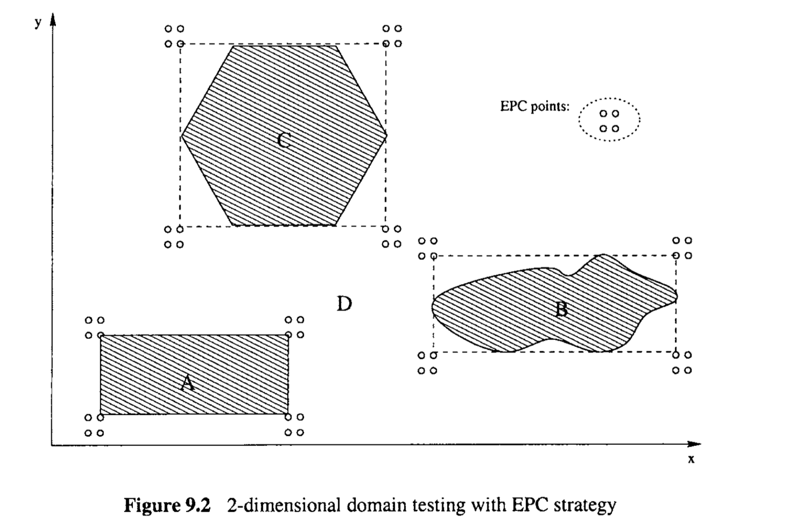
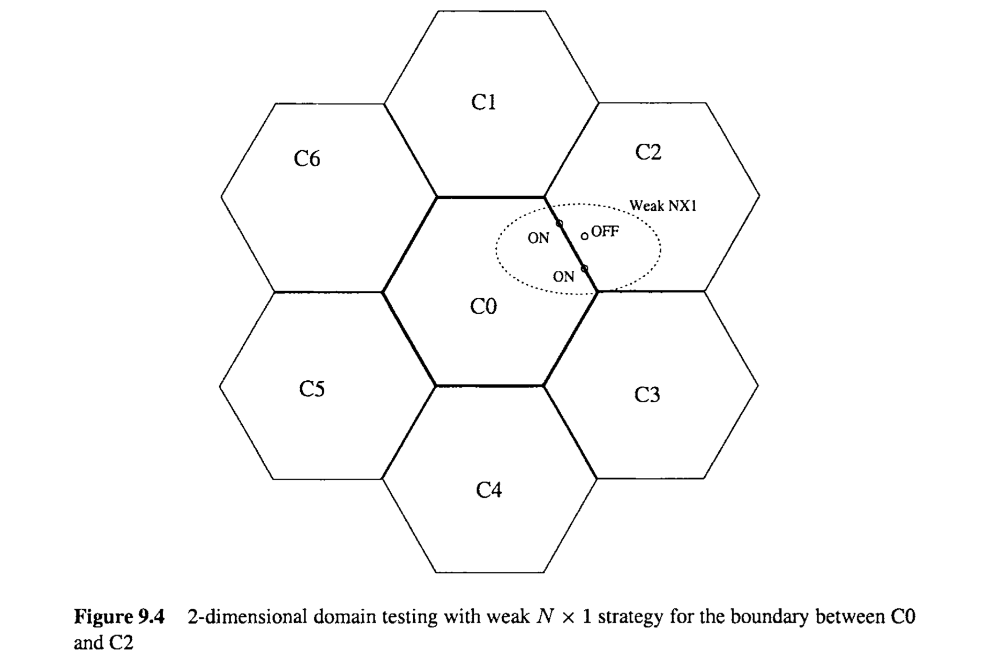
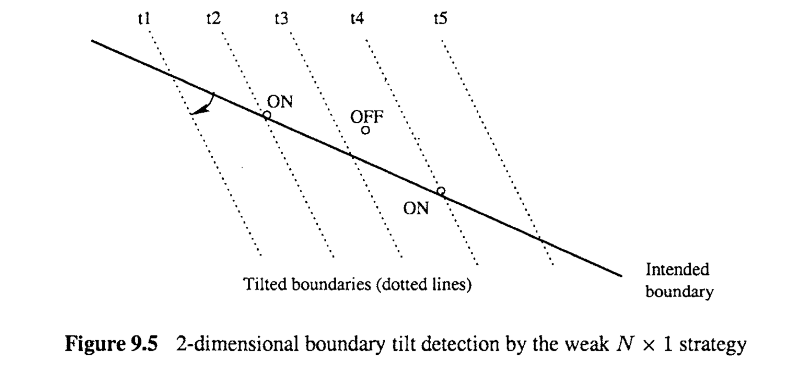
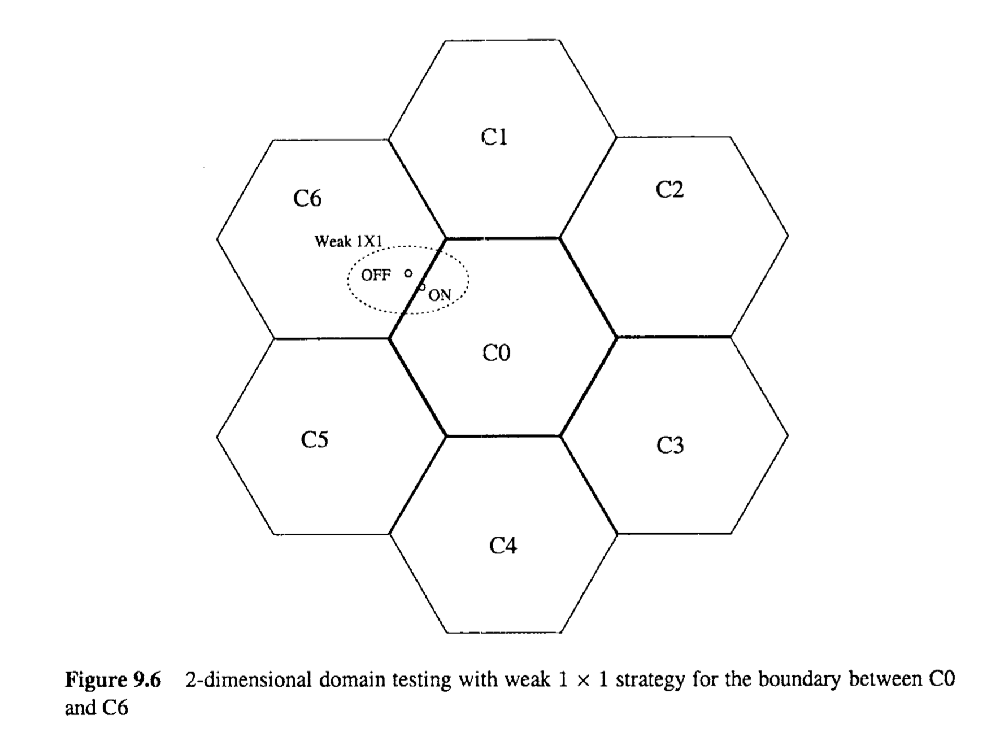
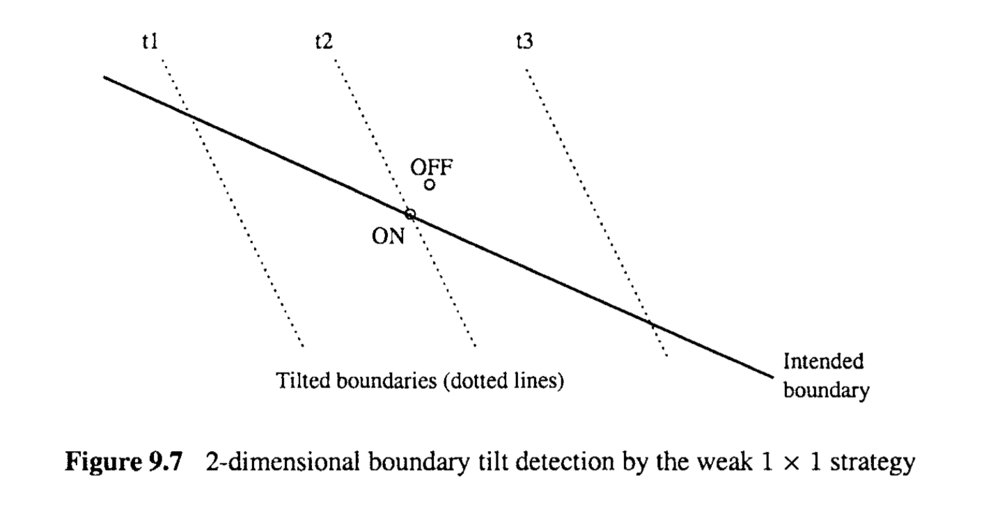

# Chapter 9 Input Domain Partitioning and Boundary Testing

One of the most important areas where partition-based testing has made a strong impact is domain testing or input domain testing (White and Cohen, 1980; Clarke et al., 1982; Jeng and Weyuker, 1994; Beizer, 1990). In this chapter, the idea of partition-based testing is applied to partition the overall input domain into sub-domains and to test them accordingly.  However, the simple strategies for sub-domain coverage are found to be inadequate for many situations. This inadequacy is particularly noted in dealing with problems specifying or implementing the sub-domains involving numeric input variables. Many problems are commonly observed at the boundaries, leading us to examine various boundary testing strategies in this chapter, in particular: 

* We first examine possible input domain partitions and related partition coverage testing ideas in Section 9.1. A special type of common problems associated with partitions, the boundary problems, is also discussed therein. 
* Several important boundary testing strategies are described, including extreme point combination (EPC) in Section 9.2, and weak N x 1 and weak 1 x 1 in Section 9.3. 
* We finally extend the above strategies and generalize boundary testing for testing based on other boundary-like situations in Section 9.4. 

All these testing strategies and techniques are based on the same models described in Chapter 8, that is, input domain partitions, but we focus on the related boundary conditions that distinguish one sub-domain from another. As selective or non-uniform testing strategies, boundary testing shares some commonalities with usage-based testing using Musa’s operational profiles (OPs): Sub-domains with more complex boundaries will be tested more in boundary testing, thus reducing the number of boundary problems that are the likely causes for many potential in-field failures; while frequently used functions and components will be tested more under OP-guide statistical testing, thus reducing the chance of failures when the software is used by target customers.

> 基于分区的测试产生强烈影响的最重要领域之一是领域测试或输入域测试(White and Cohen, 1980;Clarke et al.， 1982;Jeng and Weyuker, 1994;贝泽尔,1990)。在本章中，采用基于分区的测试思想，将整个输入域划分为子域，并相应地进行测试。然而，在许多情况下，简单的子域覆盖策略是不够的。在处理涉及数字输入变量的子域的指定或实现问题时，特别注意到这种不足。在边界上经常观察到许多问题，这导致我们在本章中研究各种边界测试策略，特别是:
>
> * 我们首先在9.1节检查可能的输入域分区和相关的分区覆盖测试思想。其中还讨论了与分区有关的一类特殊问题，即边界问题。
> * 描述了几种重要的边界测试策略，包括9.2节中的极值点组合(EPC)和9.3节中的弱N x 1和弱1 x 1。
> * 我们最后扩展了上述策略，并在9.4节中推广了基于其他类边界情况的测试的边界测试。
>
> 所有这些测试策略和技术都基于第8章中描述的相同模型，即输入域划分，但是我们关注的是区分子域和子域的相关边界条件。作为选择性或非统一的测试策略，边界测试与使用Musa的操作概况(OPs)的基于使用的测试有一些共同点:边界测试中对边界更复杂的子域进行了更多的测试，从而减少了可能导致许多潜在现场故障的边界问题的数量;而经常使用的功能和组件将更多地在OP-guide统计测试下进行测试，从而减少目标客户使用软件时出现故障的机会。

## 9.1 INPUT DOMAIN PARTITIONING AND TESTING

We next examine the partitioning of the overall input domain into sub-domains, the associated boundaries, and the general idea of input domain testing.

> 输入域划分和测试
>
> 接下来，我们将研究将整个输入域划分为子域、相关边界以及输入域测试的一般思想。

### 9.1.1 Basic concepts, definitions, and terminology

The basic idea of domain testing is to generate test cases by assigning specific values to input variables based on some analyses of the input domain. This analysis is called domain analysis, or input domain analysis. By doing so, we hope to avoid exhaustive coverage of all the possible input variable value combinations by sampling a small number of input values or test points to systematically cover different input situations. There are several important characteristics for this testing technique: 

> 领域测试的基本思想是基于对输入领域的一些分析，通过为输入变量分配特定的值来生成测试用例。这种分析称为域分析，或输入域分析。通过这样做，我们希望通过采样少量的输入值或测试点来系统地覆盖不同的输入情况，从而避免穷尽地覆盖所有可能的输入变量值组合。这种测试技术有几个重要的特点:

* It tests I/O (input/output) relations by providing input values associated with all the individual input variables. 

* The output variable values are not explicitly specified. But, we assume that there are ways to check if the expected output is obtained for any given input. 

* Although the technique is black-box in nature, by focusing on the UO relations, the internal implementation details can be used to analyze the input variables and the input domain. Therefore, the technique can be classified either as white-box or black-box, depending on whether the implementation information is used in analysis and modeling. 

> * 它通过提供与所有单个输入变量相关联的输入值来测试I/O(输入/输出)关系。
>
> * 输出变量值没有明确指定。但是，我们假设有一些方法可以检查对于任何给定的输入是否获得预期的输出。
>
> * 虽然该技术本质上是黑盒的，但通过关注I/O关系，内部实现细节可以用来分析输入变量和输入域。因此，根据在分析和建模中是否使用实现信息，该技术可以被分类为白盒或黑盒。

Before we describe any specific domain testing techniques or strategies, several basic definitions are needed, as described below: 

* Let $x_1, x_2, ..., x_n$, denote the input variables. Then these n variables form an ndimensional space that we call input space. Each of these variables corresponds to a single data item in a program or an input to the program that can be assigned a value. They include both program variables as well as some constants. On the other hand, compound data structures, such as arrays, used as program input might need to be represented by multiple input variables. 

* The input space can be represented by a vector X ,  we call input vector, where $X = [x_1, x_2, ..., x_n]$.

* When the input vector X takes a specific value, that is, each of its elements $x_1, x_2, ..., x_n$​ ,  is assigned a specific value, we call it a test point or a test case, which corresponds to a point in the n-dimensional input space.

* The input domain consists of all the points representing all the allowable input combinations specified for the program in the product specification.

* An input sub-domain is a subset of the input domain. In general, a sub-domain can be defined by a set of inequalities in the form of
  $$
  f(x_1, x_2, ... ,x_n) < K_1
  $$
  where “<” can also be replaced by other relational operators such as “>”, “=”, “$\ne$”, "$\leq$" or "$\ge$​".

* A domain partition, or input domain partition, is a partition of the input domain into a number of sub-domains. That is, these sub-domains are mutually exclusive and collectively exhaustive.

* A boundary is where two sub-domains meet. When inequalities are used to define sub-domains as above, the following equation would give us a specific boundary:
  $$
  f(x_1, x_2, ..., x_n) = K
  $$
  
* A boundary is a linear boundary if it is defined by:
  $$
  a_1x_1+a_2x_2+...+a_nx_n = K
  $$
  Otherwise, it is called a nonlinear boundary. If a sub-domain whose boundaries are all linear ones, it is called a linear sub-domain. In describing all the input domain testing strategies, we will restrict ourselves to linear sub-domains first before dealing with the complicated nonlinear boundaries and sub-domains in Section 9.4.

* A point on a boundary is called a boundary point. 

* A boundary is a closed one with respect to a specific sub-domain if all the boundary points belong to the sub-domain. 

* A boundary is an open one with respect to a specific sub-domain if none of the boundary points belong to the sub-domain. 

* A sub-domain with all open boundaries is called an open sub-domain; one with all closed boundaries is called a closed sub-domain; otherwise it is a mixed sub-domain. 

* A point belonging to a sub-domain but not on the boundary is called an interiorpoint. The opposite is an exterior point, that is, not belonging to a sub-domain and not on its boundary. 

* A point where two or more boundaries intersect is called a vertex point.

Corresponding to these terms and definitions for the input, we can define output variable, space, vector, point, range (corresponding to input domain), etc. Since the output is only implicitly specified in most domain testing strategies, we omit the corresponding definitions.

> 在我们描述任何特定的领域测试技术或策略之前，需要几个基本的定义，如下所述: 
>
> * 设$x_1, x_2, ..., x_n$，表示输入变量。这n个变量组成了一个n维空间我们称之为输入空间。这些变量中的每一个都对应于程序中的单个数据项或可赋值的程序输入。它们既包括程序变量，也包括一些常量。另一方面，作为程序输入的复合数据结构(如数组)可能需要用多个输入变量表示。 
>
> * 输入空间可以用一个向量X来表示，我们称之为输入向量，其中$X = [x_1, x_2, ..., x_n]$。
>
> * 当输入向量X取一个特定的值，即它的每个元素$x_1, x_2, ..., x_n$被赋一个特定的值时，我们称之为测试点或测试用例，它对应于n维输入空间中的一个点。
>
> * 输入域由产品规格中为程序指定的所有允许输入组合的所有点组成。
>
> * 输入子域是输入域的子集。一般来说，子域可以用一组不等式来定义，形式为
>
> $$
> f(x_1, x_2, ... ,x_n) < K_1
> $$
> 其中“<”也可以用其他关系运算符代替，如“>”、“=”、“$\ne$”、“$\leq$”或“$\ge$”。
>
> * 域分区，或输入域分区，是将输入域划分为若干子域。也就是说，这些子域是相互排斥的，并且总体上是详尽的。
>
> * 边界是两个子域的交汇处。当使用上述不等式来定义子域时，下式给出了一个具体的边界:
>
> $$
>   f(x_1, x_2, ..., x_n) = K
> $$
>
> * 一个边界是线性边界，如果它被定义为:
>
> $$
>   a_1x_1+a_2x_2+...+a_nx_n = K
> $$
> 否则称为非线性边界。如果一个子域的边界都是线性的，则称为线性子域。在描述所有的输入域测试策略时，在处理9.4节中复杂的非线性边界和子域之前，我们将首先将自己限制在线性子域。
>
> * 边界上的点称为边界点。 
>
> * 如果所有边界点都属于某一特定子域，则该边界是该子域的封闭边界。 
>
> * 如果边界点都不属于某一特定子域，则该子域为开放边界。 
>
> * 具有所有开放边界的子域称为开放子域;边界全部闭合的子域称为闭合子域;否则，它是一个混合子域。 
>
> * 属于子域但不在边界上的点称为内点。相反的是外部点，即不属于子域，也不在子域的边界上。 
>
> * 两个或多个边界相交的点称为顶点。
>
> 对应于输入的这些术语和定义，我们可以定义输出变量、空间、向量、点、范围(对应于输入域)等。由于输出在大多数领域测试策略中只是隐式指定的，因此我们省略了相应的定义。

### 9.1.2 Input domain testing for partition and boundary problems

With the above definitions, we can restate the general idea of domain testing as trying to achieve domain coverage, through the following steps: 

1. Identifying the input variable, input vector, input space, and define the input domain based on specifications (black-box view) or implementation details (white-box view) for the program unit under testing. 

2. Dividing or classifying the input domain into sub-domains to form a partition. 
3. Performing domain analysis for each sub-domain to examine its limits in each dimension and its boundary properties, such as the specific boundary definitions and the related closure properties. 
4. Selecting test points to cover these partitioned sub-domains based on domain analysis results from the previous step. 
5. Testing with the above selected test points as input, checking the results (output values), dealing with observed problems, and carrying out analysis and follow-up activities. 

Notice that there is not much variability in the first two steps, because the input and partitions are generally determined by the external specifications or internal implementation details for the program unit under testing. The last step is also a standard step similar to any other forms of testing. Therefore, the specific variations of domain testing depend on how this third step is carried out. That is, how specific test points are selected defines a specific domain testing strategy. 

The simplest strategy is to sample one test point from inside each sub-domain in the partition, thus achieving complete coverage of all the sub-domains. This is exactly the same as partition coverage testing we described in the previous chapter. However, there is empirical evidence that problems with input domain partitions most commonly occur at sub-domain boundaries. Therefore, some specialized testing techniques are called for to deal with such problems, as we describe in the rest of this chapter. We next examine the common problems associated with input domain partitions to set the stage to develop appropriate testing techniques to deal with these problems.

> 9.1.2 分区和边界问题的输入域测试
>
> 根据上面的定义，我们可以通过以下步骤重申域测试的一般思想，即
>
> 1. 试图实现域覆盖:识别输入变量、输入向量、输入空间，并根据测试中的程序单元的规范(黑盒视图)或实现细节(白盒视图)定义输入域。
>
> 2. 将输入域划分或分类为子域，形成分区。
> 3. 对每个子领域进行领域分析，检查其在每个维度上的限制及其边界属性，例如特定的边界定义和相关的闭包属性。
> 4. 根据上一步的域分析结果，选择测试点来覆盖这些划分的子域。
> 5. 以上述选定的测试点作为输入进行测试，检查结果(输出值)，处理观察到的问题，并进行分析和跟踪活动。
>
> 注意，在前两个步骤中没有太多的可变性，因为输入和划分通常是由测试中的程序单元的外部规范或内部实现细节决定的。最后一步也是类似于任何其他形式的测试的标准步骤。因此，领域测试的具体变化取决于第三步是如何执行的。也就是说，如何选择特定的测试点定义了特定的领域测试策略。
>
> 最简单的策略是从分区中的每个子域内采样一个测试点，从而实现对所有子域的完全覆盖。这与我们在前一章中描述的分区覆盖率测试完全相同。然而，有经验证据表明，输入域划分的问题最常发生在子域边界。因此，需要一些专门的测试技术来处理这些问题，正如我们在本章的其余部分所描述的那样。接下来，我们将研究与输入域分区相关的常见问题，为开发适当的测试技术来处理这些问题奠定基础。

**General problems with input domain partitions**

In general, the problems in the computation or information processing for a given input can generally fall into two categories: 

* Ambiguity or under-defined processing for some given input: Some input values or test points in the input domain cannot be handled by the program unit under testing. In other words, these test points are under-defined, because we cannot find a solution for them. The most common situations for this kind of problem to occur are when computational procedures are defined for individual sub-domains, but these subdomains do not cover the complete input domain, thus creating ambiguity for some input. The practitioners often refer to this as having “holes” in the input domain.

* Contradiction or over-defined processing for some given input: In contrast to the above, some input values or test points have contradictory computations associated 
* with them, or are over-defined. Most of such cases indicate problems in the product specification or in the implementation, which result in different output for the same input or the system behaves incorrectly, such as fail to stop computation because it cannot resolve the conflicting results. The most common situations for this kind of problems to occur is when computational procedures are defined for individual sub-domains, but some of these subdomains overlap with one another, thus causing contradictions. 

It has been observed both by practitioners and researchers that the above problems are most likely to happen at boundaries as discussed below.

> **输入域分区的一般问题**
>
> 一般来说，给定输入的计算或信息处理中的问题通常可以分为两类:
>
> * 对某些给定输入的歧义或未定义的处理: 输入域中的某些输入值或测试点不能由正在测试的程序单元处理。换句话说，这些测试点是未定义的，因为我们无法为它们找到解决方案。这类问题最常见的情况是，为单个子域定义了计算过程，但这些子域没有涵盖完整的输入域，因此对某些输入产生了歧义。从业者通常将其称为输入域中存在“漏洞”。
>
> * 对某些给定输入的矛盾或过度定义的处理: 与上述相反，某些输入值或测试点具有相关联的矛盾计算
> * 与它们一起，或者被过度定义。大多数情况表明产品规范或实现中存在问题，导致相同输入的输出不同，或者系统行为不正确，例如无法停止计算，因为它无法解决冲突的结果。这类问题最常见的情况是，为单个子域定义了计算过程，但其中一些子域相互重叠，从而导致矛盾。
>
> 从业人员和研究人员都观察到，上述问题最可能发生在如下所述的边界处。

**Boundary problems**

Several specific manifestations of input domain partition problems on the boundaries between different sub-domains include the following: 

* Closureproblem, that is, the problem with whether the boundary points belong to this sub-domain under consideration. A closure problem would be an implementation that disagrees with the specification, or the specification that disagrees with the intention. For example, an intended open boundary is specified or implemented as a closed one. 

* Boundary shift: This problem refers to the disagreement with where exactly a boundary is between the intended and the actual boundary. In the form of boundary specifications, 
  $$
  f(x_1, x_2, ... , x_n) = K
  $$
  a (small) change in K is associated with a boundary shift. 

* Other boundary changes are possible too, if the boundary equation 
  $$
  f(x_1, x_2, ... , x_n) = K
  $$
  

  is changed. One common such change is called boundary tilt, when some parameters in the equation are changed slightly. 

* Missing boundary: If a boundary is missing, that means the two neighboring subdomains will collapse into one subdomain, or into one equivalent class. Therefore, all points in them would receive the same treatment or processing. 

* Extra boundary: If there is an extra boundary within a sub-domain, the sub-domain has been further partitioned and different points would receive different treatments because they belong to different equivalent classes. 

To deal with such problems, various specific domain testing strategies can be used to focus on testing related to the sub-domain boundaries, resulting in the so-called boundary testing strategies. Notice that we assume the existence of “intended” or correct partitions andor boundaries in discussing both partition and boundary problems above. The actual specification (black-box view) or implementation (white-box view) of these intended partitions or boundaries may contain some mistakes. With the above assumption, the result checking for testing can be done by using the intended partitions or boundaries as oracles. In addition, the differences or discrepancies between the intended and actual partitions or boundaries represent problems that need to be detected and corrected.

The specification problems can usually be detected through input-domain and boundary analysis, and the implementation problems can be detected through input-domain and boundary testing. Because such testing typically involves analysis as the first step, we refer to both the analysis and testing simply as input domain and boundary testing in subsequent discussions.

## 9.2 SIMPLE DOMAIN ANALYSIS AND THE EXTREME POINT COMBINATION STRATEGY

Extreme-point combination (EPC) is one of the oldest domain testing strategies that are still used by people and supported by some testing tools. We first examine this strategy based on simple domain analysis in this section. 

The idea of EPC is fairly simple and similar to the idea of capacity testing, stress testing, or robustness testing commonly performed for many systems (DeMillo et al., 1987; Myers, 1979). At extreme input values, system capacities or some other limits might be contested.  Therefore, the logic goes that testing for such extreme values would help reveal system design and implementation problems. In addition, when we attempt such extreme values, we are pushing theenvelope to exceed the limits and observing how the system behaves. This is also related to robust design principle commonly recommended for highly-dependable systems (Leveson, 1995), where system dependability or safety needs to be assured even if it is subjected to unexpected input or environments. 

The systematic definition and usage of such extreme values when multiple variables are involved give us the so-called extreme-point (or extreme-value) combination (EPC) strategy. This strategy can be summarized in the following steps: 

* A set of test points is associated with each sub-domain. 
* For each sub-domain, a simple domain analysis is carried out to identify the domain limits in each dimension. That is, we need to find out, for each variable $x_i$  the maximal, “$max_i$”, and minimal, “$min_i$”, values for this sub-domain. In addition, we would like to stretch these values to test the limits, in an attempt to test the boundaries. We define the values “$under_i$”, to be slightly under “mini”, and “$over_i$”, to be slightly over “$max_i$”. 
* Produce all the possible combinations of input with each of its variables $x_i$ taking on one of the four values defined above, “$under_i$”, “$min_i$”, “maxi”, and “$over_i$”. Each of these combinations will be a test case or a test point in this n-dimensional space. Therefore the number of test cases would be $4^n + 1$, with $4^n$ defined here by the cross product of those four values for each dimension, plus 1 for sampling inside the sub-domain as in the simple domain coverage strategy above. 

We next illustrate this strategy through some examples and evaluate its effectiveness.

> 极点组合（Extreme-point Combination, EPC）是最古老的领域测试策略之一，至今仍被人们使用，并得到一些测试工具的支持。在本节中，我们首先基于简单的领域分析来检查这一策略。
>
> EPC的想法非常简单，与许多系统常进行的容量测试、压力测试或鲁棒性测试的想法类似（DeMillo等，1987年；Myers，1979年）。在极端输入值时，系统容量或其他一些限制可能会受到挑战。因此，逻辑上认为，测试这种极端值将有助于揭示系统设计和实现问题。此外，当我们尝试这些极端值时，我们正在推动包络超出限制并观察系统的行为。这也与常为高可靠系统推荐的鲁棒设计原则相关（Leveson，1995年），即使系统遭受意外输入或环境，也需要确保系统的可靠性或安全性。
>
> 当涉及多个变量时，这种极端值的系统性定义和使用给我们带来了所谓的极点（或极值）组合（EPC）策略。这个策略可以总结为以下几步：
>
> - 每个子域都关联一组测试点。
> - 对每个子域进行简单的领域分析，以确定每个维度的域限制。也就是说，我们需要找出每个变量$x_i$在这个子域中的最大值“$max_i$”和最小值“$min_i$”。此外，我们希望拉伸这些值以测试限制，尝试测试边界。我们定义值“$under_i$”，为“$min_i$”略低的值，和“$over_i$”，为“$max_i$”略高的值。
> - 生成所有可能的输入组合，其中每个变量$x_i$取上述四个定义的值之一，“$under_i$”、“$min_i$”、“$max_i$”和“$over_i$”。这些组合中的每一个都将是这个n维空间中的一个测试用例或测试点。因此，测试用例的数量将是$4^n + 1$，其中$4^n$由这些四个值在每个维度的交叉乘积定义，加1表示在子域内采样，如上面的简单域覆盖策略所述。
>
> 接下来，我们通过一些例子来说明这个策略，并评估其有效性。

**EPC for 1-dimensional sub-domains**

When the input only consists of a single variable, that is, in a l-dimensional input space, we can directly use the four values, “under”, “min”, “max”, and “over”, and an interior point for testing. For example, for an input sub-domain, $0\leq x < 21$, the test points according to this EPC would be: $-1, 0, 10, 21, \text{and } 22$, if we are testing integers. The interior point is

arbitrarily selected at $x = 10$, and the “under” and “over” points are 1 under or 1 over. If we go beyond integers, the choice of “under” and “over” will be somewhat problematic. We will deal with it later in connection with other testing strategies. This example can be illustrated graphically in Figure 9.1.

To evaluate this testing strategy, we can consider the handling of the common problems with sub-domains and boundaries we described in Section 9.1, as follows:

* Closure problem: In this example, the lower bound is a closed one and the upper bound is an open one, because $x = 0$ belongs to the sub-domain $\{0 \leq x < 21 \}$  ,  but not $x = 21$.  In fact, we specify such 1-dimensional sub-domain as $[0, 21)$ in mathematics, using “[” and ‘‘I” for closed boundaries and “(” and “)” for open boundaries. If there is a closure problem with the lower bound, the test point “min”, or $x = 0$, would catch it: If it was implemented as an open boundary, it would be treated differently than points within the sub-domain, leading to the detection of this closure problem. Similarly, the closure problem with the upper bound can be caught by the test point “max”. 
* Boundary shift: With the sub-domain $[0, 21)$, if we implemented $[1, 20)$, we have a right boundary shift for the lower bound, and a left boundary shift for the upper bound. In this case, the pair of test points “min” ($x = 0$) and “under” ( $x = -1$) would detect the problem, because. the right-shift of the lower bound would mean the $x= 0$ will now be treated as an exterior point. At the upper end, the boundary shift to the left would not be detected, because both before and after the shift, both “max” and “over” will be treated as exterior points. Therefore, we can see that some boundary shift problems can be detected by EPC, but not others. 
* Missing boundary: In this example, if the lower boundary is missing in $[0,21)$, then the point $x = -1$ (under) would be treated as an interior point, thus detecting the problem. Similarly, if the upper boundary is missing, then both $x = 21$ (max) and $ x = 22$ (over) would be treated as interior points, thus detecting the problem. 
* Extra boundary: In this example, depending on where the extra boundary is, we may or may not be able to detect it with EPC. For example, if the extra boundary is at $x = 5$, then the test points $x =0$ (min) and $x = 10$ (Interior) would receive different processing, and thus detecting the extra boundary problem. However, if the extra boundary is at $x = 15$, there is no way EPC can detect it, because all the 5 test points still receive the same treatment as if no extra boundary is there.

From this example, we can see that EPC can consistently detect closure and missing boundary problems for the single input situations; but cannot consistently detect boundary shift or extra boundary problems.

> 
> 对于一维子域的EPC：
>
> 当输入仅由单个变量组成，即在一维输入空间中，我们可以直接使用四个值，“under”、“min”、“max”和“over”，以及一个内部点进行测试。例如，对于一个输入子域$0 \leq x < 21$，如果我们测试整数，根据EPC的这些测试点将是：$-1, 0, 10, 21, \text{和} 22$。内部点随意选在$x = 10$，而“under”和“over”点分别是1下或1上。如果我们超出整数范围，“under”和“over”的选择将有些问题。我们将在后面与其他测试策略相关的部分中处理这个问题。这个例子可以在图9.1中用图形方式说明。
>
> 为了评估这种测试策略，我们可以考虑如下对我们在9.1节描述的子域和边界的常见问题的处理：
>
> - 封闭问题：在这个例子中，下界是一个封闭的，而上界是一个开放的，因为$x = 0$属于子域${0 \leq x < 21}$，但$x = 21$不属于。实际上，我们用数学表示这种一维子域为$[0, 21)$，使用“[”和“)”表示封闭边界，“(”和“)”表示开放边界。如果下界有封闭问题，“min”测试点，或$x = 0$，会捕捉到它：如果它被实现为一个开放边界，它会与子域内的点不同地被处理，从而检测到这个封闭问题。同样，上界的封闭问题可以通过“max”测试点捕捉到。
> - 边界移位：对于子域$[0, 21)$，如果我们实现了$[1, 20)$，我们有下界的右边界移位，和上界的左边界移位。在这种情况下，“min”（$x = 0$）和“under”（$x = -1$）的测试点对会检测到问题，因为下界的右移意味着$x= 0$现在将被视为外部点。在上端，左边界的移位不会被检测到，因为无论移位前后，“max”和“over”都将被视为外部点。因此，我们可以看到一些边界移位问题可以通过EPC检测到，但其他问题则不能。
> - 缺失边界：在这个例子中，如果下界在$[0,21)$中缺失，那么点$x = -1$（under）会被视为内部点，从而检测到问题。类似地，如果上界缺失，那么$x = 21$（max）和$x = 22$（over）都会被视为内部点，从而检测到问题。
> - 额外边界：在这个例子中，根据额外边界的位置，我们可能能也可能不能使用EPC检测到它。例如，如果额外边界在$x = 5$，那么测试点$x = 0$（min）和$x = 10$（内部）会接受不同的处理，从而检测到额外边界问题。然而，如果额外边界在$x = 15$，EPC就无法检测到它，因为所有5个测试点仍然接受同样的处理，就好像没有额外边界一样。
>
> 从这个例子中，我们可以看到EPC可以一致地检测到单输入情况下的封闭和缺失边界问题；但不能一致地检测到边界移位或额外边界问题。

**EPC for higher dimension sub-domains**

For n-dimensional sub-domains, the combination of extreme points for individual dimensions will come into play when EPC strategy is used. We use 2-dimensional examples below to illustrate the effect of such combinations. Consider the three sub-domains in Figure 9.2: 

* A, the shaded rectangular region; 
* B, the shaded irregular region; 
* C, the shaded hexagon, which is often used to depict the coverage area for a cell-phone transmission tower (Garg, 1999); 
* D, the rest of the 2-d space not belonging to either A, B, or C. 

The 16 EPC test points each for A, B, and C are also illustrated in Figure 9.2. However, we have difficulties with the 16 EPC points for D, because it goes from --oc) to +m in both its z and y dimensions. In fact, EPC would not be applicable to sub-domains like D. The interior points are omitted because their choices are obvious. The effectiveness of EPC for sub-domains A, B, and C can be evaluated as follows: 

* TheEPC test points for region A test around the vertex points, which may include more complex logic to combine the multiple boundaries. The effectiveness in detecting common domain boundary problems would be similar to that for the l-dimensional example above but would involve more complex analysis because of the multiple boundaries involved at these vertex points. 
* The EPC points for regions B and C are totally unrelated to any of the boundaries, and are all exterior points to B and C. Therefore, they are completely useless in detecting boundary problems. 

In fact, this example, particularly regions B, C, and D, illustrates the shortcomings of EPC strategy. Alternative strategies, such as those we described next, are needed.

> 对于多维子域，当使用极点组合（EPC）策略时，将涉及到对各个维度极点的组合。我们使用以下二维示例来说明这种组合的效果。考虑图9.2中的三个子域：
>
> - A，阴影的矩形区域；
> - B，阴影的不规则区域；
> - C，阴影的六边形，常用于表示手机传输塔的覆盖区域（Garg，1999）；
> - D，不属于A、B或C的其余二维空间部分。
>
> 对于A、B和C，图9.2还展示了16个EPC测试点。然而，对于D，我们在确定16个EPC点时遇到了困难，因为它在其z和y维度上都从--无穷大到+无穷大。实际上，EPC不适用于像D这样的子域。内部点被省略了，因为它们的选择是显而易见的。对于子域A、B和C，EPC的有效性可以如下评估：
>
> - 对于A区域的EPC测试点围绕顶点进行测试，这可能包括更复杂的逻辑以组合多个边界。在检测常见的域边界问题方面的有效性类似于上述一维示例，但由于这些顶点涉及多个边界，因此会涉及更复杂的分析。
> - 对于B和C区域的EPC点完全与任何边界无关，且全部是B和C的外部点。因此，在检测边界问题方面完全无效。
>
> 实际上，特别是B、C和D区域的这个示例，展示了EPC策略的局限性。需要其他策略，比如我们接下来描述的那些。

## 9.3 TESTING STRATEGIES BASED ON BOUNDARY ANALYSIS

The EPC strategy described above is simple but may miss the boundaries entirely. Alternatively, we can directly work with the boundaries and the related boundary conditions to derive our testing strategy, as described below.

> 9.3基于边界分析的测试策略
>
> 上面描述的EPC策略很简单，但可能完全忽略了边界。或者，我们可以直接使用边界和相关的边界条件来推导我们的测试策略，如下所述。

### 9.3.1 Weak N X 1 strategy

This strategy is called weak N x 1 (Cohen, 1978; White and Cohen, 1980), because it uses n ON points and 1 OFF points to be defined below for each boundary. The term “weak” is used to indicate that one set of test points is associated with each boundary instead of a boundary segment as in “strong” domain testing strategies that we will describe later in Section 9.4

#### **Basic ideas to detect boundary shift problems**

In an n-dimensional space, a boundary defined by an equation in the form of 
$$
f(x_1, x_2, ..., x_n) = K
$$
would need n linearly independent points to define it. Therefore, we can select n such boundary points to precisely define the boundary. Any change in boundary would result in some or all of these points no longer on the boundary. We call these boundary points “ON’ points, simply because they are on the boundary. 

Once these ON points are defined, we need to compare them against a point that receives different processing what we call an “OFF” point. In an open boundary, all the ON points receive exterior processing. Therefore, we would like to select an interior point as our OFF point close to the boundary that receives interior processing. The idea is to pick the OFF point so close to the boundary that any small amount of boundary shift inward would move past this point, thus making the movement detectable. Problem detection is achieved because this interior point will receive exterior processing after the move. If the boundary moves outward, the ON points would detect the movement because all of them would be receiving interior processing after the move. Therefore, this set of test points would detect boundary shift problems. 

For a closed boundary, we would like to select an exterior point close to the boundary as our OFF to detect boundary shifts. It mirrors the above situation with open boundaries: Any movement inward would be caught by the ON points because now they will receive exterior processing instead of interior one as specified; and any movement outward would be caught by the OFF point because it will receive interior processing instead of exterior one as specified.

> **3.1 弱N X 1策略**
>
> 这种策略被称为弱N x 1（Cohen, 1978; White和Cohen, 1980），因为它对每个边界使用n个ON点和1个OFF点来定义。术语“弱”是用来指示与每个边界而不是像我们将在第9.4节后面描述的“强”域测试策略中的边界段关联的一组测试点。
>
> **检测边界移动问题的基本思想**
>
> 在n维空间中，由方程
> $$
> f(x_1, x_2, ..., x_n) = K
> $$
> 定义的边界需要n个线性独立的点来定义它。因此，我们可以选择n个这样的边界点来精确定义边界。任何边界的变化将导致这些点中的一些或全部不再位于边界上。我们称这些边界点为“ON”点，仅仅因为它们位于边界上。
>
> 一旦这些ON点被定义，我们需要将它们与接受不同处理的点进行比较，我们称之为“OFF”点。在开放边界中，所有的ON点接受外部处理。因此，我们希望选择一个内部点作为我们的OFF点，它靠近边界并接受内部处理。这个想法是选择OFF点靠近边界，以至于任何小的边界向内移动都会超过这个点，从而使移动可检测。问题检测是因为这个内部点在移动后会接受外部处理。如果边界向外移动，ON点将检测到移动，因为所有这些点在移动后都会接受内部处理。因此，这组测试点将检测边界移动问题。
>
> 对于闭合边界，我们希望选择一个靠近边界的外部点作为我们的OFF点来检测边界移动。它反映了上述开放边界的情况：任何向内的移动都会被ON点捕获，因为现在它们将接受外部处理而不是指定的内部处理；任何向外的移动都会被OFF点捕获，因为它将接受内部处理而不是指定的外部处理。

#### **Weak N X 1 strategy: Formal definitions**

One practical problem that is key to this strategy is the selection of one OFF point for each boundary and its distance to the boundary. The general recommendation is that this distance, $\epsilon = 1$ ,  should be small, so that any small movement would result in a change in distance that is larger than $\epsilon $.  In practical applications, this should be set to the numerical precision of the data type used. For example, for integers, $\epsilon = 1$; while for numbers with n binary digits after the decimal point, $\epsilon = \frac{1}{2^n}$. With the above choice of ON and OFF points and definition of E distance, we can detect boundary shift problems in the weak N x 1 input domain testing strategy (Cohen, 1978; White and Cohen, 1980) summarized below:

* For each sub-domain boundary in a n-dimensional input space, n linearly independent boundary points are selected as the ON points. 

* The OFF point will be “on the open side of boundary” (White and Cohen, 1980), that is, it will always receive different processing than that for the ON points. Therefore, we have two situations: 

  * If the boundary is a closed boundary with respect to the sub-domain under consideration, the OFF point will be outside the sub-domain or be an exterior point. 

  * If the boundary is an open boundary with respect to the sub-domain under consideration, the OFF point will be inside the sub-domain or be an interior point. 

    In either of the above cases, the OFF point will be 6 distance away from the boundary. 

* In general, an interior point is also sampled as the representative of the equivalence class representing all the points in the sub-domain under consideration, resulting in (n + 1) x b + 1 test points for each domain with b boundaries.

> #### **弱N X 1策略：正式定义**
>
> 这个策略的一个关键实际问题是为每个边界选择一个OFF点及其到边界的距离。一般建议是这个距离，$\epsilon = 1$，应该很小，以至于任何小的移动都会导致距离的变化大于$\epsilon$。在实际应用中，这应该设置为使用的数据类型的数值精度。例如，对于整数，$\epsilon = 1$；而对于小数点后有n个二进制位的数字，$\epsilon = \frac{1}{2^n}$。有了上述ON和OFF点的选择以及E距离的定义，我们可以在弱N x 1输入域测试策略中检测边界移动问题（Cohen, 1978; White和Cohen, 1980），下面是总结：
>
> - 对于n维输入空间中的每个子域边界，选择n个线性独立的边界点作为ON点。
>
> - OFF点将位于“边界的开放侧”（White和Cohen, 1980），也就是说，它总是接受与ON点不同的处理。因此，我们有两种情况：
>
>   - 如果边界是相对于所考虑子域的闭合边界，OFF点将位于子域外部或是一个外部点。
>
>   - 如果边界是相对于所考虑子域的开放边界，OFF点将位于子域内部或是一个内部点。
>
>     在上述任何一种情况下，OFF点将距离边界6个距离单位。
>
> - 一般来说，还会抽样一个内部点作为代表所考虑子域中所有点的等价类的代表，每个有b个边界的域结果为(n + 1) x b + 1个测试点。

#### **Weak N X 1 strategy: Other detectable problems**

In addition to the boundary shift problem, other problems can be detected as well, which we describe in general terms here. However, the readers might want to refer to concrete examples given later when examining general descriptions below:

* Closure problems can be easily detected because such problems will be manifested as ON and OFF points receiving the same processing instead of the expected different processing. For an open boundary, the ON points should receive exterior processing while the OFF point should receive interior processing. A closure problem would cause ON points to receive interior processing. For a closed boundary, the ON points should receive interior processing while the OFF point should receive exterior processing. A closure problem would cause ON points to receive exterior processing. 
* Boundary tilt and other boundary changes can be easily detected by the ON and OFF points because any such change would result in some or all the ON points not on the boundary anymore. For each of these ON points falling off the boundary, the part of boundary associated with it is either pushed inward or outward, which can be detected the same way as the boundary shift problem we described above. 
* Missing boundary would be detected by the same processing received by the ON and OFF points as opposed to the different processing expected. 
* Extra boundary would likely be detected by the different processing associated with some of the ON or OFF points for different boundaries. For each boundary, there will be an OFF point or n ON points which receive interior processing. Let’s call these ON or OFF points that receive interior processing “IN’ points. All these IN points as well as the selected interior test point should received the same processing. An extra boundary would likely to cause some of these IN points to receive different processing if it separates them apart. However, there are cases in which this extra boundary will not separate any of these IN points apart, resulting in extra boundary not being detected in these situations. One example of such as an extra boundary is one near a vertex point that is far away from any of the ON, OFF, or the selected interior test points.

Therefore, we can see that weak N x 1 strategy is a fairly effective strategy in dealing with most boundary problems. 

Another practical consideration for the OFF point selection is that it should be “central” to all the ON points for easy comparison. For example, in the two-dimensional space, it should be chosen by: 

1. Choosing the midpoint between the two ON points, 
2. Then moving 6 distance off the boundary, outward or inward for closed or open boundary, respectively.

This selection of ON and OFF points for 2-dimensional sub-domains is illustrated in Figure 9.4. For higher dimensions, this problem becomes more complicated, but the general idea is to still find some kind of center on the boundary among the ON points, and then we can move E distance away to get the OFF point.

> #### **弱N X 1策略：其他可检测的问题**
>
> 除了边界移动问题外，还可以检测到其他问题，我们在这里以一般性术语描述它们。然而，读者可能想在检查下面的一般描述时参考后面给出的具体示例：
>
> - 闭合问题可以很容易地被检测到，因为这样的问题会表现为ON点和OFF点接收相同的处理，而不是预期的不同处理。对于一个开放边界，ON点应该接受外部处理，而OFF点应该接受内部处理。闭合问题会导致ON点接受内部处理。对于一个闭合边界，ON点应该接受内部处理，而OFF点应该接受外部处理。闭合问题会导致ON点接受外部处理。
> - 边界倾斜和其他边界变化可以通过ON点和OFF点轻松检测到，因为任何这样的变化都会导致某些或所有ON点不再位于边界上。对于每个脱离边界的ON点，与之关联的边界部分要么被向内推，要么被向外推，这可以以我们上面描述的边界移动问题相同的方式检测到。
> - 缺失的边界将通过ON点和OFF点接收相同的处理而被检测到，与预期的不同处理相反。
> - 额外的边界可能会被与某些ON点或OFF点的不同处理所检测到，这些点属于不同的边界。对于每个边界，将有一个OFF点或n个ON点接收内部处理。让我们称这些接收内部处理的ON点或OFF点为“IN”点。所有这些IN点以及选定的内部测试点应该接收相同的处理。一个额外的边界可能会导致一些这样的IN点接收不同的处理，如果它将它们分开。然而，在某些情况下，这个额外的边界不会将任何这些IN点分开，导致在这些情况下无法检测到额外的边界。这样一个额外边界的一个例子是一个靠近顶点的边界，它远离任何ON点、OFF点或选定的内部测试点。
>
> 因此，我们可以看到，弱N x 1策略是处理大多数边界问题的一个相当有效的策略。
>
> 对于OFF点选择的另一个实际考虑是，它应该对所有ON点“中心”，以便于比较。例如，在二维空间中，它应该通过以下方式选择：
>
> 1. 选择两个ON点之间的中点，
> 2. 然后向边界外部或内部移动ε距离，分别用于闭合或开放边界。
>
> 这种为二维子域选择ON点和OFF点的方式在图9.4中说明。对于更高维度，这个问题变得更复杂，但一般想法仍然是在ON点之间的边界上找到某种中心，然后我们可以移动ε距离以得到OFF点。

#### Weak N X 1 strategy: Application examples 

To contrast weak N x 1 strategy with EPC strategy, we revisit the same examples. For the l-dimensional example with sub-domain [0, 21), the ON points would be z = 0 and z = 21, and the OFF points would be z = -1 and z = 20, and we can keep the interior point at z = 10. This set of testing points, -1, 0, 10, 20, and 21, is depicted in Figure9.3.  Notice that the only difference in testing point selection with EPC is the OFF point at z = 20 instead of the original “over” point at z = 22. The same upper boundary shift to [ 1, 20) that cannot be detected by EPC can be detected by this OFF point at z = 20, because it now receives exterior processing in violation of the expectation. In fact, if we follow the description above about the weak N x 1 detectable problems, we can conclude the all these problems can be detected. 

The 2-dimensional example for the hexagon in Figure 9.2 is re-examined and illustrated in Figure 9.4. We only illustrated one set of two ON points and one OFF between regions C O  and C2. As mentioned before, such hexagons are often used to depict coverage areas for cell-phone transmission towers. When a mobile user passes from one region to another, a hand-off transaction is processed by the cell-phone communication networks to ensure continued communication for the user. ‘Therefore, the region can be considered a closed sub-domain: A hand-off will not occur unless a user crosses the boundary. In this case, there is a huge superiority of weak N x 1 testing over EPC testing. 

We can also use this 2-dimensional example to illustrate the way weak N x 1 detects boundary tilt problem. Figure 9.5 illustrates the original boundary (solid line) and the tilted boundaries (dotted lines) that tilt clockwise at different points. Then we can consider all the possible tilting points, as below:

* Any tilt outside the segment between these two ON points would make them receive the same processing as the OFF point, as illustrated by tilted boundaries t1 and t5. Therefore, such problems can be detected. 
* Any tilt inside the segment between these two ON points would result in the two ON points receiving different processing, as illustrated by the tilted boundary t3. Therefore, such problems can be detected also.
* Any tilt on one of the ON points would make the other ON point and the OFF point receiving the same processing, as illustrated by tilted boundaries t2 and t4. Therefore, such problems can be detected also.

Notice that $\epsilon$ distance plays a very important role in the above argument: Any tilting towards the OFF point, such as tilted boundaries t4 and t5 in Figure 9.5, would rotate past it.

> #### 弱N X 1策略：应用示例
>
> 为了与EPC策略进行对比，我们重新审视相同的示例。对于一维示例，子域为[0, 21)，ON点将是z = 0和z = 21，OFF点将是z = -1和z = 20，我们可以保持内部点在z = 10。这组测试点，-1, 0, 10, 20和21，在图9.3中描绘。注意，与EPC的测试点选择的唯一区别是z = 20的OFF点，而不是原来的“超出”点在z = 22。同样的上边界移动到[1, 20]，无法被EPC检测到，可以通过z = 20的OFF点检测到，因为它现在接受的外部处理违反了预期。实际上，如果我们遵循上述关于弱N x 1可检测问题的描述，我们可以得出所有这些问题都可以被检测到的结论。
>
> 图9.2中的六边形二维示例被重新审视并在图9.4中描绘。我们只展示了C1和C2区域之间的两个ON点和一个OFF点的一组。如前所述，这样的六边形通常用来表示手机传输塔的覆盖区域。当移动用户从一个区域进入另一个区域时，手机通信网络会处理一个切换事务，以确保用户继续通信。因此，该区域可以被视为一个封闭子域：除非用户越过边界，否则不会发生切换。在这种情况下，弱N x 1测试相对于EPC测试有巨大的优势。
>
> 我们也可以使用这个二维示例来说明弱N x 1检测边界倾斜问题的方式。图9.5展示了原始边界（实线）和在不同点顺时针倾斜的边界（虚线）。然后我们可以考虑所有可能的倾斜点，如下：
>
> - 任何在这两个ON点之间的段外倾斜都会使它们接受与OFF点相同的处理，如倾斜边界t1和t5所示。因此，这样的问题可以被检测到。
> - 任何在这两个ON点之间的段内倾斜都会导致这两个ON点接受不同的处理，如倾斜边界t3所示。因此，这样的问题也可以被检测到。
> - 任何在其中一个ON点上的倾斜都会使另一个ON点和OFF点接受相同的处理，如倾斜边界t2和t4所示。因此，这样的问题也可以被检测到。
>
> 注意，在上述论证中，E距离起着非常重要的作用：任何向OFF点倾斜的倾斜，如图9.5中的倾斜边界t4和t5，都会旋转过去。

#### 9.3.2  Weak 1 X 1 strategy

One of the major drawbacks of weak N x 1 strategy is the number of test points used, (n + 1) x b + 1 for n input variables and b boundaries, although it is significantly less than that for EPC $(4^n + 1)$ when n is large. Therefore, a reduced strategy, called weak 1 x 1 strategy, has been proposed and siuccessfully used in place of weak N x 1 (Jeng and Weyuker, 1994). Weak 1 x 1 strategy uses just one ON point for each boundary, thus reducing the total number of test points to 2b + 1. The choice of the ON and OFF points in the 2-dimensional space was also illustrated in Figure 9.6. In fact, we no longer have the difficulties with the OFF point choice associated with weak N x 1 strategy any more: After we choose the ON point, the OFF point is just E distance from ON point and perpendicular to the boundary. 

However, most of the problems that can be detected by the weak N x 1 strategy can still be detected by the weak 1 x 1 strategy. This can be simply shown by observing that all the n ON points receive the same processing in the closure, shift, and missing boundary problems in the weak N x 1 strategy. Therefore, in detection these problems, one ON point can act as the representative for all the other ON points for the same boundary. Other boundary problems are considered below:

* Extra boundaly: With extra boundary, more ON points would enhance the possibility that the extra boundary would separate them, thus weak N x 1 would have a better ability to detect extra boundaries. 
* Boundaly tilt and other boundary changes: When boundary tilt or general boundary change is concerned, weak N x 1 can always detect the problem, because the n ON points exactly define the boundary. Weak 1 x 1 can detect the problem most of the times, but may occasionally miss some problems. Consider the boundary tilt in Figure 9.7 on the single ON point in weak 1 x 1: the processing received by the ON and OFF points after tilting would be exactly the same as before. Therefore, weak 1 x 1 would miss this boundary tilt. However, if we tilt on any other point, the ON-OFF pair would receive the same processing after the tilt, thus detecting the problem.

Consequently, by moving from weak N x 1 strategy to weak 1 x 1, we significantly reduced the number of test points, without sacrificing much of the problem detection ability. Therefore, weak 1 x 1 should be used in practical applications, unless there is a compelling reason for the other choices.

> 
> 弱N x 1策略的一个主要缺点是使用的测试点数量，对于n个输入变量和b个边界，数量为(n + 1) x b + 1，尽管当n较大时，这个数量显著少于等可能覆盖(EPC)策略的$(4^n + 1)$。因此，提出了一种称为弱1 x 1策略的简化策略，并已成功用于取代弱N x 1策略（Jeng和Weyuker，1994）。弱1 x 1策略仅对每个边界使用一个ON点，从而将总测试点数减少到2b + 1。在二维空间中ON点和OFF点的选择也在图9.6中说明。实际上，我们不再遇到与弱N x 1策略相关的OFF点选择的困难：选择了ON点之后，OFF点就是距ON点E距离并垂直于边界的点。
>
> 然而，大多数可以通过弱N x 1策略检测到的问题仍然可以被弱1 x 1策略检测到。这可以通过观察在弱N x 1策略中所有n个ON点在闭包、移位和缺失边界问题中接收相同处理来简单展示。因此，在检测这些问题时，一个ON点可以作为同一边界的所有其他ON点的代表。以下考虑了其他边界问题：
>
> - 额外边界：对于额外边界，更多的ON点将增加额外边界将它们分开的可能性，因此弱N x 1将具有更好的检测额外边界的能力。
> - 边界倾斜和其他边界变化：当涉及到边界倾斜或一般边界变化时，弱N x 1总是可以检测到问题，因为n个ON点准确地定义了边界。弱1 x 1在大多数情况下可以检测到问题，但偶尔可能会错过一些问题。考虑图9.7中弱1 x 1的单个ON点上的边界倾斜：倾斜后ON点和OFF点接收的处理将与之前完全相同。因此，弱1 x 1会错过这种边界倾斜。然而，如果我们在任何其他点上倾斜，ON-OFF对在倾斜后将接收相同的处理，因此检测到问题。
>
> 因此，通过从弱N x 1策略转移到弱1 x 1策略，我们显著减少了测试点的数量，而没有牺牲太多的问题检测能力。因此，在实际应用中应该使用弱1 x 1策略，除非有其他选择的充分理由。

> 不能理解上述讲了啥 

>
> 弱N x 1策略和弱1 x 1策略是软件测试中用于边界值分析的两种测试策略，它们用于识别程序输入或输出边界附近可能的错误。这两种策略在测试设计中的主要区别在于它们如何选择测试点，即在边界值附近选择的输入值的数量和方式。
>
> ### 弱N x 1策略：
>
> - **定义**：在弱N x 1策略中，对于每一个输入变量，都会选择N个接近每个边界值的测试点，这里的"N"代表每个边界选择的点的数量。换句话说，如果有多个输入变量，每个变量的每个边界都会选取N个测试点。加上一个在所有输入变量的正常值范围内的测试点，所以总共的测试点数量是`(n + 1) x b + 1`，其中n是输入变量的数量，b是每个变量的边界数。
> - **优点**：能够更全面地探测边界附近的错误，因为它在每个边界上测试了多个点。
> - **缺点**：需要的测试点数量多，特别是在输入变量数量较多的情况下，会导致测试成本高昂。
>
> ### 弱1 x 1策略：
>
> - **定义**：在弱1 x 1策略中，只在每个边界选取一个测试点（即每个边界的"ON"点），加上一个正常范围内的测试点，从而显著减少了测试点的总数量。这种策略使得总测试点数减少到`2b + 1`，其中b是边界的总数。
> - **优点**：显著减少了需要的测试点数量，从而降低了测试成本。 
> - **缺点**：可能无法检测到所有的边界相关错误，尤其是那些需要在边界附近多个点检测的问题。
>
> 
>
> ### 例子：
>
> 假设有一个程序，它接受两个输入变量：年龄(age)和收入(income)。年龄的有效输入范围是0到100岁，收入的有效输入范围是0到100000元。
>
> - **弱N x 1策略**：假设N=2，对于年龄的边界值（0和100岁），我们可能选择-1, 1和99, 101作为测试点；对于收入的边界值（0和100000元），我们可能选择-100, 100和99900, 100100作为测试点。这样，对于每个输入变量，我们都有4个测试点，加上一个正常值（比如50岁和50000元），总共有9个测试点。
> - **弱1 x 1策略**：对于每个边界，我们只选择一个测试点，如年龄的0和100岁边界选择0和100，收入的0和100000元边界选择0和100000。加上一个正常值的测试点（比如50岁和50000元），总共只需要5个测试点。
>
> 通过这个例子，我们可以看到弱1 x 1策略相比弱N x 1策略在测试设计时显著减少了测试点的数量，降低了测试的复杂性和成本，但可能牺牲了一定的错误检测全面性。
>
> 这个可能会更好理解点

## 9.4 OTHER BOUNDARY TEST STRATEGIES AND APPLICATIONS

Beside the weak N x 1 and weak 1 x 1 strategies described above, various other boundary testing strategies may be used in different situations to deal with different problems. In addition, the basic idea of boundary testing can be extended beyond basic input sub-domain boundaries to other applications where a logical boundary exists between different information processing needs. We examine these testing strategies and their applications in this section.

> 除了上述的弱N x 1和弱1 x 1策略之外，各种其他边界测试策略可以在不同情况下使用，以处理不同的问题。此外，边界测试的基本思想可以扩展到基本输入子域边界之外的其他应用中，这些应用中存在着不同信息处理需求之间的逻辑边界。我们将在本节中检查这些测试策略及其应用。

### 9.4.1 Strong and approximate strategies

In contrast to the weak boundary testing strategies above, strong boundary testing strategies may be used for various situations, such as when there are boundary inconsistencies.

Common boundary inconsistencies inc1ude:changing closures along the boundary, singular points, or some kind of “holes”. Under such situations, each segment should be treated separately, much like a separate boundary itself. This treatment would require multiple sets of ON and OFF points, one for each segment, resulting in the so-called strong testing strategies, such as strong N x 1 and strong 1 x 1 strategies. 

For nonlinear boundaries, n points are not enough to define the boundary. For example, the boundary for region B in Figure 9.2 would require more than two points to define. Accordingly, we may select many more OPJ points, or approximate the boundary as a series of (linear) line segments, with one set of ON-OFF points for each segment. This latter strategy is in fact a strong testing strategy. Linear approximations can be used to test imprecise or rough boundaries that may occur in various applications. 

Another general extension to boundary testing strategies is to perform vertex testing, because such points are also commonly associated with problems. However, vertex testing would involve more complicated logic and interactions. Therefore, they should generally be done after a regular boundary test.

> 与上述的弱边界测试策略不同，强边界测试策略可用于各种情况，例如当存在边界不一致时。
>
> 常见的边界不一致包括：沿着边界变化的闭包、奇异点或某种“洞”。在这种情况下，每个段应该被单独对待，很像是一个单独的边界本身。这种处理将需要多组ON和OFF点，每个段一个，从而产生所谓的强测试策略，如强N x 1和强1 x 1策略。
>
> 对于非线性边界，n个点不足以定义边界。例如，图9.2中区域B的边界将需要超过两个点来定义。因此，我们可能会选择更多的OPJ点，或者将边界近似为一系列（线性）线段，每个段有一组ON-OFF点。后一种策略实际上是一种强测试策略。线性近似可以用来测试可能出现在各种应用中的不精确或粗糙的边界。
>
> 另一个对边界测试策略的一般扩展是进行顶点测试，因为这些点也通常与问题相关联。然而，顶点测试将涉及更复杂的逻辑和交互。因此，它们通常应该在常规边界测试之后进行。

### 9.4.2 Other types of boundaries and extensions

The primary application domain of boundary testing is the boundary problems related to input domain partitioning into sub-domains. However, various other situations involving boundaries can also benefit from the general idea of boundary testing, primarily because there are typically problems associated with such boundaries and related boundary conditions. Some such particular situations include: 

* Limits or boundaries associated with various compound data structures and their implementations. For example, in array implementations and usage, problems associated with the lower and upper bounds are much more likely than problems associated with other “interior” array elements. Therefore, boundary testing ideas can be used to derive test cases around such data boundaries. We will see a specific example of such an adapted strategy applied to test queues at the end of this section. 
* The ideas can be used for capacity testing, which is usually associated with stress testing for various systems. The upper bound in capacity is typically the focus of capacity testing, which can be plainned and carried out with the help of boundary testing ideas, such as using test cases to test system operations slightly under or over this capacity limit. However, people typically don’t pay much attention to lower bound in capacity, which can be included as part of the systematic boundary testing. 
* There are also other dynamic situations where boundary testing ideas might be applicable. One such situation is the execution of loops, which may be totally bypassed, or going through a number of iterations until some conditions are met or until a predetermined number of iterations has been reached. We will deal with loop testing in Chapter 11 in connection to control flow testing, where boundary testing idea is also used. 
* For some systems, output range partitions might be more meaningful than input domain partitions. For example, in safety critical systems, some output or system variables are monitored and controlled through some input or control variables, such as temperature (output) regulation in boilers or nuclear reactors. In this example, the output or system variable we care about is the temperature. The input or control variables are the heatingkooling system parameters, through the settings for these parameters we can control the heating or cooling processes to regulate the temperature. In such cases, we can apply the input domain partition and boundary testing ideas to output range partition and related boundary testing. But the test sensitization will be more difficult because we are no longer directly working with input variables and their values. These input values need to be derived through control system equations and related analyses. In fact, one of the most important analyses, called hazard analysis, deals with the output partition of system failures that may or may not lead to accidents. Fault-tree analysis and event-tree analysis are used to analyze the system accidents scenarios to derive the preconditions or system input so that the accident can be avoided. These specific analysis techniques for safety critical systems are covered in Chapter 16.

In addition to the above direct adaptations of boundary testing ideas in various other application domains, the general concepts of associating test points with boundaries instead of uniform domain coverage can be extended to usage-based statistical testing. In boundary testing, the number of test points is generally determined by the number of boundaries, the type of boundaries, and the specific testing strategies used. Therefore, sub-domains with more boundaries or with more complicated boundary situations are receiving more attention than those with fewer and simpler boundaries. The rationale behind this uneven distribution of test points and the associated test resources is that those with larger numbers of and more complex boundaries are more likely to have defects or problems. Along the same line, if a sub-domain is used more often, it is more likely to cause more problems to users even if it contains exactly the same number of defects as another sub-domain that is used less often. 
This latter rationale led us to build domain partitions and associated probability of usage as the basis for usage based statistical testing in Chapter 8.

> 
> 边界测试的主要应用领域是与输入域划分为子域相关的边界问题。然而，其他各种涉及边界的情况也可以从边界测试的一般思想中受益，主要是因为这些边界及相关边界条件通常与某些问题相关联。一些特定情况包括：
>
> - 与各种复合数据结构及其实现相关的限制或边界。例如，在数组实现和使用中，与下界和上界相关的问题比与其他“内部”数组元素相关的问题更有可能发生。因此，边界测试的思想可以用来推导出围绕这类数据边界的测试用例。我们将在本节末尾看到一个这样的适应策略的具体例子，用于测试队列。
> - 这些思想可以用于容量测试，通常与各种系统的压力测试相关联。容量的上限通常是容量测试的焦点，可以借助边界测试的思想进行规划和执行，例如使用测试用例测试系统操作在此容量限制略微下方或上方的情况。然而，人们通常不太关注容量的下限，这可以作为系统化边界测试的一部分包含在内。
> - 还有其他动态情况可能适用边界测试的思想。其中一个情况是循环的执行，可能会被完全绕过，或者进行多次迭代，直到满足某些条件或达到预定的迭代次数。我们将在第11章处理循环测试，与控制流测试相关，其中也使用了边界测试的思想。
> - 对于某些系统来说，输出范围划分可能比输入域划分更有意义。例如，在安全关键系统中，一些输出或系统变量通过一些输入或控制变量进行监控和控制，如锅炉或核反应堆中的温度（输出）调节。在这个例子中，我们关心的输出或系统变量是温度。输入或控制变量是加热/冷却系统参数，通过这些参数的设置，我们可以控制加热或冷却过程以调节温度。在这种情况下，我们可以将输入域划分和边界测试的思想应用于输出范围划分和相关的边界测试。但是测试敏感化将更加困难，因为我们不再直接处理输入变量及其值。这些输入值需要通过控制系统方程和相关分析来推导。实际上，一种最重要的分析，称为危害分析，处理可能导致或不导致事故的系统故障的输出划分。故障树分析和事件树分析用于分析系统事故场景，以推导出避免事故的前提条件或系统输入。这些特定的安全关键系统分析技术将在第16章中讨论。
>
> 除了上述在各种其他应用领域直接适应边界测试思想之外，将测试点与边界而不是均匀域覆盖联系起来的一般概念可以扩展到基于使用的统计测试。在边界测试中，测试点的数量通常由边界的数量、边界的类型和使用的具体测试策略决定。因此，边界更多或边界情况更复杂的子域比边界较少且简单的子域受到更多关注。这种不均匀分配测试点和相关测试资源的理由是，边界数量较多且更复杂的地方更有可能存在缺陷或问题。同样的道理，如果一个子域使用得更频繁，即使其包含的缺陷数量与使用较少的另一个子域完全相同，也更有可能给用户带来更多问题。这后一种理由促使我们建立了域划分和作为基于使用的统计测试基础的相关使用概率，在第8章中进行了讨论。

### 9.4.3 Queuing testing as  boundary testing

Queuing testing is primarily associated with the many dynamic situations where queues are involved, such as in store-and-forward strategies commonly used in computer networks and our global information infrastructure such as the Internet and the world wide web (WWW). The classical definition of queues is a special type of data structure where the processing or removal order follows precisely the arrival or inserting order. It has been generalized in many applications to indicate any buffering scheme employed, with some priority scheme to select the next element for processing, as follows:

* Priority or queuing discipline: Most of the selection or service decisions are based on prioritized queuing disciplines, including the classical queue. In the classical queues, earlier arrivals receive higher priorities in the priority scheme commonly referred to as FCFS (first come, first served) or FIFO (first in, first out). Other explicit priorities and mixed priorities are also commonly used. For example, with the use of a few priority classes, items from higher priority classes will take precedence to the ones from lower priority classes, but items within each class are processed in FIFO order. Strictly random or non-prioritized queuing discipline is rarely used.

* Buffer capacity: Because queuing implementation needs some buffer space or queuing space for items to be queued, most queues have either an adjustable or fixed upper bound. In some special cases, theoretically unbounded queues can be implemented by making all the system resources available. In either case, the queues are bounded from below, because we cannot have negative number of elements in the queue. Boundary testing ideas can be easily adapted to test these queue boundaries.

* In addition to the above important characteristics, some other parameters can be specified for queues, including: 

  * Pre-emptive or not: Whether the queue is pre-emptive or not, that is, can an item currently receiving service or being served be pre-emptied to make room for another item of higher priority? 
  * Butching: One common practice is to wait until a batch is full before all the items in the batch are processed. 

  - Synchronization: A special case of batching is synchronization, where some items have to wait for other specific items before they can be processed together.

In what follows, we concentrate on testing prioritized queues without pre-emption or batching. Techniques for synchronization testing are described in Chapter 1 1 in connection to data flow testing. We can adapt boundary testing ideas to test the handling of the following important situations:

* We always test the lower bound with 0 (empty), 1 ,  or 2 elements in the queue. In particular, the following sub-cases are tested: 

  * When the queue is empty, the server could be busy or idle. Depending on the server status, the new arrival may be served immediately or entered into the queue. 

  - The cases with 1 or 2 elements already in the queue test the insertion function (or enqueue) to make sure interactions between the new and existing items in the queue are handled correctly.

* If there is an upper bound B, we need to test the queue at capacity limit, that is, with B or B i 1 items in the queue, in particular: 

  * The case with B - 1 tests the handling when a new arrival pushes the queue to capacity limit. 

  - The case with B tests the handling of new arrival when the queue is already full. 
  Different systems might have different specifications, with the most common ones being discarding the new arrivals, or blocking the arrival stream so that no new arrivals are allowed. 
  - The case with B + 1 resembles OFF point with closed sub-domains, which may cause system problems, but needs to be guarded to make sure the system is robust in handling unexpected situations.

* In addition to the above cases around upper and lower bounds, a “typical” case is used to test the normal operation of the queue, much like the interior point used in domain testing strategies. This is particularly useful for unbounded queues, because we need some information about queue handling beyond a few items.

Notice that in queuing testing, various natural testing sequences can be used to make the testing run more smoothly. For example, it would make more sense to run the lower bound before running the typical and upper bound test cases. This sequence follows the natural progression from simple to complex test cases. The setup of these later test cases would most likely involve filling the queue that would start from empty. In addition to these concerns, the testing of queuing discipline does not usually need separate test cases. 
It could be incorporated into the above test cases by observing both the arrival of jobshtems and the departure or processing of them. Of course, this would imply that each job or item can be uniquely identified and various static and dynamic information can be kept for it throughout the testing process. The result checking or the oracle problem in this case is closely associated with observing and analyzing both the handling of individual arrivals as well as the overall arrival/departure sequences. 

One significant different between queuing testing and input domain boundary testing is the dynamic and continuous nature of the former as compared with the simple one-decision processing model of the latter. In fact, in performance evaluation and analysis of systems and networks, queuing at a single server or in a queuing network is typically supported and tested with a traffic generator based on measurement and characterization of normal operational traffic so that realistic operational conditions can be tested (Trivedi, 2001). This idea is similar to the usage measurement and usage-based statistical testing using Musa’s operational profiles to ensure product reliability we discussed in Chapter 8.

> 队列测试主要与涉及队列的许多动态情况相关，例如在计算机网络和我们的全球信息基础设施（如互联网和万维网WWW）中常用的存储转发策略。队列的经典定义是一种特殊类型的数据结构，其中处理或移除顺序严格遵循到达或插入顺序。在许多应用中，这一定义已被泛化以指任何采用的缓冲方案，其中包含某种优先级方案以选择下一个处理元素，如下：
>
> - 优先级或排队纪律：大多数选择或服务决策基于优先级排队纪律，包括经典队列。在经典队列中，早到者在通常称为FCFS（先到先得）或FIFO（先进先出）的优先级方案中获得更高的优先级。其他明确的优先级和混合优先级也常用。例如，通过使用几个优先级类别，来自较高优先级类别的项目将优先于来自较低优先级类别的项目，但每个类别内的项目按FIFO顺序处理。严格随机或非优先级排队纪律很少使用。
>
> - 缓冲容量：因为队列实现需要一些缓冲空间或队列空间来排队项目，大多数队列有可调整或固定的上限。在一些特殊情况下，理论上无限的队列可以通过使所有系统资源可用来实现。无论哪种情况，队列都是从下限界定的，因为我们不能在队列中有负数个元素。边界测试的思想可以很容易地适应于测试这些队列边界。
>
> - 除了上述重要特性外，还可以为队列指定一些其他参数，包括：
>
>   - 抢占式与否：队列是否为抢占式，即，当前接受服务或正在服务的项目是否可以被抢占以腾出空间给另一个更高优先级的项目？
>   - 批处理：一种常见做法是等到一批次满了才处理批次中的所有项目。
>
>   - 同步：批处理的一种特殊情况是同步，其中一些项目必须等待其他特定项目，然后才能一起处理。
>
> 接下来，我们专注于测试不带抢占或批处理的优先级队列。第11章将描述与数据流测试相关的同步测试技术。我们可以适应边界测试的思想来测试以下重要情况的处理：
>
> - 我们总是使用0（空）、1或2个元素在队列中测试下限。特别是，测试以下子情况：
>
>   - 当队列为空时，服务器可能忙碌或空闲。根据服务器状态，新到达的项目可能会立即得到服务或进入队列。
>
>   - 队列中已有1或2个元素的情况测试插入功能（或入队），以确保队列中新旧项目之间的交互正确处理。
>
> - 如果存在上限B，我们需要在容量限制下测试队列，即队列中有B或B+1个项目，特别是：
>
>   - B-1的情况测试新到达的项目将队列推向容量限制时的处理。
>
>   - B的情况测试队列已满时新到达的项目的处理。不同的系统可能有不同的规范，最常见的是丢弃新到达的项目，或阻塞到达流，以便不允许新的到达。
>   - B+1的情况类似于闭合子域的OFF点，可能会引起系统问题，但需要防范以确保系统在处理意外情况时的健壮性。
>
> - 除了围绕上下限的上述情况外，还使用一个“典型”案例来测试队列的正常操作，很像域测试策略中使用的内部点。这对于无界队列特别有用，因为我们需要一些关于队列处理超出几个项目的信息。
>
> 注意，在队列测试中，可以使用各种自然的测试序列使测试运行更加顺畅。例如，在运行典型和上限测试用例之前先运行下限测试用例更有意义。这个序列遵循了从简单到复杂测试用例的自然进展。这些后续测试用例的设置很可能涉及填充队列，这将从空开始。除了这些考虑外，测试排队纪律通常不需要单独的测试用例。 它可以通过观察作业/项目的到达和离开或处理来纳入上述测试用例。当然，这将意味着每个作业或项目可以被唯一识别，并且可以在整个测试过程中为其保留各种静态和动态信息。在这种情况下，结果检查或甲骨文问题与观察和分析单个到达的处理以及整体到达/离开序列密切相关。
>
> 队列测试和输入域边界测试之间的一个显著区别是前者的动态和连续性质与后者的简单一次决策处理模型相比。事实上，在系统和网络的性能评估和分析中，单服务器或队列网络的排队通常得到支持并通过基于正常操作流量的测量和表征的流量生成器进行测试，以便可以测试现实的操作条件（Trivedi，2001）。这个想法类似于我们在第8章讨论的使用Musa的操作配置文件进行使用测量和基于使用的统计测试，以确保产品可靠性。

## 9.5 CONCLUDING REMARKS

One of the most important areas where partition-based testing has made a strong impact is input domain testing, where the overall input domain is partitioned into sub-domains, and the associated boundaries as well as the sub-domains themselves are tested. The basic testing models are constructed based on the simple assumption that the input domain can be partitioned into sub-domains of equivalent classes. The information processing model is assumed to be a simple classify-and-process one, with input classified into sub-domains and processed accordingly, much like a “case-switch” structure in various programming languages. The models are often constructed based on external descriptions, resulting in black-box coverage-based testing. However, implemented decisions can often be consulted in model construction, in testing, and in problem analysis. Therefore, the input domain testing strategies need not be purely black-box.

Unlike the strategies for basic partition coverage in the previous chapter, we focus on the boundary problems between neighboring sub-domains. The types of problems that can usually be detected by boundary testing strategies generally include the following: 

* Closure problems; 
* Bound changes, most commonly boundary shift and boundary tilt; 
* Extra or missing boundaries. 

Because of these reasons, input domain or boundary testing is mostly applicable to the situations of well-defined input data, such as numerical processing. Testing for VO relations, such as used in system testing, is also a common place for domain testing to be applied. 

The most widely used and effective strategies include weak N x 1 and weak 1 x 1 strategies, particularly the latter for economic reasons as well. For an n-dimensional subdomain with b boundaries, weak 1 x 1 uses 2b+ 1 test points; weak N x 1 uses (n+ 1) x b+ 1 test points; and extreme point combination (EPC) uses $4^n + 1$ test points. Other strong testing strategies also use significantly more testing points than corresponding weak ones. We summarize these testing strategies below:

* Weak 1 x 1 uses few test points and can detect most of the boundary problems most of the time. Therefore, it should be a primary candidate for boundary testing. 
* When high quality requirements need to be met or specific types of problems that weak 1 x 1 cannot address are suspected, weak N x 1 or other testing strategies can be selectively used. 
* If inconsistencies exist in some boundaries, strong testing strategies can be used to select one set of test points for each boundary segment. 
* When non-linear boundaries are involved, some approximate testing strategies can be used, where one set of test points is used for each segment in the linear approximations of non-linear boundaries. 

In addition to its original applications in testing input domain partitions, the basic idea of boundary testing can be applied to other siituations where a logical boundary exist between different information processing needs. One such concrete example is the queuing testing we described in Section 9.4, where the upper and lower bounds of the queue buffer can be tested. Additional examples of this nature will be included in Chapter 11, when we apply boundary testing ideas to testing loops. 

There are some practical problems with various boundary testing strategies, particularly in the choice of OFF points and related t-limits. OFF point selection for closed domain might extend into undefined territory to cause system crash if the system is not robust enough to guard against unexpected input. In addition, coincidental correctness is common. For example, when different processing gives same results, much of the basis for our problem detection is taken away. These testing strategies are also limited by their simple processing models for more complex interactions. We examine alternative testing strategies based on more complicated models in subsequent chapters.

>
> 在分区测试产生重大影响的最重要领域之一是输入域测试，其中整个输入域被划分为子域，并对相关边界以及子域本身进行测试。基本测试模型是基于简单假设构建的，即输入域可以被划分为等效类的子域。信息处理模型假设是一个简单的分类和处理模型，输入被分类到子域并相应处理，很像各种编程语言中的“case-switch”结构。模型通常基于外部描述构建，结果是基于黑盒覆盖的测试。然而，在模型构建、测试和问题分析中，通常可以咨询实施的决策。因此，输入域测试策略不必完全是黑盒的。
>
> 与上一章中基本分区覆盖的策略不同，我们专注于邻近子域之间的边界问题。通常可以通过边界测试策略检测到的问题类型通常包括以下几点：
>
> - 闭合问题；
> - 边界变化，最常见的是边界移位和边界倾斜；
> - 额外或缺失的边界。
>
> 由于这些原因，输入域或边界测试主要适用于输入数据明确定义的情况，如数值处理。在系统测试中使用的VO（值-对象）关系测试也是域测试常见的应用场合。
>
> 最广泛使用和有效的策略包括弱N x 1和弱1 x 1策略，特别是后者也因经济原因。对于一个具有b个边界的n维子域，弱1 x 1使用2b+1个测试点；弱N x 1使用(n+1) x b+1个测试点；极点组合(EPC)使用4n+1个测试点。其他强测试策略也使用的测试点显著多于相应的弱策略。我们在下面总结这些测试策略：
>
> - 弱1 x 1使用的测试点较少，并且大多数时间可以检测到大多数边界问题。因此，它应该是边界测试的首选候选策略。
> - 当需要满足高质量要求或怀疑弱1 x 1无法解决的特定类型问题时，可以选择性使用弱N x 1或其他测试策略。
> - 如果某些边界存在不一致性，可以使用强测试策略为每个边界段选择一组测试点。
> - 当涉及到非线性边界时，可以使用一些近似测试策略，其中每个段使用一组测试点来近似非线性边界的线性近似。
>
> 除了在测试输入域划分的原始应用之外，边界测试的基本思想也可以应用于存在不同信息处理需求之间逻辑边界的其他情况。我们在第9.4节描述的队列测试就是一个具体例子，其中可以测试队列缓冲的上限和下限。在第11章中，当我们将边界测试思想应用于循环测试时，将包括更多这种性质的示例。
>
> 各种边界测试策略存在一些实际问题，特别是在OFF点选择和相关的t限制方面。对于封闭域的OFF点选择可能扩展到未定义的领域，如果系统不够健壮以防范意外输入，可能导致系统崩溃。此外，巧合正确性很常见。例如，当不同处理给出相同结果时，我们检测问题的基础就被剥夺了。这些测试策略也受到它们简单处理模型的限制，对于更复杂的交互更是如此。我们将在后续章节中基于更复杂模型检查替代测试策略。